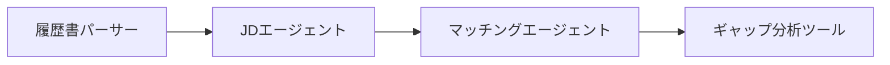
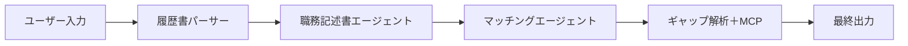

# モジュール 4 - オーケストレーションパターン

⏱️ 約10分

このモジュールでは、Resume Job Fit Evaluatorで使用されているオーケストレーションパターンを探り、ワークフローグラフの読み取り、修正、拡張方法を学びます。これらのパターンを理解することは、データフローの問題をデバッグしたり、自身の[multi-agent workflows](https://learn.microsoft.com/agent-framework/workflows/)を構築したりする上で不可欠です。

---

## パターン1: シーケンシャルチェーン

ワークフローの基本的なパターンは <strong>シーケンシャルチェーン</strong> であり、各エージェントの出力が直接次のエージェントに渡されます。


```mermaid
flowchart LR
    RP[履歴書パーサー] --> JD[JDエージェント]
    JD --> MA[マッチングエージェント]
    MA --> GA[ギャップ分析ツール]
```

コードでは、それぞれの `add_edge()` 呼び出しがチェーンの一歩を作成しています：

```python
.add_edge(resume_executor, jd_executor)       # ResumeParser 出力 → JD Agent
.add_edge(jd_executor, matching_executor)     # JD Agent 出力 → MatchingAgent
.add_edge(matching_executor, gap_executor)    # MatchingAgent 出力 → GapAnalyzer
```

> **なぜシーケンシャルで、ファンアウト/ファンインでないのか？** `WorkflowBuilder` は入力エッジに対して **ORセマンティクス** を使用しています：下流の実行者は<strong>いずれかの</strong>前任者が完了するとすぐに起動します。もし `matching_executor` に二つの入力エッジ（`resume_executor` と `jd_executor`の両方）があった場合、ResumeParserの完了時とJD Agentの完了時に2回トリガーされ、GapAnalyzerも2回実行されて出力が2回表示されてしまいます。シーケンシャルパイプラインはこれを完全に回避します。

## パターン2: コンテンツリレー

`context_mode="last_agent"` は各実行者が<strong>直接の前任者の出力のみ</strong>を見ることを意味するので、シーケンシャルチェーンのエージェントは下流のエージェントが必要とするデータを明示的に渡す必要があります。

このワークフローでは：
- **ResumeParser** はJDをそのまま`[JOB DESCRIPTION PASS-THROUGH]`にコピーします（JD Agentが見つけられるように）。
- **JD Agent** は`[PARSED RESUME]`をそのまま`[PARSED RESUME PASS-THROUGH]`にコピーします（MatchingAgentが両方のプロファイルを比較できるように）。

```
ResumeParser output
└─ [PARSED RESUME]               ← extracted by JD Agent
└─ [JOB DESCRIPTION PASS-THROUGH] ← extracted by JD Agent

JD Agent output
└─ [JD REQUIREMENTS]             ← extracted by MatchingAgent
└─ [PARSED RESUME PASS-THROUGH]  ← extracted by MatchingAgent
```

各リレー部分は<strong>厳密に原文のまま</strong>コピーしなければなりません。要約や言い換えをすると、それに依存する下流のエージェントが動作しなくなります。

---

## 完全なグラフ

シーケンシャルチェーンとコンテンツリレーパターンを組み合わせると、全体のワークフローができます：


```mermaid
flowchart LR
    U[ユーザー入力] --> RP[履歴書パーサー]
    RP --> JD[職務記述書エージェント]
    JD --> MA[マッチングエージェント]
    MA --> GA[ギャップ解析＋MCP]
    GA --> O[最終出力]
```

エージェントインスペクターはローカルでエージェントが実行中の時に、この同じグラフ構造を表示します。スクリーンショットは[モジュール5 - ローカルでテスト](05-test-locally.md)を参照してください。

---

## WorkflowBuilderコードの読み方

完全な `create_workflow()` 関数は [`PersonalCareerCopilot/main.py`](../../../../../workshop/lab02-multi-agent/PersonalCareerCopilot/main.py) にあります。3つの `add_edge()` 呼び出しがシーケンシャルパイプラインを作成します：

| # | エッジ | 効果 |
|---|----------|-------------------------------|
| 1 | `resume_executor → jd_executor` | JD Agentは`[PARSED RESUME]` + `[JOB DESCRIPTION PASS-THROUGH]`を受け取ります |
| 2 | `jd_executor → matching_executor` | MatchingAgentは`[JD REQUIREMENTS]` + `[PARSED RESUME PASS-THROUGH]`を受け取ります |
| 3 | `matching_executor → gap_executor` | GapAnalyzerはフィットレポートとギャップリストを受け取ります |

---

## グラフの修正

### 新しいエージェントの追加

5番目のエージェント（例えばGapAnalyzerの後の **InterviewPrepAgent**）を追加するには：

1. `INTERVIEW_PREP_INSTRUCTIONS` 定数を定義する。
2. `Agent` と `AgentExecutor` オブジェクトを作成する（既存の4つと同じパターンで）。
3. `WorkflowBuilder`に `.add_edge(gap_executor, interview_exec)` を追加する。
4. `output_executors=[interview_exec]` を更新する。

> **重要：** `start_executor` は生のユーザー入力を受け取る唯一のエージェントです。他のすべてのエージェントは上流のエッジの出力を受け取ります。

---

## よくあるグラフの間違い

| 間違い | 症状 | 修正方法 |
|---------|---------|---------|
| `output_executors` へのエッジがない | エージェントは動くが出力が空 | `start_executor`から`output_executors`内のすべてのエージェントにパスがあることを確認する |
| 循環依存 | 無限ループまたはタイムアウト | どのエージェントも上流のエージェントに戻らないことを確認する |
| 入力エッジなしの`output_executors`内エージェント | 出力が空 | 少なくとも一つ`add_edge(source, that_agent)`を追加する |
| ファンインなしで複数の `output_executors` | 出力が一つのエージェントの応答のみ | 集約する単一の出力エージェントを使うか複数出力を受け入れる |
| `start_executor` がない | ビルド時に`ValueError` | `WorkflowBuilder()`で必ず`start_executor`を指定する |

---

## グラフのデバッグ

### エージェントインスペクターの使用

1. F5でエージェントをローカルで起動する。
2. エージェントインスペクターを開く（`Ctrl+Shift+P` → **Foundry Toolkit: Open Agent Inspector**）。
3. テストメッセージを送る。
4. インスペクターの応答パネルで<strong>ストリーミング出力</strong>を探す - 各エージェントの貢献が順番に表示される。


### ロギングの使用

`main.py`にロギングを追加してデータフローを追跡する：

```python
import logging
logger = logging.getLogger("resume-job-fit")

# main() 内で、ワークフローの作成後：
logger.info("Workflow graph built with edges: RP→JD, JD→MA, MA→GA")
```

サーバーログはエージェントの実行順序とMCPツールの呼び出しを表示します：

```
INFO:agent_framework:Executing agent: ResumeParser
INFO:agent_framework:Executing agent: JobDescriptionAgent
INFO:agent_framework:Executing agent: MatchingAgent
INFO:agent_framework:Executing agent: GapAnalyzer
INFO:agent_framework:Tool call: search_microsoft_learn_for_plan(skill="Kubernetes")
POST https://learn.microsoft.com/api/mcp → 200
INFO:agent_framework:Tool call: search_microsoft_learn_for_plan(skill="Terraform")
POST https://learn.microsoft.com/api/mcp → 200
```

---

### チェックポイント

- [ ] ワークフロー内の2つのオーケストレーションパターン（シーケンシャルチェーンとコンテンツリレー）を識別できる
- [ ] `context_mode="last_agent"`がエージェント間で明示的なデータリレーを必要とする理由を理解している
- [ ] `WorkflowBuilder`コードを読み取り、それぞれの`add_edge()`呼び出しを視覚的なグラフに対応させられる
- [ ] パイプラインの最後に新しいエージェントを追加する方法を知っている
- [ ] よくあるグラフの間違いとその症状を識別できる

---

**前へ：** [03 - エージェントと環境の設定](03-configure-agents.md) · **次へ：** [05 - ローカルでテスト →](05-test-locally.md)

---

<!-- CO-OP TRANSLATOR DISCLAIMER START -->
**免責事項**：
本書類は AI 翻訳サービス [Co-op Translator](https://github.com/Azure/co-op-translator) を使用して翻訳されています。正確性を期していますが、自動翻訳には誤りや不正確な部分が含まれる可能性があることをご承知おきください。原文の原語版が正式な情報源とみなされるべきです。重要な情報については、専門の人間による翻訳を推奨します。本翻訳の利用により生じたいかなる誤解や解釈違いについても、当方は責任を負いかねます。
<!-- CO-OP TRANSLATOR DISCLAIMER END -->