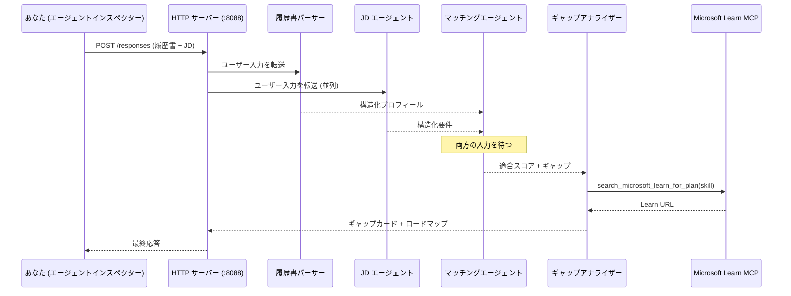
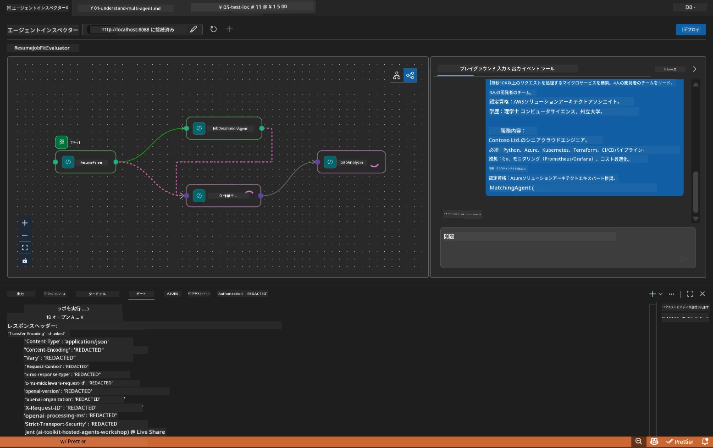

# Module 5 - ローカルでテストする（マルチエージェント）

このモジュールでは、マルチエージェントワークフローをローカルで実行し、Agent Inspectorでテストし、4つのエージェントとMCPツールがすべて正しく動作していることを確認してからFoundryへデプロイします。

### ローカルテスト実行時の動作


---

## ステップ 1: エージェントサーバーを起動する

### オプション A: VS Codeタスクを使用する（推奨）

1. `Ctrl+Shift+P`を押す → **Tasks: Run Task** を入力 → **Run Lab02 HTTP Server** を選択します。
2. タスクはdebugpyをポート`5679`で接続し、エージェントをポート`8088`でサーバーを起動します。
3. 出力に以下が表示されるまで待ちます。

```
INFO:resume-job-fit:Starting Resume -> Job Fit Evaluator HTTP server...
INFO:resume-job-fit:Server running on http://localhost:8088
```

### オプション B: ターミナルで手動で起動する

```powershell
cd workshop\lab02-multi-agent\PersonalCareerCopilot
```

仮想環境を有効化します：

**PowerShell（Windows）:**
```powershell
.\.venv\Scripts\Activate.ps1
```

**macOS/Linux:**
```bash
source .venv/bin/activate
```

サーバーを起動します：

```powershell
python -m debugpy --listen 127.0.0.1:5679 -m agentdev run main.py --verbose --port 8088
```

### オプション C: F5を使う（デバッグモード）

1. `F5`を押すか、<strong>実行とデバッグ</strong>（`Ctrl+Shift+D`）に移動します。
2. ドロップダウンから **Lab02 - Multi-Agent** の起動構成を選択します。
3. サーバーはブレークポイント対応で起動します。

> **ヒント:** デバッグモードでは、`search_microsoft_learn_for_plan()`内にブレークポイントを設定してMCPの応答を調査したり、エージェントの指示文字列内にブレークポイントを置いて各エージェントが受け取る内容を確認できます。

---

## ステップ 2: Agent Inspectorを開く

1. `Ctrl+Shift+P`を押して **Foundry Toolkit: Open Agent Inspector** を入力します。
2. Agent Inspectorがブラウザタブで`http://localhost:5679`にて開きます。
3. エージェントのインターフェイスがメッセージを受け付ける準備ができているのが見えます。

> **Agent Inspectorが開かない場合:** サーバーが完全に起動しているか（「Server running」ログが表示されているか）を確認してください。ポート5679が使用中の場合は[Module 8 - トラブルシューティング](08-troubleshooting.md)を参照してください。

---

## ステップ 3: スモークテストを実行する

以下の3つのテストを順に実行します。テストは段階的にワークフローの範囲を広げます。

### テスト 1: 基本の履歴書＋職務記述

Agent Inspectorに以下を貼り付けます：

```
Resume:
Jane Doe
Senior Software Engineer with 5 years of experience in Python, Django, and AWS.
Built microservices handling 10K+ requests/second. Led a team of 4 developers.
Certifications: AWS Solutions Architect Associate.
Education: B.S. Computer Science, State University.

Job Description:
Senior Cloud Engineer at Contoso Ltd.
Required: Python, Azure, Kubernetes, Terraform, CI/CD pipelines.
Preferred: Go, monitoring (Prometheus/Grafana), cost optimization.
Experience: 5+ years in cloud infrastructure.
Certifications: Azure Solutions Architect Expert preferred.
```

**期待される出力構造：**

応答には4つのエージェントすべての出力が順に含まれている必要があります：

1. **Resume Parserの出力** - スキルがカテゴリ別に整理された構造化された候補者プロフィール
2. **JD Agentの出力** - 必須 vs 推奨スキルが分けられた構造化要件
3. **Matching Agentの出力** - 内訳つきの適合スコア（0-100）、一致スキル、欠落スキル、ギャップ
4. **Gap Analyzerの出力** - 欠落スキルごとに個別のギャップカード、それぞれにMicrosoft LearnのURL付き



### テスト 1で確認するポイント

| チェック項目 | 期待値 | 合格？ |
|-------------|---------|-------|
| 応答に適合スコアが含まれる | 0-100の数値＋内訳付き | |
| 一致したスキルが記載されている | Python、CI/CD（部分的）、など | |
| 欠落スキルが記載されている | Azure、Kubernetes、Terraformなど | |
| 欠落スキルごとにギャップカードがある | スキルごとに1枚ずつ | |
| Microsoft LearnのURLが含まれる | 本物の`learn.microsoft.com`リンク | |
| エラーメッセージがない | クリーンで構造化された出力 | |

### テスト 2: MCPツールの実行を確認する

テスト1の実行中に<strong>サーバーターミナル</strong>でMCPのログエントリを確認します：

```
GET https://learn.microsoft.com/api/mcp → 405 (Method Not Allowed)
POST https://learn.microsoft.com/api/mcp → 200
DELETE https://learn.microsoft.com/api/mcp → 405 (Method Not Allowed)
```

| ログエントリ | 意味 | 期待されるか？ |
|--------------|-------|-----------------|
| `GET ... → 405` | MCPクライアントが初期化時にGETで試行 | はい - 正常 |
| `POST ... → 200` | Microsoft Learn MCPサーバーへの実際のツールコール | はい - 本当の呼び出し |
| `DELETE ... → 405` | MCPクライアントがクリーンアップ時にDELETEで試行 | はい - 正常 |
| `POST ... → 4xx/5xx` | ツールコールが失敗した | いいえ - [トラブルシューティング](08-troubleshooting.md)を参照 |

> **重要:** `GET 405`と`DELETE 405`の行は<strong>正常な動作</strong>です。`POST`呼び出しが200以外のステータスコードを返した場合のみ注意してください。

### テスト 3: エッジケース - 高適合候補者

JDに非常に近い履歴書を貼り付けてGapAnalyzerが高適合ケースを正しく処理するか確認します：

```
Resume:
Alex Chen
Senior Cloud Engineer with 7 years of experience.
Skills: Python, Azure (AKS, Functions, DevOps), Kubernetes, Terraform, CI/CD (GitHub Actions, Azure Pipelines), Go, Prometheus, Grafana, cost optimization.
Certifications: Azure Solutions Architect Expert, Azure DevOps Engineer Expert.
Led infrastructure migration to Azure for 3 enterprise clients.
Education: M.S. Computer Science, Tech University.

Job Description:
Senior Cloud Engineer at Contoso Ltd.
Required: Python, Azure, Kubernetes, Terraform, CI/CD pipelines.
Preferred: Go, monitoring (Prometheus/Grafana), cost optimization.
Experience: 5+ years in cloud infrastructure.
Certifications: Azure Solutions Architect Expert preferred.
```

**期待される動作：**
- 適合スコアは<strong>80以上</strong>（ほとんどのスキルが一致）
- ギャップカードは基礎学習ではなく、ブラッシュアップや面接準備に焦点を当てる
- GapAnalyzerの指示には「適合≥80ならブラッシュアップや面接準備に焦点を当てる」と記載されている

---

## ステップ 4: 出力の完全性を確認する

テスト実行後、以下の基準を満たしているか確認します：

### 出力構造チェックリスト

| セクション | エージェント | 存在するか？ |
|------------|--------------|--------------|
| 候補者プロフィール | Resume Parser | |
| 技術スキル（グループ化済み） | Resume Parser | |
| 役割の概要 | JD Agent | |
| 必須スキル vs 推奨スキル | JD Agent | |
| 適合スコア（内訳付き） | Matching Agent | |
| 一致／欠落／部分スキル | Matching Agent | |
| 欠落スキルごとのギャップカード | Gap Analyzer | |
| ギャップカード内のMicrosoft Learn URL | Gap Analyzer (MCP) | |
| 学習順序（番号付き） | Gap Analyzer | |
| タイムライン概要 | Gap Analyzer | |

### この段階でのよくある問題

| 問題 | 原因 | 対策 |
|-------|-------|-------|
| ギャップカードが1枚だけ（残り切れている） | GapAnalyzer指示にCRITICALブロックが抜けている | `GAP_ANALYZER_INSTRUCTIONS`に`CRITICAL:`の段落を追加 - [Module 3](03-configure-agents.md)参照 |
| Microsoft LearnのURLがない | MCPエンドポイントに接続できていない | インターネット接続を確認。`.env`の`MICROSOFT_LEARN_MCP_ENDPOINT`が`https://learn.microsoft.com/api/mcp`か検証 |
| 空の応答 | `PROJECT_ENDPOINT` または `MODEL_DEPLOYMENT_NAME` が設定されていない | `.env`の値をチェック。ターミナルで`echo $env:PROJECT_ENDPOINT`を実行 |
| 適合スコアが0または欠落 | MatchingAgentに上流データが届いていない | `create_workflow()`に`add_edge(resume_parser, matching_agent)`と`add_edge(jd_agent, matching_agent)`があるか確認 |
| エージェントが起動直後に終了する | インポートエラーまたは依存関係不足 | もう一度`pip install -r requirements.txt`を実行。ターミナルのスタックトレースを確認 |
| `validate_configuration`エラー | 環境変数の不足 | `.env`を作成し`PROJECT_ENDPOINT=<your-endpoint>`と`MODEL_DEPLOYMENT_NAME=<your-model>`を設定 |

---

## ステップ 5: 自分のデータでテストする（任意）

自分の履歴書と実際の職務記述を貼り付けてみてください。これにより以下を検証できます：

- エージェントが異なる履歴書フォーマット（時系列、機能別、ハイブリッド）に対応できるか
- JD Agentが異なるJDスタイル（箇条書き、段落、構造化）を処理できるか
- MCPツールが実際のスキルに対して関連リソースを返すか
- ギャップカードがあなたの経歴にパーソナライズされているか

> **プライバシーの注意:** ローカルでテストする場合、データはマシン内に留まり、Azure OpenAIのデプロイにのみ送信されます。ワークショップインフラでログや保存はされません。実名の代わりにプレースホルダー名（例："Jane Doe"）の使用を推奨します。

---

### チェックポイント

- [ ] ポート`8088`でサーバーが正常に起動（ログに「Server running」が表示される）
- [ ] Agent Inspectorが開き、エージェントに接続されている
- [ ] テスト 1：適合スコア、一致・欠落スキル、ギャップカード、Microsoft LearnのURLが含まれた完全な応答
- [ ] テスト 2：MCPログに`POST ... → 200`が表示（ツール呼び出し成功）
- [ ] テスト 3：高適合候補者が80以上のスコアとブラッシュアップ中心の推奨を取得
- [ ] 全てのギャップカードが存在（欠落スキルごとに1枚、切れていない）
- [ ] サーバーターミナルにエラーやスタックトレースがない

---

**前へ:** [04 - オーケストレーションパターン](04-orchestration-patterns.md) · **次へ:** [06 - Foundryへデプロイ →](06-deploy-to-foundry.md)

---

<!-- CO-OP TRANSLATOR DISCLAIMER START -->
**免責事項**:  
本書類はAI翻訳サービス [Co-op Translator](https://github.com/Azure/co-op-translator) を使用して翻訳されています。正確性を期しておりますが、自動翻訳には誤りや不正確な部分が含まれる可能性があります。原文の母国語での文書が権威ある情報源とみなされるべきです。重要な情報については、専門の人間による翻訳を推奨します。本翻訳の使用により生じた誤解や誤訳について、当方は一切の責任を負いかねます。
<!-- CO-OP TRANSLATOR DISCLAIMER END -->