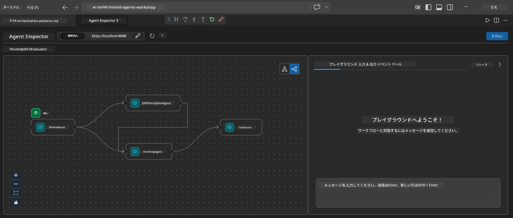
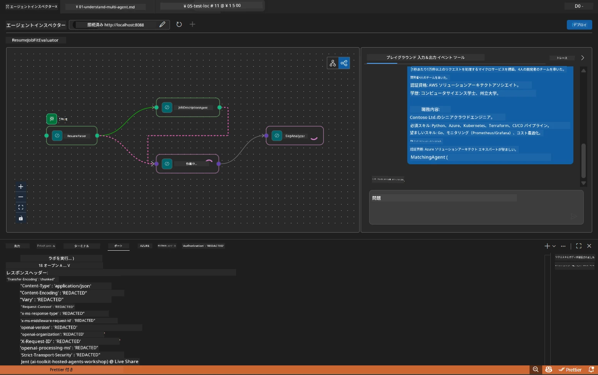
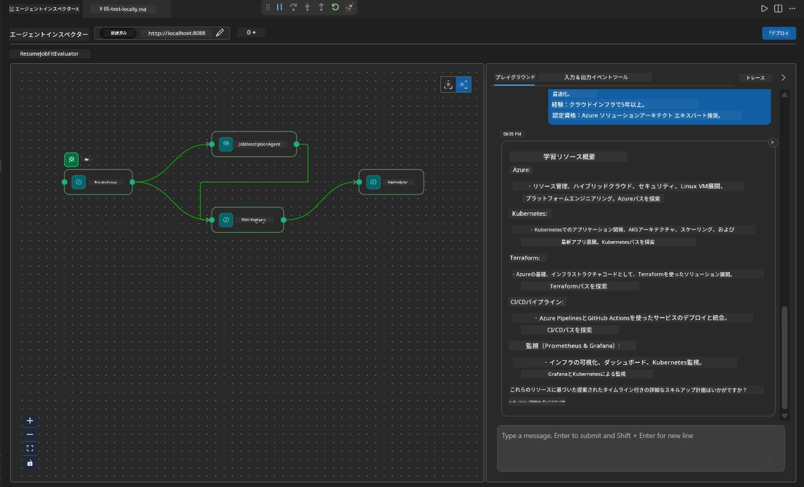

# モジュール 5 - ローカルでテスト

⏱️ 約15分

このモジュールでは、マルチエージェントワークフローをローカルで実行し、Agent Inspectorでテストし、4つのエージェントとMCPツールが正しく動作することを確認してからデプロイします。

---

## ステップ 1: エージェントサーバーを起動

### オプションA: VS Codeタスクの使用（推奨）

1. `workshop/lab02-multi-agent/PersonalCareerCopilot/` をVS Codeのフォルダーとして開きます。
2. `Ctrl+Shift+P` を押して **Tasks: Run Task** と入力し、**Run Agent HTTP Server** を選択します。
3. タスクが、デバッグpyをポート `5679` でアタッチし、エージェントをポート `8088` で起動します。
4. 出力に以下が表示されるまで待ちます：

```
INFO:resume-job-fit:Starting Resume -> Job Fit Evaluator HTTP server...
INFO:resume-job-fit:Server running on http://localhost:8088
```

### オプションB: F5（デバッグモード）の使用

1. `F5` を押し、**Debug Local Agent HTTP Server** を選択します。
2. サーバーがフルブレークポイントサポート付きで起動します。MCP応答やエージェント出力の確認に便利です。

---

## ステップ 2: Agent Inspectorを開く

1. `Ctrl+Shift+P` を押し、**Foundry Toolkit: Open Agent Inspector** と入力します。
2. Agent InspectorがVS Codeパネルとして開き、`http://localhost:8088` に接続されます。
3. エージェントのインターフェースがメッセージを受け取る準備ができているはずです。



> **Agent Inspectorが開かない場合:** サーバーが完全に起動していることを確認してください（「Server running」のログを表示）。ポート5679が使用中の場合は、[モジュール 8 - トラブルシューティング](08-troubleshooting.md)を参照してください。

---

## ステップ 2b: （オプション）Workflow Visualizerを開く

Foundry Toolkitには、エージェントの相互作用をリアルタイムで表示する<strong>Workflow Visualizer</strong>があります。これは特にマルチエージェントのデバッグに役立ちます。

1. `Ctrl+Shift+P` を押し、**Foundry Toolkit: Open Visualizer for Hosted Agents** と入力します。
2. 実行中のグラフを示す新しいVS Codeタブが開きます。
3. Agent Inspectorでメッセージを送信すると、ビジュアライザーは自動で更新されます。緑のノードは完了したエージェントを示し、アニメーション付きのエッジはデータフローを示します。

> **ポート競合:** すでにビジュアライザーポートが使用されている場合は、VS Codeの設定 → **Extensions** → **Microsoft Foundry Configuration** → **Hosted Agents: Visualizer Port** で変更してください。

---

## ステップ 3: スモークテストを実行

以下の3つのテストを順に実行します。各テストはワークフローを段階的に検証します。

### テスト1: 基本的な履歴書＋職務記述書

次の内容をAgent Inspectorに貼り付けます：

```
Resume:
Jane Doe
Senior Software Engineer with 5 years of experience in Python, Django, and AWS.
Built microservices handling 10K+ requests/second. Led a team of 4 developers.
Certifications: AWS Solutions Architect Associate.
Education: B.S. Computer Science, State University.

Job Description:
Senior Cloud Engineer at Contoso Ltd.
Required: Python, Azure, Kubernetes, Terraform, CI/CD pipelines.
Preferred: Go, monitoring (Prometheus/Grafana), cost optimization.
Experience: 5+ years in cloud infrastructure.
Certifications: Azure Solutions Architect Expert preferred.
```

**期待される出力構造：**

応答には4つのエージェントの出力が順番に含まれるべきです：

1. **Resume Parser出力** - 2つのラベル付きセクション：`[PARSED RESUME]`（候補者プロファイルとスキルのグルーピング）、`[JOB DESCRIPTION PASS-THROUGH]`（JDエージェントに渡す職務記述の原文）
2. **JD Agent出力** - 必須スキルと優遇スキルを分けた構造化要件
3. **Matching Agent出力** - 0-100の適合スコアと内訳、適合したスキル、欠如スキル、ギャップ
4. **Gap Analyzer出力** - 欠如スキルごとに個別のギャップカード、Microsoft LearnのURL付き





### テスト1で確認すべきこと

| 確認 | 期待値 | 合格？ |
|-------|----------|-------|
| 適合スコアが含まれている | 0-100の範囲の数値と内訳 | |
| 適合スキルがリストされている | Python、CI/CD（一部）、など | |
| 欠如スキルがリストされている | Azure、Kubernetes、Terraform、など | |
| 欠如スキルごとにギャップカードがある | スキル1つにつき1枚のカード | |
| Microsoft LearnのURLが存在する | 実際の `learn.microsoft.com` のリンク | |
| 応答にエラーメッセージがない | クリーンで構造化された出力 | |

### テスト2: エッジケース - 高適合候補者

JDに非常に近い履歴書を貼り付けて、GapAnalyzerが高適合シナリオを扱うか検証します：

```
Resume:
Alex Chen
Senior Cloud Engineer with 7 years of experience.
Skills: Python, Azure (AKS, Functions, DevOps), Kubernetes, Terraform, CI/CD (GitHub Actions, Azure Pipelines), Go, Prometheus, Grafana, cost optimization.
Certifications: Azure Solutions Architect Expert, Azure DevOps Engineer Expert.
Led infrastructure migration to Azure for 3 enterprise clients.
Education: M.S. Computer Science, Tech University.

Job Description:
Senior Cloud Engineer at Contoso Ltd.
Required: Python, Azure, Kubernetes, Terraform, CI/CD pipelines.
Preferred: Go, monitoring (Prometheus/Grafana), cost optimization.
Experience: 5+ years in cloud infrastructure.
Certifications: Azure Solutions Architect Expert preferred.
```

**期待される動作：**
- 適合スコアは **80以上**（ほとんどのスキルが一致）
- ギャップカードは基礎学習よりも実践向け準備に重点を置く
- GapAnalyzerの指示は「適合度80以上の場合は実践・面接準備に注力する」と記載

---

## ステップ 4: 自分のデータでテスト（オプション）

自分の履歴書と実際の職務記述を貼り付けて試してください。これにより以下を確認できます：

- エージェントが異なる履歴書形式（年代順、機能別、ハイブリッド）を扱えること
- JDエージェントが異なるJDスタイル（箇条書き、段落、構造化）を処理できること
- MCPツールが実際のスキルに関連するリソースを返すこと
- ギャップカードが特定の経歴にパーソナライズされていること

> **プライバシー - パスA（Foundryクラウド）：** 履歴書と職務記述のテキストは推論のためAzure OpenAIデプロイメントに送信されますが、ワークショップの基盤でログや保存はされません。名前は「Jane Doe」などの仮名を使用してもかまいません。
>
> **プライバシー - パスB（Foundryローカル）：** 4つのエージェントの推論はすべて端末上で完結します。履歴書や職務記述テキストは<strong>端末外に一切出ません</strong>。唯一の外部呼び出しは、MCPツールが `https://learn.microsoft.com/api/mcp` からスキル名のみを送ってリソースを得ることです。個人情報は含まれません。

---

### チェックポイント

- [ ] ポート `8088` でサーバーが正常に起動している（ログに「Server running」が表示されている）
- [ ] Agent Inspectorが開き、エージェントに接続されている
- [ ] テスト1：適合スコア、適合/欠如スキル、ギャップカード、Microsoft Learnリンクを含む完全な応答
- [ ] テスト2：高適合候補者に対して80以上のスコアが付き、実践準備中心の推奨が得られる
- [ ] すべてのギャップカードが存在する（欠如スキル1つにつき1枚、切り捨てなし）
- [ ] サーバー端末にエラーやスタックトレースがない

---

**前へ:** [04 - オーケストレーションパターン](04-orchestration-patterns.md) · **次へ:** [06 - Foundryへのデプロイ →](06-deploy-to-foundry.md)

---

<!-- CO-OP TRANSLATOR DISCLAIMER START -->
**免責事項**：
本書類は AI 翻訳サービス [Co-op Translator](https://github.com/Azure/co-op-translator) を使用して翻訳されています。正確性を期していますが、自動翻訳には誤りや不正確な部分が含まれる可能性があることをご承知おきください。原文の原語版が正式な情報源とみなされるべきです。重要な情報については、専門の人間による翻訳を推奨します。本翻訳の利用により生じたいかなる誤解や解釈違いについても、当方は責任を負いかねます。
<!-- CO-OP TRANSLATOR DISCLAIMER END -->