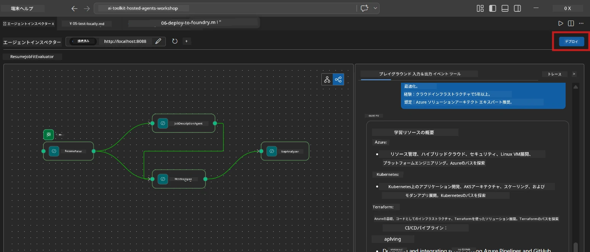
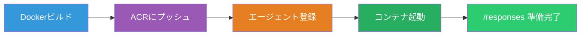
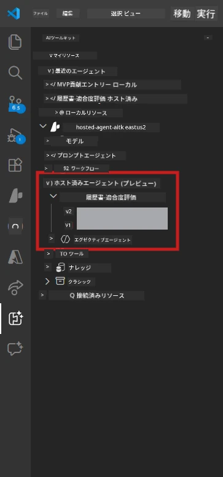

# Module 6 - Foundry Agent Serviceへのデプロイ

このモジュールでは、ローカルでテストしたマルチエージェントワークフローを[Microsoft Foundry](https://learn.microsoft.com/azure/foundry/agents/concepts/hosted-agents)に<strong>ホストエージェント</strong>としてデプロイします。デプロイプロセスはDockerコンテナイメージをビルドし、それを[Azure Container Registry (ACR)](https://learn.microsoft.com/azure/container-registry/container-registry-intro)にプッシュし、[Foundry Agent Service](https://learn.microsoft.com/azure/foundry/agents/how-to/publish-agent)でホストエージェントのバージョンを作成します。

> **Lab 01との主な違い:** デプロイプロセスは同一です。Foundryはマルチエージェントワークフローを単一のホストエージェントとして扱います。複雑さはコンテナ内にあり、デプロイ対象は同じ`/responses`エンドポイントです。

---

## 事前準備の確認

デプロイ前に以下すべてを確認してください。

1. **エージェントがローカルスモークテストに合格していること:**
   - [Module 5](05-test-locally.md)の3つのテストすべてを完了し、ワークフローがギャップカードとMicrosoft LearnのURLを含む完全な出力を生成した。

2. **[Azure AI User](https://learn.microsoft.com/azure/foundry/concepts/rbac-foundry) ロールを持っていること:**
   - [Lab 01, Module 2](../../lab01-single-agent/docs/02-create-foundry-project.md)で割り当て済み。確認方法は以下：
   - [Azure Portal](https://portal.azure.com) → ご自身のFoundry <strong>プロジェクト</strong>リソース → **アクセス制御 (IAM)** → <strong>ロールの割り当て</strong> → ご自身のアカウントに<strong>[Azure AI User](https://aka.ms/foundry-ext-project-role)</strong>があるか確認。

3. **VS CodeでAzureにサインインしていること:**
   - VS Code左下のアカウントアイコンを確認。自分のアカウント名が表示されているはず。

4. **`agent.yaml`に正しい値が設定されていること:**
   - `PersonalCareerCopilot/agent.yaml`を開き、次を確認:
     ```yaml
     environment_variables:
       - name: PROJECT_ENDPOINT
         value: ${PROJECT_ENDPOINT}
       - name: MODEL_DEPLOYMENT_NAME
         value: ${MODEL_DEPLOYMENT_NAME}
     ```
   - これらは`main.py`が読む環境変数と一致している必要があります。

5. **`requirements.txt`に正しいバージョンがあること:**
   ```
   agent-framework-azure-ai==1.0.0rc3
   agent-framework-core==1.0.0rc3
   azure-ai-agentserver-agentframework==1.0.0b16
   azure-ai-agentserver-core==1.0.0b16
   debugpy
   agent-dev-cli --pre
   ```

---

## ステップ1：デプロイ開始

### オプションA：Agent Inspectorからデプロイ（推奨）

Agent Inspectorを開いた状態でF5実行中の場合：

1. Agent Inspectorパネルの<strong>右上</strong>を確認。
2. <strong>Deploy</strong>ボタン（上向き矢印↑付きのクラウドアイコン）をクリック。
3. デプロイウィザードが開きます。



### オプションB：コマンドパレットからデプロイ

1. `Ctrl+Shift+P`で<strong>コマンドパレット</strong>を開く。
2. 「Microsoft Foundry: Deploy Hosted Agent」と入力して選択。
3. デプロイウィザードが開きます。

---

## ステップ2：デプロイの設定

### 2.1 対象プロジェクトの選択

1. ドロップダウンにFoundryのプロジェクト一覧が表示されます。
2. ワークショップで使ったプロジェクト（例：`workshop-agents`）を選択。

### 2.2 コンテナエージェントファイルの選択

1. エージェントエントリポイントの選択を求められます。
2. `workshop/lab02-multi-agent/PersonalCareerCopilot/`へ移動し、**`main.py`**を選択します。

### 2.3 リソースの設定

| 設定 | 推奨値 | メモ |
|---------|------------------|-------|
| **CPU** | `0.25` | デフォルト。モデル呼び出しはI/O待ちが多いためマルチエージェントでもCPUは多く不要 |
| <strong>メモリ</strong> | `0.5Gi` | デフォルト。大規模データ処理ツールを加える場合は`1Gi`に増やす |

---

## ステップ3：確認とデプロイ

1. ウィザードにデプロイ概要が表示されます。
2. 内容を確認し、<strong>Confirm and Deploy</strong>をクリック。
3. VS Codeで進捗を確認します。

### デプロイ中の動作

VS Codeの<strong>Output</strong>パネル（「Microsoft Foundry」ドロップダウンを選択）を監視してください：


1. **Dockerビルド** - `Dockerfile`からコンテナを作成します：
   ```
   Step 1/6 : FROM python:3.14-slim
   Step 2/6 : WORKDIR /app
   ...
   Successfully built abc123def456
   ```

2. **Dockerプッシュ** - 画像をACRにプッシュ（初回は1～3分程度かかります）。

3. <strong>エージェント登録</strong> - Foundryが`agent.yaml`のメタデータを使ってホストエージェントを作成。エージェント名は`resume-job-fit-evaluator`。

4. <strong>コンテナ起動</strong> - Foundryの管理インフラでシステム管理ID付きでコンテナが起動。

> <strong>初回デプロイは遅い</strong>（Dockerは全レイヤーをプッシュするため）。2回目以降はキャッシュ利用で高速化。

### マルチエージェント特有の注意点

- **4つのエージェントは1つのコンテナに収まっている**。Foundryは単一ホストエージェントとして扱い、WorkflowBuilderグラフは内部で動く。
- **MCP呼び出しは外部に出る**。コンテナは`https://learn.microsoft.com/api/mcp`へアクセスするためのインターネット接続が必要。Foundryの管理インフラが標準で提供。
- **[Managed Identity](https://learn.microsoft.com/python/api/overview/azure/identity-readme#managed-identity-support)。** ホスト環境では`main.py`の`get_credential()`が自動的に`ManagedIdentityCredential()`を返す（`MSI_ENDPOINT`が設定されているため）。

---

## ステップ4：デプロイ状況の確認

1. <strong>Microsoft Foundry</strong>サイドバーを開く（アクティビティバーのFoundryアイコンをクリック）。
2. プロジェクトの下の<strong>Hosted Agents (Preview)</strong>を展開。
3. **resume-job-fit-evaluator**（またはご自身のエージェント名）を探す。
4. エージェント名をクリック → バージョン（例：`v1`）を展開。
5. バージョンを選択 → **Container Details** → <strong>Status</strong>を確認：



| ステータス | 意味 |
|--------|---------|
| **Started** / **Running** | コンテナが起動中。エージェントは準備完了 |
| **Pending** | コンテナ起動中（30～60秒待機してください） |
| **Failed** | コンテナの起動に失敗（ログを確認してください。下記参照） |

> <strong>マルチエージェントの起動はシングルより遅い</strong>。コンテナは起動時に4つのエージェントインスタンスを作成するため。「Pending」が最大2分続くのは正常です。

---

## よくあるデプロイエラーと対処法

### エラー1: Permission denied - `agents/write`

```
Error: lacks the required data action 
Microsoft.CognitiveServices/accounts/AIServices/agents/write
```

**対処:** プロジェクトレベルで<strong>[Azure AI User](https://learn.microsoft.com/azure/foundry/concepts/rbac-foundry)</strong>ロールを割り当てること。[Module 8 - Troubleshooting](08-troubleshooting.md)に手順あり。

### エラー2: Dockerが起動していない

```
Error: Docker build failed / Cannot connect to Docker daemon
```

**対処:**
1. Docker Desktopを起動。
2. 「Docker Desktop is running」になるまで待つ。
3. `docker info`で動作確認。
4. **Windowsの場合:** Docker Desktop設定でWSL 2バックエンドが有効か確認。
5. 再試行。

### エラー3: Dockerビルド時にpip install失敗

```
Error: Could not find a version that satisfies the requirement agent-dev-cli
```

**対処:** `requirements.txt`の`--pre`フラグはDockerでの扱いが異なる。必ず次のようにする：
```
agent-dev-cli --pre
```

もしDockerでまだ失敗する場合は、`pip.conf`を作成するか、ビルド引数で`--pre`を渡してください。[Module 8](08-troubleshooting.md)参照。

### エラー4: ホストエージェント内でMCPツールが失敗

Gap Analyzerがデプロイ後にMicrosoft Learn URLを生成しなくなった場合：

**原因:** コンテナからのHTTPS外部通信がネットワークポリシーで遮断されている可能性。

**対処:**
1. Foundryの標準設定では通常発生しません。
2. 起きる場合、Foundryプロジェクトの仮想ネットワークがNSGでHTTPSアウトバウンドを遮断していないか確認してください。
3. MCPツールはフォールバックURLを備えているため、ライブURLなしで出力は生成されます。

---

### チェックポイント

- [ ] VS Codeでデプロイコマンドがエラーなく完了した
- [ ] エージェントがFoundryサイドバーの<strong>Hosted Agents (Preview)</strong>に表示されている
- [ ] エージェント名は`resume-job-fit-evaluator`（または指定した名前）
- [ ] コンテナステータスが<strong>Started</strong>か<strong>Running</strong>になっている
- [ ] （エラーがあれば）原因を特定し修正して再デプロイ成功

---

**前へ:** [05 - ローカルでテスト](05-test-locally.md) · **次へ:** [07 - Playgroundで検証 →](07-verify-in-playground.md)

---

<!-- CO-OP TRANSLATOR DISCLAIMER START -->
**免責事項**:  
本書類はAI翻訳サービス [Co-op Translator](https://github.com/Azure/co-op-translator) を使用して翻訳されています。正確さを期していますが、自動翻訳には誤りや不正確な部分が含まれる可能性があります。原文の母国語版が正式な情報源として考慮されるべきです。重要な情報については、専門の人間翻訳を推奨します。本翻訳の利用に起因するいかなる誤解や誤訳についても責任を負いかねます。
<!-- CO-OP TRANSLATOR DISCLAIMER END -->