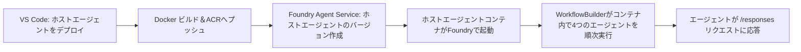
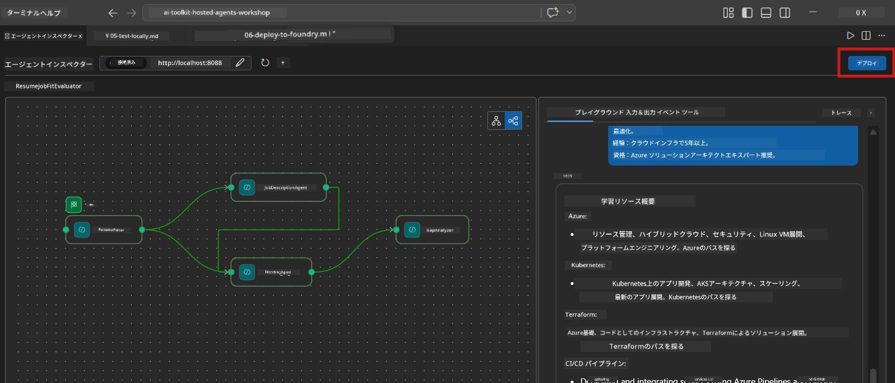
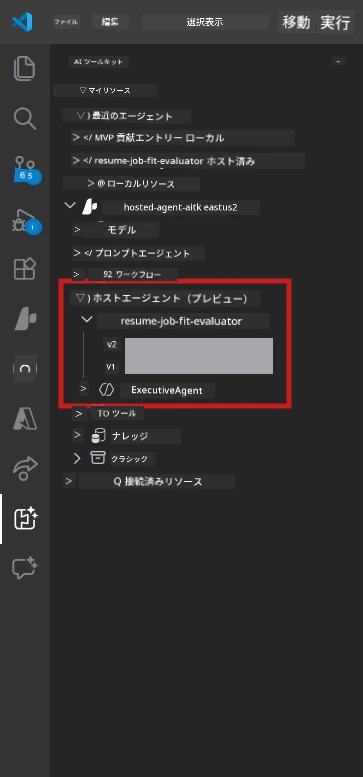

# モジュール 6 - Foundry Agent Service へデプロイ

⏱️ 約10分

このモジュールでは、ローカルでテストされたマルチエージェントワークフローを [Microsoft Foundry](https://learn.microsoft.com/azure/foundry/agents/concepts/hosted-agents) に <strong>ホスト型エージェント</strong> としてデプロイします。デプロイプロセスでは、Dockerコンテナイメージをビルドし、[Azure Container Registry (ACR)](https://learn.microsoft.com/azure/container-registry/container-registry-intro) にプッシュし、[Foundry Agent Service](https://learn.microsoft.com/azure/foundry/agents/how-to/publish-agent) でホスト型エージェントのバージョンを作成します。

> **ラボ01との重要な違い:** デプロイプロセスは同じです。Foundryはマルチエージェントワークフローを単一のホスト型エージェントとして扱います。複雑さはコンテナ内にありますが、デプロイするエンドポイントは同じ `/responses` です。

### デプロイパイプライン


```mermaid
flowchart LR
    A[VS Code: ホストエージェントをデプロイ] --> B[Docker ビルド＆ACRへプッシュ]
    B --> C[Foundry Agent Service: ホストエージェントのバージョン作成]
    C --> D[ホストエージェントコンテナがFoundryで起動]
    D --> E[WorkflowBuilderがコンテナ内で4つのエージェントを順次実行]
    E --> F[エージェントが /responses リクエストに応答]
```

---

## 前提条件の確認

デプロイ前に以下の項目を確認してください：

1. **エージェントがローカルのスモークテストに合格していること：**
   - [モジュール5](05-test-locally.md) の3つのテストすべてを完了し、ギャップカードとMicrosoft LearnのURLを含む完全な出力が生成されたこと。

2. **[Foundry User](https://learn.microsoft.com/azure/foundry/concepts/rbac-foundry) ロールを持っていること**（デプロイには最低でもプロジェクトスコープの **Foundry Project Manager** が必要です）：

   > **補足:** FoundryのRBACロールは最近名前が変更されました。**Foundry User**、**Foundry Owner**、**Foundry Project Manager** は以前は Azure AI User、Azure AI Owner、Azure AI Project Manager と呼ばれていました。ロールIDや権限は変更されていません。

   - [Azureポータル](https://portal.azure.com) → Foundryの<strong>プロジェクト</strong>リソース → **アクセス制御 (IAM)** → <strong>ロールの割り当て</strong> → アカウントに **Foundry User**（またはそれ以上）がリストされていることを確認してください。

3. **VS CodeでAzureにサインインしていること：**
   - VS Codeの左下のアカウントアイコンを確認し、アカウント名が表示されていることを確認してください。

4. **`agent.yaml` に正しい値が設定されていること：**
   - `PersonalCareerCopilot/agent.yaml` を開き、以下を確認してください：
     ```yaml
     environment_variables:
       - name: AZURE_AI_MODEL_DEPLOYMENT_NAME
         value: ${AZURE_AI_MODEL_DEPLOYMENT_NAME}
     ```
   - `FOUNDRY_PROJECT_ENDPOINT` はここに記載されていません。Foundryがランタイムに注入します。宣言が必要なのは `AZURE_AI_MODEL_DEPLOYMENT_NAME` のみです。

5. **`requirements.txt` に正しいバージョンが設定されていること：**
   ```
   agent-framework-foundry
   agent-framework-foundry-hosting
   mcp<2,>=1.24.0
   debugpy
   ```

---

## ステップ 1: デプロイの開始

### オプションA: Agent Inspector からデプロイ（推奨）

エージェントがF5で実行中でAgent Inspectorが開いている場合：

1. Agent Inspectorパネルの<strong>右上隅</strong>を見てください。
2. **Deploy** ボタン（上向き矢印 ↑ の雲アイコン）をクリックします。
3. デプロイウィザードが開きます。



### オプションB: コマンドパレットからデプロイ

1. `Ctrl+Shift+P` を押して<strong>コマンドパレット</strong>を開きます。
2. 「Foundry Toolkit: Deploy Hosted Agent」と入力して選択します。
3. デプロイウィザードが開きます。

---

## ステップ 2: デプロイの構成

### 2.1 ターゲットプロジェクトの選択

1. Foundryのプロジェクトがドロップダウンで表示されます。
2. ワークショップ全体で使用したプロジェクトを選択します（例：`workshop-agents`）。

### 2.2 コンテナエージェントファイルの選択

1. エージェントのエントリポイントを選択するよう求められます。
2. `workshop/lab02-multi-agent/PersonalCareerCopilot/` に移動して **`main.py`** を選択します。

### 2.3 リソースの設定

| 設定 | 推奨値 | 備考 |
|---------|------------------|-------|
| <strong>デプロイ方法</strong> | <strong>コンテナ</strong>（推奨）または <strong>コード</strong> | コンテナはDockerイメージをビルド。コードはソースをZIPでアップロード（プレビュー） |
| <strong>コンテナレジストリ</strong> | **デフォルトのACR** | Foundryが作成し管理します |
| **CPU** | `0.25` | デフォルト。マルチエージェントワークフローはモデル呼び出しがI/Oバウンドのため多くのCPUは不要です |
| <strong>メモリ</strong> | `0.5Gi` | デフォルト。大きなデータ処理ツールを追加する場合は `1Gi` に増やしてください |

---

## ステップ 3: 確認とデプロイ

1. ウィザードにデプロイ要約が表示されます。
2. レビューして **Confirm and Deploy** をクリックします。
3. VS Codeで進捗を監視します。

### デプロイ中に何が起こるか

VS Codeの **Output** パネルを見てください（「Microsoft Foundry」ドロップダウンを選択）：

1. **Dockerビルド** - `Dockerfile` からコンテナをビルドします
   ```
   Step 1/6 : FROM python:3.12-slim
   Step 2/6 : WORKDIR /app
   ...
   Successfully built abc123def456
   ```

2. **Dockerプッシュ** - イメージをACRにプッシュします（初回デプロイは1～3分かかります）。

3. <strong>エージェント登録</strong> - Foundryが `agent.yaml` のメタデータを使ってホスト型エージェントを作成します。エージェント名は `resume-job-fit-evaluator` です。

4. <strong>コンテナ起動</strong> - コンテナがFoundryの管理インフラストラクチャでシステム管理IDと共に起動します。

> <strong>初回デプロイは遅いです</strong>（Dockerが全レイヤーをプッシュするため）。2回目以降はキャッシュレイヤーを再利用し高速になります。

### マルチエージェント用の特記事項

- **4つのエージェントが1つのコンテナ内にあります。** Foundryは単一のホスト型エージェントとして認識します。WorkflowBuilderのグラフは内部で動作します。
- **MCP呼び出しは外部に出ます。** コンテナには `https://learn.microsoft.com/api/mcp` に到達するためのインターネット接続が必要です。Foundryの管理インフラストラクチャがこれをデフォルトで提供します。
- **[マネージドID](https://learn.microsoft.com/azure/foundry/agents/concepts/agent-identity)。** Foundryはデプロイ時に各ホスト型エージェントに対して専用のEntra IDを自動作成します。ホスト環境では `DefaultAzureCredential` がこのエージェントIDに自動的に解決され、手動の管理ID設定は不要です。

---

## ステップ 4: デプロイ状況の確認

1. **Microsoft Foundry** サイドバーを開く（Activity BarのFoundryアイコンをクリック）。
2. プロジェクトの下の **Hosted Agents (Preview)** を展開。
3. **resume-job-fit-evaluator**（またはあなたのエージェント名）を探します。
4. エージェント名をクリック → バージョンを展開（例：`v1`）。
5. バージョンをクリック → **Container Details** → **Status** を確認：



| ステータス | 意味 |
|--------|---------|
| **active** | エージェントが稼働中でリクエストを受け付け可能 |
| **creating** | コンテナが起動中（30～60秒待機） |
| **failed** | コンテナ起動失敗（ログを確認してください - 下記参照） |

> **補足:** VS Codeサイドバーは「Running」や「Started」というラベルを表示することがありますが、APIの状態は `active` または `creating` を示しています。どちらも同じ状態です。

> **マルチエージェントの起動は単一エージェントより時間がかかります。** コンテナ起動時に4つのエージェントインスタンスを作成するためです。`creating` 状態が最大2分続くのは正常です。

---

## 一般的なデプロイエラーと対処法

### エラー1: Permission denied - `agents/write`

```
Error: lacks the required data action 
Microsoft.CognitiveServices/accounts/AIServices/agents/write
```

**対処:** プロジェクトレベルで **[Foundry User](https://learn.microsoft.com/azure/foundry/concepts/rbac-foundry)** ロール（旧 **Azure AI User**）を割り当ててください。詳細な手順は [モジュール8 - トラブルシューティング](08-troubleshooting.md) を参照。

### エラー2: Dockerが起動していない

```
Error: Docker build failed / Cannot connect to Docker daemon
```

**対処:**
1. Docker Desktopを起動する。
2. 「Docker Desktop is running」と表示されるのを待つ。
3. `docker info` で確認。
4. **Windows:** Docker Desktop設定でWSL 2バックエンドが有効になっていることを確認。
5. 再試行。

### エラー3: Dockerビルド中にpip installが失敗

```
Error: Could not find a version that satisfies the requirement agent-framework-foundry
```

**対処:** `requirements.txt` の内容が以下と一致しているか確認：
```
agent-framework-foundry
agent-framework-foundry-hosting
mcp<2,>=1.24.0
debugpy
```

ビルドが依然失敗する場合は、DockerのネットワークがPyPIをブロックしている可能性があります。`docker info` でプロキシ設定を確認してください。

### エラー4: ホスト型エージェントでMCPツールが失敗

デプロイ後、Gap AnalyzerがMicrosoft LearnのURLを生成しなくなった場合：

**原因:** ネットワークポリシーがコンテナのアウトバウンドHTTPS通信をブロックしている可能性があります。

**対処:**
1. 通常はFoundryのデフォルト設定では問題ありません。
2. 発生する場合はFoundryプロジェクトの仮想ネットワークがアウトバウンドHTTPSをNSGでブロックしていないか確認してください。
3. MCPツールにはフォールバックURLが組み込まれているため、ライブURLなしでも出力は生成されます。

---

### チェックポイント

- [ ] VS Codeでエラーなくデプロイコマンドが完了した
- [ ] Foundryサイドバーの **Hosted Agents (Preview)** にエージェントが表示された
- [ ] エージェント名が `resume-job-fit-evaluator`（または選択した名前）である
- [ ] コンテナのステータスが **Started** または **Running** を示している
- [ ] （エラーがあった場合）エラーを特定し、修正し、再デプロイに成功した

---

**前へ:** [05 - ローカルでテスト](05-test-locally.md) · **次へ:** [07 - プレイグラウンドで確認 →](07-verify-in-playground.md)

---

<!-- CO-OP TRANSLATOR DISCLAIMER START -->
**免責事項**：
本書類は AI 翻訳サービス [Co-op Translator](https://github.com/Azure/co-op-translator) を使用して翻訳されています。正確性を期していますが、自動翻訳には誤りや不正確な部分が含まれる可能性があることをご承知おきください。原文の原語版が正式な情報源とみなされるべきです。重要な情報については、専門の人間による翻訳を推奨します。本翻訳の利用により生じたいかなる誤解や解釈違いについても、当方は責任を負いかねます。
<!-- CO-OP TRANSLATOR DISCLAIMER END -->