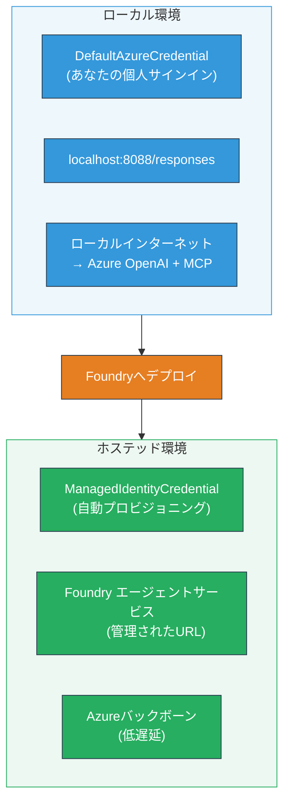

# モジュール 7 - Playgroundでの検証

このモジュールでは、展開したマルチエージェントワークフローを<strong>VS Code</strong>および<strong>[Foundry ポータル](https://ai.azure.com)</strong>の両方でテストし、エージェントがローカルでのテストと同じ挙動を示すことを確認します。

---

## なぜ展開後に検証するのか？

マルチエージェントワークフローはローカルで完璧に動作しましたが、なぜ再テストするのでしょうか？ホスト環境は以下の点で異なります：


| 違い | ローカル | ホスト |
|-----------|-------|--------|
| <strong>認証情報</strong> | [`DefaultAzureCredential`](https://learn.microsoft.com/azure/developer/python/sdk/authentication/credential-chains#defaultazurecredential-overview)（個人サインイン） | [`ManagedIdentityCredential`](https://learn.microsoft.com/python/api/overview/azure/identity-readme#managed-identity-support)（自動プロビジョニング） |
| <strong>エンドポイント</strong> | `http://localhost:8088/responses` | [Foundry Agent Service](https://learn.microsoft.com/azure/foundry/agents/concepts/hosted-agents) エンドポイント（管理されたURL） |
| <strong>ネットワーク</strong> | ローカルマシン → Azure OpenAI + MCP 発信 | Azureバックボーン（サービス間のレイテンシー低減） |
| **MCP接続** | ローカルインターネット → `learn.microsoft.com/api/mcp` | コンテナ発信 → `learn.microsoft.com/api/mcp` |

環境変数の誤設定、RBACの違い、MCPの発信ブロックがあれば、ここで検出できます。

---

## オプションA: VS Code Playgroundでテスト（推奨）

[Foundry 拡張機能](https://marketplace.visualstudio.com/items?itemName=TeamsDevApp.vscode-ai-foundry)には、VS Codeを離れずに展開済みエージェントとチャットできる統合Playgroundが含まれています。

### ステップ 1: ホスト済みエージェントに移動

1. VS Codeの<strong>アクティビティバー</strong>（左サイドバー）にある<strong>Microsoft Foundry</strong>アイコンをクリックしてFoundryパネルを開きます。
2. 接続されているプロジェクト（例：`workshop-agents`）を展開します。
3. <strong>Hosted Agents（プレビュー）</strong>を展開します。
4. エージェント名（例：`resume-job-fit-evaluator`）が見えるはずです。

### ステップ 2: バージョンを選択

1. エージェント名をクリックしてそのバージョンを展開します。
2. 展開済みのバージョン（例：`v1`）をクリックします。
3. コンテナ詳細を表示する<strong>詳細パネル</strong>が開きます。
4. ステータスが<strong>Started</strong>または<strong>Running</strong>であることを確認します。

### ステップ 3: Playgroundを開く

1. 詳細パネル内の<strong>Playground</strong>ボタンをクリックするか、バージョンを右クリックして<strong>Open in Playground</strong>を選択します。
2. VS Codeのタブにチャットインターフェイスが開きます。

### ステップ 4: スモークテストを実行

[モジュール 5](05-test-locally.md)と同じ3つのテストを使用します。Playgroundの入力ボックスに各メッセージを入力し、**Send**（または<strong>Enter</strong>）を押します。

#### テスト 1 - フル履歴書 + JD（標準フロー）

モジュール5のテスト1（Jane Doe + Contoso LtdのSenior Cloud Engineer）のフル履歴書 + JDプロンプトを貼り付けます。

**期待結果：**
- 内訳付きフィットスコア（100点満点）
- マッチしたスキルセクション
- 欠落スキルセクション
- **欠落スキルごとに1枚のギャップカード**（Microsoft Learn URL付き）
- タイムライン付きの学習ロードマップ

#### テスト 2 - 簡易短縮テスト（最小入力）

```
RESUME: 3 years Python developer, knows Django and PostgreSQL, no cloud experience.

JOB: Cloud DevOps Engineer requiring AWS, Kubernetes, Terraform, CI/CD. 5 years needed.
```

**期待結果：**
- 低いフィットスコア (< 40)
- ステージ分けされた学習パスを伴う正直な評価
- 複数のギャップカード（AWS、Kubernetes、Terraform、CI/CD、経験のギャップ）

#### テスト 3 - 高フィット候補者

```
RESUME:
10 years Azure Cloud Architect. AZ-305 certified. Expert in AKS, Terraform, Azure DevOps, 
Azure Functions, Helm, Prometheus, Grafana, Python, Go. Led platform team of 8.

JOB:
Senior Cloud Engineer. Required: AKS, Terraform, Azure DevOps, Python. Preferred: Helm, Go.
5+ years experience. AZ-305 preferred.
```

**期待結果：**
- 高いフィットスコア (≥ 80)
- インタビュー準備と洗練に重点
- ギャップカードはほとんどまたはまったくなし
- 短期間の準備に集中したタイムライン

### ステップ 5: ローカル結果と比較

モジュール5で保存したローカルの応答をメモやブラウザタブで開き、各テストについて：

- 応答は<strong>同じ構造</strong>（フィットスコア、ギャップカード、ロードマップ）か？
- <strong>同じスコア付けルーブリック</strong>（100点満点の内訳）が使われているか？
- ギャップカードに<strong>Microsoft LearnのURL</strong>が含まれているか？
- <strong>欠落スキルごとに1枚のギャップカード</strong>があるか（省略されていないか）？

> <strong>小さな文言の違いは正常です</strong> — モデルは非決定的です。構造、スコアの一貫性、MCPツールの利用に注目してください。

---

## オプションB: Foundryポータルでのテスト

[Foundry ポータル](https://ai.azure.com)は、チームメンバーや利害関係者と共有しやすいウェブベースのPlaygroundを提供します。

### ステップ 1: Foundry ポータルを開く

1. ブラウザを開き、[https://ai.azure.com](https://ai.azure.com)にアクセスします。
2. ワークショップ中に使っているのと同じAzureアカウントでサインインします。

### ステップ 2: プロジェクトに移動

1. ホームページの左サイドバーで<strong>Recent projects</strong>を探します。
2. プロジェクト名（例：`workshop-agents`）をクリックします。
3. 見えない場合は<strong>All projects</strong>をクリックして検索します。

### ステップ 3: 展開済みエージェントを探す

1. プロジェクトの左ナビゲーションで<strong>Build</strong> → <strong>Agents</strong>をクリックします（または<strong>Agents</strong>セクションを探す）。
2. エージェント一覧が表示されます。展開済みエージェント（例：`resume-job-fit-evaluator`）を見つけます。
3. エージェント名をクリックして詳細ページを開きます。

### ステップ 4: Playgroundを開く

1. エージェント詳細ページの上部ツールバーを見ます。
2. **Open in playground**（または<strong>Try in playground</strong>）をクリックします。
3. チャットインターフェイスが開きます。

### ステップ 5: 同じスモークテストを実行

上記VS Code Playgroundの3つのテストを繰り返します。各応答をローカル結果（モジュール5）およびVS Code Playgroundの結果（オプションA）と比較します。

---

## マルチエージェント固有の検証

基本的な正確性を超えて、以下のマルチエージェント固有の動作を検証します：

### MCPツールの実行

| チェック項目 | 検証方法 | 合格条件 |
|-------|--------------|------------|
| MCP 呼び出し成功 | ギャップカードに `learn.microsoft.com` のURLが含まれる | フィクスではなく実際のURLが表示される |
| 複数MCP呼び出し | 高/中優先度のギャップに資源がある | 最初のギャップカードだけでない |
| MCPフォールバック機能 | URLがない場合、フォールバックテキストを確認 | エージェントはURLの有無にかかわらずギャップカードを生成 |

### エージェント間の調整

| チェック項目 | 検証方法 | 合格条件 |
|-------|--------------|------------|
| 全4エージェントが実行 | 出力にフィットスコアとギャップカードが含まれる | スコアはMatchingAgent、カードはGapAnalyzerから |
| 並列ファンアウト | 応答時間が妥当（< 2分） | 3分以上なら並列実行に問題があるかも |
| データフローの整合性 | ギャップカードがマッチングレポートのスキルを参照 | JDにないスキルが誤って含まれていない |

---

## 検証ルーブリック

以下のルーブリックを用いてマルチエージェントワークフローのホスト環境挙動を評価します：

| # | 評価基準 | 合格条件 | 合格？ |
|---|----------|----------|-------|
| 1 | <strong>機能の正確性</strong> | 履歴書+JDに対してフィットスコアとギャップ分析を応答する | |
| 2 | <strong>スコア一貫性</strong> | フィットスコアは100点満点の内訳計算を使用 | |
| 3 | <strong>ギャップカードの完全性</strong> | 欠落スキルごとに1枚のカード（省略・結合なし） | |
| 4 | **MCPツール統合** | ギャップカードに実際のMicrosoft Learn URLが含まれる | |
| 5 | <strong>構造の一貫性</strong> | ローカルとホストの出力構造が一致 | |
| 6 | <strong>応答時間</strong> | フル評価でホストエージェントが2分以内に応答 | |
| 7 | <strong>エラーなし</strong> | HTTP 500エラー、タイムアウト、空応答なし | |

> 「合格」はいずれかのPlayground（VS Codeまたはポータル）で3つのスモークテスト全てにおいて7基準すべてを満たすことを意味します。

---

## Playground問題のトラブルシューティング

| 症状 | 可能性のある原因 | 対処法 |
|---------|-------------|-------|
| Playgroundが読み込まれない | コンテナのステータスが「Started」ではない | [モジュール6](06-deploy-to-foundry.md)に戻り、展開ステータスを確認。Pendingの場合は待機 |
| エージェントが空の応答を返す | モデル展開名の不一致 | `agent.yaml`の`environment_variables`内の`MODEL_DEPLOYMENT_NAME`が展開モデルと一致しているか確認 |
| エージェントがエラーメッセージを返す | [RBAC](https://learn.microsoft.com/azure/foundry/concepts/rbac-foundry)の権限不足 | プロジェクトスコープで<strong>[Azure AI User](https://aka.ms/foundry-ext-project-role)</strong>を割り当てる |
| ギャップカードにMicrosoft Learn URLがない | MCPの発信がブロックされている、またはMCPサーバが利用不可 | コンテナが`learn.microsoft.com`にアクセスできるか確認。[モジュール8](08-troubleshooting.md)参照 |
| ギャップカードが1枚だけ（省略されている） | GapAnalyzerの指示に"CRITICAL"ブロックがない | [モジュール3のステップ2.4](03-configure-agents.md)を見直す |
| フィットスコアがローカルと大きく異なる | 違うモデルや指示を展開している | `agent.yaml`の環境変数をローカルの`.env`と比較し、必要なら再展開 |
| ポータルで「Agent not found」 | 展開がまだ反映中か失敗している | 2分待って更新。まだ見えなければ[モジュール6](06-deploy-to-foundry.md)から再展開 |

---

### チェックポイント

- [ ] VS Code Playgroundでエージェントをテスト済み - 3つのスモークテスト全て合格
- [ ] [Foundry ポータル](https://ai.azure.com) Playgroundでエージェントをテスト済み - 3つのスモークテスト全て合格
- [ ] 応答はローカルテストと構造的に一致している（フィットスコア、ギャップカード、ロードマップ）
- [ ] ギャップカードにMicrosoft Learn URLがある（ホスト環境でMCPツールが動作している）
- [ ] 欠落スキルごとに1枚のギャップカードがある（省略なし）
- [ ] テスト中にエラーやタイムアウトなし
- [ ] 検証ルーブリックを完了（7基準全て合格）

---

**前へ:** [06 - Foundryへのデプロイ](06-deploy-to-foundry.md) · **次へ:** [08 - トラブルシューティング →](08-troubleshooting.md)

---

<!-- CO-OP TRANSLATOR DISCLAIMER START -->
**免責事項**:  
本書類はAI翻訳サービス [Co-op Translator](https://github.com/Azure/co-op-translator) を使用して翻訳されています。正確さを追求していますが、自動翻訳には誤りや不正確な部分が含まれる可能性があります。原文の原言語版が権威ある情報源とみなされるべきです。重要な情報については、専門の人間による翻訳を推奨します。本翻訳の利用により生じる誤解や誤用に関して当方は一切の責任を負いかねます。
<!-- CO-OP TRANSLATOR DISCLAIMER END -->