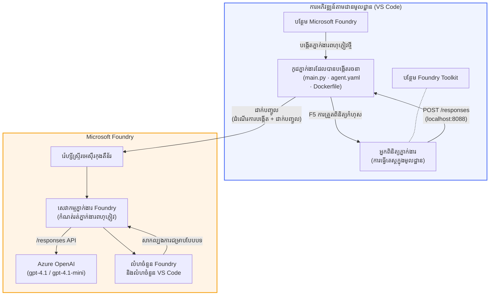

# Foundry Toolkit + សិក្ខាសាលាតំណាងដែលដំណើរការដោយ Foundry Hosted Agents

[](https://www.python.org/)
[](https://github.com/microsoft/agents)
[](https://learn.microsoft.com/azure/ai-foundry/agents/concepts/hosted-agents/)
[](https://ai.azure.com/)
[](https://learn.microsoft.com/azure/ai-services/openai/)
[](https://learn.microsoft.com/cli/azure/install-azure-cli)
[](https://learn.microsoft.com/azure/developer/azure-developer-cli/install-azd)
[](https://www.docker.com/)
[](https://marketplace.visualstudio.com/items?itemName=ms-windows-ai-studio.windows-ai-studio)
[](LICENSE)

សាងសង់ សាកល្បង និងចាក់ផ្សាយតំណាង AI ទៅកាន់ **Microsoft Foundry Agent Service** ជា **Hosted Agents** - ពេញលេញពី VS Code ដោយប្រើ **Microsoft Foundry extension** និង **Foundry Toolkit**។

> **Hosted Agents សព្វថ្ងៃនៅក្នុងដំណាក់កាលសាកល្បង។** តំបន់ដែលគាំទ្រមានកំណត់ - សូមមើល [region availability](https://learn.microsoft.com/azure/foundry/agents/concepts/hosted-agents#region-availability)។

> ថត `agent/` ខាងក្នុងនៃរាល់មេរៀនត្រូវបាន **បង្កើតដោយស្វ័យប្រវត្តិ** ដោយការពង្រឹង Foundry ហើយអ្នកកែប្រែកូដ សាកល្បងនៅក្រៅបណ្ដាញ ហើយចាក់ផ្សាយ។

<!-- CO-OP TRANSLATOR LANGUAGES TABLE START -->
[Arabic](../ar/README.md) | [Bengali](../bn/README.md) | [Bulgarian](../bg/README.md) | [Burmese (Myanmar)](../my/README.md) | [Chinese (Simplified)](../zh-CN/README.md) | [Chinese (Traditional, Hong Kong)](../zh-HK/README.md) | [Chinese (Traditional, Macau)](../zh-MO/README.md) | [Chinese (Traditional, Taiwan)](../zh-TW/README.md) | [Croatian](../hr/README.md) | [Czech](../cs/README.md) | [Danish](../da/README.md) | [Dutch](../nl/README.md) | [Estonian](../et/README.md) | [Finnish](../fi/README.md) | [French](../fr/README.md) | [German](../de/README.md) | [Greek](../el/README.md) | [Hebrew](../he/README.md) | [Hindi](../hi/README.md) | [Hungarian](../hu/README.md) | [Indonesian](../id/README.md) | [Italian](../it/README.md) | [Japanese](../ja/README.md) | [Kannada](../kn/README.md) | [Khmer](./README.md) | [Korean](../ko/README.md) | [Lithuanian](../lt/README.md) | [Malay](../ms/README.md) | [Malayalam](../ml/README.md) | [Marathi](../mr/README.md) | [Nepali](../ne/README.md) | [Nigerian Pidgin](../pcm/README.md) | [Norwegian](../no/README.md) | [Persian (Farsi)](../fa/README.md) | [Polish](../pl/README.md) | [Portuguese (Brazil)](../pt-BR/README.md) | [Portuguese (Portugal)](../pt-PT/README.md) | [Punjabi (Gurmukhi)](../pa/README.md) | [Romanian](../ro/README.md) | [Russian](../ru/README.md) | [Serbian (Cyrillic)](../sr/README.md) | [Slovak](../sk/README.md) | [Slovenian](../sl/README.md) | [Spanish](../es/README.md) | [Swahili](../sw/README.md) | [Swedish](../sv/README.md) | [Tagalog (Filipino)](../tl/README.md) | [Tamil](../ta/README.md) | [Telugu](../te/README.md) | [Thai](../th/README.md) | [Turkish](../tr/README.md) | [Ukrainian](../uk/README.md) | [Urdu](../ur/README.md) | [Vietnamese](../vi/README.md)

> **ចូលចិត្តបញ្ចូលក្នុងកុំព្យូទ័រខ្លួនឯង?**
>
> ទីតាំងផ្ទុកនេះរួមបញ្ចូលការប្រែសម្រួលជាគណនេយ្យភាសាច្រើនទៅលើ ៥០+ ដែលធ្វើឲ្យទំហំទាញយកធំឡើងយ៉ាងខ្លាំង។ ដើម្បីបញ្ចូលដោយមិនមានការប្រែសម្រួល អ្នកអាចប្រើ sparse checkout៖
>
> **Bash / macOS / Linux:**
> ```bash
> git clone --filter=blob:none --sparse https://github.com/microsoft-foundry/Foundry_Toolkit_for_VSCode_Lab.git
> cd Foundry_Toolkit_for_VSCode_Lab
> git sparse-checkout set --no-cone '/*' '!translations' '!translated_images'
> ```
>
> **CMD (Windows):**
> ```cmd
> git clone --filter=blob:none --sparse https://github.com/microsoft-foundry/Foundry_Toolkit_for_VSCode_Lab.git
> cd Foundry_Toolkit_for_VSCode_Lab
> git sparse-checkout set --no-cone "/*" "!translations" "!translated_images"
> ```
>
> វានាំអ្នកឱ្យមានគ្រប់អ្វីដែលត្រូវការដើម្បីបញ្ចប់មេរៀនដោយទាញយកឆាប់រហ័សជាង។
<!-- CO-OP TRANSLATOR LANGUAGES TABLE END -->

---

## សំណង់រចនាសម្ព័ន្ធ


**លំនាំៈ** ការពង្រឹង Foundry បង្កើត agent → អ្នកកាត់តកូដ និងការណែនាំ → សាកល្បងក្នុង Agent Inspector → ចាក់ផ្សាយទៅ Foundry (រូបភាព Docker ទទួលបញ្ជូនទៅ ACR) → វាយតម្លៃនៅក្នុង Playground។

---

## អ្វីដែលអ្នកនឹងបង្កើត

| មេរៀន | ពិពណ៌នា | ស្ថានភាព |
|-----|-------------|--------|
| **មេរៀន ០១ - តំណាងតែមួយ** | បង្កើត **"អធិបតីបកស្រាយ" Agent** សាកល្បងក្នុងកុំព្យូទ័រពីរ និងចាក់ផ្សាយទៅ Foundry | ✅ មានស្រាប់ |
| **មេរៀន ០២ - របៀប Multi-Agent** | បង្កើត **"Resume → Job Fit Evaluator"** ៖ តំណាង ៤ រូបសហការណ៍ដើម្បីវាយតម្លៃការចាំបាច់ភាពការងារ និងបង្កើតផែនការរៀន | ✅ មានស្រាប់ |

---

## ស្គាល់អធិបតីតំណាង

នៅក្នុងសិក្ខាសាលានេះ អ្នកនឹងបង្កើត **"អធិបតីបកស្រាយ" Agent** - តំណាង AI ដែលទទួលយកពាក្យបច្ចេកទេសស្មុគស្មាញ ហើយបកប្រែវាទៅជាសារសង្ខេបផ្ងៀងទាញសម្រាប់ការប្រជុំផ្នែកដឹកនាំ។ ព្រោះយើងត្រូវជម្រាបច្បាស់ មិនមានអ្នកណានៅក្នុងក្រុមហ៊ុនកំពូលចង់ចាំស្តាប់អំពី "ការបដិសេធ thread pool ដោយសារទំនាក់ទំនងសម័យថ្មីដែលបានបញ្ចូលនៅក្នុង v3.2"។

ខ្ញុំបានបង្កើត agent នេះបន្ទាប់ពីមានករណីច្រើនទៀតដែលការវិភាគបរិច្ឆេទល្អឥតខ្ចោះរបស់ខ្ញុំទទួលបានការឆ្លើយតប៖ *"គឺហេតុអ្វី вэបសាយរង់់ខ្លាំងឬអត់?"*

### វាធ្វើការយ៉ាងដូចម្តេច

អ្នកផ្តល់ឲ្យវាវិភាគបច្ចេកទេស។ វាផ្តល់វិភាគអធិបតី - ចំណុច ៣ ប្រភេទ ដោយគ្មានពាក្យបច្ចេកទេស យ៉ាងណាមិនមានការរួមបញ្ចូល stack trace ឬអ្វីដែលបង្កឲ្យមានភាពបារម្ភលហើយ។ គ្រាន់តែ **អ្វីដែលកើតឡើង**, **ឥទ្ធិពលពាណិជ្ជកម្ម**, និង **ជំហានបន្ទាប់**។

### មើលវាកំពុងដំណើរការ

**អ្នកនិយាយ៖**
> "ការពន្យារពេល API ធ្លាក់ចុះដោយសារការប្តឹង thread pool ដោយសារការហៅសម័យថ្មីដែលបាននាំមកក្នុង v3.2។"

**តំណាងឆ្លើយតប៖**

> **សង្ខេបអធិបតី៖**
> - **អ្វីដែលកើតឡើង៖** បន្ទាប់ពីការចេញផ្សាយចុងក្រោយ ប្រព័ន្ធយឺតចុះ។
> - **ឥទ្ធិពលពាណិជ្ជកម្ម៖** អ្នកប្រើប្រាស់ខ្លះទទួលបទពិសោធន៍ពន្យារពេលខណៈប្រើសេវា។
> - **ជំហានបន្ទាប់៖** ការផ្លាស់ប្តូរត្រូវបានគេចេញហើយ ការជួសជុលកំពុងត្រូវរៀបចំមុនចាក់ផ្សាយវិញ។

### ហេតុអ្វីតំណាងនេះ?

វាជា agent មួយសាមញ្ញ ធ្វើមុខងារតែមួយ - សម្រាប់រៀនពីរបៀបដំណើរការជាមួយ hosted agent ពេញលេញដោយគ្មានការលំបាកជាមួយឧបករណ៍ស្មុគស្មាញ។ ហើយយោល? ក្រុមវិស្សមកាលណែមួយគួរតមាន agent ប្រភេទនេះ។

---

## រចនាសម្ព័ន្ធសិក្ខាសាលា

```
📂 Foundry_Toolkit_for_VSCode_Lab/
├── 📄 README.md                      ← You are here
├── 📂 ExecutiveAgent/                ← Standalone hosted agent project
│   ├── agent.yaml
│   ├── Dockerfile
│   ├── main.py
│   └── requirements.txt
└── 📂 workshop/
    ├── 📂 lab01-single-agent/        ← Full lab: docs + agent code
    │   ├── README.md                 ← Hands-on lab instructions
    │   ├── 📂 docs/                  ← Step-by-step tutorial modules
    │   │   ├── 00-prerequisites.md
    │   │   ├── 01-install-foundry-toolkit.md
    │   │   ├── 02-create-foundry-project.md
    │   │   ├── 03-create-hosted-agent.md
    │   │   ├── 04-configure-and-code.md
    │   │   ├── 05-test-locally.md
    │   │   ├── 06-deploy-to-foundry.md
    │   │   ├── 07-verify-in-playground.md
    │   │   └── 08-troubleshooting.md
    │   └── 📂 agent/                 ← Reference solution (auto-scaffolded by Foundry extension)
    │       ├── agent.yaml
    │       ├── Dockerfile
    │       ├── main.py
    │       └── requirements.txt
    └── 📂 lab02-multi-agent/         ← Resume → Job Fit Evaluator
        ├── README.md                 ← Hands-on lab instructions (end-to-end)
        ├── 📂 docs/                  ← Step-by-step tutorial modules
        │   ├── 00-prerequisites.md
        │   ├── 01-understand-multi-agent.md
        │   ├── 02-scaffold-multi-agent.md
        │   ├── 03-configure-agents.md
        │   ├── 04-orchestration-patterns.md
        │   ├── 05-test-locally.md
        │   ├── 06-deploy-to-foundry.md
        │   ├── 07-verify-in-playground.md
        │   └── 08-troubleshooting.md
        └── 📂 PersonalCareerCopilot/ ← Reference solution (multi-agent workflow)
            ├── agent.yaml
            ├── Dockerfile
            ├── main.py
            └── requirements.txt
```

> **ចំណាំ:** ថត `agent/` ខាងក្នុងនៃរាល់មេរៀន គឺជា **Microsoft Foundry extension** បង្កើតពេលអ្នករត់ `Microsoft Foundry: Create a New Hosted Agent` ពី Command Palette។ ហើយឯកសារទាំងនោះត្រូវបានកែសម្រួលជាមួយការណែនាំ ឧបករណ៍ និងការកំណត់រចនាសម្ព័ន្ធរបស់អ្នក។ មេរៀន ០១ នឹងណែនាំអ្នកពីការបង្កើតវាចាប់ពីដើម។

---

## ការចាប់ផ្តើម

### ១. បញ្ចូល repository

```bash
git clone https://github.com/microsoft-foundry/Foundry_Toolkit_for_VSCode_Lab.git
cd Foundry_Toolkit_for_VSCode_Lab
```

### ២. តំឡើងបរិយាកាស Python virtual

```bash
python -m venv venv
```

ដំណើរការ​វា៖

- **Windows (PowerShell):**
  ```powershell
  .\venv\Scripts\Activate.ps1
  ```

- **macOS / Linux:**
  ```bash
  source venv/bin/activate
  ```

### ៣. តំឡើងការពឹងផ្អែក (dependencies)

```bash
pip install -r workshop/lab01-single-agent/agent/requirements.txt
```

### ៤. កំណត់អថេរសង្គ្រោះបរិយាកាស

ចម្លងឯកសារ .env ឧទាហរណ៍នៅក្នុងថត agent ហើយបញ្ចូលតម្លៃរបស់អ្នក៖

```bash
cp workshop/lab01-single-agent/agent/.env.example workshop/lab01-single-agent/agent/.env
```

កែច្នៃឯកសារ `workshop/lab01-single-agent/agent/.env`៖

```env
AZURE_AI_PROJECT_ENDPOINT=https://<your-account>.services.ai.azure.com/api/projects/<your-project>
MODEL_DEPLOYMENT_NAME=<your-model-deployment-name>
```

### ៥. តាមដានមេរៀនសិក្ខាសាលា

រាល់មេរៀនមានផ្នែកនិម្មិតផ្ទាល់ខ្លួនជាមួយម៉ូឌុលរបស់ខ្លួន។ ចាប់ផ្តើមពី **មេរៀន ០១** ដើម្បីរៀនមូលដ្ឋាន បន្ទាប់មកទៅ **មេរៀន ០២** សម្រាប់របៀប multi-agent។

#### មេរៀន ០១ - តំណាងតែមួយ ([សេចក្តីណែនាំពេញលេញ](workshop/lab01-single-agent/README.md))

| # | ម៉ូឌុល | តំណភ្ជាប់ |
|---|--------|------|
| 1 | អានលក្ខខណ្ឌមុន | [00-prerequisites.md](workshop/lab01-single-agent/docs/00-prerequisites.md) |
| 2 | តំឡើង Foundry Toolkit និងការពង្រឹង Foundry | [01-install-foundry-toolkit.md](workshop/lab01-single-agent/docs/01-install-foundry-toolkit.md) |
| 3 | បង្កើតគម្រោង Foundry | [02-create-foundry-project.md](workshop/lab01-single-agent/docs/02-create-foundry-project.md) |
| 4 | បង្កើត hosted agent | [03-create-hosted-agent.md](workshop/lab01-single-agent/docs/03-create-hosted-agent.md) |
| 5 | កំណត់ការណែនាំ និងបរិយាកាស | [04-configure-and-code.md](workshop/lab01-single-agent/docs/04-configure-and-code.md) |
| 6 | សាកល្បងក្នុងកុំព្យូទ័រ | [05-test-locally.md](workshop/lab01-single-agent/docs/05-test-locally.md) |
| 7 | ចាក់ផ្សាយទៅ Foundry | [06-deploy-to-foundry.md](workshop/lab01-single-agent/docs/06-deploy-to-foundry.md) |
| 8 | វាយតម្លៃនៅក្នុងផ្លេការដ | [07-verify-in-playground.md](workshop/lab01-single-agent/docs/07-verify-in-playground.md) |
| 9 | ដោះស្រាយបញ្ហា | [08-troubleshooting.md](workshop/lab01-single-agent/docs/08-troubleshooting.md) |

#### មេរៀន ០២ - របៀប Multi-Agent ([សេចក្តីណែនាំពេញលេញ](workshop/lab02-multi-agent/README.md))

| # | ម៉ូឌុល | តំណភ្ជាប់ |
|---|--------|------|
| 1 | លក្ខខណ្ឌមុន (មេរៀន ០២) | [00-prerequisites.md](workshop/lab02-multi-agent/docs/00-prerequisites.md) |
| 2 | យល់ដឹងអំពីរចនាសម្ព័ន្ធ multi-agent | [01-understand-multi-agent.md](workshop/lab02-multi-agent/docs/01-understand-multi-agent.md) |
| 3 | បង្កើតគម្រោង multi-agent | [02-scaffold-multi-agent.md](workshop/lab02-multi-agent/docs/02-scaffold-multi-agent.md) |
| 4 | កំណត់តំណាង និងបរិយាកាស | [03-configure-agents.md](workshop/lab02-multi-agent/docs/03-configure-agents.md) |
| 5 | លំនាំសម្របសម្រួល | [04-orchestration-patterns.md](workshop/lab02-multi-agent/docs/04-orchestration-patterns.md) |
| 6 | សាកល្បងក្នុងកុំព្យូទ័រ (multi-agent) | [05-test-locally.md](workshop/lab02-multi-agent/docs/05-test-locally.md) |
| 7 | បណ្តុះបណ្តាលទៅ Foundry | [06-deploy-to-foundry.md](workshop/lab02-multi-agent/docs/06-deploy-to-foundry.md) |
| 8 | ផ្ទៀងផ្ទាត់នៅក្នុងសួនហ្គេម | [07-verify-in-playground.md](workshop/lab02-multi-agent/docs/07-verify-in-playground.md) |
| 9 | ដោះស្រាយបញ្ហា (multi-agent) | [08-troubleshooting.md](workshop/lab02-multi-agent/docs/08-troubleshooting.md) |

---

## អ្នកថែទាំ

<table>
<tr>
    <td align="center"><a href="https://github.com/ShivamGoyal03">
        <br />
        <sub><b>Shivam Goyal</b></sub>
    </a><br />
    </td>
</tr>
</table>

---

## ការអនុញ្ញាតដែលត្រូវការ (យោងយ៉ាងឆាប់រហ័ស)

| សៀរ៉ាណារីយូ | តួនាទីដែលត្រូវការ |
|----------|---------------|
| បង្កើតគម្រោង Foundry ថ្មី | **ម្ចាស់ Azure AI** លើធនធាន Foundry |
| បណ្តុះបណ្តាលទៅគម្រោងដែលមានស្រាប់ (ធនធានថ្មី) | **ម្ចាស់ Azure AI** + **អ្នករួមចំណែក** លើការជាវសេវា |
| បណ្តុះបណ្តាលទៅគម្រោងដែលបានកំណត់រួច | **អ្នកអាន** លើគណនី + **អ្នកប្រើ Azure AI** លើគម្រោង |

> **សំខាន់៖** តួនាទី Azure `Owner` និង `Contributor` មានតែការអនុញ្ញាត *ការគ្រប់គ្រង* តែប៉ុណ្ណោះ មិនមែន *ការអភិវឌ្ឍន៍* (សកម្មភាពទិន្នន័យ) ។ អ្នកត្រូវការតួនាទី **Azure AI User** ឬ **Azure AI Owner** ដើម្បីបង្កើត និងបណ្តុះបណ្តាលភ្នាក់ងារ។

---

## ឯកសារ​យោង

- [ចាប់ផ្តើមយ៉ាងលឿន៖ បណ្តុះបណ្តាលភ្នាក់ងារដំបូងរបស់អ្នក (VS Code)](https://learn.microsoft.com/azure/foundry/agents/quickstarts/quickstart-hosted-agent)
- [ភ្នាក់ងារត្រូវបានផ្តល់សេវាមានអ្វីខ្លះ?](https://learn.microsoft.com/azure/foundry/agents/concepts/hosted-agents)
- [បង្កើតសកម្មភាពភ្នាក់ងារត្រូវបានផ្តល់សេវាក្នុង VS Code](https://learn.microsoft.com/azure/foundry/agents/how-to/vs-code-agents-workflow-pro-code)
- [បណ្តុះបណ្តាលភ្នាក់ងារត្រូវបានផ្តល់សេវា](https://learn.microsoft.com/azure/foundry/agents/how-to/deploy-hosted-agent)
- [RBAC សម្រាប់ Microsoft Foundry](https://learn.microsoft.com/azure/foundry/concepts/rbac-foundry)
- [គំរូបង្ហាញការពិនិត្យវិស្វកម្មភ្នាក់ងារ](https://github.com/Azure-Samples/agent-architecture-review-sample) - ភ្នាក់ងារត្រូវបានផ្តល់សេវាផ្ទាល់តាមពិភពជាក់ស្តែងជាមួយឧបករណ៍ MCP, រូបគំនូស Excalidraw និងការបណ្ដុះបណ្ដាលពីរប្រភេទ

---


## អាជ្ញាបណ្ណ

[MIT](../../LICENSE)

---

<!-- CO-OP TRANSLATOR DISCLAIMER START -->
**ការបដិសេធ**:  
ឯកសារនេះត្រូវបានបកប្រែដោយប្រើសេវាបកប្រែ AI [Co-op Translator](https://github.com/Azure/co-op-translator)។ បើទោះបីយើងខិតខំក្នុងការធ្វើឱ្យមានភាពត្រឹមត្រូវក៏ដោយ សូមយកចិត្តទុកដាក់ថាការបកប្រែដោយស្វ័យប្រវត្តិអាចមានកំហុស ឬភាពមិនច្បាស់លាស់។ ឯកសារដើមជាភាសាមូលដ្ឋានគួរត្រូវបានយកទៅជាមូលដ្ឋានធ្វើការឧបសម្ព័ន្ធ។ សម្រាប់ព័ត៌មានសំខាន់ គួរតែប្រើការបកប្រែដោយអ្នកជំនាញមនុស្ស។ យើងមិនទទួលខុសត្រូវចំពោះការយល់ច្រឡំ ឬការបកស្រាយខុសពីការប្រើប្រាស់ការបកប្រែនេះឡើយ។
<!-- CO-OP TRANSLATOR DISCLAIMER END -->