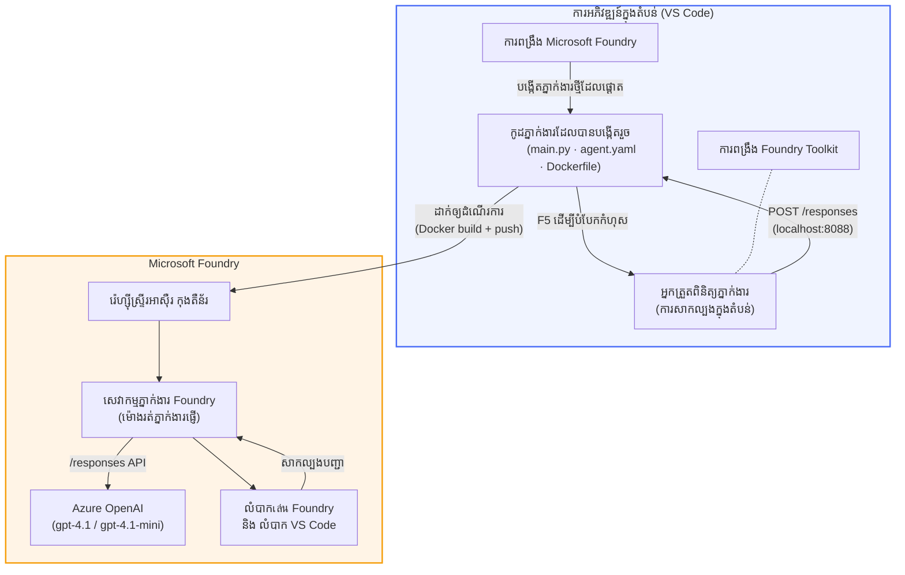

# កម្មវិធី Foundry Toolkit + សិក្ខាសាលា Foundry Hosted Agents

[](https://www.python.org/)
[](https://github.com/microsoft/agents)
[](https://learn.microsoft.com/azure/ai-foundry/agents/concepts/hosted-agents/)
[](https://ai.azure.com/)
[](https://learn.microsoft.com/azure/ai-services/openai/)
[](https://learn.microsoft.com/cli/azure/install-azure-cli)
[](https://learn.microsoft.com/azure/developer/azure-developer-cli/install-azd)
[](https://www.docker.com/)
[](https://marketplace.visualstudio.com/items?itemName=ms-windows-ai-studio.windows-ai-studio)
[](LICENSE)

បង្កើត សាកល្បង និងចេញផ្សាយភ្នាក់ងារពិភពឌីជីថលទៅ **Microsoft Foundry Agent Service** ក្នុងនាមជា **Hosted Agents** - ពេញលេញពី VS Code ដោយប្រើ **Microsoft Foundry extension** និង **Foundry Toolkit**។

> **Hosted Agents សព្វថ្ងៃនៅក្នុងលក្ខណៈពិនិត្យមើលជាមុន។** តំបន់ដែលគាំទ្រមានកំណត់ - សូមមើល [region availability](https://learn.microsoft.com/azure/foundry/agents/concepts/hosted-agents#region-availability) ។

> គប្បីថតថង់ `agent/` ខាងក្នុងរាល់មន្ទីរសិក្សា (lab) គឺ **បានបង្កើតដោយស្វ័យប្រវត្តិ** ដោយ Foundry extension - បន្ទាប់មកអ្នកធ្វើប្តូរកូដ សាកល្បងក្នុងតំបន់មូលដ្ឋាន ហើយចេញផ្សាយ។

### 🌐 ការគាំទ្រ​ភាសាច្រើន

#### គាំទ្រ​តាមរយៈ GitHub Action (ស្វ័យប្រវត្តិ និងមិនធ្លាប់ចាស់)

<!-- CO-OP TRANSLATOR LANGUAGES TABLE START -->
[Arabic](../ar/README.md) | [Bengali](../bn/README.md) | [Bulgarian](../bg/README.md) | [Burmese (Myanmar)](../my/README.md) | [Chinese (Simplified)](../zh-CN/README.md) | [Chinese (Traditional, Hong Kong)](../zh-HK/README.md) | [Chinese (Traditional, Macau)](../zh-MO/README.md) | [Chinese (Traditional, Taiwan)](../zh-TW/README.md) | [Croatian](../hr/README.md) | [Czech](../cs/README.md) | [Danish](../da/README.md) | [Dutch](../nl/README.md) | [Estonian](../et/README.md) | [Finnish](../fi/README.md) | [French](../fr/README.md) | [German](../de/README.md) | [Greek](../el/README.md) | [Hebrew](../he/README.md) | [Hindi](../hi/README.md) | [Hungarian](../hu/README.md) | [Indonesian](../id/README.md) | [Italian](../it/README.md) | [Japanese](../ja/README.md) | [Kannada](../kn/README.md) | [Khmer](./README.md) | [Korean](../ko/README.md) | [Lithuanian](../lt/README.md) | [Malay](../ms/README.md) | [Malayalam](../ml/README.md) | [Marathi](../mr/README.md) | [Nepali](../ne/README.md) | [Nigerian Pidgin](../pcm/README.md) | [Norwegian](../no/README.md) | [Persian (Farsi)](../fa/README.md) | [Polish](../pl/README.md) | [Portuguese (Brazil)](../pt-BR/README.md) | [Portuguese (Portugal)](../pt-PT/README.md) | [Punjabi (Gurmukhi)](../pa/README.md) | [Romanian](../ro/README.md) | [Russian](../ru/README.md) | [Serbian (Cyrillic)](../sr/README.md) | [Slovak](../sk/README.md) | [Slovenian](../sl/README.md) | [Spanish](../es/README.md) | [Swahili](../sw/README.md) | [Swedish](../sv/README.md) | [Tagalog (Filipino)](../tl/README.md) | [Tamil](../ta/README.md) | [Telugu](../te/README.md) | [Thai](../th/README.md) | [Turkish](../tr/README.md) | [Ukrainian](../uk/README.md) | [Urdu](../ur/README.md) | [Vietnamese](../vi/README.md)

> **ចូលចិត្តថតបញ្ចាលនៅក្នុងម៉ាស៊ីនឯង?**
>
> Repo នេះមានការបកប្រែភាសា ៥០+ ដែលបង្កើនទំហំឯកសារចេញជាប្រមាណច្រើន។ ដើម្បីថតបញ្ចាលដោយគ្មានការបកប្រែ អ្នកអាចប្រើ sparse checkout៖
>
> **Bash / macOS / Linux:**
> ```bash
> git clone --filter=blob:none --sparse https://github.com/microsoft-foundry/Foundry_Toolkit_for_VSCode_Lab.git
> cd Foundry_Toolkit_for_VSCode_Lab
> git sparse-checkout set --no-cone '/*' '!translations' '!translated_images'
> ```
>
> **CMD (Windows):**
> ```cmd
> git clone --filter=blob:none --sparse https://github.com/microsoft-foundry/Foundry_Toolkit_for_VSCode_Lab.git
> cd Foundry_Toolkit_for_VSCode_Lab
> git sparse-checkout set --no-cone "/*" "!translations" "!translated_images"
> ```
>
> វាអនុញ្ញាតឱ្យអ្នកទទួលបានអ្វីគ្រប់យ៉ាងដែលត្រូវការដើម្បីបញ្ចប់វគ្គនេះបានយ៉ាងរហ័សជាងមុន។
<!-- CO-OP TRANSLATOR LANGUAGES TABLE END -->

---

## សំណង់រចនា


**លំហូរ:** ការ Foundry extension នាំឱ្យបង្កើត strcutagent → អ្នកប្តូរវិញកូដ និងណែនាំ → សាកល្បងក្នុងតំបន់មូលដ្ឋានជាមួយ Agent Inspector → ចេញផ្សាយទៅ Foundry (បង្ហោះរូបភាព Docker ទៅ ACR) → ធានា​មើល​នៅពេលក្មេងលេងក្នុង Playground ។

---

## អ្វីដែលអ្នកនឹងបង្កើត

| មន្ទីរ | ពិពណ៌នា | ស្ថានភាព |
|-----|-------------|--------|
| **Lab 01 - ភ្នាក់ងារតែមួយ** | បង្កើតភ្នាក់ងារ **"សូមពន្យល់ដូចជា ខ្ញុំជាអ្នកគ្រប់គ្រង"**, សាកល្បងក្នុងតំបន់មូលដ្ឋាន ហើយចេញផ្សាយទៅ Foundry | ✅ មានស្រាប់ |
| **Lab 02 - សហការភ្នាក់ងារច្រើន** | បង្កើត **"Resume → Job Fit Evaluator"** - ភ្នាក់ងារចំនួន ៤ ប្រមាញ់ដើម្បីវាយតម្លៃពាក់ព័ន្ធនៃប្រវត្តិរូប និងបង្កើតផែនការសិក្សា | ✅ មានស្រាប់ |

---

## ជួបគ្នាជាមួយ Executive Agent

ក្នុងសិក្ខាសាលានេះ អ្នកនឹងបង្កើតភ្នាក់ងារ **"សូមពន្យល់ដូចជា ខ្ញុំជាអ្នកគ្រប់គ្រង"** - ភ្នាក់ងារពិភពឌីជីថលមួយដែលយកពាក្យបច្ចេកទេសរឹងមាំ ហើយបកប្រែវាទៅជាសេចក្ដីសង្ខេបភាសារល្ងាចដែលសមស្របសម្រាប់ក្រុមប្រឹក្សាភិបាល។ ព្រោះសារពិតហើយ មិនមានម្នាក់ណាមួយនៅក្រុមគ្រប់គ្រងចង់ស្តាប់ពី "thread pool exhaustion caused by synchronous calls introduced in v3.2." ទេ។

ខ្ញុំបានបង្កើតភ្នាក់ងារនេះបន្ទាប់ពីមានហេតុការណ៍មួយចំនួនដែលបន្ទាប់ពីពិរោះបញ្ហារបស់ខ្ញុំ ជម្ល hlay "តើគេបើកគេហទំព័រឬទេ?" ជាចម្លើយពីអ្នកដំណើរការនៅផ្នែកផ្នែកបច្ចេកទេស។

### វារត់ដូចម្តេច

អ្នកផ្គត់ផ្គង់ព័ត៌មានបច្ចេកទេសមួយ។ វាសំលាប់ត្រឡប់មកជាសេចក្ដីសង្ខេបរបស់អ្នកគ្រប់គ្រង - ចំនុច៣ គ្មានពាក្យបច្ចេកទេស ក៏គ្មានប្រវត្តិស្តង់ដា ឬពាក្យប្រួយបារម្ភផ្លូវចិត្តគិតពីអនាគត។ មានតែ **ចំណុចបានកើតឡើង**, **ផលប៉ះពាល់អាជីវកម្ម**, និង **ជំហានបន្ទាប់** ប៉ុណ្ណោះ។

### មើលវា​មានសកម្មភាព​តាមជា

**អ្នកនិយាយ៖**
> "The API latency increased due to thread pool exhaustion caused by synchronous calls introduced in v3.2."

**ភ្នាក់ងារប្រASថា:**

> **Executive Summary:**
> - **ចំណុចបានកើតឡើង:** បន្ទាប់ពីការចេញផ្សាយថ្មី ស៊ីស្តឹមបានយឺតឡើង។
> - **ផលប៉ះពាល់អាជីវកម្ម:** អ្នកប្រើប្រាស់ខ្លះបានជួបការពន្យាពេលក្នុងការប្រើសេវាកម្ម។
> - **ជំហានបន្ទាប់:** ការផ្លាស់ប្តូរត្រូវបានត្រឡប់មកវិញ ហើយកំពុងចាប់ផ្តើមការជួសជុលមុនចេញផ្សាយម្តងទៀត។

### ហេតុអ្វីជ្រើសរើសភ្នាក់ងារនេះ?

វាជាភ្នាក់ងារសាមញ្ញ មុខងារតែមួយ - ល្អសម្រាប់រៀនពីដំណើរការរបស់ hosted agent ពីដើមដល់បញ្ចប់ ដោយគ្មានការត្រួតទ្រាយជាច្រើនក្នុងឧបករណ៍ស្មុគស្មាញ។ ហើយពិតប្រាកដ? រាល់ក្រុមវិស្វកម្មទាំងអស់អាចប្រើភ្នាក់ងារមួយនេះបាន។

---

## រចនាសម្ព័ន្ធសិក្ខាសាលា

```
📂 Foundry_Toolkit_for_VSCode_Lab/
├── 📄 README.md                      ← You are here
├── 📂 ExecutiveAgent/                ← Standalone hosted agent project
│   ├── agent.yaml
│   ├── Dockerfile
│   ├── main.py
│   └── requirements.txt
└── 📂 workshop/
    ├── 📂 lab01-single-agent/        ← Full lab: docs + agent code
    │   ├── README.md                 ← Hands-on lab instructions
    │   ├── 📂 docs/                  ← Step-by-step tutorial modules
    │   │   ├── 00-prerequisites.md
    │   │   ├── 01-install-foundry-toolkit.md
    │   │   ├── 02-create-foundry-project.md
    │   │   ├── 03-create-hosted-agent.md
    │   │   ├── 04-configure-and-code.md
    │   │   ├── 05-test-locally.md
    │   │   ├── 06-deploy-to-foundry.md
    │   │   ├── 07-verify-in-playground.md
    │   │   └── 08-troubleshooting.md
    │   └── 📂 agent/                 ← Reference solution (auto-scaffolded by Foundry extension)
    │       ├── agent.yaml
    │       ├── Dockerfile
    │       ├── main.py
    │       └── requirements.txt
    └── 📂 lab02-multi-agent/         ← Resume → Job Fit Evaluator
        ├── README.md                 ← Hands-on lab instructions (end-to-end)
        ├── 📂 docs/                  ← Step-by-step tutorial modules
        │   ├── 00-prerequisites.md
        │   ├── 01-understand-multi-agent.md
        │   ├── 02-scaffold-multi-agent.md
        │   ├── 03-configure-agents.md
        │   ├── 04-orchestration-patterns.md
        │   ├── 05-test-locally.md
        │   ├── 06-deploy-to-foundry.md
        │   ├── 07-verify-in-playground.md
        │   └── 08-troubleshooting.md
        └── 📂 PersonalCareerCopilot/ ← Reference solution (multi-agent workflow)
            ├── agent.yaml
            ├── Dockerfile
            ├── main.py
            └── requirements.txt
```

> **កំណត់ចំណាំ:**ថតថង់ `agent/` ខាងក្នុងរាល់មន្ទីរសិក្សាគឺជាអ្វីដែល **Microsoft Foundry extension** បង្កើតនៅពេលអ្នករត់បញ្ជា `Microsoft Foundry: Create a New Hosted Agent` ពី Command Palette។ ឯកសារទាំងនោះបន្ទាប់មកត្រូវបានផ្លាស់ប្តូរនៅលើការណែនាំ ដៃគូ និងការកំណត់រចនា។ Lab 01 នឹងណែនាំអ្នកពីការបង្កើតវាម្តងទៀតពីដើម។

---

## ចាប់ផ្តើម

### 1. ថតបញ្ចូល repo

```bash
git clone https://github.com/microsoft-foundry/Foundry_Toolkit_for_VSCode_Lab.git
cd Foundry_Toolkit_for_VSCode_Lab
```

### 2. តំឡើង Python virtual environment

```bash
python -m venv venv
```

ចាប់ផ្តើមវា៖

- **Windows (PowerShell):**
  ```powershell
  .\venv\Scripts\Activate.ps1
  ```
- **macOS / Linux:**
  ```bash
  source venv/bin/activate
  ```

### 3. តំឡើងក依赖

```bash
pip install -r workshop/lab01-single-agent/agent/requirements.txt
```

### 4. កំណត់ environment variables

ចម្លងឯកសារ `.env` ឧទាហរណ៍ក្នុងថត agent ហើយបញ្ចូលតម្លៃរបស់អ្នក៖

```bash
cp workshop/lab01-single-agent/agent/.env.example workshop/lab01-single-agent/agent/.env
```

កែប្រែ `workshop/lab01-single-agent/agent/.env`៖

```env
AZURE_AI_PROJECT_ENDPOINT=https://<your-account>.services.ai.azure.com/api/projects/<your-project>
MODEL_DEPLOYMENT_NAME=<your-model-deployment-name>
```

### 5. អនុវត្តតាមមន្ទីរសិក្សា

រាល់មន្ទីរមានប្លុកផ្ទាល់ខ្លួនជាមួយម៉ូឌុលផ្ទាល់ខ្លួន។ ចាប់ផ្តើមជាមួយ **Lab 01** ដើម្បីរៀនមូលដ្ឋាន ហើយរត់ទៅ **Lab 02** សម្រាប់ដំណើរការសហការភ្នាក់ងារច្រើន។

#### Lab 01 - ភ្នាក់ងារតែមួយ ([ជាផ្នែករួមមាតិកា](workshop/lab01-single-agent/README.md))

| ល.រ | ម៉ូឌុល | តំណភ្ជាប់ |
|---|--------|------|
| 1 | អានលក្ខខណ្ឌដំបូង | [00-prerequisites.md](workshop/lab01-single-agent/docs/00-prerequisites.md) |
| 2 | តំឡើង Foundry Toolkit និង Foundry extension | [01-install-foundry-toolkit.md](workshop/lab01-single-agent/docs/01-install-foundry-toolkit.md) |
| 3 | បង្កើតគម្រោង Foundry | [02-create-foundry-project.md](workshop/lab01-single-agent/docs/02-create-foundry-project.md) |
| 4 | បង្កើត hosted agent | [03-create-hosted-agent.md](workshop/lab01-single-agent/docs/03-create-hosted-agent.md) |
| 5 | កំណត់ណែនាំ និងបរិយាកាស | [04-configure-and-code.md](workshop/lab01-single-agent/docs/04-configure-and-code.md) |
| 6 | សាកល្បងក្នុងតំបន់មូលដ្ឋាន | [05-test-locally.md](workshop/lab01-single-agent/docs/05-test-locally.md) |
| 7 | ចេញផ្សាយទៅ Foundry | [06-deploy-to-foundry.md](workshop/lab01-single-agent/docs/06-deploy-to-foundry.md) |
| 8 | ផ្ទៀងផ្ទាត់ក្នុង playground | [07-verify-in-playground.md](workshop/lab01-single-agent/docs/07-verify-in-playground.md) |
| 9 | ដោះស្រាយបញ្ហា | [08-troubleshooting.md](workshop/lab01-single-agent/docs/08-troubleshooting.md) |

#### Lab 02 - ដំណើរការសហការភ្នាក់ងារច្រើន ([ជាផ្នែករួមមាតិកា](workshop/lab02-multi-agent/README.md))

| ល.រ | ម៉ូឌុល | តំណភ្ជាប់ |
|---|--------|------|
| 1 | លក្ខខណ្ឌដំបូង (Lab 02) | [00-prerequisites.md](workshop/lab02-multi-agent/docs/00-prerequisites.md) |
| 2 | យល់ពីសំណង់រចនាសហការភ្នាក់ងារ | [01-understand-multi-agent.md](workshop/lab02-multi-agent/docs/01-understand-multi-agent.md) |
| 3 | បង្កើតគំរោង multi-agent | [02-scaffold-multi-agent.md](workshop/lab02-multi-agent/docs/02-scaffold-multi-agent.md) |
| 4 | កំណត់ agents និងបរិយាកាស | [03-configure-agents.md](workshop/lab02-multi-agent/docs/03-configure-agents.md) |
| 5 | ផលិតភាពរចនាសម្ព័ន្ធ | [04-orchestration-patterns.md](workshop/lab02-multi-agent/docs/04-orchestration-patterns.md) |
| 6 | សាកល្បងក្នុងតំបន់មូលដ្ឋាន (multi-agent) | [05-test-locally.md](workshop/lab02-multi-agent/docs/05-test-locally.md) |
| 7 | បង្ហោះទៅ Foundry | [06-deploy-to-foundry.md](workshop/lab02-multi-agent/docs/06-deploy-to-foundry.md) |
| 8 | ពិនិត្យនៅក្នុងលេងល្បែង | [07-verify-in-playground.md](workshop/lab02-multi-agent/docs/07-verify-in-playground.md) |
| 9 | ការដោះស្រាយបញ្ហា (multi-agent) | [08-troubleshooting.md](workshop/lab02-multi-agent/docs/08-troubleshooting.md) |

---

## អ្នកថែរក្សា

<table>
<tr>
    <td align="center"><a href="https://github.com/ShivamGoyal03">
        <br />
        <sub><b>Shivam Goyal</b></sub>
    </a><br />
    </td>
</tr>
</table>

---

## ការអនុញ្ញាតដែលត្រូវការ (យោងឆាប់រហ័ស)

| សេណារីយ៉ូ | តួនាទីដែលត្រូវការ |
|----------|---------------|
| បង្កើតគម្រោង Foundry ថ្មី | **ម្ចាស់ Azure AI** លើធនធាន Foundry |
| បង្ហោះទៅគម្រោងដែលមានរួចហើយ (ធនធានថ្មី) | **ម្ចាស់ Azure AI** + **អ្នករួមចំណែក** លើការជាវ |
| បង្ហោះទៅគម្រោងដែលចាត់តាំងពេញលេញ | **អ្នកអាន** លើគណនី + **អ្នកប្រើប្រាស់ Azure AI** លើគម្រោង |

> **សំខាន់៖** តួនាទី Azure `ម្ចាស់` និង `អ្នករួមចំណែក` មានតែការអនុញ្ញាត *គ្រប់គ្រង* ប៉ុណ្ណោះ មិនមែនការអនុញ្ញាត *អភិវឌ្ឍ* (សកម្មភាពទិន្នន័យ) ទេ។ អ្នកត្រូវការតួនាទី **អ្នកប្រើប្រាស់ Azure AI** ឬ **ម្ចាស់ Azure AI** ដើម្បីកសាង និងបង្ហោះភ្នាក់ងារ។

---

## ឯកសារយោង

- [ចាប់ផ្តើមរហ័ស: បង្ហោះភ្នាក់ងាររបស់អ្នកជាលើកដំបូង (VS Code)](https://learn.microsoft.com/azure/foundry/agents/quickstarts/quickstart-hosted-agent)
- [ភ្នាក់ងារត្រូវបានផ្ដល់ជាម៉ាស៊ីនមានអ្វីខ្លះ?](https://learn.microsoft.com/azure/foundry/agents/concepts/hosted-agents)
- [បង្កើតសម្ព័ន្ធការងារភ្នាក់ងារត្រូវបានផ្ដល់ជាម៉ាស៊ីននៅក្នុង VS Code](https://learn.microsoft.com/azure/foundry/agents/how-to/vs-code-agents-workflow-pro-code)
- [បង្ហោះភ្នាក់ងារត្រូវបានផ្ដល់ជាម៉ាស៊ីន](https://learn.microsoft.com/azure/foundry/agents/how-to/deploy-hosted-agent)
- [RBAC សម្រាប់ Microsoft Foundry](https://learn.microsoft.com/azure/foundry/concepts/rbac-foundry)
- [Architecture Review Agent Sample](https://github.com/Azure-Samples/agent-architecture-review-sample) - ភ្នាក់ងារត្រូវបានផ្ដល់ជាម៉ាស៊ីនក្នុងពិភពជាក់ស្តែងជាមួយឧបករណ៍ MCP, គំនូសផែនទី Excalidraw និងការបង្ហោះពីរដង

---

## រង្វាន់លិខិតអនុញ្ញាត

[MIT](../../LICENSE)

---

<!-- CO-OP TRANSLATOR DISCLAIMER START -->
**ការព្រមាន**៖  
ឯកសារនេះត្រូវបានបកប្រែដោយប្រើសេវាកម្មបកប្រែ AI [Co-op Translator](https://github.com/Azure/co-op-translator)។ ទោះបីយើងខិតខំបំផុតដើម្បីឲ្យបានភាពត្រឹមត្រូវ ក៏សូមស គិតថាការបកប្រែដោយស្វ័យប្រវត្តិនេះអាចមានកំហុសឬភាពមិនត្រឹមត្រូវ។ ឯកសារដើមក្នុងភាសាដើមគួរត្រូវបានគិតថាជា ប្រភពមានសារៈសំខាន់។ សម្រាប់ព័ត៌មានសំខាន់ៗ គួរតែហៅអ្នកបកប្រែដែលជាមនុស្សជំនាញ។ យើងមិនទទួលខុសត្រូវចំពោះការយល់ច្រឡំ ឬការបកស្រាយខុសពីការប្រើប្រាស់ការបកប្រែនេះឡើយ។
<!-- CO-OP TRANSLATOR DISCLAIMER END -->