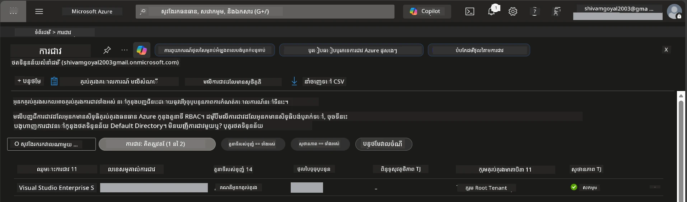

# Module 0 - គ្រឿងចាំបាច់មុនចាប់ផ្តើម

មុនចាប់ផ្តើមវគ្គហ្វឹកហាត់, សូមបញ្ជាក់ថាអ្នកមានឧបករណ៍, ការចូលដំណើរការ និងបរិដ្ឋានដែលត្រូវការ។ តាមដានជំហានទាំងអស់ខាងក្រោម - កុំរំលងទៅខាងមុខ។

---

## 1. ធុងគណនី Azure និងការជាវ

### 1.1 បង្កើតឬផ្ទៀងផ្ទាត់ការជាវ Azure របស់អ្នក

1. បើកកម្មវិធីរុករក ហើយចូលទៅ [https://azure.microsoft.com/free/](https://azure.microsoft.com/free/)។
2. ប្រសិនបើអ្នកមិនមានគណនី Azure, ចុច **Start free** ហើយអនុវត្តដំណើរការចុះឈ្មោះ។ អ្នកត្រូវការគណនី Microsoft (ឬបង្កើតមួយ) និងកាតឥណទានសម្រាប់ធានាបានអត្តសញ្ញាណ។
3. ប្រសិនបើអ្នកមានគណនីរួចហើយ ចូលចូលនៅ [https://portal.azure.com](https://portal.azure.com)។
4. នៅក្នុងផ្ទាំង Portal, ចុចប្លេដ **Subscriptions** នៅខាងឆ្វេង (ឬស្វែងរក "Subscriptions" នៅបារស្វែងរកលើ)។
5. ផ្ទៀងផ្ទាត់ថាអ្នកឃើញយ៉ាងតិច១ការជាវដែលមានស្ថានភាព **Active**។ សូមកត់ត្រា **Subscription ID** - អ្នកត្រូវការវាសម្រាប់បន្ទាប់។



### 1.2 យល់ដឹងអំពីតួនាទី RBAC ដែលត្រូវការ

ការដាក់មាន [Hosted Agent](https://learn.microsoft.com/azure/foundry/agents/concepts/hosted-agents) តម្រូវឱ្យមានសិទ្ធិ **data action** ដែលតួនាទី Azure `Owner` និង `Contributor` ទូទៅមិនមាន។ អ្នកត្រូវការតួនាទីមួយក្នុងចំណោម [ការបង្កូលតួនាទី](https://learn.microsoft.com/azure/foundry/concepts/rbac-foundry#built-in-roles) ដូចខាងក្រោម៖

| សេណារីយ៉ូ | តួនាទីដែលត្រូវការ | ទីកន្លែងកំណត់តួនាទី |
|----------|---------------|----------------------|
| បង្កើតគម្រោង Foundry ថ្មី | **Azure AI Owner** លើធនធាន Foundry | ធនធាន Foundry ក្នុង Azure Portal |
| ដាក់បញ្ចូនទៅគម្រោងដែល​មានរួច (ធនធានថ្មី) | **Azure AI Owner** + **Contributor** លើការជាវ | ការជាវ + ធនធាន Foundry |
| ដាក់បញ្ចូនទៅគម្រោងដែល​បានកំណត់រួច | **Reader** លើគណនី + **Azure AI User** លើគម្រោង | គណនី + គម្រោងក្នុង Azure Portal |

> **ចំណុចសំខាន់:** តួនាទី Azure `Owner` និង `Contributor` គ្រាន់តែគ្របដណ្តប់សិទ្ធិ *គ្រប់គ្រង* (ប្រតិបត្តិការ ARM) ប៉ុណ្ណោះ។ អ្នកត្រូវការតួនាទី [**Azure AI User**](https://learn.microsoft.com/azure/foundry/concepts/rbac-foundry#built-in-roles) (ឬខ្ពស់ជាង) សម្រាប់សិទ្ធិ *data actions* ដូចជា `agents/write` ដែលត្រូវការ សម្រាប់បង្កើត និងដាក់បញ្ចូន agents។ អ្នកនឹងកំណត់តួនាទីទាំងនេះនៅ [Module 2](02-create-foundry-project.md)។

---

## 2. ដំឡើងឧបករណ៍ក្នុងកុំព្យូទ័រ

ដំឡើងឧបករណ៍នីមួយៗខាងក្រោម។ បន្ទាប់ពីដំឡើង បញ្ជាក់ថាវាដំណើរការដោយរត់ពាក្យបញ្ជាសម្រាប់ពិនិត្យ។

### 2.1 Visual Studio Code

1. ចូលទៅ [https://code.visualstudio.com/](https://code.visualstudio.com/)។
2. ទាញយកកម្មវិធីដំឡើងសម្រាប់ប្រព័ន្ធប្រតិបត្តិការ (Windows/macOS/Linux) របស់អ្នក។
3. ជំនួសដំឡើងដោយប្រើការកំណត់លំនាំដើម។
4. បើក VS Code ដើម្បីផ្ទៀងផ្ទាត់ថាវាដំណើរការបាន។

### 2.2 Python 3.10+

1. ចូល [https://www.python.org/downloads/](https://www.python.org/downloads/)។
2. ទាញយក Python 3.10 ឬកម្រិតខ្ពស់ជាង (3.12+ និយើលថាជាការណែនាំ)។
3. **Windows:** ថាតDuring during, អ្នកត្រូវជ្រើស **"Add Python to PATH"** នៅលើអេក្រង់ដំបូង។
4. បើក terminal ហើយផ្ទៀងផ្ទាត់:

   ```powershell
   python --version
   ```

   លទ្ធផលដែលរំពឹង: `Python 3.10.x` ឬខ្ពស់ជាង។

### 2.3 Azure CLI

1. ចូល [https://learn.microsoft.com/cli/azure/install-azure-cli](https://learn.microsoft.com/cli/azure/install-azure-cli)។
2. អនុវត្តដំណើរការដំឡើងផ្អែកលើប្រព័ន្ធប្រតិបត្តិការ។
3. ផ្ទៀងផ្ទាត់:

   ```powershell
   az --version
   ```

   ដែលរំពឹង: `azure-cli 2.80.0` ឬខ្ពស់ជាង។

4. ចូលប្រើប្រាស់៖

   ```powershell
   az login
   ```

### 2.4 Azure Developer CLI (azd)

1. ចូល [https://learn.microsoft.com/azure/developer/azure-developer-cli/install-azd](https://learn.microsoft.com/azure/developer/azure-developer-cli/install-azd)។
2. អនុវត្តដំណើរការដំឡើងសម្រាប់ប្រព័ន្ធប្រតិបត្តិការ។ នៅលើ Windows:

   ```powershell
   winget install microsoft.azd
   ```

3. ផ្ទៀងផ្ទាត់:

   ```powershell
   azd version
   ```

   ដែលរំពឹង: `azd version 1.x.x` ឬខ្ពស់ជាង។

4. ចូលប្រើប្រាស់៖

   ```powershell
   azd auth login
   ```

### 2.5 Docker Desktop (ជាជំរើស)

Docker ត្រូវបានតែប្រើបើអ្នកចង់បង្កើត និងសាកល្បងរូបភាព container ក្នុងកុំព្យូទ័ររបស់អ្នកមុនពេលដាក់បញ្ចូន។ ការបន្ថែម Foundry គ្រប់គ្រងការបង្កើត container ក្នុងរយៈពេលដាក់បញ្ចូនដោយស្វ័យប្រវត្តិ។

1. ចូល [https://docs.docker.com/get-docker/](https://docs.docker.com/get-docker/)។
2. ទាញយក និងដំឡើង Docker Desktop សម្រាប់ប្រព័ន្ធប្រតិបត្តិការ។
3. **Windows:** ត្រូវប្រាកដថាការជ្រើសរើស backend WSL 2 បានធ្វើឡើងក្នុងដំណើរការដំឡើង។
4. ចាប់ផ្តើម Docker Desktop ហើយរងចាំរូបតំណាងនៅ system tray បង្ហាញ **"Docker Desktop is running"**។
5. បើក terminal ហើយពិនិត្យ:

   ```powershell
   docker info
   ```

   វានឹងបញ្ចេញព័ត៌មានប្រព័ន្ធ Docker ដោយគ្មានកំហុស។ ប្រសិនបើអ្នកឃើញ `Cannot connect to the Docker daemon`, សូមរងចាំបន្តិចទៀតដើម្បីឲ្យ Docker ចាប់ផ្តើមពេញលេញ។

---

## 3. ដំឡើងផ្នែកផ្លូវបន្ថែមរបស់ VS Code

អ្នកត្រូវការផ្នែកផ្លូវបន្ថែមចំនួនបី។ ដំឡើងពួកវា **មុន** ចាប់ផ្តើមវគ្គហ្វឹកហាត់។

### 3.1 Microsoft Foundry សម្រាប់ VS Code

1. បើក VS Code។
2. ចុច `Ctrl+Shift+X` ដើម្បីបើកផ្ទាំង Extensions។
3. នៅប្រអប់ស្វែងរក, វាយ **"Microsoft Foundry"**។
4. រក **Microsoft Foundry for Visual Studio Code** (អ្នកចេញផ្សាយ: Microsoft, ID: `TeamsDevApp.vscode-ai-foundry`)។
5. ចុច **Install**។
6. បន្ទាប់ពីដំឡើង, អ្នកគួរតែឃើញរូបតំណាង **Microsoft Foundry** នៅក្នុង Activity Bar (ជារបារដ្ឋានខាងឆ្វេង)។

### 3.2 Foundry Toolkit

1. ក្នុងផ្ទាំង Extensions (`Ctrl+Shift+X`), ស្វែងរក **"Foundry Toolkit"**។
2. រក **Foundry Toolkit** (អ្នកចេញផ្សាយ: Microsoft, ID: `ms-windows-ai-studio.windows-ai-studio`)។
3. ចុច **Install**។
4. រូបតំណាង **Foundry Toolkit** គួរតែបង្ហាញនៅក្នុង Activity Bar។

### 3.3 Python

1. ក្នុងផ្ទាំង Extensions, ស្វែងរក **"Python"**។
2. រក **Python** (អ្នកចេញផ្សាយ: Microsoft, ID: `ms-python.python`)។
3. ចុច **Install**។

---

## 4. ចូលទៅកាន់ Azure ពី VS Code

[Microsoft Agent Framework](https://learn.microsoft.com/agent-framework/overview/) ប្រើ [`DefaultAzureCredential`](https://learn.microsoft.com/azure/developer/python/sdk/authentication/credential-chains#defaultazurecredential-overview) សម្រាប់សម្គាល់អត្តសញ្ញាណ។ អ្នកត្រូវចូលទៅកាន់ Azure ក្នុង VS Code។

### 4.1 ចូលតាម VS Code

1. មើលផ្នែកខាងក្រោម-ឆ្វេងនៃ VS Code ហើយចុចរូបតំណាង **Accounts** (ស្រទាប់រូបមនុស្ស)។
2. ចុច **Sign in to use Microsoft Foundry** (ឬ **Sign in with Azure**)។
3. បង្ហាញប្រអប់រុករក - ចូលដោយគណនី Azure ដែលមានការចូលដំណើរការទៅកាន់ការជាវ។
4. ត្រឡប់ទៅ VS Code។ អ្នកគួរតែឃើញឈ្មោះគណនីនៅផ្នែកខាងក្រោម-ឆ្វេង។

### 4.2 (ជាជម្រើស) ចូលតាម Azure CLI

ប្រសិនបើអ្នកបានដំឡើង Azure CLI ហើយចូលចិត្តការសម្គាល់អត្តសញ្ញាណតាម CLI៖

```powershell
az login
```

នេះនឹងបើករុករកសម្រាប់ចូល។ បន្ទាប់ពីចូលជោគជ័យ សូមកំណត់ការជាវឲ្យត្រឹមត្រូវ៖

```powershell
az account set --subscription "<your-subscription-id>"
```

ផ្ទៀងផ្ទាត់:

```powershell
az account show --query "{name:name, id:id, state:state}" --output table
```

អ្នកគួរតែឃើញឈ្មោះ, ID, និងស្ថានភាព `Enabled` នៃការជាវ។

### 4.3 (ជាជម្រើសផ្សេង) សម្គាល់អត្តសញ្ញាណដោយ service principal

សម្រាប់ CI/CD ឬបរិដ្ឋានចែករំលែក, កំណត់អថេរបរិដ្ឋានខាងក្រោមជំនួស៖

```powershell
$env:AZURE_TENANT_ID = "<your-tenant-id>"
$env:AZURE_CLIENT_ID = "<your-client-id>"
$env:AZURE_CLIENT_SECRET = "<your-client-secret>"
```

---

## 5. ការពិនិត្យមើលកំណត់ចំណុចមានកំណត់

មុនបន្តទៅមុខ សូមយល់ដឹងពីកំណត់ចំណុចបច្ចុប្បន្ន៖

- [**Hosted Agents**](https://learn.microsoft.com/azure/foundry/agents/concepts/hosted-agents) នៅក្នុងស្ថានភាព **public preview** – មិនផ្តល់អនុសាសន៍សម្រាប់បន្ទុកការងារផលិត។
- តំបន់ដែលគាំទ្រមានកំណត់ – សូមពិនិត្យ [region availability](https://learn.microsoft.com/azure/foundry/agents/concepts/hosted-agents#region-availability) មុនបង្កើតធនធាន។ ប្រសិនបើអ្នកជ្រើសតំបន់មិនគាំទ្រ, ការដាក់បញ្ចូននឹងបរាជ័យ។
- កញ្ចប់ `azure-ai-agentserver-agentframework` នៅក្នុងស្ថានភាពជាមុនប្រកាស (`1.0.0b16`) – API ជាអាចមានការផ្លាស់ប្ដូរ។
- កំណត់ទំហំ៖ hosted agents គាំទ្រពី 0-5 ច្បាប់ចម្លង (រួមទាំង scale-to-zero)។

---

## 6. បញ្ជីពិនិត្យមុនពេលចាប់ផ្តើម

ដំណើរការតាមធាតុទាំងអស់ខាងក្រោម។ ប្រសិនបើជំហានណាមួយបរាជ័យ សូមត្រឡប់ទៅ​ជួសជុលមុនបន្ត។

- [ ] VS Code បើកដោយគ្មានកំហុស
- [ ] Python 3.10+ មាននៅលើ PATH (`python --version` បង្ហាញ `3.10.x` ឬខ្ពស់ជាង)
- [ ] Azure CLI ត្រូវបានដំឡើង (`az --version` បង្ហាញ `2.80.0` ឬខ្ពស់ជាង)
- [ ] Azure Developer CLI ត្រូវបានដំឡើង (`azd version` បង្ហាញព័ត៌មានកំណែ)
- [ ] ផ្នែកបន្ថែម Microsoft Foundry ត្រូវបានដំឡើង (រូបតំណាងឃើញនៅ Activity Bar)
- [ ] ផ្នែកបន្ថែម Foundry Toolkit ត្រូវបានដំឡើង (រូបតំណាងឃើញនៅ Activity Bar)
- [ ] ផ្នែកបន្ថែម Python ត្រូវបានដំឡើង
- [ ] អ្នកបានចូលទៅកាន់ Azure ក្នុង VS Code (ពិនិត្យរូបតំណាង Accounts ខាងក្រោម-ឆ្វេង)
- [ ] `az account show` បង្ហាញការជាវរបស់អ្នក
- [ ] (ជាជម្រើស) Docker Desktop កំពុងដំណើរការ (`docker info` បង្ហាញព័ត៌មានប្រព័ន្ធដោយគ្មានកំហុស)

### Checkpoint

បើក Activity Bar របស់ VS Code ហើយផ្ទៀងផ្ទាត់ថាអ្នកអាចឃើញទាំង **Foundry Toolkit** និង **Microsoft Foundry** រូបតំណាងនៅផ្នែកខាងឆ្វេង ។ ចុចមួយក្នុងចំណោមពួកវា ដើម្បីផ្ទៀងផ្ទាត់ថាវាត្រូវបានផ្ទុកដោយគ្មានកំហុស។

---

**បន្ទាប់:** [01 - ដំឡើង Foundry Toolkit & បន្ថែម Foundry →](01-install-foundry-toolkit.md)

---

<!-- CO-OP TRANSLATOR DISCLAIMER START -->
**ការបដិសេធ**៖  
ឯកសារនេះត្រូវបានបកប្រែដោយប្រើសេវាបកប្រែ AI [Co-op Translator](https://github.com/Azure/co-op-translator)។ ខណៈពេលដែលយើងខិតខំរកឱ្យបានភាពត្រឹមត្រូវ សូមយល់ឱ្យបានថាការបកប្រែដោយស្វ័យប្រវត្តិក្នុងខ្លះអាចមានកំហុស ឬភាពមិនច្បាស់លាស់។ ឯកសារដើមដែលមានភាសាមួយដើមគួរត្រូវបានគេគិតឱ្យជា ប្រភពផ្លូវការដែលត្រឹមត្រូវ។ សម្រាប់ព័ត៌មានសំខាន់ ការបកប្រែដោយមនុស្សជំនាញត្រូវបានផ្តល់អនុសាសន៍។ យើងមិនទទួលខុសត្រូវចំពោះការយល់ច្រឡំ ឬការបកប្រែខុសៗដែលកើតមានពីការប្រើប្រាស់ការបកប្រែនេះឡើយ។
<!-- CO-OP TRANSLATOR DISCLAIMER END -->