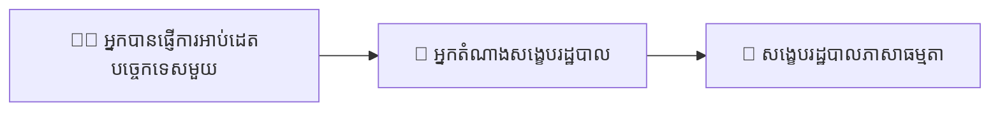

# មេរៀន 0 - ការណែនាំ

⏱️ ~10 នាទី

> [!WARNING]
> **ការមើលជាមុន និងការព្រំដែន៖** [តំណាង​ដែល​ផ្តល់​ឲ្យ​ដោយ​អ្នក​ផ្តោត​អាសយដ្ឋាន](https://learn.microsoft.com/azure/foundry/agents/concepts/hosted-agents) កំពុង​នៅ​ក្នុង **ការមើលជាមុន​សាធារណៈ** - មិនបានណែនាំសម្រាប់ការងារផលិតឡើយ។ សូមជ្រាបពីអ្វីខាងក្រោម៖
> - **តំបន់ដែលគាំទ្រត្រូវបានកំណត់** - សូមពិនិត្យមើល [ភាពអាចប្រើតំបន់](https://learn.microsoft.com/azure/foundry/agents/concepts/hosted-agents#region-availability) មុនពេលបង្កើតធនធាន។ ប្រសិនបើអ្នកជ្រើសតំបន់មិនគាំទ្រ ការតម្លើងនឹងរំខាន។
> - កញ្ចប់ `azure-ai-agentserver-agentframework` គឺ​ជា​បង្ហាញ​មុន​ទូទាត់ - API អាចផ្លាស់ប្តូរដោយរវាងកំណែ។
> - កំណត់ការពង្រីក៖ តំណាងផ្តល់ជូនគាំទ្រ 0–5 ភាគចំណែក (រួមមានការពង្រីកដល់សូន្យ)។
> - មុខងារមួយចំនួនដែលបង្ហាញនៅក្នុងវគ្គសិក្សានេះអាចមានការផ្លាស់ប្តូរនៅពេលសេវាកម្មទៅកាន់ GA។

## អ្វីដែលអ្នកនឹងបង្កើត

ក្នុងវគ្គសិក្សានេះ អ្នកនឹងបង្កើតតំណាង **"ពន្យល់ដូចខ្ញុំជាសធារណៈ"** — តំណាង AI ផ្តល់ដោយ cloud ដែលយកព័ត៌មានបច្ចេកទេសស្មុគស្មាញហើយសរសេរឡើងវិញជាខ្លឹមសារសរុបប្រធានបទជាភាសាអង់គ្លេសឯកច្ឆន្ទ។

```mermaid
flowchart LR
    A["🧑‍💻 អ្នកបានផ្ញើការអាប់ដេតបច្ចេកទេសមួយ"] --> B["🤖 អ្នកតំណាងសង្ខេបរដ្ឋបាល"]
    B --> C["📝 សង្ខេបរដ្ឋបាលភាសាធម្មតា"]
```

**តំណាងនេះប្រើប្រាស់៖**
- **ប៊្រេកភ្រេមរួម Microsoft Agent Framework** - សម្រាប់តុល្យភាពនិងរចនាសម្ព័ន្ធតំណាង
- **Foundry Toolkit សម្រាប់ VS Code** - ដើម្បីប្រើបន្ទះដាក់ ផ្ទៀងផ្ទាត់ក្នុងស្រុក ហើយចែកចាយ
- **គំរូ AI** (ឧទាហរណ៍ `gpt-4.1-mini/gpt-5-mini`) - ដើម្បីបង្កើតសរុបប្រធានបទ

នៅចុងបញ្ចប់នៃមេរៀននេះ អ្នកនឹងមានតំណាងសកម្មដែលអាចសាកល្បងក្នុងស្រុកតាមរយៈ Agent Inspector ហើយអាចចែកចាយទៅ cloud បាន។

---

## តំណាងផ្តោត​អាសយដ្ឋាន​គឺ​រ៉ុម​យ៉ាង​ដូចម្ដេច?

**តំណាងផ្តោត​អាសយដ្ឋាន** គឺជា តំណាង AI ដែលដំណើរការជាសេវាកម្មមានការគ្រប់គ្រងក្នុង Microsoft Foundry។ មិនចាំបាច់គ្រប់គ្រងហេដ្ឋារចនាសម្ព័ន្ធរបស់អ្នកផ្ទាល់ទេ អ្នកដាក់កូដតំណាងនៅក្នុង container ហើយ Foundry នឹងថែរក្សាការពង្រីក ការអញ្ជើញ និងបង្ហាញវាតាមរយៈ endpoint HTTP ស្ដង់ដារ។

| គំនិត | អត្ថន័យ |
|---------|--------------|
| **តំណាង** | កូដ Python របស់អ្នកដែលទទួលសារ ពីអ្នកប្រើ សំណើរផ្ញើទៅគំរូ AI ហើយតបតំណាងវិញជាសំណាក់សំខាន់ |
| **ផ្តោត​អាសយដ្ឋាន** | Foundry រត់ container របស់អ្នកជំនួស - គ្មាន VM គ្មាន Kubernetes គ្មានហេដ្ឋារចនាសម្ព័ន្ធចាំបាច់គ្រប់គ្រង |
| **ព_PROTOCOL​ការ​ចម្លើយ** | API HTTP ស្តង់ដារ (`POST /responses`) ដែលលទ្ធផលណាក៏អាចហៅដើម្បីតភ្ជាប់ជាមួយតំណាងបាន |
| **Agent Inspector** | UI សម្រាប់សាកល្បងក្នុងស្រុក (បញ្ចូលក្នុង Foundry Toolkit) អនុញ្ញាតឲ្យអ្នកចាប់ផ្តើមសន្ទនា​ជាមួយ​តំណាងមុនចែកចាយ |

នៅក្នុងវគ្គនេះ អ្នកនឹងធ្វើពីគ្មានរឿងរហូតដល់មានតំណាងដែលបានផ្តោតអាសយដ្ឋានពេញលេញ — ឬអាចបញ្ឈប់នៅការសាកល្បងក្នុងស្រុកប្រសិនបើចង់។

---

## ជ្រើសរើសផ្លូវរបស់អ្នក

> ⚠️ **ជ្រើសរើសផ្លូវមួយមុនបន្ត។** ជម្រើសរបស់អ្នកកំណត់ឲ្យដឹងពីឧបករណ៍ត្រូវដំឡើង និងមេរៀនណាដែលអាចអនុវត្តបាន។ អ្នកអាចប្តូរពី ផ្លូវ B → ផ្លូវ A បន្ទាប់ពីបានជាវ។

<strong>🅰️ ផ្លូវ A - ឥតកន្លែង Azure cloud (ត្រូវការជាវ Azure)</strong>

| | សេចក្ដីលម្អិត |
|---|---|
| **សម្រាប់អ្នកណា?** | អ្នកមានជាវ Azure សកម្ម និងអាចបង្កើតធនធាន Foundry |
| **គំរូ** | Azure OpenAI តាម Foundry (ឧទាហរណ៍ `gpt-4.1-mini/gpt-5-mini`) |
| **មេរៀនដែលគ្របដណ្តប់** | ម៉ូឌុលទាំងអស់ (00–07) |
| **ចែកចាយទៅ cloud?** | ✅ បាទ - ចែកចាយពេញលេញពីដំបូងដល់ចុង |

<strong>🅱️ ផ្លូវ B - ក្នុងស្រុក / ជាន់ឥតគិតថ្លៃ (មិនត្រូវការជាវ Azure)</strong>

| | សេចក្ដីលម្អិត |
|---|---|
| **សម្រាប់អ្នកណា?** | MVPs សិស្ស ឬអ្នកដែលមិនមានចូលដំណើរការឧបករណ៍ Azure |
| **គំរូ** | **Foundry Local** (ឥតគិតថ្លៃ ដំណើរការលើម៉ាស៊ីនអ្នក) |
| **មេរៀនដែលគ្របដណ្តប់** | ម៉ូឌុល 00–04 (រំលងការចែកចាយ និងផ្ទៀងផ្ទាត់ cloud) |
| **ចែកចាយទៅ cloud?** | ❌ ទេ - សាកល្បងក្នុងស្រុកតែតាម Agent Inspector |

---

## ផ្លូវទាំងអស់៖ ឧបករណ៍ត្រូវការ

ដំឡើងឧបករណ៍នីមួយៗខាងក្រោម។ បន្ទាប់ពីដំឡើង សូមធ្វើការត្រួតពិនិត្យថាវាដំណើរការមែនទែនដោយរត់ពាក្យបញ្ជាចាប់ផ្តើម។

| # | ឧបករណ៍ | កំណែ | ដំឡើង | ត្រួតពិនិត្យ (លទ្ធផលរំពឹង) |
|---|------|---------|---------|---------------------------|
| 1 | **Visual Studio Code** | ថ្មីបំផុត | [code.visualstudio.com](https://code.visualstudio.com/) | បើកដោយគ្មានកំហុស |
| 2 | **Python** | 3.12 ឬខ្ពស់ជាងនេះ| [python.org/downloads](https://www.python.org/downloads/) | `python --version` $\rightarrow$ `Python 3.12.x` |
| 3 | **Foundry Toolkit សម្រាប់ VS Code** | ថ្មីបំផុត | Extension ID: `ms-windows-ai-studio.windows-ai-studio` | រូបតំណាង Foundry នៅក្នុង Activity Bar |
| 4 | **ផ្នែកបន្ថែម Python សម្រាប់ VS Code** | ថ្មីបំផុត | Extension ID: `ms-python.python` | ត្រូវបានដំឡើងក្នុងផ្ទាំង Extension |

> [!TIP]
> **គន្លឹះផ្នែកដំឡើង៖**
> - **Python PATH (Windows):** តែងតែពិនិត្យមើល **"Add Python to PATH"** នៅលើអេក្រង់ដំបូងនៃកម្មវិធីដំឡើង Python។ ប្រសិនបើមិនមាននេះ `python` នឹងមិនត្រូវបានទទួលស្គាល់នៅក្នុង terminal។
> - **កំណែ Python ច្រើន៖** ប្រសិនបើអ្នកមាន Python 3.10 និង 3.12 ដំណើរការផ្សំ សូមប្រើ `python3.12 -m venv .venv` ដើម្បីធានាគុណភាពឧបករណ៍ថាប្រើបានកំណែត្រឹមត្រូវសម្រាប់ virtual environment របស់អ្នក។
> - **Docker WSL 2 (Windows):** ពេលដំឡើង Docker Desktop សូមយកចិត្តទុកដាក់ជ្រើសរើស **WSL 2 backend**។ Docker ជាមួយ Hyper-V ជាម៉ាស៊ីនដំណើរការធ្វើការខ្វះខាត និងអាចបង្កើតបញ្ហាជាមួយការបង្កើត container នៅ Foundry។
> - **Docker មិនដំណើរការទេ?** រង់ចាំ 30–60 វិនាទីបន្ទាប់ពីបើក Docker Desktop។ រត់ `docker info` — ប្រសិនបើអ្នកឃើញ "Cannot connect to the Docker daemon," Docker កំពុងត្រូវបានចាប់ផ្តើម។
> - **ផ្នែកបន្ថែម VS Code មិនបង្ហាញ?** បន្ទាប់ពីដំឡើង extension សូមបញ្ចូលម្តងទៀតភ្នាក់ងារ៖ `Ctrl+Shift+P` → `Developer: Reload Window`។

> **អ្នកប្រើ Windows:** សូមពិនិត្យ **"Add Python to PATH"** នៅពេលដំឡើង Python។

**បន្ទាប់:** [01 - រៀបចំ →](01-setup.md)

---

<!-- CO-OP TRANSLATOR DISCLAIMER START -->
**ការបដិសេធ**:
ឯកសារនេះត្រូវបានបម្លែងភាសា ដោយប្រើសេវាបម្លែងភាសា AI [Co-op Translator](https://github.com/Azure/co-op-translator)។ ទោះយើងខ្ញុំមានក្តីប្រាថ្នាឱ្យបានច្បាស់លាស់ តែសូមយល់ដឹងថាការបម្លែងដោយស្វ័យប្រវត្តិក៏អាចមានកំហុសឬភាពមិនត្រឹមត្រូវ។ ឯកសារដើមជាភាសាទីតាំងគួរត្រូវបានគេប្រើជាប្រភពច្បាស់លាស់។ សម្រាប់ព័ត៌មានសំខាន់ៗ សូមណែនាំឱ្យប្រើប្រាស់ការប្រែដោយមនុស្សជំនាញ។ យើងខ្ញុំមិនទទួលខុសត្រូវចំពោះការយល់ច្រឡំ ឬការបកស្រាយខុសបន្ទាប់ពីការប្រើប្រាស់ការបម្លែងនេះនោះទេ។
<!-- CO-OP TRANSLATOR DISCLAIMER END -->