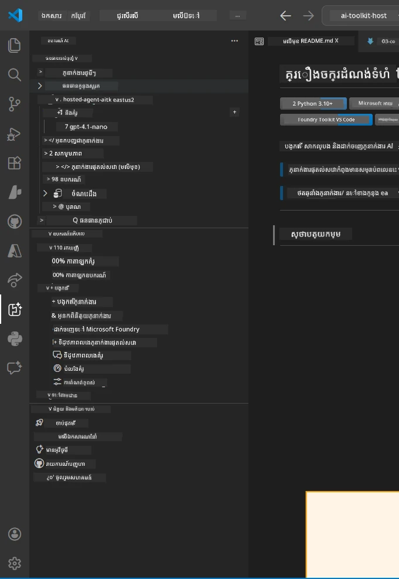
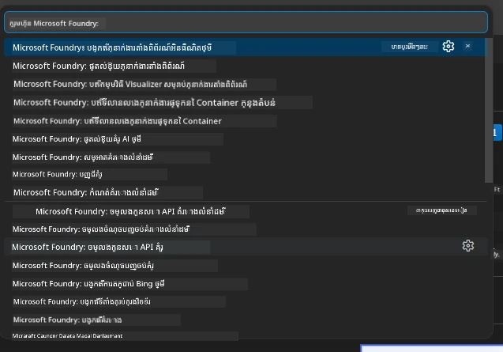

# Module 1 - Install Foundry Toolkit & Foundry Extension

មូឌុលនេះនាំអ្នកឆ្លងកាត់ការដំឡើង និងផ្ទៀងផ្ទាត់អំពីផ្នែកបន្ថែម VS Code សំខាន់ទាំងពីរនេះសម្រាប់និទស្សន៍ដំណើរការនេះ។ ប្រសិនបើអ្នកបានដំឡើងពួកវា រួចនៅពេល [Module 0](00-prerequisites.md) សូមប្រើមូឌុលនេះដើម្បីផ្ទៀងផ្ទាត់ថាពួកវាដំណើរការត្រឹមត្រូវ។

---

## ជំហ៊ានទី 1: ដំឡើងផ្នែកបន្ថែម Microsoft Foundry

ផ្នែកបន្ថែម **Microsoft Foundry សម្រាប់ VS Code** គឺជាឧបករណ៍សំខាន់សម្រាប់បង្កើតគម្រោង Foundry, ចាក់តំណើរការគំរូ, រៀបចំភ្នាក់ងារតភ្ជាប់, និងចាក់តំណើរការផ្ទាល់ពី VS Code។

1. បើក VS Code។
2. ចុច `Ctrl+Shift+X` ដើម្បីបើកផ្នែក **Extensions**។
3. នៅក្នុងប្រអប់ស្វែងរកនៅខាងលើ សរសេរ៖ **Microsoft Foundry**
4. ស្វែងរកលទ្ធផលមានចំណងជើង **Microsoft Foundry for Visual Studio Code**។
   - អ្នកបោះពុម្ពផ្សាយ: **Microsoft**
   - លេខសម្គាល់ផ្នែកបន្ថែម ៖ `TeamsDevApp.vscode-ai-foundry`
5. ចុចប៊ូតុង **Install**។
6. រំពឹងរងចាំដំណើរការ​ដំឡើង​រួច (អ្នកនឹងឃើញសញ្ញាការរីកចម្រើនតូចបន្តិច)។
7. បន្ទាប់ពីដំឡើងរួច សូមមើលនៅ **Activity Bar** (តំបន់រូបតំណាងជាប្រវែងនៅខាងឆ្វេងរបស់ VS Code)។ អ្នកគួរតែឃើញរូបតំណាងថ្មី **Microsoft Foundry** (ស្រដៀងពេជ្រឬរូបតំណាង AI)។
8. ចុចរូបតំណាង **Microsoft Foundry** ដើម្បីបើកទិដ្ឋភាពផ្នែកខាងក្រោមរបស់វា។ អ្នកគួរតែឃើញផ្នែកសម្រាប់៖
   - **ធនធាន** (ឬ គម្រោង)
   - **ភ្នាក់ងារ**
   - **គំរូ**

> **ប្រសិនបើរូបតំណាងមិនបង្ហាញ៖** សូមព្យាយាមបញ្ចូលឡើងវិញ VS Code (`Ctrl+Shift+P` → `Developer: Reload Window`)។

---

## ជំហ៊ានទី 2: ដំឡើងផ្នែកបន្ថែម Foundry Toolkit

ផ្នែកបន្ថែម **Foundry Toolkit** ផ្តល់នូវ [**Agent Inspector**](https://learn.microsoft.com/azure/foundry/agents/how-to/vs-code-agents-workflow-pro-code) - មុខងារមើលឃើញសម្រាប់តេស្ត និងដោះស្រាយបញ្ហាភ្នាក់ងារជាលក្ខណៈមូលដ្ឋាន - រួមជាមួយផ្សងព្រេង, គ្រប់គ្រងគំរូនិងឧបករណ៍ប៉ាន់ស្មាន។

1. នៅក្នុងផ្នែក Extensions (`Ctrl+Shift+X`), សម្អាតប្រអប់ស្វែងរក ហើយសរសេរ៖ **Foundry Toolkit**
2. ស្វែងរក **Foundry Toolkit** ក្នុងលទ្ធផល។
   - អ្នកបោះពុម្ពផ្សាយ: **Microsoft**
   - លេខសម្គាល់ផ្នែកបន្ថែម ៖ `ms-windows-ai-studio.windows-ai-studio`
3. ចុច **Install**។
4. បន្ទាប់ពីដំឡើងរួច រូបតំណាង **Foundry Toolkit** បង្ហាញនៅក្នុង Activity Bar (ស្រដៀងជារូបតំណាងរ៉ូបូត/ភ្លឹមភ្លាម)។
5. ចុចរូបតំណាង **Foundry Toolkit** ដើម្បីបើកទិដ្ឋភាពផ្នែកខាងក្រោមរបស់វា។ អ្នកគួរតែឃើញផ្ទាំងស្វាគមន៍ Foundry Toolkit ជាមួយជម្រើសសម្រាប់៖
   - **គំរូ**
   - **ផ្សងព្រេង**
   - **ភ្នាក់ងារ**

---

## ជំហ៊ានទី 3: ផ្ទៀងផ្ទាត់ថា ផ្នែកបន្ថែមទាំងពីរដំណើរការត្រឹមត្រូវ

### 3.1 ផ្ទៀងផ្ទាត់ផ្នែកបន្ថែម Microsoft Foundry

1. ចុចរូបតំណាង **Microsoft Foundry** នៅក្នុង Activity Bar។
2. ប្រសិនបើអ្នកបានចុះឈ្មោះចូល Azure (ពី Module 0) អ្នកគួរតែឃើញគម្រោងរបស់អ្នកត្រូវបង្ហាញនៅក្រោម **ធនធាន**។
3. ប្រសិនបើបានស្នើឲ្យចុះឈ្មោះចូលសូមចុច **Sign in** ហើយធ្វើតាមដំណើរការផ្ទៀងផ្ទាត់។
4. បញ្ជាក់ថាអ្នកអាចមើលផ្នែកខាងក្រោមបានដោយគ្មានកំហុស។

### 3.2 ផ្ទៀងផ្ទាត់ផ្នែកបន្ថែម Foundry Toolkit

1. ចុចរូបតំណាង **Foundry Toolkit** នៅក្នុង Activity Bar។
2. បញ្ជាក់ថាទិដ្ឋភាពស្វាគមន៍ឬផ្ទាំងចម្បងដំណើរការដោយគ្មានកំហុស។
3. អ្នកមិនចាំបាច់កំណត់អ្វីមុនទេ - យើងនឹងប្រើ Agent Inspector នៅ [Module 5](05-test-locally.md)។

### 3.3 ផ្ទៀងផ្ទាត់តាមរយៈ Command Palette

1. ចុច `Ctrl+Shift+P` ដើម្បីបើក Command Palette។
2. សរសេរ **"Microsoft Foundry"** - អ្នកគួរតែឃើញពាក្យបញ្ជារដូចជា៖
   - `Microsoft Foundry: Create a New Hosted Agent`
   - `Microsoft Foundry: Deploy Hosted Agent`
   - `Microsoft Foundry: Open Model Catalog`
3. ចុច `Escape` ដើម្បីបិទ Command Palette។
4. បើក Command Palette ម្តងទៀត ហើយសរសេរ **"Foundry Toolkit"** - អ្នកគួរតែឃើញពាក្យបញ្ជារដូចជា៖
   - `Foundry Toolkit: Open Agent Inspector`

> ប្រសិនបើអ្នកមិនឃើញពាក្យបញ្ជារទាំងនេះទេ ផ្នែកបន្ថែមមិនបានដំឡើងត្រឹមត្រូវឡើយ។ សូមព្យាយាមបញ្ចប់ដំឡើងហើយដំឡើងវិញពួកវា។

---

## អ្វីដែលផ្នែកបន្ថែមទាំងនេះធ្វើនៅក្នុងនិទស្សន៍ដំណើរការនេះ

| ផ្នែកបន្ថែម | អ្វីដែលវាធ្វើ | ពេលដែលអ្នកនឹងប្រើវា |
|-------------|----------------|------------------------|
| **Microsoft Foundry សម្រាប់ VS Code** | បង្កើតគម្រោង Foundry, ចាក់តំណើរការគំរូ, **រៀបចំ [ភ្នាក់ងារតភ្ជាប់](https://learn.microsoft.com/azure/foundry/agents/concepts/hosted-agents)** (បង្កើតស្វ័យប្រវត្តិ `agent.yaml`, `main.py`, `Dockerfile`, `requirements.txt`), ចាក់តំណើរទៅ [Foundry Agent Service](https://learn.microsoft.com/azure/foundry/agents/overview) | Modules 2, 3, 6, 7 |
| **Foundry Toolkit** | Agent Inspector សម្រាប់តេស្តនិងដោះស្រាយបញ្ហាផ្នែកមូលដ្ឋាន, user interface ផ្សងព្រេង, គ្រប់គ្រងគំរូ | Modules 5, 7 |

> **ផ្នែកបន្ថែម Foundry គឺជាឧបករណ៍ដ៏សំខាន់បំផុតក្នុងនិទស្សន៍ដំណើរការនេះ។** វាគ្រប់គ្រងជីវិតវដ្តជំពូកចុងក្រោយ៖ រៀបចំ → កំណត់រចនា → ចាក់តំណើ → ផ្ទៀងផ្ទាត់។ Foundry Toolkit បំពេញបន្ថែមដោយផ្តល់ Agent Inspector ជាផ្ទាំង UI សម្រាប់តេស្តក្នុងមូលដ្ឋាន។

---

### ចំណុចត្រួតពិនិត្យ

- [ ] រូបតំណាង Microsoft Foundry បង្ហាញនៅក្នុង Activity Bar
- [ ] ចុចវា ដើម្បីបើកផ្នែកខាងក្រោមដោយគ្មានកំហុស
- [ ] រូបតំណាង Foundry Toolkit បង្ហាញនៅក្នុង Activity Bar
- [ ] ចុចវា ដើម្បីបើកផ្នែកខាងក្រោមដោយគ្មានកំហុស
- [ ] `Ctrl+Shift+P` → សរសេរ "Microsoft Foundry" បង្ហាញពាក្យបញ្ជារដែលមាន
- [ ] `Ctrl+Shift+P` → សរសេរ "Foundry Toolkit" បង្ហាញពាក្យបញ្ជារដែលមាន

---

**មុនหน้า:** [00 - Prerequisites](00-prerequisites.md) · **បន្ទាប់:** [02 - Create Foundry Project →](02-create-foundry-project.md)

---

<!-- CO-OP TRANSLATOR DISCLAIMER START -->
**ការបដិសេធ**៖  
ឯកសារនេះត្រូវបានបកប្រែដោយប្រើសេវាបកប្រែ AI [Co-op Translator](https://github.com/Azure/co-op-translator)។ ខណៈពេលដែលយើងខំប្រឹងប្រែងសម្រាប់ភាពត្រឹមត្រូវ សូមយល់ដឹងថាការបកប្រែដោយស្វ័យប្រវត្តិអាចមានកំហុស ឬការបរិយាណមិនត្រឹមត្រូវ។ ឯកសារដើមនៅក្នុងភាសាដើមគួរត្រូវបានពិចារណាថាជា ប្រភពដែលគួរត្រូវដាក់ទុកចិត្ត។ សម្រាប់ព័ត៌មានចំឡែក យើងសូមណែនាំឱ្យប្រើការបកប្រែដោយមនុស្សជំនាញវិជ្ជាជីវៈ។ យើងមិនទទួលខុសត្រូវចំពោះការយល់ច្រឡំ ឬការបកប្រែខុសៗដែលកើតឡើងពីការប្រើប្រាស់បកប្រែនេះទេ។
<!-- CO-OP TRANSLATOR DISCLAIMER END -->