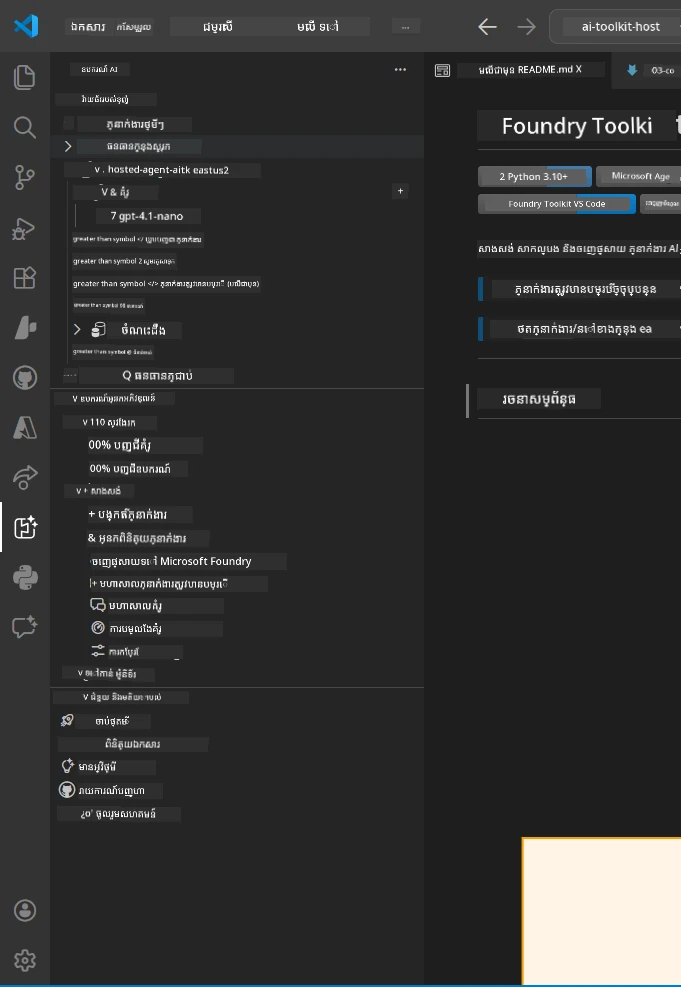
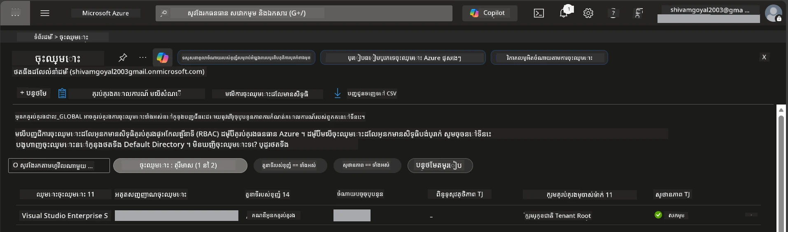
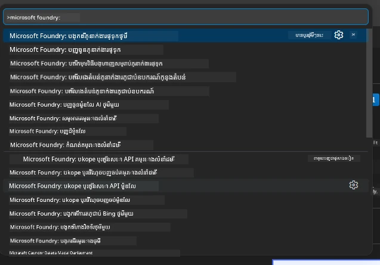
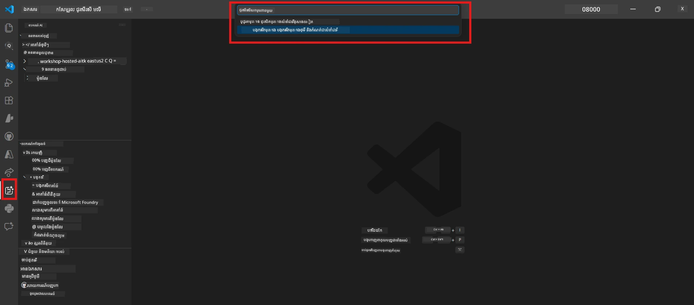
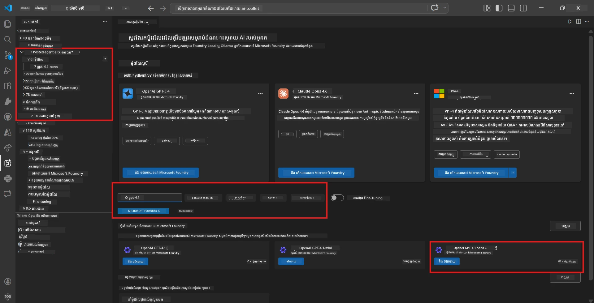
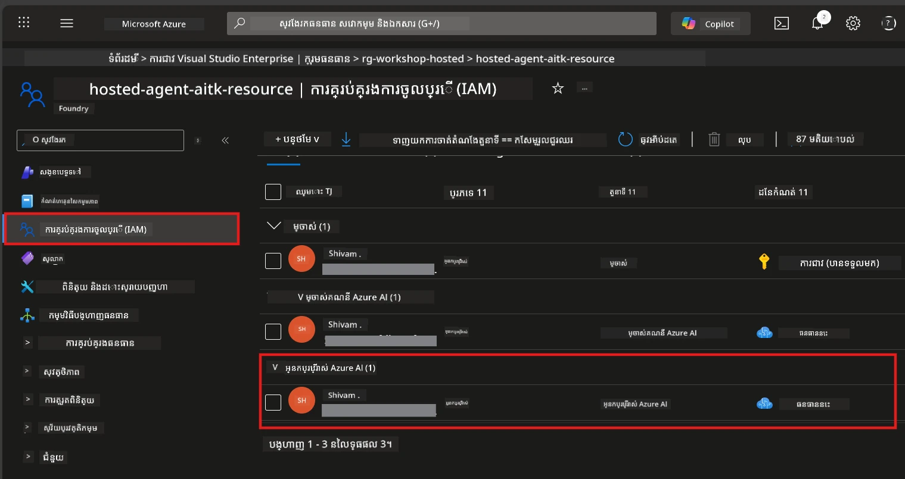

# ការដំឡើង៖ ផ្នែកបន្ថែម គម្រោង និងគំរូ

⏱️ ~15 នាទី

នៅក្នុងមոդ្យុលនេះ អ្នកត្រូវដំឡើងនិងផ្ទៀងផ្ទាត់ផ្នែកបន្ថែម Foundry Toolkit បង្កើត (ឬភ្ជាប់ទៅ) គម្រោង Foundry ហើយដាក់បង្ហោះគំរូដែលភ្នាក់ងារបស់អ្នកនឹងប្រើ។

## ជំហានទី ១៖ ដំឡើង Foundry Toolkit

**Foundry Toolkit សម្រាប់ VS Code** គឺជាផ្នែកបន្ថែមសំខាន់សម្រាប់ព្រឹត្តិប័ត្រនេះ។ វាប្រគល់មុខងារបង្កើតគម្រោង ដាក់បង្ហោះគំរូ បង្កើតភ្នាក់ងារ ពិនិត្យតាមក្នុងមូលដ្ឋាន (Agent Inspector) និងដាក់បង្ហោះទៅពពក - ទាំងអស់នេះពី VS Code។

1. បើក VS Code រួចចុច `Ctrl+Shift+X` ដើម្បីបើកផ្ទាំង **Extensions**។
2. ស្វែងរក **Foundry Toolkit**។
3. ដំឡើង **Foundry Toolkit សម្រាប់ VS Code** (អ្នកផ្សព្វផ្សាយ: Microsoft, អត្តសញ្ញាណៈ: `ms-windows-ai-studio.windows-ai-studio`)។
4. បន្ទាប់ពីដំឡើងរួច នៅក្នុង Activity Bar (ផ្នែកមើលកែងឆ្វេង) នឹងមានរូបតំណាង **Foundry Toolkit** បង្ហាញ។

> *កំណត់សម្គាល់ៈ Activity Bar អាចបង្ហាញ "AI TOOLKIT" នៅក្នុងជំនាន់ផ្នែកបន្ថែមចាស់ៗ។ មុខងារត្រូវគ្នា។*



## ជំហានទី ២៖ កំណត់តាមការចូលប្រើរបស់អ្នក

> **ជ្រើសរើសផ្លូវរបស់អ្នក៖** ពង្រីកផ្នែកខាងក្រោមដែលសមរម្យនឹងការកំណត់របស់អ្នក។ អ្នកត្រូវបញ្ចប់ត្រឹមតែ **មួយ** ផ្លូវ។

<details>
<summary><strong>🅰️ ផ្លូវ A - ពពក Azure (តម្រូវឱ្យមានជាវ Azure)</strong></summary>

### Azure CLI

1. ដំឡើងពី [learn.microsoft.com/cli/azure/install-azure-cli](https://learn.microsoft.com/cli/azure/install-azure-cli)។
2. ផ្ទៀងផ្ទាត់៖ `az --version` (រំពឹងបាន 2.80.0+).
3. ចូលគណនី៖ `az login`

### ជម្រើសការផ្ទៀងផ្ទាត់

[Microsoft Agent Framework](https://learn.microsoft.com/agent-framework/overview/) ប្រើ [`DefaultAzureCredential`](https://learn.microsoft.com/azure/developer/python/sdk/authentication/credential-chains#defaultazurecredential-overview) ដែលព្យាយាមវិធីបញ្ជាក់ជាច្រើនតាមលំដាប់។ ជ្រើសវិធីណាមួយដែលសមស្របនឹងបរិស្ថានរបស់អ្នក៖

#### ជម្រើស ១៖ VS Code គណនី (ផ្តល់ជូនសម្រាប់វគ្គបណ្ដុះបណ្ដាល)
1. ចុចរូបតំណាង **Accounts** (រូបមនុស្ស) នៅខាងក្រោមឆ្វេងនៃ VS Code។
2. ជ្រើស **Sign in to use Microsoft Foundry** (ឬ **Sign in with Azure**)។
3. វេបប្រោសើនឹងបើក - ចូលគណនី Azure ដែលមានសិទ្ធិប្រើជាវ។
4. ត្រឡប់ទៅវិញ VS Code។ អ្នកគួរតែឃើញឈ្មោះគណនីរបស់អ្នកនៅខាងក្រោមឆ្វេង។

#### ជម្រើស ២៖ Azure CLI
```bash
az login
az account set --subscription "<your-subscription-id>"
```

#### ជម្រើស ៣៖ Service Principal (សហគ្រាស/CI)
សម្រាប់បរិស្ថានដ្ឋានតឹងរឹង ឬ CI/CD pipelines សូមកំណត់អថេរបរិស្ថានទាំងនេះនៅក្នុងឯកសារ `.env` របស់អ្នក៖
```env
AZURE_TENANT_ID=<your-tenant-id>
AZURE_CLIENT_ID=<your-client-id>
AZURE_CLIENT_SECRET=<your-client-secret>
```

> **របៀប `DefaultAzureCredential` ធ្វើការៈ** វាព្យាយាមអថេរបរិស្ថានជាលើក្រោយ បន្ទាប់មក managed identity បន្ទាប់មកការចូល VS Code បន្ទាប់មក Azure CLI ហើយប្រើយ៉ាងណាដែលជោគជ័យជាមុន។ មើល [ឯកសារខ្សែជើងស្រឡាយគណនេយ្យ](https://learn.microsoft.com/azure/developer/python/sdk/authentication/credential-chains#defaultazurecredential-overview)។

### Azure Developer CLI (azd)

1. ដំឡើង៖ `winget install microsoft.azd` (លើ Windows) ឬមើល [ឯកសារដំឡើង](https://learn.microsoft.com/azure/developer/azure-developer-cli/install-azd)។
2. ផ្ទៀងផ្ទាត់៖ `azd version`
3. ចូល៖ `azd auth login`

### Docker Desktop (ជម្រើសបន្ថែម)

Docker ត្រូវការតែបើអ្នកចង់បង្កើត containers ក្នុងម៉ាស៊ីន។ ផ្នែកបន្ថែម Foundry ដំណើរការបង្កើតដោយស្វ័យប្រវត្តិនៅពេលដាក់បង្ហោះ។

1. ដំឡើងពី [docs.docker.com/get-docker](https://docs.docker.com/get-docker/)។
2. ផ្ទៀងផ្ទាត់៖ `docker info`

### ជាវ Azure និង RBAC

1. ចូលនៅ [portal.azure.com](https://portal.azure.com)។
2. ទៅកាន់ **Subscriptions** ហើយបញ្ជាក់ទំនងថ wenigstens មួយ គឺ **សកម្ម**។
3. កត់សម្គាល់ **លេខសម្គាល់ជាវ** បន្ទាប់មកអ្នកនឹងត្រូវការ នៅមodu 01។



#### តារាងសេចក្តីហេតុ RBAC

ការដាក់បង្ហោះ [Hosted Agent](https://learn.microsoft.com/azure/foundry/agents/concepts/hosted-agents) ត្រូវបានទាមទារសិទ្ធិ **data action** ដែលតួនាទី Azure `Owner` និង `Contributor` ទូទៅមិនមានរួមបញ្ចូលទេ។ ប្រើតារាងខាងក្រោមដើម្បីកំណត់តួនាទីដែលអ្នកត្រូវការ៖

| សេចក្តីហេតុ | តួនាទីដែលត្រូវការ | កន្លែងកំណត់តួនាទី |
|----------|---------------|----------------------|
| បង្កើតគម្រោង Foundry ថ្មី | **Azure AI Owner** លើធនធាន Foundry | ធនធាន Foundry នៅមួយកន្លែងក្នុង Azure Portal |
| ដាក់បង្ហោះទៅគម្រោងមានរួច (ធនធានថ្មី) | **Azure AI Owner** + **Contributor** លើជាវ | ជាវ + ធនធាន Foundry |
| ដាក់បង្ហោះទៅគម្រោងកំណត់រួច | **Reader** លើគណនី + **Azure AI User** លើគម្រោង | គណនី + គម្រោង នៅក្នុង Azure Portal |
| សម្រាប់ធ្វើតេស្តក្នុងមូលដ្ឋានតែប៉ុណ្ណោះ (គ្មានការដាក់បង្ហោះ) | **Azure AI User** លើគម្រោង | គម្រោងនៅក្នុង Azure Portal |

> **ចំណុចសំខាន់ៈ** តួនាទី Azure `Owner` និង `Contributor` មានសិទ្ធិគ្រប់គ្រងប៉ុណ្ណោះ (ប្រតិបត្ដការពី ARM)។ អ្នកត្រូវការ [**Azure AI User**](https://learn.microsoft.com/azure/foundry/concepts/rbac-foundry#built-in-roles) (ឬខ្ពស់ជាងនេះ) សម្រាប់ *សកម្មភាពទិន្នន័យ* ដូចជា `agents/write` ដែលចាំបាច់សម្រាប់បង្កើតនិងដាក់បង្ហោះភ្នាក់ងារ។

## ភ្ជាប់ ឬ បង្កើតគម្រោង Foundry



1. ចុច `Ctrl+Shift+P` → វាយ **Foundry Toolkit: Create Project** → ជ្រើសរើសវា។
2. ជ្រើស **ជាវ Azure** របស់អ្នកពីបញ្ជីចុះក្រោម។
3. ជ្រើស ឬ បង្កើត **ក្រុមធនធាន** (ឧ. `rg-hosted-agents-workshop`)។
4. ជ្រើស **តំបន់** ដែលគាំទ្រភ្នាក់ងារផ្ដល់បំរើ: `East US`, `West US 2`, ឬ `Sweden Central`។ មើល [region availability](https://learn.microsoft.com/azure/foundry/agents/concepts/hosted-agents#region-availability)។
5. បញ្ចូលឈ្មោះគម្រោង (ឧ. `workshop-agents`)។
6. រង់ចាំ 2-5 នាទីសម្រាប់ការផ្ដល់សេវា។ មានការជូនដំណឹងភាពជោគជ័យបង្ហាញនៅក្នុង VS Code។
7. ពេលពេញលេញ គម្រោងរបស់អ្នកបង្ហាញនៅក្នុងផ្នែកបន្ថែម **Foundry Toolkit** ខាងក្រោម **MY RESOURCES**។



## ដាក់បង្ហោះគំរូ និងផ្ដល់តួនាទី RBAC

ភ្នាក់ងារផ្ដល់សេវារបស់អ្នកត្រូវការគំរូ AI ដើម្បីបង្កើតចម្លើយ។

#### ម៉ាទ្រីកជ្រើសរើសគំរូ
បុគ្គលិកអ្នកប្រើ អាចជ្រើសពីកម្រិតគំរូផ្សេងៗគ្នា៖

| គំរូ | សមស្របសម្រាប់ | ថ្លៃ | កំណត់ចំណាំ |
|-------|----------|------|-------|
| `gpt-4.1` | ចម្លើយគុណភាពខ្ពស់ និងមានពិចារណា | ខ្ពស់ | លទ្ធផលល្អបំផុត ផ្ដល់អនុសាសន៍សម្រាប់ការធ្វើតេស្តចុងក្រោយ |
| `gpt-4.1-mini/gpt-5-mini` | ល្បឿនលឿនថ្លៃតិច | តិចជាង | ល្អសម្រាប់ការអភិវឌ្ឍន៍វគ្គបណ្ដុះបណ្ដាល និងធ្វើតេស្តលឿន |
| `gpt-4.1-nano` | មុខងារឆ្នៃប្រឌិត | តិចបំផុត | មានតម្លៃចំណាយសមរម្យបំផុត ក៏ប៉ុន្តែចម្លើយសាមញ្ញជាង |

1. ចុច `Ctrl+Shift+P` → **Foundry Toolkit: Open Model Catalog** (ឬចុច **Model Catalog** នៅផ្នែកបង្ហាញក្រោម DEVELOPER TOOLS → Discover)។
2. ស្វែងរក **gpt-4.1** ក្នុងសារពត៌មានកាតាឡុក។
3. រក **OpenAI GPT-4.1-mini** (ឬ `gpt-5-mini` សម្រាប់គុណភាពល្អជាង) ហើយចុច **Deploy**។



4. នៅក្នុងការកំណត់ការដាក់បង្ហោះ៖
   - **ឈ្មោះការដាក់បង្ហោះ៖** ទុកឈ្មោះលំនាំដើម ឬបញ្ចូលឈ្មោះផ្ទាល់ខ្លួន។ **ចងចាំឈ្មោះនេះ។**
   - **គោលដៅ៖** ជ្រើស **Deploy to Foundry Toolkit** → ជ្រើសគម្រោងរបស់អ្នក។
5. ចុច **Deploy** រួចរង់ចាំ 1-3 នាទី។

> **អនុសាសន៍៖** ប្រើ `gpt-4.1-mini/gpt-5-mini` សម្រាប់វគ្គបណ្ដុះបណ្ដាល - ល្បឿនលឿន តម្លៃសមរម្យ និងផ្ដល់លទ្ធផលល្អ។

### កត់ចំណាំគម្លាំង

បន្ទាប់ពីដាក់បង្ហោះ សូមកត់សម្គាល់តម្លៃទាំងពីរ (អ្នកនឹងត្រូវប្រើនៅ Module 03):

| តម្លៃ | ត្រូវរកឃើញនៅទីណា |
|-------|-----------------|
| **ចំណុចចុងក្រោយគម្រោង** | ចុចគម្រោងរបស់អ្នកនៅផ្នែកបង្ហាញ → ដំណើរការបង្ហាញ URL (ឧ. `https://<account>.services.ai.azure.com/api/projects/<project>`) |
| **ឈ្មោះការដាក់បង្ហោះគំរូ** | ពង្រីកគម្រោង → **Models** → ឈ្មោះនៅជិតគំរូដែលបានដាក់បង្ហោះ (ឧ. `gpt-4.1-mini/gpt-5-mini`) |

### ផ្ដល់តួនាទី RBAC

> ⚠️ **នេះជាជំហានដែលភ្លេចញឹកញាប់បំផុត។** បើគ្មានតួនាទីត្រឹមត្រូវ ការដាក់បង្ហោះក្នុង Module 05 នឹងបរាជ័យ។

#### តួនាទីណាដែលខ្ញុំត្រូវការ?
ទៅតាមសេចក្តីហេតុរបស់អ្នក អ្នកត្រូវការប្រភេទតួនាទីដូចខាងក្រោម៖

| សេចក្តីហេតុ | តួនាទីដែលត្រូវការ | កន្លែងកំណត់តួនាទី |
|----------|---------------|----------------------|
| បង្កើតគម្រោង Foundry ថ្មី | **Azure AI Owner** លើធនធាន Foundry | ធនធាន Foundry នៅក្នុង Azure Portal |
| ដាក់បង្ហោះទៅគម្រោងមានរួច (ធនធានថ្មី) | **Azure AI Owner** + **Contributor** លើជាវ | ជាវ + ធនធាន Foundry |
| ដាក់បង្ហោះទៅគម្រោងកំណត់រួច | **Reader** លើគណនី + **Azure AI User** លើគម្រោង | គណនី + គម្រោង នៅក្នុង Azure Portal |

**ចំណុចសំខាន់ៈ** តួនាទី Azure `Owner` និង `Contributor` មានសិទ្ធិក្នុងការគ្រប់គ្រងប៉ុណ្ណោះ។ អ្នកត្រូវ **Azure AI User** (ឬខ្ពស់ជាងនេះ) សម្រាប់សកម្មភាពទិន្នន័យដូចជា `agents/write` ដែលចាំបាច់សម្រាប់បង្កើតនិងដាក់បង្ហោះភ្នាក់ងារ។

1. បើក [portal.azure.com](https://portal.azure.com)។
2. ស្វែងរកឈ្មោះ **គម្រោង Foundry** របស់អ្នក → ចុចលទ្ធផលដែលមានប្រភេទ **"Foundry Toolkit project"** (មិនមែនគណនីមេទេ)។
3. ចុច **Access control (IAM)** នៅផ្នែកជំហានឆ្វេង។
4. ចុច **+ Add** → **Add role assignment**។
5. **ផ្ទាំង Role:** ស្វែងរក **Azure AI User** ជ្រើសវា ចុច **Next**។
6. **ផ្ទាំង Members:** ជ្រើស **User, group, or service principal** → ចុច **+ Select members** → ស្វែងរកនិងជ្រើសអ្នក → ចុច **Select**។
7. ចុច **Review + assign** → ចុច **Review + assign** ម្តងទៀត។
8. **រង់ចាំ 1-2 នាទី** សម្រាប់ការផ្សាយពាណិជ្ជកម្ម។

> **ហេតុអ្វីបានជាតួនាទីនេះ?** តួនាទី Azure `Owner`/`Contributor` ប៉ុណ្ណោះផ្តល់សិទ្ធិគ្រប់គ្រង។ តួនាទី **Azure AI User** ផ្តល់សិទ្ធិ `agents/write` សម្រាប់សកម្មភាពទិន្នន័យដែលចាំបាច់សម្រាប់បង្កើតនិងដាក់បង្ហោះភ្នាក់ងារ។ មើល [ឯកសារ Foundry RBAC](https://learn.microsoft.com/azure/foundry/concepts/rbac-foundry#built-in-roles)។



</details>

<details>
<summary><strong>🅱️ ផ្លូវ B - មូលដ្ឋានក្នុងស្រុក / ជាន់ឥតគិតថ្លៃ (មិនទាមទារជាវ Azure)</strong></summary>

### Foundry Local

Foundry Local អនុញ្ញាតឱ្យអ្នកដំណើរការគំរូ AI លើម៉ាស៊ីនរបស់អ្នកដោយដាច់ពីគណនីពពក។ អ្នកអាចចូលប្រើគំរូ Foundry Local ដោយប្រើ Foundry Toolkit តាមរយៈសារពត៌មានកាតាឡុកដូចខាងក្រោម៖

1. ទៅកាន់ផ្នែកបន្ថែម Foundry Toolkit។
2. នៅក្នុងការ_Navigation_ របស់ Foundry Toolkit ទៅកាន់ **Developer Tools** > ហើយជ្រើស **Model Catalog**។
3. នៅផ្ទាំងថ្មីជ្រើស **local** ពីរបារទីភ្នាក់ងារ។
4. រុករកចុះក្រោម **Phi 4 Mini,** ហើយចុចប៊ូតុង **បន្ថែម** មានបង្ហាញផ្ទាំងបញ្ចេញថាគំរូកំពុងត្រូវបានទាញយក។
5. បន្ទាប់ពីគំរូត្រូវបានទាញយក អ្នកអាចបន្តដំណើរការជំហានបន្ទាប់បាន។

</details>

### ✅ ពិនិត្យចំណុចត្រួតពិនិត្យ


- [ ] `Ctrl+Shift+P` → "Foundry Toolkit" បង្ហាញបញ្ជាលក្ខណៈដែលអាចប្រើបាន
- [ ] ផ្នែកបន្ថែម Foundry Toolkit ត្រូវបានដំឡើង និងផ្នែកបង្ហាញផ្ទៃមុខបង្ហាញដោយគ្មានកំហុស
- [ ] VS Code បើក និងដំណើរការបានត្រឹមត្រូវ
- [ ] `python --version` បង្ហាញ 3.10+
- [ ] រូបតំណាង Foundry Toolkit មើលឃើញនៅក្នុង VS Code Activity Bar
- [ ] **ផ្លូវ A:** `az login` បានជោគជ័យ ជាវគឺសកម្ម
- [ ] **ផ្លូវ B:** Foundry Local កំពុងដំណើរការ (`foundry local status`)
- [ ] **ផ្លូវ A:** គម្រោង Foundry មើលឃើញនៅផ្នែកបង្ហាញ បានដាក់បង្ហោះគំរូ និងតួនាទី Azure AI User ត្រូវបានផ្ដល់
- [ ] **ផ្លូវ B:** Foundry Local កំពុងដំណើរការជាមួយគំរូមួយ
- [ ] អ្នកបានកត់សម្គាល់ **ចំណុចចុងក្រោយ** និង **ឈ្មោះការដាក់បង្ហោះគំរូ**


**មុន៖** [00 - បច្ឆេទដើម](00-prerequisites.md) · **បន្ទាប់៖** [02 - បង្កើតភ្នាក់ងារផ្ដល់សេវ →](02-create-hosted-agent.md)

---

<!-- CO-OP TRANSLATOR DISCLAIMER START -->
**ការបដិសេធ**:
ឯកសារនេះត្រូវបានបម្លែងភាសា ដោយប្រើសេវាបម្លែងភាសា AI [Co-op Translator](https://github.com/Azure/co-op-translator)។ ទោះយើងខ្ញុំមានក្តីប្រាថ្នាឱ្យបានច្បាស់លាស់ តែសូមយល់ដឹងថាការបម្លែងដោយស្វ័យប្រវត្តិក៏អាចមានកំហុសឬភាពមិនត្រឹមត្រូវ។ ឯកសារដើមជាភាសាទីតាំងគួរត្រូវបានគេប្រើជាប្រភពច្បាស់លាស់។ សម្រាប់ព័ត៌មានសំខាន់ៗ សូមណែនាំឱ្យប្រើប្រាស់ការប្រែដោយមនុស្សជំនាញ។ យើងខ្ញុំមិនទទួលខុសត្រូវចំពោះការយល់ច្រឡំ ឬការបកស្រាយខុសបន្ទាប់ពីការប្រើប្រាស់ការបម្លែងនេះនោះទេ។
<!-- CO-OP TRANSLATOR DISCLAIMER END -->