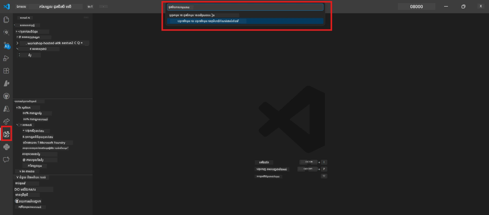
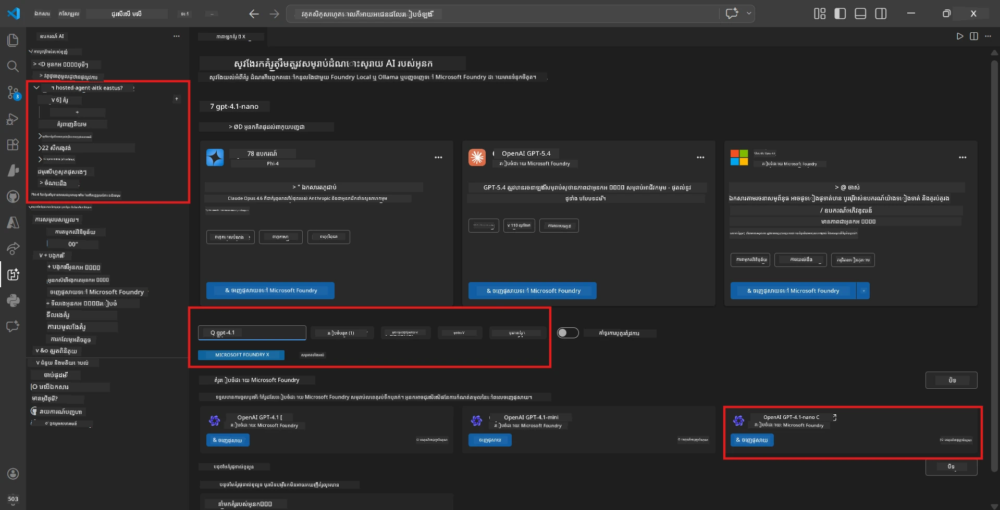
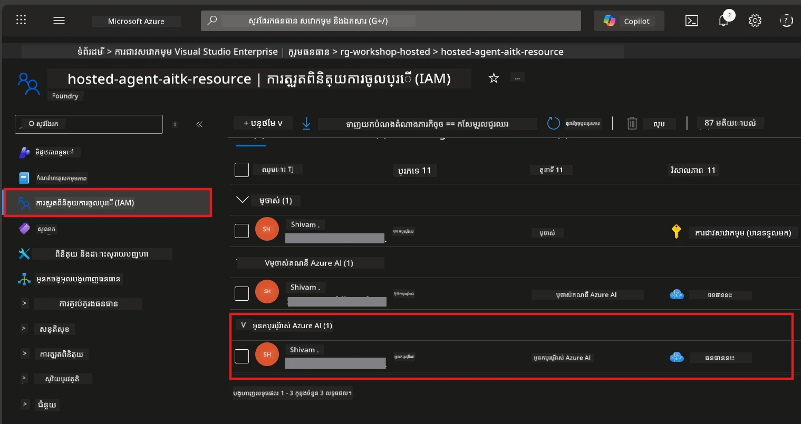

# Module 2 - បង្កើតគម្រោង Foundry និងចាក់បញ្ជូនម៉ូឌែល

នៅក្នុងម៉ូឌុលនេះ អ្នកបង្កើត (ឬជ្រើស) គម្រោង Microsoft Foundry មួយ ហើយចាក់បញ្ជូនម៉ូឌែលដែលភ្នាក់ងាររបស់អ្នកនឹងប្រើ។ រាល់ជំហានត្រូវបានសរសេរចេញយ៉ាងច្បាស់ - តាមដានវា​នៅក្នុងលំដាប់។

> ប្រសិនបើអ្នកមានគម្រោង Foundry ដែលមានម៉ូឌែលចាក់បញ្ជូនរួចហើយ អាចរំលងទៅ [Module 3](03-create-hosted-agent.md) ។

---

## ជំហាន 1៖ បង្កើតគម្រោង Foundry ពី VS Code

អ្នកនឹងប្រើផ្នែកបន្ថែម Microsoft Foundry ដើម្បីបង្កើតគម្រោងដោយមិនចាកចេញពី VS Code ទេ។

1. ចុច `Ctrl+Shift+P` ដើម្បីបើក **Command Palette**។
2. វាយ៖ **Microsoft Foundry: Create Project** ហើយជ្រើសវា។
3. បញ្ជីធ្លាក់ចុះត្រូវបង្ហាញ — ជ្រើស **Azure subscription** របស់អ្នកពីបញ្ជី។
4. អ្នកនឹងត្រូវបានស្នើឲ្យជ្រើសឬបង្កើត **resource group**៖
   - ដើម្បីបង្កើតថ្មី៖ វាយឈ្មោះមួយ (ឧ. `rg-hosted-agents-workshop`) ហើយចុច Enter។
   - ដើម្បីប្រើអ្វីដែលមានរួចហើយ៖ ជ្រើសវាពីបញ្ជីធ្លាក់ចុះ។
5. ជ្រើស **តំបន់**។ **សំខាន់៖** ជ្រើសតំបន់ដែលគាំទ្រភ្នាក់ងារត្រូវបានផ្តល់សេវាកម្ម។ ពិនិត្យ [region availability](https://learn.microsoft.com/azure/foundry/agents/concepts/hosted-agents#region-availability) — ជម្រើសធម្មតា គឺ `East US`, `West US 2`, ឬ `Sweden Central`។
6. បញ្ចូល **ឈ្មោះ** សម្រាប់គម្រោង Foundry (ឧ. `workshop-agents`)។
7. ចុច Enter ហើយរង់ចាំការផ្តល់សេវារោគ្គ៍ឲ្យបានសម្រេច។

> **ការផ្តល់សេវាគឺចំណាយពេល 2-5 នាទី។** អ្នកនឹងឃើញការជូនដំណឹងដំណើរការនៅជាលើកខាងស្ពៃឆ្វេងចុងក្រោមរបស់ VS Code។ មិនត្រូវបិទ VS Code នៅពេលផ្តល់សេវាកម្មនេះទេ។

8. ពេលផ្តល់សេវាកម្មរួច ស៊ាយប៊ា **Microsoft Foundry** នឹងបង្ហាញគម្រោងថ្មីរបស់អ្នកក្រោម **Resources**។
9. ចុចលើឈ្មោះគម្រោង ដើម្បីពង្រីក ហើយបញ្ជាក់ថាវាបង្ហាញផ្នែកដូចជា **Models + endpoints** និង **Agents**។



### ជម្រើសជំនួស៖ បង្កើតតាមរយៈឧបករណ៍ Foundry Portal

បើអ្នកចូលចិត្តប្រើកម្មវិធីរុករក៖

1. បើក [https://ai.azure.com](https://ai.azure.com) ហើយចូល។
2. ចុច **Create project** នៅលើទំព័រដើម។
3. បញ្ចូលឈ្មោះគម្រោង ជ្រើស subscription, resource group, និងតំបន់។
4. ចុច **Create** ហើយរង់ចាំការផ្តល់សេវា។
5. បន្ទាប់ពីបង្កើតរួច ត្រឡប់ទៅ VS Code — គម្រោងគួរតែបង្ហាញនៅក្នុង sidebar Foundry បន្ទាប់ពីធ្វើRefresh (ចុចរូបតំណាង refresh)។

---

## ជំហាន 2៖ ចាក់បញ្ជូនម៉ូឌែល

[ភ្នាក់ងារត្រូវបានផ្តល់សេវា](https://learn.microsoft.com/azure/foundry/agents/concepts/hosted-agents) របស់អ្នកត្រូវការម៉ូឌែល Azure OpenAI ដើម្បីបង្កើតការឆ្លើយតប។ អ្នកនឹង [ចាក់បញ្ជូនមួយឥឡូវនេះ](https://learn.microsoft.com/azure/ai-foundry/openai/how-to/create-resource#deploy-a-model)។

1. ចុច `Ctrl+Shift+P` ដើម្បីបើក **Command Palette**។
2. វាយ៖ **Microsoft Foundry: Open [Model Catalog](https://learn.microsoft.com/azure/ai-foundry/openai/concepts/models)** ហើយជ្រើសវា។
3. ទិដ្ឋភាព Model Catalog បើកនៅ VS Code។ រុករក ឬប្រើការស្វែងរកដើម្បីរក **gpt-4.1**។
4. ចុចលើកាតម៉ូឌែល **gpt-4.1** (ឬ `gpt-4.1-mini` ប្រសិនបើអ្នកចង់ថ្លៃថោក)។
5. ចុច **Deploy**។


6. នៅក្នុងការកំណត់ការចាក់បញ្ជូន៖
   - **Deployment name**: ទុកដដែល (ឧ. `gpt-4.1`) ឬបញ្ចូលឈ្មោះផ្ទាល់ខ្លួន។ **ចងចាំឈ្មោះនេះ** — អ្នកនឹងត្រូវការវានៅ Module 4។
   - **Target**: ជ្រើស **Deploy to Microsoft Foundry** ហើយជ្រើសគម្រោងដែលអ្នកទើបបង្កើត។
7. ចុច **Deploy** ហើយរង់ចាំការចាក់បញ្ជូនរួចរាល់ (1-3 នាទី)។

### ជ្រើសម៉ូឌែល

| ម៉ូឌែល | សម្រាប់ | ថ្លៃ | កត់សម្គាល់ |
|-------|----------|------|-------|
| `gpt-4.1` | ចម្លើយមានគុណភាពខ្ពស់ និងស្មុគស្មាញ | ថ្លៃខ្ពស់ | លទ្ធផលល្អបំផុត, អនុម័តសម្រាប់សាកល្បងចុងក្រោយ |
| `gpt-4.1-mini` | បង្វេីលឆាប់រហ័ស, ថ្លៃថោក | ថ្លៃទាប | ល្អសម្រាប់ការអភិវឌ្ឍន៍វគ្គ និងសាកល្បងរហ័ស |
| `gpt-4.1-nano` | ការងាររាបសារ | ថ្លៃទាបបំផុត | មានថ្លៃប្រសើរច្រើន ប៉ុន្តែចម្លើយសាមញ្ញ |

> **កំណត់សម្រាប់វគ្គនេះ៖** ប្រើ `gpt-4.1-mini` សម្រាប់អភិវឌ្ឍន៍ និងសាកល្បង។ វាឆាប់, ថ្លៃថោក, និងផ្តល់លទ្ធផលល្អសម្រាប់លំហាត់។

### ផ្ទៀងផ្ទាត់ការចាក់បញ្ជូនម៉ូឌែល

1. នៅ sidebar **Microsoft Foundry**, ពង្រីកគម្រោងរបស់អ្នក។
2. រកនៅក្រោម **Models + endpoints** (ឬផ្នែកស្រដៀង)។
3. អ្នកគួរតែឃើញម៉ូឌែលដែលបានចាក់បញ្ជូនរបស់អ្នក (ឧ. `gpt-4.1-mini`) មានស្ថានភាពជា **Succeeded** ឬ **Active**។
4. ចុចលើការចាក់បញ្ជូនម៉ូឌែល ដើម្បីមើលព័ត៌មានលម្អិត។
5. **កត់ចំណាំ** តម្លៃទាំងពីរ ខាងក្រោមនេះ — អ្នកនឹងត្រូវការពួកវានៅ Module 4៖

   | ការកំណត់ | កន្លែងរក | តម្លៃឧទាហរណ៍ |
   |---------|-----------------|---------------|
   | **Project endpoint** | ចុចលើឈ្មោះគម្រោងនៅ sidebar Foundry។ URL endpoint បង្ហាញនៅក្នុងទិដ្ឋភាពព័ត៌មានលម្អិត។ | `https://<account>.services.ai.azure.com/api/projects/<project>` |
   | **Model deployment name** | ឈ្មោះដែលបង្ហាញជាក្បាលម៉ូឌែលដែលបានចាក់បញ្ជូន។ | `gpt-4.1-mini` |

---

## ជំហាន 3៖ អូសកាតមានតួនាទី RBAC ត្រូវការ

នេះគឺជា **ជំហានដែលភ្លេចធ្វើស៊ីជម្រៅបំផុត**។ គ្មានតួនាទីត្រឹមត្រូវ ការចាក់បញ្ជូននៅ Module 6 នឹងបរាជ័យដោយបញ្ហា Permissions។

### 3.1 អូសតួនាទី Azure AI User ទៅខ្លួនអ្នក

1. បើកកម្មវិធីរុករក ហើយទៅ [https://portal.azure.com](https://portal.azure.com)។
2. នៅខាងលើប្រអប់ស្វែងរក វាយឈ្មោះ **Foundry project** របស់អ្នក ហើយចុចលើវា។  
   - **សំខាន់៖** ទៅកាន់ធនធាន **គម្រោង** (type: "Microsoft Foundry project") មិនមែន​ធនធានគណនី/មជ្ឈមណ្ឌលនោះទេ។
3. នៅក្នុងចំណុចរុករកឆ្វេងរបស់គម្រោង ចុច **Access control (IAM)**។
4. ចុចប៊ូតុង **+ Add** ខាងលើ → ជ្រើស **Add role assignment**។
5. នៅផ្ទាំង **Role**, ស្វែងរក [**Azure AI User**](https://learn.microsoft.com/azure/foundry/concepts/rbac-foundry#built-in-roles) ហើយជ្រើសវា។ ចុច **Next**។
6. នៅផ្ទាំង **Members**៖
   - ជ្រើស **User, group, or service principal**។
   - ចុច **+ Select members**។
   - ស្វែងរកឈ្មោះ ឬអ៊ីមែលរបស់អ្នក ជ្រើសខ្លួនអ្នក ហើយចុច **Select**។
7. ចុច **Review + assign** → បន្ទាប់មកចុច **Review + assign** ម្ដងទៀត ដើម្បីបញ្ជាក់។



### 3.2 (ជាជម្រើស) អូសតួនាទី Azure AI Developer

បើអ្នកត្រូវការបង្កើតធនធានបន្ថែមក្នុងគម្រោង ឬគ្រប់គ្រងការចាក់បញ្ជូនតាមកម្មវិធី：

1. ធ្វើជំហានដូចខាងលើ ប៉ុន្តែនៅជំហាន 5 ជ្រើស **Azure AI Developer** ជំនួស។
2. អូសតួនាទីនេះនៅកម្រិត **Foundry resource (account)** មិនមែនត្រឹមកម្រិតគម្រោងទេ។

### 3.3 ផ្ទៀងផ្ទាត់តួនាទីរបស់អ្នក

1. នៅទំព័រ **Access control (IAM)** របស់គម្រោង ចុចផ្ទាំង **Role assignments**។
2. ស្វែងរកឈ្មោះអ្នក។
3. អ្នកគួរតែឃើញយ៉ាងហោចណាស់តួនាទី **Azure AI User** សម្រាប់កំណត់តំបន់គម្រោង។

> **មូលហេតុ៖** តួនាទី [`Azure AI User`](https://learn.microsoft.com/azure/foundry/concepts/rbac-foundry#built-in-roles) ប្រគល់សិទ្ធិ data action `Microsoft.CognitiveServices/accounts/AIServices/agents/write`។ ខណៈគ្មានប្រសិទ្ធិ នោះ អ្នកនឹងឃើញកំហុសបញ្ហាក្នុងការចាក់បញ្ជូន៖
>
> ```
> Error: lacks the required data action 
> Microsoft.CognitiveServices/accounts/AIServices/agents/write 
> to perform POST /api/projects/{projectName}/assistants operation.
> ```
>
> សូមមើល [Module 8 - Troubleshooting](08-troubleshooting.md) សម្រាប់ព័ត៌មានលម្អិត។

---

### ត្រួតពិនិត្យជំហាន

- [ ] គម្រោង Foundry មាន និងអាចមើលឃើញក្នុង sidebar Microsoft Foundry នៅ VS Code
- [ ] មានម៉ូឌែលមួយឬច្រើនបានចាក់បញ្ជូន (ឧ. `gpt-4.1-mini`) មានស្ថានភាព **Succeeded**
- [ ] អ្នកបានកត់សំគាល់ URL **project endpoint** និងឈ្មោះ **model deployment name**
- [ ] អ្នកមានតួនាទី **Azure AI User** ត្រឹមកម្រិត **គម្រោង** (ផ្ទៀងផ្ទាត់ក្នុង Azure Portal → IAM → Role assignments)
- [ ] គម្រោងស្ថិតនៅក្នុង [តំបន់គាំទ្រ](https://learn.microsoft.com/azure/foundry/agents/concepts/hosted-agents#region-availability) សម្រាប់ភ្នាក់ងារត្រូវបានផ្តល់សេវា

---

**មុននេះ៖** [01 - Install Foundry Toolkit](01-install-foundry-toolkit.md) · **បន្ទាប់៖** [03 - Create a Hosted Agent →](03-create-hosted-agent.md)

---

<!-- CO-OP TRANSLATOR DISCLAIMER START -->
**ការព្រមាន**៖  
ឯកសារនេះត្រូវបានបកប្រែ ដោយប្រើសេវាកម្មបកប្រែ AI [Co-op Translator](https://github.com/Azure/co-op-translator)។ ទោះបីយើងខិតខំប្រឹងប្រែងឲ្យមានភាពត្រឹមត្រូវ ក៏សូមយល់ថា ការបកប្រែដោយស្វ័យប្រវត្តិនឹងអាចមានកំហុស ឬភាពមិនកំណត់រួមបញ្ចូល។ ឯកសារដើមជាភាសាដើមគួរត្រូវបានគេចាត់ទុកជាប្រភពដែលមានអាជ្ញាសិទ្ធិ។ សម្រាប់ព័ត៌មានសំខាន់ៗ សូមណែនាំឲ្យប្រើការបកប្រែដោយមនុស្សជំនាញវិជ្ជាជីវៈ។ យើងមិនទទួលខុសត្រូវចំពោះការយល់ច្រឡំ ឬការបកប្រែដែលមានអាក្រក់ណាមួយដែលកើតឡើងពីការប្រើប្រាស់ការបកប្រែនេះទេ។
<!-- CO-OP TRANSLATOR DISCLAIMER END -->