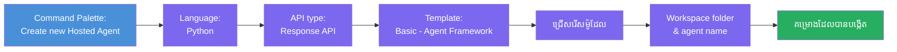
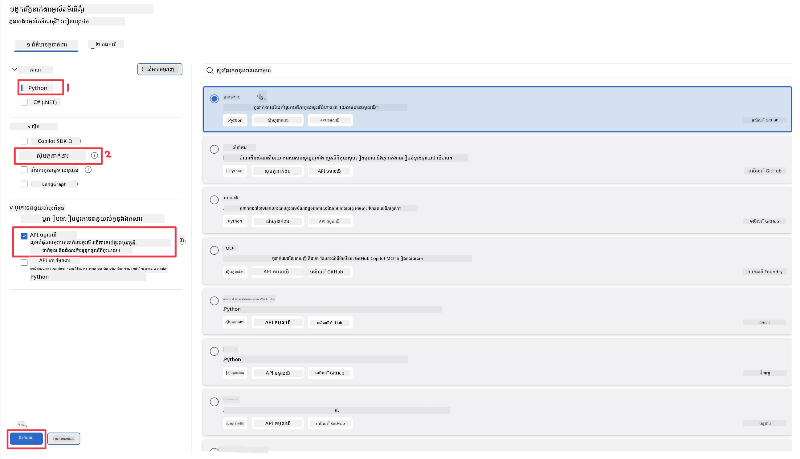
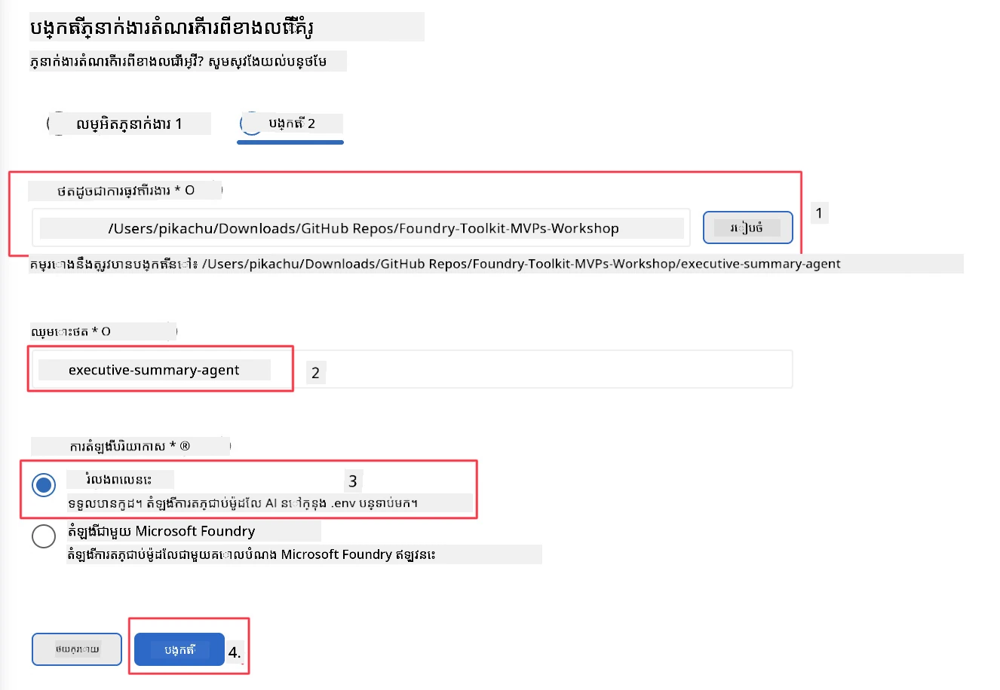

# ម៉ូឌុល ២ - បង្កើតតំណាងផ្តល់សេវាថ្មីមួយ

⏱️ ~៥ នាទី

នៅក្នុងម៉ូឌុលនេះ អ្នកប្រើប្រាស់ Foundry Toolkit ដើម្បី **បង្កើតគម្រោងតំណាងផ្តល់សេវា**។ ការបង្កើតនេះបង្កើតរចនាសម្ព័ន្ធគម្រោងពេញលេញ - `agent.yaml`, `main.py`, `Dockerfile`, `requirements.txt`, និងការកំណត់ VS Code សម្រាប់ការដំណើរការដើម្បីអ្នកអាចផ្តោតលើការប្ដូរប្រព្រឹត្តិការណ៍របស់តំណាង។

> **គំនិតសំខាន់៖** ប្រអប់ `agent/` នៅក្នុងលាបនេះគឺជាឧទាហរណ៍នៃអ្វីដែល Foundry Toolkit បង្កើត។ អ្នកមិនត្រូវសរសេរឯកសារទាំងនេះពីចន្លោះទទេឡើយ។

### ដំណើរការវីហ្សាំ scaffold



---

## ជំហាន ១៖ បើកវីហ្សាំ Create Hosted Agent

១. ចុច `Ctrl+Shift+P` ដើម្បីបើក **Command Palette**។
២. វាយ៖ **Foundry Toolkit: Create new Hosted Agent** ហើយជ្រើសវា។

> **ជម្រើសផ្សេងទៀត៖ បង្កើតតាមរយៈ Foundry Portal**
> ប្រសិនបើអ្នកចូលចិត្តប្រើកម្មវិធីរុករក អ្នកអាចបង្កើតគម្រោងនៅ [https://ai.azure.com](https://ai.azure.com)។ បន្ទាប់ពីគម្រោងត្រូវបានផ្តល់ មកវិញទៅ VS Code ហើយប្រើ sidebar របស់ **Foundry Toolkit** ដើម្បីភ្ជាប់ទៅវា។

> **ជម្រើសផ្សេងទៀត៖** ចុចរូបតំណាង **+** នៅជាប់ **Hosted Agents (Preview)** នៅក្នុង sidebar របស់ Foundry Toolkit។

## ជំហាន ២៖ ជ្រើសការកំណត់



១. នៅផ្នែកជម្រើស/ច្រកនៅខាងឆ្វេង ជ្រើសរើសដូចខាងក្រោម៖

| មឺនុយ | ជម្រើស | កំណត់ទុក |
|--------|-----------|-------|
| **ភាសា** | Python | ក៏គាំទ្រដល់ C# ផងដែរ |
| **សំណុំបែបបទ** | Agent Framework | ចំណុចចាប់ផ្តើមសាមញ្ញប្រើ Agent Framework SDK |
| **ប្រភេទ API** | Response API | `POST /responses` - ជាបទពិភាក្សា ដែលមានប្រវតិ្តគ្រប់គ្រងដោយវេទិកា |
| **បំលែង** | មូលដ្ឋាន | ចំណុចចាប់ផ្តើមសាមញ្ញប្រើ Agent Framework SDK |

២. បន្ទាប់ពីជ្រើសរើសរួច ចុច **Next**



៣. នៅវីនដូបន្ទាប់ ជ្រើសរើសដូចខាងក្រោម៖

| មឺនុយ | ជម្រើស | កំណត់ទុក |
|--------|-----------|-------|
| **ថតធ្វើការងារ** | ជ្រើសថតគោលដៅ | ឧ. `/workspace/Foundry_Toolkit_for_VSCode_Lab/` ឬថតរងក្នុង repo នេះ |
| **ឈ្មោះតំណាង** | បញ្ចូលឈ្មោះ | ឧ. `executive-summary-agent` |
| **ការដំឡើងបរិស្ថាន** | មិនត្រូវដំឡើងណាយសម្រាប់ពេលនេះ |  |

ចុច **create** ដើម្បីបង្កើតតំណាងរបស់យើង។ ថតថ្មីនឹងត្រូវបានបង្កើតជាមួយឈ្មោះតំណាងផ្តល់សេវា។

## ជំហាន ៣៖ ពិនិត្យគម្រោងដែលបានបង្កើត

បន្ទាប់ពីការបង្កើតបានបញ្ចប់ សូមផ្ទៀងផ្ទាត់ថាអ្នកឃើញឯកសារទាំងនេះនៅក្នុង Explorer (`Ctrl+Shift+E`)៖

```
📂 my-agent/
├── .env                ← Environment variables (placeholders)
├── .vscode/
│   ├── launch.json     ← Debug config (F5 → run + Agent Inspector)
│   └── tasks.json      ← VS Code task definitions
├── agent.yaml          ← Agent definition (kind: hosted)
├── Dockerfile          ← Container config for deployment
├── main.py             ← Agent entry point (your main code)
└── requirements.txt    ← Python dependencies
```

### ឯកសារសំខាន់ៗអោយពន្យល់

| ឯកសារ | គោលបំណង |
|------|---------|
| `agent.yaml` | ប្រកាសថាតំណាងគឺជា `kind: hosted` ផ្គូផ្គងអថេរស្ថានបរិយាកាស កំណត់ពិធី `/responses` |
| `main.py` | បង្កើត `FoundryChatClient` → ស្រូបវាទៅជា `Agent` ជាមួយការណែនាំ → បម្រើតាម `ResponsesHostServer` នៅច្រក ៨០៨៨ |
| `Dockerfile` | ប្រើ `python:3.12-slim`, ដំឡើងការពឹងផ្អែក, បើកច្រក ៨០៨៨, រត់ `main.py` |
| `requirements.txt` | `agent-framework-foundry`, `agent-framework-foundry-hosting`, `mcp`, `debugpy` |

> **សំខាន់៖** បើកថតតំណាងដែលបាន scaffold តាមដានដោយផ្ទាល់ក្នុង VS Code (ថត `agent/` នោះ) ដើម្បីឱ្យ `.vscode/launch.json` និង `tasks.json` បង្ហាញចុះត្រឹមត្រូវសម្រាប់ការត្រួតពិនិត្យ F5។

---

### ✅ ពិនិត្យចូរចេញ

- [ ] គម្រោងបាន scaffold បង្កើតជាមួយឯកសារដែលរំពឹងទុកទាំងអស់
- [ ] `agent.yaml` បង្ហាញ `kind: hosted` និង `protocol: responses`
- [ ] `main.py` នាំចូល `Agent`, `FoundryChatClient`, `ResponsesHostServer`
- [ ] ថតតំណាងត្រូវបានបើកក្នុង VS Code ជា origin workspace

---

**មុននេះ:** [០១ - ការតំឡើង](01-setup.md) · **បន្ទាប់:** [០៣ - កំណត់ & កូដ →](03-configure-and-code.md)

---

<!-- CO-OP TRANSLATOR DISCLAIMER START -->
**ការបដិសេធ**:
ឯកសារនេះត្រូវបានបម្លែងភាសា ដោយប្រើសេវាបម្លែងភាសា AI [Co-op Translator](https://github.com/Azure/co-op-translator)។ ទោះយើងខ្ញុំមានក្តីប្រាថ្នាឱ្យបានច្បាស់លាស់ តែសូមយល់ដឹងថាការបម្លែងដោយស្វ័យប្រវត្តិក៏អាចមានកំហុសឬភាពមិនត្រឹមត្រូវ។ ឯកសារដើមជាភាសាទីតាំងគួរត្រូវបានគេប្រើជាប្រភពច្បាស់លាស់។ សម្រាប់ព័ត៌មានសំខាន់ៗ សូមណែនាំឱ្យប្រើប្រាស់ការប្រែដោយមនុស្សជំនាញ។ យើងខ្ញុំមិនទទួលខុសត្រូវចំពោះការយល់ច្រឡំ ឬការបកស្រាយខុសបន្ទាប់ពីការប្រើប្រាស់ការបម្លែងនេះនោះទេ។
<!-- CO-OP TRANSLATOR DISCLAIMER END -->