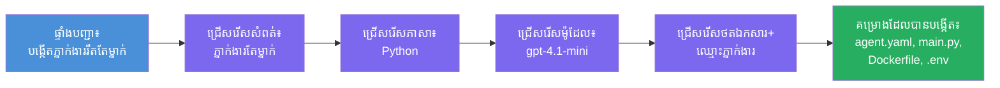

# ម៉ូឌុល ៣ - បង្កើតភ្នាក់ងារស្នាក់នៅថ្មី (ស្វ័យប្រវត្តិក្នុងការស្កេហ្វលីដដោយកម្មវិធីបន្ថែម Foundry)

នៅក្នុងម៉ូឌុលនេះ អ្នកប្រើកម្មវិធីបន្ថែម Microsoft Foundry ដើម្បី **ស្កេហ្វលីដគម្រោង [ភ្នាក់ងារស្នាក់នៅ](https://learn.microsoft.com/azure/foundry/agents/concepts/hosted-agents) ថ្មី**។ កម្មវិធីបន្ថែមនេះបង្កើតរចនាសម្ព័ន្ធគម្រោងទាំងមូលសម្រាប់អ្នក - រួមមាន `agent.yaml`, `main.py`, `Dockerfile`, `requirements.txt`, ឯកសារ `.env` និងការកំណត់កាកូដដាបជាស្រេចក្នុង VS Code។ បន្ទាប់ពីស្កេហ្វលីដ អ្នកប្ដូរតាមការណែនាំ ឧបករណ៍ និងកំណត់រចនាសម្ព័ន្ធរបស់ភ្នាក់ងាររបស់អ្នកក្នុងឯកសារទាំងនេះ។

> **មេរៀនសំខាន់៖** ការរក្សាទុកថត `agent/` ក្នុងមន្ទីរពិសោធនេះគឺជាឧទាហរណ៍នៃអ្វីដែលកម្មវិធីបន្ថែម Foundry បង្កើតឡើងពេលអ្នកដំណើរការបញ្ជា​ស្កេហ្វលីដនេះ។ អ្នកមិនបានសរសេរ​ឯកសារទាំងនេះពីសូន្យទេ - កម្មវិធីបន្ថែមបង្កើតវា ហើយបន្ទាប់មកអ្នកកែប្រែវា។

### ដំណើរការវីស្សាទួលស្កេហ្វលីដ


---

## ជំហាន់ ១៖ បើកវីស្សាទួល Create Hosted Agent

១. ចុច `Ctrl+Shift+P` ដើម្បីបើក **Command Palette**។
២. វាយបញ្ចូល៖ **Microsoft Foundry: Create a New Hosted Agent** ហើយជ្រើសរើសវា។
៣. វីស្សាទួលបង្កើតភ្នាក់ងារស្នាក់នៅបើកឡើង។

> **មុខងារជំនួស៖** អ្នកអាចឆ្លងកាត់វីស្សាទួលនេះពីផ្នែក Microsoft Foundry sidebar → ចុចរូបតូច signo **+** នៅក្បែរ **Agents** ឬចុចស្ដាំ និងជ្រើសរើស **Create New Hosted Agent**។

---

## ជំហាន់ ២៖ ជ្រើសរើសសំណុំបែបបទ

វិស្សាទួលស្នើឲ្យអ្នកជ្រើសសំណុំបែបបទ។ អ្នកនឹងឃើញជម្រើសដូចជា៖

| សំណុំបែបបទ | សេចក្ដីពិពណ៌នា | ពេលដែលត្រូវប្រើ |
|--------------|------------------|-------------------|
| **ភ្នាក់ងារតែមួយ** | ភ្នាក់ងារតែមួយមានម៉ូដែល ខ្ញាំណា និងឧបករណ៍ជាជម្រើសផ្ទាល់ខ្លួន | មន្ទីរពិសោធនេះ (Lab 01) |
| **លំហូរការងារជាភ្នាក់ងារច្រើន** | ភ្នាក់ងារច្រើនដែលសហការគ្នាលំដាប់លំដោយ | Lab 02 |

១. ជ្រើសរើស **ភ្នាក់ងារតែមួយ**។
២. ចុច **Next** (ឬជ្រើសរើសដំណើរការជាស្វ័យប្រវត្តិ)។

---

## ជំហាន់ ៣៖ ជ្រើសរើសភាសាកូដកម្ម

១. ជ្រើសរើស **Python** (ផ្តល់អនុសាសន៍សម្រាប់មន្ទីរពិសោធនេះ)។
២. ចុច **Next**។

> **C# ក៏គាំទ្រផងដែរ** ប្រសិនបើអ្នកចូលចិត្ត .NET។ រចនាសម្ព័ន្ធស្គេហ្វលីដស្ទាងស្រដៀងគ្នា (ប្រើ `Program.cs` ជំនួស `main.py`)។

---

## ជំហាន់ ៤៖ ជ្រើសរើសម៉ូដែលរបស់អ្នក

១. វីស្សាទួលបង្ហាញម៉ូដែលដែលបានដាក់ក្នុងគម្រោង Foundry របស់អ្នក (ពី ម៉ូឌុល ២)។
២. ជ្រើសរើសម៉ូដែលដែលអ្នកបានដាក់ - ឧទាហរណ៍ **gpt-4.1-mini**។
៣. ចុច **Next**។

> ប្រសិនបើអ្នកមិនឃើញម៉ូដែលណាមួយ សូមត្រឡប់ទៅ [ម៉ូឌុល ២](02-create-foundry-project.md) ហើយដាក់ម៉ូដែលមួយជាមុន។

---

## ជំហាន់ ៥៖ ជ្រើសទីតាំងថតទៅ និងឈ្មោះភ្នាក់ងារ

១. កម្មវិធីបង្ហាញប្រអប់ជ្រើសឯកសារ - ជ្រើស **ថតគោលដៅ** ដែលគម្រោងនឹងត្រូវបង្កើត។ សម្រាប់មន្ទីរពិសោធនេះ៖
   - ប្រសិនបើចាប់ផ្តើមមួយទំនេរ៖ ជ្រើសថតណាមួយ (ដូចជា `C:\Projects\my-agent`)
   - ប្រសិនបើធ្វើការក្នុង repo មន្ទីរពិសោធ៖ បង្កើតថតរងថ្មីនៅក្រោម `workshop/lab01-single-agent/agent/`
២. វាយឈ្មោះ **ភ្នាក់ងារ** សម្រាប់ភ្នាក់ងារស្នាក់នៅ (ឧទាហរណ៍ `executive-summary-agent` ឬ `my-first-agent`)។
៣. ចុច **Create** (ឬចុច Enter)។

---

## ជំហាន់ ៦៖ រង់ចាំការស្កេហ្វលីដបញ្ចប់

១. VS Code បើក **បង្អួចថ្មី** ជាមួយគម្រោងដែលបានស្កេហ្វលីដ។
២. រង់ចាំប៉ុន្មានវិនាទីដើម្បីឲ្យគម្រោងបំពេញโหลด។
៣. អ្នកគួរតែឃើញឯកសារខាងក្រោមនៅក្នុងបន្ទះ Explorer (`Ctrl+Shift+E`)៖

```
📂 my-first-agent/
├── .env                ← Environment variables (auto-generated with placeholders)
├── .vscode/
│   └── launch.json     ← Debug configuration (F5 to run + Agent Inspector)
├── agent.yaml          ← Agent definition (kind: hosted)
├── Dockerfile          ← Container configuration for deployment
├── main.py             ← Agent entry point (your main code file)
└── requirements.txt    ← Python dependencies
```

> **នេះគឺមានរចនាសម្ព័ន្ធដូច `agent/` ក្នុងមន្ទីរពិសោធនេះ**។ កម្មវិធីបន្ថែម Foundry បង្កើតឯកសារទាំងនេះដោយស្វ័យប្រវត្តិ - អ្នកមិនចាំបាច់បង្កើតវាដោយដៃទេ។

> **កំណត់សំគាល់មន្ទីរពិសោធ:** នៅក្នុង repo មន្ទីរពិសោធនេះ ថត `.vscode/` ស្ថិតនៅ **ឫសដំណើរការ** (មិនស្ថិតក្នុងគម្រោងនីមួយៗទេ)។ វាមានឯកសារ `launch.json` និង `tasks.json` ចែករំលែកដែលមានការកំណត់កំណត់ដាបក្នុង VS Code ចំនួនពីរ - **"Lab01 - Single Agent"** និង **"Lab02 - Multi-Agent"** - ដែលនាំឲ្យទិសដៅទៅកាន់ cwd របស់មន្ទីរពិសោធដែលត្រូវការ។ នៅពេលអ្នកចុច F5 សូមជ្រើសរើសការកំណត់ដាបតាមម៉ូឌុលដែលអ្នកកំពុងធ្វើការពីបញ្ជីជ្រុល។

---

## ជំហាន់ ៧៖ យល់ដឹងពីឯកសារដែលបានបង្កើតមួយៗ

ចំណាយពេលពិនិត្យមើលឯកសារចំណាត់ថ្នាក់មួយៗដែលវិស្សាទួលបានបង្កើតឡើង។ ការយល់ដឹងពីវាគឺសំខាន់សម្រាប់ម៉ូឌុល ៤ (កំណត់ផ្ទាល់ខ្លួន)។

### ៧.១ `agent.yaml` - ការបញ្ជាក់ភ្នាក់ងារ

បើក `agent.yaml`។ វាហាក់ដូចជា៖

```yaml
# yaml-language-server: $schema=https://raw.githubusercontent.com/microsoft/AgentSchema/refs/heads/main/schemas/v1.0/ContainerAgent.yaml

kind: hosted
name: my-first-agent
description: >
  A hosted agent deployed to Microsoft Foundry Agent Service.
metadata:
  authors:
    - Microsoft
  tags:
    - Azure AI AgentServer
    - Microsoft Agent Framework
    - Hosted Agent
protocols:
  - protocol: responses
    version: v1
environment_variables:
  - name: AZURE_AI_PROJECT_ENDPOINT
    value: ${PROJECT_ENDPOINT}
  - name: AZURE_AI_MODEL_DEPLOYMENT_NAME
    value: ${MODEL_DEPLOYMENT_NAME}
dockerfile_path: Dockerfile
resources:
  cpu: '0.25'
  memory: 0.5Gi
```

**ដែនដែលសំខាន់៖**

| ដែន | គោលបំណង |
|-------|---------|
| `kind: hosted` | បញ្ជាក់ថានេះគឺជាភ្នាក់ងារស្នាក់នៅ (ផ្អែកលើកន្ទោង រត់ក្នុង [Foundry Agent Service](https://learn.microsoft.com/azure/foundry/agents/overview)) |
| `protocols: responses v1` | ភ្នាក់ងារបង្ហាញច្រក `/responses` ដែលតម្រូវស្របទៅនឹង OpenAI HTTP |
| `environment_variables` | ផ្គូផ្គងតម្លៃ `.env` ទៅអថេរបរិស្ថានក្នុងកន្ទោងនៅពេលដំណើរការ |
| `dockerfile_path` | កំណត់ទីតាំងរបស់ Dockerfile ដែលប្រើសម្រាប់បង្កើតរូបភាពកន្ទោង |
| `resources` | កំណត់ការចែកចាយ CPU និងម៉េម៉ូរីសម្រាប់កន្ទោង (0.25 CPU, 0.5Gi ម៉េម៉ូរី) |

### ៧.២ `main.py` - ច្រកចូលភ្នាក់ងារ

បើក `main.py`។ នេះជាឯកសារ Python សំខាន់ដែលផ្ទុកត.logic ភ្នាក់ងាររបស់អ្នក។ ស្កេហ្វលីដរួមមាន៖

```python
from agent_framework.azure import AzureAIAgentClient
from azure.ai.agentserver.agentframework import from_agent_framework
from azure.identity.aio import DefaultAzureCredential
```

**ការនាំចូលសំខាន់៖**

| នាំចូល | គោលបំណង |
|--------|--------|
| `AzureAIAgentClient` | ការតភ្ជាប់ទៅគម្រោង Foundry របស់អ្នក និងបង្កើតភ្នាក់ងារតាមរយៈ `.as_agent()` |
| [`DefaultAzureCredential`](https://learn.microsoft.com/azure/developer/python/sdk/authentication/credential-chains#defaultazurecredential-overview) | គ្រប់គ្រងការផ្ទៀងផ្ទាត់ (Azure CLI, ចុះឈ្មោះ VS Code, managed identity ឬ service principal) |
| `from_agent_framework` | បង្ហាញភ្នាក់ងារជា HTTP server ដែលផ្ដល់ច្រក `/responses` |

លំនាំដើមគឺ៖
១. បង្កើត credential → បង្កើត client → ហៅ `.as_agent()` ដើម្បីបង្កើតភ្នាក់ងារ (async context manager) → រុំជាសេវាសម្រាប់ server → រត់

### ៧.៣ `Dockerfile` - រូបភាពកន្ទោង

```dockerfile
FROM python:3.14-slim

WORKDIR /app

COPY ./ .

RUN pip install --upgrade pip && \
    if [ -f requirements.txt ]; then \
        pip install -r requirements.txt; \
    else \
        echo "No requirements.txt found" >&2; exit 1; \
    fi

EXPOSE 8088

CMD ["python", "main.py"]
```

**ព័ត៌មានសំខាន់៖**
- ប្រើ `python:3.14-slim` ជារូបភាពមូលដ្ឋាន។
- ចម្លងឯកសារគម្រោងទាំងអស់ទៅ `/app`។
- ធ្វើបំពង `pip` និងដំឡើងអាស្រ័យភាពពី `requirements.txt` ហើយបរាជ័យភ្លាមៗ ប្រសិនបើឯកសារនោះបាត់។
- **បង្ហាញច្រក ៨០៨៨** - នេះជាច្រកតម្រូវសម្រាប់ភ្នាក់ងារស្នាក់នៅ។ កុំប្តូរវា។
- ចាប់ផ្តើមភ្នាក់ងារជាមួយ `python main.py`។

### ៧.៤ `requirements.txt` - អាស្រ័យភាព

```
agent-framework-azure-ai==1.0.0rc3
agent-framework-core==1.0.0rc3
azure-ai-agentserver-agentframework==1.0.0b16
azure-ai-agentserver-core==1.0.0b16
debugpy
agent-dev-cli
```

| កញ្ចប់ | គោលបំណង |
|---------|---------|
| `agent-framework-azure-ai` | ការតភ្ជាប់ Azure AI សម្រាប់ Microsoft Agent Framework |
| `agent-framework-core` | ការរត់ដំណើរការមូលដ្ឋានសម្រាប់សង់ភ្នាក់ងារ (រួមបញ្ចូល `python-dotenv`) |
| `azure-ai-agentserver-agentframework` | រត់ម៉ាស៊ីនភ្នាក់ងារស្នាក់នៅសម្រាប់ Foundry Agent Service |
| `azure-ai-agentserver-core` | ការប្រាប់ដើមដៃរបស់ម៉ាស៊ីនភ្នាក់ងារស្នាក់នៅ |
| `debugpy` | គាំទ្រការដាប់ប៊ក Python (អនុញ្ញាត F5 ដាប់ប៊ុកក្នុង VS Code) |
| `agent-dev-cli` | CLI សម្រាប់អភិវឌ្ឍន៍ក្នុងផ្ទះសម្រាប់សាកល្បងភ្នាក់ងារ (ប្រើដោយកំណត់ដាប/រត់) |

---

## យល់ដឹងអំពីប្រព័ន្ធផ្សព្វផ្សាយភ្នាក់ងារ

ភ្នាក់ងារស្នាក់នៅទំនាក់ទំនងតាម **ពាណិជ្ជកម្មOpenAI Responses API**។ នៅពេលដំណើរការ (ក្នុងស្រុក ឬទីផ្សារ), ភ្នាក់ងារបង្ហាញច្រក HTTP តែមួយ៖

```
POST http://localhost:8088/responses
Content-Type: application/json

{
  "input": "Your prompt here",
  "stream": false
}
```

Foundry Agent Service ហៅច្រកនេះដើម្បីផ្ញើសំណើរមនុស្សប្រើនិងទទួលការឆ្លើយតបរបស់ភ្នាក់ងារ។ នេះជាប្រព័ន្ធផ្សព្វផ្សាយដូចគ្នាទៅនឹង API OpenAI ដូច្នេះភ្នាក់ងាររបស់អ្នកអាចប្រើរួមគ្នាជាមួយគ្រប់មុខងារដែលនិយាយទ្រនិច OpenAI Responses។

---

### ចំណុចពិនិត្យ

- [ ] វីស្សាទួលស្កេហ្វលីដបានបញ្ចប់ដោយជោគជ័យ ហើយបង្អួច **VS Code ថ្មី** មួយបានបើក។
- [ ] អ្នកអាចឃើញឯកសារទាំង ៥៖ `agent.yaml`, `main.py`, `Dockerfile`, `requirements.txt`, `.env`
- [ ] ឯកសារ `.vscode/launch.json` មាន (គាំទ្រការដាប់ប៊ក F5 - នៅក្នុងមន្ទីរពិសោធនេះវាស្ថិតនៅឫស workspace ជាមួយការកំណត់ដាបគ្រប់គ្រាន់នៅលើម៉ូឌុល)
- [ ] អ្នកបានអានឯកសារ មួយៗ ហើយយល់ពីគោលបំណងរបស់វា
- [ ] អ្នកយល់ថា ច្រក `8088` ត្រូវបានទាមទារនិងច្រក `/responses` គឺជាពាណិជ្ជកម្ម។

---

**មុននេះ៖** [02 - បង្កើតគម្រោង Foundry](02-create-foundry-project.md) · **បន្ទាប់៖** [04 - កំណត់ និង កូដ →](04-configure-and-code.md)

---

<!-- CO-OP TRANSLATOR DISCLAIMER START -->
**ការបដិសេធ**៖  
ឯកសារនេះត្រូវបានបកប្រែដោយប្រើសេវាកម្មបកប្រែ AI [Co-op Translator](https://github.com/Azure/co-op-translator)។ បើទោះបីជាយើងខិតខំសំដែងភាពត្រឹមត្រូវក៏ដោយ សូមជ្រាបថាការបកប្រែដោយស្វ័យប្រវត្តិអាចមានកំហុស ឬភាពមិនត្រឹមត្រូវ។ ឯកសារដើមដែលមានភាសាដើមគួរត្រូវបានទទួលស្គាល់ថាជាផ្នែកដែនកំណត់ចម្បង។ សម្រាប់ព័ត៌មានសំខាន់ សូមណែនាំឲ្យមានការបកប្រែដោយមនុស្សជំនាញវិជ្ជាជីវៈ។ យើងមិនទទួលខុសត្រូវចំពោះការយល់ច្រឡំ ឬការបកស្រាយខុសណាមួយដែលកើតឡើងពីការប្រើប្រាស់ការបកប្រែនេះឡើយ។
<!-- CO-OP TRANSLATOR DISCLAIMER END -->