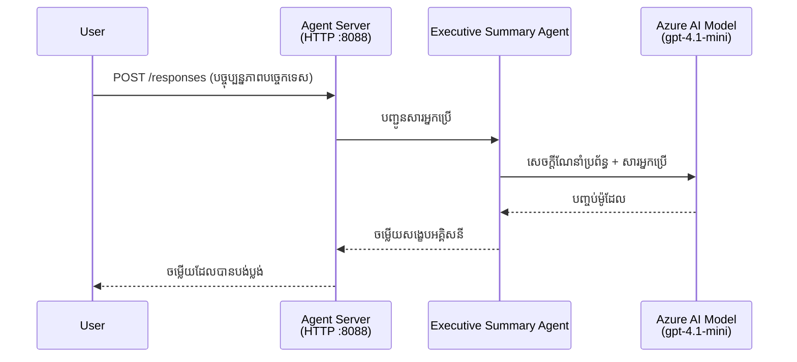
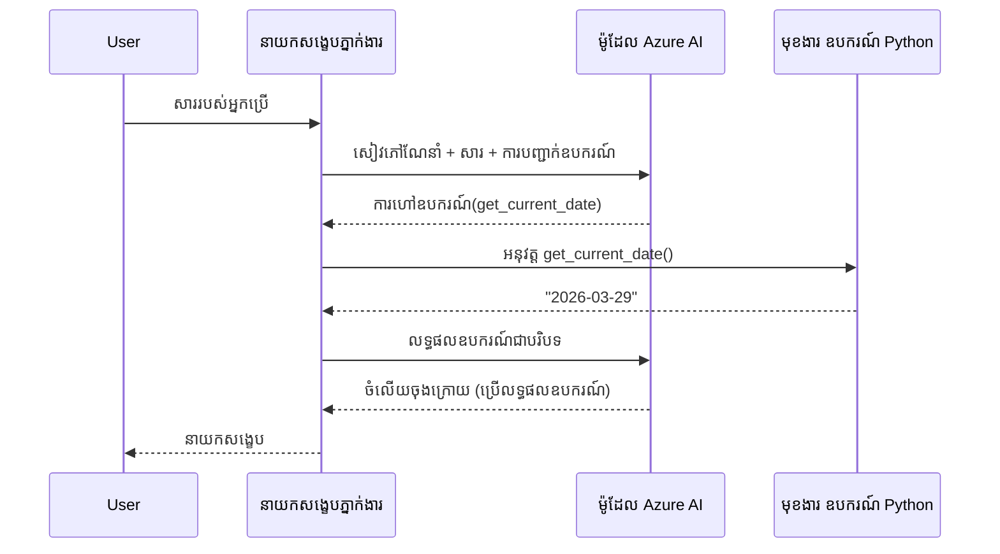

# Module 4 - កំណត់ការណ៍សូមណែនាំ មជ្ឈដ្ឋាន និងដំឡើងការពឹងផ្អែក

នៅក្នុងម៉ូឌុលនេះ អ្នកធ្វើប្ដូរឯកសារយ៉ាងស្វ័យប្រវត្តិដែលបានបង្កើតដោយម៉ូឌុល 3។ នេះជាកន្លែងដែលអ្នកបម្លែងឯកសារសរសេរទូទៅទៅជានិច្ចបច្ចេកទេស **របស់អ្នក** - ដោយសរសេរការណែនាំ កំណត់អថេរបរិស្ថាន បន្ថែមឧបករណ៍ជាជម្រើស និងដំឡើងការពឹងផ្អែក។

> **រំលឹក៖** បន្ទាត់បន្ថែម Foundry បានបង្កើតឯកសារគម្រោងរបស់អ្នកដោយស្វ័យប្រវត្ត។ ឥឡូវនេះអ្នកកែប្រែវា។ មើលថត [`agent/`](../../../../../workshop/lab01-single-agent/agent) សម្រាប់ឧទាហរណ៍កំណត់រចនាអ្នកប្រើពេញលេញមួយ។

---

## របៀបដែលគ្រឿងផ្សំនៅសហការជាមួយគ្នា

### ជីវិតបម្រែបម្រួលសំណើ (ភ្នាក់ងារតែ១)


> **ជាមួយឧបករណ៍៖** ប្រសិនបើភ្នាក់ងារមានឧបករណ៍ដែលបានចុះបញ្ជី ទ្រឹស្តីអាចបង្វែរទៅហៅឧបករណ៍ជំនួសការបញ្ចប់ផ្ទាល់។ ស៊្រ្តុកទម្រាំ នេះអនុវត្តឧបករណ៍ក្នុងតំបន់ក្នុង សម្លឹងលទ្ធផលត្រឡប់ទៅទៅម៉ូឌែល ហើយម៉ូឌែលបង្កើតចម្លើយចុងក្រោយ។


---

## ជំហានទី 1: កំណត់អថេរបរិស្ថាន

សារាលីបានបង្កើតឯកសារ `.env` ដែលមានតម្លៃជំនួស។ អ្នកត្រូវបញ្ចូលតម្លៃពិតពីម៉ូឌុល 2។

1. នៅក្នុងគម្រោងដែលបានសារាលីរបស់អ្នក បើកឯកសារ **`.env`** (វានៅផ្ទាល់ដើមគម្រោង)។
2. ជំនួសតម្លៃជំនួសជាមួយព័ត៌មានលម្អិតគម្រោង Foundry របស់អ្នក៖

   ```env
   PROJECT_ENDPOINT=https://<your-account>.services.ai.azure.com/api/projects/<your-project>
   MODEL_DEPLOYMENT_NAME=gpt-4.1-mini
   ```

3. រក្សាទុកឯកសារ។

### របៀបរកតម្លៃទាំងនេះ

| តម្លៃ | របៀបរកវា |
|-------|-------------|
| **ចំណុចបញ្ចប់គម្រោង** | បើកផ្ទាំង Microsoft Foundry នៅ VS Code → ចុចលើគម្រោងរបស់អ្នក → URL ចំណុចបញ្ចប់បង្ហាញនៅក្នុងវិចិត្រសារ។ វាហាក់ដូចជា `https://<account-name>.services.ai.azure.com/api/projects/<project-name>` |
| **ឈ្មោះការបង្ហោះម៉ូឌែល** | នៅផ្ទាំង Foundry ពង្រីកគម្រោងរបស់អ្នក → មើលក្រោម **Models + endpoints** → ឈ្មោះបង្ហាញជាមួយម៉ូឌែលដែលបានបង្ហោះ (ឧ. `gpt-4.1-mini`) |

> **សុវត្ថិភាព៖** កុំបញ្ចូលឯកសារ `.env` ទៅក្នុង version control។ វាបានបញ្ចូលរួចក្នុង `.gitignore` ដោយលំនាំដើម។ ប្រសិនបើមិនមាន សូមបន្ថែមវា៖
> ```
> .env
> ```

### របៀបចរចា្លក្នុងអថេរបរិស្ថាន

ខ្សែភាពយន្ត mapping គឺ: `.env` → `main.py` (អានតាម `os.getenv`) → `agent.yaml` (ផ្គូរផ្គងទៅអថេរផ្ទុកក្នុង container ពេលបង្ហោះ)។

នៅក្នុង `main.py` សារាលីអានតម្លៃទាំងនេះដូចទៅ៖

```python
PROJECT_ENDPOINT = os.getenv("AZURE_AI_PROJECT_ENDPOINT") or os.getenv("PROJECT_ENDPOINT")
MODEL_DEPLOYMENT_NAME = os.getenv("AZURE_AI_MODEL_DEPLOYMENT_NAME", os.getenv("MODEL_DEPLOYMENT_NAME", "gpt-4.1-mini"))
```

ទាំង `AZURE_AI_PROJECT_ENDPOINT` និង `PROJECT_ENDPOINT` ទទួលបាន (ឯកសារ `agent.yaml` ប្រើ prefix `AZURE_AI_*`)។

---

## ជំហានទី 2: សរសេរការណែនាំភ្នាក់ងារ

នេះជាជំហានកំណត់រចនាដ៏សំខាន់បំផុត។ ការណែនាំកំណត់បុគ្គលិកលក្ខណៈ សកម្មភាព រចនាសម្ព័ន្ធលទ្ធផល និងលក្ខខណ្ឌសុវត្ថិភាពរបស់ភ្នាក់ងារ។

1. បើក `main.py` នៅក្នុងគម្រោងរបស់អ្នក។
2. រកខ្សែអត្ថបទការណែនាំ (សារាលីមានការណែនាំដើម/ទូទៅ)។
3. ជំនួសវាជាមួយការណែនាំលម្អិតមានរចនាសម្ព័ន្ធ។

### អ្វីដែលការណែនាំល្អមាន

| គ្រឿង | គោលបំណង | ឧទាហរណ៍ |
|---------|------------|------------|
| **តួនាទី** | ភ្នាក់ងារមានតួនាទី និងអ្វីដែលវាព្យាយាមធ្វើ | "អ្នកជាភ្នាក់ងារសង្ខេបសេចក្ដី" |
| **អ្នកទទួល** | នរណាដែលអាចទទួលបានចម្លើយ | "មេដឹកនាំជាន់ខ្ពស់ដែលមិនមានភាគីបច្ចេកទេស" |
| **ការបញ្ជាក់ពីវារ៉ាជាមួយបាន** | ប្រភេទសំណួរដែលវាអាចដំណើរការ | "របាយការណ៍ហេតុការណ៍បច្ចេកទេស, បច្ចេកវិទ្យាបច្ចុប្បន្ន" |
| **រចនាសម្ព័ន្ធលទ្ធផល** | រចនាសម្ព័ន្ធច្បាស់ទាក់ទងនៃការឆ្លើយតប | "Executive Summary: - ធ្វើយ៉ាងដូចម្តេច: ... - ផលប៉ះពាល់អាជីវកម្ម: ... - ជំហានបន្ទាប់: ..." |
| **ច្បាប់** | លក្ខខណ្ឌ និងលក្ខខណ្ឌដែលមិនអនុញ្ញាត | "កុំបន្ថែមព័ត៌មានដែលលើសពីបានផ្តល់លើកលែងត្រូវបានសុំ" |
| **សុវត្ថិភាព** | ការពារ ការប្រើប្រាស់ខុស និងការស្រមៃឥតមូលដ្ឋាន | "ប្រសិនបើព័ត៌មានមិនច្បាស់ សូមស្នើសុំការបកស្រាយ" |
| **ឧទាហរណ៍** | គូការបញ្ចូល/ចេញ ដើម្បីដឹកនាំសកម្មភាព | រួមបញ្ចូលឧទាហរណ៍ ២-៣ ជាមួយការបញ្ចូលខុសគ្នា |

### ឧទាហរណ៍៖ ការណែនាំភ្នាក់ងារសង្ខេបសេចក្ដី

នេះជាការណែនាំដែលប្រើនៅក្នុងសិក្ខាសាលានៃ [`agent/main.py`](../../../../../workshop/lab01-single-agent/agent/main.py)៖

```python
AGENT_INSTRUCTIONS = """You are an "Explain Like I'm an Executive" agent.

Purpose:
Your job is to translate complex technical or operational information into
clear, concise, and outcome-focused summaries that can be easily understood
by non-technical executives.

Audience:
Senior leaders with limited technical background who care about impact,
risk, and what happens next.

What you must do:
- Rephrase the input so it is understandable to a non-technical audience
- Prioritize clarity, brevity, and outcomes over technical accuracy
- Remove technical jargon, logs, metrics, stack traces, and deep root-cause details
- Translate technical causes into simple cause-and-effect statements
- Explicitly call out business impact
- Always include a clear next step or action
- Maintain a neutral, factual, and calm executive tone
- Do NOT add new facts or speculate beyond the input

Standard Output Structure (always use this wording):

Executive Summary:
- What happened: <plain-language description>
- Business impact: <clear, non-technical impact>
- Next step: <clear action or mitigation>

Rules:
- Keep responses under 100 words
- Do NOT add facts beyond the input
- If input is unclear, ask for clarification
"""
```

4. ជំនួសខ្សែអត្ថបទការណែនាំក្នុង `main.py` ជាមួយការណែនាំផ្ទាល់ខ្លួន។
5. រក្សាទុកឯកសារ។

---

## ជំហានទី 3: (ជាជម្រើស) បន្ថែមឧបករណ៍ផ្ទាល់ខ្លួន

ភ្នាក់ងារនៅលើម៉ាស៊ីនផ្ដល់សេវា អាចអនុវត្ត **មុខងារផៃថុនក្នុងតំបន់** ជាឧបករណ៍។ នេះជាលក្ខណៈពិសេសសំខាន់នៃភ្នាក់ងារ Hosted ដែលមានកូដ ប្រកលឡើងលើភ្នាក់ងារដែលមានតែការណែនាំតែប៉ុណ្ណោះ - ភ្នាក់ងាររបស់អ្នកអាចរត់តុល្យភាពក្នុងម៉ាស៊ីនម៉ាស៊ីនផ្ដល់សេវាបាន។

### 3.1 កំណត់មុខងារ​ឧបករណ៍

បន្ថែមមុខងារឧបករណ៍ទៅ `main.py`៖

```python
from agent_framework import tool

@tool
def get_current_date() -> str:
    """Returns the current date in YYYY-MM-DD format."""
    from datetime import date
    return str(date.today())
```

`@tool` ជាស្លាកដែលបម្លែងមុខងារផៃថុនទូទៅទៅជាឧបករណ៍ភ្នាក់ងារ។ ខ្សែអត្ថបទពិពណ៌នាក្លាយជាសេចក្ដីពិពណ៌នាឧបករណ៍ដែលម៉ូឌែលឃើញ។

### 3.2 ចុះបញ្ជីឧបករណ៍ជាមួយភ្នាក់ងារ

ពេលបង្កើតភ្នាក់ងារតាមរយៈ context manager `.as_agent()` ផ្តល់ឧបករណ៍ជាប៉ារ៉ាម៉ែត្រ `tools`៖

```python
async with AzureAIAgentClient(
    project_endpoint=PROJECT_ENDPOINT,
    model_deployment_name=MODEL_DEPLOYMENT_NAME,
    credential=credential,
).as_agent(
    name="my-agent",
    instructions=AGENT_INSTRUCTIONS,
    tools=[get_current_date],
) as agent:
    server = from_agent_framework(agent)
    await server.run_async()
```

### 3.3 របៀបហៅឧបករណ៍ដំណើរការ

1. អ្នកប្រើផ្ញើសំណួរ។
2. ម៉ូឌែលសម្រេចចិត្តថាតើត្រូវការឧបករណ៍ទេ (ដោយផ្អែកលើសំណួរ ការណែនាំ និងការពិពណ៌នាឧបករណ៍)។
3. ប្រសិនបើត្រូវ កម្មវិធីស៊្រ្តកហៅមុខងារផៃថុនរបស់អ្នកក្នុងតំបន់ (នៅក្នុង container)។
4. តម្លៃត្រឡប់របស់ឧបករណ៍ត្រូវផ្ញើត្រឡប់ទៅម៉ូឌែលជាផ្នែកនៃ context។
5. ម៉ូឌែលបង្កើតចម្លើយចុងក្រោយ។

> **ឧបករណ៍អនុវត្តនៅ Server-Side** - វាដំណើរការនៅក្នុង container របស់អ្នក មិនមែននៅក្នុងកម្មវិធីរុករករបស់អ្នកប្រើ ឬម៉ូឌែលទេ។ នេះមានន័យថាអ្នកអាចចូលប្រើទិន្នន័យធនាគារ API ប្រព័ន្ធឯកសារ ឬបណ្ណាល័យ Python មួយណាក៏បាន។

---

## ជំហានទី 4: បង្កើត និងដំណើរការបរិស្ថានវីរុចវ៉ាល់

មុនដំឡើងការពឹងផ្អែក សូមបង្កើតបរិស្ថាន Python សង្កត់មួយ។

### 4.1 បង្កើតបរិស្ថានវីរុចវ៉ាល់

បើកទំព័របញ្ជារនៅ VS Code (`` Ctrl+` ``) ហើយដំណើរការ៖

```powershell
python -m venv .venv
```

នេះបង្កើតថត `.venv` នៅក្នុងថតគម្រោងរបស់អ្នក។

### 4.2 ដំណើរការបរិស្ថានវីរុចវ៉ាល់

**PowerShell (Windows):**

```powershell
.\.venv\Scripts\Activate.ps1
```

**Command Prompt (Windows):**

```cmd
.venv\Scripts\activate.bat
```

**macOS/Linux (Bash):**

```bash
source .venv/bin/activate
```

អ្នកគួរតែឃើញ `(.venv)` បង្ហាញនៅចុងចាប់ផ្តើមពាក្យបញ្ជារបស់អ្នក។ នេះបង្ហាញថាបរិស្ថានវីរុចវ៉ាល់ដំណើរការមានសុពលភាព។

### 4.3 ដំឡើងការពឹងផ្អែក

ជាមួយបរិស្ថានវីរុចវ៉ាល់ដំណើរការ ដំឡើងកញ្ចប់ដែលទាមទារ៖

```powershell
pip install -r requirements.txt
```

ការដំឡើងរួមមាន៖

| កញ្ចប់ | គោលបំណង |
|---------|------------|
| `agent-framework-azure-ai==1.0.0rc3` | រួមបញ្ចូល Azure AI សម្រាប់ [Microsoft Agent Framework](https://learn.microsoft.com/agent-framework/overview/) |
| `agent-framework-core==1.0.0rc3` | របបយន្តសំខាន់សម្រាប់ការបង្កើតភ្នាក់ងារ (រួមបញ្ចូល `python-dotenv`) |
| `azure-ai-agentserver-agentframework==1.0.0b16` | របបម៉ាស៊ីនភ្នាក់ងារផ្ទុកសម្រាប់ [Foundry Agent Service](https://learn.microsoft.com/azure/foundry/agents/overview) |
| `azure-ai-agentserver-core==1.0.0b16` | អវកាសរចនាសម្ព័ន្ធម៉ាស៊ីនភ្នាក់ងារ |
| `debugpy` | វិភាគកូដ Python (អាចដំណើរការការវិភាគកូដ ដោយចុច F5 នៅ VS Code) |
| `agent-dev-cli` | CLI សម្រាប់អភិវឌ្ឍន៍ក្នុងតំបន់សម្រាប់សាកល្បងភ្នាក់ងារ |

### 4.4 ផ្ទៀងផ្ទាត់ការដំឡើង

```powershell
pip list | Select-String "agent-framework|agentserver"
```

លទ្ធផលដែលរំពឹង៖
```
agent-framework-azure-ai   1.0.0rc3
agent-framework-core       1.0.0rc3
azure-ai-agentserver-agentframework 1.0.0b16
azure-ai-agentserver-core  1.0.0b16
```

---

## ជំហានទី 5: ផ្ទៀងផ្ទាត់ការផ្ទៀងផ្ទាត់មុន

ភ្នាក់ងារប្រើ [`DefaultAzureCredential`](https://learn.microsoft.com/azure/developer/python/sdk/authentication/credential-chains#defaultazurecredential-overview) ដែលព្យាយាមវិធីសាស្រ្តផ្ទៀងផ្ទាត់ជាច្រើនតាមលំដាប់នេះ៖

1. **អថេរបរិស្ថាន** - `AZURE_CLIENT_ID`, `AZURE_TENANT_ID`, `AZURE_CLIENT_SECRET` (service principal)
2. **Azure CLI** - រក្សាឯកសារ `az login` របស់អ្នក
3. **VS Code** - ប្រើគណនីដែលអ្នកបានចូលសូមក្នុង VS Code
4. **Managed Identity** - ប្រើពេលរត់នៅ Azure (ពេលបង្ហោះ)

### 5.1 ផ្ទៀងផ្ទាត់សម្រាប់ការអភិវឌ្ឍក្នុងតំបន់

យ៉ាងហោចណាស់មួយវិធីនេះគួរតែដំណើរការ៖

**ជម្រើស A: Azure CLI (ផ្តល់អនុសាសន៍)**

```powershell
az account show --query "{name:name, id:id}" --output table
```

រំពឹង​​៖ បង្ហាញឈ្មោះការជាវ និង ID។

**ជម្រើស B: ចុះឈ្មោះលើ VS Code**

1. មើលនៅខាងក្រោមឆ្វេងនៃ VS Code សម្រាប់រូបតំណាង **Accounts**។
2. ប្រសិនបើឃើញឈ្មោះគណនីរបស់អ្នក នេះមានន័យថាអ្នកបានផ្ទៀងផ្ទាត់។
3. ប្រសិនបើមិនមាន ចុចរូបតំណាង → **Sign in to use Microsoft Foundry**។

**ជម្រើស C: Service principal (សម្រាប់ CI/CD)**

```powershell
$env:AZURE_TENANT_ID = "<your-tenant-id>"
$env:AZURE_CLIENT_ID = "<your-client-id>"
$env:AZURE_CLIENT_SECRET = "<your-client-secret>"
```

### 5.2 បញ្ហាសម្លេងសំខាន់ជ្រុល

ប្រសិនបើអ្នកបានចូលជាមួយគណនី Azure ច្រើន ទក្ខណៈជ្រើសរើសការជាវត្រឹមត្រូវ៖

```powershell
az account set --subscription "<your-subscription-id>"
```

---

### ចំណុចត្រួតពិនិត្យ

- [ ] ឯកសារ `.env` មាន `PROJECT_ENDPOINT` និង `MODEL_DEPLOYMENT_NAME` ត្រឹមត្រូវ (មិនមែនជាតម្លៃជំនួស)
- [ ] ការណែនាំភ្នាក់ងារបានប្តូរផ្ទាល់ក្នុង `main.py` - កំណត់តួនាទី អ្នកទទួល រចនាសម្ព័ន្ធលទ្ធផល ច្បាប់ និងលក្ខខណ្ឌសុវត្ថិភាព
- [ ] (ជាជម្រើស) ឧបករណ៍ផ្ទាល់ខ្លួនបានកំណត់ និងចុះបញ្ជី
- [ ] បរិស្ថានវីរុចវ៉ាល់បានបង្កើត និងដំណើរការ (`(.venv)` បង្ហាញនៅ prompt)
- [ ] `pip install -r requirements.txt` បញ្ចប់ដោយជោគជ័យដោយគ្មានកំហុស
- [ ] `pip list | Select-String "azure-ai-agentserver"` បង្ហាញកញ្ចប់បានដំឡើង
- [ ] ការផ្ទៀងផ្ទាត់ត្រឹមត្រូវ - `az account show` ត្រឡប់ព័ត៌មានរបស់អ្នក ຫຼື អ្នកបានចូល VS Code

---

**មុននេះ៖** [03 - Create Hosted Agent](03-create-hosted-agent.md) · **បន្ទាប់៖** [05 - Test Locally →](05-test-locally.md)

---

<!-- CO-OP TRANSLATOR DISCLAIMER START -->
**ប្រកាសទាំងស្រុង**៖  
ឯកសារនេះត្រូវបានបកប្រែដោយប្រើសេវាកម្មបកប្រែ AI [Co-op Translator](https://github.com/Azure/co-op-translator)។ ខណៈពេលដែលយើងខិតខំប្រឹងប្រែងរកភាពត្រឹមត្រូវ សូមយល់ថាការបកប្រែដោយស្វ័យប្រវត្តិអាចមានកំហុស ឬភាពមិនត្រឹមត្រូវ។ ឯកសារដើមជាភាសាម្ចាស់គឺជាផ្នែកមានអំណាចដែលត្រូវបានគិតគូរ។ សម្រាប់ព័ត៌មានសំខាន់ៗ សូមអនុម័តការបកប្រែដោយមនុស្សជំនាញ។ យើងមិនទទួលខុសត្រូវចំពោះការយល់ច្រឡំ ឬការបកស្រាយខុសឆ្គងណាមួយដែលកើតឡើងពីការប្រើប្រាស់ការបកប្រែនេះឡើយ។
<!-- CO-OP TRANSLATOR DISCLAIMER END -->