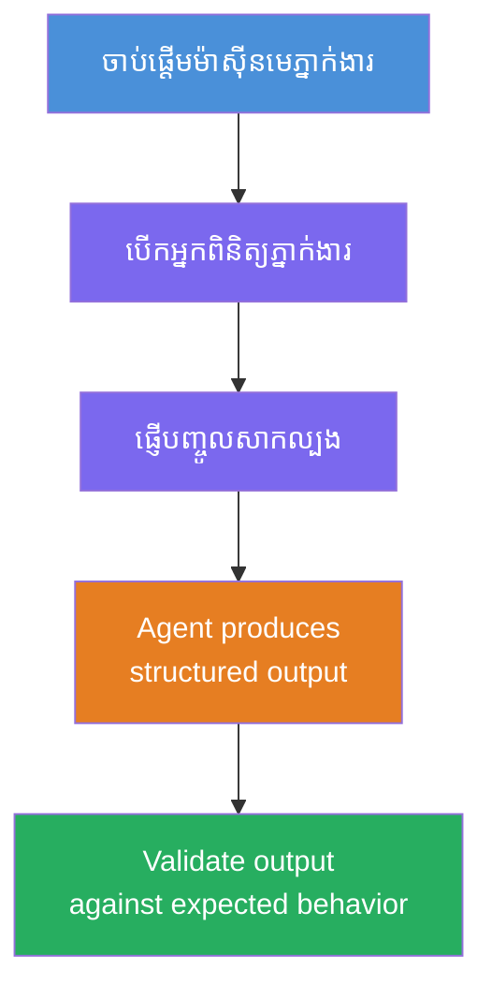
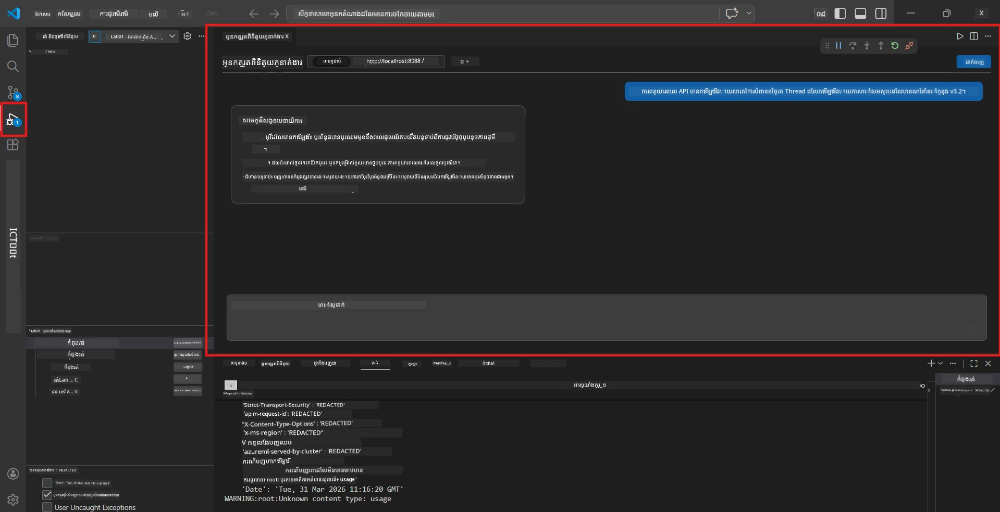
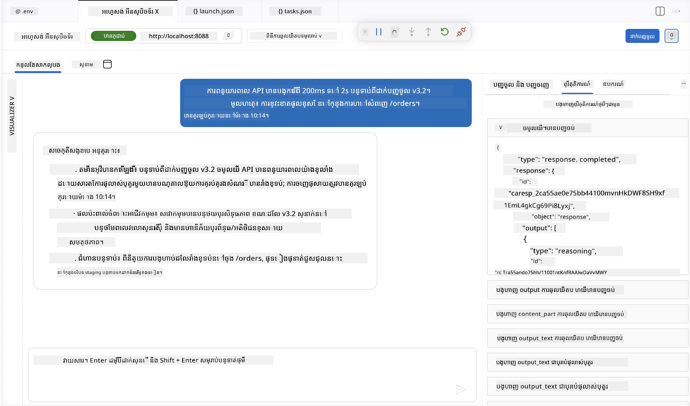

# ម៉ូឌុលទី 4 - សាកល្បងក្នុងស្រុក

⏱️ ~10 នាទី

ក្នុងម៉ូឌុលនេះ អ្នកដំណើរការ​អាជ្ញាសក្តិ​នៅក្នុងស្រុកហើយ​ផ្ទៀងផ្ទាត់ថាវាដំណើរការបានត្រឹមត្រូវដោយប្រើ **ការតេស្តមុខងារផ្លូវអប្បបរមា**។ អ្នកនឹងប្រើ Agent Inspector (UI ឯកសារ) ឬ​ ការហៅ HTTP ត្រង់ ដើម្បីបញ្ជាក់ថាអាជ្ញាសក្តិបង្កើតចម្លើយដែលមានរចនាសម្ព័ន្ធនិងត្រឹមត្រូវ។

### សំណុំតេស្តក្នុងស្រុក



---

## ជម្រើសទី 1៖ ចុច F5 - ដំណើរការ Debug ជាមួយ Agent Inspector (ណែនាំ)

### ចាប់ផ្តើមកម្មវិធី Debug

1. បើកថត **executive-summary-agent/** ជាន់ត្រង់ក្នុង VS Code (`File → Open Folder`)។
2. បើកផ្ទាំង **Run and Debug** (`Ctrl+Shift+D`)។
3. ជ្រើស **Debug Local Agent Server** ពីបញ្ជីចុះក្រោម។
4. ចុច **F5** (ឬចុច ▶ Start Debugging)។

> ⚠️ **សំខាន់៖ ជ្រើស Python Interpreter របស់អ្នក**
> ប្រសិនបើអ្នកបានប្រទះបញ្ហា "ModuleNotFoundError" ឬ debugger មិនចាប់ផ្តើម អ្នកត្រូវប្រាប់ VS Code ដើម្បីប្រើបរិស្ថានវឺជវឌ្ឍន៍៖
  > 1. ចុច `Ctrl+Shift+P` $\rightarrow$ វាយ **Python: Select Interpreter**។
  > 2. ជ្រើស interpreter ដែលស្ថិតនៅក្នុងថត `.venv` របស់គម្រោង (ឧ. `.\.venv\Scripts\python.exe` លើ Windows)។
  > 3. ការចាប់ផ្តើម debugger ម្តងទៀត។
> ប្រសិនបើអ្នកនៅតែប្រទះបញ្ហា សូមកែសម្រួលឯកសារ `tasks.json` ដូចខាងក្រោម៖
  > 1. ទៅកាន់ឯកសារ `.vscode/tasks.json`
  > 2. រកការបញ្ជារដែលមានឈ្មោះ៖ `Run Agent/Workflow HTTP Server`
  > 3. បន្ទាន់សម្រួលតម្លៃបញ្ជា៖ `"value": "${workspaceFolder}/.venv/bin/python",`

### អ្វីដែលកើតឡើង

1. ម៉ាស៊ីនបម្រើ HTTP ចាប់ផ្តើមនៅ `http://localhost:8088/responses`។
2. ផ្ទាំង **Agent Inspector** បើកឡើងដោយស្វ័យប្រវត្តិ - ជាមុខងារសន្ទនា visible សម្រាប់ការតេស្ត។
3. Breakpoints ត្រូវបានបើកនៅក្នុង `main.py`។

ខិតតាម Terminal សម្រាប់៖
```
Starting executive summary hosted agent
Executive agent server running on http://localhost:8088
```

> **បើ Agent Inspector មិនបើកឡើង៖** ចុច `Ctrl+Shift+P` → **Foundry Toolkit: Open Agent Inspector**។



> *រូបភាពអាចបង្ហាញនូវម៉ាក 'AI TOOLKIT' ជា​ចាស់​ពី​កំណែ​វិលតម្រង់​បន្ថែម​មុន។*

---

## ជម្រើសទី 2៖ សាកល្បងតាមរយៈ Terminal (ជាជម្រើសផ្ទុក)

ចាប់ផ្តើមអាជ្ញាសក្តិ ក្នុង Terminal មួយ ហើយបញ្ជូនសំណើពី Terminal មានផ្សេងទៀត៖

```bash
# អ្នកប្រតិបត្តិការចាប់ផ្តើមនៅចុងបញ្ចប់ 1
cd executive-summary-agent/
source .venv/bin/activate
python main.py
```

```bash
# ព្រលាន​ទូរស័ព្ទ 2: ផ្ញើ​ការ​សាកល្បង (curl)
curl -sS -X POST http://localhost:8088/responses \
  -H "Content-Type: application/json" \
  -d '{"input": "The API latency increased due to thread pool exhaustion caused by sync calls in v3.2.", "stream": false}'
```

---

## ករណីសាកល្បង៖ ការផ្ទៀងផ្ទាត់មុខងារផ្លូវអប្បបរមា

ប្រតិបត្តិការទាំង **បីសម្រាប់ករណី** ខាងក្រោម។ ករណីទាំងនេះផ្ទៀងផ្ទាត់ថាអាជ្ញាសក្តិរបស់អ្នក​បង្កើត​ចេញ​នូវលទ្ធផល​ត្រឹមត្រូវ និង​មាន​រចនាសម្ព័ន្ធ​សមរម្យ​សម្រាប់អ៊ីនប៊ុត​ជាក់ស្តែង។



### ករណីសាកល្បង 1៖ ព្រឹត្តិការណ៍ IT - ការពន្យារពេល API រហ័ស

**អ៊ីនប៊ុត៖**
```
The API latency increased from 200ms to 2s after deploying v3.2.
Root cause: thread pool starvation from synchronous calls in /orders.
Rolled back at 10:14.
```

**អ្វីដែលគេរំពឹង៖**
- ✅ តាមរយៈរចនាសម្ព័ន្ធ "Executive Summary" (អ្វីដែលកើតឡើង / ផលប៉ះពាល់អាជីវកម្ម / ជំហានបន្ទាប់)
- ✅ គ្មានពាក្យបច្ចេកទេស (គ្មាន "thread pool", គ្មាន "/orders", គ្មាន "v3.2")
- ✅ បញ្ជាក់ពីផលប៉ះពាល់អាជីវកម្មយ៉ាងច្បាស់ (ឧ. អ្នកប្រើប្រាស់ប្រឈមមុខនឹងការពន្យារពេល)
- ✅ រួមបញ្ចូលជំហានបន្ទាប់ (ឧ. ផលិតកម្មបានជួសជុល ហើយកំពុងតាមដាន)

---

### ករណីសាកល្បង 2៖ បណ្តាញទិន្នន័យ - ការបរាជ័យ ETL

**អ៊ីនប៊ុត៖**
```
The nightly ETL job failed because the upstream schema changed. APAC dashboards show missing data.
```

**អ្វីដែលគេរំពឹង៖**
- ✅ សង្ខេបពីការបរាជ័យបញ្ចូលទិន្នន័យដោយភាសាខ្លីៗ ងាយយល់
- ✅ ការប៉ះពាល់តារាងត្រួតពិនិត្យ APAC ត្រូវបានរំលេច
- ✅ រួមបញ្ចូលជំហានជួសជុលបន្ទាប់
- ✅ មិនបានឈ្មោះ "ETL", "schema", ឬពាក្យបច្ចេកទេសផ្សេងទៀត

---

### ករណីសាកល្បង 3៖ សន្តិសុខ - លក្ខណៈសម្គាល់ដែលបានបង្ហាញ

**អ៊ីនប៊ុត៖**
```
Static analysis flagged a hardcoded secret in the repository.
The secret may have been exposed in commit history.
```

**អ្វីដែលគេរំពឹង៖**
- ✅ ពិពណ៌នាបញ្ហាលក្ខណៈសម្គាល់/សន្តិសុខជាភាសាដែលភាសាប្រតិបត្តិការ
- ✅ រំលេចអំពីហានិភ័យសក្តានុពល (ការចូលប្រើដោយគ្មានសិទិ្ធ)
- ✅ រៀបរាប់ពីសកម្មភាពជួសជុល (បញ្ចូលការប្ដូរលក្ខណៈសម្គាល់, ការត្រួតពិនិត្យ)
- ✅ មិនរួមទាំងពាក្យដូចជា "static analysis", "commit history", ឬ "hardcoded"

---

## បញ្ចាក់លក្ខខណ្ឌ

សម្រាប់ករណីនីមួយៗ ចូរកត់សម្គាល់៖

| # | លក្ខខណ្ឌ | លទ្ធផលជោគជ័យ |
|---|----------|---------------|
| 1 | **រចនាសម្ព័ន្ធ** | ចម្លើយប្រើរចនាសម្ព័ន្ធ "Executive Summary" មានចំណុចទាំងបី |
| 2 | **ភាសាធម្មតា** | គ្មានពាក្យបច្ចេកទេសដែលប្រតិបត្តិការមិនយល់ |
| 3 | **ភាពត្រឹមត្រូវ** | សង្ខេបផ្ទៀងផ្ទាត់អ៊ីនប៊ុត - គ្មានព័ត៌មានបង្ក
| 4 | **ក្របខ័ណ្ឌ** | ចម្លើយមានពាក្យតិចជាង ១០០ |
| 5 | **ជំហានបន្ទាប់** | លម្អិតសកម្មភាព ឬការទប់ស្កាត់ |

---

## គន្លឹះសម្រាប់ដោះស្រាយបញ្ហា

| បញ្ហា | ដោះស្រាយ |
|-------|-----|
| អាជ្ញាសក្តិមិនចាប់ផ្តើម | ពិនិត្យតម្លៃ `.env`, បញ្ជាក់ថា venv បានបើកចូលហើយ, រត់ `pip install -r requirements.txt` |
| ចម្លើយទទេ ឬទូទៅ | ពិនិត្យការណែនាំក្នុង `main.py` - បញ្ជាក់ថាទ្រង់ទ្រាយចេញត្រូវបានបញ្ជាក់ |
| ចម្លើយមានពាក្យបច្ចេកទេស | ជ្រៀតជ្រែកច្បាស់ល្អ "ដកពាក្យបច្ចេកទេសចេញ" ក្នុងការណែនាំ |
| Agent Inspector មិនបើក | ចុច `Ctrl+Shift+P` → **Foundry Toolkit: Open Agent Inspector** |
| កំហុសម៉ូឌែលក្នុង Terminal | ពិនិត្យថា `AZURE_AI_MODEL_DEPLOYMENT_NAME` ត្រូវគ្នា ពិចារណាភាពខុសគ្នាទាំងអក្សរធំព្រមទាំងតូច |

---

### ✅ ចំណុចពិនិត្យ

- [ ] អាជ្ញាសក្តិចាប់ផ្តើមក្នុងស្រុកដោយគ្មានកំហុស
- [ ] Agent Inspector បើកហើយបង្ហាញផ្ទាំងសន្ទនា (បើប្រើ F5)
- [ ] **ករណី 1** (ព្រឹត្តិការណ៍ IT) - Executive Summary រចនាសម្ព័ន្ធត្រឹមត្រូវ គ្មានពាក្យបច្ចេកទេស
- [ ] **ករណី 2** (បណ្តាញទិន្នន័យ) - សង្ខេបដែលពាក់ព័ន្ធជាមួយផលប៉ះពាល់អាជីវកម្ម
- [ ] **ករណី 3** (ការជូនដំណឹងសន្តិសុខ) - ការប្រាស្រ័យទាក់ទងហានិភ័យសមរម្យ
- [ ] ចម្លើយទាំងអស់អនុវត្តរចនាសម្ព័ន្ធផលិតផលត្រូវបានកំណត់

> **រក្សាទុកចម្លើយរបស់អ្នក** (ចម្លង ឬថតរូប) - អ្នកនឹងប្រៀបធៀបវាជាមួយលទ្ធផលក្នុងពពកក្នុងម៉ូឌុល 06។

---

**មុននេះ:** [03 - Configure & Code](03-configure-and-code.md) · **បន្ទាប់:** [05 - Deploy to Foundry →](05-deploy-to-foundry.md)

---

<!-- CO-OP TRANSLATOR DISCLAIMER START -->
**ការបដិសេធ**:
ឯកសារនេះត្រូវបានបម្លែងភាសា ដោយប្រើសេវាបម្លែងភាសា AI [Co-op Translator](https://github.com/Azure/co-op-translator)។ ទោះយើងខ្ញុំមានក្តីប្រាថ្នាឱ្យបានច្បាស់លាស់ តែសូមយល់ដឹងថាការបម្លែងដោយស្វ័យប្រវត្តិក៏អាចមានកំហុសឬភាពមិនត្រឹមត្រូវ។ ឯកសារដើមជាភាសាទីតាំងគួរត្រូវបានគេប្រើជាប្រភពច្បាស់លាស់។ សម្រាប់ព័ត៌មានសំខាន់ៗ សូមណែនាំឱ្យប្រើប្រាស់ការប្រែដោយមនុស្សជំនាញ។ យើងខ្ញុំមិនទទួលខុសត្រូវចំពោះការយល់ច្រឡំ ឬការបកស្រាយខុសបន្ទាប់ពីការប្រើប្រាស់ការបម្លែងនេះនោះទេ។
<!-- CO-OP TRANSLATOR DISCLAIMER END -->