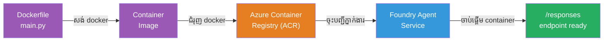
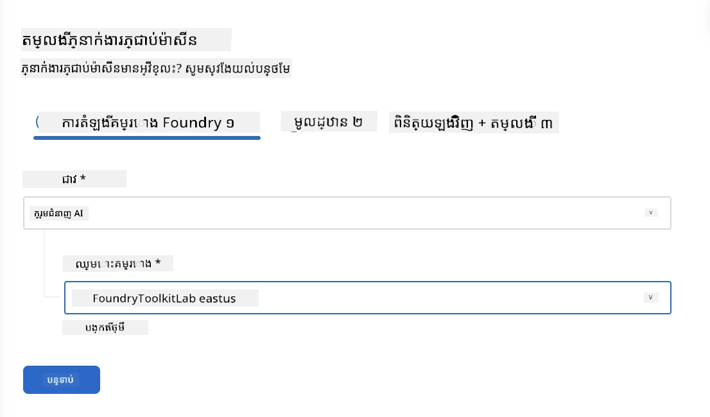
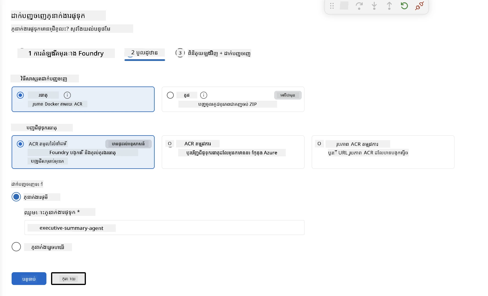
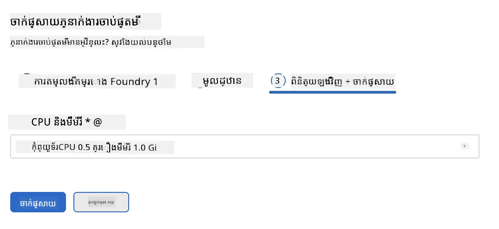
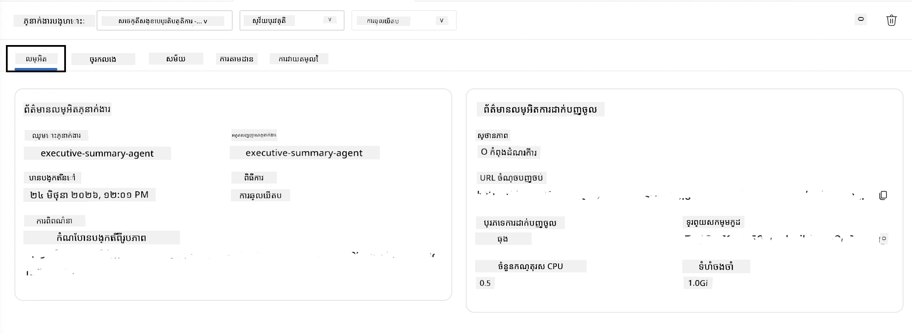

# ម៉ូឌុល 5 - បញ្ចូលទៅសេវាកម្ម Foundry Agent

⏱️ ~10 នាទី

> ⚠️ **អ្នកប្រើផ្លូវ B:** ម៉ូឌុលនេះត្រូវការជាវ Foundry ។ ប្រសិនបើអ្នកកំពុងប្រើ Foundry Local សូមរំលងទៅ [Module 07 - សង្ខេប](07-summary.md)។ អ្នកបានបញ្ចប់ដំណើរការអភិវឌ្ឍន៍ក្នុងតំបន់ដោយជោគជ័យហើយ!

ក្នុងម៉ូឌុលនេះ អ្នកនឹងបញ្ចូលភ្នាក់ងារដែលបានសាកល្បងក្នុងតំបន់ទៅ Microsoft Foundry ជា **ភ្នាក់ងារផ្ទុករៀបចំ**។ ការបញ្ចូលនឹងបង្កើតរូបភាពកង់តេន័រ ដាក់វាទៅ Azure Container Registry និងចាប់ផ្តើមភ្នាក់ងារនៅក្នុងហេដ្ឋារចនាសម្ព័ន្ធដែលគ្រប់គ្រងដោយ Foundry។

### ស្យុងដំណើរការបញ្ចូល

---

## ការត្រួតពិនិត្យតម្រូវការមុន

មុននឹងបញ្ចូល សូមធ្វើការបញ្ជាក់៖

- [ ] ភ្នាក់ងារឆ្លងកាត់ហេតុការណ៍ក្នុងតំបន់ទាំង 3 តាម [Module 04](04-test-locally.md)
- [ ] អ្នកមានតួនាទី **Azure AI User** ក្នុងកម្រិតគម្រោង ([Module 01, កំណត់ RBAC](01-setup.md#deploy-a-model--assign-rbac))
- [ ] អ្នកបានចូលដំណើរការតាម Azure នៅក្នុង VS Code (រូបតំណាងគណនីបង្ហាញឈ្មោះអ្នក)

---

## ជំហាន 1៖ ចាប់ផ្តើមបញ្ចូល

### ជម្រើស A៖ បញ្ចូលពី Agent Inspector (ណែនាំ)

ប្រសិនបើ Agent Inspector កំពុងបើក (ពីការសាកល្បង)៖
1. ចុចប៊ូតុង **Deploy** នៅខាងលើស្ដាំ (រូបតំណាងពពក ↑)។

### ជម្រើស B៖ បញ្ចូលពី Command Palette

1. ចុច `Ctrl+Shift+P` → **Foundry Toolkit: Deploy Hosted Agent**។

---

## ជំហាន 2៖ កំណត់រចនាសម្ព័ន្ធសម្រាប់បញ្ចូល

កម្មវិធីអេឡិចត្រូនិចនឹងស្នើសុំឲ្យអ្នក៖

| សំណួរ | ជម្រើស |
|--------|-----------|
| **Subscription** | ការជាវ Azure របស់អ្នក |
| **គម្រោងគោលដៅ** | គម្រោង Foundry របស់អ្នក (ឧ. `workshop-agents`) |

ចុច **បន្ទាប់** ដើម្បីកំណត់រចនាសម្ព័ន្ធភ្នាក់ងារ។

| សំណួរ | ជម្រើស |
|--------|-----------|
| **របៀបបញ្ចូល** | កង់តេន័រ |
| **ការ​ចុះបញ្ជី​កង់តេន័រ** | **ACR ជាមុន** (Microsoft Foundry បង្កើតនិងគ្រប់គ្រងសម្រាប់អ្នក) |
| **បញ្ចូលទៅ** | ភ្នាក់ងារថ្មី (ឈ្មោះ, `executive-summary-agent`) |

ចុច **បន្ទាប់** ដើម្បីពិនិត្យឡើងវិញនិងបញ្ចូលភ្នាក់ងាររបស់អ្នក។

| សំណួរ | ជម្រើស |
|--------|-----------|
| **CPU និងអង្គចងចាំ** | **0.25 គោល CPU, 0.5 Gi អង្គចងចាំ** (គ្រប់គ្រាន់សម្រាប់សិក្ខាសាលា) |

---

## ជំហាន 3៖ បញ្ចូល និងត្រួតពិនិត្យ

1. ចុច **Deploy**។
2. មើលផ្ទាំង **Output** (ជ្រើស **Microsoft Foundry** ពីបញ្ជីចុចចុះ)។
3. ការបញ្ចូលដំណើរការតាមដំណាក់កាល៖
   - **ការសាងសង់ Docker** - សាងសង់កង់តេន័រពី Dockerfile របស់អ្នក
   - **ការបញ្ចូល Docker** - បញ្ចូលរូបភាពទៅ ACR (1–3 នាទីនៅពេលបញ្ចូលដំបូង)
   - **ការចុះបញ្ជីភ្នាក់ងារ** - បង្កើតភ្នាក់ងារផ្ទុកនៅ Foundry
   - **ការចាប់ផ្តើមកង់តេន័រ** - ចាប់ផ្តើមដោយអត្តសញ្ញាណគ្រប់គ្រងប្រព័ន្ធ

4. ពេលបញ្ចប់ ការជូនដំណឹងមួយបង្ហាញ៖
   > **my-agent ត្រូវបានបញ្ចូលដោយជោគជ័យ។** `View logs` `Run agent`

5. ចុច **Run agent** ដើម្បីបើកAgent Playground។

### តម្លៃស្ថានភាពបញ្ចូល

| ស្ថានភាព | មានន័យថា |
|--------|---------|
| **នៅកំពុងដំណើរ** | កង់តេន័រប្រកបដោយភាពត្រៀមរួច រំពឹងខ្លឹមសារ |
| **នៅកំពុងចាប់ផ្តើម** | កង់តេន័រចាប់ផ្តើម - ចាំ 30–60 វិនាទី |
| **បរាជ័យ** | សូមពិនិត្យកំណត់ហេតុ (មើលការដោះស្រាយបញ្ហាខាងក្រោម) |

---

## កំហុសសាមញ្ញពាក់ព័ន្ធបញ្ចូល

| កំហុស | ដើមកំណើត | ដោះស្រាយ |
|-------|-----------|-----|
| អនុញ្ញាត `agents/write` ត្រូវបានបដិសេធ | ខ្វះតួនាទី **Azure AI User** នៅកម្រិតគម្រោង | [Module 01, កំណត់ RBAC](01-setup.md#deploy-a-model--assign-rbac) |
| Docker មិនដំណើរការ | Docker Desktop មិនបានចាប់ផ្តើម | ចាប់ផ្តើម Docker Desktop → បញ្ជាក់ `docker info` |
| អ autorización ACR | អត្តសញ្ញាណគ្រប់គ្រងមិនអាចទាញរូបភាព | មើល [Module 08 - ដោះស្រាយបញ្ហា](08-troubleshooting.md) |

---

### ✅ ចំណុចពិនិត្យ

- [ ] ការបញ្ចូលបានបញ្ចប់ដោយគ្មានកំហុស
- [ ] ភ្នាក់ងារបង្ហាញនៅក្រោម **Hosted Agents (Preview)** នៅផ្នែកមុខ Foundry
- [ ] ស្ថានភាពកង់តេន័របង្ហាញ **នៅកំពុងដំណើរ**
- [ ] ផ្ទាំង Agent Playground បានបើកបង្ហាញព័ត៌មានភ្នាក់ងារនិង URL ចេញ

---

**មុនหน้านี้:** [04 - សាកល្បងក្នុងតំបន់](04-test-locally.md) · **បន្ទាប់:** [06 - ពិនិត្យនៅក្នុងទីលានកម្សាន្ត →](06-verify-in-playground.md)

---

<!-- CO-OP TRANSLATOR DISCLAIMER START -->
**ការបដិសេធ**:
ឯកសារនេះត្រូវបានបម្លែងភាសា ដោយប្រើសេវាបម្លែងភាសា AI [Co-op Translator](https://github.com/Azure/co-op-translator)។ ទោះយើងខ្ញុំមានក្តីប្រាថ្នាឱ្យបានច្បាស់លាស់ តែសូមយល់ដឹងថាការបម្លែងដោយស្វ័យប្រវត្តិក៏អាចមានកំហុសឬភាពមិនត្រឹមត្រូវ។ ឯកសារដើមជាភាសាទីតាំងគួរត្រូវបានគេប្រើជាប្រភពច្បាស់លាស់។ សម្រាប់ព័ត៌មានសំខាន់ៗ សូមណែនាំឱ្យប្រើប្រាស់ការប្រែដោយមនុស្សជំនាញ។ យើងខ្ញុំមិនទទួលខុសត្រូវចំពោះការយល់ច្រឡំ ឬការបកស្រាយខុសបន្ទាប់ពីការប្រើប្រាស់ការបម្លែងនេះនោះទេ។
<!-- CO-OP TRANSLATOR DISCLAIMER END -->