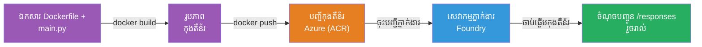
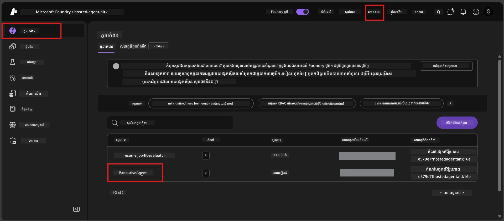

# Module 6 - បង្ហោះទៅសេវាកម្ម Foundry Agent

នៅក្នុងម៉ូឌុលនេះ អ្នកបានបង្ហោះភ្នាក់ងារដែលបានសាកល្បងក្នុងកន្លែងផ្ទាល់ខ្លួនទៅ Microsoft Foundry ជា [**Hosted Agent**](https://learn.microsoft.com/azure/foundry/agents/concepts/hosted-agents)។ ដំណើរការបង្ហោះសាងសង់រូបភាពកញ្ចប់ Docker ពីគម្រោងរបស់អ្នក ដាក់វាទៅ [Azure Container Registry (ACR)](https://learn.microsoft.com/azure/container-registry/container-registry-intro) ហើយបង្កើតជាម versión ភ្នាក់ងារដែលបង្ហោះក្នុង [Foundry Agent Service](https://learn.microsoft.com/azure/foundry/agents/overview)។

### បណ្តាញបញ្ជានៃការបង្ហោះ


---

## ការត្រួតពិនិត្យតម្រូវការ

មុនពេលបង្ហោះ សូមផ្ទៀងផ្ទាត់វត្ថុទាំងអស់ខាងក្រោម។ ការលងកន្លែងធ្វើបែបនេះគឺជាបំណងគ្រប់គ្រឿងនៃការបរាជ័យការបង្ហោះដែលត្រូវបានជួបជាញឹកញាប់បំផុត។

1. **ភ្នាក់ងារឆ្លើយតបទៅនឹងការសាកល្បងក្នុងកន្លែងផ្ទាល់បានជោគជ័យ:**
   - អ្នកបានបញ្ចប់តេស្តទាំង 4 ក្នុង [Module 5](05-test-locally.md) ហើយភ្នាក់ងារឆ្លើយតបបានត្រឹមត្រូវ។

2. **អ្នកមានតួនាទី [Azure AI User](https://learn.microsoft.com/azure/foundry/concepts/rbac-foundry#built-in-roles):**
   - តួនាទីនេះត្រូវបានផ្ដល់នៅក្នុង [Module 2, ជំហាន 3](02-create-foundry-project.md)។ ប្រសិនបើអ្នកមិនប្រាកដ សូមត្រួតពិនិត្យឥឡូវនេះ៖
   - Azure Portal → ឯកសារគម្រោង Foundry របស់អ្នក → **Access control (IAM)** → តាប **Role assignments** → ស្វែងរកឈ្មោះរបស់អ្នក → បញ្ជាក់ថា **Azure AI User** មានបញ្ចូល។

3. **អ្នកបានចូលប្រើ Azure នៅក្នុង VS Code:**
   - ពិនិត្យរូបតំណាង Accounts នៅខាងក្រោម-ឆ្វេងនៃ VS Code។ ឈ្មោះគណនីរបស់អ្នកគួរតែបង្ហាញ។

4. **(ជាជម្រើស) Docker Desktop កំពុងរត់:**
   - Docker ត្រូវបានតម្រូវនៅពេលដែលផ្នែកបន្ថែម Foundry ស្នើសុំសាងសង់ក្នុងកន្លែងផ្ទាល់។ ក្នុងករណីភាគច្រើន ផ្នែកបន្ថែមនេះដំណើរការសាងសង់កញ្ចប់ដោយស្វ័យប្រវត្តិក្នុងអំឡុងពេលបង្ហោះ។
   - ប្រសិនបើអ្នកបានដំឡើង Docker សូមបញ្ជាក់ថាវាកំពុងដំណើរការ៖ `docker info`

---

## ជំហានទី 1: ចាប់ផ្តើមការបង្ហោះ

អ្នកមានពីរប្រភេទដើម្បីបង្ហោះ - តែទាំងពីរនាំឱ្យមានលទ្ធផលដូចគ្នា។

### ជម្រើស A: បង្ហោះពី Agent Inspector (ផ្ដល់អនុសាសន៍)

ប្រសិនបើអ្នកកំពុងដំណើរការភ្នាក់ងារជាមួយ debugger (F5) និង Agent Inspector កំពុងបើក៖

1. មើល ផ្នែកខាងកំពូល-ស្តាំ នៃផ្ទាំង Agent Inspector។
2. ចុចប៊ូតុង **Deploy** (រូបតំណាងពពកមានព្រួញម្ខាងលើ ↑)។
3. វារ៉ាការបង្ហោះនឹងបើក។

### ជម្រើស B: បង្ហោះពី Command Palette

1. ចុច `Ctrl+Shift+P` ដើម្បីបើក **Command Palette**។
2. វាយ: **Microsoft Foundry: Deploy Hosted Agent** ហើយជ្រើសរើសវា។
3. វារ៉ាការបង្ហោះនឹងបើក។

---

## ជំហានទី 2: កំណត់ការកំណត់បង្ហោះ

វារ៉ាការបង្ហោះនឹងដឹកនាំអ្នកតាមរយៈការកំណត់តាមបែបបទ។ បំពេញក្នុងគ្រប់ការស្រង់ទិន្នន័យ៖

### 2.1 ជ្រើសគម្រោងគោលដៅ

1. បញ្ចាំងក្រោមបង្អួចនឹងបង្ហាញគម្រោង Foundry របស់អ្នក។
2. ជ្រើសគម្រោងដែលអ្នកបានបង្កើតក្នុង Module 2 (ឧទាហរណ៍ `workshop-agents`)។

### 2.2 ជ្រើសឯកសារភ្នាក់ងារកញ្ចប់

1. អ្នកត្រូវបានស្នើឱ្យជ្រើសចំណុចចូលរបស់ភ្នាក់ងារ។
2. ជ្រើស **`main.py`** (Python) - នេះជាឯកសារដែលវារ៉ាការ​ប្រើសម្រាប់សម្គាល់គម្រោងភ្នាក់ងារ។

### 2.3 កំណត់ធនធាន

| ការកំណត់ | តម្លៃដែលផ្ដល់អនុសាសន៍ | សម្គាល់ |
|---------|------------------|-------|
| **CPU** | `0.25` | លំនាំដើម គ្រប់គ្រាន់សម្រាប់វគ្គសិក្សា។ បង្កើនសម្រាប់បន្ទុកការងារផលិតកម្ម |
| **Memory** | `0.5Gi` | លំនាំដើម គ្រប់គ្រាន់សម្រាប់វគ្គសិក្សា |

តម្លៃទាំងនេះផ្គូផ្គងនឹងតម្លៃក្នុង `agent.yaml`។ អ្នកអាចទទួលយកលំនាំដើមបាន។

---

## ជំហានទី 3: បញ្ជាក់ និង បង្ហោះ

1. វារ៉ាការបង្ហោះបង្ហាញសង្ខេបការបង្ហោះជាមួយ៖
   - ឈ្មោះគម្រោងគោលដៅ
   - ឈ្មោះភ្នាក់ងារ (ពី `agent.yaml`)
   - ឯកសារកញ្ចប់ និងធនធាន
2. ពិនិត្យមើលសង្ខេប និង ចុច **Confirm and Deploy** (ឬ **Deploy**)។
3. តាមដានដំណើរការនៅក្នុង VS Code។

### អ្វីដែលកើតឡើងក្នុងអំឡុងការបង្ហោះ (ជំហានលំដាប់)

ការបង្ហោះជាដំណើរការច្រើនជំហាន។ តាមដានផ្ទាំង **Output** របស់ VS Code (ជ្រើស "Microsoft Foundry" ពីបញ្ជីធ្លាក់ទាញ) ដើម្បីតាមដាន៖

1. **Docker build** - VS Code សាងសង់រូបភាពកញ្ចប់ Docker ពី `Dockerfile` របស់អ្នក។ អ្នកនឹងឃើញសារជាន់ Docker:
   ```
   Step 1/6 : FROM python:<version>-slim
   Step 2/6 : WORKDIR /app
   ...
   Successfully built abc123def456
   ```

2. **Docker push** - រូបភាពត្រូវបានផ្តិតទៅ **Azure Container Registry (ACR)** ដែលភ្ជាប់ជាមួយគម្រោង Foundry របស់អ្នក។ នេះអាចចំណាយពេល 1-3 នាទីនៅពេលបង្ហោះដំបូង (រូបភាពមូលដ្ឋានមានទំហំលើស 100MB)។

3. **Agent registration** - សេវាកម្ម Foundry Agent បង្កើតភ្នាក់ងារថ្មីដែលបានបង្ហោះ (ឬជាភ្នាក់ងារថ្មីបើភ្នាក់ងារបានមានរួចហើយ)។ ព័ត៌មានបច្ចេកទេសពី `agent.yaml` ត្រូវបានប្រើ។

4. **Container start** - កញ្ចប់ចាប់ផ្តើមដំណើរការនៅក្នុងមូលដ្ឋានគ្រប់គ្រង Foundry។ វេទិកានេះផ្ដល់អត្តសញ្ញាណដែលគ្រប់គ្រងដោយប្រព័ន្ធ ហើយបង្ហាញចំណុចចេញ `/responses`។

> **ការបង្ហោះដំបូងយឺតជាង** (Docker ត្រូវតែផ្តិតជាន់ទាំងអស់)។ ការបង្ហោះបន្ទាប់អាចរហ័សជាងដោយសារ Docker ទទួលជាន់ដែលមិនបានផ្លាស់ប្តូរ។

---

## ជំហានទី 4: ផ្ទៀងផ្ទាត់ស្ថានភាពការបង្ហោះ

បន្ទាប់ពីសេចក្តីបញ្ជាបង្ហោះបានបញ្ចប់៖

1. បើកផ្ទាំងជាមួយគ្រប់គ្រង **Microsoft Foundry** ដោយចុចរូបតំណាង Foundry នៅក្នុង Bar សកម្មភាព។
2. ពន្លឿនផ្នែក **Hosted Agents (Preview)** ខាងក្រោមគម្រោងរបស់អ្នក។
3. អ្នកគួរតែឃើញឈ្មោះភ្នាក់ងារ (ឧ. `ExecutiveAgent` ឬឈ្មោះពី `agent.yaml`)។
4. **ចុចលើឈ្មោះភ្នាក់ងារ** ដើម្បីពន្លឿនវា។
5. អ្នកនឹងឃើញមួយឬច្រើន **версии** (ឧ. `v1`)។
6. ចុចលើវើស្យុនដើម្បីមើល **Container Details**។
7. ពិនិត្យប៊ិចទី **Status**៖

   | ស្ថានភាព | អត្ថន័យ |
   |--------|---------|
   | **Started** ឬ **Running** | កញ្ចប់កំពុងដំណើរការ ហើយភ្នាក់ងារត្រៀមរួចហើយ |
   | **Pending** | កញ្ចប់កំពុងចាប់ផ្តើម (រង់ចាំ 30-60 វិនាទី) |
   | **Failed** | កញ្ចប់បរាជ័យក្នុងការចាប់ផ្តើម (ពិនិត្យកំណត់ហេតុ - មើលការដោះស្រាយខាងក្រោម) |



> **បើអ្នកឃើញ "Pending" លើស 2 នាទី:** កញ្ចប់អាចកំពុងទាញរូបភាពមូលដ្ឋាន។ រង់ចាំបន្តិចទៀត។ ប្រសិនបើវាកាន់តែបន្ត pending សូមពិនិត្យកំណត់ហេតុកញ្ចប់។

---

## កំហុសបង្ហោះពេញនិយម និងវិធីជួយជាសះស្បើយ

### កំហុស 1: អនុញ្ញាតបំណុល - `agents/write`

```
Error: lacks the required data action 
Microsoft.CognitiveServices/accounts/AIServices/agents/write 
to perform POST /api/projects/{projectName}/assistants operation.
```

**មូលហេតុជារបស់ដើម:** អ្នកមិនមានតួនាទី `Azure AI User` នៅលើកម្រិត **គម្រោង**។

**វិធីជំនួយជំហានលម្អិត៖**

1. បើក [https://portal.azure.com](https://portal.azure.com)។
2. នៅក្នុងបារ ស្វែងរកឈ្មោះ **គម្រោង** Foundry របស់អ្នក ហើយចុចលើវា។
   - **សំខាន់:** ប្រាកដថាអ្នកបានចូលទៅកាន់ធនធាន **គម្រោង** (ប្រភេទ: "Microsoft Foundry project") មិនមែនធនធានគណនី/ហាប់មេ។
3. នៅផ្នែកជាប់ខាងឆ្វេង ចុច **Access control (IAM)**។
4. ចុច **+ Add** → **Add role assignment**។
5. នៅតាប **Role** ស្វែងរក [**Azure AI User**](https://learn.microsoft.com/azure/foundry/concepts/rbac-foundry#built-in-roles) ហើយជ្រើសវា។ ចុច **Next**។
6. នៅតាប **Members** ជ្រើស **User, group, or service principal**។
7. ចុច **+ Select members** ស្វែងរកឈ្មោះ/អ៊ីមែលរបស់អ្នក ជ្រើសរើសខ្លួនអ្នក ហើយចុច **Select**។
8. ចុច **Review + assign** → បន្តចុច **Review + assign** វិញ។
9. រង់ចាំ 1-2 នាទីសម្រាប់ការចែកចាយតួនាទី។
10. **សាកល្បងបង្ហោះជាមួយជំហានទី 1 វិញ**។

> តួនាទីត្រូវមាននៅកម្រិត **គម្រោង** មិនមែនត្រឹមតែគណនីទេ។ នេះគឺជាមូលហេតុ #1 ទូទៅរបស់ការបរាជ័យបង្ហោះ។

### កំហុស 2: Docker មិនដំណើរការ

```
Error: Docker build failed / Cannot connect to Docker daemon
```

**វិធីជំនួយ:**
1. ចាប់ផ្តើម Docker Desktop (ស្វែងរកវានៅម៉ឺនុយចាប់ផ្តើមឬថាសប្រព័ន្ធរបស់អ្នក)។
2. រង់ចាំរហូតទាល់តែវាបង្ហាញថា "Docker Desktop is running" (30-60 វិនាទី)។
3. ពិនិត្យ: `docker info` ក្នុងផ្ទាំងបញ្ជា។
4. **Windows ជាក់លាក់:** ប្រាកដថាខាងក្រោយ WSL 2 ត្រូវបានបើកក្នុងការកំណត់ Docker Desktop → **General** → **Use the WSL 2 based engine**។
5. សាកល្បងបង្ហោះវិញ។

### កំហុស 3: អនុញ្ញាត ACR - `AcrPullUnauthorized`

```
Error: AcrPullUnauthorized
```

**មូលហេតុជារបស់ដើម:** អត្តសញ្ញាណគ្រប់គ្រងគម្រោង Foundry មិនមានសិទ្ធិស្វែងទាញរូបភាពកញ្ចប់ registry ។

**វិធីជំនួយ:**
1. នៅក្នុង Azure Portal, ទៅកាន់ **[Container Registry](https://learn.microsoft.com/azure/container-registry/container-registry-intro)** របស់អ្នក (វា​នៅក្នុង​ក្រុមធនធានដូចគ្នាជាមួយគម្រោង Foundry)។
2. ទៅកាន់ **Access control (IAM)** → **Add** → **Add role assignment**។
3. ជ្រើសតួនាទី **[AcrPull](https://learn.microsoft.com/azure/container-registry/container-registry-roles)**។
4. នៅឯសមាជិកជ្រើស **Managed identity** → រកអត្តសញ្ញាណគ្រប់គ្រងគម្រោង Foundry។
5. **Review + assign**។

> តួសំនួរនេះត្រូវបានកំណត់ដោយស្វ័យប្រវត្តិដោយផ្នែកបន្ថែម Foundry។ ប្រសិនបើអ្នកឃើញកំហុសនេះ វាអាចមានន័យថាការរៀបចំដោយស្វ័យប្រវត្តិបានបរាជ័យ។

### កំហុស 4: មិនត្រូវគ្នានៅវេទិកាកញ្ចប់ (Apple Silicon)

ប្រសិនបើបង្ហោះពីម៉ាស៊ីន Mac Apple Silicon (M1/M2/M3) កញ្ចប់ត្រូវតែសាងសង់សម្រាប់ `linux/amd64`៖

```bash
docker build --platform linux/amd64 -t myagent:v1 .
```

> ផ្នែកបន្ថែម Foundry ដំណើរការនេះដោយស្វ័យប្រវត្តិសម្រាប់អ្នកភាគច្រើន។

---

### ការត្រួតពិនិត្យ

- [ ] ពាក្យបញ្ជាបង្ហោះបានបញ្ចប់ដោយគ្មានកំហុសនៅក្នុង VS Code
- [ ] ភ្នាក់ងារ​បង្ហាញ​នៅក្រោម **Hosted Agents (Preview)** ក្នុងផ្ទាំងជាមួយគ្រប់គ្រង Foundry
- [ ] អ្នកបានចុចលើភ្នាក់ងារ → ជ្រើសវើស្យុន → មើល **Container Details**
- [ ] ស្ថានភាព container បង្ហាញ **Started** ឬ **Running**
- [ ] (បើមានកំហុស) អ្នកបានកំណត់កំហុស អនុវត្តវិធីជំនួយ ហើយបង្ហោះម្តងទៀតដោយជោគជ័យ

---

**មុនหน้า:** [05 - Test Locally](05-test-locally.md) · **បន្ទាប់:** [07 - Verify in Playground →](07-verify-in-playground.md)

---

<!-- CO-OP TRANSLATOR DISCLAIMER START -->
**លិខិតថ្លែងអភ័យទោស**៖  
ឯកសារនេះត្រូវបានបកប្រែដោយប្រើសេវាបកប្រែ AI [Co-op Translator](https://github.com/Azure/co-op-translator)។ បើទោះយើងខិតខំផ្តល់នូវភាពត្រឹមត្រូវ ក៏ដោយ សូមយកចិត្តទុកដាក់ថាការបកប្រែដោយស្វ័យប្រវត្តិនេះអាចមានកំហុសឬការមិនត្រឹមត្រូវ។ សូមយកឯកសារដើមនៅក្នុងភាសាទ្រព្យសម្បត្តិជាឯកសារដែលមានសមត្ថកិច្ច។ សម្រាប់ព័ត៌មានសំខាន់ ជាសំណើរណែនាំឱ្យប្រើការបកប្រែដោយមនុស្សជំនាញវិជ្ជាជីវៈ។ យើងមិនទទួលខុសត្រូវចំពោះការយល់ច្រឡំ ឬការបកស្រាយខុសដែលកើតឡើងពីការប្រើការបកប្រែនេះឡើយ។
<!-- CO-OP TRANSLATOR DISCLAIMER END -->