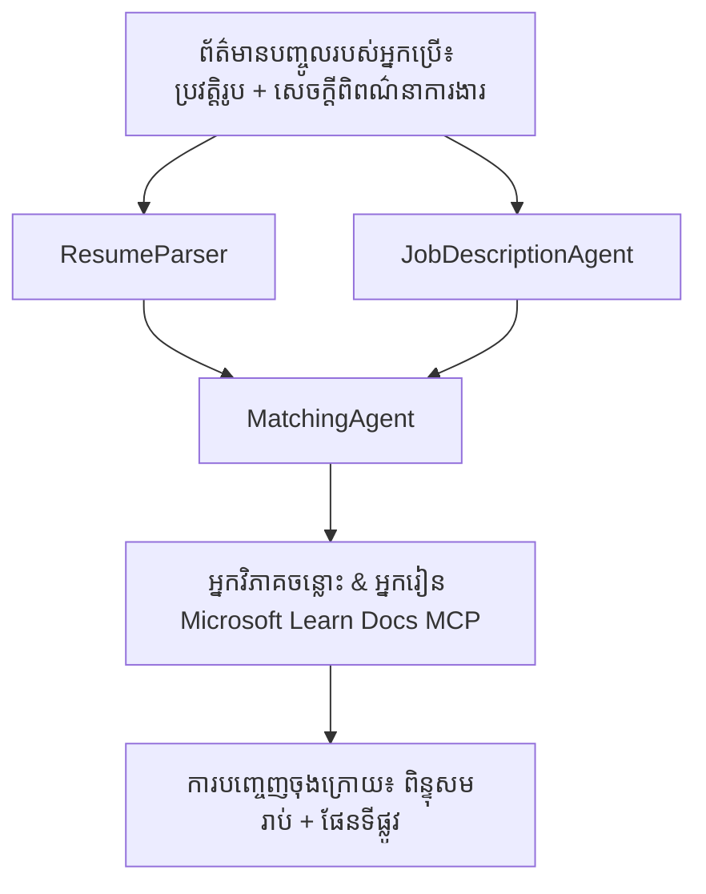

# PersonalCareerCopilot - Resume → Job Fit Evaluator

កម្មវិធីធ្វើការងារជាអ្នកដំណើរការជាច្រើន ដែលវាយតម្លៃពីភាពសមរម្យរបស់ប្រវត្តិរូបជាមួយការពិពណ៌នាការងារ ហើយបង្កើតផែនទីរៀនផ្ទាល់ខ្លួនដើម្បីបិទចន្លោះនេះ។

---

## Agents

| Agent | តួនាទី | ឧបករណ៍ |
|-------|---------|---------|
| **ResumeParser** | ដកសមត្ថភាព សមិទ្ធផល វប្បធម៌ការសិក្សាពីអត្ថបទប្រវត្តិរូប | - |
| **JobDescriptionAgent** | ដកសមត្ថភាព សមិទ្ធផល វប្បធម៌ការសិក្សាដែលត្រូវការឬពេញចិត្តពីការពិពណ៌នាការងារ | - |
| **MatchingAgent** | ប្រៀបធៀបប្រវត្តិរូបជាមួយតម្រូវការនៅក្នុងការងារ → ពិន្ទុភាពសមរម្យ (0-100) + ជំនាញដែលត្រូវ/ខ្វះ | - |
| **GapAnalyzer** | បង្កើតផែនទីរៀនផ្ទាល់ខ្លួនជាមួយធនធាន Microsoft Learn | `search_microsoft_learn_for_plan` (MCP) |

## Workflow


---

## ចាប់ផ្តើមយ៉ាងរហ័ស

### 1. រៀបចំបរិយាកាស

```powershell
cd workshop\lab02-multi-agent\PersonalCareerCopilot
python -m venv .venv
.\.venv\Scripts\Activate.ps1          # PowerShell របស់ Windows
# source .venv/bin/activate            # macOS / Linux
pip install -r requirements.txt
```

### 2. កំណត់ប្រអប់សម្ងាត់

ចម្លងឯកសារ env ឧទាហរណ៍ ហើយបញ្ជូលព័ត៌មានលម្អិតគម្រោង Foundry របស់អ្នក៖

```powershell
cp .env.example .env
```

កែ `.env`:

```env
PROJECT_ENDPOINT=https://<your-account>.services.ai.azure.com/api/projects/<your-project>
MODEL_DEPLOYMENT_NAME=gpt-4.1-mini
```

| តម្លៃ | កន្លែងស្វែងរក |
|-------|-----------------|
| `PROJECT_ENDPOINT` | បន្ទាត់ផ្លូវ Microsoft Foundry នៅក្បែរចុង VS Code → ចុចស្តាំលើគម្រោងរបស់អ្នក → **Copy Project Endpoint** |
| `MODEL_DEPLOYMENT_NAME` | ផ្លូវ Foundry → បង្កើតគម្រោង → **Models + endpoints** → ឈ្មោះបញ្ចេញម៉ូដែល |

### 3. ដំណើរការជាជម្រើសនៅក្នុងកុំព្យូទ័រ

```powershell
python -m debugpy --listen 127.0.0.1:5679 -m agentdev run main.py --verbose --port 8088
```

ឬប្រើបិទបញ្ជាការចូល VS Code: `Ctrl+Shift+P` → **Tasks: Run Task** → **Run Lab02 HTTP Server**។

### 4. សាកល្បងជាមួយ Agent Inspector

 Open Agent Inspector: `Ctrl+Shift+P` → **Foundry Toolkit: Open Agent Inspector**។

វាយបញ្ចូលសំណួរពិសោធនេះ៖

```
Resume:
Jane Doe
Senior Software Engineer with 5 years of experience in Python, Django, and AWS.
Built microservices handling 10K+ requests/second. Led a team of 4 developers.
Certifications: AWS Solutions Architect Associate.
Education: B.S. Computer Science, State University.

Job Description:
Senior Cloud Engineer at Contoso Ltd.
Required: Python, Azure, Kubernetes, Terraform, CI/CD pipelines.
Preferred: Go, monitoring (Prometheus/Grafana), cost optimization.
Experience: 5+ years in cloud infrastructure.
Certifications: Azure Solutions Architect Expert preferred.
```

**រំពឹងទុក:** ពិន្ទុភាពសមរម្យ (0-100), ជំនាញដែលត្រូវ/ខ្វះ និងផែនទីរៀនផ្ទាល់ខ្លួនជាមួយតំណ Microsoft Learn។

### 5. ដាក់បញ្ចូលទៅ Foundry

`Ctrl+Shift+P` → **Microsoft Foundry: Deploy Hosted Agent** → ជ្រើសគម្រោងរបស់អ្នក → បញ្ជាក់។

---

## រចនាសម្ព័ន្ធគម្រោង

```
PersonalCareerCopilot/
├── .env.example        ← Template for environment variables
├── .env                ← Your credentials (git-ignored)
├── agent.yaml          ← Hosted agent definition (name, resources, env vars)
├── Dockerfile          ← Container image for Foundry deployment
├── main.py             ← 4-agent workflow (instructions, MCP tool, WorkflowBuilder)
└── requirements.txt    ← Python dependencies
```

## ឯកសារសំខាន់ៗ

### `agent.yaml`

កំណត់អ្នកតំណាងដែលមានសេវាសម្រាប់ Foundry Agent Service៖
- `kind: hosted` - រត់ជាតិខម្រើរ(container) ដែលគ្រប់គ្រង
- `protocols: [responses v1]` - បង្ហាញចំណុចចេញ HTTP `/responses`
- `environment_variables` - `PROJECT_ENDPOINT` និង `MODEL_DEPLOYMENT_NAME` ចាក់បញ្ចូលពេលដាក់បញ្ចូល

### `main.py`

មាន៖
- **ការណែនាំអ្នកតំណាង** - ប្រាំបួនអថេរ `*_INSTRUCTIONS`, មួយសម្រាប់អ្នកតំណាងរៀងៗខ្លួន
- **ឧបករណ៍ MCP** - `search_microsoft_learn_for_plan()` ហៅទៅ `https://learn.microsoft.com/api/mcp` តាម Streamable HTTP
- **បង្កើតអ្នកតំណាង** - `create_agents()` ជាលំនាំប្រើ `AzureAIAgentClient.as_agent()`
- **ក្រាលដំណើរការ** - `create_workflow()` ប្រើ `WorkflowBuilder` ដើម្បីភ្ជាប់អ្នកតំណាងជាមួយលំនាំបង្ហោះ/បញ្ចូល/ជាដំណាក់កាល
- **ចាប់ផ្តើមម៉ាស៊ីនបម្រើ** - `from_agent_framework(agent).run_async()` ត្រង់រន្ធ 8088

### `requirements.txt`

| កញ្ចប់ | កំណែ | គោលបំណង |
|---------|--------|----------|
| `agent-framework-azure-ai` | `1.0.0rc3` | ការរួមបញ្ចូល Azure AI សម្រាប់ Microsoft Agent Framework |
| `agent-framework-core` | `1.0.0rc3` | និយមន័យអាស្រ័យ(runtime) ស្នូល (រួមបញ្ចូល WorkflowBuilder) |
| `azure-ai-agentserver-agentframework` | `1.0.0b16` | មជ្ឈមណ្ឌលម៉ាស៊ីនបម្រើអ្នកតំណាងដំណើរការ |
| `azure-ai-agentserver-core` | `1.0.0b16` | មូលដ្ឋាននៃម៉ាស៊ីនបម្រើអ្នកតំណាង |
| `debugpy` | ថ្មីបំផុត | ការត្រួតពិនិត្យកំហುប់ Python (F5 នៅ VS Code) |
| `agent-dev-cli` | `--pre` | CLI ប្រើក្នុងមជ្ឈមណ្ឌល + ផ្នែកខាងក្រោយ Agent Inspector |

---

## ដោះស្រាយបញ្ហា

| បញ្ហា | ដោះស្រាយ |
|--------|----------|
| `RuntimeError: Missing required environment variable(s)` | បង្កើត `.env` ជាមួយ `PROJECT_ENDPOINT` និង `MODEL_DEPLOYMENT_NAME` |
| `ModuleNotFoundError: No module named 'agent_framework'` | បើក venv ហើយដំណើរការ `pip install -r requirements.txt` |
| មិនមានតំណ Microsoft Learn នៅលទ្ធផល | ពិនិត្យការតភ្ជាប់អ៊ីនធឺណិតទៅ `https://learn.microsoft.com/api/mcp` |
| មានគ្រាប់បង្ហាញចន្លោះតែ១ (ខ្លី) | ពិនិត្យ `GAP_ANALYZER_INSTRUCTIONS` មានផ្នែក `CRITICAL:` |
| រន្ធ 8088 ត្រូវបានប្រើ | បិទម៉ាស៊ីនបម្រើផ្សេងទៀត៖ `netstat -ano \| findstr :8088` |

សម្រាប់ការដោះស្រាយលម្អិត សូមមើល [Module 8 - Troubleshooting](../docs/08-troubleshooting.md)។

---

**ជំហានពេញលេញ៖** [Lab 02 Docs](../docs/README.md) · **ត្រឡប់ទៅ៖** [Lab 02 README](../README.md) · [ផ្ទះសាលា Workshop](../../../README.md)

---

<!-- CO-OP TRANSLATOR DISCLAIMER START -->
**ការកំណត់ការទទួលខុសត្រូវ**:  
ឯកសារនេះបានបកប្រែដោយប្រើសេវាកម្មបកប្រែ AI [Co-op Translator](https://github.com/Azure/co-op-translator)។ ខណៈពេលដែលយើងខំប្រឹងប្រែងរកកម្រិតភាពត្រឺមត្រូវ កុំភ្លេចថាការបកប្រែដោយគន្លងកុំព្យូទ័រស្វ័យប្រវត្តិអាចមានកំហុស ឬភាពមិនត្រឹមត្រូវខ្លះៗ។ ឯកសារដើមក្នុងភាសាដើមគួរត្រូវបានគេយកទៅជាមូលដ្ឋានផ្លូវការនៃព័ត៌មាន។ សម្រាប់ព័ត៌មានសំខាន់ៗ ការបកប្រែមនុស្សវិជ្ជាជីវៈត្រូវបានផ្តល់អនុសាសន៍។ យើងមិនទទួលខុសត្រូវចំពោះការយល់ច្រឡំ ឬការបកស្រាយខុសៗរបស់អ្នកដែលកើតចេញពីការប្រើប្រាស់ការបកប្រែនេះទេ។
<!-- CO-OP TRANSLATOR DISCLAIMER END -->