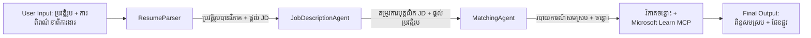

# PersonalCareerCopilot - ជាម៉ាស៊ីនវាយតម្លៃភាពសមរម្យរវាងប្រវត្តិរូប និងការងារ

កម្មវិធីប្រតិបត្តិការម៉ូលទីភ្នាក់ងារមួយដែលផ្តោតលើលំហរ វាយតម្លៃថាប្រវត្តិរូបសមរម្យយ៉ាងដូចម្តេចជាមួយនឹងការពិពណ៌នាការងារ បន្ទាប់មកបង្កើតផែនការសិក្សាផ្ទាល់ខ្លួនដើម្បីបិទចន្លោះទាំងនោះ។

---

## អ្នកភ្នាក់ងារ

| អ្នកភ្នាក់ងារ | តំណែង | ឧបករណ៍ |
|-------|------|-------|
| **ResumeParser** | ដកសមត្ថភាព មានបទពិសោធន៍ និងវិញ្ញាបនបត្រដែលមានរចនាសម្ព័ន្ធពីអត្ថបទប្រវត្តិរូប | - |
| **JobDescriptionAgent** | ដកសមត្ថភាព តម្រូវការ/ចំណង់ចំណូលចិត្ត បទពិសោធន៍ និងវិញ្ញាបនបត្រពីការពិពណ៌នាការងារ | - |
| **MatchingAgent** | ប្រៀបធៀបប្រវត្តិរូបទៅនឹងតម្រូវការ → ពិន្ទុភាពសមរម្យ (0-100) + ជំនាញដែលសមរម្យ/បាត់បង់ | - |
| **GapAnalyzer** | បង្កើតផែនការសិក្សាផ្ទាល់ខ្លួនជាមួយធនធាន Microsoft Learn | `search_microsoft_learn_for_plan` (MCP) |

## លំហរ


```mermaid
flowchart LR
    UserInput["User Input: ប្រវត្តិរូប + ការពិពណ៌នាពីការងារ"] --> ResumeParser
    ResumeParser -- "ប្រវត្តិរូបបានវិភាគ + ផ្ដល់ JD" --> JobDescriptionAgent
    JobDescriptionAgent -- "តម្រូវការបុគ្គលិក JD + ផ្ដល់ប្រវត្តិរូប" --> MatchingAgent
    MatchingAgent -- "របាយការណ៍សមស្រប + ចន្លោះ" --> GapAnalyzerMCP["វិភាគចន្លោះ +\nMicrosoft Learn MCP"]
    GapAnalyzerMCP --> FinalOutput["Final Output:\nពិន្ទុសមស្រប + ផែនផ្លូវ"]
```

---

## ចាប់ផ្តើមយ៉ាងរហ័ស

### 1. កំណត់បរិយាកាស

មេរៀននេះគឺជាកំណត់ហេតុយោងសម្រាប់ឆានែលលំហរក្នុង Lab 02។ `main.py` របស់វា ប្រើប្លុកបង្ហាញដែលមានរួចហើយ ព្រមទាំង `WorkflowBuilder` ដើម្បីភ្ជាប់អ្នកភ្នាក់ងារបួននាក់ជាមួយគ្នា។

```powershell
cd workshop\lab02-multi-agent\PersonalCareerCopilot
python -m venv .venv
.\.venv\Scripts\Activate.ps1          # Windows PowerShell
# ប្រភព .venv/bin/activate            # macOS / Linux
pip install -r requirements.txt
```

### 2. កំណត់សញ្ញាប័ត្រ

បង្កើតឯកសារ `.env` នៅក្នុងថតនេះ៖

```powershell
copy .env .env.bak 2>$null; echo $null > .env
```

កែប្រែ `.env`៖

```env
FOUNDRY_PROJECT_ENDPOINT=https://<your-account>.services.ai.azure.com/api/projects/<your-project>
AZURE_AI_MODEL_DEPLOYMENT_NAME=gpt-4.1-mini
```

| តម្លៃ | រស់នៅណា |
|-------|------------------|
| `FOUNDRY_PROJECT_ENDPOINT` | ផ្នែករង Foundry Toolkit → ចុចស្ដាំលើគម្រោងរបស់អ្នក → **ចម្លងចំនុចផ្លូវគម្រោង** |
| `AZURE_AI_MODEL_DEPLOYMENT_NAME` | ផ្នែករង Foundry → ពង្រីកគម្រោង → **ម៉ូឌែល + ចំណុចចេញផ្សាយ** → ឈ្មោះការចេញផ្សាយ |

### 3. រត់នៅក្នុងម៉ាស៊ីនខ្លួនឯង

```powershell
python -m debugpy --listen 127.0.0.1:5679 main.py --port 8088
```

ឬប្រើការងារនៅក្នុង VS Code៖ `Ctrl+Shift+P` → **ការងារ៖ រត់ការងារ** → **រត់ម៉ាស៊ីនបម្រើ Agent HTTP**។

សម្រាប់ការត្រួតពិនិត្យ F5 ប្រើ **ត្រួតពិនិត្យម៉ាស៊ីនបម្រើ Agent HTTP ក្នុងស្រុក**។

### 4. សាកល្បងជាមួយ Agent Inspector

បើក Agent Inspector៖ `Ctrl+Shift+P` → **Foundry Toolkit: បើក Agent Inspector**។

ដាក់ពាក្យបញ្ជាសាកល្បងនេះ៖

```
Resume:
Jane Doe
Senior Software Engineer with 5 years of experience in Python, Django, and AWS.
Built microservices handling 10K+ requests/second. Led a team of 4 developers.
Certifications: AWS Solutions Architect Associate.
Education: B.S. Computer Science, State University.

Job Description:
Senior Cloud Engineer at Contoso Ltd.
Required: Python, Azure, Kubernetes, Terraform, CI/CD pipelines.
Preferred: Go, monitoring (Prometheus/Grafana), cost optimization.
Experience: 5+ years in cloud infrastructure.
Certifications: Azure Solutions Architect Expert preferred.
```

**អ្វីដែលរំពឹងទុក៖** ពិន្ទុភាពសមរម្យ (0-100), ជំនាញដែលសមរម្យ/បាត់បង់ និងផែនការសិក្សាផ្ទាល់ខ្លួនជាមួយ URL Microsoft Learn។

### 5. បង្ហាញទៅ Foundry

`Ctrl+Shift+P` → **Foundry Toolkit: ដាក់អតិថិជន Hosted Agent** → ជ្រើសគម្រោងរបស់អ្នក → បញ្ជាក់។

---

## រចនាសម្ព័ន្ធគម្រោង

```
PersonalCareerCopilot/
├── .env                ← Your credentials (git-ignored)
├── agent.yaml          ← Hosted agent definition (name, resources, env vars)
├── Dockerfile          ← Container image for Foundry deployment
├── main.py             ← 4-agent workflow (instructions, MCP tool, WorkflowBuilder)
└── requirements.txt    ← Python dependencies
```

## ឯកសារសំខាន់ៗ

### `agent.yaml`

កំណត់អ្នកភ្នាក់ងារដែលផ្អែកលើការបម្រើ Foundry Agent Service ៖
- `kind: hosted` - រត់ជាគន់តែមានការគ្រប់គ្រង container តែមួយ
- `protocols` - ពហុក្របខណ្ឌ `responses` ជាមួយ `version: 1.0.0`, បង្ហាញអាសយដ្ឋាន HTTP `/responses`
- `environment_variables` - កំណត់ `AZURE_AI_MODEL_DEPLOYMENT_NAME` នៅទីនេះ; `FOUNDRY_PROJECT_ENDPOINT` ត្រូវបានបញ្ចូលដោយស្វ័យប្រវត្តិពេលដាក់ចេញ

### `main.py`

មាន៖
- **ការណែនាំអ្នកភ្នាក់ងារ** - តម្រង `*_INSTRUCTIONS` បួនគ្រាប់ សម្រាប់អ្នកភ្នាក់ងារ១នាក់
- **ឧបករណ៍ MCP** - `search_microsoft_learn_for_plan()` ហៅ `https://learn.microsoft.com/api/mcp` តាម Streamable HTTP
- **ការបង្កើតអ្នកភ្នាក់ងារ** - បួន `Agent()` + `AgentExecutor()` ដែលចែករំលែក `FoundryChatClient` មួយ
- **ក្រាផគន្លងលំហរ** - `WorkflowBuilder` ភ្ជាប់អ្នកភ្នាក់ងារជាក្រុមខ្សែបន្ទាត់៖ ResumeParser → JD Agent → MatchingAgent → GapAnalyzer
- **ការចាប់ផ្តើមម៉ាស៊ីនបម្រើ** - `ResponsesHostServer` បើកផ្នែក 8088

### `requirements.txt`

| កញ្ចប់ | គោលបំណង |
|---------|----------|
| `agent-framework-foundry` | កម្រិតម៉ាស៊ីនប្រតិបត្តិការ៖ `Agent`, `AgentExecutor`, `WorkflowBuilder`, `@tool`, `FoundryChatClient` |
| `agent-framework-foundry-hosting` | `ResponsesHostServer` + ការតភ្ជាប់ Foundry hosting |
| `mcp<2,>=1.24.0` | អតិថិជន MCP សម្រាប់ GapAnalyzer (`streamable_http_client`) |
| `debugpy` | ការត្រួតពិនិត្យកូដ Python (F5 នៅក្នុង VS Code) |

---

## ការដោះស្រាយបញ្ហា

| បញ្ហា | សម្រួលបញ្ហា |
|-------|-----|
| `KeyError: 'FOUNDRY_PROJECT_ENDPOINT'` ឬ `KeyError: 'AZURE_AI_MODEL_DEPLOYMENT_NAME'` | បង្កើត `.env` ដែលមាន `FOUNDRY_PROJECT_ENDPOINT` និង `AZURE_AI_MODEL_DEPLOYMENT_NAME` ទាំងពីរ |
| `ModuleNotFoundError: No module named 'agent_framework'` | បើក venv ហើយរត់ `pip install -r requirements.txt` |
| មិនមាន URL Microsoft Learn នៅក្នុងលទ្ធផល | ពិនិត្យការតភ្ជាប់អ៊ីនធឺណិតទៅ `https://learn.microsoft.com/api/mcp` |
| មានកាតចន្លោះតែមួយ (បាត់បង់) | ប្រាកដថា `GAP_ANALYZER_INSTRUCTIONS` រួមបញ្ចូលប្លុក `CRITICAL:` |
| ផ្នែក 8088 កំពុងប្រើ | បិទម៉ាស៊ីនបម្រើផ្សេងៗ៖ `netstat -ano \| findstr :8088` |

សម្រាប់ការដោះស្រាយបញ្ហាជាក់លាក់ មើល [Module 8 - Troubleshooting](../docs/08-troubleshooting.md)។

---

**ដំណើរការពេញលេញ៖** [Lab 02 Docs](../docs/README.md) · **ត្រឡប់ទៅ៖** [Lab 02 README](../README.md) · [ទំព័រដើមសិក្សា](../../../README.md)

---

<!-- CO-OP TRANSLATOR DISCLAIMER START -->
**ការបដិសេធ**:
ឯកសារនេះត្រូវបានបម្លែងភាសា ដោយប្រើសេវាបម្លែងភាសា AI [Co-op Translator](https://github.com/Azure/co-op-translator)។ ទោះយើងខ្ញុំមានក្តីប្រាថ្នាឱ្យបានច្បាស់លាស់ តែសូមយល់ដឹងថាការបម្លែងដោយស្វ័យប្រវត្តិក៏អាចមានកំហុសឬភាពមិនត្រឹមត្រូវ។ ឯកសារដើមជាភាសាទីតាំងគួរត្រូវបានគេប្រើជាប្រភពច្បាស់លាស់។ សម្រាប់ព័ត៌មានសំខាន់ៗ សូមណែនាំឱ្យប្រើប្រាស់ការប្រែដោយមនុស្សជំនាញ។ យើងខ្ញុំមិនទទួលខុសត្រូវចំពោះការយល់ច្រឡំ ឬការបកស្រាយខុសបន្ទាប់ពីការប្រើប្រាស់ការបម្លែងនេះនោះទេ។
<!-- CO-OP TRANSLATOR DISCLAIMER END -->