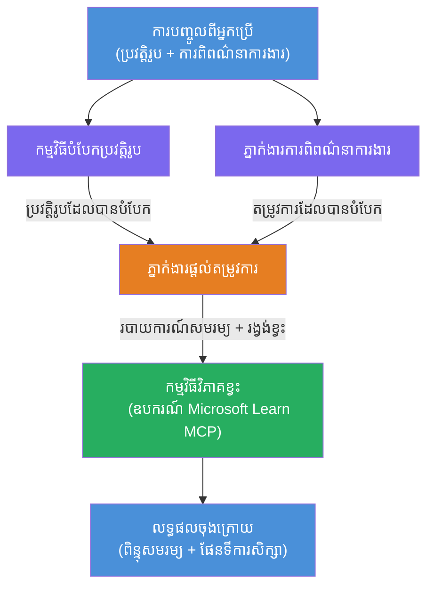

# កំណាត់ 02 - ការងារជាច្រើនភាគី៖ អ្នកវាយតម្លៃ Resume → សមត្ថភាពការងារ

---

## អ្វីដែលអ្នកនឹងសាងសង់

**អ្នកវាយតម្លៃ Resume → សមត្ថភាពការងារ** - ការងារជាច្រើនភាគីដែលភ្នាក់ងារពិសេសបួនរួមការសហការដើម្បីវាយតម្លៃពីរបៀបដែលប្រវត្តិរូបនៃបេក្ខជនសមស្របទៅនឹងការពិពណ៌នាការងារ រួចបង្កើតផែនទីការសិក្សាផ្ទាល់ខ្លួនដើម្បីបំពេញចន្លោះ។

### ភ្នាក់ងារ

| ភ្នាក់ងារ | តួនាទី |
|-------|------|
| **អ្នកវិភាគប្រវត្តិរូប** | ដកយកជំនាញដែលមានរចនាសម្ព័ន្ធ, បទពិសោធន៍, សញ្ញាបត្រពីអត្ថបទប្រវត្តិរូប |
| **ភ្នាក់ងារពិពណ៌នាការងារ** | ដកយកជំនាញទាមទារ/ចូលចិត្ត, បទពិសោធន៍, សញ្ញាបត្រពីការពិពណ៌នាការងារ |
| **ភ្នាក់ងារប្រៀបធៀប** | ប្រៀបធៀបប្រវត្តិរូបនឹងតម្រូវការ → ពិន្ទុសមរម្យ (0-100) + ជំនាញដែលគូរចង/អវត្តមាន |
| **អ្នកវិភាគចន្លោះ** | បង្កើតផែនទីការសិក្សាផ្ទាល់ខ្លួនជាមួយប្រភពរៀន, រយៈពេល, និងគំរោងឈ្នះរហ័ស |

### ស្ទ្រីមរាំបង្ហាញ

អាប់ឡូដ **ប្រវត្តិរូប + ការពិពណ៌នាការងារ** → ទទួលបាន **ពិន្ទុសមរម្យ + ជំនាញខ្វះ** → ទទួលបាន **ផែនទីការសិក្សាផ្ទាល់ខ្លួន**។

### ស្ថាបត្យកម្មការងារ

> ពណ៌មេពេ = ភ្នាក់ងារដំណាក់កាលជាស្របពេល | ពណ៌ទឹកក្រូច = ចំណុចបូកសរុប | ពណ៌បៃតង = ភ្នាក់ងារចុងក្រោយមានឧបករណ៍។ មើល [Module 1 - យល់ដឹងអំពីស្ថាបត្យកម្ម](docs/01-understand-multi-agent.md) និង [Module 4 - លំនាំការគ្រប់គ្រង](docs/04-orchestration-patterns.md) សម្រាប់រាងរូបភេទលម្អិតនិងចរន្តទិន្នន័យ។

### ប្រធានបទគ្របដណ្តប់

- បង្កើតការ Workflow ជាច្រើនភាគីដោយប្រើ **WorkflowBuilder**
- កំណត់តួនាទីភ្នាក់ងារ និងលំនាំការគ្រប់គ្រង (បញ្ចាក់ជាស្របពេល + ជាជួរ)
- លំនាំទំនាក់ទំនងរវាងភ្នាក់ងារ
- សាកល្បងក្រៅបណ្ដាញជាមួយ Agent Inspector
- ចាក់តាំង Workflow ជាច្រើនភាគីទៅ Foundry Agent Service

---

## លក្ខខណ្ឌជាមុន

បញ្ចប់កំណាត់ 01 មុន៖

- [កំណាត់ 01 - ភ្នាក់ងារតែ១](../lab01-single-agent/README.md)

---

## ចាប់ផ្តើម

មើលសេចក្ដីណែនាំការតំឡើងពេញលេញ, ការឆ្លងកាត់កូដ, និងពាក្យបញ្ជាសាកល្បងក្នុង៖

- [ឯកសារកំណាត់ 2 - លក្ខខណ្ឌជាមុន](docs/00-prerequisites.md)
- [ឯកសារកំណាត់ 2 - ផ្លូវការសិក្សាពេញលេញ](docs/README.md)
- [ការណែនាំរត់ PersonalCareerCopilot](PersonalCareerCopilot/README.md)

## លំនាំការគ្រប់គ្រង (ជម្រើសភ្នាក់ងារ)

កំណាត់ 2 រួមបញ្ចូលលំនាំលំនង **បញ្ចាក់ជាស្របពេល → អ្នកបូកសរុប → អ្នកគ្រោងផែនការ** ជាដើម ហើយឯកសារបានពិពណ៌នាលំនាំជំនួសដើម្បីបង្ហាញនូវហើបហាន់ភ្នាក់ងារដែលខ្លាំងជាង៖

- **Fan-out/Fan-in ជាមួយការយល់ព្រមភាគទាន**
- **ការត្រួតពិនិត្យ/អ្នកពិនិត្យមុនផែនទីចុងក្រោយ**
- **អ្នកបញ្ជូនលក្ខណៈពិសេស** (ជ្រើសរើសផ្លូវដោយផ្អែកលើពិន្ទុសមរម្យ និងជំនាញខ្វះ)

មើល [docs/04-orchestration-patterns.md](docs/04-orchestration-patterns.md)។

---

**មុននេះ៖** [កំណាត់ 01 - ភ្នាក់ងារតែ១](../lab01-single-agent/README.md) · **ត្រឡប់ក្រោយទៅ៖** [ទំព័រផ្លូវការគ្រុមហ៊ុន](../../README.md)

---

<!-- CO-OP TRANSLATOR DISCLAIMER START -->
**ការបដិសេធ**៖  
ឯកសារនេះត្រូវបានបកប្រែដោយប្រើសេវាកម្មបកប្រែ AI [Co-op Translator](https://github.com/Azure/co-op-translator)។ នៅពេលយើងខំប្រឹងប្រែងសម្រាប់ភាពត្រឹមត្រូវ សូមយកចិត្តទុកដាក់ថាខណៈពេលបកប្រែដោយស្វ័យប្រវត្តិនេះអាចមានកំហុស ឬភាពមិនត្រឹមត្រូវ។ ឯកសារដើមក្នុងភាសាដើមគួរត្រូវបានទុកចិត្តជាអ្នកផ្គត់ផ្គង់ព័ត៌មានចម្បង។ សម្រាប់ព័ត៌មានសំខាន់ៗ សូមជ្រើសរើសការបកប្រែដោយអ្នកជំនាញមនុស្ស។ យើងមិនទទួលខុសត្រូវចំពោះការយល់ច្រឡំ ឬការបកប្រែខុសព្រោះការប្រើប្រាស់បកប្រែនេះឡើយ។
<!-- CO-OP TRANSLATOR DISCLAIMER END -->