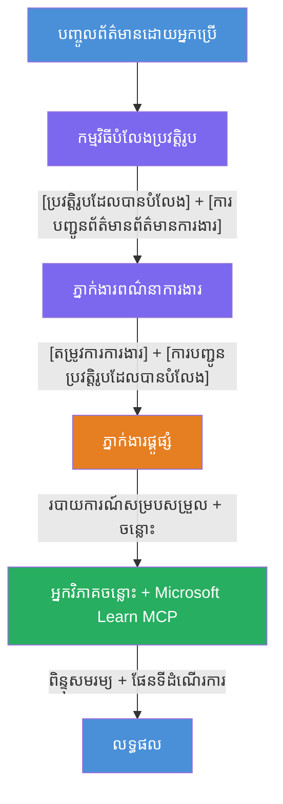

# ក្រុមហ៊ុន 02 - កម្មវីធីចំរូងភាគីច្រើន: ការវាយតម្លៃតម្រូវការងារ → ប្រវត្តិរូប

## ទិដ្ឋភាពទូទៅ

ក្នុងការប្រជុំដៃនេះ អ្នកនឹងបង្កើតកម្មវិធី **ភាគីច្រើនមួយដែលផ្អែកលើវេហាសាស្រ្ត** ដោយប្រើ Foundry Toolkit នៅក្នុង VS Code ហើយបញ្ចេញវាទៅសេវាកម្ម Microsoft Foundry Agent។

**អ្វីដែលអ្នកនឹងបង្កើត:** កម្មវិធីវាយតម្លៃ Resume → Job Fit ដែលបកស្រាយប្រវត្តិរូប និងការពិពណ៌នាការងារ កំណត់ពិន្ទុការចងក្រង ហើយបង្កើតផែនការសិក្សាផ្ទាល់ខ្លួនប្រើធនធាន Microsoft Learn។

---

## សំណុំរចនាសម្ព័ន្ធ

```mermaid
flowchart TD
    A["បញ្ចូលព័ត៌មានដោយអ្នកប្រើ"] --> B["កម្មវិធីបំលែងប្រវត្តិរូប"]
    B -->|"[ប្រវត្តិរូបដែលបានបំលែង] + [ការបញ្ជូនព័ត៌មានព័ត៌មានការងារ]"| C["ភ្នាក់ងារពណ៌នាការងារ"]
    C -->|"[តម្រូវការការងារ] + [ការបញ្ជូនប្រវត្តិរូបដែលបានបំលែង]"| D["ភ្នាក់ងារផ្គូផ្សំ"]
    D -->|របាយការណ៍សម្របសម្រួល + ចន្លោះ| E["អ្នកវិភាគចន្លោះ + Microsoft Learn MCP"]
    E -->|ពិន្ទុសមរម្យ + ផែនទីដំណើរការ| F["លទ្ធផល"]

    style A fill:#4A90D9,color:#fff
    style B fill:#7B68EE,color:#fff
    style C fill:#7B68EE,color:#fff
    style D fill:#E67E22,color:#fff
    style E fill:#27AE60,color:#fff
    style F fill:#4A90D9,color:#fff
```

**វិធីសាស្រ្តפעל:**
1. អ្នកប្រើប្រាស់បិទបញ្ចូលប្រវត្តិរូប និងការពិពណ៌នាការងារ។
2. **ResumeParser** បកស្រាយប្រវត្តិរូប ហើយចម្លងការពិពណ៌នាការងារឱ្យដូចដើមក្នុងផ្នែក `[JOB DESCRIPTION PASS-THROUGH]`។
3. **JD Agent** បានដកស្រង់ការទាមទារត្រូវបានរៀបចំពីការបញ្ចូលនេះ បន្ទាប់មកបញ្ជូន `[PARSED RESUME]` ជា `[PARSED RESUME PASS-THROUGH]` ទៅមុខ។
4. **MatchingAgent** ប្រៀបធៀប `[PARSED RESUME PASS-THROUGH]` ជាមួយ `[JD REQUIREMENTS]` ហើយបង្កើតពិន្ទុតម្រូវការ។
5. **GapAnalyzer** បម្លែងចន្លោះកន្លែងទៅជា​ផែនការអនុវត្តន៍ ហើយទាញយកតំណ Microsoft Learn ពិតពី MCP។

---

## លក្ខខណ្ឌជាមុន

សូមបញ្ចប់ក្រុមហ៊ុន 01 មុន៖

- [Lab 01 - Single Agent](../lab01-single-agent/README.md)

---

## ផ្នែក 1: អានម៉ូឌុលតាមលំដាប់

មើលផ្លូវសិក្សាពេញលេញនៅ៖

- [Lab 2 Docs - Prerequisites](docs/00-prerequisites.md)
- [Lab 2 Docs - Full Learning Path](docs/README.md)
- [PersonalCareerCopilot run guide](PersonalCareerCopilot/README.md)

---

## ផ្នែក 2: កសាង និងតេស្តកម្មវីធី

1. ប្រើកម្មវិធីស្វ័យប្រវត្តិ Foundry Toolkit ដើម្បីបង្កើតគំរោងផ្អែកលើកម្មវិធី។
2. ចម្លងប្លុកបញ្ចូល និងសៀវភៅកម្មវិធីពី `PersonalCareerCopilot/main.py` ទៅកន្លែងធ្វើការ​របស់អ្នក។
3. រត់ឥតគិតថ្លៃជាមួយ Agent Inspector ហើយផ្ទៀងផ្ទាត់ភាគីទាំងបួន និងឧបករណ៍ MCP។
4. ផ្ទុកភាគីបញ្ចាប់ទៅ Foundry ពេលតេស្តក្នុងផ្ទះបានជោគជ័យ។

---

## ទម្រង់ការរៀបចំ

ក្រុមហ៊ុន 02 រួមបញ្ចូលផ្លូវដើម **ចេញရន្លែង → ចូលកន្លែង → ជាដំណើរមួយជំហាន** ហើយឯកសារបង្ហាញពីទម្រង់ការរៀបចំជំនួសសម្រាប់ការប្រឡងចំណេះ។

- **ផ្សារចេញ/ចូលជាមួយការយល់ព្រមមានទំងន់**
- **អ្នកអាន/អ្នកវិភាគផ្លាស់ជាសមាជិកមុនផែនការចុងក្រោយ**
- **អ្នកផ្លាស់ប្ដូរផ្លូវផ្អែកលើពិន្ទុតម្រូវ និងជំនាញខ្វះ**

វាយតម្លៃ [docs/04-orchestration-patterns.md](docs/04-orchestration-patterns.md)។

---

**មុន៖** [Lab 01 - Single Agent](../lab01-single-agent/README.md) · **ត្រឡប់ទៅ៖** [Workshop Home](../../README.md)

---

<!-- CO-OP TRANSLATOR DISCLAIMER START -->
**ការបដិសេធ**:
ឯកសារនេះត្រូវបានបម្លែងភាសា ដោយប្រើសេវាបម្លែងភាសា AI [Co-op Translator](https://github.com/Azure/co-op-translator)។ ទោះយើងខ្ញុំមានក្តីប្រាថ្នាឱ្យបានច្បាស់លាស់ តែសូមយល់ដឹងថាការបម្លែងដោយស្វ័យប្រវត្តិក៏អាចមានកំហុសឬភាពមិនត្រឹមត្រូវ។ ឯកសារដើមជាភាសាទីតាំងគួរត្រូវបានគេប្រើជាប្រភពច្បាស់លាស់។ សម្រាប់ព័ត៌មានសំខាន់ៗ សូមណែនាំឱ្យប្រើប្រាស់ការប្រែដោយមនុស្សជំនាញ។ យើងខ្ញុំមិនទទួលខុសត្រូវចំពោះការយល់ច្រឡំ ឬការបកស្រាយខុសបន្ទាប់ពីការប្រើប្រាស់ការបម្លែងនេះនោះទេ។
<!-- CO-OP TRANSLATOR DISCLAIMER END -->