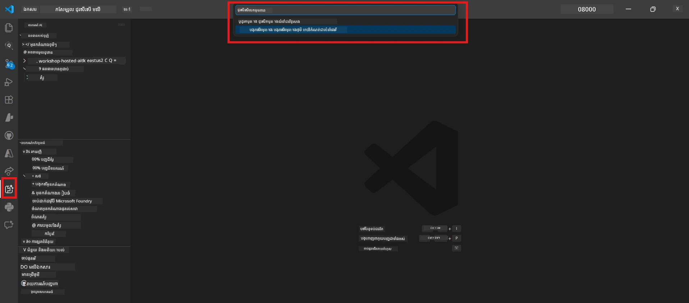

# Module 0 - លក្ខខ័ណ្ឌមុនសិក្សា

មុនចាប់ផ្តើម Lab 02 សូមបញ្ជាក់ថាអ្នកបានបញ្ចប់រួចរាល់។ លាបនេះសាងសង់ផ្ទាល់លើ Lab 01 - សូមកុំរំលងវា។

---

## 1. បញ្ចប់ Lab 01

Lab 02 សន្មត់ថាអ្នកបានរួចរាល់:

- [x] បញ្ចប់មូឌុលទាំង 8 របស់ [Lab 01 - Single Agent](../../lab01-single-agent/README.md)
- [x] បានដាក់បញ្ចូលភ្នាក់ងារតែមួយទៅសេវាកម្ម Foundry Agent ដោយជោគជ័យ
- [x] បានធានាថាភ្នាក់ងារកំពុងដំណើរការជាទៀងទាត់នៅកន្លែង Agent Inspector ដ៏ក្នុងទូន្មាន និង Foundry Playground

បើអ្នកមិនទាន់បញ្ចប់ Lab 01 សូមត្រឡប់ចូលទៅបញ្ចប់វាឥលូវ៖ [Lab 01 Docs](../../lab01-single-agent/docs/00-prerequisites.md)

---

## 2. ពិនិត្យការដំឡើងដែលមានរួច

ឧបករណ៍ទាំងអស់ពី Lab 01 ត្រូវតែក៏បានដំឡើងនិងដំណើរការនៅតែទៀងទាត់។ អូសមើលត្រួតពិនិត្យបានលឿនៗ៖

### 2.1 Azure CLI

```powershell
az account show --query "{name:name, id:id}" --output table
```

ដែលរំពឹងទុក៖ បង្ហាញឈ្មោះការជាវ និងអត្តសញ្ញាណ។ ប្រសិនបើបរាជ័យ សូមរត់ [`az login`](https://learn.microsoft.com/cli/azure/authenticate-azure-cli-interactively)។

### 2.2 ផ្នែកបន្ថែម VS Code

1. ចុច `Ctrl+Shift+P` → វាយ **"Microsoft Foundry"** → ប្រាកដថាបានឃើញបញ្ជារដូចជា (ឧ. `Microsoft Foundry: Create a New Hosted Agent`)។
2. ចុច `Ctrl+Shift+P` → វាយ **"Foundry Toolkit"** → ប្រាកដថាបានឃើញបញ្ជារដូចជា (ឧ. `Foundry Toolkit: Open Agent Inspector`)។

### 2.3 គម្រោង & ម៉ូឌែល Foundry

1. ចុចរូបតំណាង **Microsoft Foundry** នៅក្នុងផ្ទៃ VS Code Activity Bar។
2. ប្រាកដថាគម្រោងរបស់អ្នកត្រូវបង្ហាញ (ឧ. `workshop-agents`)។
3. ពង្រីកគម្រោង → ត្រួតពិនិត្យថាម៉ូឌែលដែលបានដាក់បញ្ចូលមាន (ឧ. `gpt-4.1-mini`) មានស្ថានភាព **Succeeded**។

> **បើការដាក់បញ្ចូលម៉ូឌែលរបស់អ្នកផុតកំណត់៖** ការដាក់បញ្ចូលភាពឥតគិតថ្លៃមួយចំនួនអាចផុតកំណត់ដោយស្វ័យប្រវត្តិ។ សូមដាក់បញ្ចូលម្តងទៀតពី [Model Catalog](https://learn.microsoft.com/azure/foundry/foundry-models/concepts/models-sold-directly-by-azure) (`Ctrl+Shift+P` → **Microsoft Foundry: Open Model Catalog**)។



### 2.4 តួនាទី RBAC

បញ្ជាក់ថាអ្នកមានតួនាទី **Azure AI User** នៅលើគម្រោង Foundry របស់អ្នក៖

1. [Azure Portal](https://portal.azure.com) →ធនធានគម្រោង Foundry របស់អ្នក → **Access control (IAM)** → **[Role assignments](https://learn.microsoft.com/azure/foundry/concepts/rbac-foundry)** tab។
2. ស្វែងរកឈ្មោះអ្នក → ប្រាកដថា **[Azure AI User](https://aka.ms/foundry-ext-project-role)** ត្រូវបានបង្ហាញ។

---

## 3. យល់ដឹងពីយុទ្ធសាស្ត្រភ្នាក់ងារច្រើន (ថ្មីសម្រាប់ Lab 02)

Lab 02 សូមណែនាំយុទ្ធសាស្ត្រដែលមិនបានរៀបរៀងនៅ Lab 01។ សូមអានឲ្យបានយ៉ាងប្រុងប្រយ័ត្នកមុនបន្ត៖

### 3.1 តើយុទ្ធសាស្ត្រភ្នាក់ងារច្រើនមានអ្វីខ្លះ?

ជំនួសជាភ្នាក់ងារតែមួយពីរគ្រប់គ្រងគ្រប់យ៉ាង មកនិយាយថា **យុទ្ធសាស្ត្រភ្នាក់ងារច្រើន** ចែកការងារជាច្រើនទៅភ្នាក់ងារដែលមានជំនាញជាកន្លែងៗ។ ភ្នាក់ងារនីមួយៗមាន៖

- ការណែនាំផ្ទាល់ខ្លួន (system prompt)
- តួនាទីផ្ទាល់ខ្លួន (អ្វីដែលវាគឺជាកម្មវិធីនៃវា)
- ឧបករណ៍ជាជម្រើស (មុខងារដែលវាអាចហៅបាន)

ភ្នាក់ងារនៃការនេះទំនាក់ទំនងតាមរង្វង់បណ្ដាញ **orchestration graph** ដែលកំណត់របៀបដំណើរការទិន្នន័យរវាងពួកវា។

### 3.2 WorkflowBuilder

ថ្នាក់ [`WorkflowBuilder`](https://learn.microsoft.com/agent-framework/workflows/agents-in-workflows) ពី `agent_framework` គឺជាសមាសធាតុ SDK ដែលភ្ជាប់ភ្នាក់ងារ​ទាំងអស់​គ្នា៖

```python
from agent_framework import WorkflowBuilder

workflow = (
    WorkflowBuilder(
        name="MyWorkflow",
        start_executor=agent_a,
        output_executors=[agent_d],
    )
    .add_edge(agent_a, agent_b)
    .add_edge(agent_a, agent_c)
    .add_edge(agent_b, agent_d)
    .add_edge(agent_c, agent_d)
    .build()
)
```

- **`start_executor`** - ភ្នាក់ងារដំបូងដែលទទួលអិនបុត់អ្នកប្រើ
- **`output_executors`** - ភ្នាក់ងារដែលលទ្ធផលរបស់វាមកជារបាយការណ៍ចុងក្រោយ
- **`add_edge(source, target)`** - កំណត់ថា `target` ទទួលលទ្ធផលពី `source`

### 3.3 ឧបករណ៍ MCP (Model Context Protocol)

Lab 02 ប្រើ **ឧបករណ៍ MCP** ដែលហៅ Microsoft Learn API ដើម្បីទាញយកធនធានថ្នាក់រៀន។ [MCP (Model Context Protocol)](https://modelcontextprotocol.io/introduction) គឺជាពិធីសាស្រ្តស្ដង់ដារមួយសម្រាប់ភ្ជាប់ម៉ូឌែល AI ទៅឧបករណ៍ក្រៅនិងធនធាន។

| ពាក្យ | ន័យ |
|------|-----------|
| **ម៉ាស៊ីនបម្រើ MCP** | សេវាកម្មដែលបង្ហាញឧបករណ៍/ធនធានតាមរយៈ [ពិធីសាស្រ្ត MCP](https://learn.microsoft.com/azure/foundry/agents/how-to/tools/model-context-protocol) |
| **អតិថិជន MCP** | កូដភ្នាក់ងាររបស់អ្នកដែលភ្ជាប់ទៅម៉ាស៊ីនបម្រើ MCP ហើយហៅឧបករណ៍របស់វា |
| **[Streamable HTTP](https://learn.microsoft.com/agent-framework/agents/tools/hosted-mcp-tools)** | វិធីផ្ទេរដែលប្រើសម្រាប់ធ្វើការទំនាក់ទំនងជាមួយម៉ាស៊ីនបម្រើ MCP |

### 3.4 តើ Lab 02 មានភាពខុសគ្នាយ៉ាងដូចម្តេចពី Lab 01

| ធាតុ | Lab 01 (ភ្នាក់ងារតែមួយ) | Lab 02 (ភ្នាក់ងារច្រើន) |
|--------|----------------------|---------------------|
| ភ្នាក់ងារ | 1 | 4 (តួនាទីជំនាញ) |
| ការបង្រួមគ្នា | គ្មាន | WorkflowBuilder (រៀងជាមួយនិង 병렬) |
| ឧបករណ៍ | មិនបាច់ `@tool` function | ឧបករណ៍ MCP (ហៅ API ខាងក្រៅ) |
| ភាពស្មុគស្មាញ | បញ្ជាដោយផ្ទាល់ → ចម្លើយ | ប្រវត្តិការងារ + JD → ពិន្ទុភាពសមរម្យ → ផែនទីផ្លូវ |
| បរិបទដំណើរការ | ត្រង់ទៅត្រង់ | វិលជុំពីភ្នាក់ងារមកភ្នាក់ងារជាដៃគូ |

---

## 4. រចនាសម្ព័ន្ធឃ្លាំងកម្មវិធីសិក្សាសម្រាប់ Lab 02

ប្រាកដថាអ្នកស្គាល់ទីតាំងឯកសាររបស់ Lab 02៖

```
workshop/
└── lab02-multi-agent/
    ├── README.md                       ← Lab overview
    ├── docs/                           ← You are here
    │   ├── README.md                   ← Learning path index
    │   ├── 00-prerequisites.md         ← This file
    │   ├── 01-understand-multi-agent.md
    │   ├── ...
    │   └── 08-troubleshooting.md
    └── PersonalCareerCopilot/          ← The agent project
        ├── agent.yaml                  ← Agent definition
        ├── main.py                     ← 4-agent workflow code
        ├── Dockerfile                  ← Container configuration
        └── requirements.txt            ← Python dependencies
```

---

### សញ្ញាសម្រាប់ត្រួតពិនិត្យ

- [ ] Lab 01 បានបញ្ចប់ពេញលេញ (មូឌុលទាំង 8, ភ្នាក់ងារដាក់បញ្ចូលហើយបានធានា)
- [ ] `az account show` បង្ហាញការជាវរបស់អ្នក
- [ ] ផ្នែកបន្ថែម Microsoft Foundry និង Foundry Toolkit បានដំឡើងនិងឆ្លើយតប
- [ ] គម្រោង Foundry មានម៉ូឌែលដែលបានដាក់បញ្ចូល (ឧ. `gpt-4.1-mini`)
- [ ] អ្នកបានមានតួនាទី **Azure AI User** នៅលើគម្រោង
- [ ] អ្នកបានអានផ្នែកយល់ដឹងពីភ្នាក់ងារច្រើនខាងលើ និងយល់ពី WorkflowBuilder, MCP និងការបង្រួមគ្នារវាងភ្នាក់ងារ

---

**បន្តទៅ:** [01 - យល់ដឹងអំពីសំណង់ភ្នាក់ងារច្រើន →](01-understand-multi-agent.md)

---

<!-- CO-OP TRANSLATOR DISCLAIMER START -->
**ការព្រមាន**៖  
ឯកសារនេះបានបកប្រែដោយប្រើសេវាកម្មបកប្រែ AI [Co-op Translator](https://github.com/Azure/co-op-translator)។ ក្នុងខណៈពេលយើងខិតខំធ្វើឲ្យមានភាពត្រឹមត្រូវ ក៏ដោយ សូមយល់ដឹងថាការបកប្រែដោយស្វ័យប្រវត្តិនះ អាចមានកំហុស ឬមិនត្រឹមត្រូវខ្លះ។ ឯកសារដើមនៅភាសាទំនើបរបស់វាត្រូវបានគេចាត់ទុកថា ជា ធាតុសំខាន់ និងមានសុពលភាព។ សម្រាប់ព័ត៌មានសំខាន់ៗ យើងណែនាំឲ្យប្រើការបកប្រែដោយមនុស្សដែលមានជំនាញវិជ្ជាជីវៈ។ យើងមិនទទួលខុសត្រូវចំពោះការយល់ច្រឡំ ឬការបកប្រែខុស ណាមួយ ដែលកើតមានពីការប្រើប្រាស់ការបកប្រែនេះទេ។
<!-- CO-OP TRANSLATOR DISCLAIMER END -->