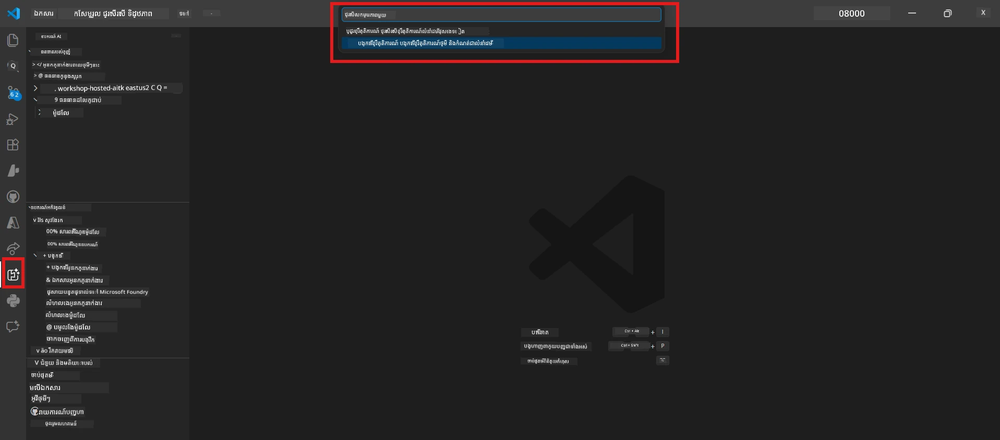

# មូឌុល 0 - ការណែនាំ

⏱️ ~10 នាទី

> [!WARNING]
> **ការមើលជាមុន និងកំណត់ខ្ទង់៖** [ភ្នាក់ងារត្រូវបានផ្តល់ជាសាធារណៈ](https://learn.microsoft.com/azure/foundry/agents/concepts/hosted-agents) កំពុងនៅក្នុង **ការមើលជាមុនសាធារណៈ** - មិនបានណែនាំសម្រាប់ការងារផលិត។ មុខលក្ខណៈខ្លះដែលបង្ហាញនៅក្នុងវគ្គបណ្តុះបណ្តាលនេះអាចប្រែក្លាយទៅតាមការផ្លាស់ប្តូរនៃសេវាកម្មទៅរក GA។

## អ្វីដែលអ្នកនឹងសាងសង់

ក្នុងមន្ទីរបណ្តុះបណ្តាលនេះ អ្នកបានពង្រីកជំនាញភ្នាក់ងារតែមួយពីមន្ទីរបណ្តុះបណ្តាល 01 ដើម្បីបង្កើត **សេចក្តីជូនដំណឹងភ្នាក់ងារច្រើន** - អ្នកវាយតម្លៃឯកសារជResume → សមត្ថភាពការងារ។

អ្នកបិទបញ្ជូល **ប្រាប់ប្រវត្តិរូប** និង **លំអិតការងារ**។ ភ្នាក់ងារពិសេសបួននាក់ដំណើរការបញ្ចូលជាលំដាប់ តែបន្ទាប់មកបង្វិល:
- ពិន្ទុខាប់សមាសភាព (0–100 ជាមួយការបែងចែកពិន្ទុ)
- បញ្ជីចន្លោះជំនាញ និងសញ្ញាបត្រ
- ផ្លូវការសិក្សាប្រកបដោយផ្ទាល់ខ្លួនជាមួយតំណភ្ជាប់ Microsoft Learn ពិតប្រាកដសម្រាប់ចន្លោះនិមួយៗ

**កម្មវិធីនេះប្រើ៖**
- **ស៊ុមភ្នាក់ងារ Microsoft** - `WorkflowBuilder` សម្រាប់ការសម្របសម្រួលលំដាប់
- **ឧបករណ៍ Foundry សម្រាប់ VS Code** - សង់អ្នកជំនួយ សាកល្បងក្នុងតំបន់ បង្ហោះ
- **ម៉ូដែល AI** (ឧ. `gpt-4.1-mini`) - ប្រើដោយភ្នាក់ងារបួននាក់ទាំងអស់
- **ម៉ាស៊ីនមេ Microsoft Learn MCP** - ផ្តល់តំណធនធានសិក្សាពិតប្រាកដសម្រាប់ចន្លោះជំនាញនិមួយៗ

---

## ជ្រើសរើសផ្លូវរបស់អ្នក

> ⚠️ **បន្តនៅលើផ្លូវដូចគ្នាដែលអ្នកបានប្រើនៅក្នុងមន្ទីរបណ្តុះបណ្តាល 01។**

<details open>
<summary><strong>🅰️ ផ្លូវ A - មេឃ Azure (ទាមទារជាវតែ Azure)</strong></summary>

| | ព័ត៌មានលម្អិត |
|---|---|
| **សម្រាប់នរណា?** | អ្នកបានបញ្ចប់មន្ទីរបណ្តុះបណ្តាល 01 ប្រើជាវ Azure |
| **ម៉ូដែល** | Azure OpenAI តាម​រយៈ Foundry (ឧ. `gpt-4.1-mini`) |
| **មូឌុលគ្រប់គ្រង** | មូឌុលទាំងអស់ (00–09) |
| **បង្ហោះទៅពពក?** | ✅ បាន - បំពេញពេញលេញពីដំណាក់កាលដល់សេចក្តីបញ្ចប់ |

</details>

<details open>
<summary><strong>🅱️ ផ្លូវ B - Foundry នៅក្នុងតំបន់ (មិនត្រូវការជាវ Azure)</strong></summary>

| | ព័ត៌មានលម្អិត |
|---|---|
| **សម្រាប់នរណា?** | អ្នកបានបញ្ចប់មន្ទីរបណ្តុះបណ្តាល 01 ប្រើ Foundry នៅក្នុងតំបន់ |
| **ម៉ូដែល** | Foundry ក្នុងតំបន់ (ឥតគិតថ្លៃ ប្រតិបត្តិលើកុំព្យូទ័ររបស់អ្នក) |
| **មូឌុលគ្រប់គ្រង** | មូឌុល 00–05 (រំលង 06–07 - បង្ហោះ និងបញ្ជាក់ពពក) |
| **បង្ហោះទៅពពក?** | ❌ មិន - សាកល្បងក្នុងតំបន់តែម្តងរយៈតាម Agent Inspector |

</details>

---

## ការត្រួតពិនិត្យមន្ទីរបណ្តុះបណ្តាល 01

មន្ទីរបណ្តុះបណ្តាល 02 បង្កើតផ្ទាល់លើមន្ទីរបណ្តុះបណ្តាល 01។ សូមបញ្ចប់មុនមន្ទីរបណ្តុះបណ្តាល 01 មុនចាប់ផ្តើមនៅទីនេះ។

មិនទាន់ធ្វើមន្ទីរបណ្តុះបណ្តាល 01 ទេទេ? ចាប់ផ្តើមនៅទីនេះ: [Lab 01 - Introduction](../../lab01-single-agent/docs/00-prerequisites.md)

<details open>
<summary><strong>🅰️ ផ្លូវ A - មេឃ Azure</strong></summary>

```powershell
az account show --query "{name:name, id:id}" --output table
```

ប្រសិនបើមានបញ្ហា ធ្វើ `az login`។ បន្ទាប់មកពិនិត្យនៅក្នុង VS Code:

1. ញញឹម `Ctrl+Shift+P` → វាយ **Foundry Toolkit** → ធានាការបញ្ជានបង្ហាញ។
2. ចុចរូបតំណាង **Foundry Toolkit** → គម្រោង និងម៉ូដែលដែលបានបង្ហោះបង្ហាញ **បានជោគជ័យ**។



> **RBAC:** អ្នកបានផ្ដល់អោយ **Foundry User** នៅក្នុង Lab 01។ ប្រសិនបើអ្នកត្រូវការផ្ដល់ឡើងវិញ សូមមើល [Lab 01, Module 1](../../lab01-single-agent/docs/01-setup.md#deploy-a-model--assign-rbac)។ តួនាទីនេះមានឈ្មោះពីមុនជា **Azure AI User** - អ្នកមានសិទ្ធិដូចគ្នា។

</details>

<details open>
<summary><strong>🅱️ ផ្លូវ B - Foundry នៅក្នុងតំបន់</strong></summary>

```powershell
Invoke-WebRequest -Uri "http://localhost:5273/v1/health" -UseBasicParsing | Select-Object StatusCode
```

ប៉ុន្មានដែលបានរំពឹងទុក: `StatusCode: 200`។ ប្រសិនបើមិនមែន សូមបញ្ចប់ឡើងវិញ Foundry ក្នុងតំបន់ពីស្វាយងារ Foundry Toolkit ។

> ការបញ្ចូលការវិភាគទាំងអស់បន្ទាន់លើម៉ាស៊ីនរបស់អ្នក។ ការហៅចេញតែមួយគត់គឺឧបករណ៍ MCP ទៅ `https://learn.microsoft.com/api/mcp`។

</details>

---

## អ្វីថ្មីៗនៅក្នុងមន្ទីរបណ្តុះបណ្តាល 02

| | មន្ទីរបណ្តុះបណ្តាល 01 | មន្ទីរបណ្តុះបណ្តាល 02 |
|--|--------|--------|
| ភ្នាក់ងារ | 1 | 4 (ចាក់ចងជាមួយ WorkflowBuilder) |
| គំរូសង់ | មូលដ្ឋាន - ស៊ុមភ្នាក់ងារ | សេចក្តីជូនដំណឹង - ស៊ុមភ្នាក់ងារ |
| កញ្ចប់ថ្មី | - | `mcp` |
| ការសម្របសម្រួល | ភ្នាក់ងារពិភាក្សាតែមួយ | ជួរដំណាក់កាល (WorkflowBuilder) |
| ឧបករណ៍ថ្មី | - | `search_microsoft_learn_for_plan` (MCP) |

---

**បន្ទាប់ ៖** [01 - យល់ដឹងអាក្រក់ស្ថាបត្យកម្ម →](01-understand-multi-agent.md)

---

<!-- CO-OP TRANSLATOR DISCLAIMER START -->
**ការបដិសេធ**:
ឯកសារនេះត្រូវបានបម្លែងភាសា ដោយប្រើសេវាបម្លែងភាសា AI [Co-op Translator](https://github.com/Azure/co-op-translator)។ ទោះយើងខ្ញុំមានក្តីប្រាថ្នាឱ្យបានច្បាស់លាស់ តែសូមយល់ដឹងថាការបម្លែងដោយស្វ័យប្រវត្តិក៏អាចមានកំហុសឬភាពមិនត្រឹមត្រូវ។ ឯកសារដើមជាភាសាទីតាំងគួរត្រូវបានគេប្រើជាប្រភពច្បាស់លាស់។ សម្រាប់ព័ត៌មានសំខាន់ៗ សូមណែនាំឱ្យប្រើប្រាស់ការប្រែដោយមនុស្សជំនាញ។ យើងខ្ញុំមិនទទួលខុសត្រូវចំពោះការយល់ច្រឡំ ឬការបកស្រាយខុសបន្ទាប់ពីការប្រើប្រាស់ការបម្លែងនេះនោះទេ។
<!-- CO-OP TRANSLATOR DISCLAIMER END -->