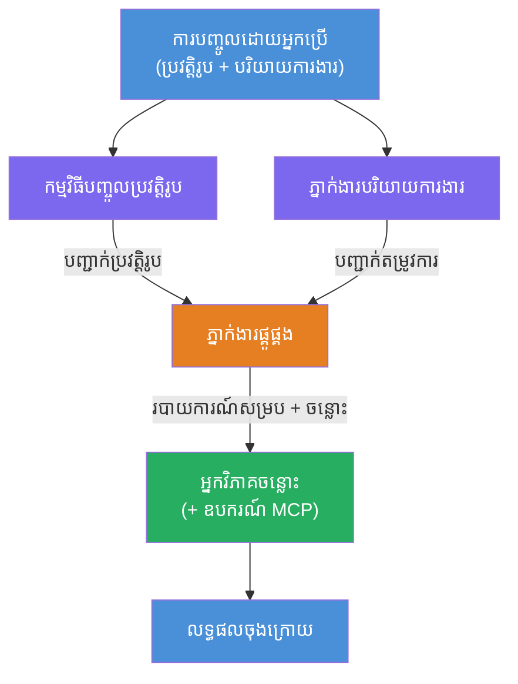
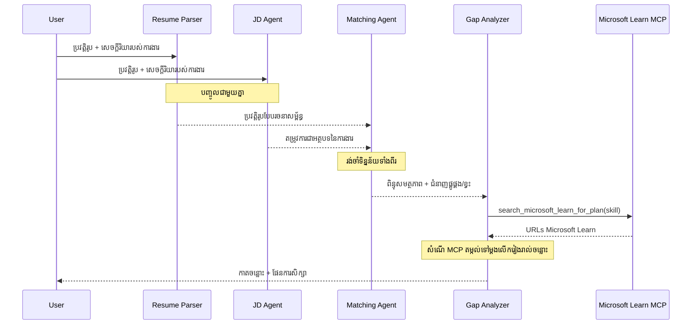
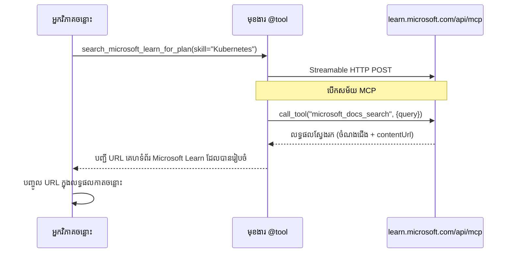

# Module 1 - យល់ដឹងអំពីរចនាសម្ព័ន្ធ Multi-Agent

ក្នុងម៉ូឌុលនេះ អ្នករៀនអំពីរចនាសម្ព័ន្ធនៃកម្មវិធី Resume → Job Fit Evaluator មុនពេលសរសេរកូដណាមួយ។ ការយល់ដឹងអំពីក្រាហ្វអចិន្ត្រៃយ៍ តួនាទីភ្នាក់ងារ និងចរន្តទិន្នន័យគឺទំនាក់ទំនងសំខាន់សម្រាប់ការបដិសេធកំហុស និងពង្រីក [ខ្សែការងារជាមួយភ្នាក់ងារច្រើន](https://learn.microsoft.com/azure/architecture/ai-ml/idea/multiple-agent-workflow-automation)។

---

## បញ្ហាដែលវាប្រែបាន

ការប្រាប់ផ្គូផ្គងប្រវត្តិរូបជាមួយការពិពណ៌នាការងារត្រូវការជំនាញឯករាជ ៤ ប្រភេទ៖

1. **Parsing** - ដកយកទិន្នន័យមានរចនាសម្ព័ន្ធពីអត្ថបទមិនមានរចនាសម្ព័ន្ធ (ប្រវត្តិរូប)
2. **Analysis** - ដកយកតម្រូវការពីការពិពណ៌នាការងារ
3. **Comparison** - 매ែនស៊ុមភាពរវាងពីរជាមួយពិន្ទុ
4. **Planning** - បង្កើតផែនការសិក្សាដើម្បីបិទចន្លោះ

ភ្នាក់ងារតែមួយធ្វើភារកិច្ចទាំងបួនក្នុងព្រឹត្តិបត្រមួយជាញឹកញាប់អាចបង្កើត៖
- ការដកយកមិនពេញលេញ (វារត់រហ័សតាម Parsing ដើម្បីទទួលបានពិន្ទុ)
- ពិន្ទុរាបស្មើ (គ្មានការបង្ហាញដោយផ្អែកលើព័ត៌មាន)
- ផែនការសិក្សាធម្មតា (មិនគិតរួមចំពោះចន្លោះជាក់លាក់)

ដោយបំបែកជាពីរភ្នាក់ងារពិសេស **បួនគ្នា** ម្នាក់នីម្នាក់ធ្វើភារកិច្ចរបស់ខ្លួនដោយមានការណែនាំជាក់លាក់ នាំឲ្យទទួលបានលទ្ធផលគុណភាពខ្ពស់នៅគ្រប់ដំណាក់កាល។

---

## ភ្នាក់ងារបួននាក់

ភ្នាក់ងារស្តង់ដារពេញលេញ [Microsoft Foundry](https://learn.microsoft.com/azure/foundry/agents/concepts/hosted-agents) នីមួយៗ ត្រូវបានបង្កើតតាមរយៈ `AzureAIAgentClient.as_agent()`។ ពួកវាចែករំលែកការតំឡើងគំរូដូចគ្នា ប៉ុន្តែមានការណែនាំ និង (ជាជំរើស) ឧបករណ៍ខុសគ្នា។

| # | ឈ្មោះភ្នាក់ងារ | តួនាទី | ឆ្លងវិនិយោគ | លទ្ធផល |
|---|-----------|------|-------|--------|
| 1 | **ResumeParser** | ដកយកពត៌មានរចនាសម្ព័ន្ធពីអត្ថបទប្រវត្តិរូប | អត្ថបទប្រវត្តិរូបដើម (ពីអ្នកប្រើ) | សំរឹទ្ធិប្រវត្តិការ, ជំនាញបច្ចេកទេស, ជំនាញទន់, វិញ្ញាបនបត្រ, បទពិសោធន៍ដែន, ការសំរេចបាន |
| 2 | **JobDescriptionAgent** | ដកយកតម្រូវការច្បាស់លាស់ពី JD | អត្ថបទ JD ដើម (ពីអ្នកប្រើ, ផ្ញើតាម ResumeParser) | ទិដ្ឋភាពតួនាទី, ជំនាញត្រូវការ, ជំនាញចង់បាន, បទពិសោធន៍, វិញ្ញាបនបត្រ, ការអប់រំ, ភារកិច្ច |
| 3 | **MatchingAgent** | គណនាពិន្ទុផ្អែកលើភស្តុតាង | លទ្ធផលពី ResumeParser + JobDescriptionAgent | ពិន្ទុផ្គូផ្គង (0-100 ជាមួយចំណែក), ជំនាញផ្គូផ្គង, ជំនាញខ្វះ, ចន្លោះ |
| 4 | **GapAnalyzer** | បង្កើតផែនការរៀនផ្ទាល់ខ្លួន | លទ្ធផលពី MatchingAgent | កាតចន្លោះ (ក្នុងមួយជំនាញ), លំដាប់រៀន, រយៈពេល, ឧបករណ៍ពី Microsoft Learn |

---

## ក្រាហ្វអចិន្ត្រៃយ៍

ការងារប្រើ **parallel fan-out** បន្ទាប់ពីនោះ **sequential aggregation**៖


> **Legend:** ទំនិញ Purple = ភ្នាក់ងារពហុៈ, ត្នោត = ចំណុចសម្រង់, ពណ៌បៃតង = ភ្នាក់ងារចុងក្រោយជាមួយឧបករណ៍

### របៀបចរន្តទិន្នន័យ


1. **អ្នកប្រើផ្ញើ** សារ​មានប្រវត្តិរូប និងការពិពណ៌នាការងារ។
2. **ResumeParser** ទទួលយកព័ត៌មានអ្នកប្រើពេញលេញ និងដកប្រវត្តិរូបដែលមានរចនាសម្ព័ន្ធ។
3. **JobDescriptionAgent** ទទួលព័ត៌មានអ្នកប្រើជាផ្លូវប្រកួត និងដកតម្រូវការរចនាសម្ព័ន្ធ។
4. **MatchingAgent** ទទួលលទ្ធផលពី **ពីរនាក់** ResumeParser និង JobDescriptionAgent (ផ្នែករចនាសម្ព័ន្ធរង់ចាំទាំងពីរបញ្ចប់មុនបើក MatchingAgent)។
5. **GapAnalyzer** ទទួលលទ្ធផលពី MatchingAgent ហើយហៅឧបករណ៍ **Microsoft Learn MCP** ដើម្បីយកប្រភពរៀនពិតសម្រាប់ចន្លោះនីមួយៗ។
6. **លទ្ធផលចុងក្រោយ** គឺការឆ្លើយតបរបស់ GapAnalyzer ដែលរួមមានពិន្ទុផ្គូផ្គង កាតចន្លោះ និងផែនការសិក្សាសព្វថ្ងៃ។

### ហេតុអ្វីបានជាការបែងចែក parallel fan-out មានសារៈសំខាន់

ResumeParser និង JobDescriptionAgent បើក **ជាភាគីស្របពេល** ព្រោះមិនអាចផ្អែកលើគ្នាទេ។ នេះបណ្ដាលទៅជា៖
- ការកាត់បន្ថយពេលយឺតសរុប (ទាំងពីរ​រត់​ដោយស្របពេល ជំនួសសម្រាប់តម្រៀបបន្តរ)
- ជាការបែងចែកធម្មជាតិ (ការពិភាក្សារបស់ Resume និង JD ការងារឯករាជ)
- បង្ហាញបែបបទធម្មតានៃភ្នាក់ងារច្រើន: **fan-out → aggregate → act**

---

## WorkflowBuilder ក្នុងកូដ

នេះជាវិធីដែលក្រាហ្វខាងលើ ត្រូវបានផ្គូផ្គងទៅ API [`WorkflowBuilder`](https://learn.microsoft.com/agent-framework/workflows/agents-in-workflows) នៅ `main.py`៖

```python
from agent_framework import WorkflowBuilder

workflow = (
    WorkflowBuilder(
        name="ResumeJobFitEvaluator",
        start_executor=resume_parser,       # អ្នកប្រតិបត្តិការដំបូងដែលទទួលការបញ្ចូលពីអ្នកប្រើ
        output_executors=[gap_analyzer],     # អ្នកប្រតិបត្តិការចុងក្រោយដែលផ្ទុកលទ្ធផលត្រូវបានសងបំផុត
    )
    .add_edge(resume_parser, jd_agent)      # ResumeParser → JobDescriptionAgent
    .add_edge(resume_parser, matching_agent) # ResumeParser → MatchingAgent
    .add_edge(jd_agent, matching_agent)      # JobDescriptionAgent → MatchingAgent
    .add_edge(matching_agent, gap_analyzer)  # MatchingAgent → GapAnalyzer
    .build()
)
```

**យល់ពីចំណុចកន្ត្រៃ៖**

| កន្ត្រៃ | ពន្យល់ពីវា |
|---------|--------------|
| `resume_parser → jd_agent` | JD Agent ទទួលលទ្ធផល ResumeParser |
| `resume_parser → matching_agent` | MatchingAgent ទទួលលទ្ធផល ResumeParser |
| `jd_agent → matching_agent` | MatchingAgent ក៏ទទួលលទ្ធផល JD Agent ផងដែរ (រង់ចាំទាំងពីរ) |
| `matching_agent → gap_analyzer` | GapAnalyzer ទទួលលទ្ធផល MatchingAgent |

ដោយសារតែ `matching_agent` មាន **កន្ត្រៃចូលពីរពីរ** (`resume_parser` និង `jd_agent`), ក្រាបការងារជាទូទៅរង់ចាំឲ្យទាំងពីរបញ្ចប់មុនបើក MatchingAgent។

---

## ឧបករណ៍ MCP

ភ្នាក់ងារ GapAnalyzer មានឧបករណ៍មួយ៖ `search_microsoft_learn_for_plan`។ វាជា **[ឧបករណ៍ MCP](https://learn.microsoft.com/agent-framework/agents/tools/hosted-mcp-tools)** ដែលហៅ API Microsoft Learn ដើម្បីយកប្រភពរៀនចំរូង។

### វាធ្វើការយ៉ាងដូចម្តេច

```python
@tool
async def search_microsoft_learn_for_plan(
    skill: str, role: str = "", max_results: int = 5
) -> str:
    """Search Microsoft Learn MCP and return curated official links."""
    # ភ្ជាប់ទៅកាន់ https://learn.microsoft.com/api/mcp តាមរយៈ Streamable HTTP
    # ហៅឧបករណ៍ 'microsoft_docs_search' នៅលើម៉ាស៊ួ MCP
    # ត្រឡប់តារាងទ្រង់ទ្រាយនៃ URLs របស់ Microsoft Learn
```

### សេចក្ដីហៅ MCP


1. GapAnalyzer សម្រេចថាត្រូវការប្រភពរៀនសម្រាប់ជំនាញណាមួយ (ឧ. "Kubernetes")
2. ក្រាបការងារហៅ `search_microsoft_learn_for_plan(skill="Kubernetes")`
3. មុខងារ​បើកជំនួប [Streamable HTTP](https://learn.microsoft.com/agent-framework/agents/tools/hosted-mcp-tools) ទៅ `https://learn.microsoft.com/api/mcp`
4. វាហៅឧបករណ៍ `microsoft_docs_search` នៅលើ [ម៉ាស៊ីន MCP](https://learn.microsoft.com/azure/foundry/agents/how-to/tools/model-context-protocol)
5. ម៉ាស៊ីន MCP ផ្ដើមលទ្ធផលស្វែងរក (ចំណងជើង + URL)
6. មុខងារត្រួតត្រាលទ្ធផល និងត្រឡប់ជាទង្វើខ្សែអក្សរ
7. GapAnalyzer ប្រើ URL ដែលទទួលបានក្នុងលទ្ធផលកាតចន្លោះរបស់វា

### កំណត់ហេតុ MCP ដែលរំពឹងទុក

ពេលឧបករណ៍ដំណើរការអ្នកនឹងឃើញកំណត់ហេតុដូចជា៖

```
GET https://learn.microsoft.com/api/mcp → 405 (Method Not Allowed)
POST https://learn.microsoft.com/api/mcp → 200
DELETE https://learn.microsoft.com/api/mcp → 405 (Method Not Allowed)
```

**ទាំងនេះគឺធម្មតា។** អតិថិជន MCP ត្រៀម GET និង DELETE លើកដំបូង - កំណត់ហេតុ 405 គឺជាច្បាប់ធម្មតា។ ការហៅឧបករណ៍ពិតប្រាកដប្រើ POST និងត្រលប់ 200។ គ្រាន់តែបារម្ភបើ POST បរាជ័យ។

---

## គំរូបង្កើតភ្នាក់ងារ

ភ្នាក់ងារ​មួយៗ​ត្រូវបានបង្កើតដោយ **[`AzureAIAgentClient.as_agent()`](https://learn.microsoft.com/python/api/overview/azure/ai-agents-readme) មុខងារ async context manager**។ នេះគឺជាគំរូ Foundry SDK សម្រាប់បង្កើតភ្នាក់ងារដែលត្រូវបានសំអាតស្វ័យប្រវត្តិ៖

```python
async with (
    get_credential() as credential,
    AzureAIAgentClient(
        project_endpoint=PROJECT_ENDPOINT,
        model_deployment_name=MODEL_DEPLOYMENT_NAME,
        credential=credential,
    ).as_agent(
        name="ResumeParser",
        instructions=RESUME_PARSER_INSTRUCTIONS,
    ) as resume_parser,
    # ... ធ្វើម្ដងទៀតសម្រាប់ភ្នាក់ងារនីមួយៗ ...
):
    # មានភ្នាក់ងារទាំង 4 នាក់នៅទីនេះ
    workflow = create_workflow(resume_parser, jd_agent, matching_agent, gap_analyzer)
```

**ចំណុចសំខាន់ៈ**
- ភ្នាក់ងារនីមួយៗបានពីរប្រើ `AzureAIAgentClient` ផ្ទាល់ខ្លួន (SDK តម្រូវឲ្យឈ្មោះភ្នាក់ងារត្រូវតែមានព្រំដែនផ្ទាល់ខ្លួន)
- ភ្នាក់ងារទាំងអស់ចែករំលែក `credential`, `PROJECT_ENDPOINT` និង `MODEL_DEPLOYMENT_NAME` ដូចគ្នា
- ប្លុក `async with` ធានាថា ភ្នាក់ងារទាំងអស់ត្រូវបានសំអាតពេលម៉ាស៊ីនបម្រើបិទ
- GapAnalyzer ទទួលក៏ `tools=[search_microsoft_learn_for_plan]`

---

## ចាប់ផ្ដើមម៉ាស៊ីនបម្រើ

បន្ទាប់ពីបង្កើតភ្នាក់ងារ និងកសាង workflow ម៉ាស៊ីនបម្រើចាប់ផ្ដើម៖

```python
from azure.ai.agentserver.agentframework import from_agent_framework

agent = create_workflow(resume_parser, jd_agent, matching_agent, gap_analyzer)
await from_agent_framework(agent).run_async()
```

`from_agent_framework()` បំលែង workflow ជាម៉ាស៊ីនបម្រើ HTTP បើកផ្លូវ `/responses` នៅច្រក 8088។ វាជាគំរូដូចជា Lab 01 ប៉ុន្តែ "ភ្នាក់ងារ" គឺជាក្រាហ្វរបស់ [workflow](https://learn.microsoft.com/agent-framework/workflows/as-agents) ទាំងមូល។

---

### ពិនិត្យមើល

- [ ] អ្នកយល់ដឹងរចនាសម្ព័ន្ធ 4-ភ្នាក់ងារ និង តួនាទីភ្នាក់ងារ​នីមួយៗ
- [ ] អ្នកអាច​តាមដានចរន្តទិន្នន័យ៖ អ្នកប្រើ → ResumeParser → (ជាប្រព័ន្ធស្រប) JD Agent + MatchingAgent → GapAnalyzer → លទ្ធផល
- [ ] អ្នកយល់ថាហេតុអ្វី MatchingAgent ត្រូវរងចាំទាំង ResumeParser និង JD Agent (មានកន្ត្រៃចូលពីរពីរ)
- [ ] អ្នកយល់ពីឧបករណ៍ MCP៖ វាធ្វើអ្វី, វាត្រូវបានហៅដូចម្តេច, និងថាកំណត់ហេតុ GET 405 គឺធម្មតា
- [ ] អ្នកយល់និងគំរូ `AzureAIAgentClient.as_agent()` និងហេតុអ្វីបានជាភ្នាក់ងារនីមួយមានអតិថិជនផ្ទាល់ខ្លួន
- [ ] អ្នកអាចអានកូដ `WorkflowBuilder` ហើយផ្គូផ្គងវាជាក្រាហ្វមើលឃើញ

---

**មុននេះ:** [00 - Prerequisites](00-prerequisites.md) · **បន្ទាប់:** [02 - Scaffold the Multi-Agent Project →](02-scaffold-multi-agent.md)

---

<!-- CO-OP TRANSLATOR DISCLAIMER START -->
**ការបដិសេធ**៖  
ឯកសារនេះត្រូវបានបកប្រែដោយប្រើសេវាបកប្រែ AI [Co-op Translator](https://github.com/Azure/co-op-translator)។ ខណៈដែលយើងខំប្រឹងប្រែងសម្រួលភាពត្រឹមត្រូវ សូមប្រយ័ត្នថាការបកប្រែដោយស្វ័យប្រវត្តិក្នុងឯកសារនេះអាចមានកំហុស ឬការមិនត្រឹមត្រូវខ្លះ។ ឯកសារដើមដែលជាភាសាទិន្នន័យដើមគួរត្រូវបានទស្សនាជាធនាគារដែលមានសិទ្ធិសំខាន់។ សម្រាប់ព័ត៌មានចាំបាច់ណាមួយ គួរតែប្រើការបកប្រែដោយជំនាញមនុស្សវិជ្ជាជីវៈ។ យើងមិនទទួលខុសត្រូវចំពោះការយល់ច្រឡំនិងការបកប្រែខុសឡើយ ដែលកើតមានពីការប្រើប្រាស់ការបកប្រែនេះនោះទេ។
<!-- CO-OP TRANSLATOR DISCLAIMER END -->