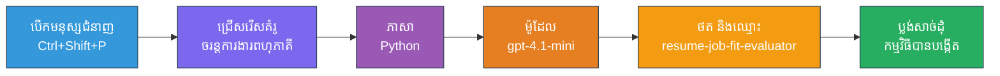
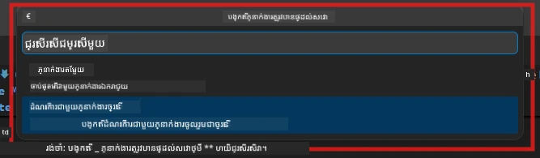

# Module 2 - រៀបចំគម្រោង Multi-Agent

នៅក្នុងម៉ូឌុលនេះ អ្នកប្រើប្រាស់ [Microsoft Foundry extension](https://marketplace.visualstudio.com/items?itemName=TeamsDevApp.vscode-ai-foundry) ដើម្បី **រៀបចំគម្រោង workflow multi-agent**។ ការពង្រីកនេះបង្កើតរចនាសម្ព័ន្ធគម្រោងទាំងមូល - `agent.yaml`, `main.py`, `Dockerfile`, `requirements.txt`, `.env`, និងការកំណត់បរិមាណ debug។ បន្ទាប់មក អ្នកអាចប្ដូរឯកសារទាំងនេះនៅ Modules 3 និង 4។

> **ចំណាំ៖**ថតសម្ភារៈ `PersonalCareerCopilot/` ក្នុងការពិសោធន៍នេះជាឧទាហរណ៍ពេញលេញដែលដំណើរការបាននៃគម្រោង multi-agent ដែលបានប្ដូរតាមតំរូវការ។ អ្នកអាចរៀបចំគម្រោងថ្មីដោយផ្ទាល់ (បានណែនាំសម្រាប់ការរៀន) ឬសិក្សាកូដដែលមានរួចជាមួយ។

---

## ជំហាន 1: បើកផ្លូវមន្ត្រីបង្កើត Hosted Agent


1. ចុច `Ctrl+Shift+P` ដើម្បីបើក **Command Palette**។
2. វាយ: **Microsoft Foundry: Create a New Hosted Agent** ហើយជ្រើសរើសវា។
3. ផ្លូវមន្ត្រីបង្កើត hosted agent នឹងបើកឡើង។

> **ជម្រើសផ្សេងទៀត៖** ចុចរូបតំណាង **Microsoft Foundry** នៅក្នុង Activity Bar → ចុចរូបតំណាង **+** នៅក្បែរបញ្ជី **Agents** → **Create New Hosted Agent**។

---

## ជំហាន 2: ជ្រើសមូដែល Multi-Agent Workflow

ផ្លូវមន្ត្រីសុំឱ្យអ្នកជ្រើសមូដែល៖

| មូដែល | ពណ៌នា | ពេលប្រើ |
|----------|-------------|-------------|
| Single Agent | តំណាងម្នាក់ដែលមានការណែនាំ និងឧបករណ៍ជាជម្រើស | Lab 01 |
| **Multi-Agent Workflow** | តំណាងច្រើនដែលរួមចំណែកជាមួយ WorkflowBuilder | **ការពិសោធន៍នេះ (Lab 02)** |

1. ជ្រើស **Multi-Agent Workflow**។
2. ចុច **Next**។



---

## ជំហាន 3: ជ្រើសភាសាកូដ

1. ជ្រើស **Python**។
2. ចុច **Next**។

---

## ជំហាន 4: ជ្រើសម៉ូដែលរបស់អ្នក

1. ផ្លូវមន្ត្រីបង្ហាញម៉ូដែលដែលបានចាត់តាំងនៅក្នុងគម្រោង Foundry របស់អ្នក។
2. ជ្រើសម៉ូដែលដូចគ្នាដែលអ្នកបានប្រើនៅ Lab 01 (ឧ. **gpt-4.1-mini**)។
3. ចុច **Next**។

> **គន្លឺ:** [`gpt-4.1-mini`](https://learn.microsoft.com/azure/foundry/foundry-models/concepts/models-sold-directly-by-azure#gpt-41-series) គឺបានណែនាំសម្រាប់ការអភិវឌ្ឍន៍ - វាម៉ាស៊ីនរហ័ស, តម្លៃថោកនិងគ្រប់គ្រង workflow multi-agent បានល្អ។ ផ្លាស់ប្ដូរទៅ `gpt-4.1` សម្រាប់ការប្រើប្រាស់ផលិតកម្មចុងក្រោយ ប្រសិនបើអ្នកចង់បានលទ្ធផលមានគុណភាពខ្ពស់។

---

## ជំហាន 5: ជ្រើសទីតាំងថត និងឈ្មោះតំណាង

1. ប្រអប់ជ្រើសឯកសារបើកឡើង។ ជ្រើសថតគោលដៅ៖
   - ប្រសិនបើធ្វើតាម repo វីក៏សុី: ទៅកាន់ `workshop/lab02-multi-agent/` ហើយបង្កើតថតរងថ្មី
   - ប្រសិនបើចាប់ផ្តើមថ្មី: ជ្រើសថតណាមួយ
2. បញ្ចូល **ឈ្មោះ** សម្រាប់ hosted agent (ឧ. `resume-job-fit-evaluator`)។
3. ចុច **Create**។

---

## ជំហាន 6: រង់ចាំការរៀបចំរួចរាល់

1. VS Code បើកវីនដូថ្មី (ឬវីនដូបច្ចុប្បន្នធ្វើបច្ចុប្បន្នភាព) ជាមួយគម្រោងដែលបានរៀបចំ។
2. អ្នកគួរតែឃើញរចនាសម្ព័ន្ធឯកសារដូចនេះ៖

```
resume-job-fit-evaluator/
├── .env                ← Environment variables (placeholders)
├── .vscode/
│   └── launch.json     ← Debug configuration
├── agent.yaml          ← Agent definition (kind: hosted)
├── Dockerfile          ← Container configuration
├── main.py             ← Multi-agent workflow code (scaffold)
└── requirements.txt    ← Python dependencies
```

> **ចំណាំវីក៏សុី៖** នៅក្នុង repo វីក៏សុី ថត `.vscode/` ស្ថិតនៅ **ឫសកន្លែងកន្លែងការងារ** ជាមួយឯកសារ `launch.json` និង `tasks.json` ដែលចែករំលែកគ្នា។ ការកំណត់ debug សម្រាប់ Lab 01 និង Lab 02 ស្ថិតនៅក្នុងទាំងពីរ។ នៅពេលចុច F5 សូមជ្រើស **"Lab02 - Multi-Agent"** ពីបញ្ជីឆក់ចុះ។

---

## ជំហាន 7: យល់ពីឯកសារដែលបានរៀបចំ (ពិសេសសម្រាប់ multi-agent)

ការរៀបចំ multi-agent ផ្សេងពី single-agent នៅចំនុចសំខាន់ៗ៖

### 7.1 `agent.yaml` - ការបកស្រាយតំណាង

```yaml
kind: hosted
name: resume-job-fit-evaluator
description: >
  A multi-agent workflow that evaluates resume-to-job fit.
metadata:
  authors:
    - Microsoft
  tags:
    - Multi-Agent Workflow
    - Resume Evaluator
protocols:
  - protocol: responses
    version: v1
environment_variables:
  - name: PROJECT_ENDPOINT
    value: ${PROJECT_ENDPOINT}
  - name: MODEL_DEPLOYMENT_NAME
    value: ${MODEL_DEPLOYMENT_NAME}
```

**ភាពខុសគ្នាចម្បងពី Lab 01៖** ផ្នែក `environment_variables` អាចមានអថេរបន្ថែមសម្រាប់ MCP endpoints ឬការកំណត់ឧបករណ៍ផ្សេងទៀត។ ថ្នាក់ `name` និង `description` បង្ហាញពីការប្រើប្រាស់ multi-agent។

### 7.2 `main.py` - កូដ workflow មួយចំនួន

ការរៀបចំរួមបញ្ចូល៖
- **ខ្សែណែនាំតំណាងច្រើន** (const មួយសម្រាប់តំណាងមួយ)
- **[`AzureAIAgentClient.as_agent()`](https://learn.microsoft.com/python/api/overview/azure/ai-agents-readme) context managers ច្រើន** (មួយសម្រាប់តំណាងមួយ)
- **[`WorkflowBuilder`](https://learn.microsoft.com/agent-framework/workflows/agents-in-workflows)** ដើម្បីភ្ជាប់តំណាងគ្នា
- **`from_agent_framework()`** សម្រាប់បម្រុង workflow ជា HTTP endpoint

```python
from agent_framework import WorkflowBuilder, tool
from agent_framework.azure import AzureAIAgentClient
from azure.ai.agentserver.agentframework import from_agent_framework
```

ការនាំចូលបន្ថែម [`WorkflowBuilder`](https://learn.microsoft.com/agent-framework/workflows/agents-in-workflows) មានថ្មីប្រៀបធៀបទៅ Lab 01។

### 7.3 `requirements.txt` - លទ្ធផលបន្ថែម

គម្រោង multi-agent ប្រើកញ្ចប់ដូចគ្នានឹង Lab 01 បូកចូលនឹងកញ្ចប់ដែលទាក់ទង MCP:

```
agent-framework-azure-ai==1.0.0rc3
agent-framework-core==1.0.0rc3
azure-ai-agentserver-agentframework==1.0.0b16
azure-ai-agentserver-core==1.0.0b16
debugpy
agent-dev-cli --pre
```

> **ចំណាំសំខាន់អំពីកំណែ៖** កញ្ចប់ `agent-dev-cli` តម្រូវឱ្យមានទម្រង់ `--pre` នៅក្នុង `requirements.txt` ដើម្បីតំឡើងកំណែបង្ហាញថ្មីបំផុត។ នេះចាំបាច់សម្រាប់ភាពឆ្អឹងលើ Agent Inspector ជាមួយ `agent-framework-core==1.0.0rc3`។ សូមមើល [Module 8 - Troubleshooting](08-troubleshooting.md) សម្រាប់ព័ត៌មានកំណែឯកតា។

| កញ្ចប់ | កំណែ | គោលបំណង |
|---------|---------|---------|
| [`agent-framework-azure-ai`](https://learn.microsoft.com/agent-framework/overview/) | `1.0.0rc3` | បញ្ចូល Azure AI សម្រាប់ [Microsoft Agent Framework](https://github.com/microsoft/agent-framework) |
| [`agent-framework-core`](https://learn.microsoft.com/agent-framework/overview/) | `1.0.0rc3` | អាគ្រី runtime (រួមមាន WorkflowBuilder) |
| `azure-ai-agentserver-agentframework` | `1.0.0b16` | runtime ម៉ាស៊ីនអោយតំណាង hosted |
| `azure-ai-agentserver-core` | `1.0.0b16` | abstraction ម៉ាស៊ីនអោយតំណាង |
| `debugpy` | អនុប្បទានថ្មី | ធ្វើ debug ជាមួយ Python (F5 ក្នុង VS Code) |
| `agent-dev-cli` | `--pre` | កម្មវិធី CLI សម្រាប់ dev នៅក្នុង + Agent Inspector backend |

### 7.4 `Dockerfile` - ដូចជាក្នុង Lab 01

Dockerfile ដូចគ្នាដើម្បី Lab 01 - វាចម្លងឯកសារ, តំឡើងសាកល្បងពី `requirements.txt`, បង្ហាញកំពស់ 8088, ហើយបើកដំណើរការ `python main.py`។

```dockerfile
FROM python:3.14-slim
WORKDIR /app
COPY ./ .
RUN pip install --upgrade pip && \
    if [ -f requirements.txt ]; then \
        pip install -r requirements.txt; \
    else \
      echo "No requirements.txt found" >&2; exit 1; \
    fi
EXPOSE 8088
CMD ["python", "main.py"]
```

---

### ចំណុចពិនិត្យ

- [ ] ផ្លូវមន្ត្រីរៀបចំសម្រាប់កប្បាស → រចនាសម្ព័ន្ធគម្រោងថ្មីបានបង្ហាញចេញ
- [ ] អ្នកអាចមើលឯកសារទាំងអស់៖ `agent.yaml`, `main.py`, `Dockerfile`, `requirements.txt`, `.env`
- [ ] `main.py` មានការនាំចូល `WorkflowBuilder` (បញ្ជាក់ថាមូដែល multi-agent ត្រូវបានជ្រើស)
- [ ] `requirements.txt` មានទាំង `agent-framework-core` និង `agent-framework-azure-ai`
- [ ] អ្នកយល់ពីពីរបៀបដែលការរៀបចំ multi-agent ប្រែប្រាស់ពី single-agent scaffold (តំណាងច្រើន, WorkflowBuilder, ឧបករណ៍ MCP)

---

**មុន៖** [01 - យល់ពីរចនាសម្ព័ន្ធ Multi-Agent](01-understand-multi-agent.md) · **បន្ទាប់៖** [03 - កំណត់តំណាង និងបរិស្ថាន →](03-configure-agents.md)

---

<!-- CO-OP TRANSLATOR DISCLAIMER START -->
**ការបញ្ជាក់**៖  
ឯកសារនេះត្រូវបានបកប្រែដោយប្រើសេវាកម្មបកប្រែ AI [Co-op Translator](https://github.com/Azure/co-op-translator)។ ទោះបីយើងខិតខំបំផុតសម្រាប់ភាពត្រឹមត្រូវក៏ដោយ សូមយល់ដឹងថាការបកប្រែដោយស្វ័យប្រវត្តិអាចមានកំហុសឬភាពមិនត្រឹមត្រូវ។ ឯកសារដើមនៅក្នុងភាសាដើមគួរត្រូវបានគេពិចារណาว่า ជាភាសាដែលមានសិទ្ធិសំខាន់បំផុត។ សម្រាប់ព័ត៌មានសំខាន់ៗ សូមផ្តល់អាទិភាពការបកប្រែដោយមនុស្សជំនាញវិជ្ជាជីវៈ។ យើងមិនទទួលខុសត្រូវចំពោះការយល់បញ្ច្រាស់ ឬក៏ករណីបំភ្លឺខុសដែលកើតមានពីការប្រើប្រាស់ការបកប្រែនេះទេ។
<!-- CO-OP TRANSLATOR DISCLAIMER END -->