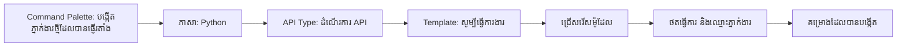
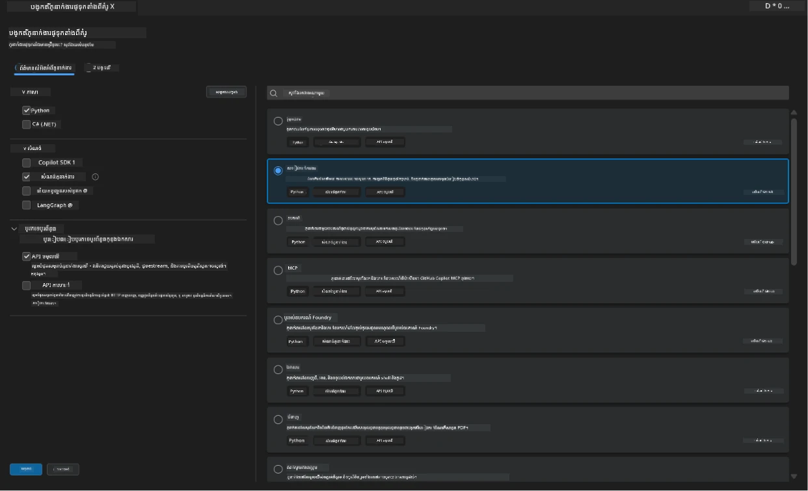
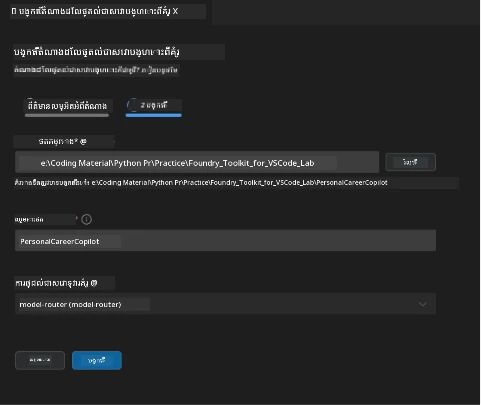

# មូឌុល 2 - រៀបចំគម្រោង Multi-Agent

⏱️ ~5 នាទី

ក្នុងមូឌូលនេះ អ្នកប្រើប្រាស់ [Foundry Toolkit for VS Code](https://aka.ms/foundrytk) ដើម្បី **រៀបចំគម្រោង multi-agent**។ វឌីហ្សាមួយនេះបង្កើត `agent.yaml`, `main.py`, `Dockerfile`, `requirements.txt`, `.env`, និងការកំណត់ VS Code debug - ដូច្នេះអ្នកអាចផ្តោតលើការតភ្ជាប់ workflow 4-agent ក្នុងមូឌុល 3។

> **មន្ដសំខាន់:** Scaffold គឺជាស្តាប់ការងារដែលមានភ្នាក់ងារមួយ។ អ្នកជំនួសតុល្យភាព placeholder ជាមួយក្រាហ្វ `WorkflowBuilder` ក្នុងមូឌុល 3។ អ្នកមិនចាំបាច់សរសេរកូដ boilerplate ពីដើមឡើយ។

> **អនុវត្តន៍យោង:** [`PersonalCareerCopilot/`](../../../../../workshop/lab02-multi-agent/PersonalCareerCopilot) គឺជាឧទាហរណ៍ពេញលេញដែលដំណើរការបាន។ ប្រើវាដើម្បីប្រៀបធៀបការងាររបស់អ្នកក្រោយមក។

### ដំណើរការស្គាល់វីហ្សាត scaffold


```mermaid
flowchart LR
    A[Command Palette: បង្កើតភ្នាក់ងារថ្មីដែលបានផ្ញើរតាំង] --> B[ភាសា: Python]
    B --> C[API Type: ដំណើរការ API]
    C --> D[Template: សូម្បីធ្វើការងារ]
    D --> E[ជ្រើសរើសម៉ូដែល]
    E --> F[ថតធ្វើការ និងឈ្មោះភ្នាក់ងារ]
    F --> G[គម្រោងដែលបានបង្កើត]
```

---

## ជំហានទី 1៖ បើកវីហ្សាតបង្កើតភ្នាក់ងារប្រភេទ Hosted Agent

1. ចុច `Ctrl+Shift+P` ដើម្បីបើក **Command Palette**។
2. បញ្ចូល: **Foundry Toolkit: Create a New Hosted Agent** និងជ្រើសរើសវា។
3. វីហ្សាតបើកនៅផ្ទាំង **Agent Details**។

> **ជម្រើសជំនួស:** ចុចរូបតំណាង **Foundry Toolkit** នៅ Activity Bar → ចុចរូបតំណាង **+** នៅក្បែរជួរឈរ **Hosted Agents** → **Create New Hosted Agent**។

---

## ជំហានទី 2៖ ជ្រើសការកំណត់



1. នៅផ្នែកជំរើស/នាវាកម្មនៅខាងឆ្វេង ជ្រើសរើសជា​ដូចតទៅ៖

| តារាងម៉ឺនុយ | ជម្រើស | កំណត់ចំណាំ |
|--------|-----------|-------|
| **ភាសា** | Python | ក៏គាំទ្រ C# (.NET) ផងដែរ |
| **ស៊ុមគុណ** | Agent Framework | ផ្ដល់ `Agent`, `AgentExecutor`, `WorkflowBuilder` |
| **ប្រភេទ API** | Response API | `POST /responses` - ប្រវត្តិគ្រប់គ្រងដោយវេទិកា, គាំទ្រស្ទ្រីមមីង |
| **គំរូ** | **Workflows** | ដំណើរការសំណើរតាមរយៈភ្នាក់ងារច្រើនជាលំដាប់ |

2. បន្ទាប់ពីបានជ្រើសរើស ចុច **Next**



3. នៅវីនដូបន្ទាប់ជ្រើសរើសដូចខាងក្រោម៖

| តារាងម៉ឺនុយ | ជម្រើស | កំណត់ចំណាំ |
|--------|-----------|-------|
| **ថតកន្លែងធ្វើការ** | រុករកទៅថតគោលដៅ | ឧទាហរណ៍ `workshop/lab02-multi-agent/` នៅក្នុង repo នេះ |
| **ឈ្មោះភ្នាក់ងារ** | `PersonalCareerCopilot` | នេះក្លាយជាឈ្មោះថតគម្រោង |
| **ការដាក់បញ្ជូនម៉ូដែល** | ជ្រើសម៉ូដែលដែលអ្នកបានដាក់បញ្ចូន | ឧទាហរណ៍ `gpt-4.1-mini` ពី Lab 01 |

4. ចុច **Create** ដើម្បីរៀបចំគម្រោង។ VS Code បង្កើតឯកសារនិងបើកថត។

> **​ជំនួយ៖** [`gpt-4.1-mini`](https://learn.microsoft.com/azure/foundry/foundry-models/concepts/models-sold-directly-by-azure#gpt-41-series) តុល្យភាពល្អរវាងល្បឿននិងគុណភាពសម្រាប់ការអភិវឌ្ឍ multi-agent។

---

## ជំហានទី 3៖ ពិនិត្យគម្រោងដែលបានបង្កើត

បន្ទាប់ពីរៀបចំរួច សូមធ្វើការ បញ្ជាក់ថា អ្នកឃើញឯកសារ​ទាំងនេះក្នុង Explorer (`Ctrl+Shift+E`)៖

```
📂 <your-agent-name>/
├── .azdignore          ← Files excluded from Azure Developer CLI deployments
├── .dockerignore       ← Files excluded from Docker builds
├── .env                ← Environment variables (placeholders - fill in Module 3)
├── .vscode/
│   ├── launch.json     ← Debug config (F5 → run + Agent Inspector)
│   └── tasks.json      ← VS Code task definitions
├── agent.yaml          ← Agent definition (kind: hosted, protocol: responses)
├── Dockerfile          ← Container config for deployment
├── main.py             ← Stub agent entry point (replace with WorkflowBuilder in Module 3)
└── requirements.txt    ← Python dependencies
```

> **សំខាន់៖** បើកថត scaffolded នេះដោយផ្ទាល់ក្នុង VS Code ដើម្បីឲ្យ `.vscode/launch.json` និង `tasks.json` អាចអនុវត្តបានត្រឹមត្រូវសម្រាប់ ការប្រើប្រាស់ F5 debug។

### ឯកសារសំខាន់ៗអត្ថន័យ

| ឯកសារ | គោលបំណង |
|------|---------|
| `agent.yaml` | បញ្ជាក់ `kind: hosted`, ផ្គូផ្គងស្រមោល env vars, កំណត់ប្រភេទ `/responses` protocol |
| `main.py` | Stub: មានតែ `FoundryChatClient` → `Agent` → `ResponsesHostServer` តែមួយ។ អ្នកជំនួសវាជាមួយភ្នាក់ងារបួន + `WorkflowBuilder` ក្នុងមូឌុល 3 |
| `Dockerfile` | `python:3.12-slim`, តំឡើង `requirements.txt`, បង្ហាញ port 8088, រំកិល `python main.py` |
| `requirements.txt` | `agent-framework-foundry`, `agent-framework-foundry-hosting`, `mcp<2,>=1.24.0`, `debugpy` |

> **យោង៖** មើល [`PersonalCareerCopilot/agent.yaml`](../../../../../workshop/lab02-multi-agent/PersonalCareerCopilot/agent.yaml) និង [`PersonalCareerCopilot/requirements.txt`](../../../../../workshop/lab02-multi-agent/PersonalCareerCopilot/requirements.txt) សម្រាប់ខ្លឹមសារបំពេញលេញ។

---

### ✅ ចំណុចពិនិត្យ

- [ ] បានបញ្ចប់វីហ្សាត scaffold - បណ្ណាល័យគម្រោងថ្មីឃើញនៅ Explorer
- [ ] មានឯកសារដែលចាំបាច់ទាំងអស់៖ `agent.yaml`, `main.py`, `Dockerfile`, `requirements.txt`, `.env`
- [ ] `agent.yaml` បង្ហាញ `kind: hosted` និង `protocol: responses`
- [ ] `main.py` នាំចូល `Agent`, `FoundryChatClient`, `ResponsesHostServer`
- [ ] ថត scaffolded បានបើកជារមូលហេដ្ឋារចនាសម្ព័ន្ធ VS Code workspace
- [ ] អ្នកយល់ថា `main.py` ជាstub - `WorkflowBuilder` នឹងត្រូវបានបញ្ចូលក្នុងមូឌុល 3

---

**មុននេះ:** [01 - យល់ពីរចនាសម្ព័ន្ធ Multi-Agent](01-understand-multi-agent.md) · **បន្ទាប់:** [03 - កំណត់ Agents និងបរិស្ថាន →](03-configure-agents.md)

---

<!-- CO-OP TRANSLATOR DISCLAIMER START -->
**ការបដិសេធ**:
ឯកសារនេះត្រូវបានបម្លែងភាសា ដោយប្រើសេវាបម្លែងភាសា AI [Co-op Translator](https://github.com/Azure/co-op-translator)។ ទោះយើងខ្ញុំមានក្តីប្រាថ្នាឱ្យបានច្បាស់លាស់ តែសូមយល់ដឹងថាការបម្លែងដោយស្វ័យប្រវត្តិក៏អាចមានកំហុសឬភាពមិនត្រឹមត្រូវ។ ឯកសារដើមជាភាសាទីតាំងគួរត្រូវបានគេប្រើជាប្រភពច្បាស់លាស់។ សម្រាប់ព័ត៌មានសំខាន់ៗ សូមណែនាំឱ្យប្រើប្រាស់ការប្រែដោយមនុស្សជំនាញ។ យើងខ្ញុំមិនទទួលខុសត្រូវចំពោះការយល់ច្រឡំ ឬការបកស្រាយខុសបន្ទាប់ពីការប្រើប្រាស់ការបម្លែងនេះនោះទេ។
<!-- CO-OP TRANSLATOR DISCLAIMER END -->