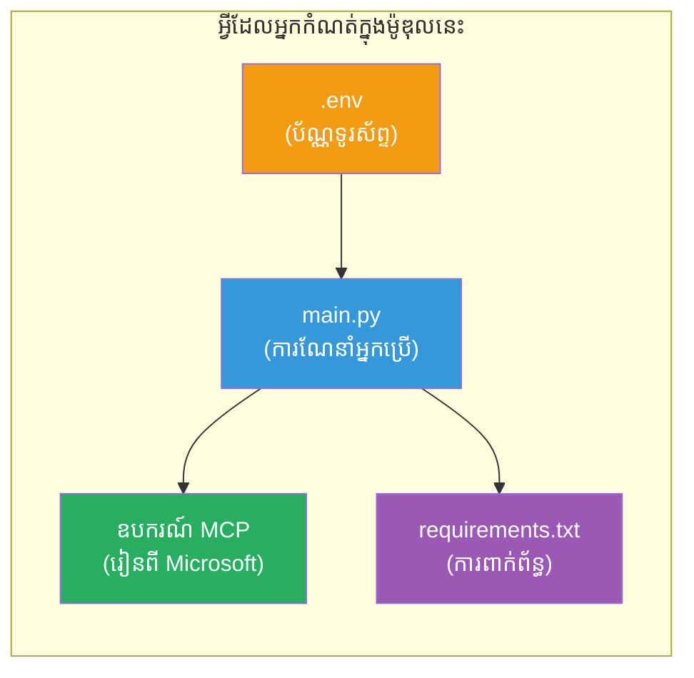

# ម៉ូឌុល 3 - កំណត់រចនាសម្ព័ន្ធភ្នាក់ងារ ដំណើរការ MCP និងបរិយាកាស

នៅក្នុងម៉ូឌុលនេះ អ្នកប្តូរតាមតម្រូវការលើគម្រោងភ្នាក់ងារច្រើនដែលបានបង្កើតជាលំនាំដើម។ អ្នកនឹងសរសេរណែនាំសម្រាប់ភ្នាក់ងារទាំងបួន កំណត់ដំណើរការ MCP សម្រាប់ Microsoft Learn កំណត់អថេរបរិយាកាស និងដំឡើងការពឹងផ្អែក។


> **យោង**៖ កូដដែលដំណើរការពេញលេញស្ថិតក្នុង [`PersonalCareerCopilot/main.py`](../../../../../workshop/lab02-multi-agent/PersonalCareerCopilot/main.py)។ ប្រើវាជាការយោងខណៈកំពុងសាងសង់របស់អ្នក។

---

## ជំហានទី 1: កំណត់អថេរបរិយាកាស

1. បើកឯកសារ **`.env`** នៅក្នុងថាសគម្រោងរបស់អ្នក។
2. បញ្ចូលព័ត៌មានរាល់គម្រោង Foundry របស់អ្នក៖

   ```env
   PROJECT_ENDPOINT=https://<your-account>.services.ai.azure.com/api/projects/<your-project>
   MODEL_DEPLOYMENT_NAME=gpt-4.1-mini
   ```

3. រក្សាទុកឯកសារ។

### ទីតាំងដែលត្រូវស្វែងរកតម្លៃទាំងនេះ

| តម្លៃ | របៀបស្វែងរក |
|-------|---------------|
| **ចំណុចផលិតផលគម្រោង** | បន្ទាត់តម្រង Foundry របស់ Microsoft → ចុចលើគម្រោងរបស់អ្នក → URL ចំណុចផលិតផលក្នុងទស្សនារូបភាពលម្អិត |
| **ឈ្មោះការតែងចេញម៉ូដែល** | បន្ទាត់តម្រង Foundry → ពង្រីកគម្រោង → **ម៉ូដែល + ចំណុចផលិតផល** → ឈ្មោះនៅជាប់នឹងម៉ូដែលដែលបានចេញផ្សាយ |

> **សុវត្ថិភាព**៖ កុំប្តូរឯកសារ `.env` ទៅកាន់ការត្រួតពិនិត្យកំណែ។ បន្ថែមវាចូលក្នុង `.gitignore` ប្រសិនបើមិនមាននៅទីនោះ។

### ផែនទីអថេរបរិយាកាស

កម្មវិធីភ្នាក់ងារច្រើន `main.py` អានឈ្មោះអថេរបរិយាកាសទាំងស្តង់ដារ និងកំណែបង្ហាញពិព័រណ៍ទាំងពីរ៖

```python
PROJECT_ENDPOINT = os.getenv("AZURE_AI_PROJECT_ENDPOINT") or os.getenv("PROJECT_ENDPOINT")
MODEL_DEPLOYMENT_NAME = os.getenv(
    "AZURE_AI_MODEL_DEPLOYMENT_NAME",
    os.getenv("MODEL_DEPLOYMENT_NAME", "gpt-4.1-mini"),
)
MICROSOFT_LEARN_MCP_ENDPOINT = os.getenv(
    "MICROSOFT_LEARN_MCP_ENDPOINT", "https://learn.microsoft.com/api/mcp"
)
```

ចំណុចផ្ដើម MCP មានតម្លៃលំនាំដើមល្អហើយ - អ្នកមិនបាច់កំណត់វានៅក្នុង `.env` លុចក្រៅលើវានៅពេលចាំបាច់ទេ។

---

## ជំហានទី 2: សរសេរណែនាំភ្នាក់ងារ

នេះគឺជាជំហានសំខាន់បំផុត។ ហើយភ្នាក់ងារនីមួយៗត្រូវការណែនាំដែលបានរៀបចំយ៉ាងម៉ត់ចត់ ដែលកំណត់តួនាទី របៀបទិន្នផល និងច្បាប់របស់វា។ បើកឯកសារ `main.py` ហើយបង្កើត (ឬកែប្រែ) អថេរណែនាំ។

### 2.1 ភ្នាក់ងារពិនិត្យប្រវត្តិរូប

```python
RESUME_PARSER_INSTRUCTIONS = """\
You are the Resume Parser.
Extract resume text into a compact, structured profile for downstream matching.

Output exactly these sections:
1) Candidate Profile
2) Technical Skills (grouped categories)
3) Soft Skills
4) Certifications & Awards
5) Domain Experience
6) Notable Achievements

Rules:
- Use only explicit or strongly implied evidence.
- Do not invent skills, titles, or experience.
- Keep concise bullets; no long paragraphs.
- If input is not a resume, return a short warning and request resume text.
"""
```

**ហេតុអ្វីបានជាផ្នែកទាំងនេះ?** MatchingAgent ត្រូវការទិន្នន័យដែលមានរចនាសម្ព័ន្ធដើម្បីពិនិត្យតំលៃ។ ផ្នែកលំអិតធ្វើឲ្យការបញ្ជូនរវាងភ្នាក់ងារជាប់ទាក់ទងជាអចលន៍បាន។

### 2.2 ភ្នាក់ងារពណ៌នាការងារ

```python
JOB_DESCRIPTION_INSTRUCTIONS = """\
You are the Job Description Analyst.
Extract a structured requirement profile from a JD.

Output exactly these sections:
1) Role Overview
2) Required Skills
3) Preferred Skills
4) Experience Required
5) Certifications Required
6) Education
7) Domain / Industry
8) Key Responsibilities

Rules:
- Keep required vs preferred clearly separated.
- Only use what the JD states; do not invent hidden requirements.
- Flag vague requirements briefly.
- If input is not a JD, return a short warning and request JD text.
"""
```

**ហេតុអ្វីបានណែនាំចំរើនជំនាញចាំបាច់ និងចំណូលចិត្តផ្សេងគ្នា?** MatchingAgent ប្រើទំងន់ផ្សេងគ្នាសម្រាប់គ្រប់មួយ (ជំនាញចាំបាច់ = 40 ពិន្ទុ, ជំនាញចំណូលចិត្ត = 10 ពិន្ទុ)។

### 2.3 ភ្នាក់ងារស្វែងរកតំបន់ខ្វះខាត

```python
MATCHING_AGENT_INSTRUCTIONS = """\
You are the Matching Agent.
Compare parsed resume output vs JD output and produce an evidence-based fit report.

Scoring (100 total):
- Required Skills 40
- Experience 25
- Certifications 15
- Preferred Skills 10
- Domain Alignment 10

Output exactly these sections:
1) Fit Score (with breakdown math)
2) Matched Skills
3) Missing Skills
4) Partially Matched
5) Experience Alignment
6) Certification Gaps
7) Overall Assessment

Rules:
- Be objective and evidence-only.
- Keep partial vs missing separate.
- Keep Missing Skills precise; it feeds roadmap planning.
"""
```

**ហេតុអ្វីត្រូវអន្ទាក់ច្បាស់លាស់?** ពិន្ទុកដែលអាចចម្លងបានធ្វើឲ្យអាចប្រៀបធៀបចំពោះការរត់និងដោះស្រាយបញ្ហាបាន។ ចំណុច ១០០ គឺងាយស្រួលសម្រាប់អ្នកប្រើចុងក្រោយយល់។

### 2.4 ភ្នាក់ងារវិភាគចន្លោះ

```python
GAP_ANALYZER_INSTRUCTIONS = """\
You are the Gap Analyzer and Roadmap Planner.
Create a practical upskilling plan from the matching report.

Microsoft Learn MCP usage (required):
- For EVERY High and Medium priority gap, call tool `search_microsoft_learn_for_plan`.
- Use returned Learn links in Suggested Resources.
- Prefer Microsoft Learn for free resources.

CRITICAL: You MUST produce a SEPARATE detailed gap card for EVERY skill listed in
the Missing Skills and Certification Gaps sections of the matching report. Do NOT
skip or combine gaps. Do NOT summarize multiple gaps into one card.

Output format:
1) Personalized Learning Roadmap for [Role Title]
2) One DETAILED card per gap (produce ALL cards, not just the first):
   - Skill
   - Priority (High/Medium/Low)
   - Current Level
   - Target Level
   - Suggested Resources (include Learn URL from tool results)
   - Estimated Time
   - Quick Win Project
3) Recommended Learning Order (numbered list)
4) Timeline Summary (week-by-week)
5) Motivational Note

Rules:
- Produce every gap card before writing the summary sections.
- Keep it specific, realistic, and actionable.
- Tailor to candidate's existing stack.
- If fit >= 80, focus on polish/interview readiness.
- If fit < 40, be honest and provide a staged path.
"""
```

**ហេតុអ្វីបានជាអំណោយភាពគឺ "CRITICAL"?** ប្រសិនបើគ្មានណែនាំច្បាស់លាស់ឲ្យផលិតកាតចន្លោះទាំងអស់ ម៉ូដែលមានទំនោរបង្កើតតែ ១-២ កាតហើយសង្ខេបសម្រាប់ចន្លោះដែលនៅសល់។ កុំបទ "CRITICAL" បានទប់ស្កាត់ការកាត់បន្ថយនេះ។

---

## ជំហានទី 3: បញ្ជាក់ឧបករណ៍ MCP

GapAnalyzer ប្រើឧបករណ៍ដែលហៅទៅម៉ាស៊ីនមេ [Microsoft Learn MCP server](https://learn.microsoft.com/azure/foundry/agents/how-to/tools/model-context-protocol)។ បន្ថែមនេះទៅក្នុង `main.py`៖

```python
import json
from agent_framework import tool
from mcp.client.session import ClientSession
from mcp.client.streamable_http import streamable_http_client

@tool
async def search_microsoft_learn_for_plan(
    skill: str, role: str = "", max_results: int = 5
) -> str:
    """Search Microsoft Learn MCP and return curated official links for roadmap planning."""
    query = " ".join(part for part in [skill, role, "learning path module"] if part).strip()
    query = query or "job skills learning path"

    try:
        async with streamable_http_client(MICROSOFT_LEARN_MCP_ENDPOINT) as (
            read_stream, write_stream, _,
        ):
            async with ClientSession(read_stream, write_stream) as session:
                await session.initialize()
                result = await session.call_tool(
                    "microsoft_docs_search", {"query": query}
                )

        if not result.content:
            return (
                "No results returned from Microsoft Learn MCP. "
                "Fallback: https://learn.microsoft.com/training/support/catalog-api"
            )

        payload_text = getattr(result.content[0], "text", "")
        data = json.loads(payload_text) if payload_text else {}
        items = data.get("results", [])[:max(1, min(max_results, 10))]

        if not items:
            return f"No direct Microsoft Learn results found for '{skill}'."

        lines = [f"Microsoft Learn resources for '{skill}':"]
        for i, item in enumerate(items, start=1):
            title = item.get("title") or item.get("url") or "Microsoft Learn Resource"
            url = item.get("url") or item.get("link") or ""
            lines.append(f"{i}. {title} - {url}".rstrip(" -"))
        return "\n".join(lines)
    except Exception as ex:
        return (
            f"Microsoft Learn MCP lookup unavailable. Reason: {ex}. "
            "Fallbacks: https://learn.microsoft.com/api/mcp"
        )
```

### របៀបការងារឧបករណ៍

| ជំហាន | អ្វីដែលកើតឡើង |
|------|-------------|
| 1 | GapAnalyzer សន្និដ្ឋានថាត្រូវការតម្រូវការសម្រាប់ជំនាញមួយ (ឧ. "Kubernetes") |
| 2 | ស៊ុមថ្នាលហៅ `search_microsoft_learn_for_plan(skill="Kubernetes")` |
| 3 | មុខងារ បើកការតភ្ជាប់ [Streamable HTTP](https://learn.microsoft.com/agent-framework/agents/tools/hosted-mcp-tools) ទៅ `https://learn.microsoft.com/api/mcp` |
| 4 | ហៅ `microsoft_docs_search` លើម៉ាស៊ីនមេ [MCP server](https://learn.microsoft.com/azure/foundry/agents/how-to/tools/model-context-protocol) |
| 5 | ម៉ាស៊ីនមេ MCP ត្រលប់លទ្ធផលស្វែងរក (ចំណងជើង + URL) |
| 6 | មុខងារ រៀបចំលទ្ធផលជាបញ្ជីលេខ |
| 7 | GapAnalyzer បញ្ចូល URL ទៅក្នុងកាតចន្លោះ |

### ការពឹងផ្អែក MCP

បណ្ណាល័យម៉ាស៊ីនភ្ញាក់ MCP ត្រូវបានបញ្ចូលតាមរយៈ [`agent-framework-core`](https://learn.microsoft.com/agent-framework/overview/)។ អ្នកមិនត្រូវបន្ថែមវានៅក្នុង `requirements.txt` បន្ថែមទៀតទេ។ ប្រសិនបើជួបកំហុសនាំចូល សូមពិនិត្យ៖

```powershell
pip list | Select-String "mcp"
```

រំពឹងទុក៖ កញ្ចប់ `mcp` ត្រូវបានដំឡើង (ជំនាន់ 1.x ឬបន្ទាប់)។

---

## ជំហានទី 4: ចងភ្នាក់ងារ និងដំណើរការងារ

### 4.1 បង្កើតភ្នាក់ងារជាមួយអ្នកគ្រប់គ្រងបរិបទ

```python
from contextlib import asynccontextmanager

@asynccontextmanager
async def create_agents():
    async with (
        get_credential() as credential,
        AzureAIAgentClient(
            project_endpoint=PROJECT_ENDPOINT,
            model_deployment_name=MODEL_DEPLOYMENT_NAME,
            credential=credential,
        ).as_agent(
            name="ResumeParser",
            instructions=RESUME_PARSER_INSTRUCTIONS,
        ) as resume_parser,
        AzureAIAgentClient(
            project_endpoint=PROJECT_ENDPOINT,
            model_deployment_name=MODEL_DEPLOYMENT_NAME,
            credential=credential,
        ).as_agent(
            name="JobDescriptionAgent",
            instructions=JOB_DESCRIPTION_INSTRUCTIONS,
        ) as jd_agent,
        AzureAIAgentClient(
            project_endpoint=PROJECT_ENDPOINT,
            model_deployment_name=MODEL_DEPLOYMENT_NAME,
            credential=credential,
        ).as_agent(
            name="MatchingAgent",
            instructions=MATCHING_AGENT_INSTRUCTIONS,
        ) as matching_agent,
        AzureAIAgentClient(
            project_endpoint=PROJECT_ENDPOINT,
            model_deployment_name=MODEL_DEPLOYMENT_NAME,
            credential=credential,
        ).as_agent(
            name="GapAnalyzer",
            instructions=GAP_ANALYZER_INSTRUCTIONS,
            tools=[search_microsoft_learn_for_plan],
        ) as gap_analyzer,
    ):
        yield resume_parser, jd_agent, matching_agent, gap_analyzer
```

**ចំណុចសំខាន់៖**
- ភ្នាក់ងារនីមួយៗមានវត្ថុ `AzureAIAgentClient` ផ្ទាល់ខ្លួន
- មានតែ GapAnalyzer ទទួលបាន `tools=[search_microsoft_learn_for_plan]`
- `get_credential()` ត្រលប់ [`ManagedIdentityCredential`](https://learn.microsoft.com/python/api/overview/azure/identity-readme#managed-identity-support) នៅ Azure និង [`DefaultAzureCredential`](https://learn.microsoft.com/azure/developer/python/sdk/authentication/credential-chains#defaultazurecredential-overview) នៅក្នុងកុំព្យូទ័រប្រព័ន្ធមូលដ្ឋាន

### 4.2 សាងសង់ក្រាហ្វ្ផតិកម្ម

```python
def create_workflow(resume_parser, jd_agent, matching_agent, gap_analyzer):
    workflow = (
        WorkflowBuilder(
            name="ResumeJobFitEvaluator",
            start_executor=resume_parser,
            output_executors=[gap_analyzer],
        )
        .add_edge(resume_parser, jd_agent)
        .add_edge(resume_parser, matching_agent)
        .add_edge(jd_agent, matching_agent)
        .add_edge(matching_agent, gap_analyzer)
        .build()
    )
    return workflow.as_agent()
```

> មើល [Workflows as Agents](https://learn.microsoft.com/agent-framework/workflows/as-agents) ដើម្បីយល់ពីព្រឹត្តិការណ៍ `.as_agent()` ។

### 4.3 ចាប់ផ្តើមម៉ាស៊ីនមេ

```python
async def main() -> None:
    validate_configuration()
    async with create_agents() as (resume_parser, jd_agent, matching_agent, gap_analyzer):
        agent = create_workflow(resume_parser, jd_agent, matching_agent, gap_analyzer)
        from azure.ai.agentserver.agentframework import from_agent_framework
        await from_agent_framework(agent).run_async()

if __name__ == "__main__":
    asyncio.run(main())
```

---

## ជំហានទី 5: បង្កើត និងបើកបរិយាកាសវាគ្មិន

### 5.1 បង្កើតបរិយាកាស

```powershell
cd workshop\lab02-multi-agent\PersonalCareerCopilot
python -m venv .venv
```

### 5.2 បើកវា

**PowerShell (Windows):**
```powershell
.\.venv\Scripts\Activate.ps1
```

**macOS/Linux:**
```bash
source .venv/bin/activate
```

### 5.3 ដំឡើងការពឹងផ្អែក

```powershell
pip install -r requirements.txt
```

> **ចំណាំ៖** បន្ទាត់ `agent-dev-cli --pre` នៅក្នុង `requirements.txt` ធានាថា លំនាំប្រដាប់ពិសោធថ្មីបំផុតត្រូវបានដំឡើង។ នេះត្រូវការសម្រាប់ការអនុវត្តន៍ជាមួយ `agent-framework-core==1.0.0rc3`។

### 5.4 ធ្វើតេស្តការដំឡើង

```powershell
pip list | Select-String "agent-framework|agentserver|agent-dev"
```

លទ្ធផលដែលរំពឹងទុក៖
```
agent-dev-cli                  0.0.1b260316
agent-framework-azure-ai       1.0.0rc3
agent-framework-core            1.0.0rc3
azure-ai-agentserver-agentframework 1.0.0b16
azure-ai-agentserver-core      1.0.0b16
```

> **ប្រសិនបើ `agent-dev-cli` បង្ហាញជំនាន់ចាស់** (ឧ. `0.0.1b260119`), Agent Inspector នឹងមានកំហុស 403/404។ ធ្វើបច្ចុប្បន្នភាព៖ `pip install agent-dev-cli --pre --upgrade`

---

## ជំហានទី 6: ពិនិត្យការផ្ទៀងផ្ទាត់អត្តសញ្ញាណ

រត់ការត្រួតពិនិត្យផ្ទៀងផ្ទាត់ដូចក្នុង Lab 01៖

```powershell
az account show --query "{name:name, id:id}" --output table
```

ប្រសិនបើបរាជ័យ សូមរត់ [`az login`](https://learn.microsoft.com/cli/azure/authenticate-azure-cli-interactively)។

សម្រាប់ដំណើរការវគ្គភ្នាក់ងារច្រើន ភ្នាក់ងារទាំងបួនចែករំលែកអត្តសញ្ញាណដូចគ្នា។ ប្រសិនបើផ្ទៀងផ្ទាត់បានសំរាប់មួយ នោះគឺបានសម្រាប់ទាំងអស់។

---

### ពិនិត្យចុងក្រោយ

- [ ] `.env` មានតម្លៃ `PROJECT_ENDPOINT` និង `MODEL_DEPLOYMENT_NAME` ត្រឹមត្រូវ
- [ ] អថេរណែនាំភ្នាក់ងារទាំង ៤ ត្រូវបានកំណត់ក្នុង `main.py` (ResumeParser, JD Agent, MatchingAgent, GapAnalyzer)
- [ ] ឧបករណ៍ MCP `search_microsoft_learn_for_plan` ត្រូវបានកំណត់ និងចុះបញ្ជីជាប់ GapAnalyzer
- [ ] `create_agents()` បង្កើតភ្នាក់ងារទាំង ៤ ជាមួយវត្ថុ `AzureAIAgentClient` ផ្ទាល់ខ្លួន
- [ ] `create_workflow()` សាងសង់ក្រាហ្វសម្រាប់ការងារពិតជាមួយ `WorkflowBuilder`
- [ ] បរិយាកាសវីរុស្សើ (virtual environment) ត្រូវបានបង្កើត និងបើក (មាន `(.venv)` មើលឃើញ)
- [ ] `pip install -r requirements.txt` សម្រេចដោយគ្មានកំហុស
- [ ] `pip list` បង្ហាញកញ្ចប់រង់ចាំទាំងអស់ក្នុងជំនាន់ត្រឹមត្រូវ (rc3 / b16)
- [ ] `az account show` ត្រលប់ការជាវរបស់អ្នក

---

**ពីមុន៖** [02 - Scaffold Multi-Agent Project](02-scaffold-multi-agent.md) · **បន្ទាប់៖** [04 - Orchestration Patterns →](04-orchestration-patterns.md)

---

<!-- CO-OP TRANSLATOR DISCLAIMER START -->
**ការបដិសេធ**៖  
ឯកសារនេះត្រូវបានបកប្រែដោយប្រើសេវាកម្មបកប្រែ AI [Co-op Translator](https://github.com/Azure/co-op-translator)។ បើទោះបីយើងគ្រប់គ្រងការត្រឹមត្រូវក៏ដោយ សូមចំណាំថាការបកប្រែដោយស្វ័យប្រវត្តិអាចមានកំហុស ឬការប្រកាន់ខុស។ ឯកសារដើមក្នុងភាសាដើមគួរត្រូវបានទទួលស្គាល់ថាជា ប្រភពមានសុពលភាព។ សម្រាប់ព័ត៌មានសំខាន់ៗ យើងផ្ដល់អនុសាសន៍ឱ្យប្រើការបកប្រែដោយមនុស្សជំនាញ។ យើងមិនទទួលបន្ទុកចំពោះការយល់ច្រឡំ ឬការបកប្រែខុសពីការប្រើប្រាស់ការបកប្រែនេះឡើយ។
<!-- CO-OP TRANSLATOR DISCLAIMER END -->