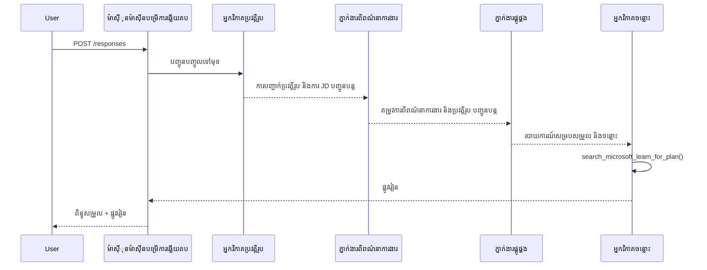

# ម៉ូឌុល 3 - កំណត់ការណែនាំ បរិយាកាស និង ដំឡើងកម្មវិធីអាស្រ័យ

⏱️ ~15 នាទី

ក្នុងមូឌុលនេះ អ្នកបំលែងស្ទុបដែលបានរៀបចំជាមូលដ្ឋានទៅជាដំណើរការអ្នកប្រតិបត្តិការច្រើនរបស់ **អ្នក** ដោយកំណត់អថេរបរិយាកាស សរសេរការណែនាំភ្នាក់ងារ បន្ថែមឧបករណ៍ MCP ខ្សែស្រឡាយដំណើរការ និងដំឡើងកម្មវិធីអាស្រ័យ។

> **យោង៖** កូដដំណើរការពេញលេញមាននៅក្នុង [`PersonalCareerCopilot/main.py`](../../../../../workshop/lab02-multi-agent/PersonalCareerCopilot/main.py)។ ប្រើវាជាគំរូនៅពេលសាងសង់ខ្សែស្រឡាយដំណើរការអ្នកប្រតិបត្តិការរបស់អ្នក និងប្លុកពេញបំពេញ។

---

## របៀបដែលភ្នាក់ងារចំនួនបួនត្រូវបានភ្ជាប់គ្នា


```mermaid
sequenceDiagram
    participant User
    participant Server as ម៉ាស៊ីុនម៉ាស៊ីនបម្រើការឆ្លើយតប
    participant RP as អ្នកវិភាគប្រវត្តិរូប
    participant JD as ភ្នាក់ងារពិពណ៌នាការងារ
    participant MA as ភ្នាក់ងារផ្គូផ្គង
    participant GA as អ្នកវិភាគចន្លោះ

    User->>Server: POST /responses
    Server->>RP: បញ្ជូនបញ្ចូលទៅមុខ
    RP-->>JD: ការបញ្ជាក់ប្រវត្តិរូប និងការ JD បញ្ជូនបន្ត
    JD-->>MA: តម្រូវការពិពណ៌នាការងារ និងប្រវត្តិរូប បញ្ជូនបន្ត
    MA-->>GA: របាយការណ៍សម្របសម្រួល និងចន្លោះ
    GA->>GA: search_microsoft_learn_for_plan()
    GA-->>Server: ផ្លូវរៀន
    Server-->>User: ពិន្ទុសម្រួល + ផ្លូវរៀន
```

---

## ជំហានទី 1៖ កំណត់អថេរបរិយាកាស

1. បើកឯកសារ **`.env`** នៅក្នុងឫសគម្រោងរបស់អ្នក (ដែលបានបង្កើតដោយប្រដាប់ប្រដាការរៀបចំ)។
2. ប្តូរផ្នែកប្រើប្រាស់ជាមួយតម្លៃពិតពីពិសោធន៍របស់អ្នកក្នុងមេរៀន 01។

<details open>
<summary><strong>🅰️ ផ្លូវ A - ជាវ Foundry</strong></summary>

```env
FOUNDRY_PROJECT_ENDPOINT=https://<your-account>.services.ai.azure.com/api/projects/<your-project>
AZURE_AI_MODEL_DEPLOYMENT_NAME=gpt-4.1-mini
```

> **ទីកន្លែងរកតម្លៃ៖** មើល [Lab 01, Module 1](../../lab01-single-agent/docs/01-setup.md#deploy-a-model--assign-rbac)។

</details>

<details open>
<summary><strong>🅱️ ផ្លូវ B - Foundry ស្រុក</strong></summary>

```env
FOUNDRY_PROJECT_ENDPOINT=http://localhost:5273/v1
AZURE_AI_MODEL_DEPLOYMENT_NAME=phi-4-mini
```

> ការវិភាគទាំងអស់បានដំណើរការនៅលើម៉ាស៊ីនរបស់អ្នក - ព័ត៌មានមិនធ្លាក់ចេញពីឧបករណ៍។ ប្រតិបត្ដិ `foundry model list` ដើម្បីបញ្ជាក់ឈ្មោះម៉ូដែលត្រឹមត្រូវ។ សំណើទៅក្រៅតែមួយគត់គឺការហៅឧបករណ៍ MCP ទៅ `https://learn.microsoft.com/api/mcp`។

> **ទីកន្លែងរកតម្លៃ៖** មើល [Lab 01, Module 1 - ផ្លូវក្នុងស្រុក](../../lab01-single-agent/docs/01-setup.md#step-2-set-up-based-on-your-access)។

</details>

> **សុវត្ថិភាព៖** កុំធ្វើការបញ្ចូល `.env` ទៅក្នុងការត្រួតពិនិត្យកំណត់ចិត្ត។ វារួចហើយគួរត្រូវបានសរសេរនៅក្នុង `.gitignore`។

---

## ជំហានទី 2៖ សរសេរការណែនាំភ្នាក់ងារ

ការណែនាំកំណត់តួនាទីនៃភ្នាក់ងារនីមួយៗ ទ្រង់ទ្រាយចេញលទ្ធផល និងច្បាប់។ បើក `main.py` ហើយកំណត់ (ឬជំនួស) ខូស្តង់តិចការណែនាំ ៤គ្រាប់ - ខ្សែពេញនៅក្នុង [`PersonalCareerCopilot/main.py`](../../../../../workshop/lab02-multi-agent/PersonalCareerCopilot/main.py)។

### 2.1 `RESUME_PARSER_INSTRUCTIONS`
វាផ្ទុកប្រវត្តិរូបទៅជាគណនីដៃគូដែលមានរចនាសម្ព័ន្ធ **និង** ចម្លងពិពណ៌នាការងារយ៉ាងដាច់ចូលទៅក្នុង `[JOB DESCRIPTION PASS-THROUGH]`។ ផ្នែកទាំងពីរដែលមានស្លាកត្រូវតែបង្ហាញនៅក្នុងលទ្ធផល។

> **ហេតុអ្វីបានជា pass-through?** ជាមួយ `context_mode="last_agent"` ResumeParser គឺជាភ្នាក់ងារតែមួយដែលឃើញសារប្រើប្រាស់ដើម។ ប្រសិនបើវាមិនចម្លង JD ឆ្លងទៅក្រោយទេ ភ្នាក់ងារទៀតនៅក្រោមមិនដែលឃើញវាទេ។

### 2.2 `JOB_DESCRIPTION_INSTRUCTIONS`
អាន `[PARSED RESUME]` និង `[JOB DESCRIPTION PASS-THROUGH]` ពីលទ្ធផល ResumeParser។ ចេញផ្សាយ `[JD REQUIREMENTS]` (ទាមទារត្រូវបានរចនា) និង `[PARSED RESUME PASS-THROUGH]` (ចម្លងប្រវត្តិរូបដั้งដាច់សម្រាប់ MatchingAgent)។

### 2.3 `MATCHING_AGENT_INSTRUCTIONS`
អាន `[JD REQUIREMENTS]` និង `[PARSED RESUME PASS-THROUGH]`។ ផលិតរបាយការណ៍ផ្គូផ្គងពិន្ទុ (0–100) រួមមាន គណិតវិធីបំបែក សមត្ថភាពផ្គូផ្គង អត់សមត្ថភាព និងការតំរូវបទពិសោធន៍។

### 2.4 `GAP_ANALYZER_INSTRUCTIONS`
អានរបាយការណ៍ផ្គូផ្គង។ សម្រាប់សមត្ថភាពអត់មាននីមួយៗហៅ `search_microsoft_learn_for_plan` ដើម្បីយកធនធានរៀនពី Microsoft Learn។ ក่อតំបន់ខ្វះលម្អិតមួយសម្រាប់ម្ដងហើយផែនការរៀនប្រចាំសប្តាហ៍មួយ។

---

## ជំហានទី 3៖ បន្ថែមឧបករណ៍ MCP

GapAnalyzer ហៅម៉ាស៊ីនបម្រើ [Microsoft Learn MCP](https://learn.microsoft.com/azure/foundry/agents/how-to/tools/model-context-protocol) ដើម្បីយកធនធានរៀនពិតសម្រាប់សមត្ថភាពខ្វះនីមួយៗ។ លំហូរ `search_microsoft_learn_for_plan` ពេញលេញមាននៅក្នុង [`PersonalCareerCopilot/main.py`](../../../../../workshop/lab02-multi-agent/PersonalCareerCopilot/main.py)។

ចុះបញ្ជីឧបករណ៍នៅលើ GapAnalyzer ពេលបង្កើតភ្នាក់ងារ៖

```python
gap_analyzer = Agent(
    client=client,
    instructions=GAP_ANALYZER_INSTRUCTIONS,
    name="GapAnalyzer",
    tools=[search_microsoft_learn_for_plan],
)
```

> មើល [`PersonalCareerCopilot/main.py`](../../../../../workshop/lab02-multi-agent/PersonalCareerCopilot/main.py) សម្រាប់ខ្សែបណ្តាញ `WorkflowBuilder` ពេញលេញជាមួយ `FoundryChatClient`, `AgentExecutor`, និងការហៅ `add_edge()` ទាំងអស់។

---

## ជំហានទី 4៖ បង្កើតបរិយាកាសវេរូច័រណល និងដំឡើងកម្មវិធីអាស្រ័យ

> ⚠️ **កុំរំលងជំហាននេះ។** គ្មានកម្មវិធីអាស្រ័យដំឡើង, ការបញ្ឆោតកូដ F5 នឹងបរាជ័យ។

### 4.1 បង្កើតបរិយាកាសវេរូច័រណល

```powershell
python -m venv .venv
```

### 4.2 បើកវា

| ប្រព័ន្ធប្រតិបត្តិការ | ពាក្យបញ្ជា |
|----|---------|
| **Windows (PowerShell)** | `.\.venv\Scripts\Activate.ps1` |
| **Windows (CMD)** | `.venv\Scripts\activate.bat` |
| **macOS / Linux** | `source .venv/bin/activate` |

អ្នកគួរតែឃើញ `(.venv)` នៅក្នុងការផ្តើមបន្ទាត់បញ្ជារបស់អ្នក។

### 4.3 ដំឡើងកម្មវិធីអាស្រ័យ

```powershell
pip install -r requirements.txt
```

### 4.4 ផ្ទៀងផ្ទាត់

```powershell
pip list | Select-String "agent-framework|mcp|debugpy"
```

យល់ព្រម: `agent-framework-foundry`, `agent-framework-foundry-hosting`, `mcp`, និង `debugpy` ត្រូវបានរាយនាម។

---

## ជំហានទី 5៖ ផ្ទៀងផ្ទាត់ការផ្ទៀងផ្ទាត់

<details open>
<summary><strong>🅰️ ផ្លូវ A - សក្ខីប័ត្រ Azure</strong></summary>

```powershell
az account show --query "{name:name, id:id}" --output table
```

ប្រសិនបើបរាជ័យ ជំហាននេះ ដំណើរការ [`az login`](https://learn.microsoft.com/cli/azure/authenticate-azure-cli-interactively)។

ភ្នាក់ងារចំនួន៤​ចែករំលែក `FoundryChatClient` មួយ និង `DefaultAzureCredential` មួយ។ ប្រសិនបើការផ្ទៀងផ្ទាត់ដំណើរការល្អសម្រាប់មួយ ភ្នាក់ងារទាំងអស់នឹងដំណើរការល្អដែរ។

</details>

<details open>
<summary><strong>🅱️ ផ្លូវ B - Foundry ស្រុក</strong></summary>

មិនចាំបាច់មានការផ្ទៀងផ្ទាត់សម្រាប់ការសាកល្បងក្នុងស្រុកទេ។

</details>

---

### ✅ ចំណុចត្រួតពិនិត្យ

> កុំបន្តទៅម៉ូឌុល 04 រហូតដល់: **(1)** `(.venv)` ត្រូវឃើញនៅក្នុងបង្អួចបញ្ជារ AND **(2)** ការបញ្ចូល `pip install -r requirements.txt` បានជោគជ័យ។

- [ ] `.env` មានឈ្មោះច្រកចេញហើយនិងឈ្មោះម៉ូដែលដែលត្រឹមត្រូវ (មិនមែនជាផ្នែកប្រើប្រាស់ទេ)
- [ ] ខូស្តង់តិចការណែនាំភ្នាក់ងារ 4គ្រាប់ទាំងអស់កំណត់នៅ `main.py` (ResumeParser, JD Agent, MatchingAgent, GapAnalyzer)
- [ ] `search_microsoft_learn_for_plan` ឧបករណ៍ MCP កំណត់និងចុះបញ្ជីនៅលើ GapAnalyzer
- [ ] `FoundryChatClient` + 4 `Agent` + 4 `AgentExecutor` បង្កើតនៅក្នុង `main()`
- [ ] `WorkflowBuilder` សាងសង់ខ្សែបណ្តាញត្រឹមត្រូវជាដំណាក់កាលជាមួយការហៅ `add_edge()` ទាំង 3
- [ ] បរិយាកាសវេរូច័រណលបានបង្កើតនិងបើក (ឃើញ `(.venv)` នៅក្នុងបង្អួចបញ្ជារ)
- [ ] ការបញ្ចូល `pip install -r requirements.txt` បានបញ្ចប់ដោយគ្មានកំហុស
- [ ] **ផ្លូវ A:** `az account show` ដំណើរការជោគជ័យ OR រូបតំណាងគណនី VS Code បង្ហាញគណនីបានចុះឈ្មោះ

---

**មុន៖** [02 - រៀបចំគម្រោងប្រើប្រាស់ភ្នាក់ងារច្រើន](02-scaffold-multi-agent.md) · **បន្ទាប់៖** [04 - លំដាប់បែបបទអង្គការកម្មវិធី →](04-orchestration-patterns.md)

---

<!-- CO-OP TRANSLATOR DISCLAIMER START -->
**ការបដិសេធ**:
ឯកសារនេះត្រូវបានបម្លែងភាសា ដោយប្រើសេវាបម្លែងភាសា AI [Co-op Translator](https://github.com/Azure/co-op-translator)។ ទោះយើងខ្ញុំមានក្តីប្រាថ្នាឱ្យបានច្បាស់លាស់ តែសូមយល់ដឹងថាការបម្លែងដោយស្វ័យប្រវត្តិក៏អាចមានកំហុសឬភាពមិនត្រឹមត្រូវ។ ឯកសារដើមជាភាសាទីតាំងគួរត្រូវបានគេប្រើជាប្រភពច្បាស់លាស់។ សម្រាប់ព័ត៌មានសំខាន់ៗ សូមណែនាំឱ្យប្រើប្រាស់ការប្រែដោយមនុស្សជំនាញ។ យើងខ្ញុំមិនទទួលខុសត្រូវចំពោះការយល់ច្រឡំ ឬការបកស្រាយខុសបន្ទាប់ពីការប្រើប្រាស់ការបម្លែងនេះនោះទេ។
<!-- CO-OP TRANSLATOR DISCLAIMER END -->