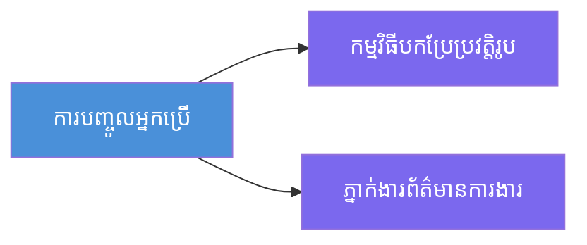
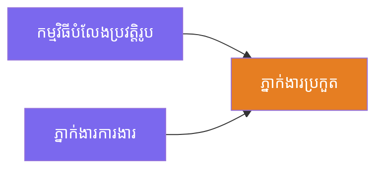
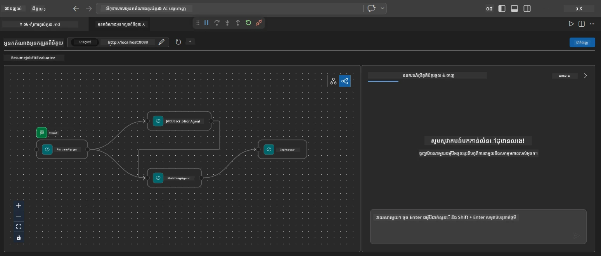
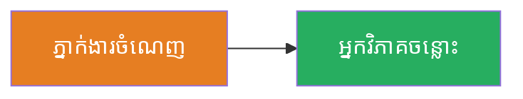
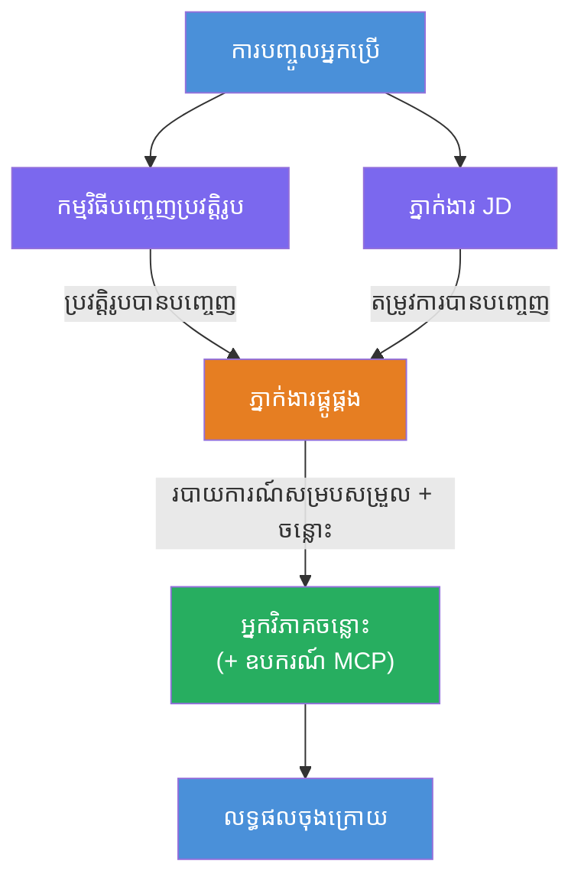
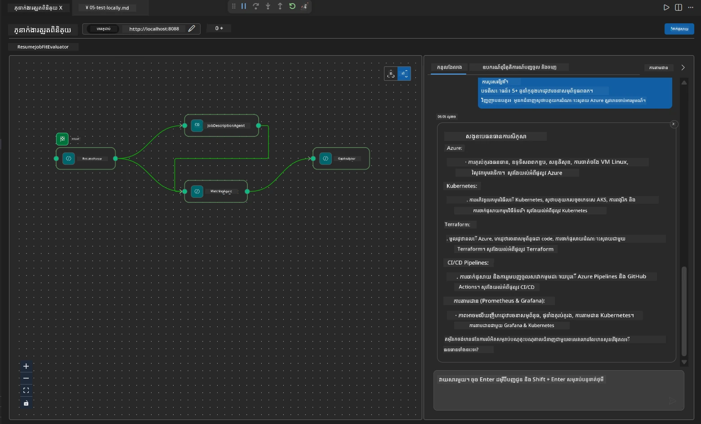

# ម៉ូឌុល 4 - គំរូអតិបរមា

នៅក្នុងម៉ូឌុលនេះ អ្នកស្វែងយល់ពីគំរូអតិបរមាដែលប្រើនៅក្នុងកម្មវិធី Resume Job Fit Evaluator ហើយរៀនពីរបៀបអាន ប្ដូរ និងពង្រីកក្រាបឧបករណ៍។ ការយល់ដឹងអំពីគំរូទាំងនេះមានសារៈសំខាន់សម្រាប់កំណត់កំហុសលើមធ្យោបាយផ្ទុកទិន្នន័យ និងសាងសង់ [ម៉ោងប្រតិបត្តិការ multi-agent](https://learn.microsoft.com/agent-framework/workflows/) របស់អ្នក។

---

## គំរូទី 1៖ Fan-out (ចែកបន្ទាត់សមភាព)

គំរូដំបូងនៅក្នុងម៉ោងប្រតិបត្តិការមានលក្ខណៈជា **fan-out** - ពត៌មានបញ្ចូលតែមួយត្រូវបានផ្ញើទៅភ្នាក់ងារច្រើនក្នុងពេលតែមួយ។


ក្នុងកូដ វានឹកស្មានថា `resume_parser` គឺជាអ្នកបំពេញការចាប់ផ្តើម - វាទទួលសារប្រើប្រាស់ជាលើកដំបូង។ បន្ទាប់មក ពីព្រោះទាំង `jd_agent` និង `matching_agent` មានអាជ្ញាធរពី `resume_parser` យ៉ាងសោតសោរមកវិញ ហ្វ្រេមវើកធ្វើការដឹកនាំផលបត់ពី `resume_parser` ទៅភ្នាក់ងារទាំងពីរ៖

```python
.add_edge(resume_parser, jd_agent)         # លទ្ធផល ResumeParser → JD Agent
.add_edge(resume_parser, matching_agent)   # លទ្ធផល ResumeParser → MatchingAgent
```

**ហេតុអ្វីបានជាវាកើតមាន៖** ResumeParser និង JD Agent ដំណើរការប្រភេទផ្នែកខុសគ្នារបស់ការបញ្ចូលដូចគ្នា។ ការរត់វាពីរនាក់ជាសមភាពកាត់បន្ថយពេលវេលាសរុបជាងការរត់តាមលំដាប់។

### ពេលណាអ្នកគួរនិយាយ fan-out

| ករណីប្រើ | ឧទាហរណ៍ |
|----------|---------|
| ការងារញឹកញាប់ឯករាជ្យ | ពិភាក្សា Resume ទល់នឹងពិភាក្សា JD |
| ការស្ទួចស្ទា / ផ្តល់តំណាង | ពីរភ្នាក់ងារវិភាគទិន្នន័យដូចគ្នា ភ្នាក់ងារផ្ទីចោលជម្រើសល្អបំផុត |
| លទ្ធផលជាច្រើនទ្រង់ទ្រាយ | ភ្នាក់ងារទម្រង់អត្ថបទ ម្នាក់ផ្សាយ JSON ទ្រង់ទ្រាយសង្កេត |

---

## គំរូទី 2៖ Fan-in (បញ្ចូលពហុ)

គំរូទីពីរ គឺជា **fan-in** - ផលបត់ពីភ្នាក់ងារជាច្រើនត្រូវបានប្រមូល និងផ្ញើទៅភ្នាក់ងារចុងក្រោយមួយ។


ក្នុងកូដ៖

```python
.add_edge(resume_parser, matching_agent)   # ផលបេញ ResumeParser → MatchingAgent
.add_edge(jd_agent, matching_agent)        # ផលបេញ JD Agent → MatchingAgent
```

**អ្វីដែលកើតមានសំខាន់៖** នៅពេលភ្នាក់ងារមាន **ពីរឬច្រើនកំពូលបញ្ចូល** ហ្វ្រេមវើកចាំទុកស្វ័យប្រវត្តិសម្រាប់ **អ្នកបំពេញការងាររាល់គ្នា** មុនធ្វើការរត់ភ្នាក់ងារចុងក្រោយ។ MatchingAgent មិនចាប់ផ្តើមឡើយរហូតដល់ ResumeParser និង JD Agent បញ្ចប់ទាំងពីរ។

### អ្វីដែល MatchingAgent ទទួលបាន

ហ្វ្រេមវើកភ្ជាប់ផលបត់ពីភ្នាក់ងារលើបណ្តោយទាំងអស់។ ទិន្នន័យបញ្ចូលរបស់ MatchingAgent មើលដូចជា៖

```
[ResumeParser output]
---
Candidate Profile:
  Name: Jane Doe
  Technical Skills: Python, Azure, Kubernetes, ...
  ...

[JobDescriptionAgent output]
---
Role Overview: Senior Cloud Engineer
Required Skills: Python, Azure, Terraform, ...
...
```

> **ចំណាំ៖** ទ្រង់ទ្រាយភ្ជាប់ពិតប្រាកដអាស្រ័យលើកំណែហ្វ្រេមវើក។ សេចក្ដីណែនាំរបស់ភ្នាក់ងារគួរត្រូវបានសរសេរដើម្បីដោះស្រាយទាំងទិន្នន័យមានរចនាសម្ព័ន្ធ និងគ្មានរចនាសម្ព័ន្ធ។



---

## គំរូទី 3៖ ខ្សែសង្វាក់ជាលំដាប់

គំរូទីបី គឺជា **ចងខ្សែជាលំដាប់** - លទ្ធផលភ្នាក់ងារមួយផ្តល់ទៅភ្នាក់ងារបន្ទាប់ដោយផ្ទាល់។


ក្នុងកូដ៖

```python
.add_edge(matching_agent, gap_analyzer)    # លទ្ធផល MatchingAgent → GapAnalyzer
```

នេះគឺជាគំរូធម្មតា។ GapAnalyzer ទទួលបានពិន្ទុតម្រូវfit ទំហំជំនាញដែលបានផ្គូរផ្គង/ខ្វះ និងចន្លោះ។ បន្ទាប់មកវាហៅ [ឧបករណ៍ MCP](https://learn.microsoft.com/azure/foundry/agents/how-to/tools/model-context-protocol) សម្រាប់ចន្លោះរៀងរាល់ខ្លះ ដើម្បីយកធនធាន Microsoft Learn។

---

## ក្រាបពេញលេញ

ការរួមបញ្ចូលគំរូទាំងបីបង្កើតជាប្រតិបត្តិការពេញលេញ៖


### ពេលវេលារត់កម្មវិធី

```mermaid
gantt
    title រយៈពេលអនុវត្តភ្នាក់ងារ
    dateFormat X
    axisFormat %s

    section ស្របគ្នា
    Resume Parser       :rp, 0, 3
    JD Agent            :jd, 0, 2

    section តាមលំដាប់
    Matching Agent      :ma, 3, 5
    Gap Analyzer        :ga, 5, 9
```


> ពេលវេលាសរុបនៅលើ цаг គឺប្រហែលជា `max(ResumeParser, JD Agent) + MatchingAgent + GapAnalyzer`។ GapAnalyzer ជាធម្មតាជាអ្នកយឺតបំផុត ព្រោះវាហៅឧបករណ៍ MCP ច្រើនដង (មួយទៅក្នុងចន្លោះនីមួយៗ)។

---

## ការអានកូដ WorkflowBuilder

នេះជាអនុគមន៍ `create_workflow()` ពេញលេញពី `main.py` ដែលមានការជម្រាបបន្ថែម៖

```python
def create_workflow(resume_parser, jd_agent, matching_agent, gap_analyzer):
    workflow = (
        WorkflowBuilder(
            name="ResumeJobFitEvaluator",

            # អ្នកតំណាងទីមួយដែលទទួលបានការបញ្ចូលពីអ្នកប្រើ
            start_executor=resume_parser,

            # អ្នកតំណាងដែលផលប័ត្រ​របស់ពួកគេក្លាយជាការឆ្លើយតបចុងក្រោយ
            output_executors=[gap_analyzer],
        )
        # ចាក់បញ្ចូលចេញច្រើន: លទ្ធផល ResumeParser ផ្ញើទៅអ្នកតំណាង JD និង MatchingAgent ទាំងពីរ
        .add_edge(resume_parser, jd_agent)
        .add_edge(resume_parser, matching_agent)

        # ចាក់បញ្ចូលចូលច្រើន: MatchingAgent រង់ចាំទាំង ResumeParser និង JD Agent
        .add_edge(jd_agent, matching_agent)

        # ដំណើរការតាមលំដាប់: លទ្ធផល MatchingAgent ផ្គត់ផ្គង់ទៅ GapAnalyzer
        .add_edge(matching_agent, gap_analyzer)

        .build()
    )
    return workflow.as_agent()
```

### តារាងសង្ខេបផ្លូវច្រក

| លេខ | ផ្លូវបញ្ជូន | គំរូ | ពលលទ្ធផល |
|---|------|---------|--------|
| 1 | `resume_parser → jd_agent` | Fan-out | JD Agent ទទួលផលបត់ពី ResumeParser (រួមបញ្ចូលទិន្នន័យបញ្ចូលដើម) |
| 2 | `resume_parser → matching_agent` | Fan-out | MatchingAgent ទទួលផលបត់ពី ResumeParser |
| 3 | `jd_agent → matching_agent` | Fan-in | MatchingAgent ក៏ទទួលផង JD Agent ផងដែរ (រង់ចាំទាំងពីរ) |
| 4 | `matching_agent → gap_analyzer` | ចងខ្សែ | GapAnalyzer ទទួលរបាយការណ៍នៃការសំរុងនិងបញ្ជីចន្លោះ |

---

## ការផ្លាស់ប្តូរក្រាប

### បន្ថែមភ្នាក់ងារថ្មីមួយ

ដើម្បីបន្ថែមភ្នាក់ងារទីប្រាំ (ឧ. **InterviewPrepAgent** ដែលបង្កើតសំណួរពិភាក្សាស្អាតដោយផ្អែកលើវាយតម្លៃចន្លោះ)៖

```python
# ១. កំណត់ការណែនាំ
INTERVIEW_PREP_INSTRUCTIONS = """\
You are the Interview Prep Agent.
Given a gap analysis and fit report, generate 10 targeted interview questions
the candidate should prepare for.
"""

# ២. បង្កើតភ្នាក់ងារ (នៅក្នុងប្លុក async with)
AzureAIAgentClient(
    project_endpoint=PROJECT_ENDPOINT,
    model_deployment_name=MODEL_DEPLOYMENT_NAME,
    credential=credential,
).as_agent(
    name="InterviewPrepAgent",
    instructions=INTERVIEW_PREP_INSTRUCTIONS,
) as interview_prep,

# ៣. បន្ថែមគែមនៅក្នុង create_workflow()
.add_edge(matching_agent, interview_prep)   # ទទួលរបាយការណ៍ត្រៀមខ្លួន
.add_edge(gap_analyzer, interview_prep)     # ក៏ទទួលកាតរន្ធកន្លែងដែរផងដែរ

# ៤. ធ្វើបច្ចុប្បន្នភាព output_executors
output_executors=[interview_prep],  # ឥឡូវជា ភ្នាក់ងារជាអនុគ្រោះចុងក្រោយ
```

### ផ្លាស់ប្តូរពេលវេលារត់កម្មវិធី

ដើម្បីធ្វើឲ្យ JD Agent រត់ **បន្ទាប់មក** ResumeParser (ជាលំដាប់ មិនមែនសមភាព)៖

```python
# លុប: .add_edge(resume_parser, jd_agent)  ← មានរួចហើយ, រក្សាទុកវា
# លុបការដំណើរការដង​គ្នាដោយការមិនឲ្យ jd_agent ទទួលព័ត៌មានប្រើប្រាស់ដោយផ្ទាល់
# start_executor ផ្ញើទៅ resume_parser ជាមុន, ហើយ jd_agent ទទួលបានពត៌មានតែ
# លទ្ធផលពី resume_parser តាមរយៈចំណុចភ្ជាប់។ នេះធ្វើឲ្យវាជាលំដាប់លំដោយ។
```

> **សំណូមពរ ៖** `start_executor` គឺជាភ្នាក់ងារតែមួយដែលទទួលទិន្នន័យអ្នកប្រើប្រាស់ដើម។ ភ្នាក់ងារផ្សេងទៀតទទួលផលបត់ពីផ្លូវបញ្ចូលរបស់ពួកវា។ ប្រសិនបើអ្នកចង់ឲ្យភ្នាក់ងារមួយទទួលទិន្នន័យអ្នកប្រើប្រាស់ដើមផង ក៏គួរតែមានផ្លូវពី `start_executor` មកវិញ។

---

## កំហុសសញ្ជាតិគ្រោងក្រាប

| កំហុស | លក្ខណៈ | ដំណោះស្រាយ |
|---------|---------|-----|
| ខ្វះផ្លូវទៅ `output_executors` | ភ្នាក់ងាររត់ ប៉ុន្ដែផលបត់ទទេ | ប្រាកដថាមានផ្លូវពី `start_executor` ទៅភ្នាក់ងារទាំងអស់ក្នុង `output_executors` |
| អាស្រ័យភាពវង់វិញ | ការជ្រុលវង់ឬពេលរង់ចាំមិនបញ្ចប់ | ពិនិត្យមើលថាតើគ្មានភ្នាក់ងារណាមួយផ្តល់ទៅវិញទៅមកភ្នាក់ងារលើកំពូលទេ |
| ភ្នាក់ងារនៅក្នុង `output_executors` គ្មានផ្លូវបញ្ចូល | ផលបត់ទទេ | បន្ថែមយ៉ាងហោចណាស់ `add_edge(source, that_agent)` មួយ |
| ភ្នាក់ងារច្រើននៅក្នុង `output_executors` ដោយគ្មាន fan-in | ផលបត់មានតែចម្លើយពីភ្នាក់ងារមួយ | ប្រើភ្នាក់ងារផលបត់តែមួយដែលប្រមូល, ឬទទួលផលបត់ជាច្រើន |
| ខ្វះ `start_executor` | `ValueError` នៅពេលបង្កើត | តែងតែបញ្ជាក់ `start_executor` ក្នុង `WorkflowBuilder()` |

---

## ការធ្វើការ Debug លើក្រាប

### ប្រើ Agent Inspector

1. ចាប់ផ្តើមភ្នាក់ងារនៅក្នុងម៉ាស៊ីន (F5 ឬ តេម៉ិនាលៈ សូមមើល [ម៉ូឌុល 5](05-test-locally.md))។
2. បើក Agent Inspector (`Ctrl+Shift+P` → **Foundry Toolkit: Open Agent Inspector**)។
3. ផ្ញើសារតេស្តមួយ។
4. នៅក្នុងផ្ទាំងចម្លើយ ពិនិត្យមើល **ផលបត់លំអិត** - វាបង្ហាញការចូលរួមរបស់ភ្នាក់ងារនីមួយៗតាមលំដាប់។



### ប្រើកំណត់ហេតុ

បន្ថែមកំណត់ហេតុទៅ `main.py` ដើម្បីតាមដានចរន្តទិន្នន័យ៖

```python
import logging
logger = logging.getLogger("resume-job-fit")

# នៅក្នុង create_workflow(), បន្ទាប់ពីបានបង្កើត:
logger.info("Workflow graph built with edges: RP→JD, RP→MA, JD→MA, MA→GA")
```

កំណត់ហេតុម៉ាស៊ីនបម្រើបង្ហាញលំដាប់រត់ភ្នាក់ងារ និងការហៅឧបករណ៍ MCP៖

```
INFO:resume-job-fit:Starting Resume -> Job Fit Evaluator HTTP server...
INFO:resume-job-fit:Server running on http://localhost:8088
INFO:agent_framework:Executing agent: ResumeParser
INFO:agent_framework:Executing agent: JobDescriptionAgent
INFO:agent_framework:Waiting for upstream agents: ResumeParser, JobDescriptionAgent
INFO:agent_framework:Executing agent: MatchingAgent
INFO:agent_framework:Executing agent: GapAnalyzer
INFO:agent_framework:Tool call: search_microsoft_learn_for_plan(skill="Kubernetes")
POST https://learn.microsoft.com/api/mcp → 200
INFO:agent_framework:Tool call: search_microsoft_learn_for_plan(skill="Terraform")
POST https://learn.microsoft.com/api/mcp → 200
```

---

### ពិនិត្យចំណុចមួយចំនួន

- [ ] អ្នកអាចសម្គាល់គំរូអតិបរមាបីនៅក្នុងម៉ោងប្រតិបត្តិការ: fan-out, fan-in, និង ខ្សែជាលំដាប់
- [ ] អ្នកយល់ថាភ្នាក់ងារដែលមានផ្លូវបញ្ចូលច្រើនរងចាំឲ្យភ្នាក់ងារលើកំពូលទាំងអស់បញ្ចប់
- [ ] អ្នកអាចអានកូដ `WorkflowBuilder` ហើយផ្គូរផ្គងការហៅ `add_edge()` ជាមួយក្រាបវីស្វាល
- [ ] អ្នកយល់ពីពេលវេលារត់កម្មវិធី៖ ភ្នាក់ងារសមភាពរត់ជាលើកដំបូង បន្ទាប់បញ្ចូលម៉ោងប្រមូលសិន បន្ទាប់ជាលំដាប់
- [ ] អ្នកដឹងពីរបៀបបន្ថែមភ្នាក់ងារថ្មីទៅក្រាប (កំណត់បញ្ជា បង្កើតភ្នាក់ងារ បន្ថែមផ្លូវ ធ្វើបច្ចុប្បន្នភាពលទ្ធផល)
- [ ] អ្នកអាចសម្គាល់កំហុសសង្គ្រោះក្រាបនិងសញ្ញាបង្ហាញរបស់វា

---

**មុននេះ៖** [03 - កំណត់រចនាសម្ព័ន្ធភ្នាក់ងារ និងបរិយាកាស](03-configure-agents.md) · **បន្ទាប់៖** [05 - ធ្វើតេស្តនៅក្នុងម៉ាស៊ីន →](05-test-locally.md)

---

<!-- CO-OP TRANSLATOR DISCLAIMER START -->
**ការបញ្ចាក់**៖  
ឯកសារនេះត្រូវបានបំលែងភាសាដោយប្រើសេវាកម្មបំលែងភាសា AI [Co-op Translator](https://github.com/Azure/co-op-translator)។ ខណៈពេលដែលយើងខិតខំស្របត្រឹមត្រូវ សូមគោរពដឹងថាការបំលែងភាសា​ដោយស្វ័យប្រវត្តិ​អាចមានកំហុស ឬភាពមិនត្រឹមត្រូវខ្លះៗ។ ឯកសារដើមក្នុងភាសាម្ចាស់របស់វា គឺជាមនោសញ្ចេតនាចម្បងសម្រាប់យោង។ សម្រាប់ព័ត៌មានសំខាន់ៗ ការបំលែងភាសាដោយមនុស្សឯកទេសគឺត្រូវបានណែនាំ។ យើងមិនទទួលខុសត្រូវចំពោះការយល់ច្រឡំ ឬការយល់ប្លែកដែលកើតមានពីការប្រើប្រាស់ការបំលែងភាសានេះឡើយ។
<!-- CO-OP TRANSLATOR DISCLAIMER END -->