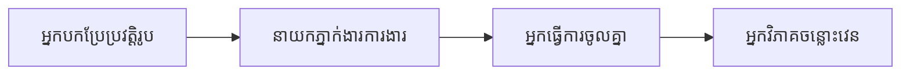
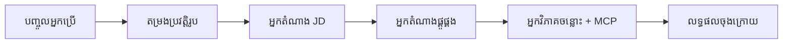

# មេរៀន 4 - រចនាប័ទ្មសម្រង់កម្មវិធី

⏱️ ~10 នាទី

នៅក្នុងមេរៀននេះ អ្នកនឹងស្វែងយល់អំពីរចនាប័ទ្មសម្រង់កម្មវិធីដែលបានប្រើនៅក្នុងកម្មវិធី Resume Job Fit Evaluator ហើយរៀនពីរបៀបអាន កែប្រែ និងពង្រីកក្រាហ្វ workflow។ការយល់ដឹងពីរចនាប័ទ្មទាំងនេះមានសារៈសំខាន់សម្រាប់កែសម្រួលកំហុសបញ្ហាប្រែប្រួលទិន្នន័យ និងកសាងកម្មវិធី [workflow ពហុនាយក](https://learn.microsoft.com/agent-framework/workflows/) របស់អ្នកឯង។

---

## រចនាប័ទ្ម 1: ខ្សែស្រឡាយតាមលំដាប់

រចនាប័ទ្មមូលដ្ឋានក្នុង workflow គឺជា **ខ្សែស្រឡាយតាមលំដាប់** - ផលបត់របស់អ្នកប្រតិបត្តិការណ៍ម្នាក់ៗផ្ទាល់ទៅទៅជាទិន្នន័យបញ្ចូលរបស់អ្នកបន្ទាប់។


```mermaid
flowchart LR
    RP[អ្នកបកប្រែប្រវត្តិរូប] --> JD[នាយកភ្នាក់ងារការងារ]
    JD --> MA[អ្នកធ្វើការចូលគ្នា]
    MA --> GA[អ្នកវិភាគចន្លោះវេន]
```

ក្នុងកូដ ការហៅមុខងារ `add_edge()` មួយនឹងបង្កើតជាជំហានមួយក្នុងខ្សែស្រឡាយ៖

```python
.add_edge(resume_executor, jd_executor)       # លទ្ធផល ResumeParser → JD Agent
.add_edge(jd_executor, matching_executor)     # លទ្ធផល JD Agent → MatchingAgent
.add_edge(matching_executor, gap_executor)    # លទ្ធផល MatchingAgent → GapAnalyzer
```

> **ហេតុអ្វីបានជាធ្វើតាមលំដាប់មិនមែន fan-out/fan-in?** `WorkflowBuilder` ប្រើ **OR-semantics** សម្រាប់វាលចូល៖ អ្នកប្រតិបត្តិការណ៍ខាងក្រោមនឹងបើកដំណើរការពេលណាមួយដែល **អ្នកដោយផ្ទាល់ណាមួយ** បានបញ្ចប់។ ប្រសិនបើ `matching_executor` មានវាលចូលពីពីរទីតាំង (ពី `resume_executor` និង `jd_executor` ទាំងពីរ) វានឹងបើកដំណើរការពីរដង - ម្តងនៅពេល ResumeParser បញ្ចប់ និងម្តងទៀតនៅពេល JD Agent បញ្ចប់ - ធ្វើឲ្យ GapAnalyzer ប្រតិបត្តិការដងពីរហើយផលបត់មើលឃើញពីរដងផងដែរ។ ខ្សែស្រឡាយតាមលំដាប់ជៀសវាងបញ្ហានេះដោយស្រុង។

## រចនាប័ទ្ម 2: បញ្ជូនមាតិកា

ព្រោះ `context_mode="last_agent"` មានន័យថា អ្នកប្រតិបត្តិការណ៍នីមួយៗមើលឃើញតែផលបត់នៃអ្នកចាស់ជាងតែមួយផ្ទាល់របស់ពួកគេហើយ អ្នកនៅក្នុងខ្សែស្រឡាយតាមលំដាប់ត្រូវផ្តល់បញ្ជូនទិន្នន័យណាមួយដែលអ្នកចំណុចខាងក្រោមត្រូវការយ៉ាងច្បាស់។

នៅក្នុង workflow នេះ៖
- **ResumeParser** ចម្លង JD ដោយត្រងចំទៅក្នុង `[JOB DESCRIPTION PASS-THROUGH]` (ដើម្បីឲ្យ JD Agent អាចស្វែងរកបាន)។
- **JD Agent** ចម្លង `[PARSED RESUME]` ដោយត្រងចំទៅក្នុង `[PARSED RESUME PASS-THROUGH]` (ដើម្បីឲ្យ MatchingAgent អាចប្រៀបធៀបប្រវត្តិរូបទាំងពីរ)។

```
ResumeParser output
└─ [PARSED RESUME]               ← extracted by JD Agent
└─ [JOB DESCRIPTION PASS-THROUGH] ← extracted by JD Agent

JD Agent output
└─ [JD REQUIREMENTS]             ← extracted by MatchingAgent
└─ [PARSED RESUME PASS-THROUGH]  ← extracted by MatchingAgent
```

ផ្នែកបញ្ជូនមាតិកាទាំងអស់ត្រូវបានចម្លង **ដូចម្តេចដដែល** - ការសង្ខេប ឬប្រែប្រាស់វានឹងបង្កការខូចខាតដល់អ្នកចំណុចខាងក្រោមដែលពឹងផ្អែកលើវា។

---

## គ្រោងក្រាហ្វពេញលេញ

ការច្របាច់រវាងខ្សែស្រឡាយតាមលំដាប់ និងរចនាប័ទ្មបញ្ជូនមាតិកាបង្កើតជា workflow ពេញលេញ៖


```mermaid
flowchart LR
    U[បញ្ចូលអ្នកប្រើ] --> RP[តម្រងប្រវត្តិរូប]
    RP --> JD[អ្នកតំណាង JD]
    JD --> MA[អ្នកតំណាងផ្គូផ្គង]
    MA --> GA[អ្នកវិភាគចន្លោះ + MCP]
    GA --> O[លទ្ធផលចុងក្រោយ]
```

កម្មវិធី Agent Inspector បង្ហាញរចនាសម្ព័ន្ធដូចគ្នានេះពេលដែលអ្នកប្រតិបត្តិការណ៍ដំណើរការជាកន្លែងក្នុងស្រុក។ សូមយោងទៅ [Module 5 - Test Locally](05-test-locally.md) សម្រាប់រូបថតអេក្រង់។

---

## អានកូដ WorkflowBuilder

មុខងារ `create_workflow()`ពេញលេញមាននៅក្នុងឯកសារ [`PersonalCareerCopilot/main.py`](../../../../../workshop/lab02-multi-agent/PersonalCareerCopilot/main.py)។ ការហៅ `add_edge()` បីដងកសាងខ្សែស្រឡាយតាមលំដាប់៖

| # | វាលចូល | ផលបត់ |
|---|---------|---------|
| 1 | `resume_executor → jd_executor` | JD Agent ទទួល `[PARSED RESUME]` + `[JOB DESCRIPTION PASS-THROUGH]` |
| 2 | `jd_executor → matching_executor` | MatchingAgent ទទួល `[JD REQUIREMENTS]` + `[PARSED RESUME PASS-THROUGH]` |
| 3 | `matching_executor → gap_executor` | GapAnalyzer ទទួលរបាយការណ៍សម្របសម្រួល + បញ្ជីរវាងកន្លែង |

---

## កែប្រែ graph

### បន្ថែមអ្នកប្រតិបត្តិការថ្មី

ដើម្បីបន្ថែមអ្នកប្រតិបត្តិការ បន្ទាប់ទាំងបន្ទាប់ (ឧ. **InterviewPrepAgent** បន្ទាប់ពី GapAnalyzer):

1. កំណត់អថេរ `INTERVIEW_PREP_INSTRUCTIONS`។
2. បង្កើតអំពី `Agent` + `AgentExecutor` (តាមរចនាប័ទ្មដដែលនឹងបួនរបស់កន្លងមក)។
3. បន្ថែម `.add_edge(gap_executor, interview_exec)` ក្នុង `WorkflowBuilder`។
4. បន្ទាន់សម័យ `output_executors=[interview_exec]`។

> **សំខាន់ៈ** `start_executor` ជាអ្នកប្រតិបត្តិការទូតែម្នាក់ដែលទទួលតំណក់ទិន្នន័យប្រើប្រាស់ដើមផ្សងទៀត។ អ្នកប្រតិបត្តិការ ផ្សេងទៀតទទួលតែលទ្ធផលពីវាលចូលខាងលើទេ។

---

## ខុសត្រូវផ្លូវរូបភាពទូទៅ

| ខុស | រោគសញ្ញា | ដោះសោ |
|---------|----------|-------|
| ខ្វះខ្សែទៅ `output_executors` | អ្នកប្រតិបត្តិការដំណើរការ ប៉ុន្តលទ្ធផលថ្ងៃសូន្យ | ប្រាកដថាមានផ្លូវពី `start_executor` ទៅអ្នកប្រតិបត្តិការនីមួយៗក្នុង `output_executors` |
| ភាពរបួសប្រាស្រ័យគ្នាវង់ | រលកអនន្តកាល ឬពេលវេលាផុត | ពិនិត្យមើលមិនឲ្យអ្នកប្រតិបត្តិការអ្នកណាម្នាក់ទុកតាមអ្នកប្រតិបត្ដិការខាងលើវិញទេ |
| អ្នកប្រតិបត្តិការនៅក្នុង `output_executors` មិនមានវាលចូល | លទ្ធផលទទេ | បន្ថែមតិចតួច `add_edge(source, that_agent)` ម្នាក់យ៉ាងហោចណាស់ |
| មានអ្នកប្រតិបត្តិការពហុ `output_executors` ប៉ុន្តមិនមាន fan-in | លទ្ធផលមានតែចម្លើយអ្នកប្រតិបត្តិការម្នាក់ | ប្រើអ្នកប្រតិបត្តិការតែម្នាក់ដែលសរុបចម្លើយឬទទួលចម្លើយច្រើន |
| ខ្វះ `start_executor` | `ValueError` នៅពេលកសាង | រៀបចំជានិប្រាណ `start_executor` ក្នុង `WorkflowBuilder()` |

---

## កែតម្រូវ graph

### ប្រើ Agent Inspector

1. ចាប់ផ្តើមអ្នកប្រតិបត្តិការក្នុងស្រុកជាមួយ F5។
2. បើក Agent Inspector (`Ctrl+Shift+P` → **Foundry Toolkit: Open Agent Inspector**)។
3. ផ្ញើសារ​តេស្តមួយ។
4. នៅក្នុងផ្ទាំងចម្លើយរបស់ Inspector ស្វែងរក **ផលបត់បញ្ជូនប្រាំផ្សេងៗ** - វាបង្ហាញចំណែកចូលរបស់អ្នកប្រតិបត្តិការនីមួយៗតាមលំដាប់។


### ប្រើ logging

បន្ថែម logging ទៅ `main.py` ដើម្បីតាមដានការប្រព្រឹត្តធ្វើទិន្នន័យ៖

```python
import logging
logger = logging.getLogger("resume-job-fit")

# ក្នុង main(), បន្ទាប់ពីកសាង workflow:
logger.info("Workflow graph built with edges: RP→JD, JD→MA, MA→GA")
```

កំណត់ហេតុម៉ាស៊ីនមើលបញ្ជាក់លំដាប់ប្រតិបត្តិការរបស់អ្នកប្រតិបត្តិការនិងការហៅឧបករណ៍ MCP៖

```
INFO:agent_framework:Executing agent: ResumeParser
INFO:agent_framework:Executing agent: JobDescriptionAgent
INFO:agent_framework:Executing agent: MatchingAgent
INFO:agent_framework:Executing agent: GapAnalyzer
INFO:agent_framework:Tool call: search_microsoft_learn_for_plan(skill="Kubernetes")
POST https://learn.microsoft.com/api/mcp → 200
INFO:agent_framework:Tool call: search_microsoft_learn_for_plan(skill="Terraform")
POST https://learn.microsoft.com/api/mcp → 200
```

---

### បន្ទាត់ពិនិត្យ

- [ ] អ្នកអាចកំណត់រចនាប័ទ្មសម្រង់កម្មវិធីពីរ សំแก่ខ្សែស្រឡាយតាមលំដាប់ និងបញ្ជូនមាតិកា
- [ ] អ្នកយល់ហេតុផលដែល `context_mode="last_agent"` រួចបញ្ជូនទិន្នន័យច្បាស់លាស់រវាងអ្នកប្រតិបត្តិការនីមួយៗ
- [ ] អ្នកអាចអានកូដ `WorkflowBuilder` និងផែនទីរួមនៅនឹងការហៅ `add_edge()` ទៅក្រាហ្វមើលឃើញ
- [ ] អ្នកដឹងរបៀបបន្ថែមអ្នកប្រតិបត្តិការថ្មីនៅចុងខ្សែស្រឡាយ
- [ ] អ្នកអាចកំណត់កំហុសរូបភាពទូទៅ និងរោគសញ្ញារបស់វា

---

**មុនหน้า៖** [03 - កំណត់អ្នកប្រតិបត្តិការនិងបរិបទ](03-configure-agents.md) · **បន្ទាប់៖** [05 - សាកល្បងក្នុងស្រុក →](05-test-locally.md)

---

<!-- CO-OP TRANSLATOR DISCLAIMER START -->
**ការបដិសេធ**:
ឯកសារនេះត្រូវបានបម្លែងភាសា ដោយប្រើសេវាបម្លែងភាសា AI [Co-op Translator](https://github.com/Azure/co-op-translator)។ ទោះយើងខ្ញុំមានក្តីប្រាថ្នាឱ្យបានច្បាស់លាស់ តែសូមយល់ដឹងថាការបម្លែងដោយស្វ័យប្រវត្តិក៏អាចមានកំហុសឬភាពមិនត្រឹមត្រូវ។ ឯកសារដើមជាភាសាទីតាំងគួរត្រូវបានគេប្រើជាប្រភពច្បាស់លាស់។ សម្រាប់ព័ត៌មានសំខាន់ៗ សូមណែនាំឱ្យប្រើប្រាស់ការប្រែដោយមនុស្សជំនាញ។ យើងខ្ញុំមិនទទួលខុសត្រូវចំពោះការយល់ច្រឡំ ឬការបកស្រាយខុសបន្ទាប់ពីការប្រើប្រាស់ការបម្លែងនេះនោះទេ។
<!-- CO-OP TRANSLATOR DISCLAIMER END -->