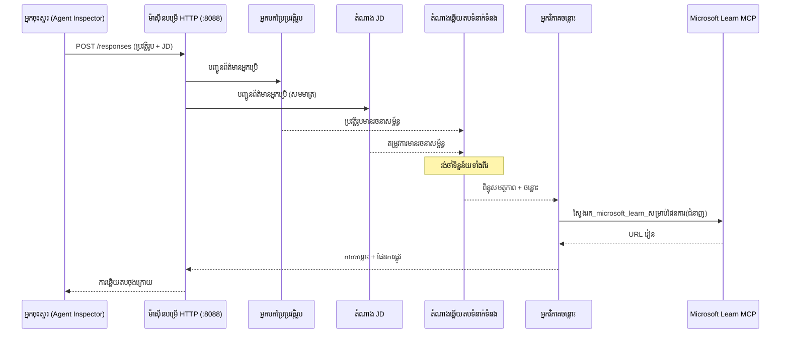
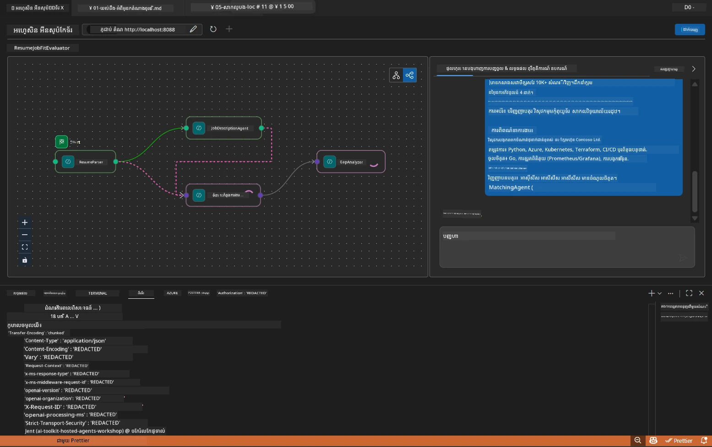

# មូឌុល 5 - សាកល្បងក្នុងកន្លែង (Multi-Agent)

នៅក្នុងមូឌុលនេះ អ្នកធ្វើដំណើរការកម្មវិធី multi-agent ក្នុងកន្លែង សាកល្បងវាជាមួយ Agent Inspector ហើយផ្ទៀងផ្ទាត់ថា អ្នកចៅហ្វាគ្រប់បួននិងឧបករណ៍ MCP ធ្វើការបានត្រឹមត្រូវមុនចាប់ផ្តើមដាក់បង្ហោះទៅ Foundry។

### តើមានអ្វីកើតឡើងពេលសាកល្បងក្នុងកន្លែង


---

## ជំហានទី 1 ៖ ចាប់ផ្តើមម៉ាស៊ីនបម្រើ agent

### ជម្រើស A: ប្រើការងារតាម VS Code (ផ្តល់អនុសាសន៍)

1. ចុច `Ctrl+Shift+P` → វាយ **Tasks: Run Task** → ជ្រើស **Run Lab02 HTTP Server**។
2. ការងារចាប់ផ្តើមម៉ាស៊ីនបម្រើជាមួយ debugpy តភ្ជាប់នៅច្រក `5679` ហើយ agent នៅច្រក `8088`។
3. រង់ចាំលទ្ធផលបង្ហាញ៖

```
INFO:resume-job-fit:Starting Resume -> Job Fit Evaluator HTTP server...
INFO:resume-job-fit:Server running on http://localhost:8088
```

### ជម្រើស B: ប្រើតាមការបញ្ជា terminal ដោយដៃ

```powershell
cd workshop\lab02-multi-agent\PersonalCareerCopilot
```

ដំណើរការបរិស្ថាន virtual៖

**PowerShell (Windows):**
```powershell
.\.venv\Scripts\Activate.ps1
```

**macOS/Linux:**
```bash
source .venv/bin/activate
```

ចាប់ផ្តើមម៉ាស៊ីនបម្រើ៖

```powershell
python -m debugpy --listen 127.0.0.1:5679 -m agentdev run main.py --verbose --port 8088
```

### ជម្រើស C: ប្រើ F5 (មុខងារបញ្ចូនកំហុស)

1. ចុច `F5` ឬទៅ **Run and Debug** (`Ctrl+Shift+D`)។
2. ជ្រើសការកំណត់ចាប់ផ្តើម **Lab02 - Multi-Agent** ពីបញ្ជីចុចចុះ។
3. ម៉ាស៊ីនបម្រើចាប់ផ្តើមជាមួយការគាំទ្រប្រែកូនក្រោមពេញលេញ។

> **ជួយថ្លែង៖** មុខងារបញ្ចូនកំហុសអនុញ្ញាតឱ្យអ្នកកំណត់ breakpoints ខាងក្នុង `search_microsoft_learn_for_plan()` ដើម្បីពិនិត្យមើលចម្លើយ MCP ឬខាងក្នុងច្រកណាត់បញ្ជារបស់ agent ដើម្បីមើលថាតើអ្នកចៅហ្វា៉ទទួលអ្វី។

---

## ជំហានទី 2 ៖ បើក Agent Inspector

1. ចុច `Ctrl+Shift+P` → វាយ **Foundry Toolkit: Open Agent Inspector**។
2. Agent Inspector បើកក្នុងផ្ទាំងកម្មវិធីរុករកនៅ `http://localhost:5679`។
3. អ្នកគួរតែឃើញផ្ទាំងអ្នកចៅហ្វាដើម្បីទទួលសារ។

> **ប្រសិនបើ Agent Inspector មិនបើកឡើង៖** ធានាថាម៉ាស៊ីនបម្រើបានចាប់ផ្តើមពេញលេញ (អ្នកឃើញកំណត់ហេតុ "Server running")។ ប្រសិនបើច្រក 5679 មានការប្រើប្រាស់មក មើល [មូឌុល 8 - ដោះស្រាយបញ្ហា](08-troubleshooting.md)។

---

## ជំហានទី 3 ៖ ប្រតិបត្តិសាកល្បង smoke tests

ដំណើរការសាកល្បងទាំងបីនេះតាមលំដាប់។ ការសាកល្បងនីមួយៗពង្រីកភាពធ្វើការប្រកបដោយប្រសិទ្ធភាពនៃកម្មវិធី។

### ការសាកល្បងទី 1: ផ្ទាំងជីវប្រវត្តិមូលដ្ឋាន + ពិពណ៌នាការងារ

បិទបញ្ជីក្រោមទៅក្នុង Agent Inspector៖

```
Resume:
Jane Doe
Senior Software Engineer with 5 years of experience in Python, Django, and AWS.
Built microservices handling 10K+ requests/second. Led a team of 4 developers.
Certifications: AWS Solutions Architect Associate.
Education: B.S. Computer Science, State University.

Job Description:
Senior Cloud Engineer at Contoso Ltd.
Required: Python, Azure, Kubernetes, Terraform, CI/CD pipelines.
Preferred: Go, monitoring (Prometheus/Grafana), cost optimization.
Experience: 5+ years in cloud infrastructure.
Certifications: Azure Solutions Architect Expert preferred.
```

**រចនាសម្ព័ន្ធចម្លើយដែលរំពឹងទុក៖**

ចម្លើយគួរតែមានចេញពីអ្នកចៅហ្វាទាំងបួនជាដំណើរការតាមលំដាប់៖

1. **លទ្ធផល Resume Parser** - ប្រវត្តិអ្នកដាក់ពត៌មានដោយមានសមត្ថភាពកំណត់តាមប្រភេទ
2. **លទ្ធផល JD Agent** - តម្រូវការតម្រង់តាមរយៈការបំបែកជាសមត្ថភាពត្រូវការនិងមិនបាច់ការបាន
3. **លទ្ធផល Matching Agent** - ពិន្ទុសុទិដ្ឋិនិយម (0-100) ជាមួយការបំបែក, ជំនាញត្រូវគ្នា, ជំនាញខ្វះ, ចន្លោះ
4. **លទ្ធផល Gap Analyzer** - កាតចន្លោះជាក់លាក់សម្រាប់ជំនាញខ្វះនីមួយៗ ជាមួយ URL Microsoft Learn



### ត្រូវផ្ទៀងផ្ទាត់អ្វីខ្លះនៅក្នុងការសាកល្បងទី 1

| ពិនិត្យ | រង់ចាំ | ចាត់ទុកជាដំណើរ? |
|-------|----------|-------|
| ចម្លើយមានពិន្ទុសុទិដ្ឋិនិយម | លេខពី 0-100 ជាមួយការបំបែក | |
| ជំនាញត្រូវគ្នាត្រូវបានរាយបញ្ជី | Python, CI/CD (ផ្នែកខ្លះ), ល.អ | |
| ជំនាញខ្វះត្រូវបានរាយបញ្ជី | Azure, Kubernetes, Terraform, ល.អ | |
| មានកាតចន្លោះសម្រាប់ជំនាញខ្វះទាំងអស់ | កាតមួយសម្រាប់ជំនាញមួយ | |
| មាន URL Microsoft Learn | តំណតាំង learn.microsoft.com ពិត | |
| មិនមានសារកំហុសនៅក្នុងចម្លើយ | លទ្ធផលមានរចនាសម្ព័ន្ធស្អាត | |

### ការសាកល្បងទី 2: ផ្ទៀងផ្ទាត់ការប្រតិបត្តិឧបករណ៍ MCP

ខណៈពេលកំពុងដំណើរការការសាកល្បងទី 1 សូមពិនិត្យ **terminal ម៉ាស៊ីនបម្រើ** សម្រាប់កំណត់ហេតុ MCP៖

```
GET https://learn.microsoft.com/api/mcp → 405 (Method Not Allowed)
POST https://learn.microsoft.com/api/mcp → 200
DELETE https://learn.microsoft.com/api/mcp → 405 (Method Not Allowed)
```

| កំណត់ហេតុ | មានន័យ | រង់ចាំ? |
|-----------|---------|-----------|
| `GET ... → 405` | អតិថិជន MCP សាកសួរជាមួយ GET នៅពេលចាប់ផ្តើម | មាន - ធម្មតា |
| `POST ... → 200` | ការហៅឧបករណ៍ពិតទៅម៉ាស៊ីនបម្រើ Microsoft Learn MCP | មាន - ការហៅពិត |
| `DELETE ... → 405` | អតិថិជន MCP សាកសួរជាមួយ DELETE នៅពេលសម្អាត | មាន - ធម្មតា |
| `POST ... → 4xx/5xx` | ការហៅឧបករណ៍បរាជ័យ | គ្មាន - មើល [ដោះស្រាយបញ្ហា](08-troubleshooting.md) |

> **ចំណុចសំខាន់៖** បន្ទាត់ `GET 405` និង `DELETE 405` គឺជាទម្លាប់ធម្មតា។ កុំបារម្ភបើ `POST` ទទួលបានកូដរដ្ឋាបារម្ភក្រៅ 200។

### ការសាកល្បងទី 3: ករណីគ្រាប់បែក - បេក្ខជនសមត្ថភាពខ្ពស់

បិទបញ្ជីជីវប្រវត្តិដែលសមនឹង JD ជិតនឹងពិតដើម្បីផ្ទៀងផ្ទាត់ថា GapAnalyzer គ្រប់គ្រងករណីសមត្ថភាពខ្ពស់៖

```
Resume:
Alex Chen
Senior Cloud Engineer with 7 years of experience.
Skills: Python, Azure (AKS, Functions, DevOps), Kubernetes, Terraform, CI/CD (GitHub Actions, Azure Pipelines), Go, Prometheus, Grafana, cost optimization.
Certifications: Azure Solutions Architect Expert, Azure DevOps Engineer Expert.
Led infrastructure migration to Azure for 3 enterprise clients.
Education: M.S. Computer Science, Tech University.

Job Description:
Senior Cloud Engineer at Contoso Ltd.
Required: Python, Azure, Kubernetes, Terraform, CI/CD pipelines.
Preferred: Go, monitoring (Prometheus/Grafana), cost optimization.
Experience: 5+ years in cloud infrastructure.
Certifications: Azure Solutions Architect Expert preferred.
```

**អនុវត្តន៍រង់ចាំ៖**
- ពិន្ទុសុទិដ្ឋិនិយមគួរតែ **80+** (ជំនាញភាគច្រើនត្រូវគ្នា)
- កាតចន្លោះគួរតែផ្តោតលើការត្រៀមសម្ភាសន៍ជាងការរៀនមូលដ្ឋាន
- សេចក្តីណែនាំ GapAnalyzer ឲ្យមាន៖ "បើ fit >= 80, ផ្តោតលើការត្រៀមសម្ភាសន៍"

---

## ជំហានទី 4៖ ផ្ទៀងផ្ទាត់ភាពពេញលេញនៃចម្លើយ

បន្ទាប់ពីដំណើរការការសាកល្បង សូមផ្ទៀងផ្ទាត់ថាចម្លើយបំពេញលក្ខណៈទាំងនេះ៖

### បញ្ជីពិនិត្យរចនាសម្ព័ន្ធចម្លើយ

| ផ្នែក | អ្នកចៅហ្វា | មាន? |
|---------|-------|----------|
| ប្រវត្តិអ្នកដាក់ពត៌មាន | Resume Parser | |
| ជំនាញបច្ចេកទេស (ចែកជាក្រុម) | Resume Parser | |
| ការពិពណ៌នាគោលបំណងការងារ | JD Agent | |
| ជំនាញត្រូវការទល់នឹងជំនាញចង់បាន | JD Agent | |
| ពិន្ទុសុទិដ្ឋិនិយមជាមួយការបំបែក | Matching Agent | |
| ជំនាញត្រូវគ្នា / ខ្វះ / ផ្នែកខ្លះ | Matching Agent | |
| កាតចន្លោះសម្រាប់ជំនាញខ្វះ | Gap Analyzer | |
| URL Microsoft Learn នៅកាតចន្លោះ | Gap Analyzer (MCP) | |
| តម្រៀបរៀន (លេខរៀង) | Gap Analyzer | |
| សង្ខេបពេលវេលា | Gap Analyzer | |

### បញ្ហាទូទៅនៅដំណាក់កាលនេះ

| បញ្ហា | មូលហេតុ | ជួសជុល |
|-------|-------|-----|
| មានតែកាតចន្លោះ 1 (ផ្សេងទៀតបានកាត់ចោល) | សេចក្តីណែនាំ GapAnalyzer ខ្វះផ្នែក CRITICAL | បន្ថែមកថាខណ្ឌ `CRITICAL:` ទៅក្នុង `GAP_ANALYZER_INSTRUCTIONS` - មើល [មូឌុល 3](03-configure-agents.md) |
| មានគ្មាន URL Microsoft Learn | មិនអាចទាក់ទង MCP endpoint | ពិនិត្យការតភ្ជាប់អ៊ីនធឺណិត។ ផ្ទៀងផ្ទាត់ `MICROSOFT_LEARN_MCP_ENDPOINT` នៅ `.env` ថាជា `https://learn.microsoft.com/api/mcp` |
| ចម្លើយទទេ | មិនបានកំណត់ `PROJECT_ENDPOINT` ឬ `MODEL_DEPLOYMENT_NAME` | ពិនិត្យតម្លៃក្នុង `.env`។ ប្រើ `echo $env:PROJECT_ENDPOINT` នៅ terminal |
| ពិន្ទុសុទិដ្ឋិនិយម 0 ឬខ្វះ | MatchingAgent មិនទទួលបានទិន្នន័យ upstream | ពិនិត្យឲ្យប្រាកដថា `add_edge(resume_parser, matching_agent)` និង `add_edge(jd_agent, matching_agent)` មាននៅក្នុង `create_workflow()` |
| Agent ចាប់ផ្តើមប៉ុន្តែចេញភ្លាមៗ | កំហុស import ឬខ្វះការពឹងពាក់ | រត់ `pip install -r requirements.txt` ម្តងទៀត។ ពិនិត្យ terminal សម្រាប់កំណត់ហេតុចុះក្រោម |
| កំហុស `validate_configuration` | ខ្វះអថេរ env | បង្កើត `.env` ជាមួយ `PROJECT_ENDPOINT=<your-endpoint>` និង `MODEL_DEPLOYMENT_NAME=<your-model>` |

---

## ជំហានទី 5៖ សាកល្បងជាមួយទិន្នន័យផ្ទាល់ខ្លួន (ជាជម្រើស)

ព្យាយាមបិទបញ្ជីជីវប្រវត្តិផ្ទាល់ខ្លួននិងពិពណ៌នាការងារពិត។ វាជួយផ្ទៀងផ្ទាត់ថា៖

- អ្នកចៅហ្វាត្រូវគ្នាលើទ្រង់ទ្រាយជីវប្រវត្តិផ្សេងៗ (តាមលំដាប់, មុខងារ, ហាយប៊ីដ៍)
- JD Agent ដំណើរការស្ទីល JD ផ្សេងៗ (ចំណុចគ្រាប់បែក, ប៉ារ៉ាក្រាផ, រចនាសម្ព័ន្ធ)
- ឧបករណ៍ MCP បញ្ជូនធនធានសម្រាប់ជំនាញពិត
- កាតចន្លោះមានការបុគ្គលភាពទៅកាន់ប្រវត្តិរបស់អ្នកជាក់លាក់

> **កំណត់សំគាល់ឯកជនៈ** នៅពេលសាកល្បងក្នុងកន្លែង ទិន្នន័យរបស់អ្នកនៅក្នុងម៉ាស៊ីនបញ្ចូលរបស់អ្នកនិងត្រូវផ្ញើទៅតែ Azure OpenAI deployment របស់អ្នក។ វាមិនត្រូវបានកត់ត្រា ឬផ្ទុកដោយហេដ្ឋារចនាសម្ព័ន្ធវគ្គបណ្តុះបណ្តាល។ ប្រើឈ្មោះបញ្ជាក់បើអ្នកចង់ (ឧ., "Jane Doe" ជំនួសឈ្មោះពិតរបស់អ្នក)។

---

### ចំណុចត្រួតពិនិត្យ

- [ ] ម៉ាស៊ីនបម្រើចាប់ផ្តើមដោយជោគជ័យនៅច្រក `8088` (កំណត់ហេតុបង្ហាញ "Server running")
- [ ] Agent Inspector បានបើក និងភ្ជាប់ទៅ agent
- [ ] ការសាកល្បង 1: ចម្លើយពេញលេញជាមួយពិន្ទុ, ជំនាញត្រូវគ្នា / ខ្វះ, កាតចន្លោះ និង URL Microsoft Learn
- [ ] ការសាកល្បង 2: កំណត់ហេតុ MCP បង្ហាញ `POST ... → 200` (ការ​ហៅ​ឧបករណ៍​ផុតកំណត់​ជោគជ័យ)
- [ ] ការសាកល្បង 3: បេក្ខជនសមត្ថភាពខ្ពស់ទទួលបានពិន្ទុ 80+ ជាមួយការណែនាំផ្តោតលើការត្រៀម
- [ ] កាតចន្លោះទាំងអស់មាន (មួយសម្រាប់ជំនាញខ្វះមួយ, មិនបានកាត់ចោល)
- [ ] គ្មានកំហុស ឬកំណត់ហេតុបញ្ហា នៅ terminal ម៉ាស៊ីនបម្រើ

---

**មុន:** [04 - លំនាំរចនាសម្ព័ន្ធ orchestration](04-orchestration-patterns.md) · **បន្ទាប់:** [06 - ដាក់បង្ហោះទៅ Foundry →](06-deploy-to-foundry.md)

---

<!-- CO-OP TRANSLATOR DISCLAIMER START -->
**ការបញ្ជាក់**ៈ  
ឯកសារនេះត្រូវបានបកប្រែដោយប្រើសេវាកម្មបកប្រែ AI [Co-op Translator](https://github.com/Azure/co-op-translator)។ ខណៈពេលយើងខ្លាចភាពត្រឹមត្រូវ សូមយល់ដឹងថាសេចក្តីបកប្រែដោយស្វ័យប្រវត្តិអាចមានកំហុសឬភាពមិនត្រូវបាន។ ឯកសារដើមដែលជាភាសាម្ចាស់ដើមគួរត្រូវបានគេពិចារណាថាជា ប្រភពទូលំទូលាយ។ សម្រាប់ព័ត៌មានសំខាន់ៗ ការបកប្រែដោយមនុស្សឯកទេសគឺផ្តល់អនុសាសន៍។ យើងមិនទទួលខុសត្រូវចំពោះការយល់ច្រឡំ ឬការបំភាន់ណាមួយដែលកើតឡើងពីការប្រើប្រាស់ការបកប្រែនេះទេ។
<!-- CO-OP TRANSLATOR DISCLAIMER END -->