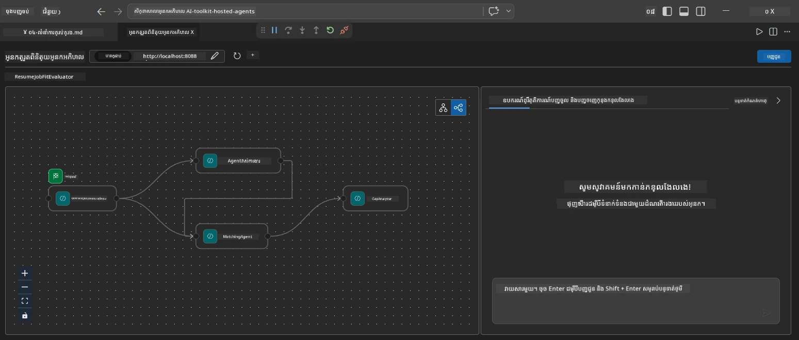
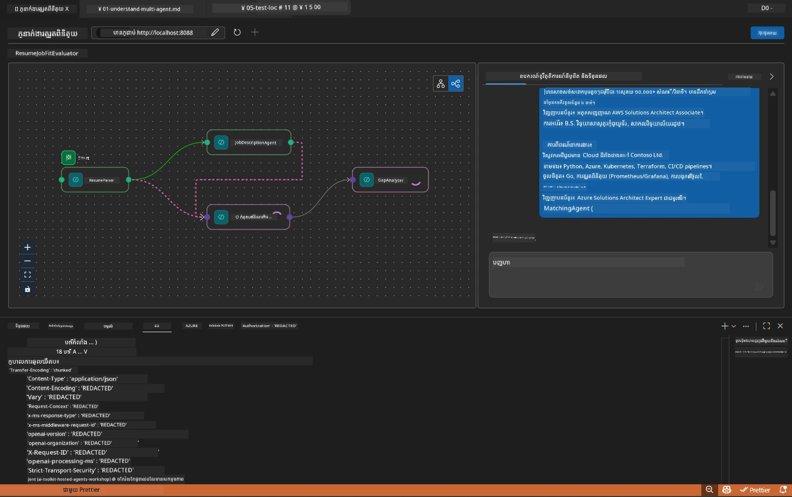
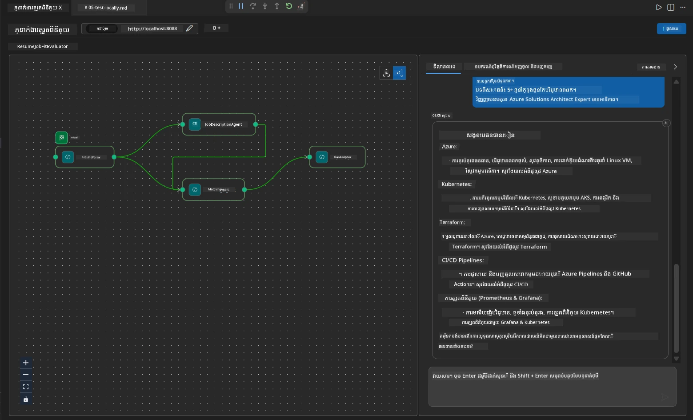

# មូឌុល 5 - ពិសោធនៅក្នុង កម្មវិធីរបស់អ្នក

⏱️ ~15 នាទី

ក្នុងមូឌុលនេះ អ្នកដំណើរការនីតិវិធី multi-agent នៅក្នុងកន្លែងធ្វើការ ពិសោធជាមួយ Agent Inspector ហើយបញ្ជាក់ថាអ្នកភ្នាក់ងារបួននាក់ និងឧបករណ៍ MCP អាចដំណើរការបានត្រឹមត្រូវ មុនពេលបញ្ចេញ។

---

## ជំហាន 1: ចាប់ផ្តើមម៉ាស៊ីនបម្រើ agent

### ជម្រើស A: ប្រើតំណាង VS Code (បានផ្ដល់អនុសាសន៍)

1. បើក `workshop/lab02-multi-agent/PersonalCareerCopilot/` ជាអថេរពាក្យ VS Code របស់អ្នក។
2. ចុច `Ctrl+Shift+P` → វាយពាក្យ **Tasks: Run Task** → ជ្រើស **Run Agent HTTP Server**។
3. ការងារចាប់ផ្តើមម៉ាស៊ីនបម្រើជាមួយ debugpy ចាក់នៅលើព្រួញ `5679` និង agent នៅលើព្រួញ `8088`។
4. រង់ចាំចេញផលបង្ហាញ៖

```
INFO:resume-job-fit:Starting Resume -> Job Fit Evaluator HTTP server...
INFO:resume-job-fit:Server running on http://localhost:8088
```

### ជម្រើស B: ប្រើប៊ូតុង F5 (ម៉ូដវាយតម្លៃ)

1. ចុច `F5` → ជ្រើស **Debug Local Agent HTTP Server**។
2. ម៉ាស៊ីនបម្រើចាប់ផ្តើមដោយមានគាំទ្រ breakpoint ពេញលេញ - មានប្រយោជន៍សម្រាប់ពិនិត្យពាក្យជំពូក MCP ឬផលបង្ហាញ agent។

---

## ជំហាន 2: បើក Agent Inspector

1. ចុច `Ctrl+Shift+P` → វាយពាក្យ **Foundry Toolkit: Open Agent Inspector**។
2. Agent Inspector បើកជាវីមែន VS Code ដែលភ្ជាប់ទៅ `http://localhost:8088`។
3. អ្នកគួរមើលឃើញមុខងារ agent ដែលរួចជាស្រេចដើម្បីទទួលសារជារៀងរាល់ពេល។



> **ប្រសិនបើ Agent Inspector មិនបើកឡើង:** ចូរត្រួតពិនិត្យថាម៉ាស៊ីនបម្រើបានចាប់ផ្តើមពេញលេញ (អ្នកឃើញកំណត់ត្រា "Server running")។ ប្រសិនបើព្រួញ 5679 រវល់ សូមមើល [មូឌុល 8 - ការដោះស្រាយបញ្ហា](08-troubleshooting.md)។

---

## ជំហាន 2b: (ជាជម្រើស) បើក Workflow Visualizer

Foundry Toolkit រួមបញ្ចូលកម្មវិធី **Workflow Visualizer** ពេលជាក់ស្តែង ដែលបង្ហាញពីរបៀបបន្តិចបន្តួចជាមួយអ្នកភ្នាក់ងារ ខណៈដែលក្រាបបើកដំណើរការ។ វាមានប្រយោជន៍ពិសេសសម្រាប់វាយតម្លៃ multi-agent។

1. ចុច `Ctrl+Shift+P` → វាយពាក្យ **Foundry Toolkit: Open Visualizer for Hosted Agents**។
2. ផ្ទាំងថ្មី​នៃ VS Code បើកបង្ហាញក្រាបដំណើរការរស់។
3. នៅពេលអ្នកផ្ញើសារនៅក្នុង Agent Inspector visualizer នឹងធ្វើការ Update តាមស្វ័យប្រវត្តិ - ចំណុចពណ៌បៃតងបង្ហាញថាអ្នកភ្នាក់ងារបានបញ្ចប់ ហើយខ្សែរតាមចលនាបង្ហាញទិន្នន័យបានផ្លាស់ប្តូររវាងពួកវា។

> **ជម្រុះព្រួញ:** ប្រសិនបើព្រួញ visualizer បានប្រើរួចហើយ សូមផ្លាស់ប្តូរវានៅក្នុងកំណត់ VS Code → **Extensions** → **Microsoft Foundry Configuration** → **Hosted Agents: Visualizer Port**។

---

## ជំហាន 3: រៀបចំការថតសាកល្បងត្រង់

រត់តេស្តទាំងបីនេះតាមលំដាប់។ តេស្តនីមួយៗ​ពិនិត្យការងារ​ដំណើរការបន្ថែម។

### តេស្ត 1៖ ប្រវត្តិរូបមូលដ្ឋាន + ការពិពណ៌នាការងារ

បិទបញ្ចូលអត្ថបទខាងក្រោមទៅក្នុង Agent Inspector៖

```
Resume:
Jane Doe
Senior Software Engineer with 5 years of experience in Python, Django, and AWS.
Built microservices handling 10K+ requests/second. Led a team of 4 developers.
Certifications: AWS Solutions Architect Associate.
Education: B.S. Computer Science, State University.

Job Description:
Senior Cloud Engineer at Contoso Ltd.
Required: Python, Azure, Kubernetes, Terraform, CI/CD pipelines.
Preferred: Go, monitoring (Prometheus/Grafana), cost optimization.
Experience: 5+ years in cloud infrastructure.
Certifications: Azure Solutions Architect Expert preferred.
```

**រចនាសម្ព័ន្ធចេញផ្សាយដែលរំពឹងទុក៖**

ចម្លើយគួរត្រូវមានលទ្ធផលពីអ្នកភ្នាក់ងារបួននាក់ជា លំដាប់ដូចខាងក្រោម៖

1. **ចេញពីមុខងារ Resume Parser** - ពីរផ្នែកមានស្លាកចំណៀង: `[PARSED RESUME]` (ប្រវត្តិរូបអ្នកដាក់ពាក្យជាមួយជំនាញចែកអាក្រក់) និង `[JOB DESCRIPTION PASS-THROUGH]` (អត្ថបទ JD ដើមដែលផ្តល់ទៅ JD Agent)
2. **ចេញពី JD Agent** - តម្រូវការតាមរចនាសម្ព័ន្ធទាំងជំនាញដែលត្រូវមាន និងជំនាញដែលចង់បាន
3. **ចេញពី Matching Agent** - ពិន្ទុសមរម្យ(0-100) ជាមួយការបំបែក ចំណេះដឹងដែលបានតម្រូវ ការខ្វះជំនាញ និងចន្លោះ
4. **ចេញពី Gap Analyzer** - កាតចន្លោះដេីម្បីរាល់ជំនាញដែលខ្វះ រៀងរាល់តែមួយមានតំណភ្ជាប់ Microsoft Learn





### តើត្រូវពិនិត្យអ្វីក្នុងតេស្ត 1

| ពិនិត្យ | រំពឹងទុក | អាចជាប់កម្រិត? |
|-------|----------|-------|
| ចម្លើយមានពិន្ទុសមរម្យ | លេខចន្លោះ 0-100 ជាមួយការបំបែក | |
| ជំនាញដែលបានចងក្រងមានបញ្ជី | Python, CI/CD (ពាក់ផ្លិត), ល។ | |
| ជំនាញខ្វះមានបញ្ជី | Azure, Kubernetes, Terraform, ល។ | |
| មានកាតចន្លោះសម្រាប់កំហុសរាល់ចំនុចខ្វះ | កាតមួយសម្រាប់ជំនាញមួយៗ | |
| មាន URL Microsoft Learn | តំណភ្ជាប់ពិត `learn.microsoft.com` | |
| មិនមានសារបញ្ហារកឃើញក្នុងចម្លើយ | លទ្ធផលរស់រវើកស្អាត | |

### តេស្ត 2: ករណីកម្ពស់ - អ្នកដាក់ពាក្យសមរម្យខ្ពស់

បិទបញ្ចូលប្រវត្តិរូបដែលស្រដៀងនឹង JD ដើម្បីបញ្ជាក់ថា GapAnalyzer បង្កើតករណីសមរម្យខ្ពស់។

```
Resume:
Alex Chen
Senior Cloud Engineer with 7 years of experience.
Skills: Python, Azure (AKS, Functions, DevOps), Kubernetes, Terraform, CI/CD (GitHub Actions, Azure Pipelines), Go, Prometheus, Grafana, cost optimization.
Certifications: Azure Solutions Architect Expert, Azure DevOps Engineer Expert.
Led infrastructure migration to Azure for 3 enterprise clients.
Education: M.S. Computer Science, Tech University.

Job Description:
Senior Cloud Engineer at Contoso Ltd.
Required: Python, Azure, Kubernetes, Terraform, CI/CD pipelines.
Preferred: Go, monitoring (Prometheus/Grafana), cost optimization.
Experience: 5+ years in cloud infrastructure.
Certifications: Azure Solutions Architect Expert preferred.
```

**អាកប្បកិរិយាររំពឹងទុក៖**
- ពិន្ទុសមរម្យគួរតែមាន **80+** (ជំនាញភាគច្រើនត្រូវគ្នា)
- កាតចន្លោះគួរផ្ដោតលើការតុបតែង/រួចរាល់សម្រាប់សម្ភាសន៍ ជំនួសការសិក្សាមូលដ្ឋាន
- សេចក្តីណែនាំ GapAnalyzer និយាយថា: "ប្រសិនបើ fit >= 80 សូមផ្ដោតលើការតុបតែង/រួចរាល់សម្រាប់សម្ភាសន៍"

---

## ជំហាន 4: ពិសោធជាមួយទិន្នន័យផ្ទាល់ខ្លួន (ជាជម្រើស)

សាកល្បងបិទបញ្ចូលប្រវត្តិរូបផ្ទាល់ខ្លួន និងការពិពណ៌នាការងារពិតប្រាកដ។ វាជួយក្នុងការបញ្ជាក់៖

- អ្នកភ្នាក់ងារដំណើរការនូវទ្រង់ទ្រាយប្រវត្តិរូបផ្សេងៗ (លំដាប់ពិធី, មុខងារ, រួមបញ្ចូល)
- JD Agent ដំណើរការប្រភេទការពិពណ៌នាការងារផ្សេងគ្នា (ចំណុច, បាតParagraph, រចនាសម្ព័ន្ធ)
- ឧបករណ៍ MCP បង្ហាញធនធានដែលពាក់ព័ន្ធសម្រាប់ជំនាញពិតប្រាកដ
- កាតចន្លោះត្រូវបានផ្ទាល់ខ្លួនទៅតាមរឿងទិដ្ឋភាពរបស់អ្នក

> **ភាពឯកជន - ផ្លូវ A (Foundry cloud):** ប្រវត្តិរូប និងអត្ថបទការពិពណ៌នាការងារ ត្រូវបានផ្ញើទៅកាន់ការដាក់ឱ្យដំណើរការជាមួយ Azure OpenAI របស់អ្នកសម្រាប់ការវិភាគ។ វាមិនត្រូវបានកត់ត្រា ឬរក្សាទុកដោយហេតុការណ៍ workshop ទេ។ ប្រសិនបើចង់ អ្នកអាចប្រើឈ្មោះដដែល (ឧទាហរណ៍ "Jane Doe")។
>
> **ភាពឯកជន - ផ្លូវ B (Foundry Local):** ការវិភាគ agent បួននាក់ ប្រតិបត្តិទៅលើឧបករណ៍របស់អ្នកទាំងស្រុង។ ប្រវត្តិរូប និងអត្ថបទការពិពណ៌នាការងាររបស់អ្នក **មិនដែលគេចេញពីម៉ាស៊ីនរបស់អ្នក**។ ការហៅចេញតែមួយគត់គឺឧបករណ៍ MCP ទាញយកធនធានពី `https://learn.microsoft.com/api/mcp` ដែលសំណួរនោះមានតែនាមជំនាញប៉ុណ្ណោះ មិនមែនទិន្នន័យផ្ទាល់ខ្លួនរបស់អ្នក។

---

### ចំណុចផ្ទៀងផ្ទាត់

- [ ] ម៉ាស៊ីនបម្រើចាប់ផ្តើមដោយជោគជ័យលើព្រួញ `8088` (កំណត់ត្រាបង្ហាញ "Server running")
- [ ] Agent Inspector បានបើក និងភ្ជាប់ទៅ agent
- [ ] តេស្ត 1៖ ចម្លើយពេញលេញជាមួយពិន្ទុសមរម្យ ជំនាញបានផ្គូព្វ​ផ្គង/ខ្វះ, កាតចន្លោះ និង URL Microsoft Learn
- [ ] តេស្ត 2៖ អ្នកដាក់ពាក្យដែលមានការសមរម្យខ្ពស់ ទាំងពិន្ទុ 80+ និងយោបល់ផ្ដោតលើការតុបតែង
- [ ] កាតចន្លោះទាំងអស់មាន (មួយសម្រាប់ជំនាញដែលខ្វះ មិនមានការបាត់បង់)
- [ ] គ្មានកំហុស ឬក៏កំណត់ត្រាទំនាក់ទំនងនៅក្នុងទីភ្នាក់ងារម៉ាស៊ីនបម្រើ

---

**មុននេះ:** [04 - លំនាំកំលាំង](04-orchestration-patterns.md) · **បន្ទាប់:** [06 - បញ្ចេញទៅ Foundry →](06-deploy-to-foundry.md)

---

<!-- CO-OP TRANSLATOR DISCLAIMER START -->
**ការបដិសេធ**:
ឯកសារនេះត្រូវបានបម្លែងភាសា ដោយប្រើសេវាបម្លែងភាសា AI [Co-op Translator](https://github.com/Azure/co-op-translator)។ ទោះយើងខ្ញុំមានក្តីប្រាថ្នាឱ្យបានច្បាស់លាស់ តែសូមយល់ដឹងថាការបម្លែងដោយស្វ័យប្រវត្តិក៏អាចមានកំហុសឬភាពមិនត្រឹមត្រូវ។ ឯកសារដើមជាភាសាទីតាំងគួរត្រូវបានគេប្រើជាប្រភពច្បាស់លាស់។ សម្រាប់ព័ត៌មានសំខាន់ៗ សូមណែនាំឱ្យប្រើប្រាស់ការប្រែដោយមនុស្សជំនាញ។ យើងខ្ញុំមិនទទួលខុសត្រូវចំពោះការយល់ច្រឡំ ឬការបកស្រាយខុសបន្ទាប់ពីការប្រើប្រាស់ការបម្លែងនេះនោះទេ។
<!-- CO-OP TRANSLATOR DISCLAIMER END -->