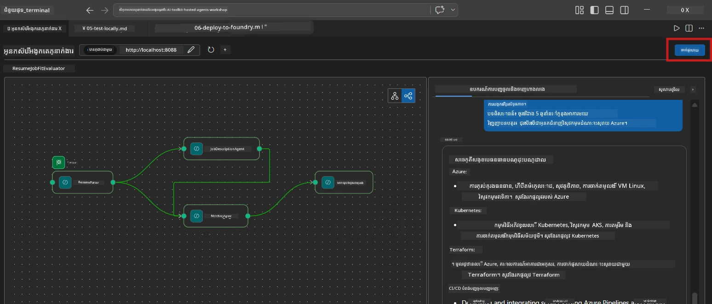
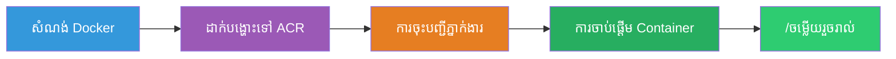
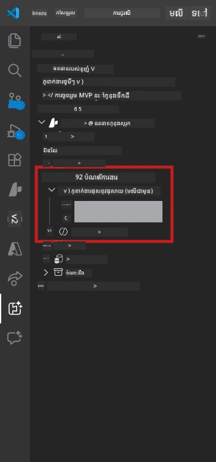

# Module 6 - ចាប់ផ្តើមដាក់បញ្ចូលទៅសេវាកម្ម Foundry Agent

នៅក្នុងម៉ូឌុលនេះ អ្នកនឹងដាក់បញ្ចូល workflow ជាអ្នកចូលចិត្តបួន-ជំនួយការមួយដែលបានសាកល្បងក្នុងតំបន់របស់អ្នកទៅ [Microsoft Foundry](https://learn.microsoft.com/azure/foundry/agents/concepts/hosted-agents) ក្នុងនាមជា **Hosted Agent**។ ដំណើរការដាក់បញ្ចូលបង្កើតរូបភាព container Docker មួយ បង្ហោះវាទៅកាន់ [Azure Container Registry (ACR)](https://learn.microsoft.com/azure/container-registry/container-registry-intro) ហើយបង្កើតកំណែ hosted agent នៅក្នុង [Foundry Agent Service](https://learn.microsoft.com/azure/foundry/agents/how-to/publish-agent)។

> **ចំណុចខុសគ្នាសំខាន់ពី Lab 01**: ដំណើរការដាក់បញ្ចូលដូចគ្នា។ Foundry គិត workflow បួន-ជំនួយការរបស់អ្នកជា hosted agent ពីរជាន់មួយ - ភាពស្មុគស្មាញនៅក្នុង container ប៉ុន្តែផ្ទៃការដាក់បញ្ចូលនៅតែគឺចុងបង្អស់ `/responses` ដូចគ្នា។

---

## ពិនិត្យតម្រូវការមុនដាក់បញ្ចូល

មុនដាក់បញ្ចូល សូមផ្ទៀងផ្ទាត់គ្រប់មុខដូចខាងក្រោម៖

1. **Agent បានឆ្លងតេស្តសង្ខេបក្នុងតំបន់ដោយជោគជ័យ៖**
   - អ្នកបានបញ្ចប់តេស្តទាំង 3 ក្នុង [Module 5](05-test-locally.md) ហើយ workflow ផលិតលទ្ធផលពេញលេញដែលមានកាតចន្លោះ និង URL Microsoft Learn ។

2. **អ្នកមានតួនាទី [Azure AI User](https://learn.microsoft.com/azure/foundry/concepts/rbac-foundry):**
   - បានចាត់វាយាងក្នុង [Lab 01, Module 2](../../lab01-single-agent/docs/02-create-foundry-project.md)។ សូមផ្ទៀងផ្ទាត់៖
   - [Azure Portal](https://portal.azure.com) → ប្រភពគម្រោង Foundry របស់អ្នក → **Access control (IAM)** → **Role assignments** → បញ្ជាក់ថា **[Azure AI User](https://aka.ms/foundry-ext-project-role)** មានបញ្ជីសម្រាប់គណនីអ្នក។

3. **អ្នកបានចុះឈ្មោះចូល Azure នៅក្នុង VS Code៖**
   - ពិនិត្យរូបតំណាង Accounts នៅផ្នែកខាងក្រោមឆ្វេងនៃ VS Code។ ឈ្មោះគណនីអ្នកគួរតែអាចមើលឃើញបាន។

4. **`agent.yaml` មានតម្លៃត្រឹមត្រូវ៖**
   - បើក `PersonalCareerCopilot/agent.yaml` ហើយផ្ទៀងផ្ទាត់៖
     ```yaml
     environment_variables:
       - name: PROJECT_ENDPOINT
         value: ${PROJECT_ENDPOINT}
       - name: MODEL_DEPLOYMENT_NAME
         value: ${MODEL_DEPLOYMENT_NAME}
     ```
   - តម្លៃទាំងនេះត្រូវតែត្រូវគ្នាជាមួយ env vars ដែល `main.py` អាន។

5. **`requirements.txt` មានកំណែត្រឹមត្រូវ៖**
   ```
   agent-framework-azure-ai==1.0.0rc3
   agent-framework-core==1.0.0rc3
   azure-ai-agentserver-agentframework==1.0.0b16
   azure-ai-agentserver-core==1.0.0b16
   debugpy
   agent-dev-cli --pre
   ```

---

## ជំហានទី 1៖ ចាប់ផ្តើមដាក់បញ្ចូល

### ជម្រើស A: ដាក់ពី Agent Inspector (បានណែនាំ)

បើ agent កំពុងរត់តាមរយៈ F5 ដោយមាន Agent Inspector បើក៖

1. ពិនិត្យមើលនៅ **មុខត្រង់ខាងលើខាងស្តាំ** គ្រឿងចក្របាន Agent Inspector។
2. ចុចប៊ូតុង **Deploy** (រូបតំណាងពពកជាមួយនឹងអង្គធាតុកន្លងឡើង ↑)។
3. កម្មវិធីដាក់បញ្ចូលនឹងបើកឡើង។



### ជម្រើស B: ដាក់ពី Command Palette

1. ចុច `Ctrl+Shift+P` ដើម្បីបើក **Command Palette**។
2. វាយ៖ **Microsoft Foundry: Deploy Hosted Agent** ហើយជ្រើសរើសវា។
3. កម្មវិធីដាក់បញ្ចូលនឹងបើកឡើង។

---

## ជំហានទី 2៖ កំណត់ការដាក់បញ្ចូល

### 2.1 ជ្រើសគម្រោងគោលដៅ

1. ប្រអប់ចុចចុះបង្ហាញគម្រោង Foundry របស់អ្នក។
2. ជ្រើសគម្រោងដែលអ្នកប្រើប្រាស់នៅក្នុងសិក្ខាសាលា (ឧ. `workshop-agents`)។

### 2.2 ជ្រើសឯកសារ container agent

1. អ្នកនឹងត្រូវការជ្រើសចំណុចចូល agent។
2. ទៅកាន់ `workshop/lab02-multi-agent/PersonalCareerCopilot/` ហើយជ្រើស **`main.py`**។

### 2.3 កំណត់ធនធាន

| កំណត់ | តម្លៃណែនាំ | កំណត់សម្គាល់ |
|---------|------------------|-------|
| **CPU** | `0.25` | លំនាំដើម។ Workflow បួន-ជំនួយការ មិនត្រូវការបន្ថែម CPU នោះទេ ព្រោះការហៅម៉ូដែលជាប្រភេទ I/O-bound |
| **Memory** | `0.5Gi` | លំនាំដើម។ បង្កើនទៅ `1Gi` ប្រសិនបើអ្នកបន្ថែមឧបករណ៍ដំណើរការទិន្នន័យធំ |

---

## ជំហានទី 3៖ ផ្ទៀងផ្ទាត់ និងដាក់បញ្ចូល

1. កម្មវិធីបង្ហាញសង្ខេបការដាក់បញ្ចូល។
2. ពិនិត្យមើល ហើយចុច **Confirm and Deploy**។
3. មើលការរីកចម្រើននៅក្នុង VS Code។

### តើមានអ្វីកើតឡើងក្នុងដំណើរការដាក់បញ្ចូល

មើលផ្ទាំង VS Code **Output** (ជ្រើស "Microsoft Foundry" ពីប្រអប់ចុះបញ្ជី)៖


1. **Docker build** - សង់ container ពី `Dockerfile` របស់អ្នក៖
   ```
   Step 1/6 : FROM python:3.14-slim
   Step 2/6 : WORKDIR /app
   ...
   Successfully built abc123def456
   ```

2. **Docker push** - បង្ហោះរូបភាពទៅ ACR (ចំណាយពេល 1-3 នាទី ក្នុងការដាក់បញ្ចូលដំបូង)។

3. **ការចុះឈ្មោះ agent** - Foundry បង្កើត hosted agent ប្រើទិន្នន័យ metadata ពី `agent.yaml`។ ឈ្មោះ agent គឺ `resume-job-fit-evaluator`។

4. **ការចាប់ផ្តើម container** - Container ចាប់ផ្តើមនៅក្នុងហេដ្ឋារចនាសម្ព័ន្ធដែលគ្រប់គ្រងដោយ Foundry ជាមួយអត្តសញ្ញាណគ្រប់គ្រងប្រព័ន្ធ។

> **ដាក់បញ្ចូលដំបូងយឺតជាង** (Docker បង្ហោះស្រទាប់ទាំងអស់)។ ដាក់បញ្ចូលបន្ទាប់ប្រើស្រទាប់ដែលបានកត់ត្រា និងលឿនជាង។

### កំណត់សម្គាល់ជាក់លាក់សម្រាប់ multi-agent

- **អ្នកចូលចិត្តបួនអ្នកនៅក្នុង container មួយ។** Foundry មើលប្រភេទ hosted agent ផ្ទាល់មួយ។ ក្រាប WorkflowBuilder រត់នៅខាងក្នុង។
- **ការហៅ MCP ទៅក្រៅ។** Container ត្រូវការចូលប្រើអ៊ីនធឺណេតដើម្បីទាក់ទងទៅ `https://learn.microsoft.com/api/mcp`។ ហេដ្ឋារចនាសម្ព័ន្ធគ្រប់គ្រងរបស់ Foundry ផ្ដល់នូវនេះជា​លំនាំដើម។
- **[Managed Identity](https://learn.microsoft.com/python/api/overview/azure/identity-readme#managed-identity-support).** នៅក្នុងបរិវេណ hosted, `get_credential()` ក្នុង `main.py` ត្រឡប់ `ManagedIdentityCredential()` (សម្រាប់ ព្រោះ `MSI_ENDPOINT` ត្រូវបានកំណត់)។ នេះជាស្វ័យប្រវត្តិ។

---

## ជំហានទី 4៖ ពិនិត្យស្ថានភាពការដាក់បញ្ចូល

1. បើកផ្ទាំងចំហ Microsoft Foundry (ចុចរូប Foundry នៅលើផ្ទាំង Activity Bar)។
2. ពង្រីក **Hosted Agents (Preview)** ខាងក្រោមគម្រោងអ្នក។
3. រក **resume-job-fit-evaluator** (ឬឈ្មោះ agent របស់អ្នក)។
4. ចុចលើឈ្មោះ agent → ពង្រីកកំណែ (ឧ. `v1`)។
5. ចុចលើកំណែ → ពិនិត្យ **Container Details** → **Status**៖



| ស្ថានភាព | អត្ថន័យ |
|--------|---------|
| **Started** / **Running** | Container កំពុងដំណើរការ, agent ត្រៀមសម្រាប់ប្រើ |
| **Pending** | Container កំពុងចាប់ផ្តើម (រងចាំ 30-60 វិនាទី) |
| **Failed** | Container មិនអាចចាប់ផ្តើមបាន (ពិនិត្យឯកសារ​សារ​កំហុស - មើលខាងក្រោម) |

> **ការចាប់ផ្តើម multi-agent យូរជាង single-agent** ព្រោះ container បង្កើត 4 instance agent នៅពេលចាប់ផ្តើម។ "Pending" រហូតដល់ 2 នាទី គឺធម្មតា។

---

## កំហុស និងដំណោះស្រាយដាក់បញ្ចូលទូទៅ

### កំហុសទី 1: មិនអនុញ្ញាត - `agents/write`

```
Error: lacks the required data action 
Microsoft.CognitiveServices/accounts/AIServices/agents/write
```

**ដោះស្រាយ:** ចាត់តួនាទី **[Azure AI User](https://learn.microsoft.com/azure/foundry/concepts/rbac-foundry)** នៅលើយានគមន្រ្តី **project**។ មើល [Module 8 - Troubleshooting](08-troubleshooting.md) សម្រាប់​ដំណើរការជាព្រឹតិ្តការណ៍ជាដំណាក់កាល។

### កំហុសទី 2: Docker មិនដំណើរការ

```
Error: Docker build failed / Cannot connect to Docker daemon
```

**ដោះស្រាយ:**
1. ចាប់ផ្តើម Docker Desktop។
2. រងចាំ "Docker Desktop is running"។
3. ផ្ទៀងផ្ទាត់៖ `docker info`
4. **Windows:** ប្រាកដថាបិទដំណើរការ WSL 2 backend ក្នុងកំណត់ Docker Desktop។
5. សាកល្បងម្ដងទៀត។

### កំហុសទី 3: pip install បរាជ័យក្នុងដំណើរការ Docker build

```
Error: Could not find a version that satisfies the requirement agent-dev-cli
```

**ដោះស្រាយ:** ទង់--pre នៅក្នុង `requirements.txt` ត្រូវបានដំណើរការ ផ្សេងៗក្នុង Docker។ ប្រាកដថា `requirements.txt` របស់អ្នកមាន៖
```
agent-dev-cli --pre
```

បើ Docker នៅតែបរាជ័យ បង្កើត `pip.conf` ឬផ្តល់វាជាការព្យាបាលតាមការពិពណ៌នាដំណើរការ build បន្ថែម។ មើល [Module 8](08-troubleshooting.md)។

### កំហុសទី 4: ឧបករណ៍ MCP បរាជ័យនៅ hosted agent

បើ Gap Analyzer បញ្ឈប់ការផលិត URLs របស់ Microsoft Learn បន្ទាប់ពីដាក់បញ្ចូល៖

**ហេតុផល:** គោលការណ៍បណ្តាញអាចចាក់វិធានការរក្សាសុវត្ថិភាព បិទបាំង HTTPS ផ្តាច់តំណាត់ពី container។

**ដោះស្រាយ៖**
1. តែភាគច្រើនមិនមានបញ្ហា​នេះជាមួយការ​កំណត់​លំនាំដើម Foundry ទេ។
2. ប្រសិនបើមាន ការពិនិត្យថា បណ្ដាញមូលដ្ឋានគម្រោង Foundry មាន NSG ដែលបិទបាំង HTTPS ឬអត់។
3. ឧបករណ៍ MCP មាន URL ច្រើនជំនួយផងដែរដូចជា fallback ដូច្នេះ agent នឹងនៅតែផលិតលទ្ធផល (ដោយគ្មាន URL បន្តផ្ទាល់)។

---

### ពិនិត្យមើល

- [ ] ពាក្យបញ្ជាដាក់បញ្ចូលបានបញ្ចប់ដោយគ្មានកំហុសនៅក្នុង VS Code
- [ ] Agent បង្ហាញនៅក្រោម **Hosted Agents (Preview)** នៅផ្ទៃខាង Foundry sidebar
- [ ] ឈ្មោះ agent គឺ `resume-job-fit-evaluator` (ឬឈ្មោះដែលអ្នកជ្រើសរើស)
- [ ] ស្ថានភាព container បង្ហាញជា **Started** ឬ **Running**
- [ ] (បើមានកំហុស) អ្នកបានសម្គាល់កំហុស អនុវត្តការជួសជុល និងដាក់បញ្ចូលម្តងទៀតដោយជោគជ័យ

---

**មុនหน้านี้:** [05 - Test Locally](05-test-locally.md) · **បន្ទាប់:** [07 - Verify in Playground →](07-verify-in-playground.md)

---

<!-- CO-OP TRANSLATOR DISCLAIMER START -->
**ការបដិសេធ**៖  
ឯកសារនេះត្រូវបានបកប្រែដោយប្រើសេវាបកប្រែ AI [Co-op Translator](https://github.com/Azure/co-op-translator) ។ ទោះបីយើងខិតខំប្រឹងប្រែងឲ្យបានច្បាស់លាស់ក៏ដោយ សូមយល់ថាការបកប្រែដោយស្វ័យប្រវត្តិនេះអាចមានកំហុស ឬភាពមិនត្រឹមត្រូវ។ ឯកសារដើមក្នុងភាសាមួយខ្លួនរបស់វាគួរត្រូវបានពិចារណាថាជាភស្តុតាងដើម។ សម្រាប់ព័ត៌មានសំខាន់ៗ ការបកប្រែដោយមនុស្សជំនាញគឺគួរត្រូវបានណែនាំ។ យើងមិនទទួលខុសត្រូវចំពោះការយល់ច្រឡំនិងការប្រាស្រ័យផ្សេងៗដែលកើតមានពីការប្រើប្រាស់ការបកប្រែនេះឡើយ។
<!-- CO-OP TRANSLATOR DISCLAIMER END -->