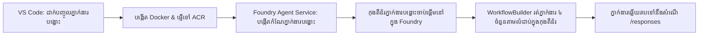
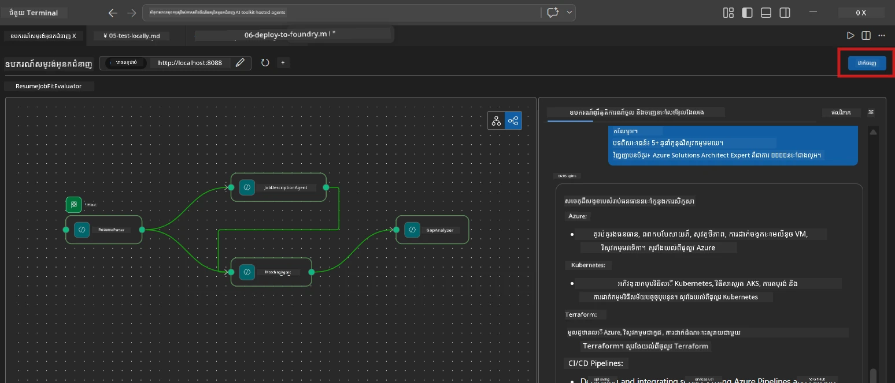
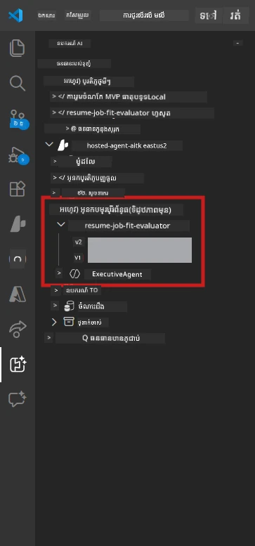

# មូឌុល ៦ - បង្ហោះទៅសេវាកម្ម Foundry Agent

⏱️ ~១០ នាទី

នៅក្នុងមូឌុលនេះ អ្នកនឹងបង្ហោះវីវរប្រតិបត្តិការប្រភេទ multi-agent ដែលបានសាកល្បងក្នុងកន្លែងរបស់អ្នកទៅ [Microsoft Foundry](https://learn.microsoft.com/azure/foundry/agents/concepts/hosted-agents) ជា **Hosted Agent**។ ដំណើរការបង្ហោះនេះបង្កើតរូបភាព container Docker មួយ ក្រោយមកបញ្ចូនវាទៅ [Azure Container Registry (ACR)](https://learn.microsoft.com/azure/container-registry/container-registry-intro) ហើយបង្កើតជាការបង្ហោះ hosted agent នៅក្នុង [Foundry Agent Service](https://learn.microsoft.com/azure/foundry/agents/how-to/publish-agent)។

> **ភាពខុសគ្នាសំខាន់ពី Lab 01:** ដំណើរការបង្ហោះដូចគ្នា។ Foundry ចាត់ទុកវីវរប្រតិបត្ត multi-agent របស់អ្នកជាអ្នកភ្នាក់ងារតែមួយដែលបានបង្ហោះ - ភាពស្មុគស្មាញស្ថិតនៅខាងក្នុង container ប៉ុន្តែផ្ទៃបង្ហោះគឺដូចគ្នា ជា endpoint `/responses`។

### បំពានការបង្ហោះ


```mermaid
flowchart LR
    A[VS Code: ដាក់បញ្ចូលភ្នាក់ងារបង្ហោះ] --> B[បង្កើត Docker & ផ្ញើទៅ ACR]
    B --> C[Foundry Agent Service: បង្កើតកំណែភ្នាក់ងារបង្ហោះ]
    C --> D[កុងតឺន័រភ្នាក់ងារបង្ហោះចាប់ផ្តើមនៅក្នុង Foundry]
    D --> E[WorkflowBuilder រត់ភ្នាក់ងារ ៤ ចំនួនតាមលំដាប់ក្នុងកុងតឺន័រ]
    E --> F[ភ្នាក់ងារឆ្លើយតបទៅនឹងសំណើ /responses]
```

---

## ការត្រួតពិនិត្យមុនការបង្ហោះ

មុននឹងបង្ហោះ សូមផ្ទៀងផ្ទាត់ធាតុទាំងអស់ខាងក្រោម៖

1. **អ្នកភ្នាក់ងារបញ្ចប់ការប្រឡងមូលដ្ឋានក្នុងតំបន់៖**
   - អ្នកបានបញ្ចប់តេស្តទាំង 3 នៅ [Module 5](05-test-locally.md) ហើយវីវរប្រតិបត្តិការបានបញ្ចេញលទ្ធផលពេញលេញ មាន gap cards និង URLs របស់ Microsoft Learn។

2. **អ្នកមានតួនាទី [Foundry User](https://learn.microsoft.com/azure/foundry/concepts/rbac-foundry)** (សម្រាប់បង្ហោះ អ្នកត្រូវការតួនាទីលើសយ៉ាងហោចណាស់ជា **Foundry Project Manager** នៅកម្រិតគម្រោង)៖

   > **កត់សម្គាល់៖** តួនាទី RBAC នៅ Foundry ប្រែឈ្មោះថ្មីម្តងទៀត - **Foundry User**, **Foundry Owner**, និង **Foundry Project Manager** បានត្រូវបានហៅពីមុនថា Azure AI User, Azure AI Owner, និង Azure AI Project Manager។ អត្តសញ្ញាណតួនាទី និងសិទ្ធិមិនបានផ្លាស់ប្តូរ។

   - ផ្ទៀងផ្ទាត់នៅ [Azure Portal](https://portal.azure.com) → ធនធានគម្រោង Foundry របស់អ្នក → **Access control (IAM)** → **Role assignments** → បញ្ជាក់ថា **Foundry User** (ឬលើស) មានក្នុងគណនីរបស់អ្នក។

3. **អ្នកបានចូលទៅក្នុង Azure នៅក្នុង VS Code៖**
   - ពិនិត្យរូបតំណាងគណនីនៅជ្រុងក្រោម-ឆ្វេងនៃ VS Code។ ឈ្មោះគណនីរបស់អ្នកគួរតែបង្ហាញ។

4. **`agent.yaml` មានតម្លៃត្រឹមត្រូវ៖**
   - បើក `PersonalCareerCopilot/agent.yaml` ហើយផ្ទៀងផ្ទាត់៖
     ```yaml
     environment_variables:
       - name: AZURE_AI_MODEL_DEPLOYMENT_NAME
         value: ${AZURE_AI_MODEL_DEPLOYMENT_NAME}
     ```
   - `FOUNDRY_PROJECT_ENDPOINT` មិនត្រូវបានបង្ហាញនៅទីនេះទេ - Foundry បញ្ចូលវានៅពេលដំណើរការ។ តែម្តង `AZURE_AI_MODEL_DEPLOYMENT_NAME` ត្រូវបានកំណត់តែប៉ុណ្ណោះ។

5. **`requirements.txt` មានកំណែត្រឹមត្រូវ៖**
   ```
   agent-framework-foundry
   agent-framework-foundry-hosting
   mcp<2,>=1.24.0
   debugpy
   ```

---

## ជំហាន ១៖ ចាប់ផ្តើមការបង្ហោះ

### ជម្រើស A: បង្ហោះពី Agent Inspector (ផ្តល់អនុសាសន៍)

ប្រសិនបើអ្នកភ្នាក់ងាររត់តាម F5 ជាមួយ Agent Inspector បើក៖

1. មើលនៅ **មុខងារម្ខាងស្តាំលើគោល** នៃផ្ទាំង Agent Inspector។
2. ចុចប៊ូតុង **Deploy** (រូបតំណាងពពកមានព្រួញកំពូល ↑)។
3. វីចារណករបង្ហោះបើកឡើង។



### ជម្រើស B: បង្ហោះពី Command Palette

1. ចុច `Ctrl+Shift+P` ដើម្បីបើក **Command Palette**។
2. វាយថា: **Foundry Toolkit: Deploy Hosted Agent** ហើយជ្រើសវា។
3. វីចារណករបង្ហោះបើកឡើង។

---

## ជំហាន ២៖ កំណត់ការបង្ហោះ

### ២.១ ជ្រើសគម្រោងគោលដៅ

1. បង្ហាញ dropdown របស់គម្រោង Foundry របស់អ្នក។
2. ជ្រើសគម្រោងដែលអ្នកបានប្រើក្នុងសិក្ខាសាលា (ឧ. `workshop-agents`)។

### ២.២ ជ្រើសឯកសារ container agent

1. អ្នកត្រូវបានស្នើឱ្យជ្រើសចំណុចចូល agent។
2. ទៅទី `workshop/lab02-multi-agent/PersonalCareerCopilot/` ហើយជ្រើស **`main.py`**។

### ២.៣ កំណត់ធនធាន

| ការកំណត់ | តម្លៃណែនាំ | កំណត់សម្គាល់ |
|---------|------------------|-------|
| **វិធីសាស្រ្តបង្ហោះ** | **Container** (ផ្តល់អនុសាសន៍) ឬ **Code** | Container សាងសង់រូបភាព Docker; Code ផ្ទុកកូដជា ZIP (នៅក្នុងការមើលជាមុន) |
| **របារ Container Registry** | **ACR ធម្មតា** | Foundry បង្កើត និងគ្រប់គ្រងសម្រាប់អ្នក |
| **CPU** | `0.25` | តម្លៃធម្មតា។ workflow multi-agent មិនត្រូវការពហុCPU ព្រោះការហៅម៉ូដែលជាអ្នកបន្ទាន់ I/O |
| **Memory** | `0.5Gi` | តម្លៃធម្មតា។ បន្ថែមទៅជា `1Gi` ប្រសិនបើអ្នកបន្ថែមឧបករណ៍ដំណើរការទិន្នន័យធំទូលាយ |

---

## ជំហាន ៣៖ បញ្ជាក់ហើយបង្ហោះ

1. វីចារណករបង្ហោះបង្ហាញសង្ខេបនៃការបង្ហោះ។
2. ពិនិត្យហើយចុច **Confirm and Deploy**។
3. មើលកំណត់ត្រាក្នុង VS Code។

### អ្វីកើតឡើងក្នុងពេលបង្ហោះ

មើលផ្ទាំង **Output** ក្នុង VS Code (ជ្រើសប្រអប់ "Microsoft Foundry")៖

1. **ការសាងសង់ Docker** - បង្កើត container ពី `Dockerfile` របស់អ្នក
   ```
   Step 1/6 : FROM python:3.12-slim
   Step 2/6 : WORKDIR /app
   ...
   Successfully built abc123def456
   ```

2. **ការបញ្ចូន Docker** - បញ្ចូនរូបភាពទៅ ACR (ចំនួន 1-3 នាទីនៅការបង្ហោះដំបូង)។

3. **ការចុះបញ្ជី Agent** - Foundry បង្កើត hosted agent ជាមួយ metadata `agent.yaml`។ ប ឈ្មោះអ្នកភ្នាក់ងារគឺ `resume-job-fit-evaluator`។

4. **ចាប់ផ្តើម container** - container ចាប់ផ្តើមនៅក្នុងបរិស្ថានគ្រប់គ្រងរបស់ Foundry ជាមួយអត្តសញ្ញាណដែលគ្រប់គ្រងដោយប្រព័ន្ធ។

> **ការបង្ហោះដំបូងយឺតជាងម្ដងទៀត** (Docker បញ្ចូនរាល់ស្រទាប់)។ ការបង្ហោះបន្ទាប់ប្រើស្រទាប់ដែលបានចាំបាច់ហើយលឿនជាង។

### កំណត់សម្គាល់ជាក់លាក់សម្រាប់ multi-agent

- **អ្នកភ្នាក់ងារជាចំនួនបួនស្ថិតនៅក្នុង container តែមួយ**។ Foundry មើលឃើញ hosted agent តែមួយ។ ក្រាហ្វិក WorkflowBuilder ប្រតិបត្តិការខាងក្នុង។
- **ការហៅ MCP ផ្លូវចេញ**។ container ត្រូវការការចូលបណ្ដាញអ៊ីនធឺណិតទៅ `https://learn.microsoft.com/api/mcp`។ បរិស្ថានគ្រប់គ្រងរបស់ Foundry ផ្តល់នេះដោយលំនាំដើម។
- **[Managed Identity](https://learn.microsoft.com/azure/foundry/agents/concepts/agent-identity)**។ Foundry បង្កើត **អត្តសញ្ញាណ Entra ផ្តល់ជូនជាឯករាជ្យសម្រាប់អ្នកភ្នាក់ងារតែមួយ** នៅពេលបង្ហោះ។ នៅក្នុងបរិស្ថាន hosted, `DefaultAzureCredential` ដោះស្រាយទៅអត្តសញ្ញាណ.agent នេះដោយស្វ័យប្រវត្តិ - មិនចាំបាច់តំឡើងរចនាសម្ព័ន្ធ managed identity ដោយដៃទេ។

---

## ជំហាន ៤៖ ពិនិត្យស្ថានភាពការបង្ហោះ

1. បើកខាងក្បែរបង្អួច **Microsoft Foundry** (ចុចរូបតំណាង Foundry នៅក្នុង Activity Bar)។
2. ពង្រីក **Hosted Agents (Preview)** ក្នុងគម្រោងរបស់អ្នក។
3. ស្វែងរក **resume-job-fit-evaluator** (ឬឈ្មោះអ្នកភ្នាក់ងាររបស់អ្នក)។
4. ចុចឈ្មោះអ្នកភ្នាក់ងារ → ពង្រីកកំណែ (ឧ. `v1`)។
5. ចុចកំណែ → ពិនិត្យ **Container Details** → **Status**:



| ស្ថានភាព | អត្ថន័យ |
|--------|---------|
| **active** | អ្នកភ្នាក់ងាររត់ហើយ និងរួចរាល់សម្រាប់ទទួលសំណើ |
| **creating** | container កំពុងចាប់ផ្តើម (រង់ចាំ ៣០–៦០ វិនាទី) |
| **failed** | container ចាប់ផ្តើមមិនបាន (ពិនិត្យកំណត់ត្រា - មើលខាងក្រោម) |

> **កត់សម្គាល់**៖ ផ្នែក sidebar របស់ VS Code អាចបង្ហាញស្លាកដូចជា “Running” ឬ “Started” ខណៈដែលស្ថានភាព API ចាំបាច់ប្រើ `active`/`creating`។ ការបង្ហាញទាំងពីរប្រាប់អំពីស្ថានភាពដូចគ្នា។

> **ការចាប់ផ្តើម multi-agent យឺតជាង** single-agent ព្រោះ container បង្កើតអ្នកភ្នាក់ងារជាមួយ៤ អាចគណនាក្នុងការចាប់ផ្តើម។ `creating` រយៈពេលដល់ ២ នាទី គឺធម្មតា។

---

## កំហុសបង្ហោះទូទៅ និងដំណោះស្រាយ

### កំហុស ១៖ អនុញ្ញាតបដិសេធ - `agents/write`

```
Error: lacks the required data action 
Microsoft.CognitiveServices/accounts/AIServices/agents/write
```

**ដំណោះស្រាយ៖** កំណត់តួនាទី **[Foundry User](https://learn.microsoft.com/azure/foundry/concepts/rbac-foundry)** (ពីមុនគឺ **Azure AI User**) នៅកម្រិត **គម្រោង**។ សូមមើល [Module 8 - Troubleshooting](08-troubleshooting.md) សម្រាប់ជំហានវិធីធ្វើ។

### កំហុស ២៖ Docker មិនដំណើរការ

```
Error: Docker build failed / Cannot connect to Docker daemon
```

**ដំណោះស្រាយ៖**
1. ចាប់ផ្តើម Docker Desktop។
2. រង់ចាំ "Docker Desktop is running"។
3. ផ្ទៀងផ្ទាត់៖ `docker info`
4. **Windows:** ប្រាកដថា WSL 2 backend បានបើកនៅក្នុងការកំណត់ Docker Desktop។
5. ព្យាយាមម្ដងទៀត។

### កំហុស ៣៖ pip install បរាជ័យនៅពេលសាងសង់ Docker

```
Error: Could not find a version that satisfies the requirement agent-framework-foundry
```

**ដំណោះស្រាយ៖** ផ្ទៀងផ្ទាត់ `requirements.txt` អោយត្រូវគ្នា៖
```
agent-framework-foundry
agent-framework-foundry-hosting
mcp<2,>=1.24.0
debugpy
```

ប្រសិនបើសាងសង់នៅតែបរាជ័យ បណ្ដាញ Docker របស់អ្នកអាចហាមឃាត់ PyPI។ ពិនិត្យ `docker info` សម្រាប់ការកំណត់ proxy។

### កំហុស ៤៖ ឧបករណ៍ MCP បរាជ័យនៅក្នុង hosted agent

ប្រសិនបើ Gap Analyzer បញ្ចប់ការផលិត URL Microsoft Learn បន្ទាប់ពីបង្ហោះ៖

**ហេតុបណ្តាល៖** គោលនយោបាយបណ្ដាញអាចហាមឃាត់ HTTPS ផ្លូវចេញពី container។

**ដំណោះស្រាយ៖**
1. នេះជារឿងធម្មតាប៉ុន្មានហើយរបៀបកំណត់លំនាំដើមរបស់ Foundry។
2. ប្រសិនបើវាកើតឡើង វាយតម្លៃមើលថាតើបណ្ដាញអ៊ីនធឺណិតភ្ជាប់គម្រោង Foundry មាន NSG បិទ HTTPS ផ្លូវចេញ។
3. ឧបករណ៍ MCP មាន URL ផ្តល់ជំនួយក្នុងករណីខ្ទង់ ដូច្នេះអ្នកភ្នាក់ងារត្រូវបង្ហាញលទ្ធផល (គ្មានតំណរផ្ទាល់)។

---

### ចំណុចពិនិត្យ

- [ ] ពាក្យបញ្ជាបង្ហោះបញ្ចប់ដោយគ្មានកំហុសនៅក្នុង VS Code
- [ ] អ្នកភ្នាក់ងារបង្ហាញនៅក្រោម **Hosted Agents (Preview)** ក្នុង sidebar Foundry
- [ ] ឈ្មោះអ្នកភ្នាក់ងារ គឺ `resume-job-fit-evaluator` (ឬឈ្មោះដែលអ្នកបានជ្រើសរើស)
- [ ] ស្ថានភាព container បង្ហាញជា **Started** ឬ **Running**
- [ ] (ប្រសិនបើមានកំហុស) អ្នកបានកំណត់កំហុសនេះ ហើយអនុវត្តដំណោះស្រាយ ហើយបង្ហោះម្ដងទៀតដោយជោគជ័យ

---

**មុននេះ:** [05 - Test Locally](05-test-locally.md) · **បន្ទាប់:** [07 - Verify in Playground →](07-verify-in-playground.md)

---

<!-- CO-OP TRANSLATOR DISCLAIMER START -->
**ការបដិសេធ**:
ឯកសារនេះត្រូវបានបម្លែងភាសា ដោយប្រើសេវាបម្លែងភាសា AI [Co-op Translator](https://github.com/Azure/co-op-translator)។ ទោះយើងខ្ញុំមានក្តីប្រាថ្នាឱ្យបានច្បាស់លាស់ តែសូមយល់ដឹងថាការបម្លែងដោយស្វ័យប្រវត្តិក៏អាចមានកំហុសឬភាពមិនត្រឹមត្រូវ។ ឯកសារដើមជាភាសាទីតាំងគួរត្រូវបានគេប្រើជាប្រភពច្បាស់លាស់។ សម្រាប់ព័ត៌មានសំខាន់ៗ សូមណែនាំឱ្យប្រើប្រាស់ការប្រែដោយមនុស្សជំនាញ។ យើងខ្ញុំមិនទទួលខុសត្រូវចំពោះការយល់ច្រឡំ ឬការបកស្រាយខុសបន្ទាប់ពីការប្រើប្រាស់ការបម្លែងនេះនោះទេ។
<!-- CO-OP TRANSLATOR DISCLAIMER END -->