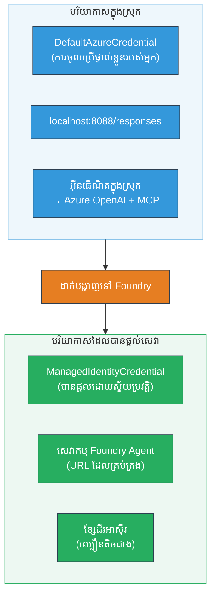

# Module 7 - ផ្ទៀងផ្ទាត់នៅក្នុងទីលានលេង (Playground)

ក្នុងម៉ូឌុលនេះ អ្នកតេស្តផ្លូវលំនៅលើការងាររបស់អ្នកដែលបានចែកចាយក្នុងតំបន់ multi-agent ទាំងនៅក្នុង **VS Code** និង **[Foundry Portal](https://ai.azure.com)** ដើម្បីបញ្ជាក់ទំនងថា agent អ្នកដំណើរការ​ដូចគ្នានឹងការតេស្តនៅលើកុំព្យូទ័រផ្ទាល់។

---

## ហេតុអ្វីបានជាត្រូវផ្ទៀងផ្ទាត់បន្ទាប់ពីចែកចាយ?

ការងារ multi-agent របស់អ្នកបានដំណើរការល្អនៅលើកុំព្យូទ័រផ្ទាល់ ដូច្នេះហេតុអ្វីត្រូវតេស្តម្តងទៀត? បរិស្ថានដែលផ្ទុកមានភាពខុសគ្នាជាច្រើន៖


| ផលផ្សេង | កុំព្យូទ័រផ្ទាល់ | ផ្ទុក |
|-----------|------------------|-------|
| **អត្តសញ្ញាណ** | [`DefaultAzureCredential`](https://learn.microsoft.com/azure/developer/python/sdk/authentication/credential-chains#defaultazurecredential-overview) (ការចុះឈ្មោះផ្ទាល់ខ្លួនរបស់អ្នក) | [`ManagedIdentityCredential`](https://learn.microsoft.com/python/api/overview/azure/identity-readme#managed-identity-support) (បានផ្តល់ដោយស្វ័យប្រវត្តិ) |
| **ចំណុចបញ្ចប់** | `http://localhost:8088/responses` | ចំណុចបញ្ចប់ [Foundry Agent Service](https://learn.microsoft.com/azure/foundry/agents/concepts/hosted-agents) (URL គ្រប់គ្រង) |
| **បណ្តាញ** | ឧបករណ៍ក្នុងស្រុក → Azure OpenAI + MCP ចេញក្រៅ | ស្រោមសរសៃ Azure (ពេលវេលាពីរវារតិចជាង) |
| **ការតភ្ជាប់ MCP** | អ៊ីនធឺណិតក្នុងស្រុក → `learn.microsoft.com/api/mcp` | កុងតឺន័រចេញក្រៅ → `learn.microsoft.com/api/mcp` |

បើអថេរបរិស្ថានណាមួយកំណត់ខុស ឬ RBAC ខុសគ្នា ឬ MCP ចេញក្រៅបិទការណ៍ អ្នកនឹងរកឃើញវាត្រង់នេះ។

---

## ជម្រើស A: តេស្តនៅក្នុង VS Code Playground (ណែនាំជាមុន)

[ផ្នែកបន្ថែម Foundry](https://marketplace.visualstudio.com/items?itemName=TeamsDevApp.vscode-ai-foundry) បញ្ចូលទីលានលេង(Playground) ដើម្បីអោយអ្នកអាចនិយាយជាមួយ agent របស់អ្នកដែលបានចែកចាយដោយមិនចេញពី VS Code ។

### ជំហាន 1៖ ទៅរក agent ដែលបានផ្ទុក

1. ចុចរូបតំណាង **Microsoft Foundry** នៅកន្លែង **Activity Bar** នៅ VS Code (ផ្នែកត្រង់ខាងឆ្វេង) ដើម្បីបើកផ្ទាំង Foundry។
2. ពង្រីកគម្រោងដែលបានភ្ជាប់ (ឧ. `workshop-agents`)។
3. ពង្រីក **Hosted Agents (Preview)**។
4. អ្នកគួរតែឃើញឈ្មោះ agent របស់អ្នក (ឧ. `resume-job-fit-evaluator`)។

### ជំហាន 2៖ ជ្រើសរើសកំណែ

1. ចុចលើឈ្មោះ agent ដើម្បីពង្រីកកំណែរបស់វា។
2. ចុចលើកំណែដែលបានចែកចាយ (ឧ. `v1`)។
3. ផ្ទាំងលម្អិតបង្ហាញព័ត៌មាន Container បើកឡើង។
4. ផ្ទៀងផ្ទាត់ស្ថានភាពថាជា **Started** ឬ **Running**។

### ជំហាន 3៖ បើកទីលានលេង (Playground)

1. នៅក្នុងផ្ទាំងលម្អិត ចុចប៊ូតុង **Playground** (ឬចុចម៉ៅស្ដាំលើកំណែ → **Open in Playground**)។
2. មុខងារសន្ទនា ត្រូវបើកក្នុងសតាវ័របស់ VS Code ។

### ជំហាន 4៖ រត់តេស្តស្ព្លុក (smoke tests) របស់អ្នក

ប្រើសារដដែល 3 តេស្តពី [Module 5](05-test-locally.md)។ វាយសារលេខមួយៗនៅក្នុងប្រអប់បញ្ចូលនៅក្នុង Playground ហើយចុច **Send** (ឬចុច **Enter**)។

#### តេស្ត 1 - ប្រវត្តិរូបពេញ + JD (ដំណើរការប្រើប្រាស់ស្តង់ដារ)

បិទបញ្ចូលបញ្ហារូប + JD ពី Module 5, តេស្ត 1 (Jane Doe + Senior Cloud Engineer នៅ Contoso Ltd)។

**ដែលរំពឹងទុក:**
- ពិន្ទុភាពសមស្របជាមួយគណិតវិទ្យារបាយការណ៍ (វិសាលភាព ១០០ ពិន្ទុ)
- ផ្នែកជំនាញដែលផ្គូផ្គង
- ផ្នែកជំនាញខ្វះ
- **កាតចន្លោះមួយក្នុងរាល់ជំនាញខ្វះ** ជាមួយ URL របស់ Microsoft Learn
- ផែនទីរៀនដែលផ្ដោតលើកាលវិភាគ

#### តេស្ត 2 - តេស្តខ្លីលឿន (បញ្ចូលតិចបំផុត)

```
RESUME: 3 years Python developer, knows Django and PostgreSQL, no cloud experience.

JOB: Cloud DevOps Engineer requiring AWS, Kubernetes, Terraform, CI/CD. 5 years needed.
```

**ដែលរំពឹងទុក:**
- ពិន្ទុភាពសមស្របទាប (< 40)
- ការវាយតម្លៃចំពោះភាពស្មោះត្រង់ ជាមួយផ្លូវរៀនជាលំដាប់
- កាតចន្លោះជាច្រើន (AWS, Kubernetes, Terraform, CI/CD, ខ្វះបទពិសោធន៍)

#### តេស័ត 3 - អ្នកដំណើរការដែលសមស្របខ្ពស់

```
RESUME:
10 years Azure Cloud Architect. AZ-305 certified. Expert in AKS, Terraform, Azure DevOps, 
Azure Functions, Helm, Prometheus, Grafana, Python, Go. Led platform team of 8.

JOB:
Senior Cloud Engineer. Required: AKS, Terraform, Azure DevOps, Python. Preferred: Helm, Go.
5+ years experience. AZ-305 preferred.
```

**ដែលរំពឹងទុក:**
- ពិន្ទុភាពសមស្របខ្ពស់ (≥ 80)
- ផ្ដោតលើការរៀបចំសម្ភាសន៍ និងដោះស្រាយលម្អិត
- មានកាតចន្លោះតិច ឬមិនមានកាតចន្លោះ
- ពេលវេលាសង្ខេបផ្ដោតលើការរៀបចំ

### ជំហាន 5៖ ប្រៀបធៀបជាមួយលទ្ធផលក្នុងស្រុក

បើកកំណត់ត្រារបស់អ្នក ឬផ្ទាំងកម្មវិធីរុករកពី Module 5 ដែលបានរក្សា លទ្ធផលក្នុងស្រុក។ សម្រាប់តេស្តនីមួយៗ៖

- តើវាតាមរចនាសម្ព័ន្ធដដែលទេ? (ពិន្ទុភាពសមស្រប, កាតចន្លោះ, ផែនទី)
- តើវាអនុវត្តតាមគន្លងពិន្ទុដដែលទេ? (ទម្រង់ ១០០ ពិន្ទុ)
- តើ URL របស់ Microsoft Learn នៅស្ថិតនៅក្នុងកាតចន្លោះទេ?
- តើមានកាតចន្លោះមួយក្នុងរាល់ជំនាញខ្វះមួយទេ? (មិនដាច់ខ្សែ)

> **ភាពខុសគ្នាក្នុងមួយចំនួននៃពាក្យគឺធម្មតា** - ម៉ូដែលគឺមិនកំណត់ត្រឹមត្រូវតែម្ដង។ ផ្ដោតលើរចនាសម្ព័ន្ធ ការប្រមាណពិន្ទុជាប់គ្នា និងការប្រើប្រាស់ឧបករណ៍ MCP។

---

## ជម្រើស B: តេស្តនៅក្នុង Foundry Portal

[Foundry Portal](https://ai.azure.com) ផ្ដល់មុខងារដែលអាចប្រើបានតាមវ៉ែប សម្រាប់ចែករំលែកជាមួយក្រុមការងារ ឬអ្នកមានការចាប់អារម្មណ៍។

### ជំហាន 1៖ បើក Foundry Portal

1. បើកកម្មវិធីរុករក ហើយចូលទៅ [https://ai.azure.com](https://ai.azure.com)។
2. ចុះឈ្មោះជាមួយគណនី Azure ដដែលដែលអ្នកបានប្រើក្នុងវគ្គសិក្សា។

### ជំហាន 2៖ ទៅរកគម្រោងរបស់អ្នក

1. នៅផ្ទាំងទំព័រដើម ស្វែងរក **Recent projects** នៅផ្នែកខាងឆ្វេង។
2. ចុចលើឈ្មោះគម្រោងរបស់អ្នក (ឧ. `workshop-agents`)។
3. បើមិនឃើញ ចុច **All projects** ហើយស្វែងរកវា។

### ជំហាន 3៖ ស្វែងរក agent ដែលបានចែកចាយ

1. នៅក្នុងការរុករកគម្រោងខាងឆ្វេង ចុច **Build** → **Agents** (ឬស្វែងរកផ្នែក **Agents**)។
2. អ្នកគួរតែឃើញបញ្ជី agent ។ ស្វែងរក agent ដែលបានចែកចាយ (ឧ. `resume-job-fit-evaluator`)។
3. ចុចលើឈ្មោះ agent ដើម្បីបើកទំព័រលម្អិត។

### ជំហាន 4៖ បើកទីលានលេង (Playground)

1. នៅលើទំព័រលម្អិត agent មើលផ្នែកខាងលើរបស់ធូបាស
2. ចុច **Open in playground** (ឬ **Try in playground**)។
3. មុខងារសន្ទនាត្រូវបើក។

### ជំហាន 5៖ រត់តេស្តស្ព្លុកដដែល

ធ្វើឡើងស្តីពីតេស្តទាំង 3 ពីផ្នែក VS Code Playground ខាងលើ។ ប្រៀបធៀបចម្លើយនីមួយៗជាមួយលទ្ធផលក្នុងស្រុក (Module 5) និង VS Code Playground (ជម្រើស A ខាងលើ)។

---

## ការផ្ទៀងផ្ទាត់ជាក់លាក់សម្រាប់ multi-agent

ក្រៅពីភាពត្រឹមត្រូវមូលដ្ឋាន ផ្ទៀងផ្ទាត់អក្‍សរបស់ multi-agent ទាំងនេះ៖

### ការប្រតិបត្ដិរបស់ឧបករណ៍ MCP

| ត្រួតពិនិត្យ | របៀបផ្ទៀងផ្ទាត់ | លក្ខខណ្ឌជោគជ័យ |
|--------------|-------------------|--------------------|
| ការហៅ MCP ជាប់រហូត | កាតចន្លោះមាន URL `learn.microsoft.com` | URL ពិត មិនមែនសារមិនទាន់មាន |
| ការហៅ MCP ច្រើន | ក្នុងកាតចន្លោះពិន្ទុខ្ពស់/មធ្យម មានធនធាន | មិនមែនតែនៅត្រឹមកាតចន្លោះដំបូងទេ |
| ការជំនួស MCP មានប្រសិទ្ធភាព | ប្រសិនបើខ្វះ URL ត្រួតពិនិត្យសារជំនួស | Agent ក៏នៅបង្កើតកាតចន្លោះ (មានឬគ្មាន URL) |

### ការសម្របសម្រួលរវាង agent

| ត្រួតពិនិត្យ | របៀបផ្ទៀងផ្ទាត់ | លក្ខខណ្ឌជោគជ័យ |
|--------------|-------------------|--------------------|
| Agent ទាំង 4 បានដំណើរការ | លទ្ធផលមានពិន្ទុភាពសមស្រប និងកាតចន្លោះ | ពិន្ទុពី MatchingAgent, កាតពី GapAnalyzer |
| ការបែងចែកការងារត្រូវបន្តបន្ទាប់ | ពេលវេលាចម្លើយមិនយូរពេក (< 2 នាទី) | ប្រសិនបើ > 3 នាទី អាចមានបញ្ហាការអនុវត្តពហុជំរក |
| សុពលភាពទិន្នន័យ | កាតចន្លោះយោងទៅលើជំនាញពីរបាយការណ៍សមស្រប | មិនមានជំនាញបង្កើតឡើងដោយចៃដន្យក្នុង JD |

---

## គ្រប់គ្រងការវាយតម្លៃ

ប្រើតារាងនេះដើម្បីវាយតម្លៃអាកប្បកម្មរបស់ multi-agent វិញ្ញាសាទៅលើបរិស្ថានផ្ទុកដូចខាងក្រោម៖

| # | លក្ខណៈ | លក្ខខណ្ឌជោគជ័យ | ផុស? |
|---|----------|-----------------|-------|
| 1 | **ភាពត្រឹមត្រូវមុខងារ** | Agent ឆ្លើយតបទៅប្រវត្តិរូប + JD ជាមួយពិន្ទុភាពសមស្រប និងវិភាគចន្លោះ | |
| 2 | **ភាពត្រឹមត្រូវនៃការ ប្រមាណពិន្ទុ** | ពិន្ទុភាពប្រើវិសាលភាព ១០០ ពិន្ទុជាមួយគណិតវិទ្យាបំបែក | |
| 3 | **ភាពពេញលេញនៃកាតចន្លោះ** | កាតមួយសម្រាប់រាល់ជំនាញខ្វះ (មិនបានដាច់ខ្សែ ឬបញ្ចូលគ្នា) | |
| 4 | **ការបញ្ចូលឧបករណ៍ MCP** | កាតចន្លោះមាន URL Microsoft Learn ជាក់ស្តែង | |
| 5 | **ភាពជាប់គ្នារចនាសម្ព័ន្ធ** | រចនាសម្ព័ន្ធលទ្ធផលស្រដៀងគ្នារវាងការរត់ក្នុងស្រុក និងផ្ទុកចេញ | |
| 6 | **ពេលវេលាចម្លើយ** | Agent ផ្ទុកឆ្លើយក្នុងរយៈពេល ២ នាទីសម្រាប់ការវាយតម្លៃពេញលេញ | |
| 7 | **គ្មានកំហុស** | គ្មានកំហុស HTTP 500, ពេលវេលា វេចខ្ចប់, រឺចម្លើយទទេ | |

> “ជោគជ័យ” មានន័យថា លក្ខណៈទាំង ៧ ត្រូវបានជួបសម្រាប់តេស្តស្ព្លុកទាំង ៣ ក្នុងទីលានលេងមួយ (VS Code ឬ Portal)។

---

## ដោះស្រាយបញ្ហាទីលានលេង

|រោគសញ្ញា|ហេតុសម្ងាត់|ដំណោះស្រាយ|
|-|-|-|
| ទីលានលេងមិនបើកឡើង | ស្ថានភាព Container មិនមែន "Started" | ត្រឡប់ទៅ [Module 6](06-deploy-to-foundry.md) ពិនិត្យស្ថានភាពចែកចាយ។ រង់ចាំបើ "Pending" |
| Agent ឆ្លើយសូន្យ | ឈ្មោះការចែកចាយម៉ូដែលមិនត្រូវគ្នា | ពិនិត្យ `agent.yaml` → `environment_variables` → `MODEL_DEPLOYMENT_NAME` ត្រូវគ្នាជាមួយម៉ូដែលដែលបានចែកចាយ |
| Agent ឆ្លើយកំហុស | [RBAC](https://learn.microsoft.com/azure/foundry/concepts/rbac-foundry) អនុញ្ញាតខ្វះ | ផ្ដល់តួនាទី **[Azure AI User](https://aka.ms/foundry-ext-project-role)** នៅលើគម្រោង |
| គ្មាន URL Microsoft Learn នៅក្នុងកាតចន្លោះ | MCP ចេញក្រៅត្រូវបានបិទឬម៉ាស៊ីនបម្រើ MCP មិនអាចប្រើបាន | ពិនិត្យថា container អាចទាក់ទងទៅ `learn.microsoft.com` បាន។ មើល [Module 8](08-troubleshooting.md) |
| មានតែ 1 កាតចន្លោះ (ដាច់ខ្សែ) | សេចក្ដីណែនាំ GapAnalyzer ខ្វះប្លុក "CRITICAL" | ពិនិត្យ [Module 3, Step 2.4](03-configure-agents.md) |
| ពិន្ទុភាពសមស្របខុសគ្នាច្រើនពីក្នុងស្រុក | ម៉ូដែលឬសេចក្ដីណែនាំខុសគ្នានិងបានចែកចាយ | ប្រៀបធៀប `agent.yaml` បរិស្ថានជាមួយ `.env` ក្នុងស្រុក។ ធ្វើការចែកចាយម្ដងទៀតបើចាំបាច់ |
| "Agent not found" នៅ Portal | ការចែកចាយនៅកំពុងផ្សព្វផ្សាយឬបរាជ័យ | រង់ចាំ ២ នាទី រួចធ្វើបច្ចុប្បន្នភាព។ បើមិនមាននៅតែមាន សូមចែកចាយម្ដងទៀតពី [Module 6](06-deploy-to-foundry.md) |

---

### ចំណុចសម្រាប់ត្រួតពិនិត្យ

- [ ] បានតេស្ត agent នៅ VS Code Playground - តេស្តស្ព្លុកទាំង 3 ជោគជ័យ
- [ ] បានតេស្ត agent នៅ [Foundry Portal](https://ai.azure.com) Playground - តេស្តស្ព្លុកទាំង 3 ជោគជ័យ
- [ ] ចម្លើយមានរចនាសម្ព័ន្ធជាប់គ្នាជាមួយការតេស្តក្នុងស្រុក (ពិន្ទុភាពសមស្រប, កាតចន្លោះ, ផែនទីរៀន)
- [ ] URL Microsoft Learn មាននៅក្នុងកាតចន្លោះ (ឧបករណ៍ MCP ដំណើរការល្អនៅក្នុងបរិស្ថានផ្ទុក)
- [ ] កាតចន្លោះមួយសម្រាប់រាល់ជំនាញខ្វះ (មិនដាច់ខ្សែ)
- [ ] គ្មានកំហុស ឬពេលវេលាលំបាកក្នុងកំឡុងពេលតេស្ត
- [ ] បានបញ្ចប់ការវាយតម្លៃតាមតារាង (លក្ខណៈទាំង 7 សម្រេចបាន)

---

**មុនពីនេះ:** [06 - Deploy to Foundry](06-deploy-to-foundry.md) · **បន្ទាប់:** [08 - Troubleshooting →](08-troubleshooting.md)

---

<!-- CO-OP TRANSLATOR DISCLAIMER START -->
**ការបដិសេធ**៖
ឯកសារនេះត្រូវបានបកប្រែដោយប្រើសេវាកម្មបកប្រែ AI [Co-op Translator](https://github.com/Azure/co-op-translator)។ ខណៈពេលយើងខិតខំប្រឹងប្រែងសម្រាប់ភាពត្រឹមត្រូវ សូមកំណត់ចំណាំថាការបកប្រែដោយស្វ័យប្រវត្តិអាចមានកំហុសឬភាពមិនត្រឹមត្រូវ។ ឯកសារដើមក្នុងភាសាមូលដ្ឋានរបស់វាគួរត្រូវបានចាត់ទុកជាអភិបាលកម្មគោល។ សម្រាប់ព័ត៌មានសំខាន់ៗ ការបកប្រែដោយមនុស្សជំនាញត្រូវបានផ្ដល់អនុស្សាវរីយ៏។ យើងមិនទទួលខុសត្រូវចំពោះការយល់ច្រឡំ ឬការបកស្រាយខុសពីការប្រើប្រាស់ការបកប្រែនេះឡើយ។
<!-- CO-OP TRANSLATOR DISCLAIMER END -->