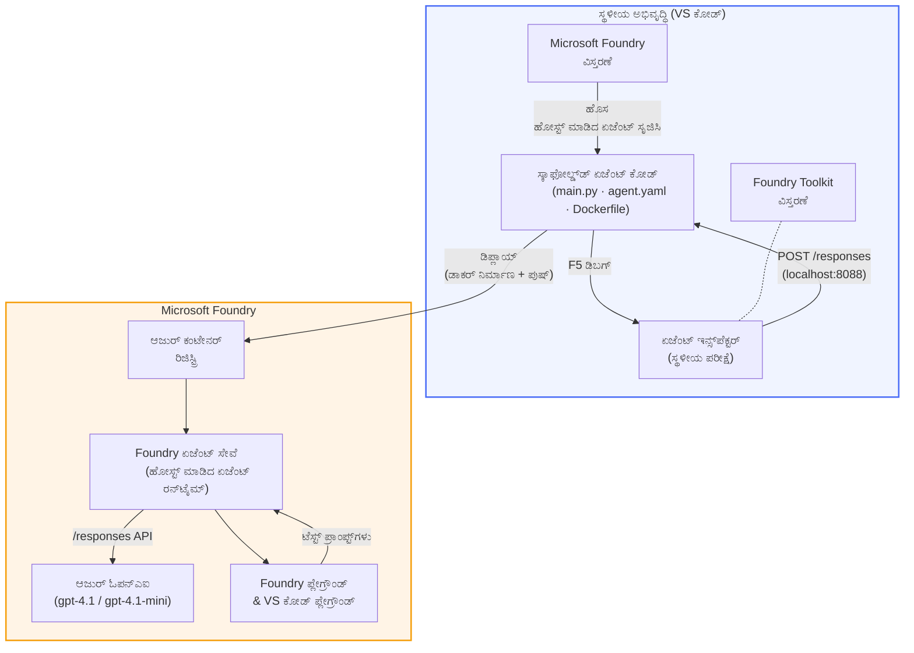

# Foundry Toolkit + Foundry Hosted Agents ಕಾರ್ಯಾಗಾರ

[](https://www.python.org/)
[](https://github.com/microsoft/agents)
[](https://learn.microsoft.com/azure/ai-foundry/agents/concepts/hosted-agents/)
[](https://ai.azure.com/)
[](https://learn.microsoft.com/azure/ai-services/openai/)
[](https://learn.microsoft.com/cli/azure/install-azure-cli)
[](https://learn.microsoft.com/azure/developer/azure-developer-cli/install-azd)
[](https://www.docker.com/)
[](https://marketplace.visualstudio.com/items?itemName=ms-windows-ai-studio.windows-ai-studio)
[](LICENSE)

**Microsoft Foundry Agent Service** ಗೆ **Hosted Agents** ಆಗಿ AI ಏಜೆಂಟ್ಸ್ ರಚಿಸಿ, ಪರೀಕ್ಷಿಸಿ, ಮತ್ತು ನಿಯೋಜಿಸಿ — ಸಂಪೂರ್ಣವಾಗಿ VS Code ನಿಂದ **Microsoft Foundry ವಿಸ್ತರಣೆ** ಮತ್ತು **Foundry Toolkit** ಬಳಸಿ.

> **Hosted Agents ಪ್ರಸ್ತುತ ಪೂರ್ವವೀಕ್ಷಣೆಯಲ್ಲಿ (preview) ಇದೆ.** ಬೆಂಬಲಿತ ಪ್ರಾಂತ್ಯಗಳು ನಿರ್ಬಂಧಿತವಾಗಿವೆ - [ಪ್ರಾಂತ್ಯ ಲಭ್ಯತೆ](https://learn.microsoft.com/azure/foundry/agents/concepts/hosted-agents#region-availability) ನೋಡಿ.

> ಪ್ರತಿ ಪ್ರಯೋಗಾಲಯದ ಒಳಗಿನ `agent/` ಫೋಲ್ಡರ್ ಅನ್ನು Foundry ವಿಸ್ತರಣೆ **ಸ್ವಯಂಚಾಲಿತವಾಗಿ ಸೊಕ್ಕಟ್ ಮಾಡುತ್ತದೆ** — ನಂತರ ನೀವು ಕೋಡ್ ಅನ್ನು ಕಸ್ಟಮೈಸ್ ಮಾಡಿ, ಸ್ಥಳೀಯವಾಗಿ ಪರೀಕ್ಷಿಸಿ, ಮತ್ತು ನಿಯೋಜಿಸಿ.

### 🌐 ಬಹುಭಾಷಾ ಬೆಂಬಲ

#### GitHub ಆಗತಲ್ಲಿ ಬೆಂಬಲಿತ (ಸ್ವಚಾಲಿತ ಮತ್ತು ಸದಾ ನವೀಕೃತ)

<!-- CO-OP TRANSLATOR LANGUAGES TABLE START -->
[Arabic](../ar/README.md) | [Bengali](../bn/README.md) | [Bulgarian](../bg/README.md) | [Burmese (Myanmar)](../my/README.md) | [Chinese (Simplified)](../zh-CN/README.md) | [Chinese (Traditional, Hong Kong)](../zh-HK/README.md) | [Chinese (Traditional, Macau)](../zh-MO/README.md) | [Chinese (Traditional, Taiwan)](../zh-TW/README.md) | [Croatian](../hr/README.md) | [Czech](../cs/README.md) | [Danish](../da/README.md) | [Dutch](../nl/README.md) | [Estonian](../et/README.md) | [Finnish](../fi/README.md) | [French](../fr/README.md) | [German](../de/README.md) | [Greek](../el/README.md) | [Hebrew](../he/README.md) | [Hindi](../hi/README.md) | [Hungarian](../hu/README.md) | [Indonesian](../id/README.md) | [Italian](../it/README.md) | [Japanese](../ja/README.md) | [Kannada](./README.md) | [Khmer](../km/README.md) | [Korean](../ko/README.md) | [Lithuanian](../lt/README.md) | [Malay](../ms/README.md) | [Malayalam](../ml/README.md) | [Marathi](../mr/README.md) | [Nepali](../ne/README.md) | [Nigerian Pidgin](../pcm/README.md) | [Norwegian](../no/README.md) | [Persian (Farsi)](../fa/README.md) | [Polish](../pl/README.md) | [Portuguese (Brazil)](../pt-BR/README.md) | [Portuguese (Portugal)](../pt-PT/README.md) | [Punjabi (Gurmukhi)](../pa/README.md) | [Romanian](../ro/README.md) | [Russian](../ru/README.md) | [Serbian (Cyrillic)](../sr/README.md) | [Slovak](../sk/README.md) | [Slovenian](../sl/README.md) | [Spanish](../es/README.md) | [Swahili](../sw/README.md) | [Swedish](../sv/README.md) | [Tagalog (Filipino)](../tl/README.md) | [Tamil](../ta/README.md) | [Telugu](../te/README.md) | [Thai](../th/README.md) | [Turkish](../tr/README.md) | [Ukrainian](../uk/README.md) | [Urdu](../ur/README.md) | [Vietnamese](../vi/README.md)

> **ಸ್ಥಳೀಯವಾಗಿ ಕ್ಲೋನ್ ಮಾಡುವುದು ಮುಂಚಿತವೇ?**
>
> ಈ ಸಂಗ್ರಹವಿನಲ್ಲಿ 50+ ಭಾಷಾ ಅನುವಾದಗಳಿವೆ, ಇದು ಡೌನ್‌ಲೋಡ್ ಗಾತ್ರವನ್ನು ಬಹಳಷ್ಟು ಹೆಚ್ಚಿಸುತ್ತದೆ. ಅನುವಾದಗಳಿಲ್ಲದೆ ಕ್ಲೋನ್ ಮಾಡಲು, ಸ್ಪಾರ್ಸ್ ಚೆಕ್‌ಔಟ್ ಬಳಸಿ:
>
> **Bash / macOS / Linux:**
> ```bash
> git clone --filter=blob:none --sparse https://github.com/microsoft-foundry/Foundry_Toolkit_for_VSCode_Lab.git
> cd Foundry_Toolkit_for_VSCode_Lab
> git sparse-checkout set --no-cone '/*' '!translations' '!translated_images'
> ```
>
> **CMD (Windows):**
> ```cmd
> git clone --filter=blob:none --sparse https://github.com/microsoft-foundry/Foundry_Toolkit_for_VSCode_Lab.git
> cd Foundry_Toolkit_for_VSCode_Lab
> git sparse-checkout set --no-cone "/*" "!translations" "!translated_images"
> ```
>
> ಇದು ಕೋರ್ಸ್ ಪೂರ್ಣಗೊಳಿಸಲು ಅಗತ್ಯವಿರುವ ಎಲ್ಲಾ ವಿಷಯಗಳನ್ನು ಹೆಚ್ಚು ವೇಗದ ಡೌನ್‌ಲೋಡ್‌ನೊಂದಿಗೆ ಒದಗಿಸುತ್ತದೆ.
<!-- CO-OP TRANSLATOR LANGUAGES TABLE END -->

---

## ವಾಸ್ತುಶಿಲ್ಪ


**ಪ್ರವಾಹ:** Foundry ವಿಸ್ತರಣೆ ಏಜೆಂಟ್ ಅನ್ನು ಸೊಕ್ಕಟ್ ಮಾಡುತ್ತದೆ → ನೀವು ಕೋಡ್ ಮತ್ತು ನಿರ್ದೇಶನಗಳನ್ನು ಕಸ್ಟಮೈಸ್ ಮಾಡುತ್ತೀರಿ → Agent Inspector ನಿಂದ ಸ್ಥಳೀಯವಾಗಿ ಪರೀಕ್ಷಿಸಿ → Foundry ಗೆ ನಿಯೋಜಿಸಿ (Docker ಚಿತ್ರವನ್ನು ACR ಗೆ ಪುಷ್ ಮಾಡಲಾಗಿದೆ) → ಪ್ಲೇಗ್ರೌಂಡ್ ನಲ್ಲಿ ಪರಿಶೀಲಿಸಿ.

---

## ನೀವು ನಿರ್ಮಿಸುವುದು ಏನು

| ಪ್ರಯೋಗಾಲಯ | ವಿವರಣೆ | ಸ್ಥಿತಿ |
|-----|-------------|--------|
| **ಪ್ರಯೋಗಾಲಯ 01 - ಒಂದೇ ಏಜೆಂಟ್** | **"ನಾನು ಕಾರ್ಯನಿರ್ವಹಣಾಧಿಕಾರಿಯಾದಂತೆ ವಿವರಿಸಿ" ಏಜೆಂಟ್** ರಚಿಸಿ, ಸ್ಥಳೀಯವಾಗಿ ಪರೀಕ್ಷಿಸಿ, ಮತ್ತು Foundry ಗೆ ನಿಯೋಜಿಸಿ | ✅ ಲಭ್ಯವಿದೆ |
| **ಪ್ರಯೋಗಾಲಯ 02 - ಬಹು ಏಜೆಂಟ್ ಕಾರ್ಯಪ್ರವಾಹ** | **"ರೆಜ್ಯೂಮ್ → ಉದ್ಯೋಗ ಹೊಂದಾಣಿಕೆ ಮೌಲ್ಯಮಾಪಕ"** ಅನ್ನು ರಚಿಸಿ - 4 ಏಜೆಂಟ್‌ಗಳು ಸಹಕರಿಸಿ ರೆಜ್ಯೂಮ್ ಹೊಂದಾಣಿಕೆಯನ್ನು ಅಂಕಗಣನೆ ಮಾಡುತ್ತಾರೆ ಮತ್ತು ಅಧ್ಯಯನ ಪಥವನ್ನು ತಯಾರಿಸುತ್ತವೆ | ✅ ಲಭ್ಯವಿದೆ |

---

## ಕಾರ್ಯನಿರ್ವಹಣಾಧಿಕಾರಿ ಏಜೆಂಟ್ ಅನ್ನು ಭೇಟಿ ಮಾಡಿ

ಈ ಕಾರ್ಯಾಗಾರದಲ್ಲಿ ನೀವು **"ನಾನು ಕಾರ್ಯನಿರ್ವಹಣಾಧಿಕಾರಿಯಾದಂತೆ ವಿವರಿಸಿ" ಏಜೆಂಟ್** ಅನ್ನು ನಿರ್ಮಿಸುತ್ತೀರಿ - ಇದು ತಂತ್ರಜ್ಞಾನ್ಯ ಜಾರ್ಗನ್ ಅನ್ನು ಶಾಂತ, ಮಂಡಳಿ ಕೊಠಡಿ ಸಿದ್ಧ ಸಾರಾಂಶಗಳಿಗೆ ಅನುವಾದಿಸುವ AI ಏಜೆಂಟ್. ಯಾಕೆಂದ್ರೆ ನಿಜವಾಗಿಯೂ, C-ಸೂಟ್ ನಲ್ಲಿ ಯಾರೂ "v3.2 ರಲ್ಲಿ ಪರಿಚಯಿಸಲಾದ ಸಿಂಕ್ರೋನಸ್ ಕರೆಗಳಿಂದ ಉಂಟಾದ ತಂತಿ ಪೂಲ್ ದಣಿವಿನಿಂದ API ವಿಳಂಬ ಹೆಚ್ಚಾಗಿದೆ" ಅಂತ ಕೇಳಿಸಲು ಇಚ್ಛಿಸುವುದಿಲ್ಲ.

ನಾನು ಈ ಏಜೆಂಟ್ ಅನ್ನು ಅದಷ್ಟು ಸರಿಯಾಗಿ ರಚಿಸಿದ ಮರಣೋತ್ತರ ವರದಿ ಮೇಲೆ ಪ್ರತಿಕ್ರಿಯೆ ಬಂತು: *"ಹೀಗಾದ್ರೆ... ವೆಬ್‌ಸೈಟ್ ಡೌನ್ ಆಗಿದೆಯಾ ಇಲ್ಲವೇ?"*

### ಇದು ಹೇಗೆ ಕಾರ್ಯನಿರ್ವಹಿಸುತ್ತದೆ

ನೀವು ತಾಂತ್ರಿಕ ನವೀಕರಣ ನೀಡುತ್ತೀರಿ. ಈ ಏಜೆಂಟ್ ಕಾರ್ಯನಿರ್ವಹಣಾಧಿಕಾರಿಗಳ ಸಾರಾಂಶವನ್ನು ಮೂರು ಬುಕ್ಲೆಟ್ ಪಾಯಿಂಟ್‌ಗಳಾಗಿ, ಜಾರ್ಗನ್ ಇಲ್ಲದೆ, ಸ್ಟ್ಯಾಕ್ ಟ್ರೇಸ್ ಇಲ್ಲದೆ, ಮತ್ತು ಅಸ್ತಿತ್ವದ ಭಯವಿಲ್ಲದೆ ಹಿಂತಿರುಗಿಸುತ್ತೀರೆ - **ಏನಾಯಿತು**, **ವ್ಯಾಪಾರ ಪರಿಣಾಮ**, ಮತ್ತು **ಮುಂದಿನ ಹಂತ**.

### ಇದು ಕಾರ್ಯನಿರ್ವಹಿಸುವುದನ್ನು ನೋಡಿ

**ನೀವು ಹೇಳುತ್ತೀರಿ:**
> "v3.2 ರಲ್ಲಿ ಪರಿಚಯಿಸಲಾದ ಸಿಂಕ್ರೋನಸ್ ಕರೆಗಳಿಂದ ಉಂಟಾದ ತಂತಿ ಪೂಲ್ ದಣಿವಿನಿಂದ API ವಿಳಂಬ ಹೆಚ್ಚಾಗಿದೆ."

**ಏಜೆಂಟ್ ಉತ್ತರಿಸುತ್ತದೆ:**

> **ಕಾರ್ಯನಿರ್ವಹಣಾಧಿಕಾರಿ ಸಾರಾಂಶ:**
> - **ಏನಾಯಿತು:** ಇತ್ತೀಚಿನ ಬಿಡುಗಡೆಯ ನಂತರ, ವ್ಯವಸ್ಥೆಯ ವೇಗ ಕುಚಿತು.
> - **ವ್ಯಾಪಾರ ಪರಿಣಾಮ:** ಕೆಲವು ಬಳಕೆದಾರರು ಸೇವೆಯನ್ನು ಬಳಸುವಾಗ ವಿಳಂಬವನ್ನು ಅನುಭವಿಸಿದರು.
> - **ಮುಂದಿನ ಹಂತ:** ಬದಲಾವಣೆ ಹಿಂದಿಕ್ಕಲ್ಪಟ್ಟಿದ್ದು, ಪುನಃ ನಿಯೋಜಿಸುವ ಮೊದಲು ಪರಿಹಾರವನ್ನು ತಯಾರಿಸುತ್ತಿದ್ದಾರೆ.

### ಈ ಏಜೆಂಟ್ ಯಾಕೆ?

ಇದು ಸಾದಾ, ಒಂದೇ ಉದ್ದೇಶದ ಏಜೆಂಟ್ — ಅವು ನಿಧಾನ ತಂತ್ರ ಸಂಗ್ರಹಗಳನ್ನು ಅರಿತುಕೊಳ್ಳದೆ ಹೋಸ್ಟ್ ಮಾಡಲಾದ ಏಜೆಂಟ್ ಕಾರ್ಯಪ್ರವಾಹವನ್ನು ಆರಂಭದಿಂದ ಅಂತ್ಯವರೆಗೆ ಕಲಿಯಲು ಸೂಕ್ತವಾಗಿದೆ. ಮತ್ತುನಿಜವಾಗಿಯೂ? ಪ್ರತಿಯೊಬ್ಬ ಎಂಜಿನಿಯರಿಂಗ್ ತಂಡವೂ ಒಂದನ್ನು ಹ್ಯಾಂಡ್ ಮಾಡಬಹುದಾಗಿದೆ.

---

## ಕಾರ್ಯಾಗಾರ ರಚನೆ

```
📂 Foundry_Toolkit_for_VSCode_Lab/
├── 📄 README.md                      ← You are here
├── 📂 ExecutiveAgent/                ← Standalone hosted agent project
│   ├── agent.yaml
│   ├── Dockerfile
│   ├── main.py
│   └── requirements.txt
└── 📂 workshop/
    ├── 📂 lab01-single-agent/        ← Full lab: docs + agent code
    │   ├── README.md                 ← Hands-on lab instructions
    │   ├── 📂 docs/                  ← Step-by-step tutorial modules
    │   │   ├── 00-prerequisites.md
    │   │   ├── 01-install-foundry-toolkit.md
    │   │   ├── 02-create-foundry-project.md
    │   │   ├── 03-create-hosted-agent.md
    │   │   ├── 04-configure-and-code.md
    │   │   ├── 05-test-locally.md
    │   │   ├── 06-deploy-to-foundry.md
    │   │   ├── 07-verify-in-playground.md
    │   │   └── 08-troubleshooting.md
    │   └── 📂 agent/                 ← Reference solution (auto-scaffolded by Foundry extension)
    │       ├── agent.yaml
    │       ├── Dockerfile
    │       ├── main.py
    │       └── requirements.txt
    └── 📂 lab02-multi-agent/         ← Resume → Job Fit Evaluator
        ├── README.md                 ← Hands-on lab instructions (end-to-end)
        ├── 📂 docs/                  ← Step-by-step tutorial modules
        │   ├── 00-prerequisites.md
        │   ├── 01-understand-multi-agent.md
        │   ├── 02-scaffold-multi-agent.md
        │   ├── 03-configure-agents.md
        │   ├── 04-orchestration-patterns.md
        │   ├── 05-test-locally.md
        │   ├── 06-deploy-to-foundry.md
        │   ├── 07-verify-in-playground.md
        │   └── 08-troubleshooting.md
        └── 📂 PersonalCareerCopilot/ ← Reference solution (multi-agent workflow)
            ├── agent.yaml
            ├── Dockerfile
            ├── main.py
            └── requirements.txt
```

> **ಗಮನಿಸಿ:** ಪ್ರತಿ ಪ್ರಯೋಗಾಲಯದ ಒಳಗಿನ `agent/` ಫೋಲ್ಡರ್ ಅನ್ನು ನೀವು ಕಮಾಂಡ್ ಪ್ಯಾಲೆಟ್ ನಿಂದ `Microsoft Foundry: Create a New Hosted Agent` ಅನ್ನು ಚಲಾಯಿಸಿದಾಗ **Microsoft Foundry ವಿಸ್ತರಣೆ** ರಚಿಸುತ್ತದೆ. ನಂತರ ಫೈಲ್‌ಗಳನ್ನು ನಿಮ್ಮ ಏಜೆಂಟ್ ನಿರ್ದೇಶನಗಳು, ಸಾಧನಗಳು ಮತ್ತು ಸಂರಚನೆಗಳೊಂದಿಗೆ ಕಸ್ಟಮೈಸ್ ಮಾಡಲಾಗುತ್ತದೆ. ಪ್ರಯೋಗಾಲಯ 01 ನಿಮಗೆ ಇದನ್ನು нಹನುೈನಿನಿಂದ ಪುನರ್ ಸೃಷ್ಟಿಸುವುದನ್ನು ಒದಗಿಸುತ್ತದೆ.

---

## ಪ್ರಾರಂಭಿಸುವುದು

### 1. ಸಂಗ್ರಹವನ್ನು ಕ್ಲೋನ್ ಮಾಡಿ

```bash
git clone https://github.com/microsoft-foundry/Foundry_Toolkit_for_VSCode_Lab.git
cd Foundry_Toolkit_for_VSCode_Lab
```

### 2. ಪೈಥಾನ್ ವರ್ಚುವಲ್ ಪರಿಸರವನ್ನು ಸ್ಥಾಪಿಸಿ

```bash
python -m venv venv
```

ಅನ್ನು ಏಕ್ರೀಯಗೊಳಿಸಿ:

- **Windows (PowerShell):**
  ```powershell
  .\venv\Scripts\Activate.ps1
  ```
- **macOS / Linux:**
  ```bash
  source venv/bin/activate
  ```

### 3. ಅವಶ್ಯಕತೆಗಳನ್ನು ಸ್ಥಾಪಿಸಿ

```bash
pip install -r workshop/lab01-single-agent/agent/requirements.txt
```

### 4. ಪರಿಸರ ಚರಗಳನ್ನು ಸಂರಚಿಸಿ

ಏಜೆಂಟ್ ಫೋಲ್ಡರ್ ಒಳಗಿನ ಮಾದರಿ `.env` ಫೈಲ್ ನಕಲಿಸಿ ಮತ್ತು ನಿಮ್ಮ ಮೌಲ್ಯಗಳನ್ನು ತುಂಬಿಸಿ:

```bash
cp workshop/lab01-single-agent/agent/.env.example workshop/lab01-single-agent/agent/.env
```

`workshop/lab01-single-agent/agent/.env` ಅನ್ನು ಸಂಪಾದಿಸಿ:

```env
AZURE_AI_PROJECT_ENDPOINT=https://<your-account>.services.ai.azure.com/api/projects/<your-project>
MODEL_DEPLOYMENT_NAME=<your-model-deployment-name>
```

### 5. ಕಾರ್ಯಾಗಾರ ಪ್ರಯೋಗಾಲಯಗಳನ್ನು ಅನುಸರಿಸಿ

ಪ್ರತಿ ಪ್ರಯೋಗಾಲಯವು ತನ್ನದೇ ಆದ ಮೋಡ್ಯೂಲ್‌ಗಳೊಂದಿಗೆ ಸ್ವಯಂಸಂಕೀರ್ಣವಾಗಿದೆ. ಮೂಲಭೂತಗಳನ್ನು ಕಲಿಯಲು **ಪ್ರಯೋಗಾಲಯ 01** ನಿಂದ ಪ್ರಾರಂಭಿಸಿ, ನಂತರ ಬಹು ಏಜೆಂಟ್ ಕಾರ್ಯಪ್ರವಾಹಗಳಿಗಾಗಿ **ಪ್ರಯೋಗಾಲಯ 02** ಗೆ ಸಾಗಿರಿ.

#### ಪ್ರಯೋಗಾಲಯ 01 - ಒಂದೇ ಏಜೆಂಟ್ ([ಪೂರ್ಣ ಸೂಚನೆಗಳು](workshop/lab01-single-agent/README.md))

| # | ಮೋಡ್ಯೂಲ್ | ಲಿಂಕ್ |
|---|--------|------|
| 1 | ಅಗತ್ಯವಿರುವ ವಿವರಣೆ ಓದಿ | [00-prerequisites.md](workshop/lab01-single-agent/docs/00-prerequisites.md) |
| 2 | Foundry Toolkit & Foundry ವಿಸ್ತರಣೆ ಸ್ಥಾಪಿಸಿ | [01-install-foundry-toolkit.md](workshop/lab01-single-agent/docs/01-install-foundry-toolkit.md) |
| 3 | Foundry ಯೋಜನೆ ರಚಿಸಿ | [02-create-foundry-project.md](workshop/lab01-single-agent/docs/02-create-foundry-project.md) |
| 4 | Hosted Agent ರಚಿಸಿ | [03-create-hosted-agent.md](workshop/lab01-single-agent/docs/03-create-hosted-agent.md) |
| 5 | ನಿರ್ದೇಶನಗಳು & ಪರಿಸರ ಸಂರಚಿಸಿ | [04-configure-and-code.md](workshop/lab01-single-agent/docs/04-configure-and-code.md) |
| 6 | ಸ್ಥಳೀಯವಾಗಿ ಪರೀಕ್ಷಿಸಿ | [05-test-locally.md](workshop/lab01-single-agent/docs/05-test-locally.md) |
| 7 | Foundry ಗೆ ನಿಯೋಜಿಸಿ | [06-deploy-to-foundry.md](workshop/lab01-single-agent/docs/06-deploy-to-foundry.md) |
| 8 | ಪ್ಲೇಗ್ರೌಂಡ್ಲ್ಲಿ ಪರಿಶೀಲಿಸಿ | [07-verify-in-playground.md](workshop/lab01-single-agent/docs/07-verify-in-playground.md) |
| 9 | ತೊಂದರೆ ಪರಿಹಾರ | [08-troubleshooting.md](workshop/lab01-single-agent/docs/08-troubleshooting.md) |

#### ಪ್ರಯೋಗಾಲಯ 02 - ಬಹು ಏಜೆಂಟ್ ಕಾರ್ಯಪ್ರವಾಹ ([ಪೂರ್ಣ ಸೂಚನೆಗಳು](workshop/lab02-multi-agent/README.md))

| # | ಮೋಡ್ಯೂಲ್ | ಲಿಂಕ್ |
|---|--------|------|
| 1 | ಅಗತ್ಯವಿರುವ (ಪ್ರಯೋಗಾಲಯ 02) | [00-prerequisites.md](workshop/lab02-multi-agent/docs/00-prerequisites.md) |
| 2 | ಬಹು ಏಜೆಂಟ್ ವಾಸ್ತುಶಿಲ್ಪ ತಿಳಿದುಕೊಳ್ಳಿ | [01-understand-multi-agent.md](workshop/lab02-multi-agent/docs/01-understand-multi-agent.md) |
| 3 | ಬಹು ಏಜೆಂಟ್ ಯೋಜನೆಯನ್ನು ಸೊಕ್ಕಟ್ ಮಾಡಿ | [02-scaffold-multi-agent.md](workshop/lab02-multi-agent/docs/02-scaffold-multi-agent.md) |
| 4 | ಏಜೆಂಟ್‌ಗಳು & ಪರಿಸರ ಸಂರಚಿಸಿ | [03-configure-agents.md](workshop/lab02-multi-agent/docs/03-configure-agents.md) |
| 5 | ಸಂಘಟನಾ ಮಾದರಿಗಳು | [04-orchestration-patterns.md](workshop/lab02-multi-agent/docs/04-orchestration-patterns.md) |
| 6 | ಸ್ಥಳೀಯವಾಗಿ ಪರೀಕ್ಷಿಸಿ (ಬಹು ಏಜೆಂಟ್) | [05-test-locally.md](workshop/lab02-multi-agent/docs/05-test-locally.md) |
| 7 | Foundry ಗೆ ನಿಯೋಜಿಸಿ | [06-deploy-to-foundry.md](workshop/lab02-multi-agent/docs/06-deploy-to-foundry.md) |
| 8 | ಪ್ಲೇಗ್ರೌಂಡ್‌ನಲ್ಲಿ ಪರಿಶೀಲಿಸಿ | [07-verify-in-playground.md](workshop/lab02-multi-agent/docs/07-verify-in-playground.md) |
| 9 | ಸಮಸ್ಯೆ ಪರಿಹಾರ (ಬಹು-ಏಜೆಂಟ್) | [08-troubleshooting.md](workshop/lab02-multi-agent/docs/08-troubleshooting.md) |

---

## ನಿರ್ವಹಿಸುವವರು

<table>
<tr>
    <td align="center"><a href="https://github.com/ShivamGoyal03">
        <br />
        <sub><b>ಶಿವಂ ಗೋಯಲ್</b></sub>
    </a><br />
    </td>
</tr>
</table>

---

## ಅಗತ್ಯ ಅನುಮತಿಗಳು (ತ್ವರಿತ ಉಲ್ಲೇಖ)

| ಪರಿಸ್ಥಿತಿ | ಅಗತ್ಯವಿರುವ ಪಾತ್ರಗಳು |
|----------|---------------|
| ಹೊಸ Foundry ಯೋಜನೆ ರಚಿಸಿ | Foundry ಸಂಪನ್ಮೂಲದ ಮೇಲೆ **Azure AI ಮಾಲೀಕ** |
| ಇದ್ದ ಯೋಜನೆಗೆ ನಿಯೋಜನೆ (ಹಲವು ಹೊಸ ಸಂಪನ್ಮೂಲಗಳು) | ಚಂದಾದಾರಿಕೆಯಲ್ಲಿ **Azure AI ಮಾಲೀಕ** + **ಲೇಖಕ** |
| ಪೂರ್ಣವಾಗಿ ಸಂರಚಿಸಲಾದ ಯೋಜನೆಗೆ ನಿಯೋಜನೆ | ಖಾತೆಯ ಮೇಲೆ **ವಾಚಕ** + ಯೋಜನೆಯ ಮೇಲೆ **Azure AI ಬಳಕೆದಾರ** |

> **ಮುಖ್ಯ:** Azure `ಮಾಲೀಕ` ಮತ್ತು `ಲೇಖಕ` ಪಾತ್ರಗಳು ಕೇವಲ *ನಿರ್ವಹಣಾ* ಅನುಮತಿಗಳನ್ನು ಒಳಗೊಂಡಿವೆ, *ಅಭಿವೃದ್ದಿ* (ಡೇಟಾ ಕ್ರಿಯೆ) ಅನುಮತಿಗಳನ್ನು ಅಲ್ಲ. ಏಜೆಂಟ್‌ಗಳನ್ನು ನಿರ್ಮಿಸಲು ಮತ್ತು ನಿಯೋಜಿಸಲು ನಿಮಗೆ **Azure AI ಬಳಕೆದಾರ** ಅಥವಾ **Azure AI ಮಾಲೀಕ** ಬೇಕು.

---

## ರೆಫರೆನ್ಸ್‌‌ಗಳು

- [ತ್ವರಿತ ಪ್ರಾರಂಭ: ನೀವು ಮೊದಲ ಹೋಸ್ಟ್ ಏಜೆಂಟ್ ಅನ್ನು ನಿಯೋಜಿಸಿ (VS ಕೋಡ್)](https://learn.microsoft.com/azure/foundry/agents/quickstarts/quickstart-hosted-agent)
- [ಹೋಸ್ಟ್ ಏಜೆಂಟ್‌ಗಳು ಎಂದು ಏನು?](https://learn.microsoft.com/azure/foundry/agents/concepts/hosted-agents)
- [VS ಕೋಡ್‌ನಲ್ಲಿ ಹೋಸ್ಟ್ ಏಜೆಂಟ್ ವರ್ಕ್‌ಫ್ಲೋಗಳನ್ನು ರಚಿಸುವುದು](https://learn.microsoft.com/azure/foundry/agents/how-to/vs-code-agents-workflow-pro-code)
- [ಹೋಸ್ಟ್ ಏಜೆಂಟ್ ಅನ್ನು ನಿಯೋಜಿಸಿ](https://learn.microsoft.com/azure/foundry/agents/how-to/deploy-hosted-agent)
- [Microsoft Foundry ಗೆ RBAC](https://learn.microsoft.com/azure/foundry/concepts/rbac-foundry)
- [ವಾಸ್ತವಿಕತೆ ವಿಮರ್ಶೆಯ ಏಜೆಂಟ್ ಮಾದರಿ](https://github.com/Azure-Samples/agent-architecture-review-sample) - MCP ಸಾಧನಗಳು, Excalidraw ಡಯಾಗ್ರಾಮ್‌ಗಳು ಮತ್ತು ಡ್ಯುಯಲ್ ನಿಯೋಜನೆಳ್ಳನ್ನು ಹೊಂದಿರುವ ನೈಜ-ಜಗತ್ತಿನ ಹೋಸ್ಟ್ ಏಜೆಂಟ್

---

## ಪರವಾನಿಗೆ

[MIT](../../LICENSE)

---

<!-- CO-OP TRANSLATOR DISCLAIMER START -->
**ಸ್ಥಿರಾಕ್ಷೆಪಣೆ**:  
ಈ ದಸ್ತಾವೇಜನ್ನು AI ಅನುವಾದ ಸೇವೆ [Co-op Translator](https://github.com/Azure/co-op-translator) ಬಳಸಿ ಅನುವಾದಿಸಲಾಗಿದೆ. ನಾವು ಶುದ್ಧತೆಯತ್ತ ಪ್ರಯತ್ನಿಸುವವರಾಗಿದ್ದರೂ, ಸ್ವಯಂಚಾಲಿತ ಅನುವಾದಗಳಲ್ಲಿ ತಪ್ಪುಗಳು ಅಥವಾ ಅಸತ್ಯತೆಗಳು ಇರಬಹುದು ಎಂಬುದನ್ನು ದಯವಿಟ್ಟು ಗಮನದಲ್ಲಿರಿಸಿಕೊಳ್ಳಿ. ಮೂಲ ಭಾಷೆಯ ದಸ್ತಾವೇಜನ್ನು ಅಧಿಕೃತ ಮೂಲವೆಂದು ಪರಿಗಣಿಸಬೇಕು. ಪ್ರಮುಖ ಮಾಹಿತಿಗಾಗಿ ವೃತ್ತಿಪರ ಮಾನವ ಅನುವಾದವನ್ನು ಶಿಫಾರಸು ಮಾಡಲಾಗಿದೆ. ಈ ಅನುವಾದ ಬಳಕೆಯಿಂದ ಉಂಟಾಗುವ ಯಾವುದೇ ಅರ್ಥಮತ್ನ ಅಥವಾ ತಪ್ಪು ಕಲ್ಪನೆಗಳಿಗಾಗಿ ನಾವು ಜವಾಬ್ದಾರರಾಗಿರುವುದಿಲ್ಲ.
<!-- CO-OP TRANSLATOR DISCLAIMER END -->