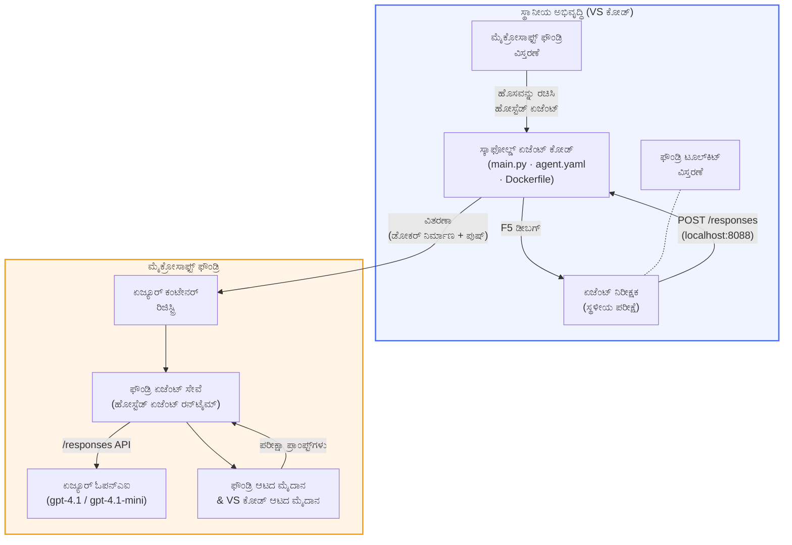

# ಫೌಂಡ್ರಿ ಟೂಲ್‌ಕಿಟ್ + ಫೌಂಡ್ರಿ ಹೋಸ್ಟ್‌ಡ್ ಏಜೆಂಟ್ಸ್ ಕಾರ್ಯಾಗಾರ

[](https://www.python.org/)
[](https://github.com/microsoft/agents)
[](https://learn.microsoft.com/azure/ai-foundry/agents/concepts/hosted-agents/)
[](https://ai.azure.com/)
[](https://learn.microsoft.com/azure/ai-services/openai/)
[](https://learn.microsoft.com/cli/azure/install-azure-cli)
[](https://learn.microsoft.com/azure/developer/azure-developer-cli/install-azd)
[](https://www.docker.com/)
[](https://marketplace.visualstudio.com/items?itemName=ms-windows-ai-studio.windows-ai-studio)
[](LICENSE)

**ಮೈಕ್ರೋಸಾಫ್ಟ್ ಫೌಂಡ್ರಿ ಏಜೆಂಟ್ ಸೇವೆಗೆ** AI ಏಜೆಂಟ್ಗಳನ್ನು ನಿರ್ಮಿಸಿ, ಪರೀಕ್ಷಿಸಿ ಮತ್ತು ನಿಯೋಜಿಸಿ - ಸಂಪೂರ್ಣವಾಗಿ VS ಕೋಡ್ ಬಳಸಿ **Microsoft Foundry ವಿಸ್ತರಣೆ** ಮತ್ತು **Foundry Toolkit** ಮೂಲಕ **ಹೋಸ್ಟ್‌ಡ್ ಏಜೆಂಟ್ಸ್** ಆಗಿ.

> **ಹೋಸ್ಟ್‌ಡ್ ಏಜೆಂಟ್ಸ್ ಪ್ರಸ್ತುತ ಪೂರ್ವಪ್ರದರ್ಶನಲ್ಲಿವೆ.** ಬೆಂಬಲಿತ ಪ್ರಾಂತ್ಯಗಳು ಸೀಮಿತವಾಗಿವೆ - [ಪ್ರಾಂತ್ಯ ಲಭ್ಯತೆ](https://learn.microsoft.com/azure/foundry/agents/concepts/hosted-agents#region-availability) ನೋಡಿ.

> ಪ್ರತಿಯೊಂದು ಪ್ರಯೋಗಶಾಲೆಯಲ್ಲಿಯೂ `agent/` ಫೋಲ್ಡರ್ **Foundry ವಿಸ್ತರಣೆಯ ಮೂಲಕ ಸ್ವಯಂ ಚಾಲಿತವಾಗಿ ರಚಿಸಲಾಗುತ್ತದೆ** - ನಂತರ ನೀವು ಕೋಡ್ ನ್ಹುಸ್ವರೂಪಗೊಳಿಸಿ, ಸ್ಥಳೀಯವಾಗಿ ಪರೀಕ್ಷಿಸಿ ಮತ್ತು ನಿಯೋಜಿಸಿ.

<!-- CO-OP TRANSLATOR LANGUAGES TABLE START -->
[Arabic](../ar/README.md) | [Bengali](../bn/README.md) | [Bulgarian](../bg/README.md) | [Burmese (Myanmar)](../my/README.md) | [Chinese (Simplified)](../zh-CN/README.md) | [Chinese (Traditional, Hong Kong)](../zh-HK/README.md) | [Chinese (Traditional, Macau)](../zh-MO/README.md) | [Chinese (Traditional, Taiwan)](../zh-TW/README.md) | [Croatian](../hr/README.md) | [Czech](../cs/README.md) | [Danish](../da/README.md) | [Dutch](../nl/README.md) | [Estonian](../et/README.md) | [Finnish](../fi/README.md) | [French](../fr/README.md) | [German](../de/README.md) | [Greek](../el/README.md) | [Hebrew](../he/README.md) | [Hindi](../hi/README.md) | [Hungarian](../hu/README.md) | [Indonesian](../id/README.md) | [Italian](../it/README.md) | [Japanese](../ja/README.md) | [Kannada](./README.md) | [Khmer](../km/README.md) | [Korean](../ko/README.md) | [Lithuanian](../lt/README.md) | [Malay](../ms/README.md) | [Malayalam](../ml/README.md) | [Marathi](../mr/README.md) | [Nepali](../ne/README.md) | [Nigerian Pidgin](../pcm/README.md) | [Norwegian](../no/README.md) | [Persian (Farsi)](../fa/README.md) | [Polish](../pl/README.md) | [Portuguese (Brazil)](../pt-BR/README.md) | [Portuguese (Portugal)](../pt-PT/README.md) | [Punjabi (Gurmukhi)](../pa/README.md) | [Romanian](../ro/README.md) | [Russian](../ru/README.md) | [Serbian (Cyrillic)](../sr/README.md) | [Slovak](../sk/README.md) | [Slovenian](../sl/README.md) | [Spanish](../es/README.md) | [Swahili](../sw/README.md) | [Swedish](../sv/README.md) | [Tagalog (Filipino)](../tl/README.md) | [Tamil](../ta/README.md) | [Telugu](../te/README.md) | [Thai](../th/README.md) | [Turkish](../tr/README.md) | [Ukrainian](../uk/README.md) | [Urdu](../ur/README.md) | [Vietnamese](../vi/README.md)

> ** ಸ್ಥಳೀಯವಾಗಿ ಕ್ಲೋನ್ ಮಾಡೋಸು ಇಷ್ಟವೇ?**
>
> ಈ ರೆಪೊಸಿಟರಿಯಲ್ಲಿ 50+ ಭಾಷಾ ಅನುವಾದಗಳಿವೆ, ಅವು ಡೌನ್‌ಲೋಡ್ ಗಾತ್ರವನ್ನು ಬಹಳ ಹೆಚ್ಚಿಸುತ್ತವೆ. ಅನುವಾದಗಳಿಲ್ಲದೇ ಕ್ಲೋನ್ ಮಾಡಲು ಸ್ಪಾರ್ಸ್ ಚೆಕ್‌ಔಟ್ ಬಳಸಿ:
>
> **Bash / macOS / Linux:**
> ```bash
> git clone --filter=blob:none --sparse https://github.com/microsoft-foundry/Foundry_Toolkit_for_VSCode_Lab.git
> cd Foundry_Toolkit_for_VSCode_Lab
> git sparse-checkout set --no-cone '/*' '!translations' '!translated_images'
> ```
>
> **CMD (Windows):**
> ```cmd
> git clone --filter=blob:none --sparse https://github.com/microsoft-foundry/Foundry_Toolkit_for_VSCode_Lab.git
> cd Foundry_Toolkit_for_VSCode_Lab
> git sparse-checkout set --no-cone "/*" "!translations" "!translated_images"
> ```
>
> ಇದು ನಿಮಗೆ ಕೋರ್ಸ್ ಪೂರ್ಣಗೊಳಿಸಲು ಬೇಕಾದ ಎಲ್ಲವನ್ನೂ ಹೆಚ್ಚು ವೇಗವಾದ ಡೌನ್‌ಲೋಡ್‌ಗಾಗಿ ಒದಗಿಸುತ್ತದೆ.
<!-- CO-OP TRANSLATOR LANGUAGES TABLE END -->

---

## ವಾಸ್ತುಶಿಲ್ಪ


**ಪ್ರವಾಹ:** Foundry ವಿಸ್ತರಣೆ ಏಜೆಂಟನ್ನು ರಚಿಸುತ್ತದೆ → ನೀವು ಕೋಡ್ ಮತ್ತು ಸೂಚನೆಗಳನ್ನು ಕಸ್ಟಮೈಸ್ ಮಾಡುತ್ತೀರಿ → Agent Inspector ಮೂಲಕ ಸ್ಥಳೀಯವಾಗಿ ಪರೀಕ್ಷಿಸಿ → Foundry ಗೆ ನಿಯೋಜಿಸಿ (Docker ಚಿತ್ರ ACR ಗೆ ಪುಶ್ ಆಗುತ್ತದೆ) → ಪ್ಲೇಗ್ರೌಂಡ್ ನಲ್ಲಿ ಪರಿಶೀಲನೆ.

---

## ನೀವು ನಿರ್ಮಿಸುವುದು

| ಪ್ರಯೋಗಶಾಲೆ | ವಿವರಣೆ | ಸ್ಥಿತಿ |
|-----|-------------|--------|
| **ಪ್ರಯೋಗಶಾಲೆ 01 - ಏಕ ಏಜೆಂಟ್** | **"ನಾನು ಕಾರ್ಯನಿರ್ವಹಣಾಧಿಕಾರಿಯಾಗಿ ವಿವರಿಸು" ಏಜೆಂಟ್** ಅನ್ನು ನಿರ್ಮಿಸಿ, ಸ್ಥಳೀಯವಾಗಿ ಪರೀಕ್ಷಿಸಿ ಮತ್ತು ಫೌಂಡ್ರಿಗೆ ನಿಯೋಜಿಸಿ | ✅ ಲಭ್ಯವಿದೆ |
| **ಪ್ರಯೋಗಶಾಲೆ 02 - ಬಹು ಏಜೆಂಟ್ ಕಾರ್ಯಪ್ರवाह** | **"ಧೃಢಿಕರಣ → ಉದ್ಯೋಗ ಹೊಂದಿಕೈಮಾಪಕ"** - 4 ಏಜೆಂಟ್ಗಳು resumes ಅನ್ನು స్కೋರ್ ಮಾಡಿ ಮತ್ತು ಅಧ್ಯಯನ ಮಾರ್ಗಸೂಚಿ ರಚಿಸುತ್ತವೆ | ✅ ಲಭ್ಯವಿದೆ |

---

## ಕಾರ್ಯನಿರ್ವಹಣಾಧಿಕಾರಿ ಏಜೆಂಟ್ ಅನ್ನು ಪರಿಚಯಿಸಿ

ಈ ಕಾರ್ಯಾಗಾರದಲ್ಲಿ ನೀವು **"ನಾನು ಕಾರ್ಯನಿರ್ವಹಣಾಧಿಕಾರಿಯಾಗಿ ವಿವರಿಸು" ಏಜೆಂಟ್** ಅನ್ನು ನಿರ್ಮಿಸುವಿರಿ - ಇದು ಟೆಕ್ನಿಕಲ್ ಜಾರ್ಗಾನ್ ಅನ್ನು ತಗ್ಗಿಸಿ, ಬೋರ್ಡ್ ರೂಮ್ ಸಿದ್ಧ ಸಂಕ್ಷಿಪ್ತ ವಿವರಗಳಾಗಿ ಅನುವಾದಿಸುವ AI ಏಜೆಂಟ್‌. ಏಕೆಂದರೆ ಸತ್ಯ ಹೇಳುವುದಾದರೆ, C-ಸುಯಿಟ್‌ನಲ್ಲಿ ಯಾರೂ "v3.2 ನಲ್ಲಿ ಪರಿಚಯಿಸಲಾದ ಸಿಂಕ್ರೋನಸ್ ಕರೆಗಳಿಂದ ಉಂಟಾದ ಥ್ರೆಡ್ ಪುಲ್ ಖಾಲಿಯತೆ" ಬಗ್ಗೆ ಕೇಳಲು ಬಯಸುವುದಿಲ್ಲ.

ನಾನು ಈ ಏಜೆಂಟ್ ಅನ್ನು ನಿರ್ಮಿಸಿದ್ದೇನೆ, ನಾನು ಚೆನ್ನಾಗಿ ರಚಿತವಾದ ಪೋಸ್ಟ್-ಮಾರ್ಟೆಂಗೆ ಉತ್ತರವಾಗಿ *"ಹಾಗಾದರೆ ವೆಬ್‌ಸೈಟ್ ಡೌನ್ ಆಗಿದೆಯೇ ಅಲ್ಲವೇ?"* ಎಂಬ ಪ್ರಶ್ನೆ ಬರುವಷ್ಟು ಘಟನಾವಳಿಗಳು ನಡೆದ ನಂತರ.

### ಇದು ಹೇಗೆ ಕಾರ್ಯನಿರ್ವಹಿಸುತ್ತದೆ

ನೀವು ಇದರ_Inputಗೆ ಟೆಕ್ನಿಕಲ್ ನವೀಕರಣವನ್ನು ನೀಡುತ್ತೀರಿ. ಅದು ನೀವುಗೆ ಕಾರ್ಯನಿರ್ವಹಣಾಧಿಕಾರಿಗಳ ಸಂಕ್ಷಿಪ್ತ ವಿವರವನ್ನು ನೀಡುತ್ತದೆ - ಮೂರು ಮೂಲಭೂತ ಬಿಂದುಗಳು, ಯಾವುದೇ ಜಾರ್ಗಾನ್ ಇಲ್ಲ, ಸ್ಟ್ಯಾಕ್ ಟ್ರೇಸ್ ಇಲ್ಲ, ಯಾವುದೇ ಭೀತಿಯೂ ಇಲ್ಲ. ಕೇವಲ **ಏನಾಗಿದೆಯೋ**, **ವ್ಯಾಪಾರದ ಪ್ರಭಾವ**, ಮತ್ತು **ಮುಂದಿನ ಹಂತ**.

### ಕಾರ್ಯನಿರ್ವಹಣೆಯಲ್ಲಿ ನೋಡಿ

**ನೀವು ಹೇಳುತ್ತೀರಿ:**
> "v3.2 ನಲ್ಲಿ ಪರಿಚಯಿಸಲಾದ ಸಿಂಕ್ರೋನಸ್ ಕರೆಗಳಿಂದ ಉಂಟಾದ ಥ್ರೆಡ್ ಪುಲ್ ಖಾಲಿಯತೆಯಿಂದಾಗಿ API ಮೋಹಕತೆ ಹೆಚ್ಚಾಯಿತು."

**ಏಜೆಂಟ್ ಉತ್ತರಿಸುವುದು:**

> **ಕಾರ್ಯನಿರ್ವಹಣಾಧಿಕಾರಿಗಳ ಸಂಕ್ಷಿಪ್ತಾಂಶ:**
> - **ಏನಾಗಿರಬಹುದು:** ಇತ್ತೀಚಿನ ಬಿಡುಗಡೆ ನಂತರ, ವ್ಯವಸ್ಥೆ ನಿಧಾನವಾಯಿತು.
> - **ವ್ಯಾಪಾರದ ಪ್ರಭಾವ:** ಕೆಲವು ಬಳಕೆದಾರರು ಸೇವೆಯನ್ನು ಬಳಸುವಾಗ ವಿಳಂಬಗಳನ್ನು ಅನುಭವಿಸಿದರು.
> - **ಮುಂದಿನ ಹಂತ:** ಬದಲಾವಣೆ ಪುನರುಳಿಸಲಾಗಿದೆ ಮತ್ತು ಪುನರ್ನಿಯೋಜನೆಯ ಮೊದಲು ಸರಿ ಮಾಡಲಾಗುತ್ತಿದೆ.

### ಈ ಏಜೆಂಟ್ ಯಾಕೆ?

ಇದು ಸರಳ, ಏಕಮುಖಿ ಏಜೆಂಟ್ - ಹೋಸ್ಟ್‌ಡ್ ಏಜೆಂಟ್ ಕಾರ್ಯಪ್ರವಾಹವನ್ನು ಸಂಪೂರ್ಣವಾಗಿ ಕಲಿಯಲು ಸೂಕ್ತವಾಗಿದೆ, ಸಂಕೀರ್ಣ ಉಪಕರಣ ಸರಣಿಯಲ್ಲಿ ತಲೆಮರೆಸದೆ. ಸತ್ಯವೇನೆಂದರೆ? ಪ್ರತಿ ಇಂಜಿನಿಯರಿಂಗ್ ತಂಡಕ್ಕೂ ಇದೊಂದು ಅಗತ್ಯ.

---

## ಕಾರ್ಯಾಗಾರದ ರಚನೆ

```
📂 Foundry_Toolkit_for_VSCode_Lab/
├── 📄 README.md                      ← You are here
├── 📂 ExecutiveAgent/                ← Standalone hosted agent project
│   ├── agent.yaml
│   ├── Dockerfile
│   ├── main.py
│   └── requirements.txt
└── 📂 workshop/
    ├── 📂 lab01-single-agent/        ← Full lab: docs + agent code
    │   ├── README.md                 ← Hands-on lab instructions
    │   ├── 📂 docs/                  ← Step-by-step tutorial modules
    │   │   ├── 00-prerequisites.md
    │   │   ├── 01-install-foundry-toolkit.md
    │   │   ├── 02-create-foundry-project.md
    │   │   ├── 03-create-hosted-agent.md
    │   │   ├── 04-configure-and-code.md
    │   │   ├── 05-test-locally.md
    │   │   ├── 06-deploy-to-foundry.md
    │   │   ├── 07-verify-in-playground.md
    │   │   └── 08-troubleshooting.md
    │   └── 📂 agent/                 ← Reference solution (auto-scaffolded by Foundry extension)
    │       ├── agent.yaml
    │       ├── Dockerfile
    │       ├── main.py
    │       └── requirements.txt
    └── 📂 lab02-multi-agent/         ← Resume → Job Fit Evaluator
        ├── README.md                 ← Hands-on lab instructions (end-to-end)
        ├── 📂 docs/                  ← Step-by-step tutorial modules
        │   ├── 00-prerequisites.md
        │   ├── 01-understand-multi-agent.md
        │   ├── 02-scaffold-multi-agent.md
        │   ├── 03-configure-agents.md
        │   ├── 04-orchestration-patterns.md
        │   ├── 05-test-locally.md
        │   ├── 06-deploy-to-foundry.md
        │   ├── 07-verify-in-playground.md
        │   └── 08-troubleshooting.md
        └── 📂 PersonalCareerCopilot/ ← Reference solution (multi-agent workflow)
            ├── agent.yaml
            ├── Dockerfile
            ├── main.py
            └── requirements.txt
```

> **ಸೂಚನೆ:** `agent/` ಫೋಲ್ಡರ್ ಪ್ರತಿಯೊಂದು ಪ್ರಯೋಗಶಾಲೆಯಲ್ಲಿಯೂ **Microsoft Foundry ವಿಸ್ತರಣೆ** ಮೂಲಕ `Microsoft Foundry: Create a New Hosted Agent` ಕಮಾಂಡ್ ಪಾಲೆಟ್ ನಿಂದ ರಚಿಸಲಾಗುತ್ತದೆ. ಫೈಲುಗಳನ್ನು ನಂತರ ನಿಮ್ಮ ಏಜೆಂಟ್‌ನ ಸೂಚನೆಗಳು, ಉಪಕರಣಗಳು ಮತ್ತು ಸಂರಚನೆಯೊಂದಿಗೆ ಕಸ್ಟಮೈಸ್ ಮಾಡಲಾಗುತ್ತದೆ. ಪ್ರಯೋಗಶಾಲೆ 01 ನೀವು ಇದನ್ನು ಶೂನ್ಯದಿಂದ ಪುನರ್ನಿರ್ಮಿಸಲು ಹೆಜ್ಜೆ ಮೂಲಕ ನಡೆಯುತ್ತದೆ.

---

## ಪ್ರಾರಂಭಿಸುವುದು

### 1. ರೆಪೊಸಿಟರಿಯನ್ನು ಕ್ಲೋನ್ ಮಾಡಿ

```bash
git clone https://github.com/microsoft-foundry/Foundry_Toolkit_for_VSCode_Lab.git
cd Foundry_Toolkit_for_VSCode_Lab
```

### 2. ಪೈಥಾನ್ ವರ್ಚುವಲ್ ಪರಿಸರವನ್ನು ಸಿದ್ಧಪಡಿಸಿ

```bash
python -m venv venv
```

ಸುಕ್ರಿಯಗೊಳಿಸಿ:

- **Windows (PowerShell):**
  ```powershell
  .\venv\Scripts\Activate.ps1
  ```
 - **macOS / Linux:**
  ```bash
  source venv/bin/activate
  ```

### 3. ಅವಲಂಬನೆಗಳನ್ನು ಸ್ಥಾಪಿಸಿ

```bash
pip install -r workshop/lab01-single-agent/agent/requirements.txt
```

### 4. ಪರಿಸರ変数ಗಳನ್ನು ಸಂರಚಿಸಿ

ಏಜೆಂಟ್ ಫೋಲ್ಡರ್ ಒಳಗಿನ `.env` ಸೂಚಕ ಕಡತದ ನಕಲು ಮಾಡಿ ಮತ್ತು ನಿಮ್ಮ ಮೌಲ್ಯಗಳನ್ನು ದಾಖಲಿಸಿ:

```bash
cp workshop/lab01-single-agent/agent/.env.example workshop/lab01-single-agent/agent/.env
```

`workshop/lab01-single-agent/agent/.env` ಅನ್ನು ಸಂಪಾದಿಸಿ:

```env
AZURE_AI_PROJECT_ENDPOINT=https://<your-account>.services.ai.azure.com/api/projects/<your-project>
MODEL_DEPLOYMENT_NAME=<your-model-deployment-name>
```

### 5. ಕಾರ್ಯಾಗಾರ ಪ್ರಯೋಗಶಾಲೆಗಳನ್ನು ಅನುಸರಿಸಿ

ಪ್ರತಿಯೊಂದು ಪ್ರಯೋಗಶಾಲೆಯೂ ತನ್ನದೇ ಆದ ಘಟಕಗಳನ್ನು ಹೊಂದಿದೆ. ಮೂಲಭೂತಗಳನ್ನು ಕಲಿಯಲು **ಪ್ರಯೋಗಶಾಲೆ 01** ಇಂದ ಪ್ರಾರಂಭಿಸಿ, ನಂತರ ಬಹು ಏಜೆಂಟ್ ಕಾರ್ಯಪ್ರವಾಹಕ್ಕಾಗಿ **ಪ್ರಯೋಗಶಾಲೆ 02** ಗೆ ಸಾಗಿರಿ.

#### ಪ್ರಯೋಗಶಾಲೆ 01 - ಏಕ ಏಜೆಂಟ್ ([ಪೂರ್ಣ ಸೂಚನೆಗಳು](workshop/lab01-single-agent/README.md))

| # | ಘಟಕ | ಸಂಪರ್ಕ |
|---|--------|------|
| 1 | ಅಗತ್ಯಗಳ ಓದು | [00-prerequisites.md](workshop/lab01-single-agent/docs/00-prerequisites.md) |
| 2 | Foundry Toolkit & Foundry ವಿಸ್ತರಣೆ ಸ್ಥಾಪನೆ | [01-install-foundry-toolkit.md](workshop/lab01-single-agent/docs/01-install-foundry-toolkit.md) |
| 3 | Foundry ಪ್ರಾಜೆಕ್ಟ್ ರಚನೆ | [02-create-foundry-project.md](workshop/lab01-single-agent/docs/02-create-foundry-project.md) |
| 4 | ಹೋಸ್ಟ್‌ಡ್ ಏಜೆಂಟ್ ರಚನೆ | [03-create-hosted-agent.md](workshop/lab01-single-agent/docs/03-create-hosted-agent.md) |
| 5 | ಸೂಚನೆಗಳು ಮತ್ತು ಪರಿಸರ ಸಂರಚನೆ | [04-configure-and-code.md](workshop/lab01-single-agent/docs/04-configure-and-code.md) |
| 6 | ಸ್ಥಳೀಯವಾಗಿ ಪರೀಕ್ಷೆ | [05-test-locally.md](workshop/lab01-single-agent/docs/05-test-locally.md) |
| 7 | Foundry ಗೆ ನಿಯೋಜನೆ | [06-deploy-to-foundry.md](workshop/lab01-single-agent/docs/06-deploy-to-foundry.md) |
| 8 | ಪ್ಲೇಗ್ರೌಂಡ್ ನಲ್ಲಿ ಪರಿಶೀಲನೆ | [07-verify-in-playground.md](workshop/lab01-single-agent/docs/07-verify-in-playground.md) |
| 9 | ಸಮಸ್ಯಾ ಪರಿಹಾರ | [08-troubleshooting.md](workshop/lab01-single-agent/docs/08-troubleshooting.md) |

#### ಪ್ರಯೋಗಶಾಲೆ 02 - ಬಹು ಏಜೆಂಟ್ ಕಾರ್ಯಪ್ರವಾಹ ([ಪೂರ್ಣ ಸೂಚನೆಗಳು](workshop/lab02-multi-agent/README.md))

| # | ಘಟಕ | ಸಂಪರ್ಕ |
|---|--------|------|
| 1 | ಅಗತ್ಯಗಳು (ಪ್ರಯೋಗಶಾಲೆ 02) | [00-prerequisites.md](workshop/lab02-multi-agent/docs/00-prerequisites.md) |
| 2 | ಬಹು ಏಜೆಂಟ್ ವಾಸ್ತುಶಿಲ್ಪ ಅರ್ಥಮಾಡಿಕೊಳ್ಳಿ | [01-understand-multi-agent.md](workshop/lab02-multi-agent/docs/01-understand-multi-agent.md) |
| 3 | ಬಹು ಏಜೆಂಟ್ ಪ್ರಾಜೆಕ್ಟ್ ರಚನೆ | [02-scaffold-multi-agent.md](workshop/lab02-multi-agent/docs/02-scaffold-multi-agent.md) |
| 4 | ಏಜೆಂಟ್ಗಳು ಮತ್ತು ಪರಿಸರ ಸಂರಚನೆ | [03-configure-agents.md](workshop/lab02-multi-agent/docs/03-configure-agents.md) |
| 5 | ಸಂಯೋಜನೆ ಮಾದರಿಗಳು | [04-orchestration-patterns.md](workshop/lab02-multi-agent/docs/04-orchestration-patterns.md) |
| 6 | ಸ್ಥಳೀಯವಾಗಿ ಪರೀಕ್ಷೆ (ಬಹು ಏಜೆಂಟ್) | [05-test-locally.md](workshop/lab02-multi-agent/docs/05-test-locally.md) |
| 7 | Foundry ಗೆ ನಿಯೋಜಿಸಿ | [06-deploy-to-foundry.md](workshop/lab02-multi-agent/docs/06-deploy-to-foundry.md) |
| 8 | ಆಟದ ಮೈದಾನದಲ್ಲಿ ಪರಿಶೀಲಿಸಿ | [07-verify-in-playground.md](workshop/lab02-multi-agent/docs/07-verify-in-playground.md) |
| 9 | ಸಮಸ್ಯೆ ಪರಿಹಾರ (ಬಹು-ಏಜೆಂಟ್) | [08-troubleshooting.md](workshop/lab02-multi-agent/docs/08-troubleshooting.md) |

---

## ಸಂರಕ್ಷಕರು

<table>
<tr>
    <td align="center"><a href="https://github.com/ShivamGoyal03">
        <br />
        <sub><b>ಶಿವಂ ಗೋಯಲ್</b></sub>
    </a><br />
    </td>
</tr>
</table>

---

## ಅಗತ್ಯ ಅನುಮತಿಗಳು (ತ್ವರಿತ ಉಲ್ಲೇಖ)

| ದೃಶ್ಯ | ಅಗತ್ಯದ ಪಾತ್ರಗಳು |
|----------|---------------|
| ಹೊಸ Foundry ಪ್ರಾಜೆಕ್ಟ್ ನಿರ್ಮಿಸಿ | Foundry ಸಂಪನ್ಮೂಲದಲ್ಲಿ **Azure AI ಮಾಲೀಕ** |
| ಇತ್ತೀಚಿನ ಪ್ರಾಜೆಕ್ಟ್‌ಗೆ ನಿಯೋಜಿಸಿ (ಹೊಸ ಸಂಪನ್ಮೂಲಗಳು) | ಸಬ್ಸ್ಕ್ರಿಪ್ಶನ್‌ನಲ್ಲಿ **Azure AI ಮಾಲೀಕ** + **ಕೈಡುಗಾರ** |
| ಸಂಪೂರ್ಣವಾಗಿ ಕಾನ್ಫಿಗರ್ ಮಾಡಲಾದ ಪ್ರಾಜೆಕ್ಟ್‌ಗೆ ನಿಯೋಜಿಸಿ | ಖಾತೆಯಲ್ಲಿ **ವಾಚಕ** + ಪ್ರಾಜೆಕ್ಟ್‌ನಲ್ಲಿ **Azure AI ಬಳಕೆದಾರ** |

> **महತ್ವಪೂರ್ಣ:** Azure `Owner` ಮತ್ತು `Contributor` ಪಾತ್ರಗಳು *ವೈಯವಸ್ಥಾಪನೆ* ಅನುಮತಿಗಳನ್ನು ಮಾತ್ರ ಒಳಗೊಂಡಿವೆ, *ಅಭಿವೃದ್ಧಿ* (ಡೇಟಾ ಕ್ರಿಯೆ) ಅನುಮತಿಗಳನ್ನು ಒಳಗೊಳ್ಳುವುದಿಲ್ಲ. ನೀವು ಏಜೆಂಟ್‌ಗಳನ್ನು ರಚಿಸಲು ಮತ್ತು ನಿಯೋಜಿಸಲು **Azure AI ಬಳಕೆದಾರ** ಅಥವಾ **Azure AI ಮಾಲೀಕ** ಆಗಿರಬೇಕು.

---

## ಉದ್ಧರಣೆಗಳು

- [ಕ್ಷಿಪ್ರಾರಂಭ: ನಿಮ್ಮ ಮೊದಲ ಹೋಸ್ಟ್ ಮಾಡಿದ ಏಜೆಂಟ್ ಅನ್ನು ನಿಯೋಜಿಸಿ (VS ಕೋಡ್)](https://learn.microsoft.com/azure/foundry/agents/quickstarts/quickstart-hosted-agent)
- [ಹೋಸ್ಟ್ ಮಾಡಿದ ಏಜೆಂಟ್‌ಗಳು ಎಂದರೆ ಏನು?](https://learn.microsoft.com/azure/foundry/agents/concepts/hosted-agents)
- [VS ಕೋಡ್‌ನಲ್ಲಿ ಹೋಸ್ಟ್ ಮಾಡಿದ ಏಜೆಂಟ್ ವರ್ಕ್ಫ್ಲೋಗಳನ್ನು ರಚಿಸಿ](https://learn.microsoft.com/azure/foundry/agents/how-to/vs-code-agents-workflow-pro-code)
- [ಹೋಸ್ಟ್ ಮಾಡಿದ ಏಜೆಂಟ್ ಅನ್ನು ನಿಯೋಜಿಸಿ](https://learn.microsoft.com/azure/foundry/agents/how-to/deploy-hosted-agent)
- [Microsoft Foundry ಗಾಗಿ RBAC](https://learn.microsoft.com/azure/foundry/concepts/rbac-foundry)
- [ವ್ಯಾಸ ರಿವ್ಯೂ ಏಜೆಂಟ್ ಮಾದರಿ](https://github.com/Azure-Samples/agent-architecture-review-sample) - MCP ಉಪಕರಣಗಳು, Excalidraw ಭಾವಚಿತ್ರಗಳು ಮತ್ತು ದ್ವಿಮುಖ್ಯ ನಿಯೋಜನೆಯೊಂದಿಗೆ ವಾಸ್ತವಿಕ ಹೋಸ್ಟ್ ಮಾಡಿದ ಏಜೆಂಟ್

---


## ಪರವಾನಗೆ

[MIT](../../LICENSE)

---

<!-- CO-OP TRANSLATOR DISCLAIMER START -->
**ಅस्वೀಕರಣ**:  
ಈ ದಸ್ತಾವೇಜು AI ಭಾಷಾಂತರ ಸೇವೆ [Co-op Translator](https://github.com/Azure/co-op-translator) ಬಳಸಿ ಅನುವಾದಿಸಿದ್ದು, ನಾವು ನಿಖರತೆಗೆ ಪ್ರಯತ್ನಿಸುತ್ತಿದ್ದರೂ, ಸ್ವಯಂಚಾಲಿತ ಭಾಷಾಂತರಗಳಲ್ಲಿ ದೋಷಗಳು ಅಥವಾ ತಪ್ಪುಗಳು ಇರುವ ಸಾಧ್ಯತೆ ಇದೆ ಎಂದು ದಯವಿಟ್ಟು ಗಮನಿಸಿ. ಮೂಲ ದಸ್ತಾವೇಜಿನ ಮೂಲ ಭಾಷೆಯ ಪ್ರತಿಯನ್ನು ಅಧಿಕೃತ ಮೂಲವೆಂದು ಪರಿಗಣಿಸಲಾಗಬೇಕು. ಪ್ರಮುಖ ಮಾಹಿತಿಗಾಗಿ, ವೃತ್ತಿಪರ ಮಾನವ ಅನುವಾದವನ್ನು ಶಿಫಾರಸು ಮಾಡಲಾಗುತ್ತದೆ. ಈ ಭಾಷಾಂತರ ಬಳಕೆಗಳಿಂದ ಮೂಡಿದ ಯಾವುದೇ ಆಸಕ್ತಿಪೂರ್ವಕ ತಪ್ಪುಫಢಿಕೆಗಳ ಅಥವಾ ಅರ್ಥಕಳಪಳಿಗಳಿಗಾಗಿ ನಾವು ಹೊಣೆಗಾರರಾಗುವುದಿಲ್ಲ.
<!-- CO-OP TRANSLATOR DISCLAIMER END -->