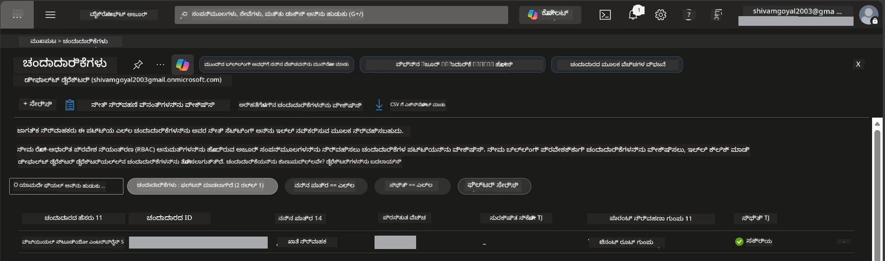

# Module 0 - ಪೂರ್ವಶರತ್ತುಗಳು

ಕಾರ್ಖಾನೆ ಆರಂಭಿಸುವ ಮೊದಲು, ನಿಮ್ಮುಂಡು ಕೆಳಗಿನ ಸಲಕರಣೆಗಳು, ಪ್ರವೇಶ, ಮತ್ತು ಪರಿಸರ ಸಿದ್ಧವಾಗಿರಬೇಕೆಂದು ಖಚಿತಪಡಿಸಿಕೊಳ್ಳಿ. ಕೆಳಗಿನ ಪ್ರತಿಯೊಂದು ಹಂತವನ್ನು ಅನುಸರಿಸಿ - ಮುಂಚಿತವಾಗಿ ತಪ್ಪಿಸಬೇಡಿ.

---

## 1. ಅಜುರೆ ಖಾತೆ ಮತ್ತು ಸದಸ್ಯತ್ವ

### 1.1 ನಿಮ್ಮ ಅಜುರೆ ಸದಸ್ಯತ್ವವನ್ನು ರಚಿಸಿ ಅಥವಾ ಪರಿಶೀಲಿಸಿ

1. ಬ್ರೌಸರ್ ತೆರೆಯಿರಿ ಮತ್ತು [https://azure.microsoft.com/free/](https://azure.microsoft.com/free/)ಗೆ ಹೋಗಿ.
2. ನೀವು ಅಜುರೆ ಖಾತೆ ಹೊಂದಿರದಿದ್ದರೆ, **Start free** ಕ್ಲಿಕ್ ಮಾಡಿ ಮತ್ತು ಸೈನ್-ಅಪ್ ಪ್ರಕ್ರಿಯೆಯನ್ನು ಅನುಸರಿಸಿ. ಮೈಕ್ರೋಸಾಫ್ಟ್ ಖಾತೆ (ಅಥವಾ ಹೊಸದಾಗಿ ರಚಿಸಿ) ಮತ್ತು ಗುರುತಿನ ಪರಿಶೀಲನೆಗಾಗಿ ಕ್ರೆಡಿಟ್ ಕಾರ್ಡ್ ಬೇಕಾಗುತ್ತದೆ.
3. ನೀವು ಈಗಾಗಲೆ ಖಾತೆ ಹೊಂದಿದ್ದರೆ, [https://portal.azure.com](https://portal.azure.com) ನಲ್ಲಿ ಸೈನ್ ಇನ್ ಮಾಡಿ.
4. ಪೋರ್ಟಲ್ ನಲ್ಲಿ, ಎಡವೈపు ನ್ಯಾವಿಗೇಷನ್‌ನಲ್ಲಿ **Subscriptions** ಬ್ಲೇಡ್ ಕ್ಲಿಕ್ ಮಾಡಿರಿ (ಅಥವಾ ಮೇಲ್ಭಾಗದ ಹುಡುಕುವ ಬಾರ್‌ನಲ್ಲಿ "Subscriptions" ಹುಡುಕಿ).
5. ಕನಿಷ್ಠ ಒಂದು **ಸಕ್ರಿಯ (Active)** ಸದಸ್ಯತ್ವವನ್ನು ಕಂಡುಹಿಡಿದಿರುವುದನ್ನು ಪರಿಶೀಲಿಸಿ. ನಂತರ ಬಳಸಲು **Subscription ID** ಅನ್ನು ನೋಡುವುದು ಆತಃಕಾಹಿತ.



### 1.2 ಅಗತ್ಯವಿರುವ RBAC ಪಾತ್ರಗಳನ್ನು ಅರ್ಥಮಾಡಿಕೊಳ್ಳಿ

[Hosted Agent](https://learn.microsoft.com/azure/foundry/agents/concepts/hosted-agents) ವಿತರಣೆಗಾಗಿ ಸಾಂಪ್ರದಾಯಿಕ ಅಜುರೆ `Owner` ಮತ್ತು `Contributor` ಪಾತ್ರಗಳಲ್ಲಿ ಇರದ **ಡೇಟಾ ಕ್ರಿಯಾದಕ್ಷತೆಗಳು** ಬೇಕಾಗುತ್ತವೆ. ನಿಮಗೆ ಈ [ಪಾತ್ರ ಸಂಯೋಜನೆಗಳ](https://learn.microsoft.com/azure/foundry/concepts/rbac-foundry#built-in-roles) ಒಂದಾಗಿರಬೇಕು:

| ದೃಶ್ಯ | ಅಗತ್ಯವಿರುವ ಪಾತ್ರಗಳು | ಅವುಗಳನ್ನು ಬಿಟ್ಟು ಬಿಡಲು ಯಾರು |
|----------|---------------|----------------------|
| ಹೊಸ ಫೌಂಡ್ರಿ ಪ್ರಾಜೆಕ್ಟ್ ರಚನೆ | ಫೌಂಡ್ರಿ ಸಂಪನ್ಮೂಲದ ಮೇಲೆ **Azure AI Owner** | ಅಜುರೆ ಪೋರ್ಟಲ್ ನಲ್ಲಿ ಫೌಂಡ್ರಿ ಸಂಪನ್ಮೂಲದಲ್ಲಿ |
| ಅಸ್ತಿತ್ವದಲ್ಲಿರುವ ಪ್ರಾಜೆಕ್ಟ್‌ಗೆ ವಿತರಣೆ (ಹೊಸ ಸಂಪನ್ಮೂಲಗಳು) | **Azure AI Owner** + **Contributor**  ಸದಸ್ಯತ್ವದಲ್ಲಿ | ಸದಸ್ಯತ್ವ + ಫೌಂಡ್ರಿ ಸಂಪನ್ಮೂಲದಲ್ಲಿ |
| ಸಂಪೂರ್ಣವಾಗಿ ಸಂರಚಿತ ಪ್ರಾಜೆಕ್ಟ್ ಗೆ ವಿತರಣೆ | ಖಾತೆಯ ಮೇಲೆ **Reader** + ಪ್ರಾಜೆಕ್ಟ್ ಮೇಲೆ **Azure AI User** | ಅಜುರೆ ಪೋರ್ಟಲ್ ನಲ್ಲಿ ಖಾತೆ ಮತ್ತು ಪ್ರಾಜೆಕ್ಟ್‌ನಲ್ಲಿ |

> **ಮುಖ್ಯ ವಿಷಯ:** ಅಜುರೆ `Owner` ಮತ್ತು `Contributor` ಪಾತ್ರಗಳು ಕೇವಲ *ನಿರ್ವಹಣಾ* ಅನುಮತಿಗಳನ್ನು (ARM ಕಾರ್ಯಾಚರಣೆಗಳು) ಒಳಗೊಂಡಿವೆ. ನೀವು ಕೇವಲ *ಡೇಟಾ ಕ್ರಿಯಾದಕ್ಷತೆಗಳಿಗೆ* [**Azure AI User**](https://learn.microsoft.com/azure/foundry/concepts/rbac-foundry#built-in-roles) (ಅಥವಾ ಮೇಲಿನ) ಬೇಕಾಗಿರುತ್ತದೆ, ಉದಾಹರಣೆಗೆ `agents/write` ಕ್ರಿಯೆಯಾಗಿದ್ದು, ಏಜೆಂಟ್‌ಗಳನ್ನು ರಚಿಸಲು ಮತ್ತು ವಿತರಿಸಲು ಬೇಕಾಗುತ್ತದೆ. ನೀವು ಈ ಪಾತ್ರಗಳನ್ನು [Module 2](02-create-foundry-project.md) ನಲ್ಲಿ ನಿಯೋಜಿಸಲಾಗುವುದು.

---

## 2. ಸ್ಥಳೀಯ ಉಪಕರಣಗಳನ್ನು ಇನ್‌ಸ್ಟಾಲ್ ಮಾಡಿಕೊಳ್ಳಿ

ಕೆಲು ಉಪಕರಣಗಳನ್ನು ಕೆಳಗೆ ಇನ್‌ಸ್ಟಾಲ್ ಮಾಡಿ. ಇನ್‌ಸ್ಟಾಲ್ ಮಾಡಿದ ನಂತರ, ಚೇಕ್ ಕಮಾಂಡ್ ನಡೆಸಿ ಅದು ಕೆಲಸ ಮಾಡುತ್ತಿತ್ತೇ ಎಂದು ಪರಿಶೀಲಿಸಿ.

### 2.1 ವಿಸುಯಲ್ ಸ್ಟೂಡಿಯೋ ಕೋಡ್

1. [https://code.visualstudio.com/](https://code.visualstudio.com/) ಗೆ ಹೋಗಿ.
2. ನಿಮ್ಮ OS (Windows/macOS/Linux) ಗೆ ಇನ್ಸ್ಟಾಲರ್ ಡೌನ್‌ಲೋಡ್ ಮಾಡಿ.
3. ಡೀಫಾಲ್ಟ್ ಸೆಟ್ಟಿಂಗ್‌ಗಳೊಂದಿಗೆ ಇನ್ಸ್ಟಾಲರ್ ಚಾಲನೆಮಾಡಿ.
4. VS Code ತೆರೆಯಿರಿ ಮತ್ತು ಅದು ಕಾರ್ಯನಿರ್ವಹಿಸುತ್ತಿದೆಯೆ ಎಂದು ಖಚಿತಪಡಿಸಿಕೊಳ್ಳಿ.

### 2.2 ಪೈಥಾನ್ 3.10+

1. [https://www.python.org/downloads/](https://www.python.org/downloads/) ಗೆ ಹೋಗಿ.
2. ಪೈಥಾನ್ 3.10 ಅಥವಾ ನಂತರದ (3.12+ ಶಿಫಾರಸು) ಡೌನ್‌ಲೋಡ್ ಮಾಡಿ.
3. **Windows:** ಸ್ಥಾಪನೆ ಸಮಯದಲ್ಲಿ, ಮೊದಲ ಪರದೆಯಲ್ಲಿ **"Add Python to PATH"** ಆಯ್ಕೆ ಮಾಡಿ.
4. ಟರ್ಮಿನಲ್ ತೆರೆಯಿರಿ ಮತ್ತು ಪರಿಶೀಲಿಸಿ:

   ```powershell
   python --version
   ```

   ನಿರೀಕ್ಷಿತ ಫಲಿತಾಂಶ: `Python 3.10.x` ಅಥವಾ ಹೆಚ್ಚಿನ ವರ್ಝನ್.

### 2.3 ಅಜುರೆ CLI

1. [https://learn.microsoft.com/cli/azure/install-azure-cli](https://learn.microsoft.com/cli/azure/install-azure-cli) ಗೆ ತೆರಳಿ.
2. ನಿಮ್ಮ OS ಗೆ ಅನುಸಾರ ಆರೋಪಣೆ ಸೂಚನೆಗಳನ್ನು ಅನುಸರಿಸಿ.
3. ಪರಿಶೀಲಿಸಿ:

   ```powershell
   az --version
   ```

   ನಿರೀಕ್ಷೆ: `azure-cli 2.80.0` ಅಥವಾ ಹೆಚ್ಚಿನ.

4. ಸೈನ್ ಇನ್ ಮಾಡಿ:

   ```powershell
   az login
   ```

### 2.4 ಅಜುರೆ ಡೆವಲಪರ್ CLI (azd)

1. [https://learn.microsoft.com/azure/developer/azure-developer-cli/install-azd](https://learn.microsoft.com/azure/developer/azure-developer-cli/install-azd) ಗೆ ಹೋಗಿ.
2. ನಿಮ್ಮ OS ಗೆ ಅನುಸಾರ ಇನ್‌ಸ್ಟಾಲ್ ಸೂಚನೆಗಳನ್ನು ಅನುಸರಿಸಿ. ವಿಂಡೋಸ್‌ನಲ್ಲಿ:

   ```powershell
   winget install microsoft.azd
   ```

3. ಪರಿಶೀಲಿಸಿ:

   ```powershell
   azd version
   ```

   ನಿರೀಕ್ಷೆ: `azd version 1.x.x` ಅಥವಾ ಹೆಚ್ಚಿನ.

4. ಸೈನ್ ಇನ್ ಮಾಡಿ:

   ```powershell
   azd auth login
   ```

### 2.5 ಡಾಕರ್ ಡೆಸ್ಕ್‌ಟಾಪ್ (ಐಚ್ಛಿಕ)

ಡಾಕರ್ ಬಿಲ್ಡ್ ಮತ್ತು ಟೆಸ್ಟ್ ಮಾಡಲು ಮಾತ್ರ ಅಗತ್ಯವಿದೆ, ವಿತರಿಸುವ ಮೊದಲು ಸ್ಥಳೀಯವಾಗಿ ಕಂಟೈನರ್ ಇಮೇಜ್ ರಚಿಸಲು. ಫೌಂಡ್ರಿ ವಿಸ್ತಾರಣೆಯು ವಿತರಿಸುವಾಗ ಕಂಟೈನರ್ ಉತ್ಥಾಪನೆಗಳನ್ನು ಸ್ವಯಂ ಚಾಲಿತ ಮಾಡುತ್ತದೆ.

1. [https://docs.docker.com/get-docker/](https://docs.docker.com/get-docker/) ಗೆ ತೆರಳಿ.
2. ನಿಮ್ಮ OS ಗೆ ಡಾಕರ್ ಡೆಸ್ಕ್‌ಟಾಪ್ ಡೌನ್‌ಲೋಡ್ ಮಾಡಿಕೊಳ್ಳಿ ಮತ್ತು ಇನ್‌ಸ್ಟಾಲ್ ಮಾಡಿ.
3. **Windows:** ಇನ್‌ಸ್ಟಲೇಷನ್ ಸಮಯದಲ್ಲಿ WSL 2 ಬ್ಯಾಕ್‌ಎಂಡ್ ಆರಿಸಿಕೊಂಡಿರುವುದಾಗಿ ಖಚಿತಪಡಿಸಿಕೊಳ್ಳಿ.
4. ಡಾಕರ್ ಡೆಸ್ಕ್‌ಟಾಪ್ ಪ್ರಾರಂಭಿಸಿ ಮತ್ತು ಸಿಸ್ಟಂ ಟ್ರೇ ಐಕಾನ್ ನಲ್ಲಿ **"Docker Desktop is running"** ಬರುವವರೆಗೆ ಕಾಯಿರಿ.
5. ಟರ್ಮಿನಲ್ ತೆರೆಯಿರಿ ಮತ್ತು ಪರಿಶೀಲಿಸಿ:

   ```powershell
   docker info
   ```

   ಇದು ಡಾಕರ್ ವ್ಯವಸ್ಥೆಯ ಮಾಹಿತಿಯನ್ನು ಬಿಲ್ಲು ಬಿಡಬೇಕು ತಪ್ಪಿಲ್ಲದೆ. ನೀವು `Cannot connect to the Docker daemon` ಎಂಬ ಸಂದೇಶವೇ ಕಂಡರೆ, ಡಾಕರ್ ಸಂಪೂರ್ಣವಾಗಿ ಪ್ರಾರಂಭವಾಗುವವರೆಗೆ ಇನ್ನಷ್ಟು ಕೆಲವು ಸೆಕೆಂಡುಗಳು ಕಾಯಿರಿ.

---

## 3. VS Code ವಿಸ್ತರಣೆಗಳನ್ನು ಇನ್‌ಸ್ಟಾಲ್ ಮಾಡಿ

ನೀವು ಮೂರು ವಿಸ್ತರಣೆಗಳನ್ನು ಬೇಕು. ಕೆಲಸ ಆರಂಭಿಸುವ ಮುಂಚೆ ಅವುಗಳನ್ನು ಇನ್‌ಸ್ಟಾಲ್ ಮಾಡಿ.

### 3.1 VS Codeಗಾಗಿ ಮೈಕ್ರೋಸಾಫ್ಟ್ ಫೌಂಡ್ರಿ

1. VS Code ತೆರೆಯಿರಿ.
2. `Ctrl+Shift+X` ಒತ್ತಿ ವಿಸ್ತರಣೆ ಪ್ಯಾನೆಲ್ ತೆರೆಯಿರಿ.
3. ಹುಡುಕಾಟ ಬಾಕ್ಸ್‌ನಲ್ಲಿ **"Microsoft Foundry"** ಎಂದು ಬರೆದು ಹುಡುಕಿ.
4. **Microsoft Foundry for Visual Studio Code** ಅನ್ನು ಹುಡುಕು (ಪ್ರಕಾಶಕರು: Microsoft, ID: `TeamsDevApp.vscode-ai-foundry`).
5. **Install** ಕ್ಲಿಕ್ ಮಾಡಿ.
6. ಇನ್‌ಸ್ಟಾಲ್ ಆದ ಮೇಲೆ, ಸದ್ಯ VS Code ಎಡ ಬದಿಯಲ್ಲಿನ Activity Bar ನಲ್ಲಿ **Microsoft Foundry** ಐಕಾನ್ ಕಾಣಿಸಬೇಕು.

### 3.2 ಫೌಂಡ್ರಿ ಟೂಲ್ಕಿಟ್

1. ವಿಸ್ತರಣೆ ಪ್ಯಾನೆಲ್‌ನಲ್ಲಿ (`Ctrl+Shift+X`), **"Foundry Toolkit"** ಹುಡುಕಿ.
2. **Foundry Toolkit** (ಪ್ರಕಾಶಕರು: Microsoft, ID: `ms-windows-ai-studio.windows-ai-studio`) ಕಂಡುಹಿಡಿದು **Install** ಕ್ಲಿಕ್ ಮಾಡಿ.
3. **Foundry Toolkit** ಐಕಾನ್ Activity Bar ನಲ್ಲಿ ಕಾಣಿಸಬೇಕು.

### 3.3 ಪೈಥಾನ್

1. ವಿಸ್ತರಣೆ ಪ್ಯಾನೆಲ್‌ನಲ್ಲಿ **"Python"** ಹುಡುಕಿ.
2. **Python** (ಪ್ರಕಾಶಕರು: Microsoft, ID: `ms-python.python`) ಅನ್ನು ಹುಡುಕಿ.
3. **Install** ಕ್ಲಿಕ್ ಮಾಡಿ.

---

## 4. VS Code ನಿಂದ ಅಜುರೆ ಗೆ ಸೈನ್ ಇನ್ ಆಗಿ

[Microsoft Agent Framework](https://learn.microsoft.com/agent-framework/overview/) [`DefaultAzureCredential`](https://learn.microsoft.com/azure/developer/python/sdk/authentication/credential-chains#defaultazurecredential-overview) ಯನ್ನು ದೃಢೀಕರಣಕ್ಕಾಗಿ ಬಳಸುತ್ತದೆ. ನೀವು VS Code ನಲ್ಲಿ ಅಜುರೆ ಗೆ ಸೈನ್ ಇನ್ ಆಗಿರಬೇಕು.

### 4.1 VS Code ಮುಖೇನ ಸೈನ್ ಇನ್

1. VS Code ಬಲಭಾಗದ ಕೆಳಭಾಗದಲ್ಲಿ ಇರುವ **Accounts** ಐಕಾನ್ (ವ್ಯಕ್ತಿಯ ರೂಪಕ) ಕ್ಲಿಕ್ ಮಾಡಿ.
2. **Sign in to use Microsoft Foundry** (ಅಥವಾ **Sign in with Azure**) ಕ್ಲಿಕ್ ಮಾಡಿ.
3. ಬ್ರೌಸರ್ ಬಾಗಲು ತೆರೆಯುತ್ತದೆ - ಇದು ನಿಮ್ಮ ಅಜುರೆ ಖಾತೆಯೊಂದಿಗೆ ಸೈನ್ ಇನ್ ಆಗಿ, ಅದು ನಿಮ್ಮ ಸದಸ್ಯತ್ವ ಪ್ರವೇಶ ಹೊಂದಿದೆ.
4. VS Code ಗೆ ಹಿಂತಿರುಗಿ. ಕೆಳಭಾಗ ಎಡಕ್ಕೆ ನಿಮ್ಮ ಖಾತೆ ಹೆಸರು ಕಾಣಿಸಬೇಕು.

### 4.2 (ಐಚ್ಛಿಕ) ಅಜುರೆ CLI ಮುಖೇನ ಸೈನ್ ಇನ್

ನೀವು ಅಜುರೆ CLI ಇನ್‌ಸ್ಟಾಲ್ ಮಾಡಿದ್ದರೆ ಮತ್ತು CLI ಆಧಾರಿತ ಪ್ರಮಾಣಿಕರಣ ಇಷ್ಟಪಟ್ಟರೆ:

```powershell
az login
```

ಇದು ಸೈನ್-ಇನ್ ಮಾಡಲು ಬ್ರೌಸರ್ ತೆರೆಯುತ್ತದೆ. ಸೈನ್ ಇನ್ ಆದ ಮೇಲೆ ಸರಿಯಾದ ಸದಸ್ಯತ್ವವನ್ನು ಹೊಂದಿಸಿ:

```powershell
az account set --subscription "<your-subscription-id>"
```

ಪರಿಶೀಲಿಸಿ:

```powershell
az account show --query "{name:name, id:id, state:state}" --output table
```

ನಿಮ್ಮ ಸದಸ್ಯತ್ವದ ಹೆಸರು, ID ಮತ್ತು ಸ್ಥಿತಿ = `Enabled` ಕಾಣಿಸಬೇಕು.

### 4.3 (ಮாற்றು) ಸೇವಾ ಪ್ರಾಧೀಕಾರಿತ್ವ (service principal) ಪ್ರಮಾಣಿಕರಣ

CI/CD ಅಥವಾ ಹಂಚಿಕೊಂಡ ಪರಿಸರಗಳಿಗೆ, ಕೆಳಗಿನ ಪರಿಸರ ಚರ들을 ಸೆಟ್ ಮಾಡಿ:

```powershell
$env:AZURE_TENANT_ID = "<your-tenant-id>"
$env:AZURE_CLIENT_ID = "<your-client-id>"
$env:AZURE_CLIENT_SECRET = "<your-client-secret>"
```

---

## 5. ಪೂರ್ವದೃಷ್ಟಿಯ ಸೀಮಿತತೆಗಳೆಂಬ ಅರಿವು

ಮುಂದುವರೆಯುವ ಮೊದಲು ಈ ಸೀಮಿತತೆಗಳ ಬಗ್ಗೆ ತಿಳಿಯೋಣ:

- [**Hosted Agents**](https://learn.microsoft.com/azure/foundry/agents/concepts/hosted-agents) ಸದ್ಯ **ಸಾರ್ವಜನೀಕ ಪೂರ್ವದೃಷ್ಟಿ (public preview)** ಯಲ್ಲಿವೆ - ಉತ್ಪಾದನಾ ಕಾರ್ಯಭಾರಗಳಿಗೆ ಶಿಫಾರಸು ಮಾಡಲಾಗುತ್ತಿಲ್ಲ.
- ** ಬೆಂಬಲಿತ ಪ್ರದೇಶಗಳು ಸೀಮಿತ** - [ಪ್ರದೇಶ ಲಭ್ಯತೆ](https://learn.microsoft.com/azure/foundry/agents/concepts/hosted-agents#region-availability) ಪರಿಶೀಲಿಸಿ ಸಂಪನ್ಮೂಲ ರಚನೆಗಾಗಿ. ನಿಮಗೆ ಬೆಂಬಲವಿಲ್ಲದ ಪ್ರದೇಶವನ್ನು ಆಯ್ಕೆ ಮಾಡಿದ್ರೆ ವಿತರಣೆಯಲ್ಲಿ ವೈಫಲ್ಯ ನಡೆಯುತ್ತದೆ.
- `azure-ai-agentserver-agentframework` ಪ್ಯಾಕೇಜ್ ಇನ್ನು ಮುಂದೆ ಸಮೀಕ್ಷಾ ಬಿಡುಗಡೆ (pre-release) (`1.0.0b16`) ಆಗಿದೆ - APIಗಳು ಬದಲಾಗಬಹುದು.
- ಗಾತ್ರ ಮಿತಿ: ಹೋಸ್ಟೆಡ್ ಏಜೆಂಟ್‌ಗಳು 0-5 ಪ್ರತಿರೂಪಗಳನ್ನು (scale-to-zero ಸೇರಿ) ಬೆಂಬಲಿಸುತ್ತವೆ.

---

## 6. ಪೂರ್ವಪರೀಕ್ಷಾ ಪರಿಶೀಲನೆ ಪಟ್ಟಿಮುಡಿ

ಕೆಲವು ವಿಚಾರಗಳನ್ನು ಪರಿಶೀಲಿಸಿ. ಯಾವ ಹಂತವೂ ವಿಫಲವಾದರೆ ಹಿಂದಕ್ಕೆ ಹೋಗಿ ಸರಿಪಡಿಸಿ ನಂತರ ಮುಂದುವರಿಯಿರಿ.

- [ ] VS Code ಯಾವುದೇ ದೋಷವಿಲ್ಲದೆ ತೆರೆಯಲಾಗುತ್ತದೆ
- [ ] Python 3.10+ ನಿಮ್ಮ PATH ನಲ್ಲಿ ಇದೆ (`python --version` `3.10.x` ಅಥವಾ ಅದೃಷ್ಟಮಯವಾಗುತ್ತದೆ)
- [ ] ಅಜುರೆ CLI ಇನ್‌ಸ್ಟಾಲ್ ಆಗಿದೆ (`az --version` `2.80.0` ಅಥವಾ ಅಧಿಕ)
- [ ] ಅಜುರೆ ಡೆವಲಪರ್ CLI ಇನ್‌ಸ್ಟಾಲ್ ಆಗಿದೆ (`azd version` ಆವೃತ್ತಿ ವಿವರವನ್ನು ತೋರಿಸುತ್ತದೆ)
- [ ] Microsoft Foundry ವಿಸ್ತರಣೆ ಇನ್‌ಸ್ಟಾಲ್ ಆಗಿದೆ (Activity Bar ನಲ್ಲಿ ಐಕಾನ್ ಕಾಣಿಸುತ್ತದೆ)
- [ ] Foundry Toolkit ವಿಸ್ತರಣೆ ಇನ್‌ಸ್ಟಾಲ್ ಆಗಿದೆ (Activity Bar ನಲ್ಲಿ ಐಕಾನ್ ಕಾಣುತ್ತದೆ)
- [ ] Python ವಿಸ್ತರಣೆ ಇನ್‌ಸ್ಟಾಲ್ ಆಗಿದೆ
- [ ] VS Code ನಲ್ಲಿ ನೀವು ಅಜುರೆ ಗೆ ಸೈನ್ ಇನ್ ಆಗಿದ್ದೀರಿ (ಕೆಳಭಾಗ ಎಡದ Accounts ಐಕಾನ್ ಪರಿಶೀಲಿಸಿ)
- [ ] `az account show` ನಿಮ್ಮ ಸದಸ್ಯತ್ವ ತರುತ್ತದೆ
- [ ] (ಐಚ್ಛಿಕ) ಡಾಕರ್ ಡೆಸ್ಕ್‌ಟಾಪ್ ರನ್ನಿಂಗ್ ಆಗಿದೆ (`docker info` ದೋಷವಿಲ್ಲದೆ ಮಾಹಿತಿಯನ್ನು ತರುತ್ತದೆ)

### ಪರಿಶೀಲನೆ

VS Code Activity Bar ತೆರೆದು ನೀವು **Foundry Toolkit** ಮತ್ತು **Microsoft Foundry** ಎರಡೂ ಸೈಡ್ಬಾರ್ ವೀಕ್ಷಣೆಗಳನ್ನು ನೋಡಬಹುದೆಂದು ಖಚಿತಪಡಿಸಿಕೊಳ್ಳಿ. ಪ್ರತಿಯೊಂದನ್ನು ಕ್ಲಿಕ್ ಮಾಡಿ ದೋಷಗಳಿಲ್ಲದೆ ಲೋಡ್ ಆಗುತ್ತವೆಯೋ ಅಂತ ಪರಿಶೀಲಿಸಿ.

---

**ಮುಂದಿನ:** [01 - Foundry Toolkit & Foundry ವಿಸ್ತರಣೆ ಇನ್‌ಸ್ಟಾಲ್ →](01-install-foundry-toolkit.md)

---

<!-- CO-OP TRANSLATOR DISCLAIMER START -->
**ವಿಜೆಪತ್ರಿಕೆ**:  
ಈ ದಸ್ತಾವೇಜು [Co-op Translator](https://github.com/Azure/co-op-translator) ಎಂಬ ಕೃತಕ ಬುದ್ಧಿಮತ್ತೆ ಅನುವಾದ ಸೇವೆಯನ್ನು ಬಳಸಿಕೊಂಡು ಅನುವದಿಸಲಾಗಿದೆ. ನಾವು ಶುದ್ಧತೆಯ ಮೇಲೆ ಶ್ರಮಿಸಿದರೂ, ಸ್ವಯಂಚಾಲಿತ ಅನುವಾದಗಳಲ್ಲಿ ದೋಷಗಳು ಅಥವಾ ತಪ್ಪುಗಳು ಇರಬಹುದಾಗಿದೆ ಎಂದು ದಯವಿಟ್ಟು ಗಮನದಲ್ಲಿಟ್ಟುಕೊಳ್ಳಿ. ಮೂಲ ಭಾಶೆಯಲ್ಲಿರುವ ಮೂಲ ದಸ್ತಾವೇಜನ್ನು ಅಧೀನ ಮೂಲವೆಂದು ಪರಿಗಣಿಸಬೇಕು. ಮಹತ್ವದ ಮಾಹಿತಿಗಾಗಿ, ವೃತ್ತಿಪರ ಮಾನವ ಅನುವಾದ ಶಿಫಾರಸುಮಾಡಲ್ಪಟ್ಟಿದೆ. ಈ ಅನುವಾದದ ಬಳಕೆಯಿಂದ ಉಂಟಾಗಬಹುದಾದ ಯಾವುದೇ ತ misunderstandings or misinterpretationsಗೆ ನಾವು ಉತ್ತರದಾಯಕರಾಗಿಲ್ಲ.
<!-- CO-OP TRANSLATOR DISCLAIMER END -->