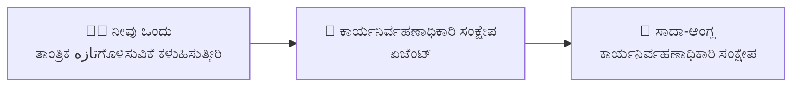

# ಮೋ듈್ 0 - ಪರಿಚಯ

⏱️ ~10 ನಿಮಿಷಗಳು

> [!WARNING]
> **ಪ್ರೀವ್ಯೂ ಮತ್ತು ಮಿತಿಗಳು:** [ಹೋಸ್ಟ್ ಮಾಡಿದ ಏಜೆಂಟ್‌ಗಳು](https://learn.microsoft.com/azure/foundry/agents/concepts/hosted-agents) ಪ್ರಸ್ತುತ **ಸಾರ್ವಜನಿಕ ಪ್ರಿವ್ಯೂ** ಯಲ್ಲಿ ಇವೆ - ಉತ್ಪಾದನಾ ಕೆಲಸಗಳಿಗೆ ಶಿಫಾರಸು ಮಾಡಲಾಗುತ್ತಿಲ್ಲ. ಕಳಪೆಗೊಳ್ಳಿರಿ ಕೆಳಗಿನವುಗಳನ್ನು:
> - **ಬೆಂಬಲಿತ ಪ್ರಾಂತಗಳು ಸೀಮಿತವಾಗಿವೆ** - ಸಂಪನ್ಮೂಲಗಳನ್ನು ರಚಿಸುವ ಮೊದಲು [ಪ್ರಾಂತ ಲಭ್ಯತೆ](https://learn.microsoft.com/azure/foundry/agents/concepts/hosted-agents#region-availability) ಪರಿಶೀಲಿಸಿ. ಬೆಂಬಲಿಸಲ್ಪಡುವುದಿಲ್ಲದ ಪ್ರಾಂತವನ್ನು ಆರಿಸಿಕೊಂಡರೆ, ನಿಯೋಜನೆ ವಿಫಲವಾಗುತ್ತದೆ.
> - `azure-ai-agentserver-agentframework` ಪ್ಯಾಕೇಜ್ ಪ್ರೀ-ರಿಲೀಸ್ ಆಗಿದ್ದು - ಆಪಿಐಗಳು ಆವೃತ್ತಿಗಳ ನಡುವೆ ಬದಲಾಯಿಸಬಹುದು.
> - ಮಾಪದಂಡ ಮಿತಿಗಳು: ಹೋಸ್ಟ್ ಮಾಡಿದ ಏಜೆಂಟ್‌ಗಳು 0–5 ಪ್ರತಿಗಳನ್ನು ಬೆಂಬಲಿಸುತ್ತವೆ (ಶೂನ್ಯಕ್ಕೆ ಮಾಪನ ಸೇರಿ).
> - ಈ ಕಾರ್ಯಾಗಾರದಲ್ಲಿ ಪ್ರದರ್ಶಿಸಲಾದ ಕೆಲವು ವೈಶಿಷ್ಟ್ಯಗಳು ಸೇವೆ GA ಕಡೆಗೆ ಸಾಗುತ್ತಿರುವಂತೆ ಬದಲಾಗಬಹುದು.

## ನೀವು ನಿರ್ಮಿಸುವುದು ಏನು

ಈ ಕಾರ್ಯಾಗಾರದಲ್ಲಿ, ನೀವು **"ನಾನು ಕಾರ್ಯನಿರ್ವಹಣಾಧಿಕಾರಿ ಎನ್ನುತ್ತಿರುವಂತೆ ವಿವರಿಸಿ"** ಏಜೆಂಟ್ ಅನ್ನು ನಿರ್ಮಿಸುವಿರಿ - ಸಂಘಟಿತ AI ಏಜೆಂಟ್ ಆಗಿದ್ದು, ಸಾಂದರ್ಭಿಕ ತಾಂತ್ರಿಕ ನವೀಕರಣಗಳನ್ನು ಸರಳವಾದ ಇಂಗ್ಲೀಷ್ ನಿರ್ವಹಣೆಗಳಾಗಿ ಮರು ಬರೆದಿಡುತ್ತದೆ.

```mermaid
flowchart LR
    A["🧑‍💻 ನೀವು ಒಂದು\nತಾಂತ್ರಿಕ تازهಗೊಳಿಸುವಿಕೆ ಕಳುಹಿಸುತ್ತೀರಿ"] --> B["🤖 ಕಾರ್ಯನಿರ್ವಹಣಾಧಿಕಾರಿ ಸಂಕ್ಷೇಪ\nಏಜೆಂಟ್"]
    B --> C["📝 ಸಾದಾ-ಆಂಗ್ಲ\nಕಾರ್ಯನಿರ್ವಹಣಾಧಿಕಾರಿ ಸಂಕ್ಷೇಪ"]
```

**ಏಜೆಂಟ್ ಉಪಯೋಗಿಸುವುದು:**
- **ಮೈಕ್ರೋಸಾಫ್ಟ್ ಏಜೆಂಟ್ ಫ್ರೇಮ್ವರ್ಕ್** - ಏಜೆಂಟ್ ತರ್ಕ ಮತ್ತು ರಚನೆಗಾಗಿ
- **ಫೌಂಡ್ರಿ ಟೂಲ್‌ಕಿಟ್ ಫಾರ್ VS ಕೋಡ್** - ಸ್ಕಾಫೋಲ್‌ಡ್ ಮಾಡಲು, ಸ್ಥಳೀಯವಾಗಿ ಪರೀಕ್ಷಿಸಲು, ಮತ್ತು ನಿಯೋಜಿಸಲು
- **ಒಂದು AI ಮಾದರಿ** (ಉದಾ., `gpt-4.1-mini/gpt-5-mini`) - ನಿರ್ವಹಣೆಗಳನ್ನು ರಚಿಸಲು

ಈ ಪ್ರಯೋಗ ಶಿಬಿರದ ಅಂತ್ಯಕ್ಕೆ, ನೀವು ಮಾಡ Eugene ಕೆಲಸಮಾಡುವ ಏಜೆಂಟ್ ಅನ್ನು ಹೊಂದಿರುತ್ತೀರಿ, ಅದನ್ನು ನೀವು ಸ್ಥಳೀಯವಾಗಿ ಏಜೆಂಟ್ ಇನ್ಸ್ಪೆಕ್ಟರ್ ಮೂಲಕ ಪರೀಕ್ಷಿಸಬಹುದು, ಮತ್ತು ಆಯ್ಕೆಯಾಗಿ ಮೋಡಕ್ಕೆ ನಿಯೋಜಿಸಬಹುದು.

---

## ಹೋಸ್ಟ್ ಮಾಡಿದ ಏಜೆಂಟ್‌ಗಳು ಏನು?

**ಹೋಸ್ಟ್ ಮಾಡಿದ ಏಜೆಂಟ್** ಎಂದರೆ ಮೈಕ್ರೋಸಾಫ್ಟ್ ಫೌಂಡ್ರಿಯಲ್ಲಿ ನಿರ್ವಹಿಸುವ ಸೇವೆಯಾಗಿ ನಡೆಯುವ AI ಏಜೆಂಟ್. ನಿಮ್ಮ ಸ್ವಂತ ಮೂಲಸೌಕರ್ಯವನ್ನು ನಿರ್ವಹಿಸುವ ಬದಲಾಗಿ, ನೀವು ನಿಮ್ಮ ಏಜೆಂಟ್ ಕೋಡ್ ಅನ್ನು ಒಂದು ಕಂಟೈನರ್‌ನಲ್ಲಿ ಪ್ಯಾಕೇಜ್ ಮಾಡಿ, ಫೌಂಡ್ರಿ ಅದನ್ನು ಮಾಪನ, ಹೋಸ್ಟಿಂಗ್ ಮತ್ತು ಸಾಮಾನ್ಯ HTTP ಎಂಡ್ಪಾಯಿಂಟ್ ಮೂಲಕ ಪ್ರದರ್ಶಿಸುವುದನ್ನು ನಿರ್ವಹಿಸುತ್ತದೆ.

| ಕಲ್ಪನೆ | ಅರ್ಥ |
|---------|--------------|
| **ಏಜೆಂಟ್** | ಬಳಕೆದಾರರ ಸಂದೇಶವನ್ನು ಸ್ವೀಕರಿಸುವ, AI ಮಾದರಿಯನ್ನು ಕರೆಮಾಡುವ, ಮತ್ತು ಸಂರಚಿತ ಪ್ರತಿಕ್ರಿಯೆಯನ್ನು ನೀಡುವ ನಿಮ್ಮ ಪೈಥನ್ ಕೋಡ್ |
| **ಹೋಸ್ಟ್ ಮಾಡಿದ** | ಫೌಂಡ್ರಿ ನಿಮ್ಮ ಕಂಟೈನರ್ ಅನ್ನು ನಿಮಗಾಗಿ ಚಾಲನೆಗೊಳಿಸುತ್ತದೆ - VMಗಳು, ಕುಬರ್ನೇಟಿಸ್, ಅಥವಾ ಮೂಲಸೌಕರ್ಯ ನಿರ್ವಹಣೆ ಇಲ್ಲ |
| **ಪ್ರತಿಕ್ರಿಯೆಗಳ ಪ್ರೋಟೋಕಾಲ್** | ಯಾವುದೇ ಕ್ಲೈಸಿಂಟ್ ಕರೆಮಾಡ ಬಹುದಾದ ಸಾಮಾನ್ಯ HTTP API (`POST /responses`) |
| **ಏಜೆಂಟ್ ಇನ್ಸ್ಪೆಕ್ಟರ್** | ಸ್ಥಳೀಯ ಪರೀಕ್ಷಿಸಲು UI (ಫೌಂಡ್ರಿ ಟೂಲ್‌ಕಿಟ್‌ನಲ್ಲಿ ನಿರ್ಮಿತ) - ನಿಯೋಜಿಸುವ ಮೊದಲು ನಿಮ್ಮ ಏಜೆಂಟ್ ಜೊತೆಗೆ ಚಾಟ್ ಮಾಡಲು ಮಂಜೂರು |

ಈ ಕಾರ್ಯಾಗಾರದಲ್ಲಿ, ನೀವು ಶೂನ್ಯದಿಂದ ಸಂಪೂರ್ಣ ಹೋಸ್ಟ್ ಮಾಡಿದ ಏಜೆಂಟ್‌ಗೆ ಸಾಗುತ್ತೀರಿ - ಅಥವಾ ನೀವು ಇಚ್ಛಿಸಿದರೆ ಕೇವಲ ಸ್ಥಳೀಯ ಪರೀಕ್ಷೆಯಲ್ಲಿ ನಿಲ್ಲಬಹುದು.

---

## ನಿಮ್ಮ ಮಾರ್ಗವನ್ನು ಆರಿಸಿ

> ⚠️ **ಮುಂದುವರಿಯುವ ಮೊದಲು ಒಂದು ಮಾರ್ಗವನ್ನು ಆರಿಸಿ.** ನಿಮ್ಮ ಆಯ್ಕೆ ಯಾವ ಉಪಕರಣಗಳನ್ನು ಇನ್‌ಸ್ಟಾಲ್ ಮಾಡಬೇಕು ಮತ್ತು ಯಾವ ಮೋ듎ಲ್‌ಗಳು ಅನ್ವಯವಾಗುತ್ತವೆ ಎಂಬುದನ್ನು ನಿರ್ಧರಿಸುತ್ತದೆ. ನಿಮ್ಮ ಬಳಿ ಸಬ್‌ಸ್ಕ್ರಿಪ್ಷನ್ ಇದ್ದರೆ ನೀವು ಮಾರ್ಗ B → ಮಾರ್ಗ A ಗೆ ಬದಲಾಯಿಸಬಹುದು.

<strong>🅰️ ಮಾರ್ಗ A - ಅಜೂರ್ ಮೋಡ್ (ಅಜೂರ್ ಸಬ್‌ಸ್ಕ್ರಿಪ್ಷನ್ ಅಗತ್ಯವಿದೆ)</strong>

| | ವಿವರಗಳು |
|---|---|
| **ಯವರಿಗೆ ಇದು?** | ನಿಮಗೆ ಸಕ್ರಿಯ ಅಜೂರ್ ಸಬ್‌ಸ್ಕ್ರಿಪ್ಷನ್ ಇದೆ ಮತ್ತು ನೀವು ಫೌಂಡ್ರಿ ಸಂಪನ್ಮೂಲಗಳನ್ನು ರಚಿಸಬಹುದು |
| **ಮಾದರಿ** | ಫೌಂಡ್ರಿಯ ಮುಖಾಂತರ ಅಜೂರ್ ಓಪನ್AI (ಉದಾ., `gpt-4.1-mini/gpt-5-mini`) |
| **ಅಳವಡಿಸಲಾದ ಮೋ듎ಲ್‌ಗಳು** | ಎಲ್ಲಾ ಮೋ듎ಲ್‌ಗಳು (00–07) |
| **ಮೋಡಕ್ಕೆ ನಿಯೋಜಿಸುವುದೇನೆ?** | ✅ ಹೌದು - ಸಂಪೂರ್ಣ ಎಂಡ್-ಟು-ಎಂಡ್ ನಿಯೋಜನೆ |

<strong>🅱️ ಮಾರ್ಗ B - ಸ್ಥಳೀಯ / ಉಚಿತ-ಮಟ್ಟ (ಅಜೂರ್ ಸಬ್‌ಸ್ಕ್ರಿಪ್ಷನ್ ಅಗತ್ಯವಿಲ್ಲ)</strong>

| | ವಿವರಗಳು |
|---|---|
| **ಯವರಿಗೆ ಇದು?** | MVPಗಳು, ವಿದ್ಯಾರ್ಥಿಗಳು, ಅಥವಾ ಅಜೂರ್ ಪ್ರವೇಶವಿಲ್ಲದ ಯಾವುದೇ ವ್ಯಕ್ತಿಗಳು |
| **ಮಾದರಿ** | **ಫೌಂಡ್ರಿ ಸ್ಥಳೀಯ** (ಉಚಿತ, ನಿಮ್ಮ ಯಂತ್ರದಲ್ಲಿ ಚಲಿಸುತ್ತದೆ) |
| **ಅಳವಡಿಸಲಾದ ಮೋ듎ಲ್‌ಗಳು** | ಮೋ듎ಲ್‌ಗಳು 00–04 (ನಿಯೋಜನೆ ಮತ್ತು ಮೋಡ್ ಪರಿಶೀಲನೆ ಬಿಟ್ಟುಬಿಡಿ) |
| **ಮೋಡಕ್ಕೆ ನಿಯೋಜಿಸುವುದೇನೆ?** | ❌ ಇಲ್ಲ - ಏಜೆಂಟ್ ಇನ್ಸ್ಪೆಕ್ಟರ್ ಮೂಲಕ ಸ್ಥಳೀಯ ಪರೀಕ್ಷೆ ಮಾತ್ರ |

---

## ಎಲ್ಲಾ ಮಾರ್ಗಗಳು: ಅಗತ್ಯವೂ ಸಾಧನಗಳು

ಕೆಳಗಿನ ಪ್ರತಿಯೊಂದು ಉಪಕರಣವನ್ನು ಇನ್‌ಸ್ಟಾಲ್ ಮಾಡಿ. ಇನ್‌ಸ್ಟಾಲ್ ಆದ ಮೇಲೆ, ಪರಿಶೀಲಿಸುವ ಆದೇಶವನ್ನು ಚಾಲನೆ ಮಾಡಿ ಅದು ಕಾರ್ಯನಿರ್ವಹಿಸುತ್ತದೆಯೆಂದು ಖಚಿತಪಡಿಸಿಕೊಳ್ಳಿ.

| # | ಸಾಧನ | ಆವೃತ್ತಿ | ಇನ್‌ಸ್ಟಾಲ್ | ಪರಿಶೀಲನೆ (ನಿರೀಕ್ಷಿತ ಫಲಿತಾಂಶ) |
|---|------|---------|---------|---------------------------|
| 1 | **ವಿಸುಯಲ್ ಸ್ಟುಡಿಯೋ ಕೋಡ್** | ಇತ್ತೀಚಿನದು | [code.visualstudio.com](https://code.visualstudio.com/) | ದೋಷವೇ ಇಲ್ಲದೆ ತೆರೆಯುತ್ತದೆ |
| 2 | **ಪೈಥಾನ್** | 3.12 ಅಥವಾ ಹೆಚ್ಚಿನದು | [python.org/downloads](https://www.python.org/downloads/) | `python --version` $\rightarrow$ `Python 3.12.x` |
| 3 | **ಫೌಂಡ್ರಿ ಟೂಲ್‌ಕಿಟ್ ಫಾರ್ VS ಕೋಡ್** | ಇತ್ತೀಚಿನದು | ವಿಸ್ತರಣೆ ID: `ms-windows-ai-studio.windows-ai-studio` | ಫೌಂಡ್ರಿ ಚಿಹ್ನೆ ಕಾರ್ಯ ಚಟುವಟಿಕೆ ಪಟ್ಟಿಯಲ್ಲಿ |
| 4 | **VS ಕೋಡ್ ಗಾಗಿ ಪೈಥಾನ್ ವಿಸ್ತರಣೆ** | ಇತ್ತೀಚಿನದು | ವಿಸ್ತರಣೆ ID: `ms-python.python` | ವಿಸ್ತರಣೆ ಪ್ಯಾನೆಲ್‌ನಲ್ಲಿ ಇನ್‌ಸ್ಟಾಲ್ ಆಗಿದೆ |

> [!TIP]
> **ಇನ್‌ಸ್ಟಾಲೇಶನ್‌ಗಾಗಿ ಪ್ರೋ-ಟಿಪ್‌ಗಳು:**
> - **ಪೈಥಾನ್ ಪಾಥ್ (ವಿಂಡೋಸ್):** ಪೈಥಾನ್ ಇನ್‌ಸ್ಟಾಲರ್ ಮೊದಲ ಪರದೆ ಮೇಲೆ ಯಾವಾಗಲೂ **"Add Python to PATH"** ಅನ್ನು ಪರಿಶೀಲಿಸಿ. ಇದಿಲ್ಲದೆ, ನಿಮ್ಮ ಟರ್ಮಿನಲ್‌ನಲ್ಲಿ `python` ಗುರುತಿಸಲಾಗುವುದಿಲ್ಲ.
> - **ಬಹು ಪೈಥಾನ್ ಆವೃತ್ತಿಗಳು:** ನೀವು Python 3.10 ಮತ್ತು 3.12 ಎರಡೂ ಇನ್‌ಸ್ಟಾಲ್ ಮಾಡಿದಿದ್ದರೆ, ನಿಮ್ಮ ವರ್ಚುವಲ್ ಪರಿಸರಕ್ಕೆ ಸರಿಯಾದ ಆವೃತ್ತಿ ಉಪಯೋಗಿಸುವ ಹಾಗೆ `python3.12 -m venv .venv` ಅಭ್ಯಾಸ ಮಾಡಿ.
> - **ಡೋಕರ್ WSL 2 (ವಿಂಡೋಸ್):** ಡೋಕರ್ ಡೆಸ್ಕ್‌ಟಾಪ್ ಇನ್‌ಸ್ಟಾಲೇಶನ್ ವೇಳೆ, **WSL 2 ಬ್ಯಾಕ್‌ಎಂಡ್** ಆಯ್ಕೆಮಾಡಿ. Hyper-V ಜೊತೆಗೆ ಡೋಕರ್ ನಿಧಾನವಾಗಿ ಕಾರ್ಯನಿರ್ವಹಿಸುತ್ತದೆ ಮತ್ತು ಫೌಂಡ್ರಿ ಕಂಟೈನರ್ ನಿರ್ಮಾಣಕ್ಕೆ ಸಮಸ್ಯೆ ಉಂಟಾಗಬಹುದು.
> - **ಡೋಕರ್ ಚಾಲನೆಯಾಗುತ್ತಿಲ್ಲವೇ?** ಡೋಕರ್ ಡೆಸ್ಕ್‌ಟಾಪ್ ಆರಂಭಿಸಿದ ನಂತರ 30–60 ಸೆಕೆಂಡುಗಳಷ್ಟು ಕಾಯಿರಿ. `docker info` ಚಾಲನೆ ಮಾಡಿ - "Cannot connect to the Docker daemon" ಈ ಸಂದೇಶ ಕಾಣಿಸಿದರೆ, ಡೋಕರ್ ಇನ್ನೂ ಆರಂಭವಾಗುತ್ತಿದ್ದುದು.
> - **VS ಕೋಡ್ ವಿಸ್ತರಣೆಗಳು ಲೋಡ್ ಆಗುತ್ತಿಲ್ಲವೇ?** ವಿಸ್ತರಣೆಗಳ ಇನ್‌ಸ್ಟಾಲೇಶನ್ ನಂತರ, ವಿಂಡೋ ಅನ್ನು ಪುನಃ ಲೋಡ್ ಮಾಡಿ: `Ctrl+Shift+P` → `Developer: Reload Window`.

> **ವಿಂಡೋಸ್ ಬಳಕೆದಾರರು:** ಪೈಥಾನ್ ಇನ್‌ಸ್ಟಾಲೇಶನ್ ಸಮಯದಲ್ಲಿ **"Add Python to PATH"** ಪರಿಶೀಲಿಸಿ.

**ಮುಂದೆ:** [01 - ಸೆಟಪ್ →](01-setup.md)

---

<!-- CO-OP TRANSLATOR DISCLAIMER START -->
**ಅಸ್ವೀಕಾರ**:
ಈ ದಸ್ತಾವೇಜು AI ಅನುವಾದ ಸೇವೆ [Co-op Translator](https://github.com/Azure/co-op-translator) ಬಳಸಿ ಅನುವಾದಿಸಲಾಗಿದೆ. ನಾವು ನಿಖರತೆಯನ್ನು ಸಾಧಿಸಲು ಪ್ರಯತ್ನಿಸುತ್ತಿದ್ದರೂ, ದಯವಿಟ್ಟು ಗಮನಿಸಿ, ಸ್ವಯಂಚಾಲಿತ ಅನುವಾದಗಳಲ್ಲಿ ದೋಷಗಳು ಅಥವಾ ಅಸಡ್ಡೆಗಳು ಇರಬಹುದು. ಮೂಲ ಭಾಷೆಯಲ್ಲಿರುವ ಮೂಲ ದಸ್ತಾವೇಜು ಪ್ರಾಮಾಣಿಕ ಮೂಲವೆಂದು ಪರಿಗಣಿಸಬೇಕು. ಪ್ರಮುಖ ಮಾಹಿತಿಗಾಗಿ, ವೃತ್ತಿಪರ ಮಾನವ ಅನುವಾದವನ್ನು ಶಿಫಾರಸು ಮಾಡಲಾಗುತ್ತದೆ. ಈ ಅನುವಾದವನ್ನು ಬಳಸುವ ಮೂಲಕ ಉಂಟಾಗುವ ಯಾವುದೇ ತಪ್ಪು ಅರ್ಥಗಳ ಅಥವಾ ತಪ್ಪು ವ್ಯಾಖ್ಯಾನಗಳ ಬಗ್ಗೆ ನಾವು ಹೊಣೆಗಾರರಲ್ಲ.
<!-- CO-OP TRANSLATOR DISCLAIMER END -->