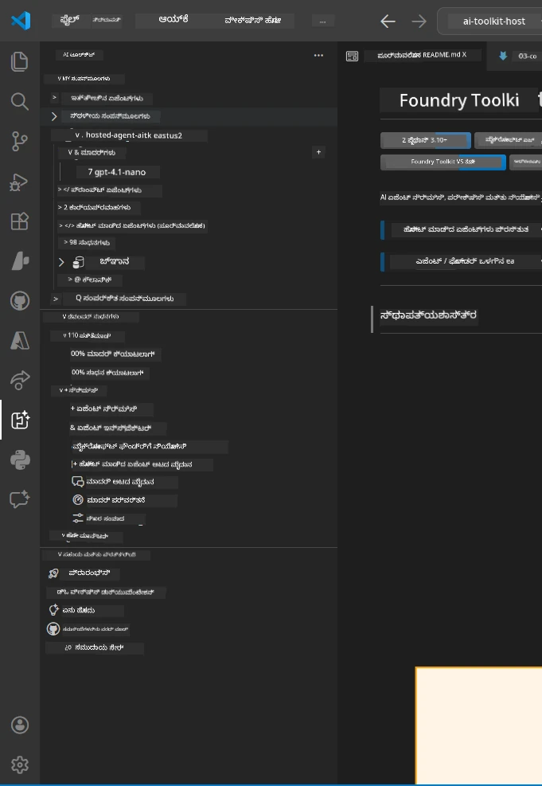
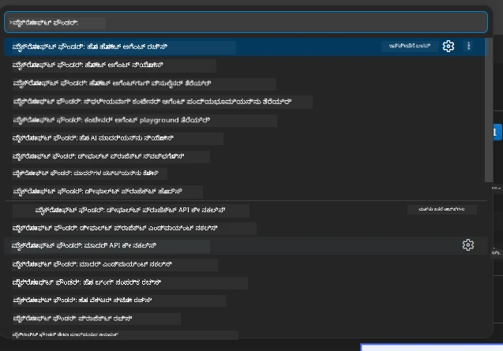

# ಭಾಗ 1 - ಫೌಂಡರಿ ಟೂಲ್‌ಕಿಟ್ & ಫೌಂಡರಿ ವಿಸ್ತರಣೆ ಇನ್ಸ್ಟಾಲ್ ಮಾಡಿ

ಈ ಭಾಗವು ನಿಮ್ಮನ್ನು ಈ ವರ್ಕ್‌ಶಾಪ್‌ಗಾಗಿ ಪ್ರಮುಖ VS ಕೋಡ್ ವಿಸ್ತರಣೆಗಳನ್ನು ಇನ್ಸ್ಟಾಲ್ ಮಾಡಿ ಪರಿಶೀಲಿಸುವ ಪಥದ ಮೂಲಕ ನಡೆಸುತ್ತದೆ. ನೀವು ಈಗಾಗಲೇ [ಭಾಗ 0](00-prerequisites.md) ನಲ್ಲಿ ಅವುಗಳನ್ನು ಇನ್ಸ್ಟಾಲ್ ಮಾಡಿಕೊಂಡಿದ್ದರೆ, ಅವು ಸರಿಯಾಗಿ ಕಾರ್ಯನಿರ್ವಹಿಸುತ್ತಿರುವುದನ್ನು ಪರಿಶೀಲಿಸಲು ಈ ಭಾಗವನ್ನು ಬಳಸಿಕೊಳ್ಳಿ.

---

## ಹಂತ 1: ಮೈಕ್ರೋಸಾಫ್ಟ್ ಫೌಂಡರಿ ವಿಸ್ತರಣೆ ಇನ್ಸ್ಟಾಲ್ ಮಾಡಿ

**Microsoft Foundry for VS Code** ವಿಸ್ತರಣೆ ನಿಮ್ಮ ಪ್ರಾಥಮಿಕ ಉಪಕರಣವಾಗಿದ್ದು, ಫೌಂಡರಿ ಪ್ರಾಜೆಕ್ಟ್‌ಗಳನ್ನು ರಚಿಸಲು, ಮಾದರಿಗಳನ್ನು ನಿಯೋಜಿಸಲು, ہوس್ಟ್‌ಡ್ ಏಜೆಂಟ್ಸ್ ಸ್ಕ್ಯಾಫೋಲ್ಡ್ ಮಾಡಲು ಮತ್ತು ಸಿಧಾ VS ಕೋಡ್‌ನಿಂದ ನಿಯೋಜಿಸಲು ಬಳಸುವ ಉಪಕರಣವಾಗಿದೆ.

1. VS ಕೋಡ್ ತೆರೆಯಿರಿ.
2. `Ctrl+Shift+X` ಒತ್ತಿ **ವಿಸ್ತರಣೆಗಳು** ಪ್ಯಾನೆಲ್ ಅನ್ನು ತೆರೆಯಿರಿ.
3. ಮೇಲಿನ ಶೋಧ ಫೀಲ್ಡ್ ನಲ್ಲಿ ಟೈಪ್ ಮಾಡಿ: **Microsoft Foundry**
4. ಫಲಿತಾಂಶಗಳಲ್ಲಿ **Microsoft Foundry for Visual Studio Code** ಹೆಸರಿನ ವಿಸ್ತರಣೆಯನ್ನು ಹುಡುಕಿ.
   - ಪ್ರಕಟಕ: **Microsoft**
   - ವಿಸ್ತರಣೆ ID: `TeamsDevApp.vscode-ai-foundry`
5. **Install** ಬಟನ್ ಅನ್ನು ಕ್ಲಿಕ್ ಮಾಡಿ.
6. ಇನ್ಸ್ಟಾಲ್ ಪ್ರಕ್ರಿಯೆ ಪೂರ್ಣವಾಗುವವರೆಗೆ ಕಾಯಿರಿ (ನೀವು ಚಿಕ್ಕ ಪ್ರಗತಿ ಸೂಚಕವನ್ನು ಕಾಣುತ್ತೀರಿ).
7. ಇನ್ಸ್ಟಾಲ್ ಆದಮೇಲೆ, VS ಕೋಡ್‌ನ ಎಡಭಾಗದ ಲಂಬ ಐಕಾನ್ ಬಳಿದರು **Activity Bar** ನೋಟ್ ಮಾಡಿ. ನೀವು ಹೊಸ **Microsoft Foundry** ಐಕಾನ್ (ಹೀರೆಯಂತಹ/AI ಐಕಾನ್) ಕಾಣಬೇಕು.
8. **Microsoft Foundry** ಐಕಾನ್ ಕ್ಲಿಕ್ ಮಾಡಿ ಅದರ Sidebar ವೀಕ್ಷಣೆಯನ್ನು ತೆರೆಯಿರಿ. ನೀವು ಕೆಳಗಿನ ವಿಭಾಗಗಳನ್ನು ಕಾಣಬೇಕು:
   - **Resources** (ಅಥವಾ Projects)
   - **Agents**
   - **Models**

> **ಐಕಾನ್ ಗೋಚರಿಸದಿದ್ದರೆ:** VS ಕೋಡ್ ಅನ್ನು ಮರುಲೋಡ್ ಮಾಡಲು ಪ್ರಯತ್ನಿಸಿ (`Ctrl+Shift+P` → `Developer: Reload Window`).

---

## ಹಂತ 2: ಫೌಂಡರಿ ಟೂಲ್‌ಕಿಟ್ ವಿಸ್ತರಣೆ ಇನ್ಸ್ಟಾಲ್ ಮಾಡಿ

**Foundry Toolkit** ವಿಸ್ತರಣೆ [**Agent Inspector**](https://learn.microsoft.com/azure/foundry/agents/how-to/vs-code-agents-workflow-pro-code) ಅನ್ನು ಒದಗಿಸುವುದು - ಏಜೆಂಟ್ಸ್ ನಿಗೆ ಸ್ಥಳೀಯವಾಗಿ ಪರೀಕ್ಷಿಸಲು ಮತ್ತು ಡಿಬಗ್ ಮಾಡಲು ದೃಶ್ಯಾತ್ಮಕ ಇಂಟರ್‌ಫೇಸ್ - ಜೊತೆಗೆ ಪ್ಲೇಗ್ರೌಂಡ್, ಮಾದರಿ ನಿರ್ವಹಣೆ ಮತ್ತು ಮೌಲ್ಯಮಾಪನ ಉಪಕರಣಗಳನ್ನು ಒದಗಿಸುತ್ತದೆ.

1. ವಿಸ್ತರಣೆಗಳ ಪ್ಯಾನೆಲ್ ನಲ್ಲಿ (`Ctrl+Shift+X`), ಶೋಧ ಫೀಲ್ಡ್ ಕ್ಲియర్ ಮಾಡಿ ಮತ್ತು ಟೈಪ್ ಮಾಡಿ: **Foundry Toolkit**
2. ಫಲಿತಾಂಶಗಳಲ್ಲಿ **Foundry Toolkit** ಅನ್ನು ಹುಡುಕಿ.
   - ಪ್ರಕಟಕ: **Microsoft**
   - ವಿಸ್ತರಣೆ ID: `ms-windows-ai-studio.windows-ai-studio`
3. **Install** ಕ್ಲಿಕ್ ಮಾಡಿ.
4. ಇನ್ಸ್ಟಾಲ್ ನಂತರ, Activity Bar ನಲ್ಲಿ **Foundry Toolkit** ಐಕಾನ್ ಕಾಣಿಸುತ್ತದೆ (ರೋಬೋಟ್/ಚಕಚಕાટದಂತೆ ಕಾಣುತ್ತದೆ).
5. **Foundry Toolkit** ಐಕಾನ್ ಕ್ಲಿಕ್ ಮಾಡಿ Sidebar ವೀಕ್ಷಣೆಯನ್ನು ತೆರೆಯಿರಿ. ನೀವು ಕೆಳಗಿನ ಆಯ್ಕೆಗಳಿಗೆ ಜೊತೆಗೆ Foundry Toolkit ಸ್ವಾಗತ ಪರದೆ ಕಾಣಬೇಕು:
   - **Models**
   - **Playground**
   - **Agents**

---

## ಹಂತ 3: ಎರಡೂ ವಿಸ್ತರಣೆಗಳು ಸರಿಯಾಗಿ ಕಾರ್ಯನಿರ್ವಹಿಸುತ್ತಿರುವುದನ್ನು ಪರಿಶೀಲಿಸಿ

### 3.1 ಮೈಕ್ರೋಸಾಫ್ಟ್ ಫೌಂಡರಿ ವಿಸ್ತರಣೆ ಪರಿಶೀಲನೆ

1. Activity Bar ನಲ್ಲಿ **Microsoft Foundry** ಐಕಾನ್ ಕ್ಲಿಕ್ ಮಾಡಿ.
2. ನೀವು Azureನಲ್ಲಿ ಸೈನ್ ಇನ್ ಆಗಿದ್ದರೆ (ಭಾಗ 0 ನಲ್ಲಿ), ನಿಮ್ಮ ಪ್ರಾಜೆಕ್ಟ್‌ಗಳು **Resources** ಅಡಿಯಲ್ಲಿ ಪಟ್ಟಿ ಆಗಿರುತ್ತವೆ.
3. ಸೈನ್ ಇನ್ ಮಾಡಲು ಕೇಳಿದರೆ, **Sign in** ಕ್ಲಿಕ್ ಮಾಡಿ ಮತ್ತು ಪ್ರಮಾಣೀಕರಣ ಪ್ರಕ್ರಿಯೆ ಅನುಸರಿಸಿ.
4. Sidebar	Errors ಇಲ್ಲದೆ ಲೋಡ್ ಆಗುತ್ತಿದೆಯೇ ಎಂಬುದನ್ನು ದೃಢಪಡಿಸಿ.

### 3.2 Foundry Toolkit ವಿಸ್ತರಣೆ ಪರಿಶೀಲನೆ

1. Activity Bar ನಲ್ಲಿ **Foundry Toolkit** ಐಕಾನ್ ಕ್ಲಿಕ್ ಮಾಡಿ.
2. ಸ್ವಾಗತ ವೀಕ್ಷಣೆ ಅಥವಾ ಮುಖ್ಯ ಪ್ಯಾನೆಲ್ ದೋಷಗಳು ಇಲ್ಲದೆ ಲೋಡ್ ಆಗುತ್ತಿದೆಯೇ ಎಂದು ದೃಢಪಡಿಸಿ.
3. ಯಾವದಕ್ಕೂ ಈಗಾಗಲೇ ಸಂರಚನೆ ಅಗತ್ಯವಿಲ್ಲ - ನಾವು ಏಜೆಂಟ್ இன್ಸ್ಪೆಕ್ಟರ್ ಅನ್ನು [ಭಾಗ 5](05-test-locally.md) ನಲ್ಲಿ ಬಳಸದಿದ್ದೇವೆ.

### 3.3 ಕಮಾಂಡ್ ಪಾಲೆಟ್ ಮೂಲಕ ಪರಿಶೀಲನೆ

1. `Ctrl+Shift+P` ಒತ್ತಿ Command Palette ತೆರೆಯಿರಿ.
2. ಟೈಪ್ ಮಾಡಿ **"Microsoft Foundry"** - ನೀವು ಕೆಳಗಿನಂತಿರುವ ಕಮಾಂಡ್‌ಗಳನ್ನು ಕಾಣಬೇಕು:
   - `Microsoft Foundry: Create a New Hosted Agent`
   - `Microsoft Foundry: Deploy Hosted Agent`
   - `Microsoft Foundry: Open Model Catalog`
3. Command Palette ಮುಚ್ಚಲು `Escape` ಒತ್ತಿ.
4. ಮತ್ತೆ Command Palette ತೆರೆಯಿರಿ ಮತ್ತು ಟೈಪ್ ಮಾಡಿ **"Foundry Toolkit"** - ನೀವು ಕೆಳಗಿನಂತಿರುವ ಕಮಾಂಡ್‌ಗಳನ್ನು ಕಾಣಬೇಕು:
   - `Foundry Toolkit: Open Agent Inspector`

> ನೀವು ಈ ಕಮಾಂಡ್‌ಗಳನ್ನು ಕಾಣದಿದ್ದರೆ, ವಿಸ್ತರಣೆಗಳು ಸರಿಯಾಗಿ ಇನ್ಸ್ಟಾಲಾಗಿಲ್ಲ. ಅವುಗಳನ್ನು ಅನಿನ್ಸ್ಟಾಲ್ ಮಾಡಿ ಪುನಃ ಇನ್ಸ್ಟಾಲ್ ಮಾಡಲು ಪ್ರಯತ್ನಿಸಿ.

---

## ಈ ವರ್ಕ್‌ಶಾಪ್‌ನಲ್ಲಿ ಈ ವಿಸ್ತರಣೆಗಳು ಏನು ಮಾಡುತ್ತವೆ

| ವಿಸ್ತರಣೆ | ಏನು ಮಾಡುತ್ತದೆ | ಯಾವಾಗ ಬಳಸುತ್ತೀರಿ |
|-----------|--------------|--------------------|
| **Microsoft Foundry for VS Code** | ಫೌಂಡರಿ ಪ್ರಾಜೆಕ್ಟ್‌ಗಳನ್ನು ರಚಿಸಿ, ಮಾದರಿಗಳನ್ನು ನಿಯೋಜಿಸಿ, **[ಹೋಸ್ಟ್ ಮಾಡಲಾದ ಏಜೆಂಟ್ಸ್](https://learn.microsoft.com/azure/foundry/agents/concepts/hosted-agents)** ಸ್ಕ್ಯಾಫೋಲ್ಡ್ ಮಾಡಿ (ಸ್ವಯಂಚಾಲಿತವಾಗಿ `agent.yaml`, `main.py`, `Dockerfile`, `requirements.txt` ರಚಿಸುತ್ತದೆ), [Foundry Agent Service](https://learn.microsoft.com/azure/foundry/agents/overview) ಗೆ ನಿಯೋಜಿಸು | ಭಾಗ 2, 3, 6, 7 |
| **Foundry Toolkit** | ಏಜೆಂಟ್ ಇನ್ಸ್‌ಪೆಕ್ಟರ್ ಸ್ಥಳೀಯ ಪರೀಕ್ಷೆ/ಡಿಬಗ್ಗಿಂಗ್, ಪ್ಲೇಗ್ರೌಂಡ್ UI, ಮಾದರಿ ನಿರ್ವಹಣೆ | ಭಾಗ 5, 7 |

> **ಫೌಂಡರಿ ವಿಸ್ತರಣೆ ಈ ವರ್ಕ್‌ಶಾಪ್‌ನಲ್ಲಿ ಅತ್ಯಂತ ಮುಖ್ಯವಾದ ಉಪಕರಣವಾಗಿದೆ.** ಇದು ಅಂತಿಮ ಪ್ರಕ್ರಿಯೆಯನ್ನು ನಿರ್ವಹಿಸುತ್ತದೆ: ಸ್ಕ್ಯಾಫೋಲ್ಡ್ → ಸಂರಚಿಸಿ → ನಿಯೋಜಿಸಿ → ಪರಿಶೀಲಿಸಿ. ಫೌಂಡರಿ ಟೂಲ್‌ಕಿಟ್ ಸ್ಥಳೀಯ ಪರೀಕ್ಷೆಗಾಗಿ ದೃಶ್ಯಾತ್ಮಕ ಏಜೆಂಟ್ ಇನ್ಸ್‌ಪೆಕ್ಟರ್ ಅನ್ನು ಒದಗಿಸುವ ಮೂಲಕ ಅದರೊಂದಿಗೆ ಪೂರಕವಾಗುತ್ತದೆ.

---

### ಪರಿಶೀಲನೆ ಪಾಯಿಂಟ್

- [ ] Activity Bar ನಲ್ಲಿ Microsoft Foundry ಐಕಾನ್ ಗೋಚರಿಸುವುದೇ
- [ ] ಅದನ್ನು ಕ್ಲಿಕ್ ಮಾಡಿದಾಗ Sidebar ದೋಷಗಳಿಲ್ಲದೆ ತೆರೆಯುತ್ತದೆಯೇ
- [ ] Activity Bar ನಲ್ಲಿ Foundry Toolkit ಐಕಾನ್ ಗೋಚರಿಸುವುದೇ
- [ ] ಅದನ್ನು ಕ್ಲಿಕ್ ಮಾಡಿದಾಗ Sidebar ದೋಷಗಳಿಲ್ಲದೆ ತೆರೆಯುತ್ತದೆಯೇ
- [ ] `Ctrl+Shift+P` → "Microsoft Foundry" ಟೈಪ್ ಮಾಡಿದಾಗ ಕಮಾಂಡ್‌ಗಳು ಕಾಣಿಸುತ್ತವೆಯೇ
- [ ] `Ctrl+Shift+P` → "Foundry Toolkit" ಟೈಪ್ ಮಾಡಿದಾಗ ಕಮಾಂಡ್‌ಗಳು ಕಾಣಿಸುತ್ತವೆಯೇ

---

**ಹಿಂದಿನ:** [00 - ಪೂರ್ವಾಪೇಕ್ಷೆಗಳು](00-prerequisites.md) · **ಮುಂದಿನ:** [02 - ಫೌಂಡರಿ ಪ್ರಾಜೆಕ್ಟ್ ರಚಿಸಿ →](02-create-foundry-project.md)

---

<!-- CO-OP TRANSLATOR DISCLAIMER START -->
**ನಿರಾಕರಣೆ**:  
ಈ ದಾಖಲೆ [Co-op Translator](https://github.com/Azure/co-op-translator) ಎಂಬ AI ಅನುವಾದ ಸೇವೆಯನ್ನು ಬಳಸಿ ಅನುವಾದಿಸಲಾಗಿದೆ. ನಾವು ನಿಖರತೆಯಿಗಾಗಿ ಪ್ರಯತ್ನಿಸುತ್ತೇವೆ என்றರೂ, ಸ್ವಯಂಚಾಲಿತ ಅನುವಾದಗಳಲ್ಲಿ ದೋಷಗಳು ಅಥವಾ ತಪ್ಪುಗಳು ಇರಬಹುದಾಗಿದೆ ಎಂದು ಮನಗಂಡು ಕೊಳ್ಳಿರಿ. ಮೂಲ ಭಾಷೆಯಲ್ಲಿರುವ ಮೂಲ ದಾಖಲೆ ನೈಜ ಮೂಲವಾಗಿದ್ದು ಅದರನ್ನೇ ಪ್ರಾಧಿಕಾರಿತ ಮೂಲ ಎಂದು ಪರಿಗಣಿಸಬೇಕು. ಮುಖ್ಯ ಮಾಹಿತಿಗಾಗಿ, ವೃತ್ತಿಪರ ಮಾನವ ಅನುವಾದವನ್ನು ಶಿಫಾರಸು ಮಾಡಲಾಗುತ್ತದೆ. ಈ ಅನುವಾದ ಬಳಸಿದ ಕಾರಣದಿಂದ ಉದ್ಭವಿಸುವ ಯಾವುದೇ ತಪ್ಪು ಗ್ರಹಿಕೆಗಳು ಅಥವಾ ಅರ್ಥ ಬದಲಾವಣೆಗಳಿಗೆ ನಾವು ಹೊಣೆಗಾರರಾಗುವುದಿಲ್ಲ.
<!-- CO-OP TRANSLATOR DISCLAIMER END -->