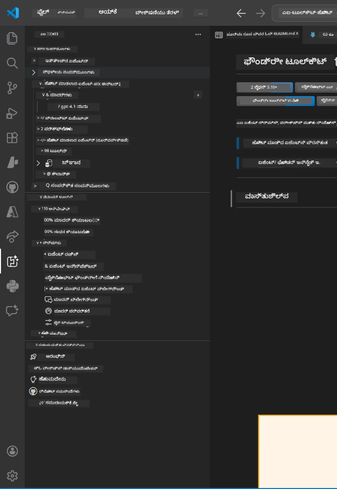
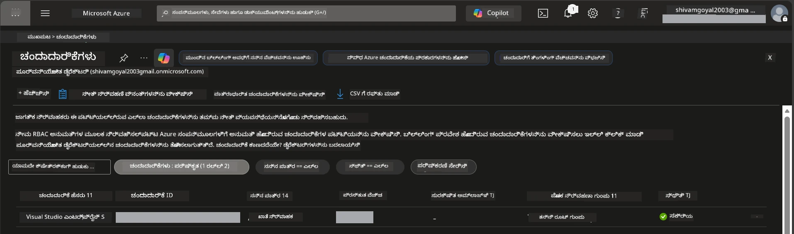
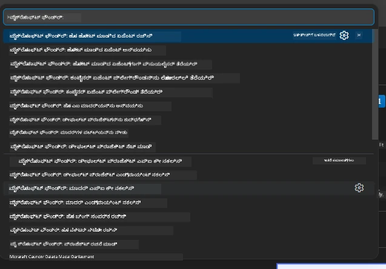
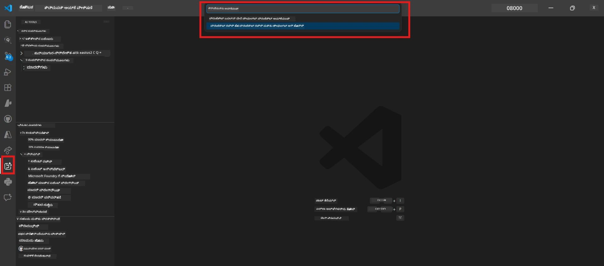
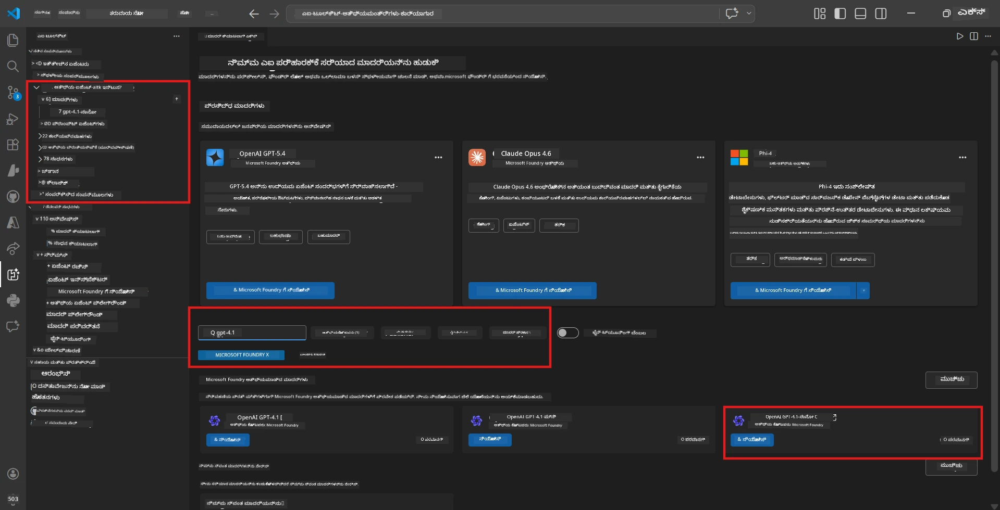
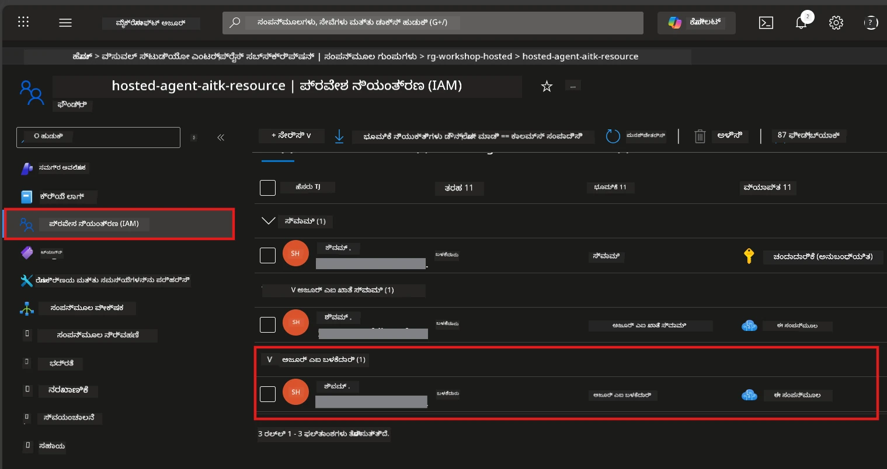

# ಸೆಟ್ ಅಪ್: ವಿಸ್ತರಣೆ, ಯೋಜನೆ ಮತ್ತು ಮಾದರಿ

⏱️ ~15 ನಿಮಿಷಗಳು

ಈ ಮೋಡ್ಯೂಲಿನಲ್ಲಿ, ನೀವು Foundry Toolkit ವಿಸ್ತರಣೆಯನ್ನು ಸ್ಥಾಪಿಸಿ ಪರಿಶೀಲಿಸುತ್ತೀರಿ, Foundry ಯೋಜನೆಯನ್ನು ರಚಿಸುತ್ತೀರಿ (ಅಥವಾ ಸಂಪರ್ಕಿಸುತ್ತೀರಿ), ಮತ್ತು ನಿಮ್ಮ ಏಜೆಂಟ್ ಬಳಸುವ ಮಾದರಿಯನ್ನು ನಿಯೋಜಿಸುತ್ತೀರಿ.

## ಹಂತ 1: Foundry Toolkit ಸ್ಥಾಪನೆ

**VS Codeಗಾಗಿ Foundry Toolkit** ಈ ಕಾರ್ಯಾಗಾರದ ಮುಖ್ಯ ವಿಸ್ತರಣೆ ಆಗಿದೆ. ಇದು ಯೋಜನೆ ರಚನೆ, ಮಾದರಿ ನಿಯೋಜನೆ, ಏಜೆಂಟ್ ಸ್ಕ್ಯಾಫೋಲ್ಡಿಂಗ್, ಸ್ಥಳೀಯ ಪರೀಕ್ಷೆ (Agent Inspector), ಮತ್ತು ಕ್ಲೌಡ್ ನಿಯೋಜನೆ - ಎಲ್ಲವೂ VS Code ನಿಂದ ಒದಗಿಸುತ್ತದೆ.

1. VS Code ತೆರೆಯಿರಿ ನಂತರ `Ctrl+Shift+X` ಒತ್ತಿ **Extensions** ಫಲಕವನ್ನು ತೆರೆಯಲು.
2. **Foundry Toolkit** ಎಂದು ಹುಡುಕಿ.
3. **VS Code ಗಾಗಿ Foundry Toolkit** ಅನ್ನು ಸ್ಥಾಪಿಸಿ (ಪ್ರಕಾಶಕ: Microsoft, ID: `ms-windows-ai-studio.windows-ai-studio`).
4. ಸ್ಥಾಪನೆಯ ನಂತರ, **Foundry Toolkit** ಚಿಹ್ನೆ ಕ್ರಿಯಾಶೀಲ ಪಟ್ಟಿಯಲ್ಲಿ (ಎಡ ಸೈಡ್ ಬಾರ್) ಕಾಣಿಸುತ್ತದೆ.

> *ಗೋಚರಿಕೆ: ಹಳೆಯ ವಿಸ್ತರಣೆ ಆವೃತ್ತಿಗಳಲ್ಲಿ ಕ್ರಿಯಾಶೀಲ ಪಟ್ಟಿಯಲ್ಲಿ "AI TOOLKIT" ಎಂದು ತೋರಿಸಬಹುದು. ಕಾರ್ಯಕ್ಷಮತೆ ಒಂದೇ.*



## ಹಂತ 2: ನಿಮ್ಮ ಪ್ರವೇಶ ಆಧಾರದ ಮೇಲೆ ಸೆಟ್ ಅಪ್ ಮಾಡಿ

> **ನಿಮ್ಮ ಮಾರ್ಗವನ್ನು ಆಯ್ಕೆಮಾಡಿ:** ಕೆಳಗಿನ ವಿಭಾಗವನ್ನು ವಿಸ್ತರಿಸಿ ಅದು ನಿಮ್ಮ ಸೆಟ್ ಅಪ್‌ಗೆ ಹೊಂದಿಕೆಯಾಗಿರುತ್ತದೆ. ನೀವು **ಒಂದು** ಮಾರ್ಗವನ್ನು ಮಾತ್ರ ಪೂರ್ಣಗೊಳಿಸಬೇಕಾಗುತ್ತದೆ.

<details>
<summary><strong>🅰️ ಮಾರ್ಗ A - ಅಝೂರ್ ಕ್ಲೌಡ್ (ಅಝೂರ್ ಸಬ್ಸ್ಕ್ರಿಪ್ಷನ್ ಅಗತ್ಯವಿದೆ)</strong></summary>

### ಅಝೂರ್ CLI

1. [learn.microsoft.com/cli/azure/install-azure-cli](https://learn.microsoft.com/cli/azure/install-azure-cli) बाट स्थापना ಮಾಡಿ.
2. ದೃಢೀಕರಿಸಿ: `az --version` (2.80.0+ ನಿರೀಕ್ಷಿಸಿ).
3. ಸೈನ್ ಇನ್: `az login`

### ಪ್ರಮಾಣೀಕರಣ ಆಯ್ಕೆಗಳು

[Microsoft Agent Framework](https://learn.microsoft.com/agent-framework/overview/) [`DefaultAzureCredential`](https://learn.microsoft.com/azure/developer/python/sdk/authentication/credential-chains#defaultazurecredential-overview) ಅನ್ನು ಬಳಸುತ್ತದೆ ಇದು ಕ್ರಮವಾಗಿ ಹಲವಾರು ಪ್ರಮಾಣೀಕರಣ ವಿಧಾನಗಳನ್ನು ಪ್ರಯತ್ನಿಸುತ್ತದೆ. ನಿಮ್ಮ ಪರಿಸರಕ್ಕೆ ಹೊಂದಿಕೊಂಡಿರುವವನ್ನು ಆರಿಸಿ:

#### ಆಯ್ಕೆ 1: VS Code ಖಾತೆಗಳು (ಕಾರ್ಯಾಗಾರಗಳಿಗೆ ಶಿಫಾರಸು)
1. VS Code ನಲ್ಲಿ ಕೆಳಗೆ ಎಡಭಾಗದ **ಖಾತೆಗಳು** ಐಕಾನ್ (ವ್ಯಕ್ತಿ ಸಿಲುಯೆಟ್) ನ್ನು ಕ್ಲಿಕ್ ಮಾಡಿ.
2. **Microsoft Foundry ಬಳಸಲು ಸೈನ್ ಇನ್** (ಅಥವಾ **ಅಝೂರ್ ಮೂಲಕ ಸೈನ್ ಇನ್**) ಆಯ್ಕೆಮಾಡಿ.
3. ಬ್ರೌಸರ್ ತೆರೆಯುತ್ತದೆ - ನಿಮ್ಮ ಸಬ್ಸ್ಕ್ರಿಪ್ಷನ್ ಪ್ರವೇಶವಿರುವ ಅಝೂರ್ ಖಾತೆಯಿಂದ ಸೈನ್ ಇನ್ ಮಾಡಿ.
4. VS Code ಗೆ ಹಿಂತಿರುಗಿ. ಕೆಳಗೆ ಎಡಭಾಗದಲ್ಲಿ ನಿಮ್ಮ ಖಾತೆ ಹೆಸರು ಕಾಣಿಸಬೇಕು.

#### ಆಯ್ಕೆ 2: ಅಝೂರ್ CLI
```bash
az login
az account set --subscription "<your-subscription-id>"
```

#### ಆಯ್ಕೆ 3: ಸರ್ವಿಸ್ ಪ್ರಿನ್ಸಿಪಲ್ (ಎಂಟರ್ಪ್ರೈಸ್ / CI)
ಲಾಕ್‌ಡೌನ್ ಪರಿಸರಗಳು ಅಥವಾ CI/CD ಪೈಪ್ಲೈನ್ಗಳಿಗಾಗಿ, ನಿಮ್ಮ `.env` ಫೈಲ್‌ನಲ್ಲಿ ಈ ಪರಿಸರಚರಗಳನ್ನು ಸೆಟ್ ಮಾಡಿ:
```env
AZURE_TENANT_ID=<your-tenant-id>
AZURE_CLIENT_ID=<your-client-id>
AZURE_CLIENT_SECRET=<your-client-secret>
```

> **`DefaultAzureCredential` ಹೇಗೆ ಕಾರ್ಯನಿರ್ವಹಿಸುತ್ತದೆ:** ಇದು ಮೊದಲು ಪರಿಸರ ಚರಗಳನ್ನು ಪ್ರಯತ್ನಿಸುತ್ತದೆ, ನಂತರ ಮ್ಯಾನೇಜ್ಡ್ ಐ덂ಂಟಿಟಿ, ನಂತರ VS Code ಸೈನ್ ಇನ್, ನಂತರ ಅಝೂರ್ CLI - ಮತ್ತು ಮೊದಲ ಬಾರಿ ಯಶಸ್ವಿಯಾದದ್ದು ಬಳಸುತ್ತದೆ. [ಪ್ರಮಾಣಪಟ್ಟಿ ಡಾಕ್ಸ್](https://learn.microsoft.com/azure/developer/python/sdk/authentication/credential-chains#defaultazurecredential-overview) ನೋಡಿ.

### ಅಝೂರ್ ಡೆವಲಪರ್ CLI (azd)

1. ಸ್ಥಾಪಿಸಿ: `winget install microsoft.azd` (ವಿಂಡೋಸ್) ಅಥವಾ [ಸ್ಥಾಪನೆ ಡಾಕ್ಸ್](https://learn.microsoft.com/azure/developer/azure-developer-cli/install-azd) ನೋಡಿ.
2. ದೃಢೀಕರಿಸಿ: `azd version`
3. ಸೈನ್ ಇನ್: `azd auth login`

### ಡೋಕರ್ ಡೆಸ್ಕ್‌ಟಾಪ್ (ಐಚ್ಛಿಕ)

ಡೋಕರ್ ಸ್ಥಳೀಯವಾಗಿ ಕಂಟೈನರ್‌ಗಳನ್ನು ನಿರ್ಮಿಸಲು ಮಾತ್ರ ಬೇಕಾಗಬಹುದು. Foundry ವಿಸ್ತರಣೆ ನಿಯೋಜನೆ ಸಮಯದಲ್ಲಿ ಸ್ವಯಂಚಾಲಿತವಾಗಿ ನಿರ್ಮಾಣಗಳನ್ನು ತಾಳುತ್ತದೆ.

1. [docs.docker.com/get-docker](https://docs.docker.com/get-docker/)ರಿಂದ ಸ್ಥಾಪಿಸಿ.
2. ದೃಢೀಕರಿಸಿ: `docker info`

### ಅಝೂರ್ ಸಬ್ಸ್ಕ್ರಿಪ್ಷನ್ ಮತ್ತು RBAC

1. [portal.azure.com](https://portal.azure.com) ನಲ್ಲಿ ಸೈನ್ ಇನ್ ಆಗಿ.
2. **Subscriptions** ಗೆ ಹೋಗಿ ಕನಿಷ್ಠ ಒಂದು **ಚಾಲು** ಇರಲಿದ್ದು ಪರಿಶೀಲಿಸಿ.
3. ನಿಮ್ಮ **ಸಬ್ಸ್ಕ್ರಿಪ್ಷನ್ ID** ನೋಟ ಮಾಡಿ - ನೀವು ಅದನ್ನು Module 01 ನಲ್ಲಿ ಬೇಕಾಗುತ್ತದೆ.



#### RBAC ದೃಶ್ಯ ಪಟ್ಟಿ

[ಹೋಸ್ಟೆಡ್ ಏಜೆಂಟ್](https://learn.microsoft.com/azure/foundry/agents/concepts/hosted-agents) ನಿಯೋಜನೆಗೆ ಅಪೇಕ್ಷಿತ ರೋಲ್ಗಳಲ್ಲದೇ ಮಾನದಂಡ ಅಡುಗೆಗಾಗಿ ಡೇಟಾ ಕ್ರಿಯೆಗಳ ಅನುಮತಿಗಳು ಅಗತ್ಯವಿದೆ. ಕೆಳಗಿನ ಟೇಬಲ್ ಬಳಸಿ ನೀವು ಯಾವ ರೋಲ್ಗಳನ್ನು ಬೇಕಾದುದನ್ನು ನಿರ್ಧರಿಸಿ:

| ದೃಶ್ಯ | ಅಗತ್ಯವಿರುವ ರೋಲ್‌ಗಳು | ಎಲ್ಲಿ ನಿಯೋಜಿಸಬೇಕು |
|----------|---------------|----------------------|
| ಹೊಸ Foundry ಯೋಜನೆ ರಚನೆ | **Foundry ಸಂಪನ್ಮೂಲದಲ್ಲಿ ಅಝೂರ್ AI ಮಾಲೀಕ** | ಅಝೂರ್ ಪೋರ್ಟಲ್‌ನ Foundry ಸಂಪನ್ಮೂಲ |
| ಇರುವ ಯೋಜನೆಗೆ ನಿಯೋಜನೆ (ಹೊಸ ಸಂಪನ್ಮೂಲಗಳು) | ಸಬ್ಸ್ಕ್ರಿಪ್ಷನಲ್ಲಿ **ಅಝೂರ್ AI ಮಾಲೀಕ** + **Contributor** | ಸಬ್ಸ್ಕ್ರಿಪ್ಷನ್ + Foundry ಸಂಪನ್ಮೂಲ |
| ಪೂರ್ಣವಾಗಿ ಸಂರಚಿಸಿದ ಯೋಜನೆಗೆ ನಿಯೋಜನೆ | ಖಾತೆಯಲ್ಲಿ **ಪಾಠಕ** + ಯೋಜನೆಗೆ **ಅಝೂರ್ AI ಬಳಕೆದಾರ** | ಅಕೌಂಟ್ + ಯೋಜನೆ ಅಝೂರ್ ಪೋರ್ಟಲ್‌ನಲ್ಲಿ |
| ಸ್ಥಳೀಯ ಪರೀಕ್ಷೆ ಮಾತ್ರ (ನಿಯೋಜನೆ ಇಲ್ಲ) | ಯೋಜನೆಗೆ **Azure AI ಬಳಕೆದಾರ** | ಯೋಜನೆ ಅಝೂರ್ ಪೋರ್ಟಲ್‌ನಲ್ಲಿ |

> **ಮುಖ್ಯ ಅಂಶ:** ಅಝೂರ್ `Owner` ಮತ್ತು `Contributor` ರೋಲ್‌ಗಳು ಕೇವಲ *ನಿರ್ವಹಣಾ* ಅನುಮತಿಗಳನ್ನು ಮಾತ್ರ ಒಳಗೊಂಡಿರುತ್ತವೆ (ARM ಕಾರ್ಯಾಚರಣೆಗಳು). ನೀವು *ಡೇಟಾ ಕ್ರಿಯೆಗಳ*ಗಾಗಿ [**ಅಝೂರ್ AI ಬಳಕೆದಾರ**](https://learn.microsoft.com/azure/foundry/concepts/rbac-foundry#built-in-roles) (ಅಥವಾ ಮೇಲಿನ) ಆಗಿರಬೇಕು, ಉದಾಹರಣೆಗೆ `agents/write` ಆಗಿದ್ದು ಇದು ಏಜೆಂಟ್‌ಗಳನ್ನು ರಚಿಸುವ ಮತ್ತು ನಿಯೋಜಿಸುವುದಕ್ಕೆ ಬೇಕಾಗುತ್ತದೆ.

## Foundry ಯೋಜನೆಯನ್ನು ಸಂಪರ್ಕಿಸಿ ಅಥವಾ ರಚಿಸಿ



1. `Ctrl+Shift+P` ಒತ್ತಿ → **Foundry Toolkit: Create Project** ಟೈಪ್ ಮಾಡಿ → ಆಯ್ಕೆಮಾಡಿ.
2. ಡ್ರಾಪ್ ಡೌನ್‌ನಿಂದ ನಿಮ್ಮ **ಅಝೂರ್ ಸಬ್ಸ್ಕ್ರಿಪ್ಷನ್** ಆಯ್ಕೆಮಾಡಿ.
3. **ರಿಸೋರ್ಸ್ ಗುಂಪು** ಆಯ್ಕೆಮಾಡಿ ಅಥವಾ ರಚಿಸಿ (ಉದಾ: `rg-hosted-agents-workshop`).
4. ಹೋಸ್ಟೆಡ್ ಏಜೆಂಟ್‌ಗಳಿಗೆ ಬೆಂಬಲಿಸುವ **ಪ್ರದೇಶ** ಆಯ್ಕೆಮಾಡಿ: `East US`, `West US 2`, ಅಥವಾ `Sweden Central`. [ಪ್ರದೇಶ ಲಭ್ಯತೆ](https://learn.microsoft.com/azure/foundry/agents/concepts/hosted-agents#region-availability) ನೋಡಿ.
5. ಯೋಜನೆ ಹೆಸರು ನಮೂದಿಸಿ (ಉದಾ: `workshop-agents`).
6. ಪ್ರೊವಿಷನಿಂಗ್ 2–5 ನಿಮಿಷಗಳ ಕಾಲ ಕಾಯಿರಿ. ಪ್ರಗತಿ ಸೂಚನೆ VS Code ನಲ್ಲಿ ಕಾಣುತ್ತದೆ.
7. ಪೂರ್ಣಗೊಂಡಾಗ, ನಿಮ್ಮ ಯೋಜನೆ **Foundry Toolkit** ಬಾರ್‌ನಿಂದ **MY RESOURCES** ಅಡಿಯಲ್ಲಿ ಕಾಣಿಸುತ್ತದೆ.



## ಮಾದರಿ ನಿಯೋಜಿಸಿ ಮತ್ತು RBAC ನಿಯೋಜಿಸಿ

ನಿಮ್ಮ ಹೋಸ್ಟೆಡ್ ಏಜೆಂಟ್‌ಗೆ ಪ್ರತಿಕ್ರಿಯೆಗಳನ್ನು ರಚಿಸಲು AI ಮಾದರಿ ಬೇಕಾಗುತ್ತದೆ.

#### ಮಾದರಿ ಆಯ್ಕೆ ಮ್ಯಾಟ್ರಿಕ್ಸ್
ನಿಮ್ಮ ಅಗತ್ಯಗಳಿಗೆ ಅನುಗಿಂತ, ನೀವು ವಿಭಿನ್ನ ಮಾದರಿ ಬಡಾವಣೆಗಳಲ್ಲಿ ಆಯ್ಕೆ ಮಾಡಬಹುದು:

| ಮಾದರಿ | ಉತ್ತಮಕ್ಕಾಗಿ | ವೆಚ್ಚ | ಟಿಪ್ಪಣಿಗಳು |
|-------|----------|------|-------|
| `gpt-4.1` | ಉಚ್ಚ ಗುಣಮಟ್ಟದ, ಸೂಕ್ಷ್ಮ ಪ್ರತಿಕ್ರಿಯೆಗಳು | ಹೆಚ್ಚು | ಉತ್ತಮ ಫಲಿತಾಂಶಗಳು, ಅಂತಿಮ ಪರೀಕ್ಷೆಗೆ ಶಿಫಾರಸು ಮಾಡಲಾಗಿದೆ |
| `gpt-4.1-mini/gpt-5-mini` | ವೇಗದ ಪುನರಾವರ್ತನೆ, ಕಡಿಮೆ ವೆಚ್ಚ | ಕಡಿಮೆ | ಕಾರ್ಯಾಗಾರ ಅಭಿವೃದ್ಧಿ ಮತ್ತು ವೇಗದ ಪರೀಕ್ಷೆಗೆ ಉತ್ತಮ |
| `gpt-4.1-nano` | ಲಘು ಕರ್ತವ್ಯಗಳು | ಅತ್ಯಂತ ಕಡಿಮೆ | ಅತ್ಯಂತ ವೆಚ್ಚ-ಕಾರ್ಯಕ್ಷಮ, ಆದರೆ ಸರಳ ಪ್ರತಿಕ್ರಿಯೆಗಳು |

1. `Ctrl+Shift+P` ಒತ್ತಿ → **Foundry Toolkit: Open Model Catalog** (ಅಥವಾ ಸೈಡ್‌ಬಾರ್‌ನಲ್ಲಿ DEVELOPER TOOLS ಅಡಿ **Model Catalog** ಕ್ಲಿಕ್ ಮಾಡಿ).
2. ಕ್ಯಾಟಲಾಗ್‌ನಲ್ಲಿ **gpt-4.1** ಹುಡುಕಿ.
3. **OpenAI GPT-4.1-mini** (ಅಥವಾ ಉತ್ತಮ ಗುಣಮಟ್ಟಕ್ಕೆ `gpt-5-mini`) ಕಂಡು **Deploy** ಕ್ಲಿಕ್ ಮಾಡಿ.



4. ನಿಯೋಜನೆ ಸಂರಚನೆಯಲ್ಲಿ:
   - **Deploy ಗೆ ಹೆಸರು:** ಡిఫಾಲ್ಟ್ ಬಿಡಬಹುದು ಅಥವಾ ಕಸ್ಟಮ್ ಹೆಸರು ನಮೂದಿಸಿ. **ಈ ಹೆಸರನ್ನು ನೆನಪಿಡಿ.**
   - **ಗುರಿ:** **Deploy to Foundry Toolkit** ಆಯ್ಕೆಮಾಡಿ → ನಿಮ್ಮ ಯೋಜನನ್ನು ಆರಿಸಿ.
5. **Deploy** ಕ್ಲಿಕ್ ಮಾಡಿ ಮತ್ತು 1–3 ನಿಮಿಷಗಳ ಕಾಲ ಕಾಯಿರಿ.

> **ಶಿಫಾರಸು:** ಕಾರ್ಯಾಗಾರಕ್ಕಾಗಿ `gpt-4.1-mini/gpt-5-mini` ಉಪಯೋಗಿಸಿ - ವೇಗವಾದ, ಉಚಿತ, ಉತ್ತಮ ಫಲಿತಾಂಶಗಳನ್ನು ನೀಡುತ್ತದೆ.

### ನಿಮ್ಮ ಮೌಲ್ಯಗಳನ್ನು ನೋಟ ಮಾಡಿ

ನಿಯೋಜನೆಯ ನಂತರ, ಈ ಎರಡು ಮೌಲ್ಯಗಳನ್ನು ನೋಟ ಮಾಡಿಕೊಳ್ಳಿ (ನಿಮಗೆ Module 03 ನಲ್ಲಿ ಬೇಕಾಗುತ್ತದೆ):

| ಮೌಲ್ಯ | ಎಲ್ಲಿಂದ ಹುಡುಕುವುದು |
|-------|-----------------|
| **ಯೋಜನೆ ಎಂಡ್‌ಪಾಯಿಂಟ್** | ಸೈಡ್‌ಬಾರ್‌ನಲ್ಲಿ ನಿಮ್ಮ ಯೋಜನನ್ನು ಕ್ಲಿಕ್ ಮಾಡಿ → ವಿವರ ವೀಕ್ಷಣೆ URL ತೋರಿಸುತ್ತದೆ (ಉದಾ: `https://<account>.services.ai.azure.com/api/projects/<project>`) |
| **ಮಾದರಿ ನಿಯೋಜನೆಯ ಹೆಸರು** | ಯೋಜನೆಯನ್ನು ವಿಸ್ತರಿಸಿ → **Models** → ನಿಯೋಜಿಸಿರುವ ಮಾದರಿಯ ಮುಂದಿನ ಹೆಸರು (ಉದಾ: `gpt-4.1-mini/gpt-5-mini`) |

### RBAC ಪಾತ್ರವನ್ನು ನಿಯೋಜಿಸಿ

> ⚠️ **ಇದಾಗಿದೆ ಅತ್ಯಂತ ಸಾಮಾನ್ಯವಾಗಿ ತಪ್ಪುವ ಹಂತ.** ಸರಿಯಾದ ಪಾತ್ರವಿಲ್ಲದೆ, Module 05 ನಲ್ಲಿ ನಿಯೋಜನೆ ವಿಫಲವಾಗುತ್ತದೆ.

#### ನನಗೆ ಯಾವ ಪಾತ್ರ ಬೇಕು?
ನಿಮ್ಮ ದೃಶ್ಯಕ್ಕೆ, ನೀವು ಕೆಳಗಿನ ಪಾತ್ರ ಸಂಯೋಜನೆಗಳನ್ನು ಬೇಕಾಗುತ್ತದೆ:

| ದೃಶ್ಯ | ಅಗತ್ಯವಿರುವ ಪಾತ್ರಗಳು | ಎಲ್ಲಿ ನಿಯೋಜಿಸುವುದು |
|----------|---------------|----------------------|
| ಹೊಸ Foundry ಯೋಜನೆ ರಚನೆ | Foundry ಸಂಪನ್ಮೂಲದಲ್ಲಿ **ಅಝೂರ್ AI ಮಾಲೀಕ** | ಅಝೂರ್ ಪೋರ್ಟಲ್‌ನ Foundry ಸಂಪನ್ಮೂಲ |
| ಇರುವ ಯೋಜನೆಗೆ ನಿಯೋಜನೆ (ಹೊಸ ಸಂಪನ್ಮೂಲಗಳು) | ಸಬ್ಸ್ಕ್ರಿಪ್ಷನ್ ನಲ್ಲಿ **ಅಝೂರ್ AI ಮಾಲೀಕ** + **Contributor** | ಸಬ್ಸ್ಕ್ರಿಪ್ಷನ್ + Foundry ಸಂಪನ್ಮೂಲ |
| ಪೂರ್ಣ ಸಂರಚಿಸಿದ ಯೋಜನೆಗೆ ನಿಯೋಜನೆ | ಖಾತೆಯಲ್ಲಿ **ಪಢಕ** + ಯೋಜನೆಗೆ **ಅಝೂರ್ AI ಬಳಕೆದಾರ** | ಅಕೌಂಟ್ + ಯೋಜನೆ ಅಝೂರ್ ಪೋರ್ಟಲ್‌ನಲ್ಲಿ |

**ಮುಖ್ಯ ಅಂಶ:** ಅಝೂರ್ `Owner` ಮತ್ತು `Contributor` ರೋಲ್‌ಗಳು ಕೇವಲ *ನಿರ್ವಹಣಾ* ಅನುಮತಿಗಳನ್ನು ಒಳಗೊಂಡಿರುತ್ತವೆ. ನೀವು *ಡೇಟಾ ಕ್ರಿಯೆಗಳ*ಗಾಗಿ **ಅಝೂರ್ AI ಬಳಕೆದಾರ** (ಅಥವಾ ಹೆಚ್ಚಿನ) ಬೇಕಾಗುತ್ತದೆ ಉದಾ: `agents/write` ಏಜೆಂಟ್ ರಚನೆ ಹಾಗೂ ನಿಯೋಜನೆಗೆ.

1. [portal.azure.com](https://portal.azure.com) ತೆರೆಯಿರಿ.
2. ನಿಮ್ಮ **Foundry ಯೋಜನೆ** ಹೆಸರನ್ನು ಹುಡುಕಿ → ಫಲಿತಾಂಶದಲ್ಲಿ ಪ್ರಕಾರ **"Foundry Toolkit project"** ಆಯ್ಕೆಮಾಡಿ (ಮೂಲ ಖಾತೆ ಅಲ್ಲ).
3. ಎಡ ನ್ಯಾವಿಗೇಶನಿನಲ್ಲಿ **Access control (IAM)** ಕ್ಲಿಕ್ ಮಾಡಿ.
4. **+ ಸೇರಿಸಿ** → **ಪಾತ್ರ ನಿಯೋಜನೆ ಸೇರಿಸಿ** ಕ್ಲಿಕ್ ಮಾಡಿ.
5. **ಪಾತ್ರ ಟ್ಯಾಬ್:** **ಅಝೂರ್ AI ಬಳಕೆದಾರ** ಹುಡುಕಿ, ಆಯ್ಕೆಮಾಡಿ, **ಮುಂದೆ** ಕ್ಲಿಕ್ ಮಾಡಿ.
6. **ಸದಸ್ಯರ ಟ್ಯಾಬ್:** **ಬಳಕೆದಾರ, ಗುಂಪು ಅಥವಾ ಸೇವಾ ಪ್ರಿನ್ಸಿಪಲ್** ಆಯ್ಕೆ ಮಾಡಿ → **+ ಸದಸ್ಯರನ್ನು ಆಯ್ಕೆಮಾಡಿ** ಕ್ಲಿಕ್ ಮಾಡಿ → ನಿಮ್ಮನ್ನು ಹುಡುಕಿ ಆಯ್ಕೆ ಮಾಡಿ → **ಆಯ್ಕೆ** ಕ್ಲಿಕ್ ಮಾಡಿ.
7. **ಪರಿಶೀಲನೆ + ನೇಮಕ** ಕ್ಲಿಕ್ ಮಾಡಿ → ಮತ್ತೆ **ಪರಿಶೀಲನೆ + ನೇಮಕ** ಕ್ಲಿಕ್ ಮಾಡಿ.
8. ಪ್ರಸರಣಕ್ಕೆ **1–2 ನಿಮಿಷ** ಕಾಯಿರಿ.

> **ಈ ಪಾತ್ರ ಏಕೆ?** ಅಝೂರ್ `Owner`/`Contributor` ಕೇವಲ ನಿರ್ವಹಣಾ ಅನುಮತಿಗಳನ್ನು ನೀಡುತ್ತವೆ. **ಅಝೂರ್ AI ಬಳಕೆದಾರ** ಪಾತ್ರವು `agents/write` ಡೇಟಾ ಕ್ರಿಯೆಯನ್ನು ನೀಡುತ್ತದೆ, ಇದು ಏಜೆಂಟ್ ರಚನೆ ಮತ್ತು ನಿಯೋಜನೆಗೆ ಅಗತ್ಯ. [Foundry RBAC ಡಾಕ್ಸ್](https://learn.microsoft.com/azure/foundry/concepts/rbac-foundry#built-in-roles) ನೋಡಿ.



</details>

<details>
<summary><strong>🅱️ ಮಾರ್ಗ B - ಸ್ಥಳೀಯ / ಉಚಿತ-ಟಿಯರ್ (ಅಝೂರ್ ಸಬ್ಸ್ಕ್ರಿಪ್ಷನ್ ಅಗತ್ಯವಿಲ್ಲ)</strong></summary>

### Foundry Local

Foundry Local ನಿಮ್ಮ ಸ್ವಂತ ಮಶೀನಿನಲ್ಲಿ AI ಮಾದರಿಗಳನ್ನು ಚಾಲನೆ ಮಾಡಲು ಒದಗಿಸುತ್ತದೆ - ಯಾವುದೇ ಕ್ಲೌಡ್ ಖಾತೆ ಬೇಕಾಗಿಲ್ಲ. ನೀವು Foundry Toolkit ಮೂಲಕ ಮಾದರಿ ಕ್ಯಾಟಲಾಗ್ ಬಳಸಿ Foundry Local ಮಾದರಿಗಳನ್ನು ಪ್ರವೇಶಿಸಬಹುದು ಹೀಗೆ:

1. Foundry Toolkit ವಿಸ್ತರಣೆ ತೆರೆಯಿರಿ.
2. Foundry Toolkit ನ್ಯಾವಿಗೇಶನ್‌ನಲ್ಲಿ **Developer Tools** ಗೆ ಹೋಗಿ > **Model Catalog** ಆಯ್ಕೆಮಾಡಿ
3. ಹೊಸ ವಿಂಡೋನಲ್ಲಿ, ನ್ಯಾವಿಗೇಶನ್ ಬಾರ್‌ನಿಂದ **local** ಆಯ್ಕೆಮಾಡಿ.
4. **Phi 4 Mini**ವರೆಗೆ ತಿರುಗಿ, ಮತ್ತು **ಸೇರಿಸಿ ಬಟನ್** ಕ್ಲಿಕ್ ಮಾಡಿ. ಪಾಪ್ ಅಪ್ ಮಾದರಿ ಡೌನ್‌ಲೋಡ್ ಆಗುತ್ತಿದೆ ಎಂದು ಸೂಚಿಸುತ್ತದೆ.
5. ಮಾದರಿ ಡೌನ್‌ಲೋಡ್ ಆದ ನಂತರ, ಮುಂದಿನ ಹಂತಕ್ಕೆ ಮುಂದುವರಿಯಬಹುದು.

</details>

### ✅ ಚೆಕ್‌ಪಾಯಿಂಟ್


- [ ] `Ctrl+Shift+P` → "Foundry Toolkit" ಲಭ್ಯವಿರುವ ಆಜ್ಞೆಗಳು ತೋರಿಸುತ್ತದೆ
- [ ] Foundry Toolkit ವಿಸ್ತರಣೆ ಸ್ಥಾಪಿತವಿದ್ದು ಬದ್ಧತೆಯಿಲ್ಲದೆ ಲೋಡ್ ಆಗುತ್ತದೆ
- [ ] VS Code ತೆರೆಯುತ್ತಾ ಮತ್ತು ಸರಿಯಾಗಿ ಕಾರ್ಯನಿರ್ವಹಿಸುತ್ತಿದೆ
- [ ] `python --version` 3.10+ ತೋರಿಸುತ್ತದೆ
- [ ] Foundry Toolkit ಐಕಾನ್ VS Code ಕ್ರಿಯಾಶೀಲ ಪಟ್ಟಿಯಲ್ಲಿ ಕಾಣಿಸುತ್ತದೆ
- [ ] **ಮಾರ್ಗ A:** `az login` ಯಶಸ್ವಿಯಾಗಿದೆ, ಸಬ್ಸ್ಕ್ರಿಪ್ಷನ್ಗಳು ಚಾಲನೆಯಲ್ಲಿ ಇವೆ
- [ ] **ಮಾರ್ಗ B:** Foundry Local ಚಾಲನೆಯಲ್ಲಿ ಇದೆ (`foundry local status`)
- [ ] **ಮಾರ್ಗ A:** Foundry ಯೋಜನೆ ಬದ್ಧತೆಯಲ್ಲಿ ಕಾಣಿಸಿತು, ಮಾದರಿ ನಿಯೋಜಿಸಲಾಗಿದೆ, ಅಝೂರ್ AI ಬಳಕೆದಾರ ಪಾತ್ರ ನಿಯೋಜಿಸಲಾಗಿದೆ
- [ ] **ಮಾರ್ಗ B:** Foundry Local ಮಾದರಿಯೊಂದಿಗೆ ಚಾಲನೆಯಲ್ಲಿ ಇದೆ
- [ ] ನೀವು ನಿಮ್ಮ **ಎಂಡ್‌ಪಾಯಿಂಟ್** ಮತ್ತು **ಮಾದರಿ ನಿಯೋಜನೆಯ ಹೆಸರು** ನೋಟ ಮಾಡಿದಿರಿ


**ಹಿಂದಿನ:** [00 - ಪೂರ್ವಾಪೇಕ್ಷೆಗಳು](00-prerequisites.md) · **ಮುಂದೆ:** [02 - ಹೋಸ್ಟೆಡ್ ಏಜೆಂಟ್ ರಚಿಸಿ →](02-create-hosted-agent.md)

---

<!-- CO-OP TRANSLATOR DISCLAIMER START -->
**ಅಸ್ವೀಕಾರ**:
ಈ ದಸ್ತಾವೇಜು AI ಅನುವಾದ ಸೇವೆ [Co-op Translator](https://github.com/Azure/co-op-translator) ಬಳಸಿ ಅನುವಾದಿಸಲಾಗಿದೆ. ನಾವು ನಿಖರತೆಯನ್ನು ಸಾಧಿಸಲು ಪ್ರಯತ್ನಿಸುತ್ತಿದ್ದರೂ, ದಯವಿಟ್ಟು ಗಮನಿಸಿ, ಸ್ವಯಂಚಾಲಿತ ಅನುವಾದಗಳಲ್ಲಿ ದೋಷಗಳು ಅಥವಾ ಅಸಡ್ಡೆಗಳು ಇರಬಹುದು. ಮೂಲ ಭಾಷೆಯಲ್ಲಿರುವ ಮೂಲ ದಸ್ತಾವೇಜು ಪ್ರಾಮಾಣಿಕ ಮೂಲವೆಂದು ಪರಿಗಣಿಸಬೇಕು. ಪ್ರಮುಖ ಮಾಹಿತಿಗಾಗಿ, ವೃತ್ತಿಪರ ಮಾನವ ಅನುವಾದವನ್ನು ಶಿಫಾರಸು ಮಾಡಲಾಗುತ್ತದೆ. ಈ ಅನುವಾದವನ್ನು ಬಳಸುವ ಮೂಲಕ ಉಂಟಾಗುವ ಯಾವುದೇ ತಪ್ಪು ಅರ್ಥಗಳ ಅಥವಾ ತಪ್ಪು ವ್ಯಾಖ್ಯಾನಗಳ ಬಗ್ಗೆ ನಾವು ಹೊಣೆಗಾರರಲ್ಲ.
<!-- CO-OP TRANSLATOR DISCLAIMER END -->