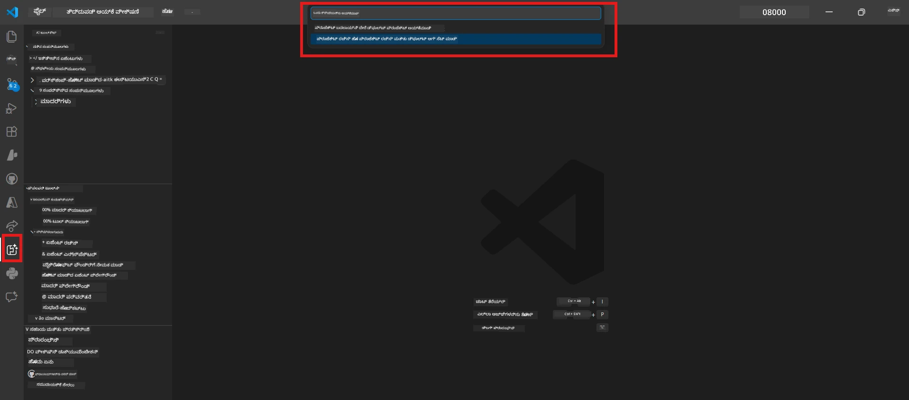
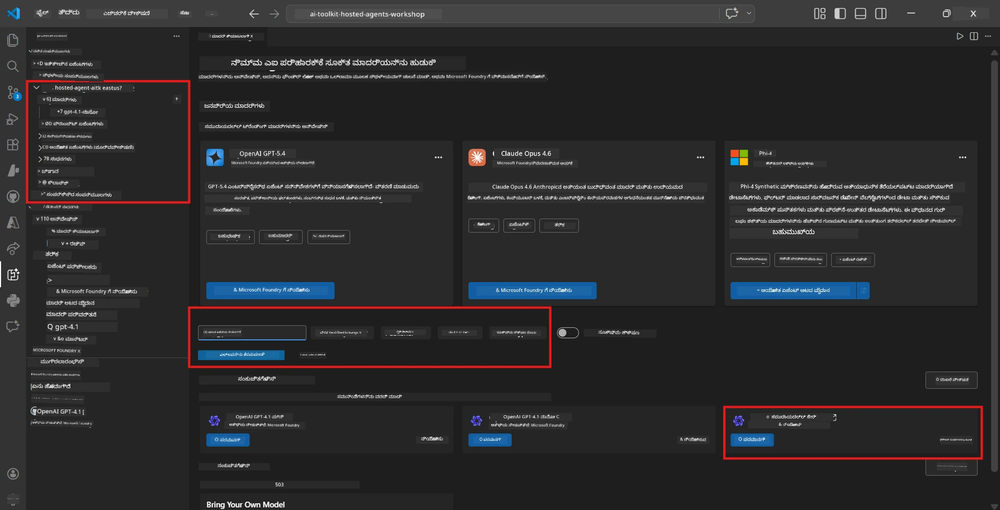
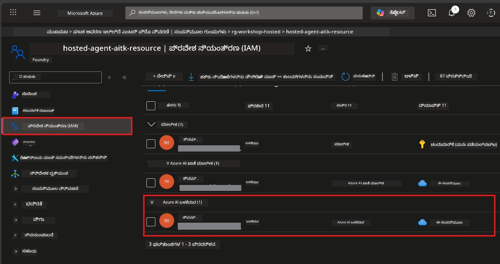

# Module 2 - ಫೌಂಡ್ರೀ ಪ್ರಾಜೆಕ್ಟ್ ರಚಿಸಿ ಮತ್ತು ಮಾದರಿಯನ್ನು ನಿಯೋಜಿಸಿ

ಈ_MODULE_ನಲ್ಲ, ನೀವು Microsoft Foundry ಪ್ರಾಜೆಕ್ಟ್ ಅನ್ನು ರಚಿಸಬಹುದು (ಅಥವಾ ಆಯ್ಕೆ ಮಾಡಬಹುದು) ಮತ್ತು ನಿಮ್ಮ ಏಜೆಂಟ್ ಬಳಸಲಿರುವ ಮಾದರಿಯನ್ನು ನಿಯೋಜಿಸುತ್ತೀರಿ. ಪ್ರತಿಯೊಂದು ಹಂತವೂ ಸ್ಪಷ್ಟವಾಗಿ ಬರೆಯಲ್ಪಟ್ಟಿದೆ - ಅವುಗಳನ್ನು ಕ್ರಮವಾಗಿ ಅನುಸರಿಸಿ.

> ನೀವು ಈಗಾಗಲೇ ನಿಯೋಜಿಸಲಾದ ಮಾದರಿಯೊಂದಿಗೆ Foundry ಪ್ರಾಜೆಕ್ಟ್ ಹೊಂದಿದ್ದರೆ, [Module 3](03-create-hosted-agent.md) ಗೆ ಮುಂದಾಗಿ.

---

## ಹಂತ 1: VS Code ನಿಂದ Foundry ಪ್ರಾಜೆಕ್ಟ್ ರಚಿಸಿ

ನೀವು Microsoft Foundry ವಿಸ್ತರಣೆ ಬಳಸಿ VS Code ತೊರೆದಿಲ್ಲದೆ ಪ್ರಾಜೆಕ್ಟ್ ರಚಿಸುವಿರಿ.

1. **Command Palette** ತೆರೆಯಲು `Ctrl+Shift+P` ಒತ್ತಿ.
2. ಟೈಪ್ ಮಾಡಿ: **Microsoft Foundry: Create Project** ಮತ್ತು ಆಯ್ಕೆಮಾಡಿ.
3. ಒಂದು dropdown ಕಾಣಿಸಿಕೊಳ್ಳುತ್ತದೆ - ನಿಮ್ಮ **Azure subscription** ಪಟ್ಟಿಯಿಂದ ಆಯ್ಕೆ ಮಾಡಿ.
4. ನೀವು **resource group** ಆಯ್ಕೆಮಾಡಲು ಅಥವಾ ಹೊಸದಾಗಿ ಸೃಷ್ಟಿಸಲು ಕೇಳಲಾಗುವುದು:
   - ಹೊಸದಾಗಿ ರಚಿಸಲು: ಹೆಸರು ಟೈಪ್ ಮಾಡಿ (ಉದಾ., `rg-hosted-agents-workshop`) ಮತ್ತು Enter ಒತ್ತಿ.
   - ಇತರಕ್ಕಿಂತ ಹೊಂದಿದ್ದುದನ್ನು ಉಪಯೋಗಿಸಲು: dropdown ನಿಂದ ಆಯ್ಕೆಮಾಡಿ.
5. **ಪ್ರದೇಶ** ಆಯ್ಕೆಮಾಡಿ. **ಗೌರವ:** ನಿರಂತರ ಏಜೆಂಟ್‌ಗಳು ಬೆಂಬಲಿಸುವ ಪ್ರದೇಶವನ್ನು ಆರಿಸಬೇಕು. [ಪ್ರದೇಶ ಲಭ್ಯತೆ](https://learn.microsoft.com/azure/foundry/agents/concepts/hosted-agents#region-availability) ಪರಿಶೀಲಿಸಿ - ಸಾಮಾನ್ಯವಾಗಿ `East US`, `West US 2`, ಅಥವಾ `Sweden Central`.
6. Foundry ಪ್ರಾಜೆಕ್ಟ್ಗೆ **ಹೆಸರು** ನಮೂದಿಸಿ (ಉದಾ., `workshop-agents`).
7. Enter ಒತ್ತಿ ಮತ್ತು ಪ್ರೊವಿಷನಿಂಗ್ ಪೂರ್ಣವಾಗುವವರೆಗೆ ಕಾಯಿರಿ.

> **ಪ್ರೊವಿಷನಿಂಗ್ 2-5 ನಿಮಿಷಗಳು ತೆಗೆದುಕೊಳ್ಳುತ್ತದೆ.** VS Code ಬಾಟಂ-ರೈಟ್ ಕಾರ್ನರ್ ನಲ್ಲಿ ಪ್ರಗತಿ ಸೂಚನೆ ಕಾಣಿಸಿಕೊಳ್ಳುತ್ತದೆ. ಪ್ರೊವಿಷನಿಂಗ್ ಸಮಯದಲ್ಲಿ VS Code ಮುಚ್ಚಬೇಡಿ.

8. ಪೂರ್ಣಗೊಳ್ಳುವಾಗ, **Microsoft Foundry** ಸೈಡ್‌ಬಾರ್ ನಿಮ್ಮ ಹೊಸ ಪ್ರಾಜೆಕ್ಟ್ ಅನ್ನು **Resources** ಅಂಗಳದಲ್ಲಿ ತೋರಿಸುತ್ತದೆ.
9. ಪ್ರಾಜೆಕ್ಟ್ ಹೆಸರನ್ನು ಕ್ಲಿಕ್ ಮಾಡಿ ವಿಸ್ತರಿಸಿ ಮತ್ತು **Models + endpoints** ಮತ್ತು **Agents** ವಿಭಾಗಗಳು ಕಾಣಿಸುವುದನ್ನು ಖಚಿತಪಡಿಸಿಕೊಳ್ಳಿ.



### ಪರ್ಯಾಯ: Foundry ಪೋರ್ಟಲ್ ಮೂಲಕ ರಚನೆ

ನೀವು ಬ್ರೌಸರ್ ಬಳಕೆ ಇಚ್ಛಿಸುವಲ್ಲಿ:

1. [https://ai.azure.com](https://ai.azure.com) ತೆರೆಯಿರಿ ಮತ್ತು ಸೈನ್ ಇನ್ ಆಗಿ.
2. ಹೋಮ್ ಪೇಜ್ ನಲ್ಲಿ **Create project** ಕ್ಲಿಕ್ ಮಾಡಿ.
3. ಪ್ರಾಜೆಕ್ಟ್ ಹೆಸರು ನಮೂದಿಸಿ, ನಿಮ್ಮ ಸಬ್ಸ್ಕ್ರಿಪ್ಷನ್, ರಿಸೋರ್ಸ್ ಗ್ರೂಪ್, ಮತ್ತು ಪ್ರದೇಶ ಆಯ್ಕೆಮಾಡಿ.
4. **Create** ಕ್ಲಿಕ್ ಮಾಡಿ ಮತ್ತು ಪ್ರೊವಿಷನಿಂಗ್ ಮುಗಿಯುವವರೆಗೆ ಕಾಯಿರಿ.
5. ರಚನೆಯಾದ ನಂತರ, VS Code ಗೆ ಹಿಂತಿರುಗಿ - ಫೌಂಡ್ರೀ ಸೈಡ್‌ಬಾರ್ ನಲ್ಲಿ ಪ್ರಾಜೆಕ್ಟ್ ರಿಫ್ರೆಶ್ (refresh ಐಕಾನ್ ಕ್ಲಿಕ್ ಮಾಡಿ) ನಂತರ ತೋರಿಸಿಕೊಳ್ಳುವುದು.

---

## ಹಂತ 2: ಮಾದರಿಯನ್ನು ನಿಯೋಜಿಸಿ

ನಿಮ್ಮ [ನಿಯೋಜಿಸಲಾದ ಏಜೆಂಟ್](https://learn.microsoft.com/azure/foundry/agents/concepts/hosted-agents) ಪ್ರತಿಕ್ರಿಯೆ ರಚಿಸಲು Azure OpenAI ಮಾದರಿಯನ್ನು ಅಗತ್ಯವಿದೆ. ನೀವು ಈಗಲೇ [ಒಂದು ನಿಯೋಜಿಸುವಿರಿ](https://learn.microsoft.com/azure/ai-foundry/openai/how-to/create-resource#deploy-a-model).

1. **Command Palette** ತೆರೆಯಲು `Ctrl+Shift+P` ಒತ್ತಿ.
2. ಟೈಪ್ ಮಾಡಿ: **Microsoft Foundry: Open [Model Catalog](https://learn.microsoft.com/azure/ai-foundry/openai/concepts/models)** ಮತ್ತು ಆಯ್ಕೆಮಾಡಿ.
3. VS Code ನಲ್ಲಿ ಮಾದರಿಯ ಕ್ಯಾಟಾಲಾಗ್ ಸುತ್ತಾಡಿರಿ ಅಥವಾ ಹುಡುಕಾಟ ಪಟೀಲಿ ಬಳಸಿ **gpt-4.1** ಹುಡುಕಿ.
4. **gpt-4.1** ಮಾದರಿ ಕಾರ್ಡ್ (ಅಥವಾ ಕಡಿಮೆ ಖರ್ಚಿನಿಗಾಗಿ `gpt-4.1-mini`) ಮೇಲೆ ಕ್ಲಿಕ್ ಮಾಡಿ.
5. **Deploy** ಕ್ಲಿಕ್ ಮಾಡಿ.


6. ನಿಯೋಜನೆ ಸಂರಚನೆಯಲ್ಲಿ:
   - **Deployment name**: ಡೀಫಾಲ್ಟ್ (ಉದಾ., `gpt-4.1`) ಬಿಡಿ ಅಥವಾ ಕಸ್ಟಮ್ ಹೆಸರು ನಮೂದಿಸಿ. **ಈ ಹೆಸರನ್ನು ನೆನಸಿ** - ನೀವು Module 4 ನಲ್ಲಿ ಇದನ್ನು ಬಳಸಲು ಅಗತ್ಯವಿದೆ.
   - **Target**: **Deploy to Microsoft Foundry** ಆಯ್ಕೆಮಾಡಿ ಮತ್ತು ನೀವು ಈಗ ರಚಿಸಿದ ಪ್ರಾಜೆಕ್ಟ್ ಆರಿಸಿ.
7. **Deploy** ಕ್ಲಿಕ್ ಮಾಡಿ ಮತ್ತು ನಿಯೋಜನೆ ಸಂಪೂರ್ಣವಾಗಲು ಕಾಯಿರಿ (1-3 ನಿಮಿಷ).

### ಮಾದರಿ ಆಯ್ಕೆ

| ಮಾದರಿ | ಉತ್ತಮವಾದ ಬಳಕೆ | ವೆಚ್ಚ | ಟಿಪ್ಪಣಿಗಳು |
|-------|----------------|-------|-------------|
| `gpt-4.1` | ಉನ್ನತ-ಮಟ್ಟದ, ಸೂಕ್ಷ್ಮ ಪ್ರತಿಕ್ರಿಯೆಗಳು | ಹೆಚ್ಚು | ಉತ್ತಮ ಫಲಿತಾಂಶಗಳು, ಅಂತಿಮ ಪರೀಕ್ಷೆಗೆ ಶಿಫಾರಸು |
| `gpt-4.1-mini` | ವೇಗದ ಇತರೆ, ಕಡಿಮೆ ವೆಚ್ಚ | ಕಡಿಮೆ | ಕಾರ್ಯಾಗಾರ ಅಭಿವೃದ್ಧಿ ಮತ್ತು ವೇಗದ ಪರೀಕ್ಷೆಗೆ ಉತ್ತಮ |
| `gpt-4.1-nano` | ದೈಹಿಕ ಶಕ್ತಿಯ ಕಡಿಮೆ ಕಾರ್ಯಗಳು | ಅತಿ ಕಡಿಮೆ | ಅತ್ಯಂತ ವೆಚ್ಚಬದ್ಧ, ನಿರಾಳ ಪ್ರತಿಕ್ರಿಯೆಗಳು |

> **ಈ ಕಾರ್ಯಾಗಾರಕ್ಕೆ ಶಿಫಾರಸು:** ಅಭಿವೃದ್ಧಿ ಮತ್ತು ಪರೀಕ್ಷೆಗೆ `gpt-4.1-mini` ಯನ್ನು ಬಳಸದಿರಿ. ಇದು ವೇಗವಾಗಿ, ಬೆಲೆಯಲ್ಲಿ ಸಿಮಿತವಾಗಿದೆ ಮತ್ತು ಉತ್ತಮ ಫಲಿತಾಂಶ ನೀಡುತ್ತದೆ.

### ಮಾದರಿ ನಿಯೋಜನೆಯ ಪರಿಶೀಲನೆ

1. **Microsoft Foundry** ಸೈಡ್‌ಬಾರ್ ನಲ್ಲಿ ನಿಮ್ಮ ಪ್ರಾಜೆಕ್ಟ್ ವಿಸ್ತರಿಸಿ.
2. **Models + endpoints** (ಅಥವಾ ಸಮಾನ ವಿಭಾಗ) ಅಡಿಯಲ್ಲಿ ನೋಡಿ.
3. ನಿಯೋಜಿಸಲಾದ ಮಾದರಿ (ಉದಾ., `gpt-4.1-mini`) **Succeeded** ಅಥವಾ **Active** ಸ್ಥಿತಿಯನ್ನು ಹೊಂದಿರಬೇಕು.
4. ಮಾದರಿ ನಿಯೋಜನೆಯನ್ನು ಕ್ಲಿಕ್ ಮಾಡಿ ಅದರ ವಿವರಗಳನ್ನು ನೋಡಿ.
5. ಕೆಳಗಿನ ಎರಡು ಮೌಲ್ಯಗಳನ್ನು **ಲೆಕ್ಕಹಾಕಿ** - ನೀವು Module 4 ನಲ್ಲಿ ಅವುಗಳನ್ನು ಅಗತ್ಯಮಾಡಿಕೊಳ್ಳುತ್ತೀರಿ:

   | ಸೆಟ್ಟಿಂಗ್ | ಎಲ್ಲಿಗೆ ಹುಡುಕಬೇಕು | ಉದಾಹರಣೆಯ ಮೌಲ್ಯ |
   |----------|------------------|-------------------|
   | **ಪ್ರಾಜೆಕ್ಟ್ ಎಂಡ್ಪಾಯಿಂಟ್** | Foundry ಸೈಡ್‌ಬಾರ್ ನಲ್ಲಿ ಪ್ರಾಜೆಕ್ಟ್ ಹೆಸರನ್ನು ಕ್ಲಿಕ್ ಮಾಡಿ. ಎಂಡ್ಪಾಯಿಂಟ್ URL ವಿವರ ಫೀಲ್ಡ್ ನಲ್ಲಿ ಕಾಣಿಸುತ್ತದೆ. | `https://<account>.services.ai.azure.com/api/projects/<project>` |
   | **ಮಾದರಿ ನಿಯೋಜನೆ ಹೆಸರು** | ನಿಯೋಜಿಸಲಾದ ಮಾದರಿಯ ಪಕ್ಕದಲ್ಲಿ ತೋರಿಸಲಾಗುತ್ತದೆ. | `gpt-4.1-mini` |

---

## ಹಂತ 3: ಅಗತ್ಯ RBAC ಪಾತ್ರಗಳನ್ನು ನಿಗದಿಪಡಿಸಿ

ಇದು **ಅಗತ್ಯವಾದ ಹಂತಗಳಲ್ಲಿ ಅತ್ಯಂತ ಹೆಚ್ಚು ಮಿಸ್ ಆಗುವ ಹಂತ**. ಸರಿಯಾದ ಪಾತ್ರಗಳಿಲ್ಲದೆ, Module 6 ನಲ್ಲಿ ನಿಯೋಜನೆ ಪರವಾನಗಿ ದೋಷದಿಂದ ವಿಫಲವಾಗುತ್ತದೆ.

### 3.1 ನೀವು Azure AI User ಪಾತ್ರವನ್ನು ನೀಡಿಕೊಳ್ಳಿ

1. ಬ್ರೌಸರ್ ತೆರೆಯಿರಿ ಮತ್ತು [https://portal.azure.com](https://portal.azure.com) ಗೆ ಹೋಗಿ.
2. ಟಾಪ್ ಹುಡುಕಾಟ ಪಟ್ಟಿಯಲ್ಲಿ ನಿಮ್ಮ **Foundry ಪ್ರಾಜೆಕ್ಟ್** ಹೆಸರನ್ನು ಟೈಪ್ ಮಾಡಿ ಮತ್ತು ಫಲಿತಾಂಶಗಳಲ್ಲಿ ಅದನ್ನು ಕ್ಲಿಕ್ ಮಾಡಿ.
   - **ಗೌರವ:** **ಪ್ರಾಜೆಕ್ಟ್** ರಿಸೋರ್ಸ್ (ಟೈಪ್: "Microsoft Foundry project") ಗೆ ನವಿಗೇಟ್ ಮಾಡಿ, ಪೋಷಕರ ಖಾತೆ/ಹಬ್ ರಿಸೋರ್ಸ್ ಅಲ್ಲ.
3. ಪ್ರಾಜೆಕ್ಟ್ ಎಡ ನಾವಿಗೇಶನ್ ನಲ್ಲಿ **Access control (IAM)** ಕ್ಲಿಕ್ ಮಾಡಿ.
4. ಮೇಲು +Add ಬಟನ್ ಒತ್ತಿ → **Add role assignment** ಆಯ್ಕೆಮಾಡಿ.
5. **Role** ಟ್ಯಾಬ್ ನಲ್ಲಿ, [**Azure AI User**](https://learn.microsoft.com/azure/foundry/concepts/rbac-foundry#built-in-roles) ಅನ್ನು ಹುಡುಕಿ ಮತ್ತು ಆಯ್ಕೆಮಾಡಿ. **Next** ಕ್ಲಿಕ್ ಮಾಡಿ.
6. **Members** ಟ್ಯಾಬ್ ನಲ್ಲಿ:
   - **User, group, or service principal** ಆಯ್ಕೆಮಾಡಿ.
   - **+ Select members** ಕ್ಲಿಕ್ ಮಾಡಿ.
   - ನಿಮ್ಮ ಹೆಸರು ಅಥವಾ ಇಮೇಲ್ ಹುಡುಕಿ, ಆಯ್ಕೆ ಮಾಡಿ ಮತ್ತು **Select** ಕ್ಲಿಕ್ ಮಾಡಿ.
7. **Review + assign** ಕ್ಲಿಕ್ ಮಾಡಿ → ಪುನಃ **Review + assign** ಕ್ಲಿಕ್ ಮಾಡಿ ದೃಢೀಕರಿಸಲು.



### 3.2 (ಐಚ್ಛಿಕ) Azure AI Developer ಪಾತ್ರವನ್ನು ನಿಗದಿಪಡಿಸಿ

ನೀವು ಪ್ರಾಜೆಕ್ಟ್ ಒಳಗೆ ಹೆಚ್ಚುವರಿ ಸಂಪನ್ಮೂಲಗಳನ್ನು ಸೃಷ್ಟಿಸುವುದು ಅಥವಾ ನಿಯೋಜನೆಗಳನ್ನು ಕ್ರಮಗತವಾಗಿ ನಿರ್ವಹಿಸುವುದು ಅಗತ್ಯವಿದ್ದರೆ:

1. ಮೇಲಿನ ಹಂತಗಳನ್ನು ಪುನರಾವರ್ತಿಸಿ, ಆದರೆ ಹಂತ 5ರಲ್ಲಿ **Azure AI Developer** ಆಯ್ಕೆಮಾಡಿ.
2. ಇದನ್ನು **Foundry resource (account)** ಮಟ್ಟದಲ್ಲಿ ನಿಗದಿಪಡಿಸಬೇಕು, ಪ್ರಾಜೆಕ್ಟ್ ಮಟ್ಟದಲ್ಲೇ ಅಲ್ಲ.

### 3.3 ನಿಮ್ಮ ಪಾತ್ರ ನಿಗದಿಗಳನ್ನು ಪರಿಶೀಲಿಸಿ

1. **Access control (IAM)** ಪುಟದಲ್ಲಿ, **Role assignments** ಟ್ಯಾಬ್ ಕ್ಲಿಕ್ ಮಾಡಿ.
2. ನಿಮ್ಮ ಹೆಸರನ್ನು ಹುಡುಕಿ.
3. ನೀವು ಕನಿಷ್ಠ **Azure AI User** ಈ ಪ್ರಾಜೆಕ್ಟ್ ವ್ಯಾಪ್ತಿಗೆ ನಿಗದಿಪಡಿಸಲಾಗಿದೆಯೆ ಎಂಬುದನ್ನು ನೋಡಿರಿ.

> **ಏಕೆ ಇದು ಮುಖ್ಯ:** [`Azure AI User`](https://learn.microsoft.com/azure/foundry/concepts/rbac-foundry#built-in-roles) ಪಾತ್ರ `Microsoft.CognitiveServices/accounts/AIServices/agents/write` ಡೇಟಾ ಕ್ರಿಯೆಯನ್ನು ನೀಡುತ್ತದೆ. ಇದಿಲ್ಲದೆ ನಿಯೋಜನೆ ಸಮಯದಲ್ಲಿ ಈ ದೋಷ ಕಾಣಿಸಬಹುದು:
>
> ```
> Error: lacks the required data action 
> Microsoft.CognitiveServices/accounts/AIServices/agents/write 
> to perform POST /api/projects/{projectName}/assistants operation.
> ```
>
> ಹೆಚ್ಚಿನ ವಿವರಗಳಿಗೆ [Module 8 - Troubleshooting](08-troubleshooting.md) ನೋಡಿ.

---

### ಪರಿಶೀಲನಾ ಪಟ್ಟಿಕೆ

- [ ] Foundry ಪ್ರಾಜೆಕ್ಟ್ ಇದೆ ಮತ್ತು VS Code ನ Microsoft Foundry ಸೈಡ್‌ಬಾರ್ ನಲ್ಲಿ ಕಾಣಬಹುದು
- [ ] ಕನಿಷ್ಠ ಒಂದು ಮಾದರಿ ನಿಯೋಜಿಸಲಾಗಿದೆ (ಉದಾ., `gpt-4.1-mini`) ಹಾಗೂ ಸ್ಥಿತಿ **Succeeded**
- [ ] ನೀವು **ಪ್ರಾಜೆಕ್ಟ್ ಎಂಡ್ಪಾಯಿಂಟ್** URL ಮತ್ತು **ಮಾದರಿ ನಿಯೋಜನೆ ಹೆಸರು** ಅನ್ನು ಗಮನದಲ್ಲಿರಿಸಿದ್ದೀರಿ
- [ ] ನೀವು **Azure AI User** ಪಾತ್ರವನ್ನು **ಪ್ರಾಜೆಕ್ಟ್** ಮಟ್ಟದಲ್ಲಿ ನಿಗದಿಪಡಿಸಿದ್ದೀರಿ (Azure Portal → IAM → Role assignments ನಲ್ಲಿ ಪರಿಶೀಲಿಸಿ)
- [ ] ಪ್ರಾಜೆಕ್ಟ್ [ಆಧರಿತ ಪ್ರದೇಶ](https://learn.microsoft.com/azure/foundry/agents/concepts/hosted-agents#region-availability) ಒಳಗಿದೆ

---

**ಹಿಂದಿನ:** [01 - Install Foundry Toolkit](01-install-foundry-toolkit.md) · **ಮುಂದಿನ:** [03 - Create a Hosted Agent →](03-create-hosted-agent.md)

---

<!-- CO-OP TRANSLATOR DISCLAIMER START -->
**ನಿರಾಕರಣೆ**:  
ಈ ದಾಖಲೆಯನ್ನು AI ಭಾಷಾಂತರ ಸೇವೆ [Co-op Translator](https://github.com/Azure/co-op-translator) ಅನ್ನು ಬಳಸಿ ಭಾಷಾಂತರಿಸಲಾಗಿದೆ. ನಾವು ನಿಖರತೆಯತ್ತ ಪ್ರಯತ್ನಿಸಿದರೂ, ಸ್ವಯಂಚಾಲಿತ ಅನುವಾದಗಳಲ್ಲಿ ತಪ್ಪುಗಳು ಅಥವಾ ಅನನುವಾಗಗಳು ಇರಬಹುದು ಎಂಬುದನ್ನು ದಯವಿಟ್ಟು ಗಮನಿಸಿ. ಮೂಲ ಭಾಷೆಯಲ್ಲಿರುವ ಮೂಲ ದಾಖಲೆ ಅಧಿಕಾರಪೂರ್ಣ ಮೂಲವಾಗಿರಬೇಕು. ಆವಶ್ಯಕ ಮಾಹಿತಿಗಾಗಿ ವೃತ್ತಿಪರ ಮಾನವ ಭಾಷಾಂತರವನ್ನು ಶಿಫಾರಸು ಮಾಡಲಾಗುತ್ತದೆ. ಈ ಅನುವಾದದ ಬಳಕೆಯಿಂದ ಉಂಟಾಗುವ ಯಾವುದೇ ತಪ್ಪು理解ಗಳು ಅಥವಾ ಅಪಭ್ರಂಶಗಳಿಗಾಗಿ ನಾವು ಜವಾಬ್ದಾರರಲ್ಲ.
<!-- CO-OP TRANSLATOR DISCLAIMER END -->