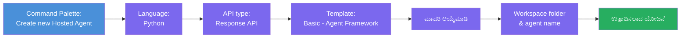
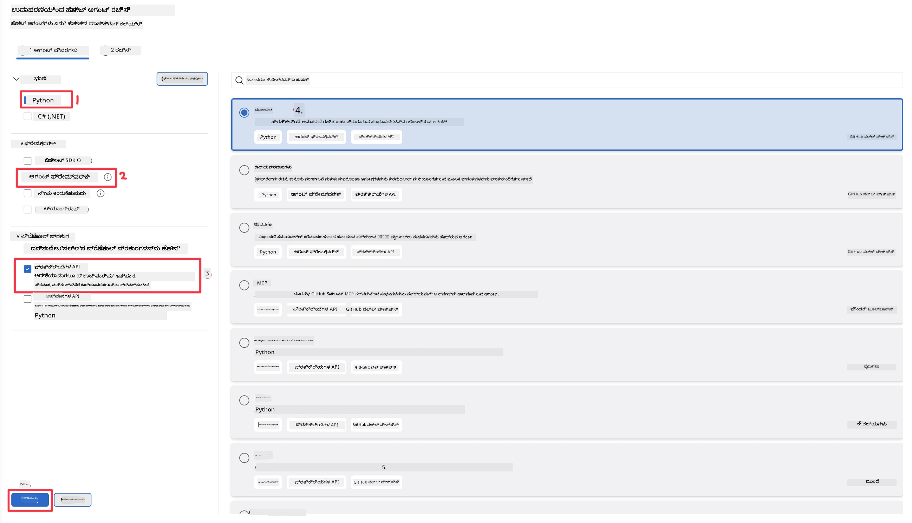
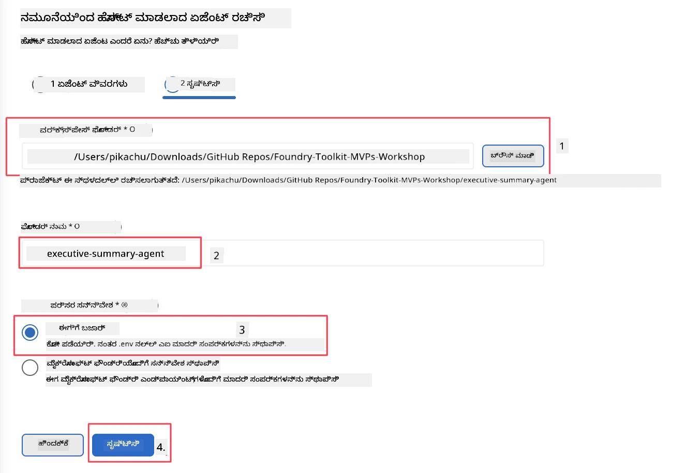

# MODULE 2 - ಹೊಸ ಹೋಸ್ಟ್ ಮಾಡಿದ ಏಜೆಂಟ್ ರಚಿಸಿ

⏱️ ~5 ನಿಮಿಷ

ಈ ಮೊಡ್ಯೂಲ್ ನಲ್ಲಿ, ನೀವು Foundry Toolkit ಅನ್ನು ಬಳಸಿ **ಹೋಸ್ಟ್ ಮಾಡಿದ ಏಜೆಂಟ್ ಪ್ರಾಜೆಕ್ಟ್ scaffold ಮಾಡುತ್ತೀರಿ**. Scaffold ಪೂರ್ಣ ಪ್ರಾಜೆಕ್ಟ್ ರಚನೆಗಳನ್ನು - `agent.yaml`, `main.py`, `Dockerfile`, `requirements.txt`, ಮತ್ತು VS Code ಡೀಬಗ್ ಕಾನ್ಫಿಗರೇಶನ್ - ರಚಿಸುತ್ತದೆ, ಅದರಿಂದ ನೀವು ಏಜೆಂಟ್ ನ ವರ್ತನೆ ಕಸ್ಟಮೈಸ್ ಮಾಡಲು ನಿರಂತರ ಗಮನಹರಿಸಬಹುದು.

> **ಪ್ರಮುಖ ಕಲ್ಪನೆ:** ಈ ಪ್ರಯೋಗಶಾಲೆಯಲ್ಲಿರುವ `agent/` ಫೋಲ್ಡರ್ Foundry Toolkit ರಚಿಸುವ ಒಂದು ಉದಾಹರಣೆ. ನೀವು ಈ ಕಡತಗಳನ್ನು ಶೂನ್ಯದಿಂದ ಬರೆಯುವುದಿಲ್ಲ.

### Scaffold ವಿಸಾರ್ಡ್ ಪ್ರಕ್ರಿಯೆ



---

## ಹಂತ 1: Create Hosted Agent ವಿಸಾರ್ಡ್ ತೆರೆಯಿರಿ

1. **Command Palette** ತೆರೆಯಲು `Ctrl+Shift+P` ಒತ್ತಿರಿ.
2. ಟೈಪ್ ಮಾಡಿ: **Foundry Toolkit: Create new Hosted Agent** ಮತ್ತು ಅದನ್ನು ಆಯ್ಕೆಮಾಡಿ.

> **ಪರ್ಯಾಯ: Foundry ಪೋರ್ಟಲ್ ಮೂಲಕ ರಚಿಸಿ**
> ನೀವು ಬ್ರೌಸರ್ ಪ್ರೀತಿ ಇದ್ದರೆ, ನಿಮ್ಮ ಪ್ರಾಜೆಕ್ಟ್ ಅನ್ನು [https://ai.azure.com](https://ai.azure.com) ನಲ್ಲಿ ರಚಿಸಬಹುದು. ಪ್ರಾಜೆಕ್ಟ್ ಪ್ರೊವಿಷನ್ ಆದ ನಂತರ, VS Code ಗೆ ಮರಳಿ **Foundry Toolkit** ಸೈಡ್‌ಬಾರ್ ಬಳಸಿ ಅದಕ್ಕೆ ಸಂಪರ್ಕ ಹೊಂದಿರಿ.

> **ಪರ್ಯಾಯ:** Foundry Toolkit ಸೈಡ್‌ಬಾರ್ ನಲ್ಲಿ **Hosted Agents (Preview)** ಪಕ್ಕದಲ್ಲಿನ **+** ಐಕಾನ್ ಕ್ಲಿಕ್ ಮಾಡಿ.

## ಹಂತ 2: ಸೆಟ್ಟಿಂಗ್ಸ್ ಆಯ್ಕೆಮಾಡಿ



1. ಎಡ ನೇವಿಗೇಶನ್/ಆಯ್ಕೆಗಳು ವಿಭಾಗದಲ್ಲಿ ಕೆಳಕಂಡವುಗಳನ್ನು ಆಯ್ಕೆಮಾಡಿ:

| ಮೆನು | ಆಯ್ಕೆ | ಟಿಪ್ಪಣಿಗಳು |
|--------|-----------|-------|
| **ಭಾಷೆ** | Python | C# ಸಹ ಬೆಂಬಲಿತವಾಗಿದೆ |
| **ಫ್ರೇಮ್‌ವರ್ಕ್** | Agent Framework | Agent Framework SDK ಬಳಸಿಕೊಂಡು ಸರಲ ಪ್ರಾರಂಭಿಕ ಬಿಂದುವು |
| **API ಪ್ರಕಾರ** | Response API | `POST /responses` - ಸಂವಹನಾತ್ಮಕ, ವೇದಿಕೆ ನಿರ್ವಹಿತ ಇತಿಹಾಸದೊಂದಿಗೆ |
| **ಟೆಂಪ್ಲೇಟ್** | Basic | Agent Framework SDK ಬಳಸಿ ಸರಳ ಆರಂಭಿಕ ಬಿಂದುವು |

2. ಆಯ್ಕೆಮಾಡಿದ ನಂತರ, **Next** ಕ್ಲಿಕ್ ಮಾಡಿ



3. ಮುಂದಿನ ವಿಂಡೋದಲ್ಲಿ ಕೆಳದವುಗಳನ್ನು ಆಯ್ಕೆಮಾಡಿ:

| ಮೆನು | ಆಯ್ಕೆ | ಟಿಪ್ಪಣಿಗಳು |
|--------|-----------|-------|
| **ವರ್ಕ್‌ಸ್ಪೇಸ್ ಫೋಲ್ಡರ್** | ಗುರಿ ಫೋಲ್ಡರ್ ಆಯ್ಕೆಮಾಡಿ | ಉದಾ., `/workspace/Foundry_Toolkit_for_VSCode_Lab/` ಅಥವಾ ಈ ರೆಪೊನ ಒಳಗಿನ ಉಪಫೋಲ್ಡರ್ |
| **ಏಜೆಂಟ್ ಹೆಸರು** | ಹೆಸರು ನಮೂದಿಸಿ | ಉದಾ., `executive-summary-agent` |
| **ಪರಿಸರ ಸೆಟ್‌ಅಪ್** | ಈಗಷ್ಟೇ ಮಾಡಿ ಬಿಟ್ಟುಬಿಡಿ |  |

**create** ಕ್ಲಿಕ್ ಮಾಡಿ ನಮ್ಮ ಏಜೆಂಟ್ ರಚಿಸಲು. ಹೊಸ ಫೋಲ್ಡರ್ ಹೋಸ್ಟ್ ಮಾಡಿದ ಏಜೆಂಟ್ ಹೆಸರಿನಿಂದ ರಚಿಸಲಾಗುತ್ತದೆ.

## ಹಂತ 3: ರಚಿಸಿದ ಪ್ರಾಜೆಕ್ಟ್ ಪರಿಶೀಲನೆ

Scaffold ಆಗುವ ನಂತರ, ಈ ಕಡತಗಳು ಎಕ್ಸ್‌ಪ್ಲೋರರ್ ನಲ್ಲಿ (`Ctrl+Shift+E`) ಕಾಣಿಸುತ್ತಿವೆ ಎಂದು ಪರಿಶೀಲಿಸಿ:

```
📂 my-agent/
├── .env                ← Environment variables (placeholders)
├── .vscode/
│   ├── launch.json     ← Debug config (F5 → run + Agent Inspector)
│   └── tasks.json      ← VS Code task definitions
├── agent.yaml          ← Agent definition (kind: hosted)
├── Dockerfile          ← Container config for deployment
├── main.py             ← Agent entry point (your main code)
└── requirements.txt    ← Python dependencies
```

### ಮುಖ್ಯ ಕಡತಗಳ ವಿವರ

| ಕಡತ | ಉದ್ದೇಶ |
|------|---------|
| `agent.yaml` | ಏಜೆಂಟ್ ಅನ್ನು `kind: hosted` ಎಂದು ಘೋಷಿಸುತ್ತದೆ, ಪರಿಸರ ವ್ಯತ್ಯಾಸಗಳನ್ನು ನಕ್ಷೆ ಮಾಡುತ್ತದೆ, `/responses` ಪ್ರೋಟೋಕಾಲ್‌ನ್ನು ನಿರ್ಧರಿಸುತ್ತದೆ |
| `main.py` | `FoundryChatClient` ರಚಿಸುತ್ತದೆ → ಸೂಚನೆಗಳೊಂದಿಗೆ `Agent` ನಲ್ಲಿ ಮರುಪೆಟ್ಟಿಗೆ ಮಾಡುತ್ತದೆ → ಪೋರ್ಟ್ 8088 ನಲ್ಲಿ `ResponsesHostServer` ಮೂಲಕ ಸೇವೆ ಸಲ್ಲಿಸುತ್ತದೆ |
| `Dockerfile` | `python:3.12-slim` ಬಳಸುತ್ತದೆ, ಅವಲಂಬನೆಗಳನ್ನು ಸ್ಥಾಪಿಸುತ್ತದೆ, 8088 ಪೋರ್ಟ್ ಅನಾವರಣಗೊಳಿಸುತ್ತದೆ, `main.py` ಚಾಲನೆ ಮಾಡುತ್ತದೆ |
| `requirements.txt` | `agent-framework-foundry`, `agent-framework-foundry-hosting`, `mcp`, `debugpy` |

> **ಮಹತ್ವದ:** scaffold ಮಾಡಿದ ಏಜೆಂಟ್ ಫೋಲ್ಡರ್ ಅನ್ನು ನೇರವಾಗಿ VS Code ನಲ್ಲಿ ತೆರೆಯಿರಿ (`agent/` ಫೋಲ್ಡರ್ ಆಗಲೇ ಆದ್ದರಿಂದ) `.vscode/launch.json` ಮತ್ತು `tasks.json` F5 ಡೀಬಗ್ ಮಾಡಲು ಸರಿಯಾಗಿ ಕಾರ್ಯನಿರ್ವಹಿಸುತ್ತದೆ.

---

### ✅ ಪರಿಶೀಲನೆ ಬಿಂದುವು

- [ ] Scaffold ಮಾಡಿದ ಪ್ರಾಜೆಕ್ಟ್ ಎಲ್ಲಾ ನಿರೀಕ್ಷಿತ ಕಡತಗಳ ಜೊತೆ ರಚಿಸಲಾಗಿದೆ
- [ ] `agent.yaml` ನಲ್ಲಿ `kind: hosted` ಮತ್ತು `protocol: responses` ಕಾಣಿಸುತ್ತದೆ
- [ ] `main.py` ನಲ್ಲಿ `Agent`, `FoundryChatClient`, `ResponsesHostServer` ಅನ್ನು ಆಮದು ಮಾಡಿಕೊಳ್ಳಲಾಗಿದೆ
- [ ] ಏಜೆಂಟ್ ಫೋಲ್ಡರ್ VS Code ನಲ್ಲಿ ವರ್ಕ್‌ಸ್ಪೇಸ್ ರೂಟ್ ಆಗಿ ತೆರೆದಿದೆ

---

**ಹಿಂದಿನ:** [01 - ಸೆಟ್‌ಅಪ್](01-setup.md) · **ಮುಂದಿನ:** [03 - ಸಂರಚಿಸಿ & ಕೋಡ್ →](03-configure-and-code.md)

---

<!-- CO-OP TRANSLATOR DISCLAIMER START -->
**ಅಸ್ವೀಕಾರ**:
ಈ ದಸ್ತಾವೇಜು AI ಅನುವಾದ ಸೇವೆ [Co-op Translator](https://github.com/Azure/co-op-translator) ಬಳಸಿ ಅನುವಾದಿಸಲಾಗಿದೆ. ನಾವು ನಿಖರತೆಯನ್ನು ಸಾಧಿಸಲು ಪ್ರಯತ್ನಿಸುತ್ತಿದ್ದರೂ, ದಯವಿಟ್ಟು ಗಮನಿಸಿ, ಸ್ವಯಂಚಾಲಿತ ಅನುವಾದಗಳಲ್ಲಿ ದೋಷಗಳು ಅಥವಾ ಅಸಡ್ಡೆಗಳು ಇರಬಹುದು. ಮೂಲ ಭಾಷೆಯಲ್ಲಿರುವ ಮೂಲ ದಸ್ತಾವೇಜು ಪ್ರಾಮಾಣಿಕ ಮೂಲವೆಂದು ಪರಿಗಣಿಸಬೇಕು. ಪ್ರಮುಖ ಮಾಹಿತಿಗಾಗಿ, ವೃತ್ತಿಪರ ಮಾನವ ಅನುವಾದವನ್ನು ಶಿಫಾರಸು ಮಾಡಲಾಗುತ್ತದೆ. ಈ ಅನುವಾದವನ್ನು ಬಳಸುವ ಮೂಲಕ ಉಂಟಾಗುವ ಯಾವುದೇ ತಪ್ಪು ಅರ್ಥಗಳ ಅಥವಾ ತಪ್ಪು ವ್ಯಾಖ್ಯಾನಗಳ ಬಗ್ಗೆ ನಾವು ಹೊಣೆಗಾರರಲ್ಲ.
<!-- CO-OP TRANSLATOR DISCLAIMER END -->