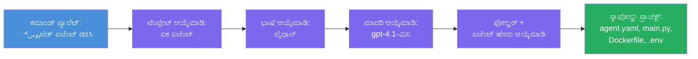

# Module 3 - ಹೊಸ ಹೋಸ್ಟೆಡ್ ಏಜೆಂಟ್ ಅನ್ನು ರಚಿಸಿ (Foundry ವಿಸ್ತರಣೆ ಮೂಲಕ ಸ್ವಯಂಚಾಲಿತವಾಗಿ ಸ್ಫಾರ್ತ್ ಮಾಡಲಾಗಿದೆ)

ಈ ಮೊಡ್ಯೂಲ್‌ನಲ್ಲಿ ನೀವು Microsoft Foundry ವಿಸ್ತರಣೆಯನ್ನು ಬಳಸಿಕೊಂಡು **ಹೊಸ [ಹೋಸ್ಟೆಡ್ ಏಜೆಂಟ್](https://learn.microsoft.com/azure/foundry/agents/concepts/hosted-agents) ಪ್ರಾಜೆಕ್ಟ್ ಅನ್ನು ಸ್ಫಾರ್ತ್ ಮಾಡುತ್ತೀರಿ**. ಈ ವಿಸ್ತರಣೆ ಸಂಪೂರ್ಣ ಪ್ರಾಜೆಕ್ಟ್ ساختವನ್ನು ನಿಮಗಾಗಿ ರಚಿಸುತ್ತದೆ - `agent.yaml`, `main.py`, `Dockerfile`, `requirements.txt`, `.env` ಫೈಲ್ ಮತ್ತು VS ಕೋಡ್ ಡಿಬಗ್ ಸಂರಚನೆ ಸೇರಿಸಿ. ಸ್ಫಾರ್ತ್ ಮಾಡಲಾದ ನಂತರ, ನೀವು ನಿಮ್ಮ ಏಜೆಂಟ್ ನ ನಿರ್ದೇಶನಗಳು, ಉಪಕರಣಗಳು ಮತ್ತು ಸಂರಚನೆಯೊಂದಿಗೆ ಈ ಫೈಲುಗಳನ್ನು ಕಸ್ಟಮೈಸ್ ಮಾಡುತ್ತೀರಿ.

> **ಮುಖ್ಯ ತತ್ವ:** ಈ ಲ್ಯಾಬ್‌ನಲ್ಲಿರುವ `agent/` ಫೋಲ್ಡರ್ ಎಲ್ಲವೂ Foundry ವಿಸ್ತರಣೆ ಈ ಸ್ಫಾರ್ತ್ ಆಜ್ಞೆಯನ್ನು 실행ಿಸುವಾಗ ರಚಿಸುವ ಉದಾಹರಣೆ ಆಗಿದೆ. ನೀವು ಈ ಫೈಲುಗಳನ್ನು ಮೊದಲು ಬರೆಯುವುದಿಲ್ಲ - ವಿಸ್ತರಣೆ ಅವುಗಳನ್ನು ಸೃಷ್ಟಿಸುತ್ತದೆ ಮತ್ತು ನಂತರ ನೀವು ಅವುಗಳನ್ನು ಪರಿಷ್ಕರಿಸುತ್ತೀರಿ.

### ಸ್ಫಾರ್ತ್ ವಿಜಾರ್ಡ್ ಪ್ರಕ್ರಿಯೆ


---

## ಹಂತ 1: Create Hosted Agent ವಿಜಾರ್ಡ್ ಅನ್ನು ತೆರೆಯಿರಿ

1. `Ctrl+Shift+P` ಒತ್ತಿ **ಕಮಾಂಡ್ ಪ್ಯಾಲೆಟ್** ತೆರೆಯಲು.
2. ಟೈಪ್ ಮಾಡಿ: **Microsoft Foundry: Create a New Hosted Agent** ಮತ್ತು ಆಯ್ಕೆಮಾಡಿ.
3. ಹೋಸ್ಟೆಡ್ ಏಜೆಂಟ್ ರಚನೆ ವಿಜಾರ್ಡ್ ತೆರೆಯುತ್ತದೆ.

> **ಮತ್ತೊಂದು ಮಾರ್ಗ:** ನೀವು Microsoft Foundry ಸೈಡ್‌ಬಾರ್‌ನಿಂದ → **Agents** ಅಡ್ಡದಲ್ಲಿ ಇರುವ **+** ಐಕಾನ್ ಕ್ಲಿಕ್ ಮಾಡಿ ಅಥವಾ ರೈಟ್ ಕ್ಲಿಕ್ ಮಾಡಿ ಮತ್ತು **Create New Hosted Agent** ಆಯ್ಕೆಮಾಡಿ ಈ ವಿಜಾರ್ಡ್ ಅನ್ನು ಪ್ರಾಪ್ತಿಸಬಹುದು.

---

## ಹಂತ 2: ನಿಮ್ಮ ಟೆಂಪ್ಲೇಟ್ ಆಯ್ಕೆಮಾಡಿ

ವಿಜಾರ್ಡ್ ನಿಮಗೆ ಟೆಂಪ್ಲೇಟ್ ಆಯ್ಕೆಮಾಡಲು ಕೇಳುತ್ತದೆ. ನೀವು ಈ ಆಯ್ಕೆಗಳು ಕಾಣುತ್ತವೆ:

| ಟೆಂಪ್ಲೇಟ್ | ವರ್ಣನೆ | ಬಳಸಬೇಕಾಗುವ ಸಂದರ್ಭ |
|----------|-------------|-------------|
| **Single Agent** | ತನ್ನ ಸ್ವಂತ ಮಾದರಿ, ನಿರ್ದೇಶನಗಳು ಮತ್ತು ಐಚ್ಛಿಕ ಉಪಕರಣಗಳೊಂದಿಗೆ ಒ ένας ಏಜೆಂಟ್ | ಈ ಕಾರ್ಯಾಗಾರ (ಲ್ಯಾಬ್ 01) |
| **Multi-Agent Workflow** | ಕ್ರಮವಾಗಿ ಸಹಕರಿಸುವ ಹಲವು ಏಜೆಂಟ್‌ಗಳು | ಲ್ಯಾಬ್ 02 |

1. **Single Agent** ಆಯ್ಕೆಮಾಡಿ.
2. **Next** ಕ್ಲಿಕ್ ಮಾಡಿ (ಅಥವಾ ಆಯ್ಕೆ ಸ್ವಯಂಚಾಲಿತವಾಗಿ ಸಾಗುತ್ತದೆ).

---

## ಹಂತ 3: ಪ್ರೋಗ್ರಾಮಿಂಗ್ ಭಾಷೆಯನ್ನು ಆಯ್ಕೆಮಾಡಿ

1. **Python** ಆಯ್ಕೆಮಾಡಿ (ಈ ಕಾರ್ಯಾಗಾರಕ್ಕೆ ಶಿಫಾರಸು ಮಾಡಲಾಗಿದೆ).
2. **Next** ಕ್ಲಿಕ್ ಮಾಡಿ.

> **C# ಸಹ ಬೆಂಬಲಿತವಾಗಿದೆ** ನೀವು .NETನ್ನು ಇಷ್ಟಪಡಿಸಿದರೆ. ಸ್ಫಾರ್ತ್_STRUCTUರೂಪ ಹಾಗೆಯೇ ಆಗಿದ್ದು (`Program.cs` ನ್ನು `main.py` ಬದಲಿಗೆ ಬಳಸುತ್ತದೆ).

---

## ಹಂತ 4: ನಿಮ್ಮ ಮಾದರಿಯನ್ನು ಆಯ್ಕೆಮಾಡಿ

1. ವಿಜಾರ್ಡ್ ನಿಮ್ಮ Foundry ಪ್ರಾಜೆಕ್ಟ್‌ನಲ್ಲಿ ನಿಯೋಜಿಸಿದ ಮಾದರಿಗಳನ್ನು ತೋರಿಸುತ್ತದೆ (Module 2 ರಿಂದ).
2. ನೀವು ನಿಯೋಜಿಸಿದ ಮಾದರಿಯನ್ನು ಆಯ್ಕೆಮಾಡಿ - ಉದಾಹರಣೆಗೆ **gpt-4.1-mini**.
3. **Next** ಕ್ಲಿಕ್ ಮಾಡಿ.

> ನೀವು ಯಾವುದೇ ಮಾದರಿಗಳನ್ನು ಕಾಣದಿದ್ದರೆ, [Module 2](02-create-foundry-project.md) ಗೆ ಹಿಂದಿರುಗಿ ಮೊದಲಿಗೆ ಒಂದು ನಿಯೋಜಿಸಿ.

---

## ಹಂತ 5: ಫೋಲ್ಡರ್ ಸ್ಥಳ ಮತ್ತು ಏಜೆಂಟ್ ಹೆಸರು ಆಯ್ಕೆಮಾಡಿ

1. ಫೈಲ್ ಡೈಲಾಗ್ ತೆರೆಯುತ್ತದೆ - ಪ್ರಾಜೆಕ್ಟ್ ನಿರ್ಮಿಸುವ **ಲಕ್ಷಣೀಯ ಫೋಲ್ಡರ್** ಆಯ್ಕೆಮಾಡಿ. ಈ ಕಾರ್ಯಾಗಾರಕ್ಕೆ:
   - ಹೊಸದಾಗಿ ಪ್ರಾರಂಭಿಸಿದರೆ: ಯಾವುದೇ ಫೋಲ್ಡರ್ ಆಯ್ಕೆಮಾಡಿ (ಉದಾ. `C:\Projects\my-agent`)
   - ಕಾರ್ಯಾಗಾರ ರೆಪೊ ಒಳಗೆ ಕೆಲಸ ಮಾಡುತ್ತಿದ್ದರೆ: `workshop/lab01-single-agent/agent/` ಅಡಿಯಲ್ಲಿ ಹೊಸ ಉಪಫೋಲ್ಡರ್ ರಚಿಸಿ
2. ಹೋಸ್ಟೆಡ್ ಏಜೆಂಟ್‌ಗೆ **ಹೆಸರು** ನಮೂದಿಸಿ (ಉದಾ. `executive-summary-agent` ಅಥವಾ `my-first-agent`).
3. **Create** ಕ್ಲಿಕ್ ಮಾಡಿ (ಅಥವಾ Enter ಒತ್ತಿ).

---

## ಹಂತ 6: ಸ್ಫಾರ್ತ್ ಪೂರ್ಣಗೊಳ್ಳುವವರೆಗೆ ಕಾಯಿರಿ

1. VS ಕೋಡ್ **ಹೊಸ ವಿಂಡೋ** ತೆರೆಯುತ್ತದೆ ಸ್ಫಾರ್ತ್ ಮಾಡಿದ ಪ್ರಾಜೆಕ್ಟ್‌ನೊಂದಿಗೆ.
2. ಪ್ರಾಜೆಕ್ಟ್ ಸಂಪೂರ್ಣವಾಗಿ ಲೋಡ್ ಆಗುವವರೆಗೆ ಕೆಲ ಕ್ಷಣಗಳು ಕಾಯಿರಿ.
3. ನೀವು ಎಕ್ಸ್‌ಪ್ಲೋರ್ ಪ್ಯಾನೆಲ್‌ನಲ್ಲಿ ಕೆಳಗಿನ ಫೈಲುಗಳನ್ನು ನೋಡುತ್ತೀರಿ (`Ctrl+Shift+E`):

```
📂 my-first-agent/
├── .env                ← Environment variables (auto-generated with placeholders)
├── .vscode/
│   └── launch.json     ← Debug configuration (F5 to run + Agent Inspector)
├── agent.yaml          ← Agent definition (kind: hosted)
├── Dockerfile          ← Container configuration for deployment
├── main.py             ← Agent entry point (your main code file)
└── requirements.txt    ← Python dependencies
```

> **ಈ ಲ್ಯಾಬ್‌ನಲ್ಲಿರುವ `agent/` ಫೋಲ್ಡರ್‌ನೊಂದಿಗೆ ಇದೇ ರಚನೆಯಾಗಿದೆ**. Foundry ವಿಸ್ತರಣೆ ಈ ಫೈಲುಗಳನ್ನು ಸ್ವಯಂಚಾಲಿತವಾಗಿ ರಚಿಸುತ್ತದೆ - ನೀವು ಕೈಯಿಂದ ಸೃಷ್ಟಿಸುವ ಅಗತ್ಯವಿಲ್ಲ.

> **ಕಾರ್ಯಾಗಾರ ಟಿಪ್ಪಣಿ:** ಈ ಕಾರ್ಯಾಗಾರ ರೆಪೋದಲ್ಲಿ `.vscode/` ಫೋಲ್ಡರ್ **ವರ್ಕ್‌ಸ್ಪೇಸ್ ರೂಟ್** ನಲ್ಲಿ ಇದೆ (ಪ್ರತಿ ಪ್ರಾಜೆಕ್ಟ್ ಒಳಗೆ ಅಲ್ಲ). ಇದು ಹಂಚಿಕೊಂಡ `launch.json` ಮತ್ತು `tasks.json` ಹೊಂದಿದ್ದು, ಎರಡು ಡಿಬಗ್ ಸಂರಚನೆಗಳನ್ನು ಹೊಂದಿದೆ - **"Lab01 - Single Agent"** ಮತ್ತು **"Lab02 - Multi-Agent"** - ಪ್ರತಿ ಲ್ಯಾಬ್‌ಗೆ ಸರಿಯಾದ `cwd` ಗೆ ಸೂಚಿಸುತ್ತದೆ. ನೀವು F5 ಒತ್ತುವಾಗ, ನೀವು ಕೆಲಸ ಮಾಡುತ್ತಿರುವ ಲ್ಯಾಬ್‌ಗೆ ಹೊಂದುವ ಸಂರಚನೆಯನ್ನು ಡ್ರಾಪ್‌ಡೌನ್‌ದಿಂದ ಆಯ್ಕೆಮಾಡಿ.

---

## ಹಂತ 7: ಪ್ರತಿ ರಚಿಸಲಾದ ಫೈಲನ್ನು ಅರ್ಥಮಾಡಿಕೊಳ್ಳಿ

ವಿಜಾರ್ಡ್ ರಚಿಸಿದ ಪ್ರತಿಯೊಂದು ಫೈಲನ್ನು ಪರಿಶೀಲಿಸಲು ಸಮಯ ವ್ಯಯಿಸಿರಿ. ಅವುಗಳನ್ನು ಅರ್ಥಮಾಡಿಕೊಳ್ಳುವುದು Module 4 (ಕಸ್ಟಮೈಸ್‌ಮೆಂಟ್) ಗೆ ಮುಖ್ಯ.

### 7.1 `agent.yaml` - ಏಜೆಂಟ್ ವಿವರಣೆ

`agent.yaml` ತೆರೆಯಿರಿ. ಇದು ಹೀಗೆ ಕಾಣುತ್ತದೆ:

```yaml
# yaml-language-server: $schema=https://raw.githubusercontent.com/microsoft/AgentSchema/refs/heads/main/schemas/v1.0/ContainerAgent.yaml

kind: hosted
name: my-first-agent
description: >
  A hosted agent deployed to Microsoft Foundry Agent Service.
metadata:
  authors:
    - Microsoft
  tags:
    - Azure AI AgentServer
    - Microsoft Agent Framework
    - Hosted Agent
protocols:
  - protocol: responses
    version: v1
environment_variables:
  - name: AZURE_AI_PROJECT_ENDPOINT
    value: ${PROJECT_ENDPOINT}
  - name: AZURE_AI_MODEL_DEPLOYMENT_NAME
    value: ${MODEL_DEPLOYMENT_NAME}
dockerfile_path: Dockerfile
resources:
  cpu: '0.25'
  memory: 0.5Gi
```

**ಪ್ರಮುಖ ಕ್ಷೇತ್ರಗಳು:**

| ಕ್ಷೇತ್ರ | ಉದ್ದೇಶ |
|-------|---------|
| `kind: hosted` | ಇದು ಹೋಸ್ಟೆಡ್ ಏಜೆಂಟ್ ಆಗಿದ್ದು ([Foundry Agent Service](https://learn.microsoft.com/azure/foundry/agents/overview) ಗೆ ನಿಯೋಜನೆಯ ಗಾಗಿ ಕಂಟೇನರ್ ಆಧಾರಿತ) ಎಂದು ಘೋಷಿಸುತ್ತದೆ |
| `protocols: responses v1` | ಏಜೆಂಟ್ OpenAI-ಸಾಧಾರಣ `/responses` HTTP ಎಂಡ್ಪಾಯಿಂಟ್ ಅನ್ನು ಬಹಿರಂಗಪಡಿಸುತ್ತದೆ |
| `environment_variables` | ನಿಯೋಜನೆ ಸಮಯದಲ್ಲಿ `.env` ಮೌಲ್ಯಗಳನ್ನು ಕಂಟೇನರ್ ವಾತಾವರಣ ಚರಗಳಿಗೆ ಮ್ಯಾಪ್ ಮಾಡುತ್ತದೆ |
| `dockerfile_path` | ಕಂಟೇನರ್ಚಿತ್ರ ನಿರ್ಮಿಸಲು ಬಳಸುವ Dockerfile ಗೆ ಸೂಚಿಸುತ್ತದೆ |
| `resources` | ಕಂಟೇನರ್‌ಗೆ CPU ಮತ್ತು ಮೆಮೊರಿ ಹಂಚಿಕೆ (0.25 CPU, 0.5Gi ಮೆಮೊರಿ) |

### 7.2 `main.py` - ಏಜೆಂಟ್ ಪ್ರವೇಶ ಬಿಂದು

`main.py` ತೆರೆಯಿರಿ. ಇಲ್ಲಿ ನಿಮ್ಮ ಏಜೆಂಟ್ ತರ್ಕ ಇರುವ ಮುಖ್ಯ Python ಫೈಲು. ಸ್ಫಾರ್ತ್ ನಲ್ಲಿ ಇದನ್ನು ಒಳಗೊಂಡಿದೆ:

```python
from agent_framework.azure import AzureAIAgentClient
from azure.ai.agentserver.agentframework import from_agent_framework
from azure.identity.aio import DefaultAzureCredential
```

**ಮುಖ್ಯ ಆಮದುಗಳು:**

| ಆಮದು | ಉದ್ದೇಶ |
|--------|--------|
| `AzureAIAgentClient` | ನಿಮ್ಮ Foundry ಪ್ರಾಜೆಕ್ಟ್‌ಗೆ ಸಂಪರ್ಕ ಕಲ್ಪಿಸಿ `.as_agent()` ಮೂಲಕ ಏಜೆಂಟ್‌ಗಳನ್ನು ರಚಿಸುತ್ತದೆ |
| [`DefaultAzureCredential`](https://learn.microsoft.com/azure/developer/python/sdk/authentication/credential-chains#defaultazurecredential-overview) | ಪ್ರಾಮಾಣೀಕರಣ (Azure CLI, VS ಕೋಡ್ ಸೈನ್-ಇನ್, ನಿರ್ವಹಿತ ಪರಿಚಯ ಅಥವಾ ಸೇವಾ ಪ್ರಾಧಿನಿಧಿ) ನಿರ್ವಹಿಸುತ್ತದೆ |
| `from_agent_framework` | ಏಜೆಂಟ್ ಅನ್ನು HTTP ಸರ್ವರ್ ಆಗಿ ಬ್ಯಾಗ್ ಮಾಡುತ್ತದೆ ಹಾಗೂ `/responses` ಎಂಡ್ಪಾಯಿಂಟ್ ಅನ್ನು ಬಹಿರಂಗಪಡಿಸುತ್ತದೆ |

ಮುಖ್ಯ ಪ್ರಕ್ರಿಯೆ ಹೀಗಿದೆ:
1. ಕ್ರಿಡೆನ್ಶಿಯಲ್ ರಚಿಸಿ → ಕ್ಲಯಿಂಟ್ ರಚಿಸಿ → `.as_agent()` ಕರೆ ಮಾಡಿ ಏಜೆಂಟ್ ಪಡೆಯಿರಿ (ಅಸಿಂಕ್ ಕಾನ್ಟೆಕ್ಸ್ಟ್ ಮ್ಯಾನೇಜರ್) → ಸರ್ವರ್ ಆಗಿ ಮುಚ್ಚಿ → ಚಾಲನೆ ಮಾಡಿ

### 7.3 `Dockerfile` - ಕಂಟೇನರ್ ಚಿತ್ರ

```dockerfile
FROM python:3.14-slim

WORKDIR /app

COPY ./ .

RUN pip install --upgrade pip && \
    if [ -f requirements.txt ]; then \
        pip install -r requirements.txt; \
    else \
        echo "No requirements.txt found" >&2; exit 1; \
    fi

EXPOSE 8088

CMD ["python", "main.py"]
```

**ಮುಖ್ಯ ವಿವರಗಳು:**
- ಆಧಾರ ಚಿತ್ರ olarak `python:3.14-slim` ಬಳಸುತ್ತದೆ.
- ಎಲ್ಲಾ ಪ್ರಾಜೆಕ್ಟ್ ಫೈಲುಗಳನ್ನು `/app` ಗೆ ನಕಲಿಸುತ್ತದೆ.
- `pip` ನ್ನು ಅಪ್‌ಗ್ರೇಡ್ ಮಾಡುತ್ತದೆ, `requirements.txt` ನಿಂದ ಅವಲಂಬನೆಗಳನ್ನು ಇನ್‌ಸ್ಟಾಲ್ ಮಾಡುತ್ತದೆ ಮತ್ತು ಆ ಫೈಲು ಇಲ್ಲದಿದ್ದರೆ ತ್ವರಿತವಾಗಿ ವಿಫಲವಾಗುತ್ತದೆ.
- **ಪೋರ್ಟ್ 8088 ಅನ್ನು ಬಹಿರಂಗಪಡಿಸುತ್ತದೆ** - ಇದು ಹೋಸ್ಟೆಡ್ ಏಜೆಂಟ್ಗಳಿಗೆ ಅಗತ್ಯವಿರುವ ಪೋರ್ಟ್. ಇದನ್ನು ಬದಲಾಯಿಸಬೇಡಿ.
- ಏಜೆಂಟ್ ಅನ್ನು `python main.py` ಮೂಲಕ ಪ್ರಾರಂಭಿಸುತ್ತದೆ.

### 7.4 `requirements.txt` - ಅವಲಂಬನೆಗಳು

```
agent-framework-azure-ai==1.0.0rc3
agent-framework-core==1.0.0rc3
azure-ai-agentserver-agentframework==1.0.0b16
azure-ai-agentserver-core==1.0.0b16
debugpy
agent-dev-cli
```

| ಪ್ಯಾಕೇಜ್ | ಉದ್ದೇಶ |
|---------|---------|
| `agent-framework-azure-ai` | Microsoft Agent Framework ಗಾಗಿ Azure AI ಏಕೀಕರಣ |
| `agent-framework-core` | ಏಜೆಂಟ್‌ಗಳನ್ನು ನಿರ್ಮಿಸಲು ಕೋರ ರನ್‌ಟೈಮ್ (`python-dotenv` ಸಹಿತ) |
| `azure-ai-agentserver-agentframework` | Foundry Agent Service ಗಾಗಿ ಹೋಸ್ಟೆಡ್ ಏಜೆಂಟ್ ಸರ್ವರ್ ರನ್‌ಟೈಮ್ |
| `azure-ai-agentserver-core` | ಕೋರ್ ಏಜೆಂಟ್ ಸರ್ವರ್ ಅವ್ಯಾಖ್ಯಾನಗಳು |
| `debugpy` | Python ಡಿಬಗ್ಗಿಂಗ್ ಬೆಂಬಲ (VS ಕೋಡ್ ನಲ್ಲಿ F5 ಡಿಬಗ್ಗಿಂಗ್ ಅನುವು ಮಾಡಿಕೊಳ್‌ವುದು) |
| `agent-dev-cli` | ಏಜೆಂಟ್‌ಗಳನ್ನು ಪರೀಕ್ಷಿಸಲು ಸ್ಥಳೀಯ ಅಭಿವೃದ್ಧಿ CLI (ಡಿಬಗ್/ರನ್ ಸಂರಚನೆ ಮೂಲಕ ಬಳಸಲಾಗುತ್ತದೆ) |

---

## ಏಜೆಂಟ್ ಪ್ರೋಟೋಕಾಲ್ ಅನ್ನು ಅರ್ಥ ಮಾಡಿಕೊಳ್ಳುವುದು

ಹೋಸ್ಟೆಡ್ ಏಜೆಂಟ್‌ಗಳು **OpenAI Responses API** ಪ್ರೋಟೋಕಾಲ್ ಮೂಲಕ ಸಂವಹನ ಮಾಡುತ್ತವೆ. ಚಾಲನೆಯಲ್ಲಿ (ಸ್ಥಳೀಯ ಅಥವಾ ಕ್ಲೌಡ್‌ನಲ್ಲಿ) ಏಜೆಂಟ್ ಒಬ್ಬೈಕ HTTP ಎಂಡ್ಪಾಯಿಂಟ್ ಅನ್ನು ಬಹಿರಂಗಪಡಿಸುತ್ತದೆ:

```
POST http://localhost:8088/responses
Content-Type: application/json

{
  "input": "Your prompt here",
  "stream": false
}
```

Foundry Agent Service ಈ ಎಂಡ್ಪಾಯಿಂಟ್‌ಗೆ ಬಳಕೆದಾರ ಪ್ರಾಂಪ್ಟ್‌ಗಳನ್ನು ಕಳುಹಿಸಿ ಮತ್ತು ಏಜೆಂಟ್ ಪ್ರತಿಕ್ರಿಯೆಗಳನ್ನು ಪಡೆಯುತ್ತದೆ. ಇದು OpenAI API ಬಳಸುವ ಪ್ರೋಟೋಕಾಲ್ ಆಗಿದ್ದು, ಆದ್ದರಿಂದ ನಿಮ್ಮ ಏಜೆಂಟ್ OpenAI Responses ಫಾರ್ಮಾಟ್ ಮಾತನಾಡುವ ಯಾವುದೇ ಕ್ಲಯಿಂಟ್‌ಗೆ ಹೊಂದಿಕೊಳ್ಳುತ್ತದೆ.

---

### ತಪಾಸಣೆ ಪಟ್ಟಿ

- [ ] ಸ್ಫಾರ್ತ್ ವಿಜಾರ್ಡ್ ಯಶಸ್ವಿಯಾಗಿ ಮುಗಿಯಿತು ಮತ್ತು **ಹೊಸ VS ಕೋಡ್ ವಿಂಡೋ** ತೆರೆಯಿತು
- [ ] ಈ 5 ಫೈಲುಗಳನ್ನೂ ನೋಡುವುದು: `agent.yaml`, `main.py`, `Dockerfile`, `requirements.txt`, `.env`
- [ ] `.vscode/launch.json` ಫೈಲು ಇದೆ (F5 ಡಿಬಗ್ ಮಾಡಲು ಅನುಮತಿಸುತ್ತದೆ - ಈ ಕಾರ್ಯಾಗಾರದಲ್ಲಿ ವರ್ಕ್‌ಸ್ಪೇಸ್ રૂಟ್‌ನಲ್ಲಿ ಲ್ಯಾಬ್-ನಿರ್ದಿಷ್ಟ ಸಂರಚನೆಗಳೊಂದಿಗೆ)
- [ ] ಪ್ರತಿಯೊಂದು ಫೈಲಿನ ಉದ್ದೇಶವನ್ನು ಓದಿ ಅರ್ಥ ಮಾಡಿಕೊಂಡಿರುತ್ತೀರಿ
- [ ] ಪೋರ್ಟ್ `8088` ಅಗತ್ಯವಿದ್ದು `/responses` ಎಂಡ್ಪಾಯಿಂಟ್ ಪ್ರೋಟೋಕಾಲ್ ಆಗಿದೆ ಎಂದು ಅರ್ಥ ಮಾಡಿಕೊಂಡಿರುತ್ತೀರಿ

---

**ಹಿಂದಿನ:** [02 - Foundry ಪ್ರಾಜೆಕ್ಟ್ ರಚನೆ](02-create-foundry-project.md) · **ಮುಂದಿನ:** [04 - ಸಂರಚಿಸಿ & ಕೋಡ್ →](04-configure-and-code.md)

---

<!-- CO-OP TRANSLATOR DISCLAIMER START -->
**ತ್ಯಾಜ್ಯ**:  
ಈ ದಸ್ತಾವೇಜು ಅನ್ನು AI ಅನುವಾದ ಸೇವೆ [Co-op Translator](https://github.com/Azure/co-op-translator) ಬಳಸಿ ಅನುವಾದಿಸಲಾಗಿದೆ. ನಾವು ಸರಿಯಾದ ಅನುವಾದಕ್ಕಾಗಿ ಪ್ರಯತ್ನಿಸುತ್ತಿದ್ದರೂ, ಸ್ವಯಂಚಾಲಿತ ಅನುವಾದಗಳಲ್ಲಿ ದೋಷಗಳು ಅಥವಾ ಅಶುದ್ಧತೆಗಳು ಇರಬಹುದು ಎಂಬುದನ್ನು ದಯವಿಟ್ಟು ಗಮನಿಸಿ. ಮೂಲ ಭಾಷೆಯಲ್ಲಿ ಇರುವ ಮೂಲ ದಸ್ತಾವೇಜ್ ಅನ್ನು ಅಧಿಕೃತ మూలಜ್ಞಾನದಾಗಿ ಪರಿಗಣಿಸಬೇಕು. ಮಹತ್ವದ ಮಾಹಿತಿಗಾಗಿ ವೃತ್ತಿಪರ ಮಾನವ ಅನುವಾದವನ್ನು ಶಿಫಾರಸು ಮಾಡಲಾಗುತ್ತದೆ. ಈ ಅನುವಾದದ ಬಳಕೆಯಿಂದ ಉಂಟಾಗುವ ಯಾವುದೇ ಅರ್ಥಮಾಡಿಕೊಳ್ಳಲು ಅಥವಾ ನಿರ್ವಹಣೆಯಲ್ಲಿ ಉಂಟಾಗುವ ತಪ್ಪುಗಳಿಗಾಗಿ ನಾವು ಹೊಣೆ ಹೊಂದುತ್ತಿಲ್ಲ.
<!-- CO-OP TRANSLATOR DISCLAIMER END -->