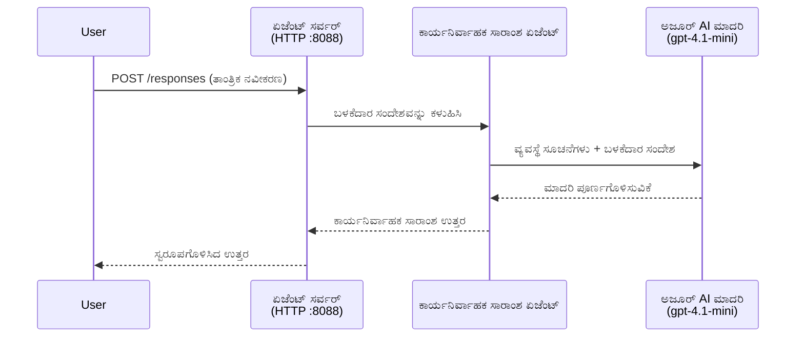
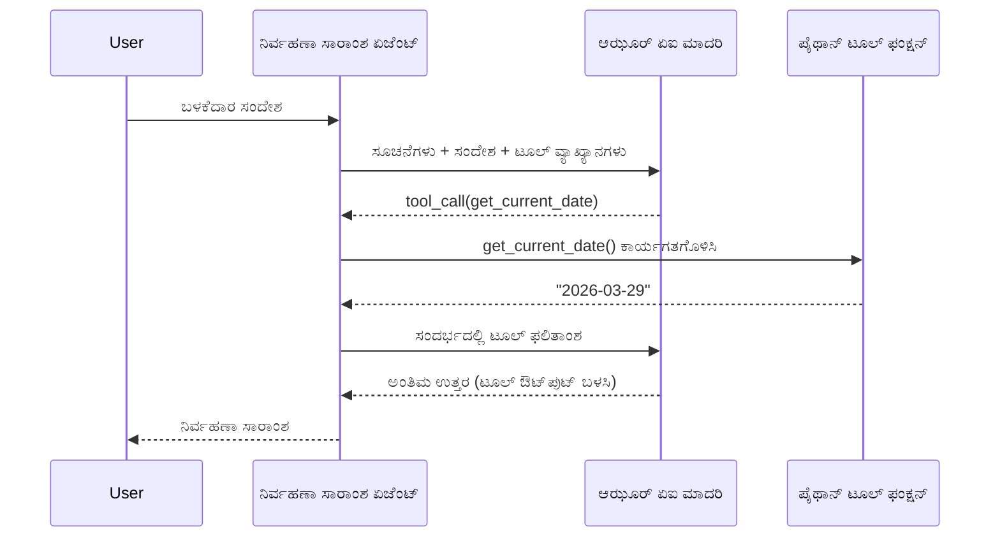

# Module 4 - ಸೂಚನೆಗಳನ್ನು ಸಂರಚಿಸುವುದು, ಪರಿಸರ ಮತ್ತು ಅವಲಂಬನೆಯನ್ನು ಸ್ಥಾಪಿಸುವುದು

ಈ ಮಾಡ್ಯುಲಿನಲ್ಲಿ, ನೀವು Module 3 ನಿಂದ ಸ್ವಯಂ-ಗರಿಷ್ಠಕೃತ ಏಜನ್ಟ್ ಫೈಲ್‌ಗಳನ್ನು ಕಸ್ಟಮೈಸ್ ಮಾಡುತ್ತೀರಿ. ಇಲ್ಲಿ ನೀವು ಸಾಮಾನ್ಯ ಗರಿಷ್ಠಕೃತ ಡಿಫಾಲ್ಟ್ ಅನ್ನು **ನಿಮ್ಮ** ಏಜನ್ಟ್ ಆಗಿ ಪರಿವರ್ತಿಸುತ್ತೀರಿ - ಸೂಚನೆಗಳನ್ನು ಬರೆಯುವುದರಿಂದ ಆರಂಭಿಸಿ, ಪರಿಸರ ವ್ಯತ್ಯಯಗಳನ್ನು ಒದಗಿಸುವುದು, ಐಚ್ಛಿಕವಾಗಿ ಸಾಧನಗಳನ್ನು ಸೇರಿಸುವುದು ಮತ್ತು ಅವಲಂಬನೆಗಳನ್ನು ಇನ್‌ಸ್ಟಾಲ್ ಮಾಡುವುದರ ಮೂಲಕ.

> **ಸ್ಮರಣೆ:** Foundry ವಿಸ್ತರಣೆ ಸ್ವಯಂಚಾಲಿತವಾಗಿ ನಿಮ್ಮ ಯೋಜನೆ ಫೈಲ್‌ಗಳನ್ನು ರಚಿಸಿದೆ. ಈಗ ನೀವು ಅವುಗಳನ್ನು ತಿದ್ದುಪಡಿ ಮಾಡುತ್ತೀರಿ. ಕಸ್ಟಮೈಸ್ ಮಾಡಲಾದ ಏಜನ್ಟ್ ನ ಪೂರ್ಣ ಕೆಲಸದ ಉದಾಹರಣೆಯಿಗಾಗಿ [`agent/`](../../../../../workshop/lab01-single-agent/agent) ಫೋಲ್ಡರ್ ಅನ್ನು ನೋಡಿ.

---

## ಘಟಕಗಳು ಹೇಗೆ ಜೋಡಾಗುತ್ತವೆ

### ವಿನಂತಿ ಜೀವನಚರಿತ್ರೆ (ಒಂದು ಏಜನ್ಟ್)


> **ಸಾಧನಗಳೊಂದಿಗೆ:** ಏಜನ್ಟ್‌ಗೆ ಸಾಧನಗಳು ನೋಂದಾಯಿಸಲ್ಪಟ್ಟಿದೆಯಾದರೆ, ಮಾದರಿ ನೇರ ಪೂರ್ಣಗೊಳ್ಳುವಿಕೆಯ ಬದಲು ಸಾಧನ ಕರೆ ನೀಡಬಹುದು. ಫ್ರೇಮ್‌ವರ್ಕ್ ಸಾಧನವನ್ನು ಸ್ಥಳೀಯವಾಗಿ ಕಾರ್ಯ ಮಾಡಿಸುತ್ತದೆ, ಫಲಿತಾಂಶವನ್ನು ಮಾದರಿಗೆ ಹಿಂತಿರುಗಿಸುತ್ತದೆ ಮತ್ತು ನಂತರ ಮಾದರಿ ಅಂತಿಮ ಪ್ರತಿಕ್ರಿಯೆಯನ್ನು ರಚಿಸುತ್ತದೆ.


---

## ಹಂತ 1: ಪರಿಸರ ವ್ಯತ್ಯಯಗಳನ್ನು ಸಂರಚಿಸಿ

ಗರಿಷ್ಠಕೃತವು `.env` ಫೈಲ್ ಅನ್ನು ಪ್ಲೇಸ್‌ಹೋಲ್ಡರ್ ಮೌಲ್ಯಗಳೊಂದಿಗೆ ರಚಿಸಿತು. Module 2 থেকে ನಿಜವಾದ ಮೌಲ್ಯಗಳನ್ನು ನೀವು ತುಂಬಬೇಕು.

1. ನಿಮ್ಮ ಗರಿಷ್ಠಕೃತ ಯೋಜನೆಯಲ್ಲಿ, **`.env`** ಫೈಲ್ (ಯೋಜನಾ ರೂಟ್‌ನಲ್ಲಿ ಇದೆ) ತೆರೆಯಿರಿ.
2. ನಿಮ್ಮ ನೈಜ Foundry ಯೋಜನಾ ವಿವರಗಳಿಂದ ಪ್ಲೇಸ್‌ಹೋಲ್ಡರ್ ಮೌಲ್ಯಗಳನ್ನು ಬದಲಿಸಿ:

   ```env
   PROJECT_ENDPOINT=https://<your-account>.services.ai.azure.com/api/projects/<your-project>
   MODEL_DEPLOYMENT_NAME=gpt-4.1-mini
   ```

3. ಫೈಲ್ ಅನ್ನು ಉಳಿಸಿ.

### ಈ ಮೌಲ್ಯಗಳನ್ನು ಯೆಲ್ಲಿ ಕಂಡುಹಿಡಿಯುವುದು

| ಮೌಲ್ಯ | ಎಲ್ಲಿ ಕಂಡುಕೊಳ್ಳುವುದು |
|-------|---------------------|
| **ಯೋಜನಾ ಎಂಡ್‌ಪಾಯಿಂಟ್** | VS Code ನಲ್ಲಿ **Microsoft Foundry** ಸೈಡ್‌ಬಾರ್ ತೆರೆಯಿರಿ → ನಿಮ್ಮ ಯೋಜನೆಯನ್ನು ಕ್ಲಿಕ್ ಮಾಡಿ → ಎಂಡ್‌ಪಾಯಿಂಟಿನ URL ವಿವರದಲ್ಲಿ ತೋರಲಿದೆ. ಇದು ಹೀಗೆ ಹೊಳೆಯುತ್ತದೆ `https://<account-name>.services.ai.azure.com/api/projects/<project-name>` |
| **ಮಾದರಿ ನಿಯೋಜನೆ ಹೆಸರು** | Foundry ಸೈಡ್‌ಬಾರ್ ನಲ್ಲಿ, ನಿಮ್ಮ ಯೋಜನೆಯನ್ನು ವಿಸ್ತರಿಸಿ → **ಮಾದರಿಗಳು + ಎಂಡ್‌ಪಾಯಿಂಟ್ಸ್** ಕೆಳಗೆ ನೋಡು → ನಿಯೋಜಿಸಲಾದ ಮಾದರಿಯ ಹೆಸರನ್ನು ಪಟ್ಟಿಯಲ್ಲಿ ಕಾಣಬಹುದು (ಉದಾಹರಣೆಗೆ, `gpt-4.1-mini`) |

> **ರಕ್ಷಣೆ:** `.env` ಫೈಲನ್ನು ವರ್ಸನ್ ನಿಯಂತ್ರಣದಲ್ಲಿ ಎಂದಿಗೂ ಕಮಿಟ್ ಮಾಡಬೇಡಿ. ಇದು ಪೂರ್ವನಿಭಂಧನದಂತೆ `.gitignore` ನಲ್ಲಿ ಸೇರಿಸಲಾಗಿದೆ. ಅದು ಇಲ್ಲದಿದ್ದರೆ, ಸೇರಿಸಿ:
> ```
> .env
> ```

### ಪರಿಸರ ವ್ಯತ್ಯಯಗಳು ಹೇಗೆ ಹರಿದುಹೋಗುತ್ತವೆ

ಮ್ಯಾಪಿಂಗ್ ಸರಪಳಿಯು: `.env` → `main.py` (`os.getenv` ಮೂಲಕ ಓದುತ್ತದೆ) → `agent.yaml` (ಡಿಪ್ಲಾಯ್ ಸಮಯದಲ್ಲಿ ಕಂಟೈನರ್ ಪರಿಸರ ವ್ಯತ್ಯಯಗಳಿಗೆ ನಕ್ಷೆಮಾಡುತ್ತದೆ).

`main.py`ಯಲ್ಲಿ, ಗರಿಷ್ಠಕೃತವು ಈ ಮೌಲ್ಯಗಳನ್ನು ಹೀಗೆ ಓದುವದು:

```python
PROJECT_ENDPOINT = os.getenv("AZURE_AI_PROJECT_ENDPOINT") or os.getenv("PROJECT_ENDPOINT")
MODEL_DEPLOYMENT_NAME = os.getenv("AZURE_AI_MODEL_DEPLOYMENT_NAME", os.getenv("MODEL_DEPLOYMENT_NAME", "gpt-4.1-mini"))
```

ಎರಡೂ `AZURE_AI_PROJECT_ENDPOINT` ಮತ್ತು `PROJECT_ENDPOINT` ಸ್ವೀಕೃತ. (`agent.yaml` ನಲ್ಲಿ `AZURE_AI_*` ಪೂರ್ವಪ್ರತ್ಯಯ ಬಳಕೆ ಆಗುತ್ತದೆ).

---

## ಹಂತ 2: ಏಜನ್ಟ್ ಸೂಚನೆಗಳನ್ನು ಬರೆಯಿರಿ

ಇದು ಅತ್ಯಂತ ಮುಖ್ಯ ಕಸ್ಟಮೈಜೆಶನ್ ಹಂತ. ಸೂಚನೆಗಳು ನಿಮ್ಮ ಏಜನ್ಟ್‌ನ ವ್ಯಕ್ತಿತ್ವ, ವರ್ತನೆ, output ಫಾರ್ಮ್ಯಾಟ್ ಹಾಗೂ ಭದ್ರತಾ ನಿಯಮಗಳನ್ನು ವ್ಯಾಖ್ಯಾನಿಸುತ್ತವೆ.

1. ನಿಮ್ಮ ಯೋಜನೆಯಲ್ಲಿ `main.py` ತೆರೆಯಿರಿ.
2. ಸೂಚನೆ ಗಳ ಉಲ್ಲೇಖವನ್ನು ಹುಡುಕಿ (ಗರಿಷ್ಠಕೃತದಲ್ಲಿ ಡೀಫಾಲ್ಟ್/ಸಾಮಾನ್ಯ ಉಲ್ಲೇಖ ಸೇರಿದೆ).
3. ಅದನ್ನು ವಿವರವಾದ, ರಚನೆಯಾಗಿರುವ ಸೂಚನೆಗಳೊಂದಿಗೆ ಬದಲಾಯಿಸಿ.

### ಉತ್ತಮ ಸೂಚನೆಗಳ ಅಂಶಗಳು

| ഘടകം | ಉದ್ದೇಶ | ಉದಾಹರಣೆ |
|------|--------|----------|
| **ಪಾತ್ರ** | ಏಜನ್ಟ್ ಯಾವುದು ಮತ್ತು ಏನು ಮಾಡುತ್ತದೆ | "ನೀವು ಕಾರ್ಯನಿರ್ವಹಣಾಹೊಂದಿಗಿನ ಸಾರಾಂಶ ಏಜನ್ಟ್" |
| **ಪ್ರೇಕ್ಷಕರು** | ಪ್ರತಿಕ್ರಿಯೆಗಳು ಯಾರಿಗಾಗಿ | "ತಾಂತ್ರಿಕ ಹಿನ್ನೆಲೆ ಹೊಂದದ ಹಿರಿಯ ನಾಯಕರು" |
| **ಇನ್‌ಪುಟ್ ವ್ಯಾಖ್ಯಾನ** | ಯಾವ ರೀತಿಯ ಸೂಚನೆಗಳನ್ನು ನಿರ್ವಹಿಸುತ್ತದೆ | "ತಾಂತ್ರಿಕ ಅಪಘಾತ ವರದಿಗಳು, ಕಾರ್ಯಾಚರಣಾ ನವೀಕರಣಗಳು" |
| **Output ಫಾರ್ಮ್ಯಾಟ್** | ಸ್ಪಷ್ಟವಾದ ಪ್ರತಿಕ್ರಿಯೆಗಳ ರಚನೆ | "ಕಾರ್ಯನಿರ್ವಹಣಾ ಸಾರಾಂಶ: - ಏನು ನಡೆದಿತು: ... - ವ್ಯವಹಾರದ ಪ್ರಭಾವ: ... - ಮುಂದಿನ ಹಂತ: ..." |
| **ನಿಯಮಗಳು** | ನಿಬಂಧನೆಗಳು ಮತ್ತು ನಿರಾಕರಣೆ sharategalu | "ಕೊಡಲಾಗಿರಲಾದ ಮಾಹಿತಿಗಿಂತ ಹೆಚ್ಚಾಗಿರದಂತೆ ಸೇರಿಸಬೇಡಿ" |
| **ಭದ್ರತೆ** | ದುರುಪಯೋಗ ಮತ್ತು ಕಲ್ಪನೆಯನ್ನು ತಡೆಗಟ್ಟುವುದು | "ಇನ್‌ಪುಟ್ ಅಸ್ಪಷ್ಟವಾಗಿದ್ದರೆ, ಸ್ಪಷ್ಟೀಕರಣ ಕೇಳಿರಿ" |
| **ಉದಾಹರಣೆಗಳು** | ವರ್ತನೆ ನಿಗದಿಪಡಿಸಲು ಇನ್‌ಪುಟ್ / ಔಟ್‌ಪುಟ್ ಜೋಡಿಗಳು | ವ್ಯತ್ಯಾಸಗೊಳಿಸಿದ 2-3 ಉದಾಹರಣೆಗಳನ್ನು ಸೇರಿಸಿ |

### ಉದಾಹರಣೆ: ಕಾರ್ಯನಿರ್ವಹಣಾ ಸಾರಾಂಶ ಏಜನ್ಟ್ ಸೂಚನೆಗಳು

ಕಾರ್ಯಾಗಾರದ [`agent/main.py`](../../../../../workshop/lab01-single-agent/agent/main.py) ದಲ್ಲಿ ಬಳಸಲಾದ ಸೂಚನೆಗಳು ಹೀಗಿವೆ:

```python
AGENT_INSTRUCTIONS = """You are an "Explain Like I'm an Executive" agent.

Purpose:
Your job is to translate complex technical or operational information into
clear, concise, and outcome-focused summaries that can be easily understood
by non-technical executives.

Audience:
Senior leaders with limited technical background who care about impact,
risk, and what happens next.

What you must do:
- Rephrase the input so it is understandable to a non-technical audience
- Prioritize clarity, brevity, and outcomes over technical accuracy
- Remove technical jargon, logs, metrics, stack traces, and deep root-cause details
- Translate technical causes into simple cause-and-effect statements
- Explicitly call out business impact
- Always include a clear next step or action
- Maintain a neutral, factual, and calm executive tone
- Do NOT add new facts or speculate beyond the input

Standard Output Structure (always use this wording):

Executive Summary:
- What happened: <plain-language description>
- Business impact: <clear, non-technical impact>
- Next step: <clear action or mitigation>

Rules:
- Keep responses under 100 words
- Do NOT add facts beyond the input
- If input is unclear, ask for clarification
"""
```

4. `main.py`ಯಲ್ಲಿ ಇರುವ ಹಳೆಯ ಸೂಚನೆ ಸ್ಟ್ರಿಂಗ್ ಅನ್ನು ನಿಮ್ಮ ಸ್ವಂತ ಸೂಚನೆಗಳೊಂದಿಗೆ ಬದಲಾಯಿಸಿ.
5. ಫೈಲ್ ಉಳಿಸಿ.

---

## ಹಂತ 3: (ಐಚ್ಛಿಕ) ಕಸ್ಟಮ್ ಸಾಧನಗಳನ್ನು ಸೇರಿಸಿ

ಹೋಸ್ಟ್ ಮಾಡಲಾದ ಏಜನ್ಟ್‌ಗಳು **ಸ್ಥಳೀಯ Python ಕಾರ್ಯಗಳನ್ನು** [ಸಾಧನಗಳು](https://learn.microsoft.com/azure/foundry/agents/concepts/tool-catalog) ಆಗಿ ಕಾರ್ಯಗೊಳಿಸಬಹುದು. ಇದೊಂದು ಕೋಡ್ ಆಧಾರಿತ ಹೋಸ್ಟ್ ಮಾಡಿದ ಏಜನ್ಟ್‌ಗಳ ಪ್ರಮುಖ ಲಾಭ - ನಿಮ್ಮ ಏಜನ್ಟ್ ಯಾವುದೇ ಸರ್ವರ್-ಸೈಡ್ ಲಾಜಿಕನ್ನು ಚಾಲನೆ ಮಾಡಬಹುದು.

### 3.1 ಸಾಧನ ಕಾರ್ಯವನ್ನು ವ್ಯಾಖ್ಯಾನಿಸಿ

`main.py`ಗೆ ಸಾಧನ ಕಾರ್ಯವನ್ನು ಸೇರಿಸಿ:

```python
from agent_framework import tool

@tool
def get_current_date() -> str:
    """Returns the current date in YYYY-MM-DD format."""
    from datetime import date
    return str(date.today())
```

`@tool` ಅಲಂಕಾರಕವು ಮಾನಕ Python ಕಾರ್ಯವನ್ನು ಏಜನ್ಟ್ ಸಾಧನದಾಗಿ ಪರಿವರ್ತಿಸುತ್ತದೆ. ಡಾಕ್ಸ್‌ಟ್ರಿಂಗ್‌ ಸಾಧನದ ವಿವರಣೆಯಾಗಿ ಮಾದರಿಗೆ ಕಾಣಿಸುತ್ತದೆ.

### 3.2 ಏಜನ್ಟ್‌ಗೆ ಸಾಧನವನ್ನು ನೋಂದಾಯಿಸಿ

`.as_agent()` ಸಾಂದರ್ಭದಲ್ಲಿ ಏಜನ್ಟ್ ರಚಿಸುವಾಗ, `tools` ಪರಿಮಾಣದಲ್ಲಿ ಸಾಧನವನ್ನು ಪಾಸ್ ಮಾಡಿ:

```python
async with AzureAIAgentClient(
    project_endpoint=PROJECT_ENDPOINT,
    model_deployment_name=MODEL_DEPLOYMENT_NAME,
    credential=credential,
).as_agent(
    name="my-agent",
    instructions=AGENT_INSTRUCTIONS,
    tools=[get_current_date],
) as agent:
    server = from_agent_framework(agent)
    await server.run_async()
```

### 3.3 ಸಾಧನ ಕರೆದಿರುವ ವಿಧಾನ

1. ಬಳಕೆದಾರನು ಸೂಚನೆಯನ್ನು ಕಳುಹಿಸುತ್ತಾನೆ.
2. ಮಾದರಿ ಸಾಧನ ಬೇಕೆಂಬುದನ್ನು ನಿರ್ಧರಿಸುತ್ತದೆ (ಸೂಚನೆ, ಸೂಚನೆಗಳು, ಸಾಧನ ವಿವರಣೆಗಳ ಆಧಾರದಲ್ಲಿ).
3. ಸಾಧನ ಅಗತ್ಯವಿದ್ದರೆ, ಫ್ರೇಮ್‌ವರ್ಕ್ ನಿಮ್ಮ Python ಕಾರ್ಯವನ್ನು ಸ್ಥಳೀಯವಾಗಿ (ಕಂಟೈನರ್ ಒಳಗೆ) ಕರೆಯುತ್ತದೆ.
4. ಸಾಧನದ ಮರುವರ್ತುಮೂಲಾಗ್ರ ಮಾದರಿಗೆ ಪಠ್ಯವಾಗಿ ಕಳುಹಿಸಲಾಗುತ್ತದೆ.
5. ಮಾದರಿ ಅಂತಿಮ ಪ್ರತಿಕ್ರಿಯೆಯನ್ನು ರಚಿಸುತ್ತದೆ.

> **ಸಾಧನಗಳು ಸರ್ವರ್-ಸೈಡ್ನಲ್ಲಿ ಕಾರ್ಯನಿರ್ವಹಿಸುತ್ತವೆ** - ಅವು ನಿಮ್ಮ ಕಂಟೈನರ್ ಒಳಗೆ ನಡೆಯುತ್ತವೆ, ಬಳಕೆದಾರರ ಬ್ರೌಸರ್ ಅಥವಾ ಮಾದರಿಯಲ್ಲಿ ಅಲ್ಲ. ಇದರಿಂದ ನೀವು ಡೇಟಾಬೇಸುಗಳು, APIಗಳು, ಫೈಲ್ ಸಿಸ್ಟಮ್, ಅಥವಾ ಯಾವುದೇ Python ಲೈಬ್ರರಿಯನ್ನು ಪ್ರವೇಶಿಸಬಹುದು.

---

## ಹಂತ 4: ವರ್ಚುವಲ್ ಪರಿಸರವನ್ನು ರಚಿಸಿ ಮತ್ತು ಸಕ್ರಿಯಗೊಳಿಸಿ

ಅವಲಂಬನೆಗಳನ್ನು ಇನ್‌ಸ್ಟಾಲ್ ಮಾಡಿಸುವ ಮೊದಲು, ಬೇರ್ಪಟ್ಟ Python ಪರಿಸರವನ್ನು ರಚಿಸಿ.

### 4.1 ವರ್ಚುವಲ್ ಪರಿಸರವನ್ನು ರಚಿಸಿ

VS Code ನಲ್ಲಿ ಟರ್ಮಿನಲ್ ತೆರೆಯಿರಿ (`` Ctrl+` ``) ಮತ್ತು ಈ ಆಜ್ಞೆಯನ್ನು ನಿರ್ವಹಿಸಿ:

```powershell
python -m venv .venv
```

ಇದು ನಿಮ್ಮ ಯೋಜನಾ ಡೈರೆಕ್ಟರಿಯಲ್ಲಿ `.venv` ಫೋಲ್ಡರ್ ರಚಿಸುತ್ತದೆ.

### 4.2 ವರ್ಚುವಲ್ ಪರಿಸರವನ್ನು ಸಕ್ರಿಯಗೊಳಿಸಿ

**PowerShell (Windows):**

```powershell
.\.venv\Scripts\Activate.ps1
```

**ಕಮಾಂಡ್ ಪ್ರಾಂಪ್ಟ್ (Windows):**

```cmd
.venv\Scripts\activate.bat
```

**macOS/Linux (Bash):**

```bash
source .venv/bin/activate
```

 ನಿಮ್ಮ ಟರ್ಮಿನಲ್ ಪ್ರಾಂಪ್ಟ್ ಆರಂಭದಲ್ಲಿ `(.venv)` ಕಾಣಿಸಬೇಕು, ಇದು ವರ್ಚುವಲ್ ಪರಿಸರ ಸಾಧಾರಣವಾಗಿದೆ ಎಂದು ಸೂಚಿಸುತ್ತದೆ.

### 4.3 ಅವಲಂಬನೆಗಳನ್ನು ಇನ್‌ಸ್ಟಾಲ್ ಮಾಡಿ

ವರ್ಚುವಲ್ ಪರಿಸರ ಸಕ್ರಿಯಗಿರುವಾಗ ಅಗತ್ಯ ಪ್ಯಾಕೇಜುಗಳನ್ನು ಇನ್‌ಸ್ಟಾಲ್ ಮಾಡಿ:

```powershell
pip install -r requirements.txt
```

ಇದು ಈ ಮಾದರಿಗಳನ್ನು ಇನ್‌ಸ್ಟಾಲ್ ಮಾಡುತ್ತದೆ:

| ಪ್ಯಾಕೇಜ್ | ಉದ್ದೇಶ |
|----------|---------|
| `agent-framework-azure-ai==1.0.0rc3` | [Microsoft Agent Framework](https://learn.microsoft.com/agent-framework/overview/) ಗಾಗಿ Azure AI ಸಮನ್ವಯ |
| `agent-framework-core==1.0.0rc3` | ಏಜನ್ಟ್ ನಿರ್ಮಾಣಕ್ಕಾಗಿ ಕರ್ನಲ್ ರನ್‌ಟೈಮ್ (`python-dotenv` ಸೇರಿದೆ) |
| `azure-ai-agentserver-agentframework==1.0.0b16` | [Foundry Agent Service](https://learn.microsoft.com/azure/foundry/agents/overview) ಗಾಗಿ ಹೋಸ್ಟ್ ಏಜನ್ಟ್ ಸರ್ವರ್ ರನ್‌ಟೈಮ್ |
| `azure-ai-agentserver-core==1.0.0b16` | ಮುಖ್ಯ ಏಜನ್ಟ್ ಸರ್ವರ್ ಅವಸ್ಥರಿಕೆಗಳು |
| `debugpy` | Python ಡಿಬಗ್ ಮಾಡುವುದಕ್ಕೆ (VS Code ನಲ್ಲಿ F5 ಡಿಬಗ್ ಸಕ್ರಿಯಗೊಳಿಸುತ್ತದೆ) |
| `agent-dev-cli` | ಏಜನ್ಟ್‌ಗಳ ಪರೀಕ್ಷೆಗಾಗಿ ಸ್ಥಳೀಯ ಅಭಿವೃದ್ಧಿ CLI |

### 4.4 ತಂಡಸ್ಥಾಪನೆ ಪರಿಶೀಲನೆ

```powershell
pip list | Select-String "agent-framework|agentserver"
```

 ನಿರೀಕ್ಷಿತ ಔಟ್‌ಪುಟ್:
```
agent-framework-azure-ai   1.0.0rc3
agent-framework-core       1.0.0rc3
azure-ai-agentserver-agentframework 1.0.0b16
azure-ai-agentserver-core  1.0.0b16
```

---

## ಹಂತ 5: प्रमाणीಕರಣದನೆ ಪರಿಶೀಲಿಸಿ

ಈ ಏಜನ್ಟ್ [`DefaultAzureCredential`](https://learn.microsoft.com/azure/developer/python/sdk/authentication/credential-chains#defaultazurecredential-overview) ಉಪಯೋಗಿಸುತ್ತದೆ, ಇದು ಈ ಕ್ರಮದಲ್ಲಿ ಹಲವು प्रमಾಣಿಕರಣ ವಿಧಾನಗಳನ್ನು ಯತ್ನಿಸುತ್ತದೆ:

1. **ಪರಿಸರ ವ್ಯತ್ಯಯಗಳು** - `AZURE_CLIENT_ID`, `AZURE_TENANT_ID`, `AZURE_CLIENT_SECRET` (ಸೇವಾ ಪ್ರಾಂಶು)
2. **Azure CLI** - ನಿಮ್ಮ `az login` ಸೆಷನ್ ಅನ್ನು ಸೆರೆಹಿಡಿಯುತ್ತದೆ
3. **VS Code** - ನೀವು VS Code ಗೆ ಸೈನ್ ಇನ್ ಆಗಿರುವ ಖಾತೆಯನ್ನು ಬಳಸುತ್ತದೆ
4. **Managed Identity** - Azure ನಲ್ಲಿ ನಡಿಸಲಾಗುವಾಗ ಉಪಯೋಗಿಸಲಾಗುತ್ತದೆ (ಡಿಪ್ಲಾಯ್ ಸಮಯದಲ್ಲಿ)

### 5.1 ಸ್ಥಳೀಯ ಅಭಿವೃದ್ಧಿಗಾಗಿ ಪರಿಶೀಲನೆ

ಕನಿಷ್ಠ ಒಂದನೂ ಕಾರ್ಯನಿರ್ವಹಿಸಬೇಕು:

**ಆಯ್ಕೆ A: Azure CLI (ಶಿಫಾರಸು)**

```powershell
az account show --query "{name:name, id:id}" --output table
```

ನಿರೀಕ್ಷಿತ: ನಿಮ್ಮ ಚಂದಾದಾರರ ಹೆಸರು ಮತ್ತು ID ತೋರಿಸುತ್ತದೆ.

**ಆಯ್ಕೆ B: VS Code ಸೈನ್-ಇನ್**

1. VS Code ನ ಕೆಳಗಿನ ಎಡಭಾಗದಲ್ಲಿ **Accounts** ಐಕಾನ್ ನೋಡಿ.
2. ನಿಮ್ಮ ಖಾತೆ ಹೆಸರು ನೋಡಿಸಿದರೆ, ನೀವು प्रमाणीಕೃತರಾಗಿದ್ದೀರಿ.
3. ಇಲ್ಲದಿದ್ದರೆ, ಐಕಾನ್ ಕ್ಲಿಕ್ ಮಾಡಿ → **Microsoft Foundry ಬಳಸಲು ಸೈನ್ ಇನ್ ಆಗಿ**.

**ಆಯ್ಕೆ C: ಸೇವಾ ಪ್ರಾಂಶು (CI/CD ಗಾಗಿ)**

```powershell
$env:AZURE_TENANT_ID = "<your-tenant-id>"
$env:AZURE_CLIENT_ID = "<your-client-id>"
$env:AZURE_CLIENT_SECRET = "<your-client-secret>"
```

### 5.2 ಸಾಮಾನ್ಯ 인증 ಸಮಸ್ಯೆ

ನೀವು ಹಲವಾರು Azure ಖಾತೆಗಳಲ್ಲಿ ಸೈನ್ ಇನ್ ಆಗಿರುವರೆ, ಸರಿಯಾದ ಚಂದಾದಾರರ ಆಯ್ಕೆಮಾಡಿಕೊಂಡಿರುವುದನ್ನು ಖಚಿತಪಡಿಸಿಕೊಳ್ಳಿ:

```powershell
az account set --subscription "<your-subscription-id>"
```

---

### ಪರಿಶೀಲನಾ ಪಾಯಿಂಟ್

- [ ] `.env` ಫೈಲ್‌ನಲ್ಲಿ ಮಾನ್ಯವಾದ `PROJECT_ENDPOINT` ಮತ್ತು `MODEL_DEPLOYMENT_NAME` (ಪ್ಲೇಸ್‌ಹೋಲ್ಡರ್ ಅಲ್ಲ)
- [ ] `main.py` ನಲ್ಲಿ ಏಜನ್ಟ್ ಸೂಚನೆಗಳು ಕಸ್ಟಮೈಸ್ ಮಾಡಲಾದವು - ಪಾತ್ರ, ಪ್ರೇಕ್ಷಕರು, output ಫಾರ್ಮ್ಯಾಟ್, ನಿಯಮಗಳು ಮತ್ತು ಭದ್ರತಾ ನಿಯಮಗಳನ್ನಿರುವವು
- [ ] (ಐಚ್ಛಿಕ) ಕಸ್ಟಮ್ ಸಾಧನಗಳು ವ್ಯಾಖ್ಯಾನಗೊಂಡು ನೋಂದಾಯಿಸಲ್ಪಟ್ಟವೆಯ
- [ ] ವರ್ಚುವಲ್ ಪರಿಸರ ರಚಿಸಲಾಗಿದೆ ಮತ್ತು ಸಕ್ರಿಯಗೊಂಡಿದೆ (`(.venv)` ಟರ್ಮಿನಲ್ ಪ್ರಾಂಪ್ಟ್ ನಲ್ಲಿ ಕಾಣಸಿಗುತ್ತದೆ)
- [ ] `pip install -r requirements.txt` ಯಾವುದೇ ತಪ್ಪುಗಳಿಲ್ಲದೆ ಯಶಸ್ವಿಯಾಗಿ ಪೂರ್ಣಗೊಂಡಿದೆ
- [ ] `pip list | Select-String "azure-ai-agentserver"` ಪ್ಯಾಕೇಜ್ ಇನ್‌ಸ್ಟಾಲ್ ಆಗಿದೆಯೆಂದು ತೋರಿಸುತ್ತದೆ
- [ ] प्रमाणीಕರಣ ಮಾನ್ಯವಾಗಿದ್ದು - `az account show` ನಿಮ್ಮ ಚಂದಾದಾರರ ಮಾಹಿತಿಯನ್ನು ತರುತ್ತದೆ ಅಥವಾ ನೀವು VS Code ಗೆ ಸೈನ್ ಇನ್ ಆಗಿದ್ದೀರಿ

---

**ಹಿಂದಿನ:** [03 - ಹೋಸ್ಟ್ ಮಾಡಲಾದ ಏಜನ್ಟ್ ರಚಿಸುವುದು](03-create-hosted-agent.md) · **ಮುಂದಿನ:** [05 - ಸ್ಥಳೀಯವಾಗಿ ಪರೀಕ್ಷಿಸಿ →](05-test-locally.md)

---

<!-- CO-OP TRANSLATOR DISCLAIMER START -->
**ತಿರಸ್ಕರಣೆ**:  
ಈ ದಸ್ತಾವೇಜನ್ನು AI ಅನುವಾದ ಸೇವೆ [Co-op Translator](https://github.com/Azure/co-op-translator) ಬಳಸಿ ಅನುವಾದಿಸಲಾಗಿದೆ. ನಾವು ನಿಖರತೆಗೆ ಪರಿಶ್ರಮಿಸುವರೂ, ಸ್ವಯಂಚಾಲಿತ ಅನುವಾದಗಳಲ್ಲಿ ತಪ್ಪುಗಳು ಅಥವಾ ಅಸತ್ಯತೆಗಳಿರಬಹುದು ಎಂದು ದಯವಿಟ್ಟು ಜಾಗರೂಕವಾಗಿರಿ. ಮೂಲ ಭಾಷೆಯಲ್ಲಿ ಇರುವ ಮೂಲ ದಸ್ತಾವೇಜನ್ನು ಪ್ರಾಧಾನ್ಯ ಮೂಲವಾಗಿ ಪರಿಗಣಿಸಬೇಕು. ಪ್ರಮುಖ ಮಾಹಿತಿಗಾಗಿ, ವೃತ್ತിപರ ಮಾನವ ಅನುವಾದವನ್ನು ಶಿಫಾರಸು ಮಾಡಲಾಗುತ್ತದೆ. ಈ ಅನುವಾದ ಬಳಕೆಯಿಂದ ಉಂಟಾಗುವ ಯಾವುದೇ ತಪ್ಪು ಅವಗಾಹನೆಗಳಿಗೆ ಅಥವಾ ತಪ್ಪಾಗಿ ಅರ್ಥೈಸಿಕೊಳ್ಳುವದಕ್ಕೆ ನಾವು ಹೊಣೆಗಾರರಲ್ಲ.
<!-- CO-OP TRANSLATOR DISCLAIMER END -->