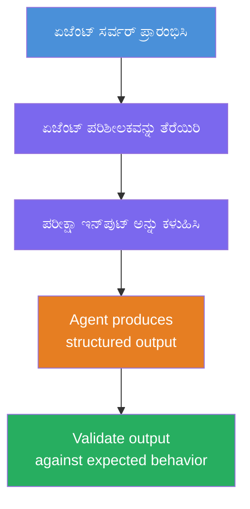
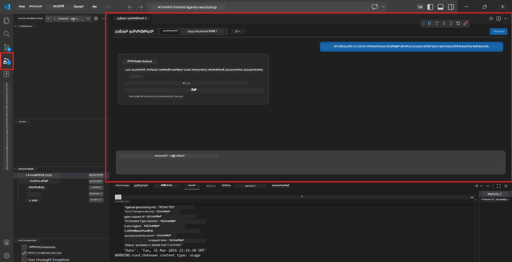
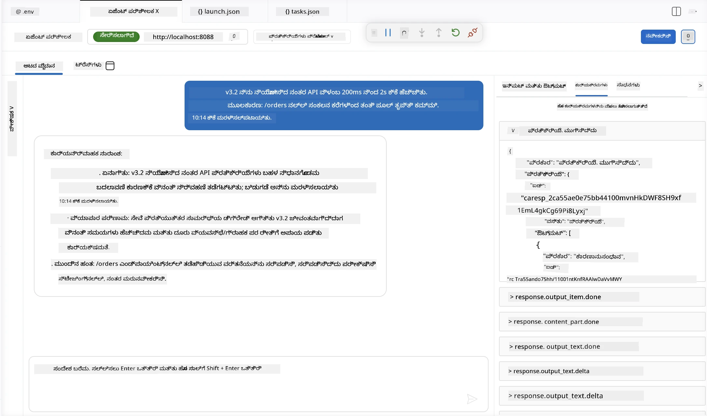

# ಮಡ್ಯೂಲ್ 4 - ಸ್ಥಳೀಯವಾಗಿ ಪರೀಕ್ಷಿಸಿ

⏱️ ~10 ನಿಮಿಷ

ಈ ಮಡ್ಯೂಲ್‌ನಲ್ಲಿ, ನೀವು ನಿಮ್ಮ ಎಜೆంట్ ಅನ್ನು ಸ್ಥಳೀಯವಾಗಿ ನಡೆಸಿ ಅದನ್ನು ಸರಿಯಾಗಿ ಕಾರ್ಯನಿರ್ವಹಿಸುತ್ತಿದೆಯೇ ಎಂದು **ಹ್ಯಾಪಿ-ಪಾತ್ ಫังก್ಷನಲ್ ಟೆಸ್ಟ್ಗಳ** ಮೂಲಕ ಪರಿಶೀಲಿಸುತ್ತೀರಿ. ನೀವು Agent Inspector (ವಿಜುವಲ್ UI) ಅಥವಾ ನೇರ HTTP ಕರೆಗಳನ್ನು ಬಳಸಿಕೊಂಡು ಏಜೆಂಟ್ ರಚಿತ, ಖಚಿತ ಉತ್ತರಗಳನ್ನು ನೀಡುತ್ತದೆ ಎಂದು ಖಚಿತಪಡಿಸಿಕೊಳ್ಳುತ್ತೀರಿ.

### ಸ್ಥಳೀಯ ಪರೀಕ್ಷಾ ಪ್ರಕ್ರಿಯೆ



---

## ಆಯ್ಕೆ 1: F5 ಒತ್ತಿ - Agent Inspector ನೊಂದಿಗೆ ಡಿಬಗ್ ಮಾಡಿ (ಶಿಫಾರಸು ಮಾಡಲಾಗಿದೆ)

### ಡಿಬಗರ್ ಪ್ರಾರಂಭಿಸಿ

1. **executive-summary-agent/** ಫೋಲ್ಡರ್ ಅನ್ನು ನೇರವಾಗಿ VS Code ನಲ್ಲಿ ತೆರೆಯಿರಿ (`File → Open Folder`).
2. **Run and Debug** ಫಲಕವನ್ನು ತೆರೆಯಿರಿ (`Ctrl+Shift+D`).
3. ಡ್ರಾಪ್‌ಡೌನ್‌ನಿಂದ **Debug Local Agent Server** ಆಯ್ಕೆಮಾಡಿ.
4. **F5** ಒತ್ತಿ (ಅಥವಾ ▶ Start Debugging ಕ್ಲಿಕ್ ಮಾಡಿ).

> ⚠️ **ಅತ್ಯಗತ್ಯ: ನಿಮ್ಮ Python Interpreter ಅನ್ನು ಆಯ್ಕೆಮಾಡಿ**
> ನೀವು "ModuleNotFoundError" ಅಥವಾ ಡಿಬಗರ್ ಪ್ರಾರಂಭವಾಗದೇ ಇದ್ದರೆ, VS Code ಗೆ ನಿಮ್ಮ ವರ್ಚುವಲ್ ಎನ್ವಿರಾನ್ಮೆಂಟ್ (virtual environment) ಬಳಸಲು ಹೇಳಬೇಕು:
  > 1. `Ctrl+Shift+P` ಒತ್ತಿ $\rightarrow$ **Python: Select Interpreter** ಟೈಪ್ ಮಾಡಿ.
  > 2. ನಿಮ್ಮ ಪ್ರಾಜೆಕ್ಟಿನ `.venv` ಫೋಲ್ಡರ್ (ಉದಾ: `.\.venv\Scripts\python.exe` ವಿಂಡೋಸ್‌ನಲ್ಲಿ) ಹೊಂದಿರುವ ಇಂಟರ್‌ಪ್ರಿಟರ್ ಆಯ್ಕೆಮಾಡಿ.
  > 3. ಡಿಬಗ್ ಸೆಶನ್ ಅನ್ನು ಮರುಪ್ರಾರಂಭಿಸಿ.
> ಇನ್ನೂ ದೋಷಗಳಿದ್ದರೆ, ನಿಮ್ಮ `tasks.json` ಫೈಲ್ ಅನ್ನು ಕೆಳಗಿನಂತೆ ಕೈಯಾರೆ ನವೀಕರಿಸಿ:
  > 1. `.vscode/tasks.json` ಫೈಲ್‌ನ್ನು ತೆರೆಯಿರಿ
  > 2. `Run Agent/Workflow HTTP Server` ಎಂಬ ಕಮಾಂಡ್‌ಗೆ ಹೋಗಿ
  > 3. ಕಮಾಂಡ್ ಮೌಲ್ಯವನ್ನು ಈ ರೀತಿಯಲ್ಲಿ ನವೀಕರಿಸಿ: `"value": "${workspaceFolder}/.venv/bin/python",`

### ಏನಾಗುತ್ತದೆ

1. HTTP ಸರ್ವರ್ `http://localhost:8088/responses` ನಲ್ಲಿ ಪ್ರಾರಂಭವಾಗುತ್ತದೆ.
2. **Agent Inspector** ಫಲಕ ಸ್ವಯಂಚಾಲಿತವಾಗಿ ತೆರೆಯುತ್ತದೆ - ಪರೀಕ್ಷೆಗೆ ದೃಶ್ಯ ಚాట్ ಇಂಟರ್‌ಫೇಸ್.
3. `main.py` ನಲ್ಲಿ ಬ್ರೇಕ್‌ಪಾಯಿಂಟ್ಗಳು ಸಕ್ರಿಯವಾಗಿರುತ್ತವೆ.

ಟರ್ಮಿನಲ್ ನಲ್ಲಿ ಗಮನಿಸಿ:
```
Starting executive summary hosted agent
Executive agent server running on http://localhost:8088
```

> **Agent Inspector ತೆರೆಯದಿದ್ದರೆ:** `Ctrl+Shift+P` ಒತ್ತಿ → **Foundry Toolkit: Open Agent Inspector** ಆಯ್ಕೆಮಾಡಿ.



> *ಸ್ಕ್ರೀನ್‌ಶಾಟ್‌ ಹಿಂದಿನ ವಿಸ್ತರಣಾ ಆವೃತ್ತಿಯಿಂದ 'AI TOOLKIT' ಬ್ರಾಂಡಿಂಗ್ ತೋರಿಸಬಹುದು.*

---

## ಆಯ್ಕೆ 2: ಟರ್ಮಿನಲ್ ಮೂಲಕ ಪರೀಕ್ಷೆ (ಪರ್ಯಾಯ)

ಒಂದು ಟರ್ಮಿನಲ್‌ನಲ್ಲಿ ಏಜೆಂಟ್ ಪ್ರಾರಂಭಿಸಿ, ಮತ್ತೊಂದು ಟರ್ಮಿನಲ್‌ನಿಂದ ವಿನಂತಿಗಳನ್ನು ಕಳುಹಿಸಿ:

```bash
# ಟರ್ಮಿನಲ್ 1: ಏಜೆಂಟ್ ಪ್ರಾರಂಭಿಸಿ
cd executive-summary-agent/
source .venv/bin/activate
python main.py
```

```bash
# ಟರ್ಮಿನಲ್ 2: ಪರೀಕ್ಷೆ ಕಳುಹಿಸಿ (ಕರ್ಲ್)
curl -sS -X POST http://localhost:8088/responses \
  -H "Content-Type: application/json" \
  -d '{"input": "The API latency increased due to thread pool exhaustion caused by sync calls in v3.2.", "stream": false}'
```

---

## ಸನ್ನಿವೇಶ ಪರೀಕ್ಷೆಗಳು: ಹ್ಯಾಪಿ-ಪಾತ್ ಫังก್ಷನಲ್ ಪರಿಶೀಲನೆ

ಕೆಳಗಿನ **ಎಲ್ಲಾ ಮೂರು** ಸನ್ನಿವೇಶಗಳನ್ನು ನಡೆಸಿ. ಇವು ನಿಮ್ಮ ಏಜನ್ಟ್ ಸೂಕ್ತ, ರಚನಾತ್ಮಕ ಉತ್ಪನ್ನಗಳನ್ನು ನೈಜ ಇನ್ಪುಟ್‌ಗಳಿಗೆ ಉತ್ಪಾದಿಸುತ್ತಿದೆಯೇ ಎಂದು ಪರಿಶೀಲಿಸುತ್ತವೆ.



### ಸನ್ನಿವೇಶ 1: IT ಘಟನೆ - API ಉಪಸಮಯೀಯತೆ ಸ್ಪೈಕ್

**ಇನ್ಪುಟ್:**
```
The API latency increased from 200ms to 2s after deploying v3.2.
Root cause: thread pool starvation from synchronous calls in /orders.
Rolled back at 10:14.
```

**ನಿರೀಕ್ಷಿತ ವರ್ತನೆ:**
- ✅ "Executive Summary" ರಚನೆಯನ್ನು ಅನುಸರಿಸುತ್ತದೆ (ಏನಾಯಿತು / ವ್ಯವಹಾರ ಪರಿಣಾಮ / ಮುಂದಿನ ಹಂತ)
- ✅ ತಾಂತ್ರಿಕ ಜಾರ್ಗನ್ ಇಲ್ಲ (“thread pool”, “/orders”, “v3.2” ಇಲ್ಲ)
- ✅ ಸ್ಪಷ್ಟವಾಗಿ ವ್ಯವಹಾರ ಪರಿಣಾಮವನ್ನು ನಿರೂಪಿಸುತ್ತದೆ (ಉದಾಹರಣೆಗೆ, ಬಳಕೆದಾರರು ವಿಳಂಬ ಅನುಭವಿಸಿದರು)
- ✅ ಮುಂದಿನ ಹಂತವನ್ನು ಹೊಂದಿದೆ (ಉದಾ: ದುರಸ್ತಿ ಜಾರಿಗೊದಿಸಲಾಗಿದೆ, ನಿಗಾದಾರಿಕೆ ಇದೆ)

---

### ಸನ್ನಿವೇಶ 2: ಡೇಟಾ ಪೈಪ್ಲೈನ್ - ETL ವೈಫಲ್ಯ

**ಇನ್ಪುಟ್:**
```
The nightly ETL job failed because the upstream schema changed. APAC dashboards show missing data.
```

**ನಿರೀಕ್ಷಿತ ವರ್ತನೆ:**
- ✅ ಸರಳ ಭಾಷೆಯಲ್ಲಿ ಡೇಟಾ ರಿಫ್ರೆಶ್ ವೈಫಲ್ಯವನ್ನು ಸಾರುತ್ತದೆ
- ✅ APAC ಡ್ಯಾಶ್ಬೋರ್ಡ್ ಪರಿಣಾಮವನ್ನು ಉಲ್ಲೇಖಿಸುತ್ತದೆ
- ✅ ಪರಿಹಾರ ಮುಂದಿನ ಹಂತವನ್ನು ಒಳಗೊಂಡಿದೆ
- ✅ "ETL", "schema" ಅಥವಾ ಇತರ ತಾಂತ್ರಿಕ ಪದಗಳು ಇಲ್ಲ

---

### ಸನ್ನಿವೇಶ 3: ಭದ್ರತೆ - ಬಹಿರಂಗವಾದ ಪ್ರಮಾಣಪತ್ರ

**ಇನ್ಪುಟ್:**
```
Static analysis flagged a hardcoded secret in the repository.
The secret may have been exposed in commit history.
```

**ನಿರೀಕ್ಷಿತ ವರ್ತನೆ:**
- ✅ ಕಾರ್ಯನಿರ್ವಹಣೆಗೆ ಅನುವಾಯಕವಾದ ಭಾಷೆಯಲ್ಲಿ ಪ್ರಮಾಣಪತ್ರ/ಭದ್ರತಾ ಸಮಸ್ಯೆಯನ್ನು ವಿವರಿಸುತ್ತದೆ
- ✅ ಸಂಭವನೀಯ ಅಪಾಯವನ್ನು ಸೂಚಿಸುತ್ತದೆ (ಅನಧಿಕೃತ ಪ್ರವೇಶ)
- ✅ ಪರಿಹಾರ ಕ್ರಮವನ್ನು ಹೇಳುತ್ತದೆ (ಪ್ರಮಾಣಪತ್ರ ರೋಟೇಶನ್, ಆಡಿಟ್)
- ✅ "static analysis", "commit history", "hardcoded" ಮುಂತಾದ ಪದಗಳನ್ನು ಒಳಗೊಂಡಿಲ್ಲ

---

## ಪರಿಶೀಲನೆ критерಿಯಾ

ಪ್ರತಿ ಸನ್ನಿವೇಶಕ್ಕಾಗಿ ಪರಿಶೀಲಿಸಿ:

| # | ಮಾನದಂಡ | ಪಾಸ್ ಸ್ಥಿತಿ |
|---|----------|---------------|
| 1 | **ರಚನೆ** | ಉತ್ತರ "Executive Summary" ಫಾರ್ಮ್ಯಾಟ್‌ನೊಂದಿಗೆ ಎಲ್ಲಾ ಮೂರು ಗುಂಡುಗಳನ್ನೂ ಬಳಸುತ್ತದೆ |
| 2 | **ಸರಳ ಭಾಷೆ** | ಕಾರ್ಯನಿರ್ವಹಿಸುವವರು ಅರ್ಥಮಾಡಿಕೊಳ್ಳದ ತಾಂತ್ರಿಕ ಜಾರ್ಗನ್ ಇಲ್ಲ |
| 3 | **ನಿಖರತೆ** | ಸಾರಾಂಶ ಇನ್ಪುಟ್‌ಗೆ ಹೊಂದಿಕೆಯಾಗಲಿ - ಕೃತಕ ವಿವರಗಳಿರಬಾರದು |
| 4 | **ಸಂಕ್ಷಿಪ್ತತೆ** | ಉತ್ತರ 100 ಪದಗಳೊಳಗೆ ಇರಬೇಕು |
| 5 | **ಮುಂದಿನ ಹಂತ** | ಸ್ಪಷ್ಟ ಕ್ರಮ ಅಥವಾ ತಡೆಮಂತ್ರಣ ಹೇಳಿದೆ |

---

## ಡಿಬಗಿಂಗ್ ಸಲಹೆಗಳು

| ಸಮಸ್ಯೆ | ಪರಿಹಾರ |
|-------|-----|
| ಏಜೆಂಟ್ ಪ್ರಾರಂಭವಾಗುತ್ತಿಲ್ಲ | `.env` ಮೌಲ್ಯಗಳನ್ನು ಪರಿಶೀಲಿಸಿ, venv ಸಕ್ರಿಯವಾಗಿದೆ ಭಾಜಿಸಿ, `pip install -r requirements.txt` ರನ್ ಮಾಡಿ |
| ಖಾಲಿ ಅಥವಾ ಸಾಮಾನ್ಯ ಉತ್ತರ | `main.py` ನಲ್ಲಿ ಸೂಚನೆಯನ್ನು ಪರಿಶೀಲಿಸಿ - output ಫಾರ್ಮ್ಯಾಟ್ ಸೂಚಿಸಲಾಗಿದೆ ಎಂಬುದನ್ನು ಖಚಿತಪಡಿಸಿ |
| ಉತ್ತರದಲ್ಲಿ ಜಾರ್ಗನ್ ಇದೆ | "ತಾಂತ್ರಿಕ ಪದಗಳನ್ನು ಹಟಿಸುವ" ನಿಯಮಗಳನ್ನು ಸೂಚನೆಯಲ್ಲಿ ಬಲಪಡಿಸಿ |
| Agent Inspector ತೆರೆಯದಿದ್ದರೆ | `Ctrl+Shift+P` → **Foundry Toolkit: Open Agent Inspector** |
| ಟರ್ಮಿನಲ್‌ನಲ್ಲಿ ಮಾದರಿ ದೋಷಗಳು | `AZURE_AI_MODEL_DEPLOYMENT_NAME` ಸರಿಯಾಗಿಯೇ ಹೊಂದಿದೆಯೇ ಎಂದು ಪರಿಶೀಲಿಸಿ (ಕೇಸ್-ಸೆನ್ಸಿಟಿವ್) |

---

### ✅ ತಪಾಸಣಾ ಬಿಂದು

- [ ] ಏಜೆಂಟ್ ಸ್ಥಳೀಯವಾಗಿ ದೋಷರಹಿತವಾಗಿ ಪ್ರಾರಂಭವಾಗಬೇಕು
- [ ] Agent Inspector ತೆರೆಯಬೇಕು ಮತ್ತು ಚಾಟ್ ಇಂಟರ್‌ಫೇಸ್ ತೋರಿಸಬೇಕು (F5 ಬಳಸಿ ಇದ್ದರೆ)
- [ ] **ಸನ್ನಿವೇಶ 1** (IT ಘಟನೆ) - ರಚನಾತ್ಮಕ Executive Summary, ಜಾರ್ಗನ್ ಇಲ್ಲ
- [ ] **ಸನ್ನಿವೇಶ 2** (ಡೇಟಾ ಪೈಪ್ಲೈನ್) - ವ್ಯವಹಾರ ಪರಿಣಾಮದೊಂದಿಗೆ ಸಂಬಂಧಿಸಿದ ಸಾರಾಂಶ
- [ ] **ಸನ್ನಿವೇಶ 3** (ಭದ್ರತಾ ಅಲರ್ಟ್) - ಸೂಕ್ತ ಅಪಾಯ ಮಾಹಿತಿ
- [ ] ಎಲ್ಲಾ ಉತ್ತರಗಳು ನಿರ್ದಿಷ್ಟ ಉತ್ಪಾದನೆಯ ರಚನೆ ಅನುಸರಿಸುತ್ತಿವೆ

> **ನಿಮ್ಮ ಉತ್ತರಗಳನ್ನು ಉಳಿಸಿ** (ನಕಲು ಅಥವಾ ಸ್ಕ್ರೀನ್‌ಶಾಟ್ ಮಾಡಿ) - ನೀವು ಅವುಗಳನ್ನು ಮಡ್ಯೂಲ್ 06 ರಲ್ಲಿ ಕ್ಲೌಡ್ ಫಲಿತಾಂಶಗಳೊಂದಿಗೆ ಹೋಲಿಸುವಿರಿ.

---

**ಹಿಂದಿನ:** [03 - Configure & Code](03-configure-and-code.md) · **ಮುಂದಿನ:** [05 - Deploy to Foundry →](05-deploy-to-foundry.md)

---

<!-- CO-OP TRANSLATOR DISCLAIMER START -->
**ಅಸ್ವೀಕಾರ**:
ಈ ದಸ್ತಾವೇಜು AI ಅನುವಾದ ಸೇವೆ [Co-op Translator](https://github.com/Azure/co-op-translator) ಬಳಸಿ ಅನುವಾದಿಸಲಾಗಿದೆ. ನಾವು ನಿಖರತೆಯನ್ನು ಸಾಧಿಸಲು ಪ್ರಯತ್ನಿಸುತ್ತಿದ್ದರೂ, ದಯವಿಟ್ಟು ಗಮನಿಸಿ, ಸ್ವಯಂಚಾಲಿತ ಅನುವಾದಗಳಲ್ಲಿ ದೋಷಗಳು ಅಥವಾ ಅಸಡ್ಡೆಗಳು ಇರಬಹುದು. ಮೂಲ ಭಾಷೆಯಲ್ಲಿರುವ ಮೂಲ ದಸ್ತಾವೇಜು ಪ್ರಾಮಾಣಿಕ ಮೂಲವೆಂದು ಪರಿಗಣಿಸಬೇಕು. ಪ್ರಮುಖ ಮಾಹಿತಿಗಾಗಿ, ವೃತ್ತಿಪರ ಮಾನವ ಅನುವಾದವನ್ನು ಶಿಫಾರಸು ಮಾಡಲಾಗುತ್ತದೆ. ಈ ಅನುವಾದವನ್ನು ಬಳಸುವ ಮೂಲಕ ಉಂಟಾಗುವ ಯಾವುದೇ ತಪ್ಪು ಅರ್ಥಗಳ ಅಥವಾ ತಪ್ಪು ವ್ಯಾಖ್ಯಾನಗಳ ಬಗ್ಗೆ ನಾವು ಹೊಣೆಗಾರರಲ್ಲ.
<!-- CO-OP TRANSLATOR DISCLAIMER END -->