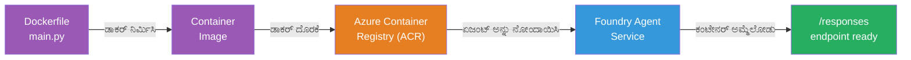
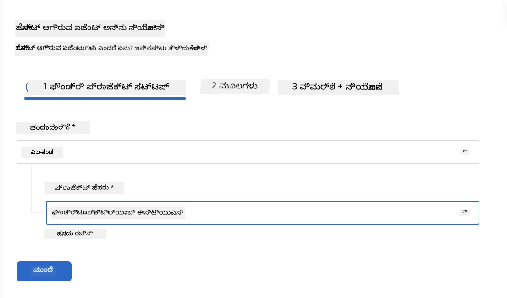
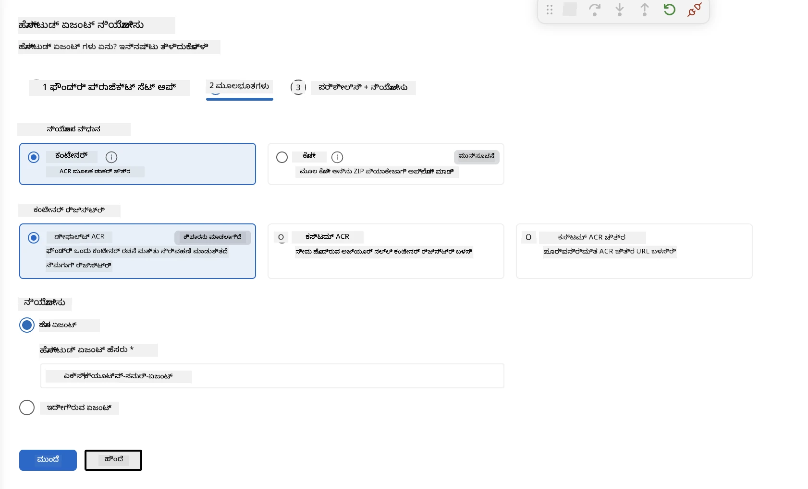
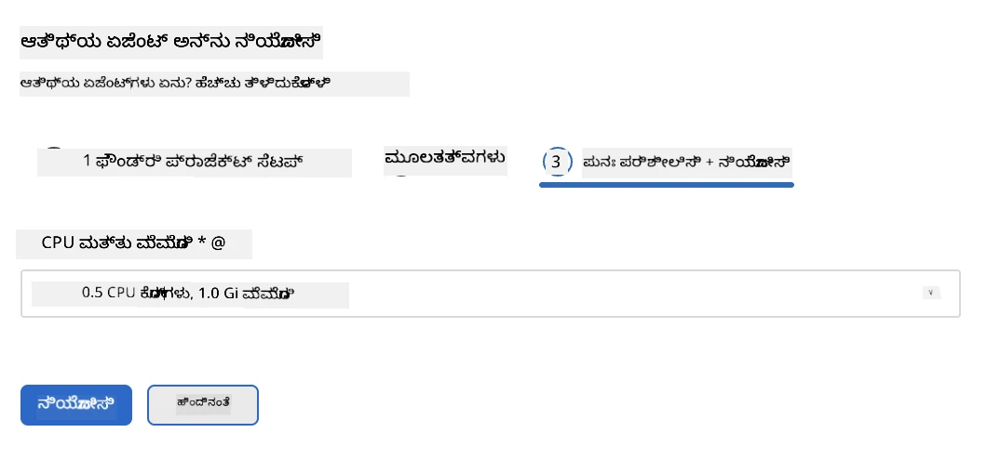
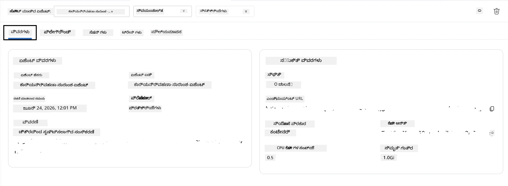

#_MODULE 5 - ಫೌಂಡ್ರಿ ಏಜೆಂಟ್ ಸೇವೆಗೆ ಬಿಡುಗಡೆಯೂ

⏱️ ~10 ನಿಮಿಷಗಳು

> ⚠️ **ಪಥ ಬಿ ಬಳಕೆದಾರರು:** ಈ ಮಾಯೂರು ಫೌಂಡ್ರಿ ಸಬ್‌ಸ್ಕ್ರಿಪ್ಶನ್ ಅಗತ್ಯವಿದೆ. ನೀವು ಫೌಂಡ್ರಿ ಲೋಕಲ್ ಬಳಸುತ್ತಿರುವರೆ, перейдите на [Module 07 - Summary](07-summary.md). ನೀವು ಲೋಕಲ್ ಡೆವಲಪ್‌ಮೆಂಟ್ ಕಾರ್ಯಪ್ರವಾಹವನ್ನು ಯಶಸ್ವಿಯಾಗಿ ಪೂರ್ಣಗೊಳಿಸಿದ್ದೀರಿ!

ಈ ಮಾಯೂರ್ವಲ್ಲಿ, ನೀವು ಲೋಕಲಿಯಾಗಿ ಪರೀಕ್ಷಿಸಲಾದ ನಿಮ್ಮ ಏಜೆಂಟ್ ಅನ್ನು ಮೈಕ್ರೋಸಾಫ್ಟ್ ಫೌಂಡ್ರಿಯಲ್ಲಿ **ಅತಿಥಿ ಏಜೆಂಟ್** ಆಗಿ ಬಿಡುಗಡೆ ಮಾಡುತ್ತೀರಿ. ಬಿಡುಗಡೆ ಒಂದು ಕಂಟೈನರ್ ಇಮೇಜ್ ನ್ನು ಕಟ್ಟಿಸಿ, ಅದನ್ನು ಅಜೂರ್ ಕಂಟೈನರ್ ರೆಜಿಸ್ಟ್ರಿಗೆ ಪ್ರೆಸ್ ಮಾಡುತ್ತದೆ ಮತ್ತು ಫೌಂಡ್ರಿಯ ನಿರ್ವಹಿತ ಮೂಲಸೌಕರ್ಯದಲ್ಲಿ ಏಜೆಂಟ್ನ್ನು ಪ್ರಾರಂಭಿಸುತ್ತದೆ.

### ಬಿಡುಗಡೆಯು ಕಾರ್ಯಪಟ*

---

## ಪೂರ್ವಾಪೇಕ್ಷಣಾ ಪರಿಶೀಲನೆ

ಬಿಡುಗಡೆಯಿಂದ ಮೊದಲು, ಪರಿಶೀಲಿಸಿ:

- [ ] ಏಜೆಂಟ್ ಎಲ್ಲಾ 3 ಲೋಕಲ್ ಸನ್ನಿವೇಶಗಳಲ್ಲಿ ಪಾಸ್ ಆಗಿದೆ [Module 04](04-test-locally.md)
- [ ] ನಿಮ್ಮ ಬಳಿ ಪ್ರಾಜೆಕ್ಟ್ ಮಟ್ಟದಲ್ಲಿ **ಅಜೂರ್ ಎಐ ಬಳಕೆದಾರ** ಪಾತ್ರವಿದೆ ([Module 01, RBAC ಹಂಚಿಕೆ](01-setup.md#deploy-a-model--assign-rbac))
- [ ] ನೀವು VSಕೋಡ್‌ನಲ್ಲಿ ಅಜೂರ್‌ ನಲ್ಲಿ ಸೈನ್ ಇನ್ ಆಗಿರಬೇಕು (ಖಾತೆ ಐಕಾನ್ ನಿಮ್ಮ ಹೆಸರನ್ನು ತೋರುತ್ತದೆ)

---

## ಹಂತ 1: ಬಿಡುಗಡೆಯ ಪ್ರಾರಂಭ

### ಆಯ್ಕೆ A: ಏಜೆಂಟ್ ಇನ್ಸ್ಪೆಕ್ಟರ್ ನೆ ಇಂದ ಬಿಡುಗಡೆ (ಪರಿಗಣನೆ)

ಏಜೆಂಟ್ ಇನ್ಸ್ಪೆಕ್ಟರ್ ತೆರೆಯಲಾಗಿದ್ದರೆ (ಪರೀಕ್ಷೆಯಿಂದ):
1. ಮೇಲ್ಮೈಬಲದ ಬಲ ಭಾಗದಲ್ಲಿರುವ **Deploy** ಬಟನ್ ಮೇಲೆ ಕ್ಲಿಕ್ ಮಾಡಿ (ಮೇಘ ಐಕಾನ್ ↑).

### ಆಯ್ಕೆ B: ಕಮಾಂಡ್ ಪ್ಯಾಲೆಟ್ ನಿಂದ ಬಿಡುಗಡೆ

1. `Ctrl+Shift+P` ಒತ್ತಿ → **Foundry Toolkit: Deploy Hosted Agent** ಆಯ್ಕೆಮಾಡಿ.

---

## ಹಂತ 2: ಬಿಡುಗಡೆ ಸಂರಚನೆ

ವಿಯಾಜರ್ ನಿಮಗೆ ಕೇಳುತ್ತದೆ:

| ಸೂಚನೆ | ಆಯ್ಕೆ |
|--------|-----------|
| **ಸಬ್‌ಸ್ಕ್ರಿಪ್ಶನ್** | ನಿಮ್ಮ ಅಜೂರ್ ಸಬ್‌ಸ್ಕ್ರಿಪ್ಶನ್ |
| **ಗುರುತಿಸಿದ ಪ್ರಾಜೆಕ್ಟ್** | ನಿಮ್ಮ ಫೌಂಡ್ರಿ ಪ್ರಾಜೆಕ್ಟ್ (ಉದಾ., `workshop-agents`) |

ನಿಮ್ಮ ಏಜೆಂಟ್ ನ್ನು ಸಂರಚಿತ ಮಾಡಲು **ಮುಂದಕ್ಕೆ** ಕ್ಲಿಕ್ ಮಾಡಿ.

| ಸೂಚನೆ | ಆಯ್ಕೆ |
|--------|-----------|
| **ಬಿಡುಗಡೆ ವಿಧಾನ** | ಕಂಟೈನರ್ |
| **ಕಂಟೈನರ್ ರೆಜಿಸ್ಟ್ರಿ** | **ಡಿಫಾಲ್ಟ್ ACR** (ಮೈಕ್ರೋಸಾಫ್ಟ್ ಫೌಂಡ್ರಿಯು ನಿಮಗಾಗಿ ಒಂದನ್ನು ರಚಿಸಿ ನಿರ್ವಹಿಸುತ್ತದೆ) |
| **ಬಿಡುಗಡೆ ಬೇಕಾದದ್ದು** | ಹೊಸ ಏಜೆಂಟ್ (ಹೆಸರು, `executive-summary-agent`) |

ನಿಮ್ಮ ಏಜೆಂಟ್ ಅನ್ನು ಪರಿಶೀಲಿಸಿ ಮತ್ತು ಬಿಡುಗಡೆಯಗಾಗಿ **ಮುಂದಕ್ಕೆ** ಕ್ಲಿಕ್ ಮಾಡಿ.

| ಸೂಚನೆ | ಆಯ್ಕೆ |
|--------|-----------|
| **CPU ಮತ್ತು ಮೆಮೊರಿ** | **0.25 CPU ಕೋರ್ ಗಳು, 0.5 Gi ಮೆಮೊರಿ** (ಕಾರ್ಮಿಕ ಶಿಬಿರಕ್ಕೆ ಸಾಕಷ್ಟು) |

---

## ಹಂತ 3: ಬಿಡುಗಡೆ ಮಾಡಿ, ಗಮನ ನೀಡಿ

1. **Deploy** ಮೇಲೆ ಕ್ಲಿಕ್ ಮಾಡಿ.
2. **Output** ಪ್ಯಾನಲ್ ಅನ್ನು ಗಮನಿಸಿ (ಡ್ರಾಪ್-ಡೌನ್ಂನಲ್ಲಿ **Microsoft Foundry** ಆಯ್ಕೆಮಾಡಿ).
3. ಬಿಡುಗಡೆ ಈ ಹಂತಗಳಲ್ಲಿ ನಡೆಯುತ್ತದೆ:
   - **Docker ನಿರ್ಮಾಣ** - ನಿಮ್ಮ Dockerfile ನಿಂದ ಕಂಟೈನರ್ ನಿರ್ಮಿಸುತ್ತದೆ
   - **Docker ಪುಷ್** - ಚಿತ್ರವನ್ನು ACR ಗೆ ಪುಷ್ ಮಾಡುತ್ತದೆ (ಮೊದಲ ಬಾರಿಗೆ 1–3 ನಿಮಿಷ)
   - **ಏಜೆಂಟ್ ನೋಂದಣಿ** - ಫೌಂಡ್ರಿಯಲ್ಲಿ ಅತಿಥಿ ಏಜೆಂಟ್ ಸೃಷ್ಟಿಸುತ್ತದೆ
   - **ಕಂಟೈನರ್ ಪ್ರಾರಂಭ** - ವ್ಯವಸ್ಥೆ ನಿರ್ವಹಿತ ಐಡೆಂಟಿಟಿಯಿಂದ ಪ್ರಾರಂಭಿಸುತ್ತದೆ

4. ಮುಗಿದಾಗ, ಒಂದು ಸೂಚನೆ ಬರುವುದಿದೆ:
   > **my-agent ಯಶಸ್ವಿಯಾಗಿ ಬಿಡುಗಡೆಯಾಯಿತು.** `View logs` `Run agent`

5. ಏಜೆಂಟ್ ಪ್ಲೇಗ್ರೌಂಡ್ ತೆರೆಯಲು **Run agent** ಮೇಲೆ ಕ್ಲಿಕ್ ಮಾಡಿ.

### ಬಿಡುಗಡೆಯ ಸ್ಥಿತಿಗತಿಯ ಮೌಲ್ಯಗಳು

| ಸ್ಥಿತಿ | ಅರ್ಥ |
|--------|---------|
| **ಓಡಿಸುತ್ತಿದೆ** | ಕಂಟೈನರ್ ಸಿದ್ಧ, ಏಜೆಂಟ್ ಪ್ರತಿಕ್ರಿಯಿಸುತ್ತಿದೆ |
| **ಬೇಸರಿಸಿ** | ಕಂಟೈನರ್ ಪ್ರಾರಂಭವಾಗುತ್ತಿದೆ - 30–60 ಸೆಕೆಂಡು ಕಾಯಿರಿ |
| **ನಷ್ಟ** |ಲಾಗ್‌ಗಳನ್ನು ಪರಿಶೀಲಿಸಿ (ಕೆಳಗಿನ ಸಮಸ್ಯೆಗಳ ಪರಿಹಾರ ನೋಡಿ) |

---

## ಸಾಮಾನ್ಯ ಬಿಡುಗಡೆ ದೋಷಗಳು

| ದೋಷ | ಮೂಲ ಕಾರಣ | ಪರಿಹಾರ |
|-------|-----------|-----|
| `agents/write` ಅನುಮತಿ ನಿಷೇಧ | ಪ್ರಾಜೆಕ್ಟ್ ಮಟ್ಟದಲ್ಲಿ **ಅಜೂರ್ ಎಐ ಬಳಕೆದಾರ** ಪಾತ್ರ ಇಲ್ಲ | [Module 01, RBAC ಹಂಚಿಕೆ](01-setup.md#deploy-a-model--assign-rbac) |
| ಡೋಕರ್ ಓಡುತ್ತಿಲ್ಲ | ಡೋಕರ್ ಡೆಸ್ಕ್‌ಟಾಪ್ ಪ್ರಾರಂಭವಿಲ್ಲ | ಡೋಕರ್ ಡೆಸ್ಕ್‌ಟಾಪ್ ಪ್ರಾರಂಭಿಸಿ → `docker info` ಪರಿಶೀಲಿಸಿ |
| ACR ಅನುಮೋದನೆ | ನಿರ್ವಹಿತ ಐಡೆಂಟಿಟಿ ಚಿತ್ರವನ್ನು ಪಡೆಯಲಾಗುವುದಿಲ್ಲ | ನೋಡಿ [Module 08 - ಸಮಸ್ಯೆ ಪರಿಹಾರ](08-troubleshooting.md) |

---

### ✅ ತಪಾಸಣಾ ಪಾಯಿಂಟ್

- [ ] ಯಾವುದೇ ದೋಷವಿಲ್ಲದೆ ಬಿಡುಗಡೆ ಪೂರ್ಣಗೊಂಡಿದೆ
- [ ] ಫೌಂಡ್ರಿ ಸೈಡ್‌ಬಾರಿನಲ್ಲಿ **Hosted Agents (Preview)** ಅಡಿ ಏಜೆಂಟ್ ಕಾಣಿಸಿಕೊಳ್ಳುತ್ತಿದೆ
- [ ] ಕಂಟೈನರ್ ಸ್ಥಿತಿ **ಓಡಿಸುತ್ತಿದೆ** ತೋರಿಸುತ್ತದೆ
- [ ] ಏಜೆಂಟ್ ಪ್ಲೇಗ್ರೌಂಡ್ ಟ್ಯಾಬ್ ತೆರೆಯಲ್ಪಟ್ಟಿದ್ದು ಏಜೆಂಟ್ ವಿವರಗಳು ಮತ್ತು ಎಂಡ್‌ಪಾಯಿಂಟ್ URL ತೋರಿಸುತ್ತದೆ

---

**ಹಿಂದಿನ:** [04 - ಲೋಕಲಾಗಿ ಪರೀಕ್ಷೆ](04-test-locally.md) · **ಮುಂದಿನ:** [06 - ಪ್ಲೇಗ್ರೌಂಡ್‌ನಲ್ಲಿ ಪರಿಶೀಲನೆ →](06-verify-in-playground.md)

---

<!-- CO-OP TRANSLATOR DISCLAIMER START -->
**ಅಸ್ವೀಕಾರ**:
ಈ ದಸ್ತಾವೇಜು AI ಅನುವಾದ ಸೇವೆ [Co-op Translator](https://github.com/Azure/co-op-translator) ಬಳಸಿ ಅನುವಾದಿಸಲಾಗಿದೆ. ನಾವು ನಿಖರತೆಯನ್ನು ಸಾಧಿಸಲು ಪ್ರಯತ್ನಿಸುತ್ತಿದ್ದರೂ, ದಯವಿಟ್ಟು ಗಮನಿಸಿ, ಸ್ವಯಂಚಾಲಿತ ಅನುವಾದಗಳಲ್ಲಿ ದೋಷಗಳು ಅಥವಾ ಅಸಡ್ಡೆಗಳು ಇರಬಹುದು. ಮೂಲ ಭಾಷೆಯಲ್ಲಿರುವ ಮೂಲ ದಸ್ತಾವೇಜು ಪ್ರಾಮಾಣಿಕ ಮೂಲವೆಂದು ಪರಿಗಣಿಸಬೇಕು. ಪ್ರಮುಖ ಮಾಹಿತಿಗಾಗಿ, ವೃತ್ತಿಪರ ಮಾನವ ಅನುವಾದವನ್ನು ಶಿಫಾರಸು ಮಾಡಲಾಗುತ್ತದೆ. ಈ ಅನುವಾದವನ್ನು ಬಳಸುವ ಮೂಲಕ ಉಂಟಾಗುವ ಯಾವುದೇ ತಪ್ಪು ಅರ್ಥಗಳ ಅಥವಾ ತಪ್ಪು ವ್ಯಾಖ್ಯಾನಗಳ ಬಗ್ಗೆ ನಾವು ಹೊಣೆಗಾರರಲ್ಲ.
<!-- CO-OP TRANSLATOR DISCLAIMER END -->