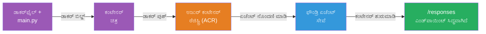
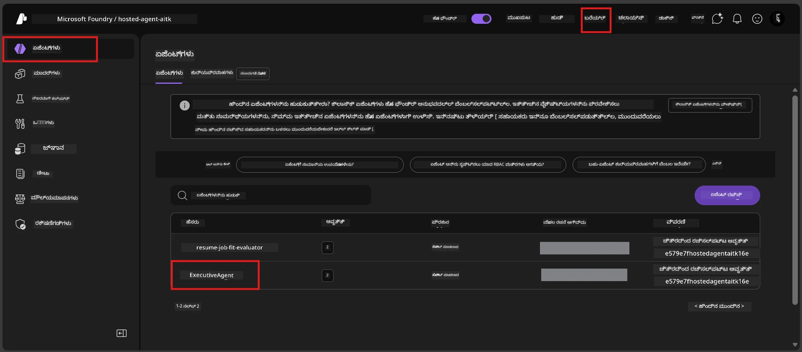

# Module 6 - ಫೌಂಡ್ರಿ ಏಜೆಂಟ್ ಸೇವೆಗೆ ನಿಯೋಜಿಸುವುದು

ಈ ಮಾಡ್ಯೂಲ್ನಲ್ಲಿ, ನೀವು ನಿಮ್ಮ ಸ್ಥಳೀಯವಾಗಿ ಪರೀಕ್ಷಿಸಿದ ಏಜೆಂಟ್ ಅನ್ನು Microsoft Foundryಗೆ [**ಹೋಸ್ಟ್ ಮಾಡಲಾದ ಏಜೆಂಟ್**](https://learn.microsoft.com/azure/foundry/agents/concepts/hosted-agents) ಆಗಿ ನಿಯೋಜಿಸುತ್ತೀರಿ. ನಿಯೋಜನೆ ಪ್ರಕ್ರಿಯೆಯು ನಿಮ್ಮ ಪ್ರಾಜೆಕ್ಟ್‌ನಿಂದ ಡೋಕರ್ ಕಂಟೈನರ್ ಇಮೇಜ್ ಅನ್ನು ನಿರ್ಮಿಸಿ, ಅದನ್ನು [Azure Container Registry (ACR)](https://learn.microsoft.com/azure/container-registry/container-registry-intro) ಗೆ ಪುಷ್ ಮಾಡುತ್ತದೆ ಮತ್ತು [Foundry Agent Service](https://learn.microsoft.com/azure/foundry/agents/overview) ನಲ್ಲಿ ಹೋಸ್ಟ್ ಮಾಡಲಾದ ಏಜೆಂಟ್ ಆವೃತ್ತಿಯನ್ನು ಸೃಷ್ಟಿಸುತ್ತದೆ.

### ನಿಯೋಜನೆ ಪೈಪ್‌ಲೈನ್


---

## ಪೂರ್ವಾಪೇಕ್ಷಣೆಯ ಪರಿಶೀಲನೆ

ನಿಯೋಜನೆ ಮಾಡುವ ಮೊದಲು, ಕೆಳಗಿನ ಪ್ರತಿಯೊಂದು ಐಟಂ ಅನ್ನು ಪರಿಶೀಲಿಸಿ. ಇವುಗಳನ್ನು ತಳ್ಳಿಹೋಗಿಸುವುದು ನಿಯೋಜನೆ ವಿಫಲತೆಗಳ ಸಾಮಾನ್ಯ ಕಾರಣವಾಗಿದೆ.

1. **ಏಜೆಂಟ್ ಸ್ಥಳೀಯ ಸ್ಮೋಕ್ ಟೆಸ್ಟ್‌ಗಳನ್ನು ಪಾಸಂ ಆಗಿದೆ:**
   - ನೀವು [Module 5](05-test-locally.md) ನಲ್ಲಿ ಎಲ್ಲ 4 ಪರೀಕ್ಷೆಗಳು ಪೂರ್ಣಗೊಳಿಸಿ, ಏಜೆಂಟ್ ಸರಿಯಾಗಿ ಪ್ರತಿಕ್ರಿಯಿಸಿದೆ.

2. **ನೀವು [Azure AI User](https://learn.microsoft.com/azure/foundry/concepts/rbac-foundry#built-in-roles) ರೋಲ್ ಹೊಂದಿದ್ದೀರಿ:**
   - ಇದು [Module 2, Step 3](02-create-foundry-project.md) ನಲ್ಲಿ ನಿಯೋಜಿಸಲಾಗಿತ್ತು. ನೀವು ಖಚಿತವಾಗಿಲ್ಲದಿದ್ದರೆ ಈಗಲೇ ಪರಿಶೀಲಿಸಿ:
   - Azure Portal → ನಿಮ್ಮ Foundry **ಪ್ರಾಜೆಕ್ಟ್** ಸಂಪನ್ಮೂಲ → **Access control (IAM)** → **Role assignments** ಟ್ಯಾಬ್ → ನಿಮ್ಮ ಹೆಸರು ಹುಡುಕಿ → **Azure AI User** ಎಂಬುದು ಪಟ್ಟಿ 되어 ಇದ್ದುದನ್ನು ದೃಢೀಕರಿಸಿ.

3. **ನೀವು VS Code ನಲ್ಲಿ ಅಝೂರ್‌ಗೆ ಸೈನ್‌ ಇನ್ ಆಗಿದ್ದೀರಿ:**
   - VS Code ಹಿಂತಿರುಗಿ-ಎಡ ಕೆಳಭಾಗದಲ್ಲಿರುವ ಖಾತೆಗಳ ಐಕಾನ್ ಪರಿಶೀಲಿಸಿ. ನಿಮ್ಮ ಖಾತೆ ಹೆಸರು ಕಾಣಿಸಬೇಕು.

4. **(ಐಚ್ಛಿಕ) ಡೋಕರ್ ಡೆಸ್ಕ್‌ಟಾಪ್ ಚಾಲನೆ ಆಗಿದೆ:**
   - ಡೋಕರ್ ಅವರು ಫೌಂಡ್ರಿ ವಿಸ್ತರಣೆ ನೀವು ಸ್ಥಳೀಯ ನಿರ್ಮಾಣಕ್ಕೆ ಆಹ್ವಾನಿಸುವಾಗ ಮಾತ್ರ ಅಗತ್ಯವಿದೆ. ಬಹುತೇಕ ಪ್ರಕರಣಗಳಲ್ಲಿ, ವಿಸ್ತರಣೆ ನಿಯೋಜನೆಯ ಸಮಯದಲ್ಲಿ ಸ್ವಯಂಚಾಲಿತವಾಗಿ ಕಂಟೈನರ್ ನಿರ್ಮಾಣವನ್ನು ನಿರ್ವಹಿಸುತ್ತದೆ.
   - ನೀವು ಡೋಕರ್ ಇನ್‌ಸ್ಟಾಲ್ ಮಾಡಿದ್ದರೆ, ಅದು ಚಾಲನಾಯಿತೇ ಎಂದು ಪರಿಶೀಲಿಸಿ: `docker info`

---

## ಹೆಜ್ಜೆ 1: ನಿಯೋಜನೆಯನ್ನು ಪ್ರಾರಂಭಿಸಿ

ನೀವು ಎರಡು ರೀತಿಯ ನಿಯೋಜನೆ ಮಾಡಬಹುದು - ಎರಡೂ ಐತಿಹಾಸಿಕ ಫಲಿತಾಂಶಕ್ಕೆ ನೆರವಾಗುತ್ತವೆ.

### ಆಯ್ಕೆ A: ಏಜೆಂಟ್ ಇನ್ಸ್pector ರಿಂದ ನಿಯೋಜಿಸಿ (ಶಿಫಾರಸು ಮಾಡಲಾಗಿದೆ)

ನೀವು ಡೀಬಗರ್ (F5) ಸಹಾಯದಿಂದ ಏಜೆಂಟ್ ಓಡಿಸುತ್ತಿದ್ದರೆ ಮತ್ತು ಏಜೆಂಟ್ ಇನ್ಸ್pector ತೆರೆದಿದ್ದರೆ:

1. ಏಜೆಂಟ್ ಇನ್ಸ್pector ಪ್ಯಾನೆಲ್‌ನ **ಮೇಲ್ಭಾಗದ ಬಲವಂತದ** ಭಾಗವನ್ನು ನೋಡಿ.
2. **Deploy** ಬಟನ್ (ಮುಗಿದು ↑ ಒಂದು ಮೋಡದ ಐಕಾನ್) ಕ್ಲಿಕ್ ಮಾಡಿ.
3. ನಿಯೋಜನೆ ಮಾಯಾಜಾಲ ತೆರೆಗೆ ಮರೆಯುತ್ತದೆ.

### ಆಯ್ಕೆ B: ಕೆಮಾಂಡ್ ಪ್ಯಾಲೆಟ್‌ನಿಂದ ನಿಯೋಜಿಸಿ

1. `Ctrl+Shift+P` ಒತ್ತಿ **Command Palette** ತೆರೆಯಿರಿ.
2. ಟೈಪ್ ಮಾಡಿ: **Microsoft Foundry: Deploy Hosted Agent** ಮತ್ತು ಆಯ್ಕೆಮಾಡಿ.
3. ನಿಯೋಜನೆ ಮಾಯಾಜಾಲ ತೆರೆಗೆ ಮರೆಯುತ್ತದೆ.

---

## ಹೆಜ್ಜೆ 2: ನಿಯೋಜನೆ ಸಂರಚನೆ ಮಾಡಿ

ನಿಯೋಜನೆ ಮಾಯಾಜಾಲ ನೀವು ಪ್ರತಿ ಪ್ರಾಂಪ್ಟ್‌ನ್ನು ತುಂಬಿಸುವಂತೆ ತೆರೆಯುತ್ತದೆ:

### 2.1 ಗುರಿ ಪ್ರಾಜೆಕ್ಟ್ ಆಯ್ಕೆಮಾಡಿ

1. ಡ್ರಾಪ್‌ಡೌನ್ ನಿಮ್ಮ Foundry ಪ್ರಾಜೆಕ್ಟ್‌ಗಳನ್ನು ತೋರಿಸುತ್ತದೆ.
2. Module 2 ರಲ್ಲಿ ನೀವು ರಚಿಸಿರುವ ಪ್ರಾಜೆಕ್ಟ್ ಆರಿಸಿ (ಉದಾ., `workshop-agents`).

### 2.2 ಕಂಟೈನರ್ ಏಜೆಂಟ್ ಫೈಲ್ ಆಯ್ಕೆಮಾಡಿ

1. ನೀವು ಏಜೆಂಟ್ ಎಂಟ್ರಿ ಪಾಯಿಂಟ್ ಆರಿಸಲು ಕೇಳಲಾಗುತ್ತದೆ.
2. **`main.py`** (ಪೈಥಾನ್) ಆಯ್ಕೆಮಾಡಿ - ಇದು ಮಾಯಾಜಾಲ ನಿಮ್ಮ ಏಜೆಂಟ್ ಪ್ರಾಜೆಕ್ಟ್ ಗುರುತಿಸಲು ಬಳಸುವ ಫೈಲ್.

### 2.3 ಸಂಪನ್ಮೂಲಗಳನ್ನು ಸಂರಚಿಸಿ

| ಸೆಟ್ಟಿಂಗ್ | ಶಿಫಾರಸುಮಾಡಿದ ಮೌಲ್ಯ | ಟಿಪ್ಪಣಿಗಳು |
|---------|------------------|-------|
| **CPU** | `0.25` | ಮೂಲಭೂತ, ಕಾರ್ಯಾಗಾರದಿಗಾಗಿ ಸಾಕಷ್ಟು. ಉತ್ಪಾದನಾ ಲೋಡ್‌ಗಳಿಗೆ ಹೆಚ್ಚಿಸಿ |
| **ಮೆಮೊರಿ** | `0.5Gi` | ಮೂಲಭೂತ, ಕಾರ್ಯಾಗಾರದಿಗಾಗಿ ಸಾಕಷ್ಟು |

ಇವು `agent.yaml` ನಲ್ಲಿ ಇರುವ ಮೌಲ್ಯಗಳಿಗೆ ಹೊಂದಿದ್ದಾರೆ. ನೀವು ಮೂಲಭೂತ ಮೌಲ್ಯಗಳನ್ನು ಒಪ್ಪಿಕೊಳ್ಳಬಹುದು.

---

## ಹೆಜ್ಜೆ 3: ದೃಢೀಕರಿಸಿ ಮತ್ತು ನಿಯೋಜಿಸಿ

1. ಮಾಯಾಜಾಲ ನಿಯೋಜನೆಯ ಸಾರಾಂಶವನ್ನು ತೋರುತ್ತದೆ:
   - ಗುರಿ ಪ್ರಾಜೆಕ್ಟ್ ಹೆಸರು
   - ಏಜೆಂಟ್ ಹೆಸರು (`agent.yaml` ನಿಂದ)
   - ಕಂಟೈನರ್ ಫೈಲ್ ಮತ್ತು ಸಂಪನ್ಮೂಲಗಳು
2. ಸಾರಾಂಶ ಪರಿಶೀಲಿಸಿ ಮತ್ತು **Confirm and Deploy** (ಅಥವಾ **Deploy**) ಕ್ಲಿಕ್ ಮಾಡಿ.
3. ವೀಕ್ಷಿಸಿ ಪ್ರಗತಿಯನ್ನು VS Code ನಲ್ಲಿ.

### ನಿಯೋಜನೆಯ ಸಮಯದಲ್ಲಿ ಏನಾಗುತ್ತದೆ (ಹೆಜ್ಜೆ ಹಂತದಂತೆ)

ನಿಯೋಜನೆ ಬಹು-ಹೆಜ್ಜೆ ಪ್ರಕ್ರಿಯೆಯಾಗಿದೆ. VS Code **Output** ಪ್ಯಾನೆಲ್ (ಡ್ರಾಪ್‌ಡೌನ್‌ನಲ್ಲಿ "Microsoft Foundry" ಆಯ್ಕೆಮಾಡಿ) ವೀಕ್ಷಿಸಿ:

1. **ಡೋಕರ್ ನಿರ್ಮಾಣ** - VS Code ನಿಮ್ಮ `Dockerfile` ನಿಂದ ಡೋಕರ್ ಕಂಟೈನರ್ ಇಮೇಜ್ ಅನ್ನು ನಿರ್ಮಿಸುತ್ತದೆ. ನೀವು ಡೋಕರ್ ಲೇಯರ್ ಸಂದೇಶಗಳನ್ನು ನೋಡುತ್ತೀರಿ:
   ```
   Step 1/6 : FROM python:<version>-slim
   Step 2/6 : WORKDIR /app
   ...
   Successfully built abc123def456
   ```

2. **ಡೋಕರ್ ಪುಷ್** - ಈ ಇಮೇಜ್ ನಿಮ್ಗು Foundry ಪ್ರಾಜೆಕ್ಟ್‌ಗೆ ಸಂಬಂಧಪಟ್ಟ **Azure Container Registry (ACR)** ಗೆ ಪುಷ್ ಆಗುತ್ತದೆ. ಮೊದಲ ನಿಯೋಜನೆಯಲ್ಲಿ (ಬೇಸ್ ಇಮೇಜ್ >100MB) ಇದು 1-3 ನಿಮಿಷ ತೆಗೆದುಕೊಳ್ಳಬಹುದು.

3. **ಏಜೆಂಟ್ ನೋಂದಣಿ** - Foundry Agent Service ಹೊಸ ಹೋಸ್ಟ್ ಮಾಡಲಾದ ಏಜೆಂಟ್ (ಅಥವಾ ಏಜೆಂಟ್ ಈಗಾಗಲೇ ಇದ್ದರೆ ಹೊಸ ಆವೃತ್ತಿ) ಸೃಷ್ಟಿಸುತ್ತದೆ. ಏಜೆಂಟ್ ಮೆಟಾ ಡೇಟಾ `agent.yaml` ನಿಂದ ಬಳಸಲಾಗುತ್ತದೆ.

4. **ಕಂಟೈನರ್ ಪ್ರಾರಂಭ** - ಫೌಂಡ್ರಿಯ ನಿರ್ವಹಿತ ಮೂಲಸೌಕರ್ಯದಲ್ಲಿ ಕಂಟೈನರ್ ಪ್ರಾರಂಭವಾಗುತ್ತದೆ. ವೇದಿಕೆ [ಸಿಸ್ಟಮ್ ನಿರ್ವಹಿತ ಗುರುತನ್ನು](https://learn.microsoft.com/azure/foundry/agents/concepts/agent-identity) ನಿಯೋಜಿಸಿ `/responses` ಎಂಡ್ಪಾಯಿಂಟ್ ಅನ್ನು ಬಹಿರಂಗಪಡಿಸುತ್ತದೆ.

> **ಮೊದಲ ನಿಯೋಜನೆ ಅಧಿಕ ಸಮಯ ತೆಗೆದುಕೊಳ್ಳುತ್ತದೆ** (ಡೋಕರ್ ಎಲ್ಲಾ ಲೇಯರ್‌ಗಳನ್ನು ಪುಷ್ ಮಾಡಬೇಕು). ಮುಂದಿನ ನಿಯೋಜನೆಗಳು ವೇಗವಾಗಿ ನಡೆಯುತ್ತವೆ ಏಕೆಂದರೆ ಡೋಕರ್ ಬದಲಾವಣೆ ಇಲ್ಲದ ಲೇಯರ್‌ಗಳನ್ನು ಕೆಶ್ ಮಾಡುತ್ತದೆ.

---

## ಹೆಜ್ಜೆ 4: ನಿಯೋಜನೆ ಸ್ಥಿತಿಯನ್ನು ಪರಿಶೀಲಿಸಿ

ನಿಯೋಜನೆ ಕಮಾಂಡ್ ಪೂರ್ಣಗೊಂಡ ನಂತರ:

1. ಕ್ರಿಯಾಶೀಲತೆ ಪಟ್ಟಿಯಲ್ಲಿ ಫೌಂಡ್ರಿ ಐಕಾನ್ ಕ್ಲಿಕ್ ಮಾಡಿ **Microsoft Foundry** ಸೈಡ್ಬಾರ್ ತೆರೆಯಿರಿ.
2. ನಿಮ್ಮ ಪ್ರಾಜೆಕ್ಟ್ ಅಡಿ **Hosted Agents (Preview)** ವಿಭಾಗವನ್ನು ವಿಸ್ತರಿಸಿ.
3. ನಿಮ್ಮ ಏಜೆಂಟ್ ಹೆಸರು (ಉದಾ., `ExecutiveAgent` ಅಥವಾ `agent.yaml` ನಿಂದ ಹೆಸರು) ಕಾಣಿಸಬೇಕು.
4. **ಏಜೆಂಟ್ ಹೆಸರಿನಲ್ಲಿ ಕ್ಲಿಕ್ ಮಾಡಿ** ಅದನ್ನು ವಿಸ್ತರಿಸಿ.
5. ನೀವು ಒಂದು ಅಥವಾ ಹೆಚ್ಚು **ಆವೃತ್ತಿಗಳನ್ನು** (ಉದಾ., `v1`) ನೋಡುತ್ತೀರಿ.
6. ಆ ಆವೃತ್ತಿಯಲ್ಲಿ ಕ್ಲಿಕ್ ಮಾಡಿ **Container Details** ನೋಡಿರಿ.
7. **Status** ಕ್ಷೇತ್ರವನ್ನು ಪರಿಶೀಲಿಸಿ:

   | ಸ್ಥಿತಿ | ಅರ್ಥ |
   |--------|---------|
   | **Started** ಅಥವಾ **Running** | ಕಂಟೈನರ್ ಚಾಲಿತವಾಗಿದ್ದು ಏಜೆಂಟ್ ಸಿದ್ಧವಾಗಿದೆ |
   | **Pending** | ಕಂಟೈನರ್ ಪ್ರಾರಂಭವಾಗುತ್ತಿದೆ (30-60 ಸೆಕೆಂಡುಗಳ ಕಾಯಿರಿ) |
   | **Failed** | ಕಂಟೈನರ್ ಪ್ರಾರಂಭಿಸಲು ವಿಫಲವಾಗಿದೆ (ಲಾಗ್‌ಗಳನ್ನು ಪರಿಶೀಲಿಸಿ - ಕೆಳಗಿನ ತೊಂದರೆ ಪರಿಹಾರ ನೋಡಿ) |



> **ನೀವು "Pending" 2 ನಿಮಿಷಗಳಿಗಿಂತ ಹೆಚ್ಚು ನೋಡುತ್ತೀರೇ:** ಕಂಟೈನರ್ ಬೇಸ್ ಇಮೇಜ್ ಅನ್ನು ಪಲ್ಲಿಸುತ್ತಿದ್ದು ಇರಬಹುದು. ಸ್ವಲ್ಪ ಸಮಯ ಹೆಚ್ಚುವರಿ ಕಾಯಿರಿ. ಇನ್ನೂ "Pending" ಇದ್ದರೆ, ಕಂಟೈನರ್ ಲಾಗ್‌ಗಳನ್ನು ಪರಿಶೀಲಿಸಿ.

---

## ಸಾಮಾನ್ಯ ನಿಯೋಜನೆ ದೋಷಗಳು ಮತ್ತು ಪರಿಹಾರಗಳು

### ದೋಷ 1: ಅನುಮತಿ ನಿರಾಕರಿಸಲಾಯಿತು - `agents/write`

```
Error: lacks the required data action 
Microsoft.CognitiveServices/accounts/AIServices/agents/write 
to perform POST /api/projects/{projectName}/assistants operation.
```

**ಮೂಲ ಕಾರಣ:** ನೀವು `Azure AI User` ರೋಲ್ **ಪ್ರಾಜೆಕ್ಟ್** ಮಟ್ಟಕ್ಕೆ ಹೊಂದಿಲ್ಲ.

**ಹೆಜ್ಜೆ-ಹೆಜ್ಜೆ ಪರಿಹಾರ:**

1. [https://portal.azure.com](https://portal.azure.com) ತೆರೆಯಿರಿ.
2. ಹುಡುಕಾಟ ಪಟ್ಟಿಯಲ್ಲಿ ನಿಮ್ಮ Foundry **ಪ್ರಾಜೆಕ್ಟ್** ಹೆಸರು ಟೈಪ್ ಮಾಡಿ ಮತ್ತು ಕ್ಲಿಕ್ ಮಾಡಿ.
   - **ಗುರಿ:** ನೀವು **ಪ್ರಾಜೆಕ್ಟ್** ಸಂಪನ್ಮೂಲಕ್ಕೆ (ಪ್ರಕಾರ: "Microsoft Foundry project") ಹೋಗುತ್ತಿದ್ದೀರಿ ಎಂಬುದನ್ನು ಖಚಿತಪಡಿಸಿ, ತುಮ್ಬಾ ಖಾತೆ/ಹಬ್ ಸಂಪನ್ಮೂಲಕ್ಕೇ ಅಲ್ಲ.
3. ಎಡ ನ್ಯಾವಿಗೇಷನ್‌ನಲ್ಲಿ **Access control (IAM)** ಕ್ಲಿಕ್ ಮಾಡಿ.
4. **+ Add** → **Add role assignment** ಕ್ಲಿಕ್ ಮಾಡಿ.
5. **Role** ಟ್ಯಾಬ್‌ನಲ್ಲಿ [**Azure AI User**](https://learn.microsoft.com/azure/foundry/concepts/rbac-foundry#built-in-roles) ಹುಡುಕಿ ಆಯ್ಕೆಮಾಡಿ. **Next** ಕ್ಲಿಕ್ ಮಾಡಿ.
6. **Members** ಟ್ಯಾಬ್‌ನಲ್ಲಿ **User, group, or service principal** ಆಯ್ಕೆಮಾಡಿ.
7. **+ Select members** ಕ್ಲಿಕ್ ಮಾಡಿ, ನಿಮ್ಮ ಹೆಸರು/ಇಮೇಲ್ ಹುಡುಕಿ, ನಿಮ್ಮನ್ನು ಆಯ್ಕೆಮಾಡಿ, **Select** ಕ್ಲಿಕ್ ಮಾಡಿ.
8. **Review + assign** → **Review + assign** ಮತ್ತೆ ಕ್ಲಿಕ್ ಮಾಡಿ.
9. ರೋಲ್ ನಿಯೋಜನೆ ಹರಡುವುದಕ್ಕೆ 1-2 ನಿಮಿಷ ಕಾಯಿರಿ.
10. **ಹೆಜ್ಜೆ 1 ರಿಂದ ನಿಯೋಜನೆಯನ್ನು ಪುನಃ ಪ್ರಯತ್ನಿಸಿ**.

> ರೋಲ್ অবশ্যই **ಪ್ರಾಜೆಕ್ಟ್** ವ್ಯಾಪ್ತಿಯಲ್ಲಿ ಇರಬೇಕು, ಬರೀ ಖಾತೆ ವ್ಯಾಪ್ತಿಯಲ್ಲಿ ಅಲ್ಲ. ಇದು ನಿಯೋಜನೆ ವಿಫಲತೆಯ #1 ಸಾಮಾನ್ಯ ಕಾರಣವಾಗಿದೆ.

### ದೋಷ 2: ಡೋಕರ್ ಚಾಲನೆ ಆಗಿಲ್ಲ

```
Error: Docker build failed / Cannot connect to Docker daemon
```

**ಪರಿಹಾರ:**
1. ಡೋಕರ್ ಡೆಸ್ಕ್‌ಟಾಪ್ ಪ್ರಾರಂಭಿಸಿ (ನಿಮ್ಮ ಸ್ಟಾರ್ಟ್ ಮೆನೂ ಅಥವಾ ಸಿಸ್ಟಂ ಟ್ರೇನೀಡ್ ನೋಡಿ).
2. "Docker Desktop is running" ಸಂದೇಶ ಕಾಣುವವರೆಗೆ ಕಾಯಿರಿ (30-60 ಸೆಕೆಂಡುಗಳು).
3. ಪರಿಶೀಲನೆ: ಟರ್ಮಿನಲ್‌ನಲ್ಲಿ `docker info` ನಡಿಸಿ.
4. **ವಿಂಡೋಸ್ ವಿಶೇಷ:** ಡೋಕರ್ ಡೆಸ್ಕ್‌ಟಾಪ್ ಸೆಟ್ಟಿಂಗ್ಸ್ → **General** → **Use the WSL 2 based engine** ಸಕ್ರಿಯವಾಗಿರುವುದನ್ನು ಖಚಿತಪಡಿಸಿ.
5. ನಿಯೋಜನೆಯನ್ನು ಪುನಃ ಪ್ರಯತ್ನಿಸಿ.

### ದೋಷ 3: ACR ಅನುಮತಿ - `AcrPullUnauthorized`

```
Error: AcrPullUnauthorized
```

**ಮೂಲ ಕಾರಣ:** Foundry ಪ್ರಾಜೆಕ್ಟ್ ನಿರ್ವಹಿತ ಗುರುತಿಗೆ ಕಂಟೈನರ್ ರಿಜಿಸ್ಟ್ರಿಗೆ ಪುಲ್ ಮೂಲ್ಯದ ಅವಕಾಶ ಇಲ್ಲ.

**ಪರಿಹಾರ:**
1. Azure Portal ನಲ್ಲಿ ನಿಮ್ಮ **[Container Registry](https://learn.microsoft.com/azure/container-registry/container-registry-intro)** (Foundry ಪ್ರಾಜೆಕ್ಟ್ ನ ಉದಯಗೂ ಸೇರಿಸಿತು) ಗೆ ಹೋಗಿ.
2. **Access control (IAM)** → **Add** → **Add role assignment** ಗೆ ಹೋಗಿ.
3. **[AcrPull](https://learn.microsoft.com/azure/container-registry/container-registry-roles)** ರೋಲ್ ಆಯ್ಕೆಮಾಡಿ.
4. ಸದಸ್ಯರಡಿ **Managed identity** ಆಯ್ಕೆಮಾಡಿ → Foundry ಪ್ರಾಜೆಕ್ಟ್ ನಿರ್ವಹಿತ ಗುರುತಿಯನ್ನು ಹುಡುಕಿ.
5. **Review + assign**.

> Foundry ವಿಸ್ತರಣೆ ಸಾಮಾನ್ಯವಾಗಿ ಇದನ್ನು ಸ್ವಯಂಚಾಲಿತವಾಗಿ ಹೊಂದಿಸುತ್ತದೆ. ನೀವು ಈ ದೋಷ ಕಂಡರೆ, ಸ್ವಯಂಚಾಲಿತ ಸ್ಥಾಪನೆ ವಿಫಲವಾಗಿದೆ ಎಂದು ಸೂಚಿಸಬಹುದು.

### ದೋಷ 4: ಕಂಟೈನರ್ ವೇದಿಕೆ ಅಸಂಗತ (Apple Silicon)

Apple Silicon Mac (M1/M2/M3) ನಿಂದ ನಿಯೋಜಿಸುವಾಗ, ಕಂಟೈನರ್ `linux/amd64` ಗೆ ನಿರ್ಮಿತವಾಗಿದೆ ಇರಬೇಕು:

```bash
docker build --platform linux/amd64 -t myagent:v1 .
```

> Foundry ವಿಸ್ತರಣೆ ಬಹುತೇಕ ಬಳಕೆದಾರರುಗಾಗಿ ಇದು ಸ್ವಯಂಚಾಲಿತವಾಗಿ ನಿರ್ವಹಿಸುತ್ತದೆ.

---

### ಪರಿಶೀಲನಾ ಬಿಂದುವು

- [ ] ನಿಯೋಜನೆ ಕಮಾಂಡ್ VS Code ನಲ್ಲಿ ದೋಷವಿಲ್ಲದೆ ಪೂರ್ಣಗೊಂಡಿದೆ
- [ ] ಏಜೆಂಟ್ Foundry ಸೈಡ್ಬಾರ್‌ನ **Hosted Agents (Preview)** ಅಡಿಯಲ್ಲಿ ಕಾಣುತ್ತಿದೆ
- [ ] ನೀವು ಏಜೆಂಟ್ ಕ್ಲಿಕ್ ಮಾಡಿ → ಆವೃತ್ತಿ ಆಯ್ಕೆಮಾಡಿ → **Container Details** ನೋಡಿದ್ದೀರಿ
- [ ] ಕಂಟೈನರ್ ನ ಸ್ಥಿತಿ **Started** ಅಥವಾ **Running** ಆಗಿದೆ
- [ ] (ದೋಷಗಳು ಸಂಭವಿಸಿದರೆ) ದೋಷವನ್ನು ಗುರುತಿಸಿ, ಪರಿಹಾರವನ್ನು ಅನ್ವಯಿಸಿ ಮತ್ತು ಯಶಸ್ವಿಯಾಗಿ ಮರು-ನಿಯೋಜನೆ ಮಾಡಿದ್ದೀರಿ

---

**ಹಿಂದಿನ:** [05 - ಸ್ಥಳೀಯ ಪರೀಕ್ಷೆ](05-test-locally.md) · **ಮುಂದಿನ:** [07 - ಪ್ಲೇಗ್ರೌಂಡ‌ನಲ್ಲಿ ಪರಿಶೀಲಿಸಿ →](07-verify-in-playground.md)

---

<!-- CO-OP TRANSLATOR DISCLAIMER START -->
**ತಪ್ಪು ಶಿಫಾರಸು**:  
ಈ ದಾಖಲೆ [Co-op Translator](https://github.com/Azure/co-op-translator) ಎಂಬ AI ಅನುವಾದ ಸೇವೆಯನ್ನು ಬಳಸಿಕೊಂಡು ಅನುವಾದಿಸಲಾಗಿದೆ. ನಾವು ಶುದ್ಧತೆಯತ್ತ ಪ್ರಯತ್ನಿಸಿದರೂ, ಸ್ವಯಂಕ್ರಿಯ ಅನುವಾದಗಳಲ್ಲಿ ದೋಷಗಳು ಅಥವಾ ತಪ್ಪುಗಳಿರುವ ಸಾಧ್ಯತೆ ಇದೆ. ಮೂಲ ಭಾಷೆಯಲ್ಲಿ ಇರುವ ದಾಖಲೆ ಅಧಿಕೃತ ಮೂಲವಾಗಿ ಪರಿಗಣಿಸಬೇಕು. ಪ್ರಮುಖ ಮಾಹಿತಿಗೆ, ವೃತ್ತಿಪರ ಮಾನವ ಅನುವಾದವನ್ನು ಶಿಫಾರಸು ಮಾಡಲಾಗುತ್ತದೆ. ಈ ಅನುವಾದದ ಬಳಕೆಯಿಂದ ಉಂಟಾಗುವ ಯಾವುದೇ ತಪ್ಪುಬುದ್ಧಿ ಅಥವಾ ತಪ್ಪು ವ್ಯಾಖ್ಯಾನಕ್ಕೆ ನಾವು ಜವಾಬ್ದಾರಿಯಾಗಲ್ಲ.
<!-- CO-OP TRANSLATOR DISCLAIMER END -->